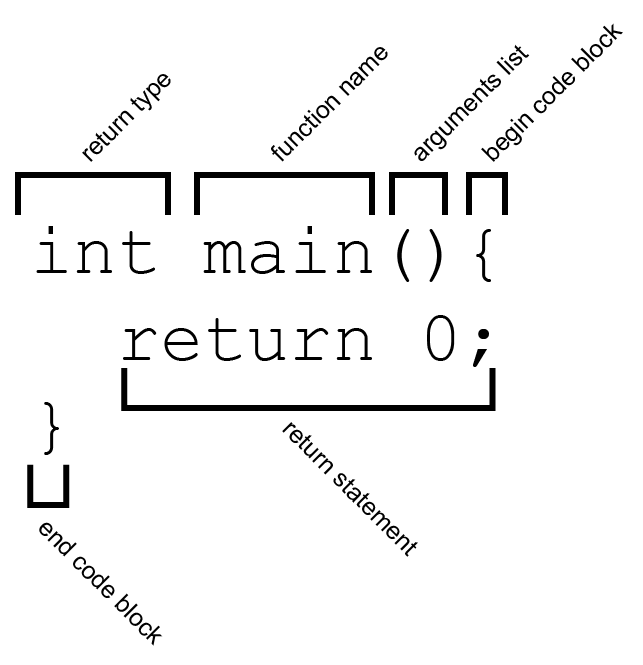
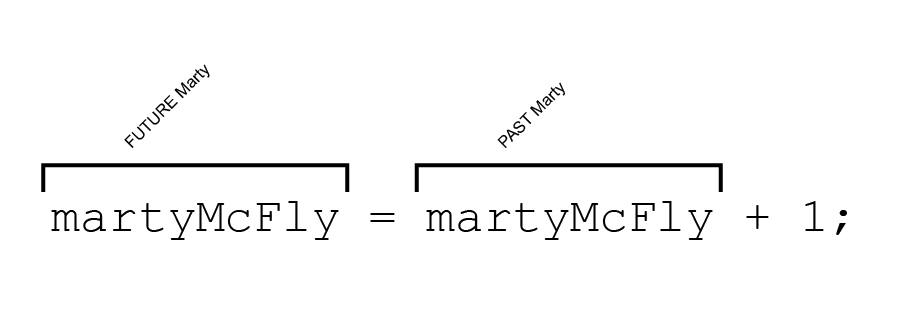
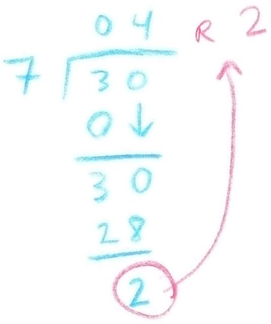

# Chapter 2. C++ Language Basics #

*by [jtnimoy](http://jtnimoy.net)*

> The magician of the future will use mathematical formulas.
>
> **--Aleister Crowley**

##Look Alive!

This chapter introduces you to writing small computer programs using the C++ language. Although I assume very little about your previous knowledge, the literacy you gain from this chapter will directly influence your comprehension in subsequent chapters of the book, as most other topics stand on the shoulders of this one. Furthermore, the lessons herein are cumulative, meaning you can't skip one of the topics or you will get lost. If you get stuck on one of the concepts, please seek help in understanding specifically the part that did not make sense before moving on to the next topic. Following the lessons with this sort of rigor will insure that you will get the most out of OpenFrameworks, but also computers in general.


##Iteration


I did most of my drawing and painting in the mid-nineties, a high school AP art student sporting a long black ponytail of hair shaved with a step, round eyeglasses, and never an article of clothing without spill, fling, smattering, or splotch of Liquitex Basics acrylic paint. Bored out of my mind in economics class, playing with my TI-82 graphing calculator, I discovered something that flipped a light bulb on in my heart. Unlike smaller calculators around my house growing up, the TI-82 had a thick instruction manual. Amidst sections in this manual about trig functions and other dry out-of-reach science, something caught my thirsty, young eye: a sexy black-on-white pyramid with smaller upside-down pyramids infinitely nested inside, shown in Figure 1.


This fractal, the famous [Sierpinski triangle](https://www.wolframalpha.com/input/?i=sierpinski+triangle), accompanied about twenty-five computer instructions making up the full SIERPINS program. I looked closer at the code, seeing a few numeric operations – nothing too advanced, and most of it was commanding words, like "do this", or "if something then do another thing". I was able to key in the code from the book into the graphing calculator and run the program. At first, just a blank LCD panel. Slowly a few random pixels switched to black here and there, not really showing any pattern. After a few more seconds, the scene filled in and I could already see faint outlines of triangles. After a good long time, my calculator finally matched the picture in the book. My mind was officially blown. Certain things did not make sense. What sort of miracle of nature caused such a complex form to come from so little instruction? The screen had over six-thousand pixels in it, so why is it that a mere twenty-five instructions was all it took to create this amazing, organism-like artwork? Whose artwork was it? Might I derive a new work from it? Rarely had I ever seen such a magical reward coming from so little work. I had found my new basics. I felt the need to understand the program because (I decided) it was important. I went back into the code and changed some of the numbers, then ran the program again. The screen went blank, then drew a different picture, only this time, skewed to the left, falling out of the viewport. Feeling more courageous, I attempted to change one of the English instructions, and the machine showed an error, failing to run.


The cycle illustrated in Figure 2 is an infinitely repeating loop that I have had a great pleasure of executing for a couple decades and I still love what I do. Each new cycle never fails to surprise me. As I pursue what it means to create a program, and what it means to create software art, the process of iteratively evolving a list of computer instructions always presents as much logical challenge as it does artistic reward. Very few of those challenges have been impossible to solve, especially with other people available to collaborate and assist, or by splitting my puzzle into smaller puzzles. If you have already written code in another environment like Processing, Javascript, or even HTML with CSS, then this first important lesson might seem too obvious.


For those just now familiarizing themselves with what it means to write small programs, it is important to understand the iterative nature of the code writing process. The anecdote in Figure 3 shows what this process is *not*. Rarely would you ever enter some code into the editor just once, and expect to hit compile and see your finished outcome. It is natural, and commonly accepted for programs to start small, have plenty of mistakes (bugs), and evolve slowly toward a goal of desired outcome or behavior. In fact it is so commonplace that to make the former assumption is a downright programmer's mistake. Even in older days when programs were hand-written on paper, the author still needed to eyeball the code obsessively in order to work out the mistakes, and therefore the process was iterative. In learning the C++ language, I will provide tiny code examples that you will be compiling on your machine. The abnormal part is typing the code from the book into the editor, and (provided your fingers do not slip), the program magically runs. I am deliberately removing the troubleshooting experience in order to isolate out the subject matter of the C++ language itself. Later on, we will tackle the black art of *debugging* as a topic all its own.


##Compiling My First App

Let us start by making the smallest, most immediate C++ program possible, then use the convenient environment to test small snippits of C++ code throughout this chapter. In order to do that, we must have a *compiler*, which is a program that translates some code into an actual runnable app, sometimes referred to as the executable file. C++ compilers are mostly free of charge to download, and in a lot of cases, open source. The apps we generate will not automatically show up in places like Apple's App store, Google Play, Steam, Ubuntu Apps Directory, or Pi Store. Instead, they are your personal, private program files and you will be responsible for manually sharing them later on. In the following chapter *OF Setup and Project Structure*, the compiler will sit on your local computer, able to run offline. For now, we will be impatient and compile some casual C++ on the web using a convenient tool by Sphere Research Labs. Please open your web browser and go to [ideone](http://ideone.com) (http://ideone.com).

You will notice right away that there is an editor already containing some code, but it may be set to another language. Let's switch the language to C++11 if it is not already in that mode. Down at the bottom left of the editor, press the button just to the left of "stdin", as shown in Figure 4. The label for this button could be any number of things.


A menu drops down with a list of programming languages. Please choose C++11, shown in Figure 5.


Notice that the code in the editor changed, and looks something like figure 6.


This is just an empty code template that does nothing, and creates no errors. The numbers in the left hand gutter indicate the line number of the code. Press the green button labeled *Run* and you'll see a copy of the code,  "Success" in the comments, the section labeled *stdin* (standard input) will be empty, and *stdout* (standard output) will also be empty.


###Interlude on Typography

Most fonts on the web are variable width, meaning the letters are different widths and the current eye finds that comfortable to read. Fonts can also be fixed-width, meaning all the letters (even the W and the lowercase i) are all the same width. Whilst this may look funny and quant like a typewriter, it serves a pretty important purpose. A fixed width font makes a block of text into a kind of game board, like chess squares or graphing paper. Computer programming code is generally presented in fixed-width typesetting, because it is a form of ascii-art. The indentation, white space characters, and repetitive patterns are all important to preserve and easily eyeball for comparison. Every coder I know except artist Jeremy Rotsztain uses some manner of monospaced font for their code. Some typeface suggestions are Courier, Andale Mono, Monaco, Profont, Monofur, Proggy, Droid Sans Mono, Deja Vu Sans Mono, Consolas, and Inconsolata. From now on, you will see the font style switch to `this inline style` . . .

```cpp
and this style encased in a block . . .
```

. . . and that just means you are looking at some code.

###Comments

Now please press *Edit* (Figure 7) at the top left of the code editor.


You will see a slightly different editing configuration but the same template code will still be editable at the top. We will now edit the code. Find line 5, where it says:

```cpp
// your code goes here .
```

A line beginning with a double forward slash is called a comment. You may type anything you need to in order to annotate your code in a way you understand. Sometimes a it's useful to “comment out code” by placing two forward-slashes before it, because that deactivates the C++ code without deleting it. Comments in C++ can also take up multiple lines, or insert like a tag. The syntax for beginning and ending comment-mode is different. Everything between the `/* and the */` becomes a comment:


```cpp
/* 
this is a multi-line comment. 
still in comment mode.
*/
```

Please delete the code on line 5 and replace it with the following statement:

```cpp
cout << "Hello World" << endl;
```

This line of code tells the computer to say "Hello World" into an implied text-space known as *standard output* (aka. *stdout*). When writing a program, it is safe to expect *stdout* to exist and that the program can say things in it. Other times, it's just a window pane in your coding tool, only used to troubleshoot.

You may put almost anything between those quotes. The quoted phrase is a called a *string* of text. More specifically, it is a *c-string literal*. We will cover more on strings later in this chapter. In the code, the chunk `cout <<` part means "send the following stuff to stdout in a formatted way." The last chunk `<< endl` means "add a carriage return (end-of-line) character to the end of the hello world message." Finally, at the very end of this line of code, you see a semicolon (;). In C++, semicolons are like a full-stop or period at the end of the sentence. We must type a semicolon after each statement, and usually this is at the end of the line of code. If you forget to type that semicolon, the compile fails. Semicolons are useful because they allow multiple statements to share one line, or a single statement to occupy several lines, freeing the programmer to be flexible and expressive with ones whitespace. By adding a semicolon you ensure that the compiler does not get confused because you help it out and show it where the statement ends.

While you typed, perhaps you noticed the text became multi-colored all by itself. This convenient feature is called *syntax-coloring* and can subconsciously enhance ones ability to read the code, troubleshoot malformed syntax, and assist in searching. Each tool will have its own syntax coloring system so if you wish to change the colors, please expect that it's not the same thing as a word processor. It will not let me assign the font "TRON.TTF" with a glowing aqua color to *just* `endl` (which means end-of-line). Instead, I can choose a special style for a whole category of syntax, and see all parts of my code styled that way as long as it's that type of code. In this case, both `cout` and `endl` are considered keywords and so the tool colors them black. If these things show up as different colors elsewhere, please trust that it's the same code as before. The entire code should now look like this:

```cpp
include <iostream.h>
using namespace std;

int main(){
	cout << "Hello World" << endl;
	return 0;
}
```

Now press the green *ideone it!* button at the bottom right corner and watch the output console, which is the bottom half of the code editor, just above that green button. You will see orange status messages saying things like “Waiting for compilation”, “Compilation”, and “Running”. Shortly after, the program will itself, execute, its output printed. You should see the new message in Figure 8.


If you made it this far, then give yourself a great big hug. You just wrote your first line of C++ code, you analyzed it, compiled it, ran it, and saw the output.

##Beyond Hello World

Now that we've gotten our feet wet, let's go back and analyze the other parts of the code. The first line is an include statement:

```cpp
#include <iostream>
```

Similar to *import* in Java and CSS, `#include` is like telling the compiler to cut and paste some other useful code from a file called *iostream.h* at that position in the file, so you can depend on its code in your new code. In this case, iostream.h *provides* `cout` and `endl` as tools I can use in my code, just by typing their names. In C++, a filename ending in **.h** is called a header file, and it contains code you would include in an actual C++ implementation file, whose filename would end in **.cpp**. There are many standard headers built into C++ that provide various basic services – in fact too many to mention here. If that wasn't enough, it's also commonplace to add an external library to your project, including its headers. You may also define your own header files as part of the code you write, but the syntax is slightly different:

```cpp
#include "MyCustomInclude.h"
```

In OpenFrameworks, double quotes are used to include header files that are not part of the system installation.

###What's with the # ?

It's a whole story, but worth understanding conceptually. The include statement is not really C++ code, it's part of a completely separate compiler pass called *preprocessor*. It happens before your actual programmatic instructions are dealt with. They are like instructions for the code compiler, as opposed to instructions for the computer to run after the compile. Using a pound/hash symbol before these *preprocessor directives*, one can clearly spot them in the file, and for good reason too. They should be seen as a different language in which your real C++ code is interleaved. There aren't many C++ preprocessor directives - they are mostly concerned with herding other code. Here are some you might see.


`#define`
`#elif`
`#else`
`#endif`
`#error`
`#if`
`#ifdef`
`#include`
`#line`
`#pragma`
`#undef`

Let's do an experiment. In the code editor, please comment out the include directive on line 1, then run the code. To comment out the line of code, insert two adjacent forward-slashes at the beginning of the line.

```cpp
//#include <iostream>
```

The syntax coloring will change to all green, meaning it's now just a comment. Run the code by pressing the big green button at the bottom right, and you'll see something new in the output pane.

```
prog.cpp: In function ‘int main()’:
prog.cpp:5:2: error: ‘cout’ was not declared in this scope
  cout << "Hello World" << endl;
  ^
prog.cpp:5:27: error: ‘endl’ was not declared in this scope
  cout << "Hello World" << endl;
                           ^
```

The compiler found an error and did not run the program. Instead, it's showing you  where it got confused in attempt to help you fix it. The first part, *prog.cpp*: tells you the file that contains the error. In this case, ideone.com saved your code into that default file name. Next, it says `In function ‘int main()’`: file showing you the specific section of the code that contains the error, in this case, between the {curly brace} of a function called *main*. (We will talk about functions and curly braces later). On the next line, we see `prog.cpp:5:2:`. The 5 is how many lines from the top of the file, and 2 is how many characters rightward from the beginning of the line. Next, we see `error: ‘cout’ was not declared in this scope`. That is a message describing what it believes it wrong in the code. In this case, it's fairly correct. iostream.h is gone, and therefore no `cout` is provided to us, and so when we try to send "Hello World", the compile fails. On the next couple of lines, you see the line of code containing the fallacious `cout`, plus an extra little up-caret character on the line beneath it, and that is supposed to be an arrow pointing at a character in the code. In this case, the arrow should be sitting beneath the 'c' in `cout`. The system is showing you visually which token is at fault. A second error is shown, and this time, the compiler complains that there is no endl. Of course, we know that in order to fix the error, we need to include <iostream.h> so let us do that now. Please un-comment line 1 and re-run the code.

```cpp
#include <iostream>
```

When using OpenFrameworks, you have choice of tools and platforms. Each one shows you an error in a different way. Sometimes the editor will open up and highlight the code for you, placing an error talk bubble for more info. Other times, the editor will show nothing, but the compile output will show a raw error formatted similar to the one above. Whilst sometimes useful that we receive several errors from a compile, it can save a lot of grief if you focus on understanding and fixing the very first error that got reported. After fixing the top error, it is likely that all subsequent errors will elegantly disappear, having all been covered by your first fix.  By commenting out that single line of code at the top, we caused two errors.

###Namespaces at First Glance

Moving on to line 2, we see:

```cpp
using namespace std;
```

Let's say I'm in the 3rd grade of elementary school and I hop on a school bus to get there each morning. As I walk slowly down the aisle, different students notice my unsightly leg braces and tell me (in Southern accents) "Seat's taken" or "You can't sit here". Finally, I find a seat on the bus next to Jenny. I just experienced conflict and resolution in *Seat Space*, finally discovering my unique place on the bus.

Let's say you join a social website and it asks you to choose a username. My name is Joshua Nimoy, username might be JNIMOY. I submit the page and it returns an error, telling me that username is already taken, and I have to choose another, since my father, Joseph Nimoy, registered before I did and he's got JNIMOY. And so I must use my middle initial T, and create a more unique username, JTNIMOY. I just created and resolved a *namespace conflict*. A namespace is a group of unique names - none are identical. It's possible to have identical names, as long as they are a part of two separate namespaces. Namespaces help programmers avoid stepping on each other's toes by overwriting one another's symbols or hogging the good names. Namespaces also provide a neat and tidy organization system to help us find what we're looking for. In OpenFrameworks, everything starts with `of` . . . like `ofSetBackground` and `ofGraphics`. This is one technique to do namespace separation because it's less likely that any other names created by other programmers would begin with `of`. The same technique is used by OpenGL. Every name in the OpenGL API (Application Programming Interface) begins with `gl` like `glBlendFunc` and `glPopMatrix`. In C++ however, it is not necessary to have a strictly disciplined character prefix for your names, as the language provides its own namespacing syntax. In line 2, `using namespace std;` is telling the compiler that this .cpp file is going to use all the names in the `std` namespace. Spoiler-alert! those two names are `cout` and `endl`. Let us now do an experiment and comment out line 2, then run the code. What sort of error do you think the compiler will return?

```cpp
/* using namespace std; */
```

It's a very similar error as before, where it cannot find `cout` or `endl`, but this time, there are suggested alternatives added to the message list.

```
prog.cpp:5:2: note: suggested alternative:
In file included from prog.cpp:1:0:
/usr/include/c++/4.8/iostream:61:18: note:   ‘std::cout’
   extern ostream cout;  /// Linked to standard output
                  ^
```

The compiler says "Hey, I searched for `cout` and I did find it in one of the namespaces included in the file. Here it is. `std::cout`" and in this case, the compiler is correct. It wants us to be *more explicit* with the way we type `cout`, so we express its namespace `std` (standard) on the left side, connected by a double colon (::). it's sort of like calling myself `Nimoy::Joshua`. Continuing our experiment, edit line 5 so that `cout` and `endl` have explicit namespaces added.

```cpp
std::cout << "Hello World" << std::endl;
```

When you run the code, you will see it compiles just fine, and succeeds in printing "Hello World" even the line that says `using namespace std;` is still commented out. Now imagine you are writing a program to randomly generate lyrics of a song. Obviously, you would be using `cout` quite a bit. Having to type `std::` before all your `cout`s would get really tedious, and one of the reasons a programming language adds these features is to reduce typing. So although line 2 `using namespace std;` was not necessary, having it in place (along with other `using namespace` statements) can keep ones C++ code easy to type and read, through implied context.

Say I'm at a Scrabble party in Manhattan, and I am the only Josh. People can just call me Josh when it's my turn to have a go at Scrabble. However, if Josh Noble joins us after dinner, it gets a bit confusing and we start to call the Josh's by first and last name for clarity. In C++, the same is also true. It's alright to have two different `cout` names, one from the  `std` namespace, and another from the `improved` namespace, as long as both are expressed with explicit namespaces; `std::cout` and `improved::cout`. In fact, the compiler will complain if you don't.


##Functions

Moving on, let us take a look at line 4:

```cpp
int main() {
```

This is the first piece of code that has a beginning and an end, such that it "wraps around" another piece of code. But more importantly, a function *represents* the statements enclosed within it. The closing end of this *function* is the closing curly brace on line 7:

```cpp
}
```

In C++, we enclose groups of code statements inside functions, and each function can be seen as a little program inside the greater program, as in my laughably gross oversimplification in figure 9.


Each of these functions has a name by which we can call it. To call a function is to execute the code statements contained inside that function. The basic convenience in doing this is less typing, and we will talk about the other advantages later. Like a board game, a program has a starting position. More precisely, the program has an *entrypoint* expected by the compiler to be there. That entrypoint is a function called *main*. The code you write inside the *main* function is the first code that executes in your program, and therefore it is responsible for calling any other functions in your program. Who calls your *main* function? The operating system does! Let's break down the syntax of the main function in this demo. Again, for all you Processing coders, this is old news.



When defining a function, the first token is the advertised return type. Functions can optionally return a value, like an answer to a question, a solution to a problem, the result of a task, or the product of a process. In this case, *main* promises to return an `int`, or *integer* type, which is a whole number with no fraction or decimal component. Next token is the name of our function. The system expects the word "main" in all lower-case, but you will later define your own functions and we will get into naming. Next is an opening and closing parenthesis. Yes, it seems kind of strange to have it there, since there is nothing inside it. Later, we will see what goes in there - but never leave out the pair of parentheses with functions because in a certain way, that is the major hint to the human that it's a function. In fact, from now on, when I refer to a function by name, I'll suffix it with a ( ), for example `main()`.

Next, we see an opening curley bracket. Sometimes this opening curley bracket is on the same line as the preceding closing parenthesis, and other times, you will see it on its own new line. It depends on the personal style of the coder and both are fine. Inbetween this opening curley bracket and the closing one, we place our code statements that actually tell the computer to go do something. In this example, I only have one statement, and that is the required `return`. If you leave this out for a function whose return type is `int` then the compiler will complain that you broke your promise to return an int. In this case, the operating system interprets a 0 as "nothing went wrong". Just for fun, see what happens when you change the 0 to a 1, and run the code.

##Custom Functions

We will now define our own function and make use of it as a word template. Type the sample code into your editor and run it.

```cpp
#include <iostream>
using namespace std;

void greet(string person){
	cout << "Hi there " << person << "." << endl;
}

int main() {
	greet("moon");
	greet("red balloon");
	greet("comb");
	greet("brush");
	greet("bowl full of mush");
	return 0;
}
```

The output shows a familiar bedtime story.

```
Hi there moon.
Hi there red balloon.
Hi there comb.
Hi there brush.
Hi there bowl full of mush.
```

In this new code, notice the second function `greet()` which looks the same but different from `main()`. It has the same curly brackets to hold the code block, but the return type is different. It has the same pair of parentheses, but this time there is something inside. And what about that required return statement? The *void* keyword is used in place of a return type when a function does not return anything. So, since `greet()` has a *void* return type, the compiler will not complain should you leave out the `return`. In the parentheses, you see `string person`. This is a parameter, an input-value for the function to use. In this case, it's a bit like find-and-replace. Down in `main()`, you see I call `greet()` five times, and each time, I put a different string in quotes between the parentheses, and those are *arguments*.

As an aside, to help in the technicality of discerning between when to call them *arguments* and when to call them *parameters*, see this code example:

```cpp

void myFunction(int parameter1, int parameter2){
	//todo: code
}

int main(){
	int argument1 = 4;
	int argument2 = 5;
	myFunction(argument1,argument2);
	return 0;
}

```

Getting back to the previous example, those five lines of code are all ***function calls***. They are telling `greet()` to execute, and passing it the one string argument so it can do its job. That one string argument is made available to `greet()`'s inner code via the argument called `person`. To see the order of how things happen, take a look at Figure 11.


The colorful line in Figure 11 is the path drawn by an imaginary playback head that steps over the code as it executes. We start at the blue part and go in through the main entrypoint, then encounter `greet()`, which is where a *jump* happens. As the line turns green, it escapes out of `main()` temporarily so it can go follow along `greet()` for a while. About where the line turns yellow, you see it finished executing the containing code inside `greet()` and does a second jump (the return) this time going back to the previous saved place, where it continues to the next statement. The most obvious advantage we can see in this example is the reduction of complexity from that long `cout` statement to a simple call to `greet()`. If we must call `greet()` five times, having the routine *encapsulated* into a function gives it convenience power. Let's say you wanted to change the greeting from "Good night" to "Show's over ". Rather than updating all the lines of code you cut-and-pasted, you could just edit the one function, and all the uses of the function would change their behavior along with it, in a synchronized way. Furthermore, code can grow to be pretty complex. It helps to break it down into small routines, and use those routines as your own custom building blocks when thinking about how to build the greater software. By using functions, you are liberated from the need to meticulously represent every detail of your system, and therefore a function is one kind of *abstraction* just like abstraction in art. This sort of abstraction is called *encapsulation of complexity* because it's like taking the big complex thing and putting it inside a nice little capsule, making that big complex thing seem smaller and simpler. It's a very powerful idea - not just in code, but in the growth of civilization, and even in the evolution of life on Earth.

##Encapsulation of Complexity

Imagine actor Laurence Fishburne wearing tinted Pince Nez glasses, offering you two options that are pretty complicated to explain. On the one hand, he is willing to help you escape from the evil Matrix so that you may fulfill your destiny as the hacker hero but it involves living life on life's terms and that is potentially painful but whatever, the story must go on and btw, there is a pretty girl. On the other hand, he is also willing to let you forget this all happened, and mysteriously plant you back in your tiny apartment where you can go on living a lie, none the wiser. These two options are explained in the movie *The Matrix* and then the main character is offered the choice in the form of colored pills, as a way to simplify an otherwise wordy film scenario. The two complex choices are encapsulated into a simple analogy that is much easier for movie audiences to swallow. See Figure 12.


Rather than repeating back the entire complicated situation, Neo (the main character) needed only to swallow one of the pills. Even if it were real medicine, the idea of encapsulating complexity still applies. Most of us do not have the expertise to practice medicine in the most effective way, and so we trust physicians and pharmacologists to create just the right blend of just the right herbs and chemicals. When you swallow a pill, it is like calling that function because you have the advantage of not needing to understand the depths of the pill. You simply trust that the pill will cause an outcome. The same is true with code. Most of the time, a function was written by someone else and if that person is a good developer, you are free to remain blissfully ignorant of their function's inner workings as long as you grasp how to properly call their function. In this way, you are the *higher level* coder, meaning that you simply call the function but you did not write it. Someone who creates a project in OpenFrameworks is sitting on the shoulders of the OpenFrameworks layer. OpenFrameworks sits on the shoulders of the OpenGL Utility Toolkit, which sits on OpenGL itself, and so on. In other words, an OpenFrameworks project is a *higher level* application of C++, a language with a reputation for *lower level* programming. As illustrated in Figure 13, I sometimes run into a problem when I tell people I wrote an interactive piece in C++.


There are a few advantages to using C++ over the other options (mostly scripting) for your new media project. The discussion can get quite religious (read: heated) among those who know the details. If you seek to learn C++, then usually it is because you seek faster runtime performance, because C++ has more libraries that you can snap in to your project, or because your mentor is working in that language. An OF project is considered higher level because it is working with a greater encapsulation of complexity, and that is something to be proud of.

## Variables (part 1)

> A “thing” is a “think”, a unit of thought
> 
> -- Alan Watts


Please enter the following program into ideone and run it.

```cpp
#include <iostream>
using namespace std;

int main(){
	cout << "My friend is " << 42 << " years old." << endl;
	cout << "The answer to the life the universe and everything is " << 42 << "." << endl;
	cout << "That number plus 1 is " << (42+1) << "." << endl;
	return 0;
}
```

The output looks like this:

```
My friend is 42 years old.
The answer to the life the universe and everything is 42.
That number plus 1 is 43.
```

We understand from a previous lesson that stuff you put between the `<<` operators will get formatted into the `cout` object, and magically end up in the output console. Notice in the last line, I put a bit of light arithmetic (42+1) in-between parentheses, and it evaluated to 43. That is called an *expression*, in the mathematics sense. These three lines of code all say something about the number 42, and so they all contain a *literal* integer. A literal value is the contents typed directly into the code; some would say "hard wired" because the value is fixed once it is compiled in with the rest.

If I want to change that number, I can do what I know from word processing, and "find-and-replace" the 42 to a new value. Now what if I had 100,000 particles in a 3d world. Some have 42's that need changing, but other 42's that should not be changed? Things can get both heavy and complex when you write code. The most obvious application of *variables* is that they are a very powerful find-and-replace mechanism, but you'll see that variables are useful for more than that. So let's declare an integer at the top of the code and use it in place of the literal 42's.

```cpp
#include <iostream>
using namespace std;

int main(){
	
	int answer = 42;
	
	cout << "My friend is " << answer << " years old." << endl;
	cout << "The answer to the life the universe and everything is " << answer << "." << endl;
	cout << "That number plus 1 is " << (answer+1) << "." << endl;
	return 0;
}
```

Now that I am using the variable `answer`, I only need to change that one number in my code, and it will show up in all three sentences as 42. That can be more elegant than find-and-replace. Figure 18 shows the syntax explanation for declaring and initializing a variable on the same line.


It is also possible to declare a variable and initialize it on two separate lines. That would look like:

```cpp
int answer;
answer = 42;
```

In this case, there is a moment after you declare that variable when its answer may be unpredictable and glitchy because in C (unlike Java), fresh variables are not set to zero for free - you need to do it. If you don't, the variable can come up with unpredictable values - computer memory refuse from the past. So, unless you intend to make glitch art, please always initialize your variable to some number upon declaring it, even if that number is zero.

### Naming your variable

Notice the arrow below saying "must be a valid name". We invent new names to give our namespaces, functions, variables, and other constructs we define in code (classes, structs, enums, and other things I haven't taught you). The rules for defining a new identifier in code are strict in a similar way that choosing a password on a website might be.

+ Your identifier must contain only letters, numbers, and underscores.
+ it cannot begin with a number, but it can certainly begin with an underscore.
+ The name cannot be the same as one of the language keywords (for example, the word `void`)

The following identifiers are okay.

```
a
A
counter1
_x_axis
perlin_noise_frequency
_         // a single underscore is fine
___       // several underscores are fine
```

Notice lowercase a is a different identifier than uppercase A. Identifiers in C++ are case-sensitive.
The following identifiers are not okay.

```cpp
1infiniteloop         // should not start with a number
transient-mark-mode   // dashes should be underscores
@jtnimoy              // should not contain an @
the locH of sprite 1  // should not contain spaces
void                  // should not be a reserved word
int                   // should not be a reserved word
```

naming your variable `void_int`, although confusing, would not cause any compiler errors because the underscore joins the two keywords into a new identifier. Occasionally, you will find yourself running into `unqualified id` errors. Here is a list of C++ reserved keywords to avoid when naming variables. C++ needs them so that it can provide a complete programming language.

```
alignas alignof and and_eq asm auto bitand bitor bool break case catch
char char16_t char32_t class compl const constexpr const_cast continue
decltype default delete do double dynamic_cast else enum explicit
export extern false final float for friend goto if inline int long
mutable namespace new noexcept not not_eq nullptr operator or or_eq
override private protected public register reinterpret_cast return
short signed sizeof static static_assert static_cast struct switch
template this thread_local throw true try typedef typeid typename
union unsigned using virtual void volatile wchar_t while xor xor_eq
```

### Naming conventions

> Differences of habit and language are nothing at all if our aims are identical and our hearts are open.
>
> **--Albus Dumbledore**


Identifiers (variables included) are written with different styles to indicate their various properties, such as type of construct (variable, function, or class?), data type (integer or string?), scope (global or local?), level of privacy, etc. You may see some identifiers capitalized at the beginning and using `CamelCase`, whilst others remain all `lower_case_using_underscores_to_separate_the_words`. Global constants are found to be named with `ALL_CAPS_AND_UNDERSCORES`. Another way of doing lower-case naming is to start with a lowercase `letterThenCamelCaseFromThere`. You may also see a hybrid, like `ClassName__functionName__variable_name`. These different styles can indicate different categories of identifiers.

More obsessively, programmers may sometimes use what is affectionately nicknamed *Hungarian Notation* adding character badges to an identifier to say things about it but also reduce the legibility, for example `dwLightYears` and `szLastName`. Naming conventions are not set in stone, and certainly not enforced by the compiler. Collaborators generally need to agree on these subtle naming conventions so that they don't confuse one another, and it takes discipline on everyone's part to remain consistent with whatever convention was decided. The subject of naming convention in code is still a comically heated debate amongst developers, just like deciding which line to put the curly brace, and whether to use tabs to indent. Like a lot of things in programming, someone will always tell you you're doing it wrong. That doesn't necessarily mean you are doing it wrong.

### Variables change

We call them variables because their values *vary* during runtime. They are most useful as a bucket where we put something (let's say water) for safe keeping. As that usually goes, we end up going back to the bucket and using some of the water, or mixing a chemical into the water, or topping up the bucket with more water, etc. A variable is like an empty bucket where you can put your stuff. Figure 19 shows a bucket from the game *Minecraft*.


If a computer program is like a little brain, then a variable is like a basic unit of remembrance. Jotting down a small note in my sketchbook is like storing a value into a variable for later use. Let's see an example of a variable changing its value.

```cpp
#include <iostream>
using namespace std;

int main(){
	int counter = 0;
	cout << counter;
	counter = 1;
	cout << counter;
	counter = 2;
	cout << counter;
	counter = 3;
	cout << counter;
	counter = 4;
	cout << counter;
	counter = 5;
	cout << counter;
	return 0;
}
```

The output should be `012345`. Notice the use of the equals sign. It is different than what we are accustomed to from arithmetic. In the traditional context, a single equal sign means the expressions on both sides would evaluate to the same value. In C, that is actually a double equal (==) and we will talk about it later. A single equal sign means "Solve the expression on the right side and store the answer into the variable named on the left side". It takes some getting used to if you haven't programmed before. If I were a beginning coder (as my inner child is perpetually), I would perhaps enjoy some alternative syntax to command the computer to store a value into a variable. Something along the lines of: `3 => counter` as found in the language *ChucK* by Princeton sound lab, or perhaps something a bit more visual, as my repurposing of the Minecraft crafting table in figure 20.


The usefulness of having the variable name on the left side rather than the right becomes apparent in practice since the expressions get get quite lengthy! Beginning a line with `varname =` ends up being easier for the eyeball to scan because it's guaranteed to be 2 symbols long before starting in on whatever madness you plan on typing after the equals sign.

Analyzing the previous code example, we see the number increments by 1 each time before it is output. I am repeatedly storing literal integers into the variable. Since a programming language knows basic arithmetic, let us now try the following modification:

```cpp
#include <iostream>
using namespace std;

int main(){
	int counter = 0;
	cout << counter;
	counter = counter + 1;
	cout << counter;
	counter = counter + 1;
	cout << counter;
	counter = counter + 1;
	cout << counter;
	counter = counter + 1;
	cout << counter;
	counter = counter + 1;
	cout << counter;
	return 0;
}
```

The output should still be `012345`. By saying `counter = counter + 1`, I am incrementing `counter` by 1. More specifically, I am using `counter` in the right-hand "addition" expression, and the result of that (one moment later) gets stored into `counter`. This seems a bit funny because it talks about `counter` during two different times. It reminds me of the movie series, *Back to the Future* in which Marty McFly runs into past and future versions of himself. See Figure 21.



Great Scott, that could make someone dizzy! But after doing it a few times, you'll see it doesn't get much more complicated than what you see there. This is a highly *practical* use of science fiction, and you probably aren't attempting to challenge the fabric of spacetime (unless you are Kyle McDonald, or maybe a Haskell coder <!-- i mean these things as a high compliment, not as mockery -->). The point here is to modify the contents of computer memory, so we have `counter` from one instruction ago, in the same way that there might already be water in our bucket when we go to add water to it. Figure 22 shows `bucket = bucket + water`.


Incrementing by one, or adding some value to a variable is in fact so commonplace in all programming that there is even syntactic sugar for it. *Syntactic Sugar* is a redundant grammar added to a programming language for reasons of convenience. It helps reduce typing, can increase comprehension or expressiveness, and (like sugar) makes the programmer happier. The following statements all add 1 to `counter`.

```cpp
counter = counter + 1; // original form
counter += 1;          // "increment self by" useful because it's less typing.
counter++;             // "add 1 to self" useful because you don't need to type a 1.
++counter;             // same as above, but with a subtle difference.
```

Let's test this in the program.

```cpp
#include <iostream>
using namespace std;

int main(){
	int counter = 0;
	cout << counter;
	counter++;
	cout << counter;
	counter++;
	cout << counter;
	counter++;
	cout << counter;
	counter++;
	cout << counter;
	counter++;
	cout << counter;
	return 0;
}
```

Yes, it's a lot less typing, and there are many ways to make it more concise. Here is one way.

```cpp
#include <iostream>
using namespace std;

int main(){
	int counter = 0;
	cout << counter++;
	cout << counter++;
	cout << counter++;
	cout << counter++;
	cout << counter++;
	cout << counter++;
	return 0;
}
```

The answer is still `012345`. The postfix incrementing operator will increment the variable even while it sits inside an expression. Now let's try the prefix version.

```cpp
#include <iostream>
using namespace std;

int main(){
	int counter = 0;
	cout << ++counter;
	cout << ++counter;
	cout << ++counter;
	cout << ++counter;
	cout << ++counter;
	cout << ++counter;
	return 0;
}
```

If you got the answer `123456`, that is no mistake! The prefix incrementing operator is different from its postfix sister in this very way. With `counter` initialized as 0, `++counter` would evaluate to 1, whilst `counter++` would still evaluate to 0 (but an incremented version of `counter` would be left over for later use). The output for the following example is `1112`.

```cpp
#include <iostream>
using namespace std;

int main(){
	int counter = 0;
	cout << ++counter; // 1: increments before evaluating
	cout << counter;   // 1: has NOT changed.
	cout << counter++; // 1: increments after evaluating
	cout << counter;   // 2: evidence of change.
	return 0;
}
```

For arithmetic completeness, I should mention that the subtractive *decrementing* operator (counter--) also exists. Also, as you might have guessed by now, if one can say `counter + 1`, then a C compiler would also recognize the other classic arithmetic like `counter - 3` (subtraction), `counter * 2` (asterisk is multiplication), `counter / 2` (division), and overriding the order of operations by using parentheses, such as `(counter + 1) / 2` evaluating to a different result than `counter + 1 / 2`. Putting a negative sign before a variable will also do the right thing and negate it, as if it were being subtracted from zero. C extends this basic palette of maths operators with boolean logic and bitwise manipulation; I will introduce them in Variables part 2.

There are a few more essentials to learn about variables, but we're going to take what we've learned so far and run with it in the name of fun. In the meantime, give yourself another pat on the back for making it this far! You learned what variables are, and how to perform basic arithmetic on them.

## If-Then

> Life is a multiple-choice, choose-your-own-adventure. *--my girlfriend Becca*

Imagine riding your bicycle in the streets of your city. When you encounter intersections or forks in the road, you must decide whether to turn, go straight, or turn around based on where you are going, your urgency in getting home, and other places you may want to stop at. The next day, you may take the same route but end up taking very different streets based on the domino effect of your decisions.

Your ability to judge a situation and change your behavior based on your analysis is a kind of prediction behavior that defines intelligence. A computer program can also stop, analyze, and decide how to act in a more simplified way. *Conditionals* or *branching* in code are what provides this kind of simple yet useful intelligence. With just a little bit if *If-Then-Else* in your code, you can automate very complex decision making.

Figure 23 shows a generative, interactive cluster of branching neurons coded in OpenFrameworks for the CLOUDS Interactive Documentary. 


In beginning to understand how code branches, let's imagine the code is a shopping list (code I run on myself). I've been sent to the supermarket by my grandma Ceil to pick up ingredients for *Kreplach*, the (Ashkenazi) Jewish wonton. We have family visiting from Closter, NJ and since they had the chutzpah to schlep all the way to Brighton Beach, we're going to give them the works - kugel, brisket, and even tzibele kichel to nosh while she finishes cooking (instead of the stale hamantaschen from last Purim). But the only job I have is buying the ingredients for Kreplach. Here is the shopping list:

```
flour
kosher salt
dozen giant brown organic eggs
1 bottle corn oil
4 sweet onions
ground beef
parsley
pepper
garlic
potatoes
scallions
carrots
```

An experienced shopper knows that products and preferred brands are not always in stock, and so we notate the shopping list with alternative purchases in case the primary preference is not available.

```
Heckers unbleached all purpose flour (pillsbury or gold medal would be fine)
Morton Kosher Salt
dozen giant brown organic eggs (white eggs ok too)
1 bottle Mazola corn oil
4 sweet onions (white onions would be acceptable)
ground beef (ground chicken also ok, but NO traif!)
parsley
pepper
garlic
potatoes (red rose, white rose, yukon gold) NOT Idaho or Russet, not too much shmutz
scallions (chives will do but call me)
carrots
```

Although the above is more realistically how one would express conditionals in a shopping list (placing them after the primary product topic), let us refactor the shopping list to C-style conditionals by using indentation, and by "wrapping" code inside some if-braces.

```
if ( they have Heckers unbleached all purpose flour ){
	get that;
}else if( they only have Heckers BLEACHED flour){
	i'll settle for that over the other brands;
}else{
	get the pillsbury or gold metal brands;
}

get Morton Kosher Salt;

if ( there are giant brown organic eggs ){
	get a dozen of those;
}else{
	get a dozen of whatever eggs;
}

get 1 bottle Mazola corn oil;

if ( there are sweet onions ){
	get 4 of those;
}
//otherwise do nothing, I have white onions in the apartment.

if(the butcher has chop meat AND that meat is not traif AND (it is chicken or it is beef) ){
	get 2 lb of it;
}else{
	Boychik, call me and i'll direct you another kosher butcher in our hood;
}

get parsley;
get pepper;
get garlic;

if(they have red rose, white rose, or yukon potatoes and they don't have a lot of shmutz){
	get 8 of them;
}

if(they don't have scallions){
	get chives;
}else{
	get scallions;
}

get carrots;

```

Perhaps you noticed a pattern in the above *pseudo-code*, where I define a bracing structure that looks similar to a function in that it has parentheses and curly braces. Those are if-then-else statements, and they are a type of *flow control*. Figure 24 explains the parts.


The part labelled `test` is a *boolean logic* expression, and that means it ultimately results in a TRUE or FALSE answer. Let us look at some real code to see how a true or false test looks in context.

```cpp
#include <math.h>
#include <iostream>
using namespace std;

int main(){
	int counter = 0;
	
	counter++;
	cout << counter;
	if(counter > 1){
		cout << " is greater than 1";
	}
	cout << endl;

	counter++;
	cout << counter;
	if(counter > 1){
		cout << " is greater than 1";
	}
	cout << endl;

	counter++;
	cout << counter;
	if(counter > 1){
		cout << " is greater than 1";
	}
	cout << endl;

	return 0;	
}
```

Each time, I am checking to see if `counter` is greater than 1, and if that is the case, then a bit of extra text gets printed to the console. If you run this code (and I highly encourage you to do so), you would see the following output.

```
1
2 is greater than 1
3 is greater than 1
```

The first time it evaluates `counter > 1`, the result is false, and so the indented code does not execute. There are a couple other pieces of the if-structure worth introducing. One important one is `else`, which opens up a second block of code to execute if the condition is false.

```cpp

//this code happens regardless

if(true){
	// this code happens if the condition is true
}else{
	// this code happens if it is false
}

//this code happens regardless

```

This is different from simply putting an un-braced line of code beneath the if-clause since that free-roaming line of code would execute *whether or not* the condition were true. So `else` turns out to be pretty convenient. Another similar piece is `else if` that allows you to cascade your if-then clauses in a way similar to CSS.

```cpp

if(condition1){
	// this code happens if condition1 is TRUE, then the rest is skipped.
}else if(condition2){
	// this code happens if condition1 was FALSE, however condition2 is TRUE.
}else if(condition3){
	// this code happens if condition2 and condition1 were both FALSE, however condition3 is TRUE.
}else{
	// this code happens if none of the 3 conditions are true
}

```

Using `else if`, it's easy to build a flexible filter system for decision making.

### Syntactic Sugar for Conditionals

The following is debated as something worth avoiding by folks like JSLint (who are also strict about whitespace). The reason I introduce it here is because you'll see it in OpenFrameworks related code, and I want you to recognize what you are seeing. If-statements can be expressed more concisely by using the single-line syntax, which is less flexible.

```cpp
if (counter > 1) cout << "yes, it's greater";
cout << "... this line will always execute regardless." endl;
```

An if-statement with no curly braces will only "limit" the one immediately following line of code. Even with the other snap-in parts, the same "next line only" rules apply.

```cpp
if (counter > 1) cout << "yes, it's greater";
else if (counter < 10) cout << "well, it's still smaller than 10";
else cout << "The counter was outside the 2-10 range.";
cout << "... this line will always execute regardless." endl;
```

The above code will do the exact same thing as:

```cpp
if (counter > 1) {
	cout << "yes, it's greater";
} else if (counter < 10) {
	cout << "well, it's still smaller than 10";
} else {
	cout << "The counter was outside the 2-10 range.";
}
```

You can even mix and match which parts of the clause are "braced" and which ones are one-liners.
If at all possible, I recommend using the fully braced syntax for all new code in the name of fast eyeball scanning. There is also something called a *ternary operator* that looks like `a > b ? x : y`. I'll let you google that on your own if you are genuinely curious, but I should discourage the use of ternary-ifs as well because they are esoteric, not terribly portable, difficult to scale or nest, and can get confusing fast. On the other hand, I do recommend you get to know ternaries in case you run into someone else's.

### Inequality Operators

So far, I've glossed over that part that goes `counter > 1`. Perhaps you recall a moment in third grade when the teacher taught you the "pacman" rule of inequality, where greedy pacman wants to go chomp the bigger number, so he faces in that direction. Comparison operators in C are based on that.

```cpp
a > b // a is greater than b
a < b // a is less than b
a >= b // a is greater-than-or-equal-to b
a <= b // a is less-than-or-equal-to b
a == b // a is equal to b
a != b // a is not equal to b
```
You will notice the use of double-equal sign to mean the original thing you thought an equal sign was supposed to be used for. A common mistake for beginning coders is the blending between single and double equal signs. Please take the time to know this difference because it will save you some mind-numbingly mysterious errors in the future.

### Boolean Logic

Inequalities can be joined together with logical operators called AND, OR, and NOT, which do much the same thing they are already doing in natural English. AND is typed out as the `&&` operator, while OR is the `||` operator. NOT is a prefixed exclamation mark, and it inverts the truth state of an expression. Here are some boolean logic expressions.

```cpp
true || false             // true
false || false            // false
true || false || false    // true

false && true             // false
true && true              // true
false && false            // false

!true                     // false
!false                    // true

true && !(true || false)  // false
false || true && !false   // true
```

"Boolean" is named after George Boole, one of the fathers of computer science who worked out this sort of true/false maths. You'll find boolean logic in everything  partly because it powers the if-then clauses. The keywords `true` and `false` are considered *global constants*. Conveniently, any non-zero number qualify as true when placed in a boolean context, whilst all zero values qualify as false. In that way, you might set up your arithmetic to land on a zero or non-zero in formulating a testing expression for your if-then clause. In the following example of a conditional, you'll see boolean logic operators used to join numeric comparison.

```cpp
if (counter > 10 && counter < 20) {
	cout << "it's within the 10-20 range";
} else if (counter <= 0) {
	cout << "it's zero or less";
} else {
	cout << "all other cases";
}
```

### Nesting

If-then clauses may also be *nested* meaning you can place an entire if-then clause inside one of the code blocks of another. Of course, the indentation needs to observe proper recursion.

```cpp

if( counter > 30 ){
	
	if(counter > 50){
		// todo: do something
	}
	
}else{

	if(counter < 0){
		
		if(counter < -10){
			//todo: do something
		}
		
	}else{
		//todo: do something else
	}
	
}
```

The term *nesting* is the same concept as the Matryoshka doll, as shown in Figure 25. You can place the hollow Russian dolls inside one another until it appears like there is only one doll. It's trippy because of the concentric modules (recursion) but it is incredibly useful in crafting an algorithm.


**[JTN: this needs copyleft attribution and highest res version needs to be archived]**


## Looping

You may have noticed that the recent C++ example code had a lot of cutting and pasting in it. This brute-force way of forging repetitive behavior is not as flexible, and nowhere near as concise as simply telling your code to loop.

```cpp
#include <math.h>
#include <iostream>
using namespace std;

int main(){
    int counter = 0;

	while(true){
    	counter	++;
	    cout << counter << ", ";
	}
	
    return 0;   
}
```

If you run this code, the output starts like this . . .

```
1, 2, 3, 4, 5, 6, 7, 8, 9, 10, 11, 12, 13, 14, 15, 16, 17, 18, 19, 20,
21, 22, 23, 24, 25, 26, 27, 28, 29, 30, 31, 32, 33, 34, 35, 36, 37,
38, 39, 40, 41, 42, 43, 44, 45, 46, 47, 48, 49, 50, 51, 52, 53, 54,
55, 56, 57, 58, 59, 60, 61, 62, 63, 64, 65, 66, 67, 68, 69, 70, 71,
72, 73, 74, 75, 76, 77, 78, 79, 80, 81, 82, 83, 84, 85, 86, 87, 88,
89, 90, 91, 92, 93, 94, 95, 96, 97, 98, 99, 100, 101, 102, 103, 104,
105, 106, 107, 108, 109, 110, 111, 112, 113, 114, 115, 116, 117, 118,
119, 120, 121, 122, 123, 124, 125, 126, 127, 128, 129, 130, 131, 132,
133, 134, 135, 136, 137, 138, 139, 140, 141, 142, 143, 144, 145, 146,
147, 148, 149, 150, 151, 152, 153, 154, 155, 156, 157, 158, 159, 160,
161, 162, 163, 164, 165, 166, 167, 168, 169, 170, 171, 172, 173, 174,
175, 176, 177, 178, 179, 180, 181, 182, 183, 184, 185, 186, 187, 188,
189, 190, 191, 192, 193, 194, 195, 196, 197, 198, 199, 200, 201, 202,
203, 204, 205, 206, 207, 208, 209, 210, 211, 212, 213, 214 . . .
```

. . . and continues to execute until ideone decides to kill the process (force quit) the program prematurely. Truth be told, if you were running the very same app directly on your laptop as you would be doing in a normal OpenFrameworks situation, the program would run forever - until the computer runs out of resources, reboots, or you kill the process yourself. The reason it keeps incrementing `counter` then prints its value to the console infinitely is because I placed a `true` into the parentheses. Figure 26 explains each part of the simple yet powerful `while` clause.


Normally, you would not want your program to simply loop forever. Let's modify the code so that the loop knows to stop after hitting 100.


```cpp
while(counter < 100){
	counter	++;
    cout << counter << ", ";
}
```

I changed the contents of the `while`'s conditional expression so that it will only loop up to 100. The output is:

```
1, 2, 3, 4, 5, 6, 7, 8, 9, 10, 11, 12, 13, 14, 15, 16, 17, 18, 19, 20,
21, 22, 23, 24, 25, 26, 27, 28, 29, 30, 31, 32, 33, 34, 35, 36, 37,
38, 39, 40, 41, 42, 43, 44, 45, 46, 47, 48, 49, 50, 51, 52, 53, 54,
55, 56, 57, 58, 59, 60, 61, 62, 63, 64, 65, 66, 67, 68, 69, 70, 71,
72, 73, 74, 75, 76, 77, 78, 79, 80, 81, 82, 83, 84, 85, 86, 87, 88,
89, 90, 91, 92, 93, 94, 95, 96, 97, 98, 99, 100,

```

This is not the only way to stop a while loop. Let us nest some if-then clauses into the while loop, so I can demonstrate the `break` statement, and later, I will show you the `continue` statement.

```cpp
	while(true){
    	counter	++;
	    cout << counter << " ";
	    if(counter==10){
	    	break;	
	    }
	}
```

The output is `1 2 3 4 5 6 7 8 9 10 `. As I loop, I am repeatedly checking to see if counter is 10, and if that is the case, I `break` out of the loop. 

### Modulo %

For the next example, I'd like to introduce you to the modulo operator, which is not so common in basic arithmetic but turns out to be useful and fun in programming. It is the percent sign operator, placed between 2 numbers, and it computes the *remainder* from dividing the left number by the right number. Here are a few examples:

+ 4 % 2 is 0 because 4 / 2 ends up being 2 with no remainder.
+ 10 % 3 is 1
+ 10 % 4 is 2
+ 9 % 10 is 9
+ 10 % 10 is 0
+ 11 % 10 is 1

Still confused? You are not alone.

Remember how to divide numbers on paper? The remainder is the little bit left over at the end that did not fit.




It turns out that dividing a fixed number into an incrementing value will produce a remainder that "wraps around" from 0 to that number. So for example, here is the output of (i % 4) while i goes from 0 to 16.

`0 1 2 3 [wrap] 0 1 2 3 [wrap] 0 1 2 3 [wrap] 0 1 2 3`

Because of this easily controllable stepping behavior, Modulo is great for easily making patterns. The following example prints an alternating pattern of # and space, forever.

```cpp
while(true){
	counter	++;
    if(counter % 2 == 0){
    	cout << '#';
    }else{
    	cout << ' ';
    }
}
```

This outputs `# # # # # #`. The next modification prints out `# ## ## ## ## ##`.

```cpp
while(true){
	counter	++;
    if(counter % 3 < 2){
    	cout << '#';
    }else{
    	cout << ' ';
    }
}
```

Getting back to demonstrating the `continue` statement, I will use the % operator to "skip" only even numbers.

```cpp
while(true){
	counter	++;
    if(counter % 2 == 0){
    	continue;
    }else{
    	cout << counter << ' ';
    }
}
```

The output begins with `1 3 5 7 9 11 13 15 17 19 21 23 25 27 29 31 33 35 37 39 41 43 45 47`, only odd numbers. The `continue` statement is different from `break` because it only breaks out of that one instance of the loop and starts directly at the next. `break` will end the loop entirely.

The following program uses a nested while-loop and an additional counter variable to generate a sawtooth wave pattern in ASCII art.

```cpp
#include <math.h>
#include <iostream>
using namespace std;

int main(){
    int counter = 0;
	int innerCounter = 0;
	while(true){
		counter	++;
	    
	    innerCounter = 0;
	    while(innerCounter < (counter % 32) ){
			innerCounter++;
	    	cout << 'O';
	    }
	    cout << endl;
	}
	
    return 0;   
}
```

The output:

```
O
OO
OOO
OOOO
OOOOO
OOOOOO
OOOOOOO
OOOOOOOO
OOOOOOOOO
OOOOOOOOOO
OOOOOOOOOOO
OOOOOOOOOOOO
OOOOOOOOOOOOO
OOOOOOOOOOOOOO
OOOOOOOOOOOOOOO
OOOOOOOOOOOOOOOO
OOOOOOOOOOOOOOOOO
OOOOOOOOOOOOOOOOOO
OOOOOOOOOOOOOOOOOOO
```

## For-Loop

Because a *finite* loop is so common, there is syntactical sugar for it. This sugar is so common in every language that it ceases to be sugar. A for-loop allows you to concisely iterate through a counting range. The loops are considered safer because they prevent the whole "infinity" thing, and on the other hand, there are ways to trick a for-loop into looping infinitely. They are incredibly practical, and you see them everywhere. Figure 27 shows the syntax breakdown of a for-loop that iterates 100 times.


That whole chunk of `for( int i = 0 ; i < 100 ; i++ )` seems confusing at first but you will get to know it pretty fast. it just means "do this 100 times", and it is worth practicing typing that very thing out a few times so you can commit it into muscle memory. Here are a few for-loops.

```cpp

for(int i = 100 ; i >= 0 ; i--){
	//iterates with i from 100 to 0
}

for( int i = 0 ; i < 100 ; i += 2){
	//iterates with i from 0 to 100, skipping 2 each time.
}

for( int i = 0 ; i < 10 ; i++ ){
	for( int j = 0 ; j < 10 ; j++ ){
		for( int k = 0 ; k < 10 ; k++ ){
			// a triple nested for-loop using variables i,j,k
		}
	}
}

```

The iterating variable in a for-loop is commonly named `i`, the inner one is named `j`, and the one inside that is `k`. After that, the emerging standard starts to vary but I have seen `ii`,`jj`,`kk`, and then `iii`,`jjj`,`kkk`. programmers also just break down and start using more expressive variable names. In nested for-loops that iterate through pixels, you will commonly see `x`, `y`, and sometimes `z` as the iterator names. If you see the variable `i` in someone's code, chances are it's a local variable declared at the top of the for-loop. Just like the while-loop, a for-loop will respond to `break` and `continue` statements. Here is an example of a double for-loop that generates a 2-dimensional pattern into the console.

```cpp
#include <iostream>
using namespace std;

int main(){
    for( int y = 0; y < 20 ; y++ ){ 
        for( int x = 0 ; x < 80 ; x++ ){
            if(y%2==0){
                if(x%2==0){
                    cout << ')';
                }else{
                    cout << ' ';
                }
            }else{
                if(x%2==0){
                    cout << ' ';
                }else{
                    cout << '(';
                }                
            }
        }
        cout << endl;
    }
    return 0;
}

```

And the output should look like this.

```
) ) ) ) ) ) ) ) ) ) ) ) ) ) ) ) ) ) ) ) ) ) ) ) ) ) ) ) ) ) ) ) ) ) ) ) ) ) ) ) 
 ( ( ( ( ( ( ( ( ( ( ( ( ( ( ( ( ( ( ( ( ( ( ( ( ( ( ( ( ( ( ( ( ( ( ( ( ( ( ( (
) ) ) ) ) ) ) ) ) ) ) ) ) ) ) ) ) ) ) ) ) ) ) ) ) ) ) ) ) ) ) ) ) ) ) ) ) ) ) ) 
 ( ( ( ( ( ( ( ( ( ( ( ( ( ( ( ( ( ( ( ( ( ( ( ( ( ( ( ( ( ( ( ( ( ( ( ( ( ( ( (
) ) ) ) ) ) ) ) ) ) ) ) ) ) ) ) ) ) ) ) ) ) ) ) ) ) ) ) ) ) ) ) ) ) ) ) ) ) ) ) 
 ( ( ( ( ( ( ( ( ( ( ( ( ( ( ( ( ( ( ( ( ( ( ( ( ( ( ( ( ( ( ( ( ( ( ( ( ( ( ( (
) ) ) ) ) ) ) ) ) ) ) ) ) ) ) ) ) ) ) ) ) ) ) ) ) ) ) ) ) ) ) ) ) ) ) ) ) ) ) ) 
 ( ( ( ( ( ( ( ( ( ( ( ( ( ( ( ( ( ( ( ( ( ( ( ( ( ( ( ( ( ( ( ( ( ( ( ( ( ( ( (
) ) ) ) ) ) ) ) ) ) ) ) ) ) ) ) ) ) ) ) ) ) ) ) ) ) ) ) ) ) ) ) ) ) ) ) ) ) ) ) 
 ( ( ( ( ( ( ( ( ( ( ( ( ( ( ( ( ( ( ( ( ( ( ( ( ( ( ( ( ( ( ( ( ( ( ( ( ( ( ( (
) ) ) ) ) ) ) ) ) ) ) ) ) ) ) ) ) ) ) ) ) ) ) ) ) ) ) ) ) ) ) ) ) ) ) ) ) ) ) ) 
 ( ( ( ( ( ( ( ( ( ( ( ( ( ( ( ( ( ( ( ( ( ( ( ( ( ( ( ( ( ( ( ( ( ( ( ( ( ( ( (
) ) ) ) ) ) ) ) ) ) ) ) ) ) ) ) ) ) ) ) ) ) ) ) ) ) ) ) ) ) ) ) ) ) ) ) ) ) ) ) 
 ( ( ( ( ( ( ( ( ( ( ( ( ( ( ( ( ( ( ( ( ( ( ( ( ( ( ( ( ( ( ( ( ( ( ( ( ( ( ( (
) ) ) ) ) ) ) ) ) ) ) ) ) ) ) ) ) ) ) ) ) ) ) ) ) ) ) ) ) ) ) ) ) ) ) ) ) ) ) ) 
 ( ( ( ( ( ( ( ( ( ( ( ( ( ( ( ( ( ( ( ( ( ( ( ( ( ( ( ( ( ( ( ( ( ( ( ( ( ( ( (
) ) ) ) ) ) ) ) ) ) ) ) ) ) ) ) ) ) ) ) ) ) ) ) ) ) ) ) ) ) ) ) ) ) ) ) ) ) ) ) 
 ( ( ( ( ( ( ( ( ( ( ( ( ( ( ( ( ( ( ( ( ( ( ( ( ( ( ( ( ( ( ( ( ( ( ( ( ( ( ( (
) ) ) ) ) ) ) ) ) ) ) ) ) ) ) ) ) ) ) ) ) ) ) ) ) ) ) ) ) ) ) ) ) ) ) ) ) ) ) ) 
 ( ( ( ( ( ( ( ( ( ( ( ( ( ( ( ( ( ( ( ( ( ( ( ( ( ( ( ( ( ( ( ( ( ( ( ( ( ( ( (
```

For an exercise, here is a function that will tell you the distance between two points in 2D space (given their X,Y coordinates). 

```cpp

float getDistance(float x1,float y1,float x2,float y2){
	float xd = x1-x2;
	float yd = y1-y2;
	return sqrt(xd*xd+yd*yd);
}

```

It uses the pythagorean theorem, and if you do not understand that, don't worry about it - but try to call the function in conjunction with the previous wavy lines example to cut a circular hole into the block. Hint: if-then.

## Returning Early from a Function

When I first introduced functions, we had not learned enough code statements to fill those functions with more than one line of code. Now that you've seen a bit more, I'd like to cover something I had omitted. You have seen how it is possible to `break` out of a loop. it is also possible to break out of an entire function with the special `return` statement, and this will skip the rest of the function and go directly back to the calling code.

```cpp
void doSomething(int a){
	if ( a <= 0 ) {
		return;
	} else {
		for(int i=0;i<a;i++){
			cout << '#';
		}
		cout << endl;
	}
}
```

The above function has a return type of `void` and so it is not required to return any value. You can see at the top that I am validating the value of `a` to make sure it is above zero before I render that many `#`s into the console. I call the `return` statement early, and it escapes from the function.

##Conclusion

Congratulations on getting through the first half of this language lesson. With these basic concepts, you should be able to explore pretty far on your own, and I highly encourage you to do just that before continuing on to the second chapter, which takes us farther and prepares us to read the greater ofBook.

