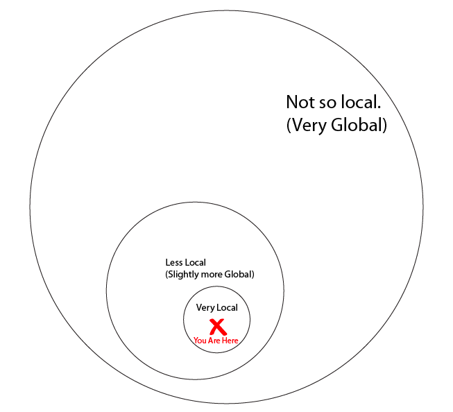
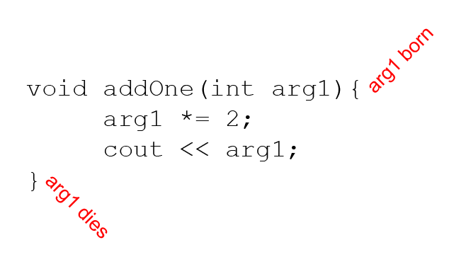
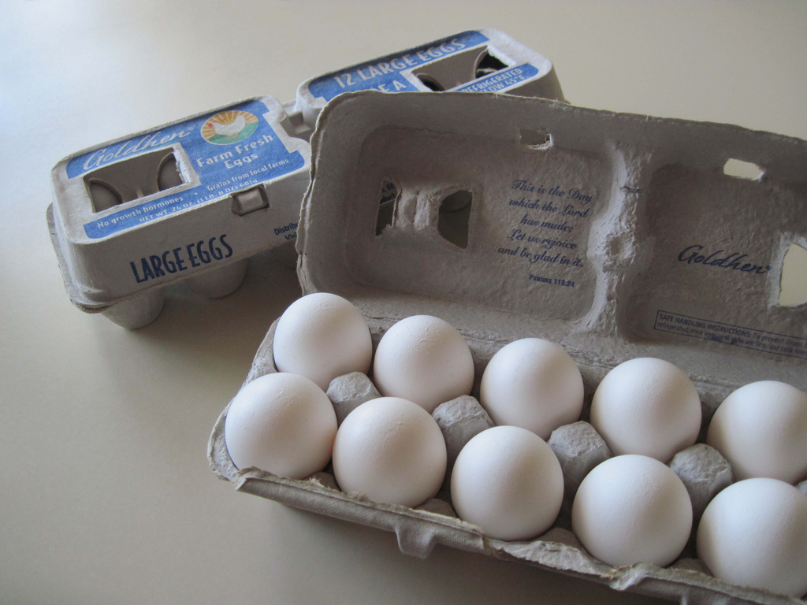
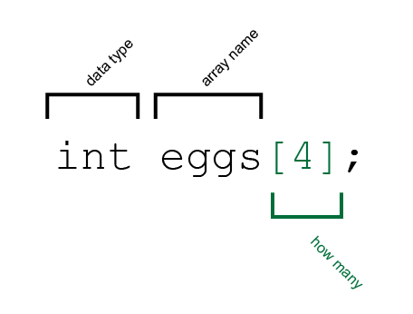
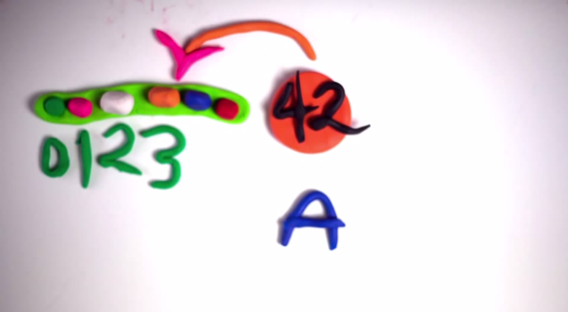

#C++ Language Basics, Continued

*by [jtnimoy](http://jtnimoy.net)*

In the last chapter, we learned about the basic building blocks of programming. In this chapter, you will hone your skills by combining those concepts in different ways, and learning about each one in more detail. Finally, you will build upon those basics to bootstrap you into the right frame of mind to begin with OpenFrameworks.

## Variables (part 2)

### Variables have a scope.

Often times, you may see variables declared outside of the functions. In previous examples, I had declared variables inside the functions. Other variables were declared inside the parentheses of functions as arguments, and inside the for-loop as an iterator. These variables are declared in different *scopes* of the code. We talk about scope by saying a variable is *local* (existing only inside my immediate curly braces) or *global* (existing for the entire program). Intuitively, we can think about global and local variables in the geographic sense of the words "local" and "global." Let us apply this idea to musical trends.

Something that is local (a local concert by a local band) will happen in a smaller, lesser known location - and will happen by a lesser known (but just as important!) local band. A world traveller may come to see the show but since she goes to so many shows in so many locations, she forgets about our local band. Because she forgets about the local band, it gives the band an opportunity to change their name from "From First to Last" to "Skrillex", and adopt a fresher musical genre. When our world traveller returns to the same city to see the same local band, it has benefited from a fresh new start. This fresh new start is why we use local variables. Their ability to reset (their values forgotten quickly) is incredibly useful to us. Global variables, on the other hand, are classical musicians like Ludwig van Beethoven or Wolfgang Amadeus Mozart, whose names ring far and wide about the Earth (and possibly beyond), never to be forgotten. Their music was appreciated long ago and will continue to be appreciated, in many countries. Their musician names are known globally, and persist (stay the same) globally. This absolute stability of a global variable is what makes them so useful, in contrast to a more local variable. We need both global and local variables to make the whole system work, just like we need both global and local musicians for the health of music!


### Apologies

I know it is hip to hate on Skrillex, so remember that his career has just begun. He has gone from local to global in a small amount of time, which is impressive. I am sure he will transform into an even more globally recognized musician than he already is, and then we will all stop hating on him. On the other hand, people have been hating on Mozart's appearance and character for 256 years (a more globally persisting rejection). Like making music, someone will always tell you you're not a real coder. Do not let that stop you. Having read the book "Coders at Work" in which Peter Seibel interviews the top programmers and computer scientists, I was pleasantly surprised to learn that people came from a diversity of backgrounds, and some saw themselves as architects or writers. Being a good programmer is different from being a good computer scientist or mathematician!

Variables at a more local scope are incredibly impactful and important because they deal with that which is closest to us, a bit like being closer to ones nerves. If we did everything using global variables all the time, we would have collisions - and perhaps remember too much garbage. Code and computer memory would grow tangled like the ratty hair of electronic musician. The idea of a local variable is newer, and was introduced for organization reasons. Programmers have made good efforts to avoid tangled, confusing code - and one way to do it is through keeping variables local.

When dealing with nested clauses in code, global and local are less black and white since the *scope* is more than 2 matryoshka dolls deep. A variable declared at various locations within the curly brace garden can be viewed as "slightly more global" or "much more local", as in figure 27.



Let us see how this looks in code.

```cpp
#include <iostream>
using namespace std;

int myGlobal;

void addOne(){
	myGlobal += 1;
}

int main() {
	for(int i=0;i<4;i++){
		cout << myGlobal << ' ';
		addOne();
	}
	cout << endl;
	
	return 0;
}
```

The output is `0 1 2 3`. Notice `addOne()` and `main()` are *sharing* the global variable. Its value remains the same between them. Unfortunately, `myGlobal` is forgotten when the program is finished running, which makes it *local* within the scope of this program. To make its value even more persistent, we need to write it to a file, database, or share it over the network. That level of global-ness is one you will see explained in later chapters by other authors. Now let's deliberately cause an error.

```cpp
#include <iostream>
using namespace std;

void addOne(){
	cout << i;
}

int main() {
	for(int i=0;i<4;i++){
		addOne();
	}
	cout << endl;
	return 0;
}
```

The output is a compiler error.

```
prog.cpp: In function ‘void addOne()’:
prog.cpp:5:10: error: ‘i’ was not declared in this scope
  cout << i;
          ^
```

The compiler has a problem understanding what you mean by `i` within the scope of `addOne()` because `i` is not a global variable (it only exists inside the for-loop of `main()`) and because no local variable `i` has been declared for the personal use of `addOne()`. If we wanted to access the value of `i` from within `addOne()`, the best thing to do would probably be to pass `i`'s value as an argument in the `addOne()` function.

```cpp
#include <iostream>
using namespace std;

void addOne(int i){
	i *= 2;
	cout << i;
}

int main() {
	for(int i=0;i<5;i++){
		addOne(i);
	}
	cout << endl;
	return 0;
}
```

The output of this code is `02468`, not `026` as if `int i` were shared between the two functions. You see I added a parameter to `addOne()` called `int i`. Notice I manipulate the value of `i` while inside `addOne()` by multiplying it by 2 before printing it out. Each time `addOne()` is called, the value of `i` passed to it is copied over from the `int i` in the for-loop of `main()`, as if it forgot that it was multiplied by 2 in `addOne()`. That is because there are 2 separate *local* versions of `int i`. See figure 28.


When I call `addOne()`, I am only passing the *value* of the first `i` so that it gets stored in the more temporary `int i` argument of `addOne()`. Figure 29 shows the lifespan of a function's argument, which is a certain type of local variable.



Just the same, if I were to declare any variables inside the scope of that function, those variables will also be forgotten when the function returns. They only exist inside that scope. In addition to *passing by value*, there is also such thing as *passing by reference* in which you are not only sharing the value of the variable, you are also sharing the actual place in computer memory - as if the variable were made global. memory pointers are an advanced topic better covered later, but the syntax looks like `void addOne(int& i){` with an ampersand specified before the variable name. if you made this slight modification to the above code example, you will see the output becomes `026`. 


### Fundamental Types

Variables have different *types*, meaning they hold different kinds of information in them. Some take up more memory than others. Returning to the Minecraft metaphor, we can think about putting more than just water in more than just iron buckets.


In Minecraft, Buckets will hold milk and lava in addition to water. Furthermore, there are a few other kinds of containers meant for other liquids and other stuff. Requiring the correct container for the correctly according data makes C a *strictly typed* (or *strongly typed*) language because it is strict about which type of variable you use. Strictly typed variables are arguably a big virtue for a programming language, and are kept in as a matter of choice since they reduce errors, and greatly speed the app's performance. The issue of whether or not to use a strict or loosely typed language for a project is a very important decision to make, but whether or not one should devote ones career exclusively to strict or loose typing is an unhealthy sort of xenophobia. Both walks of life have their pros and cons.

In the beginning of this chapter, we declared strings and since then, we've declared mostly integers with the keyword `int` just because they were a convenient general purpose data type for immediate gratification, but an `int` has its limitations. Let me introduce a couple new types.

```
float myNumber = 340.1928; 
char myLetter = 'E';
```

Unlike an `int`, A `float` allows decimal points, and so you can work at a higher resolution. A `char` holds a single ASCII character. It only needs to take up 8-bits of memory whilst the `float` and `int` take up more (therefore allowing them to express a wider range of values). I will touch briefly on the bits and bytes of memory when we get into bitwise operators, and then Arturo will give you much more in Chapter 16. Let's see the `float` in action!

####Float

```cpp
#include <iostream>
using namespace std;

int main() {
	float myNumber = 0.0;
	for(int i=0;i<100;i++){
		myNumber += 0.012;
		cout << myNumber << endl;
	}
	return 0;
}
```

The output is a stream of numbers that increment by 0.12.

```
...
0.78
0.792
0.804
0.816
0.828
0.840001
0.852001
0.864001
0.876001
0.888001
0.900001
...
```

Floating point values are useful because they allow us get in-between the piano keys of an integer, and that is why I call them the violin of variables. But notice in this list of fractionally incrementing values that a phantom 0.000001 is added for a little while, beginning around 0.840001. Sometimes you will see these minuscule errors when working with floating point numbers. This strange phenomenon is called a *floating point error* and is a fundamental problem with floating point technology at large, sometimes bringing a headache to a designer trying to render the number in a sane looking way. For the purposes of this chapter, I will not point out floating point errors when they arise, but please be comforted in knowing this is a hot topic in computer science, and there are certainly ways of remedying it, later.

Look what happens when we go back to that code example and change the type from `float` to `int`.

```cpp
#include <iostream>
using namespace std;

int main() {
	int myNumber = 0.0;      // changed from float to int!
	for(int i=0;i<100;i++){
		myNumber += 0.012;
		cout << myNumber << endl;
	}
	return 0;
}
```

The output becomes a long, serene list of zeros since the `int` data type cannot handle a tiny fraction like 0.012. So during the moment it tries to add 0.012 to myNumber (which is an int), 0.012 gets everything to the right side of the decimal point trimmed off, and that becomes zero every time. Now let's try the opposite example, storing ints into a float.

```cpp
#include <iostream>
using namespace std;

int main() {
	float myNumber = 0.0;
	for(int i=0;i<100;i++){
		myNumber += 1;
		cout << myNumber << endl;
	}
	return 0;
}
```
The variable type was changed back to `float` and within the for-loop, i am now adding an integer `1`. It turns out there is no loss in precision since a float is more than enough to store the first 100 integers. So far so good. Now here's a gotcha!

```cpp
#include <iostream>
using namespace std;

int main() {
	float myNumber = 22 / 7;
	cout << myNumber << endl;
	return 0;
}
```

The output is simply `3`, not 3.14286. For the beginner in variable types, this can be somewhat confusing. On the one hand, I have declared the variable as a `float` so it *must* be able to handle decimal points. The answer lies in the syntax used for integers 22 and 7. Like variables, literal numbers (values typed out with numeric digits right into the code) in C have a type, inferred by the compiler based on *how you formatted the number*. In this case, 22 and 7 are both literal integers since they are nothing but number. Let's try changing them to be literal *floats* by suffixing them with `.0`.

```cpp
	float myNumber = 22.0 / 7.0;
```

The output should now be `3.14286` since the expression is now floating point division, rather than integer division, which chops off the fraction. To shed a bit more light about this important difference between integers and floats, let's remove the `.0` from just the 7 and see what happens.

```cpp
	float myNumber = 22.0 / 7;
```

The output is still `3.14286`, since the division operator needs to have only one of its participating numbers be a float in order to act with more precision. Therefore, it should not matter which side of the division operator has the floating point type . . .


```cpp
	float myNumber = 22 / 7.0;
```

The output remains `3.14286`.

#####What's in a name?

I grew up in Southern California. When someone says the word "float" I am reminded of the Pasadena Tournament of Roses, a new years parade with flower-covered **floats** - decorated platforms on wheels. That's why I can understand if it's difficult at first to remember that a float is the variable type that allows decimal points. Often times, when I am having trouble associating a name like this in my mind, it helps me to look deeper into the reasoning behind the nomenclature. The reason these are called *floats* has historical significance. *Floating point precision* means the decimal place can shift left and right (because powers of 10 are useful), in contrast to *fixed point precision* like `double`, a type we will learn later on. If that still doesn't make sense, just do like a scripting language and use floats for everything. *When in doubt, use the type with a higher precision.*


####Char

`Char` is another type that stores a single character, whose value is traditionally 0-255, a range that fits inside 8-bits (1 byte). Often times, a char is referred to as a byte for this 8-bit reason. You may know the term `8-bit` if you are a fan of chiptune music or had a Nintendo Entertainment System (NES). A single byte is a pretty classic unit of memory, and as such - incredibly useful for dealing with data. You'll learn more about bits and bytes in chapter 16, in which Arturo will be covering the subject in greater detail. For now, let's start playing with the `char` type and begin to understand its basic uses.

```cpp
#include <iostream>
using namespace std;

int main() {
	char myLetter = 'A';
	myLetter += 1;
	cout << myLetter << endl;
	return 0;
}
```

This program outputs `B`. You've already seen strings surrounded by double quotes. A literal char is surrounded by single-quotes. This strictness can be difficult getting used to if you bring habits from scripting languages that use double and single quotes interchangeably. In C, a char is always surrounded by single quotes. When I add 1 to `myLetter`, it increments from A to B. On the next line, `cout` knows just what to do with the char, and prints it as a letter.

####Casting

Okay, what if we want to see the numeric representation of our char, instead of the letter? *Explicit type conversion* (or casting) allows you to force the surrounding expression to treat a variable with one type as if it had another type. We do this by placing the desired type in parentheses and attach it to the left of the variable. In the following example, I loop from 'A' (65) to 'z' (122), and print out all the letters with their according numbers.

```cpp
#include <iostream>
using namespace std;

int main() {
	for(char i = 'A' ; i <= 'z' ; i++){
		cout << i << ' ' << (int)i << endl;
	}
	return 0;
}
```

The output starts like this:

```
A 65
B 66
C 67
D 68
E 69
F 70
G 71
...
```

Naturally, you can cast between any of the fundamental types. The computer will increase and decrease precision as needed. Here's an example where I cast from char to float, then to int, then to char again. Try to guess what the output will be.

```cpp
#include <iostream>
using namespace std;

int main() {
	int a = (float)'D' + 0.7;
	cout << (char)a << endl;
	return 0;
}
```

The output is 'D'.

Perhaps you guessed that the answer would be 'E' since I had added 0.7 before storing into `int a`. You were correct to assume that the computer is converting from float to int, but incorrect to say that 68.7 is "rounded" to 69, therefore producing the letter E. Instead, conversion from float to int is more technically a `floor()` function, meaning it just chops off the fraction and replaces it with a zero. So even (int)2.99999999999 will still come out as 2. If you need to actually round the number, bringing 5.0 and higher to the ceiling, then use `round()`

```cpp
#include <iostream>
#include <math.h>
using namespace std;

int main() {
	float theNum = 3.449;
	int f = floor(theNum);
	int c = ceil(theNum);
	int r = round(theNum);
	cout << f << ' ' << c << ' ' << r << endl;
	return 0;
}
```

The output is `3 4 3`, and notice that I have included `<math.h>` so I can use floor(), ceil(), and round().

###Randomness

I admit that last topic about variable types was a bit numeric, but it was important so if you feel fuzzy about any of it, please go back and re-read. For now, let's have fun with what we just learned. `math.h` comes with all kinds of useful tools for art. One of them generates a fake data stream of evenly distributed values. Programmers call it *random* and ironically, it's anything but random. To see what I mean, run the following program three times, each time noting the output.

```cpp
#include <iostream>
#include <math.h>
using namespace std;

int main() {
	for(int i=0;i<3;i++){
		cout << rand() << endl;
	}
	return 0;
}
```

Every time you run the program, you get the same output.

```
1804289383
846930886
1681692777
```

This tells us that the sequence starts over again. There are things you can do about that and it will be covered in a later chapter. Since these are pretty big numbers, let's normalize them by dividing by `RAND_MAX`, a constant provided by math.h which is the highest possible value that the random function is willing to return.

```cpp
#include <iostream>
#include <math.h>
using namespace std;

int main() {
	for(int i=0;i<10;i++){
		float r = rand() / (float)RAND_MAX;
		cout << r << endl;
	}
	return 0;
}

```

Notice in the output, all numbers are somewhere between 0 and 1.

```
0.840188
0.394383
0.783099
0.79844
0.911647
0.197551
0.335223
```

As an exercise, see if you can generate a collection of snakes [  ..oo00=====( )~ ] whose lengths are different, unexpected sizes.

Artists like the random function because it creates a lot of organic aesthetic with very little typing. The experienced eye can spot the random function even several perlin octaves deep, in the same way you can look at an advertisement in the mall and call it out like "that was so photoshopped". Using the random function is like leaving the "Lorem Ipsum" in. Perhaps I can express my sentiment with more concreteness. If you find it sexy to create visual pieces that have *fake nature*, just imagine the impact you could have if you used *not-fake* nature. By that I mean replacing the random function with real world data. For example, you could set up an arduino or raspberry pi with a photocell (light sensor) to measure the way the cars passing by your apartment window temporarily block a nearby streetlight, and use that as an input to drive your software art. Also try working with big data from the past. Creating generative art, data visualizations, and working with physical computing will be covered in later chapters. But don't say I didn't warn you about the politics.

In the following example, I am using the same random scaled to 52, casting it to `char`, and outputting a pseudo-chaotic wall of letters. 

```cpp
#include <iostream>
#include <math.h>
using namespace std;

int main() {
	for(int i=0;i<20;i++){                      // 40 rows
		for(int j=0;j<50;j++){                 // 100 columns
			float r = rand() / (float)RAND_MAX; // normalized random
			r *= 52;                            // scale to 52
			r = 'A' + r;                        // offset by 'A' ascii value
			cout << (char)r;                    //output without a newline
		}
		cout << endl;                           //finally add the newline
	}
	return 0;
}

```

The output should look like this:

```
AGhX\LCddqT\lBC\cATDVd_qm\EcVephNCgRahtSMtfhbDaoOW
hYMOSIZopDp[[QtZNErD[TOp\YqChilGAdnagftoMPS[_lVlOV
\YOJH^jB\Zrg]oalILfGEOAVBeqMJQobHdUUZH_l_r]HtVH^NZ
YrGKQaGbajMYUKBoWHrVGoEIDSNHiXSXkqbLdpNmY[`khYraWk
detrmP\[FV^nWfnfjegAo\YDfZcdKpno]HXtLXQ[nWYjSKtHaa
AAifQVddKlelEEhaLLEUrrUNdOiiVOKAJtMkHU`JlItNMFLbej
ehcaC`LQeGh\]_ReHIZmk]gQH\Q_[WNTUXYUOETNcd[ffrXqQX
[cU`tHcR]\lAOb]pNsMleXkBIeeW_hteOhIAZEIoigWA_[D]UL
Uace]OkTdQAF\iLCDIfPCYX\XHOle_dRCt]AmBTZ^gd\BGsJS`
`G]rSlsNNWkoMheXNcGKF]AJ`WEdTlGsBEZiqNShZgcdhBLL^b
aTLMbIgICcGrZapA_fZCW[iDXsYRXgKITqsNDG\I[FlTWRf^nh
leUq`S]XUMEVYPFLj\cmMfNTEXMjZANcWJsGjrI`DSP[klfRja
CCHhD\qLKEeeZNfTKMWYmsXB\Bh_kRM\WUtsmnQHtbYqdk]^Ir
kICRFF[B^m[dgeBJcRDHpLT_IBdhfE_qqW[lp`f\ZIs^O\ecF]
`cZ^_WH[gBC\QBMFT]``qi[ZbeVZYe\O`Oe\qMV`ipdk\LHoNb
AqOmOr[GVeWFhFWRPhRRC^ZKFsmZTjIIDHYTnWVbQDkopoiI^B
j\mOn_Uk\qV_gnRJgfnDenSEIVFd^knibonZFTTdGDHYeMUsad
pSmjWDZZXZgqPHFEsVMslKGKR^W_WTT`WHcteUmkjTAYbbbjTS
UReHPcmQH`ApT[RNPlGbCXTIhcAj^PVQ[flMYTCDK^lVlPJSq_
TYarVCX_gmGFcl_ctApKs\Of_llcfbS\cQnXpOrGVlsR\\kqcM
```

To make it more interesting, I will inform the palette of characters with column index, and I will randomize a "masking" part of the code which inserts a space according to a custom conditional.

```cpp
#include <iostream>
#include <math.h>
using namespace std;

int main() {
	for(int i=0;i<40;i++){                        // 40 rows
		for(int j=0;j<80;j++){                    // 100 columns
			float r1 = rand() / (float)RAND_MAX;  // normalized random
			float r2 = rand() / (float)RAND_MAX;  // normalized random
			r1 *= 3;                              // scale to 3
			r1 = 30 + r1 + j;                     // offset by 'L' ascii value
			if(r2 > (i/40.0) || -i < -j+10){      // artistically tweaked inequalities
				r1 = ' ';                         //blank it out
			}
			cout << (char)r1;                     //output without a newline
		}
		cout << endl;                             //finally add the newline
	}
	return 0;
}
```

In the line marked "artistically tweaked inequalities", my process was simply changing one thing about the expression, hitting compile, and seeing how I feel. I sat with the code until I reached a sweet spot. Here is the output.

```
              =               K              Z                   
                 >   C                    XZ                     
                                  P          Z          fg       
                   B B                        ]             i   n
                 >                                    c       l  
               =  @                P  T   W  Z            h      
              <==     C EH  J L            X  \]              m  
                   @ B   G    MM PP      W  [   _   a cd   h    m
             :     AB   EH IK M            Y     ^ b d         n 
               =   @ B E  G     N QP RU          _` c    g iij nm
                  A     GH J     N       V       `` a c gh   j nn
             < >   A C  EH    L   QP         [  ^`a     f h  k   
               >?>      G  JJ KNMP P     WYY    ]^  a d  fh  lm  
                ? A@  DDE    K L N    S WWXY \ ^] ``  c      l  n
               =>@     EFG        QR TS  W   \  ] `   d  g   j l 
             ;;=  A BCD   I IKML  Q QRU VXX       _ab     gi    o
              ;>   BBB DE G J  LO PQ  UUWV  Z \]_ _`b  e fh   k  
             < = @?   D E HI   N  Q Q     Y ZZ[ ^^ bb ddg  h  k  
                >@ @B  D  G      N  RR   V   [[\__ ` ddd g jj m n
                ? ? BD EFFHIKLK OOQQ RS WW    []]    cceg  j  km 
                           JK LN  PQ R VWW Z Z\] __`ab  fhgh   l 
                  A@ D  F GJK  N    ST VW   Z[\ _   adcf   i jm m
                   AA    H    KMNNPPQ TV WY ZZ  ]` b dd  g  jjmnm
                   @C  EEG JJ     P RR  W  Y[[ \    ad de      no
                       FG HIKJ  NO  QRU UX X  [  _a`bcdfff  jlk n
                     D  EHG JK  MO PRRUVU  XYZ ^ ` acdcee   klkm 
                      CEE G J L ONOQ RTV V   \ ]^ `aacc fhhjk lno
                        EGHH K LN  QRRS UWWX  \\]_  ccedffhh l no
                           JKKMNMOPRRT U XYYY  ^ `aaa  ef ih lln 
                         GII KLLNPQP  STUVY [\]^^` aadde  hhjjmlo
                          GH  MLNPQR SU WW XY[ ]^ _`bcddfhiij mno
                           HI KLM PQS SVV W Z ]\_``bbb  gh ji ll 
                             LLLNOQPQS TUWYZZZ\\_^_b bed   ikkkmo
                              KNNPP QTUUVVX   \^___abb eeghijkmmn
                              MMOOPQS  UV WZZ  ]^_abace efghilmmn
                               MNNOPRTTVWVWZZZ]]]^`abbefe gjkl nm
                                MO RQ T UWWX[[] ]```bcddefiijk ln
                                 PPQSTSVVXYZYZ]\_^`  ddffhhjikklo
                                  PRRTTUUXYXZ\[^_`_bbbddefijillmo
```

Having already warned you of its dangers, I am also of the opinion that computer random, just like Lorem Ipsum, fake plastic trees, and the Roland 808 cowbell sound all have their place as real elements in art, particularly when the artist is making a real statement about those very tools, and their people.

###Algorithm

The classic random number generator *algorithm* is just a feedback loop wherein a variable feeds back on itself, each time having some manipulation done to it. What gets returned to us is a snapshot of that. An algorithm is just a procedure for doing something. It's a fancy term to describe a useful chunk of code. Figure 31 shows an algorithm represented as a flowchart, which is easier for a lot of people to look at than indented code syntax. Notice it has conditionals, looping, and a main entry point.


If you can understand `random()` at an algorithmic level, you will be able to deeply remix it. See if you can use what you have learned so far to write your own algorithm that produces an unexpected stream of numbers, then use that stream of unexpected numbers to produce a visual output.

### Signed, Unsigned ###

You may have noticed the use of a special keyword in the previous example, `unsigned`. In languages like Java or Javascript, all numbers are *signed* meaning they are capable of being negative. (the *sign* tells us whether the number is negative). When working in C, we benefit from the convenience of specifying explicitly whether or not an int or char is signed or unsigned by adding the keyword before the type. `unsigned char myByte = 128;` To see the difference between signed and unsigned, let's loop through all the values of a char, printing each one.

```cpp
#include <iostream>
#include <math.h>
using namespace std;

int main() {
	for(int i=0;i<256;i++){
		unsigned char c = i;          //convert integer to char
		cout << (int)c << ' ';
	}
	return 0;
}
```

The output is a list of integers 0 through 255 as you would expect.

```
0 1 2 3 4 5 6 7 8 9 10 11 12 13 14 15 16 17 18 19 20 21 22 23 24 25 26
27 28 29 30 31 32 33 34 35 36 37 38 39 40 41 42 43 44 45 46 47 48 49
50 51 52 53 54 55 56 57 58 59 60 61 62 63 64 65 66 67 68 69 70 71 72
73 74 75 76 77 78 79 80 81 82 83 84 85 86 87 88 89 90 91 92 93 94 95
96 97 98 99 100 101 102 103 104 105 106 107 108 109 110 111 112 113
114 115 116 117 118 119 120 121 122 123 124 125 126 127 128 129 130
131 132 133 134 135 136 137 138 139 140 141 142 143 144 145 146 147
148 149 150 151 152 153 154 155 156 157 158 159 160 161 162 163 164
165 166 167 168 169 170 171 172 173 174 175 176 177 178 179 180 181
182 183 184 185 186 187 188 189 190 191 192 193 194 195 196 197 198
199 200 201 202 203 204 205 206 207 208 209 210 211 212 213 214 215
216 217 218 219 220 221 222 223 224 225 226 227 228 229 230 231 232
233 234 235 236 237 238 239 240 241 242 243 244 245 246 247 248 249
250 251 252 253 254 255
```

Chars are signed by default. change `unsigned` to `signed`, and run it again. The output is different.

```
0 1 2 3 4 5 6 7 8 9 10 11 12 13 14 15 16 17 18 19 20 21 22 23 24 25 26
27 28 29 30 31 32 33 34 35 36 37 38 39 40 41 42 43 44 45 46 47 48 49
50 51 52 53 54 55 56 57 58 59 60 61 62 63 64 65 66 67 68 69 70 71 72
73 74 75 76 77 78 79 80 81 82 83 84 85 86 87 88 89 90 91 92 93 94 95
96 97 98 99 100 101 102 103 104 105 106 107 108 109 110 111 112 113
114 115 116 117 118 119 120 121 122 123 124 125 126 127 -128 -127 -126
-125 -124 -123 -122 -121 -120 -119 -118 -117 -116 -115 -114 -113 -112
-111 -110 -109 -108 -107 -106 -105 -104 -103 -102 -101 -100 -99 -98
-97 -96 -95 -94 -93 -92 -91 -90 -89 -88 -87 -86 -85 -84 -83 -82 -81
-80 -79 -78 -77 -76 -75 -74 -73 -72 -71 -70 -69 -68 -67 -66 -65 -64
-63 -62 -61 -60 -59 -58 -57 -56 -55 -54 -53 -52 -51 -50 -49 -48 -47
-46 -45 -44 -43 -42 -41 -40 -39 -38 -37 -36 -35 -34 -33 -32 -31 -30
-29 -28 -27 -26 -25 -24 -23 -22 -21 -20 -19 -18 -17 -16 -15 -14 -13
-12 -11 -10 -9 -8 -7 -6 -5 -4 -3 -2 -1
```

Instead of counting all the way up to 255, it looks like the sequence stops after 127, switches over to -128, then counts up from there until it reaches -1. A `signed char` can only count to 127 in exchange for the ability to do negative values.

###Bool

I previously mentioned George Boole when talking about the business of true and false. Whilst a true/false can be stored as a number (zero being false, and non-zero being true), C provides a convenient type called a `bool` whose value can only be true or false. In the following example, I declare a boolean variable and store a counting integer into it.

```cpp
#include <iostream>
#include <math.h>
using namespace std;

int main() {
	bool foo;
	for(int i=0;i<10;i++){
		foo = i;
		cout << foo;
	}
	return 0;
}
```

The output is `0111111111` since `bool` only cares if the number is zero or non-zero. of course, since a bool is true or false, it goes naturally with OR (||), AND (&&), and NOT(!) as I discussed back in the *Boolean Logic* section. The following example program declares 4 booleans and uses them as bits of logic in a 4-bit counter.

```cpp
#include <iostream>
#include <math.h>
using namespace std;

void render(bool v){
	if(v){
		cout << "democratic ";
	}else{
		cout << "republican ";
	}
}

int main() {
	
	bool bit0 = false;
	bool bit1 = false;
	bool bit2 = false;
	bool bit3 = false;
	
	for(int i=0;i<32;i++){
		
		render(bit3);
		render(bit2);
		render(bit1);
		render(bit0);
		cout << endl;
				
		bit0 = !bit0;
		if(!bit0){
			bit1 = !bit1;
			if(!bit1){
				bit2 = !bit2;
				if(!bit2){
					bit3 = !bit3;
				}
			}
		}

	}
	return 0;
}
```

The output is the 4 bits properly counting upward in binary.

```
republican republican republican republican 
republican republican republican democratic 
republican republican democratic republican 
republican republican democratic democratic 
republican democratic republican republican 
republican democratic republican democratic 
republican democratic democratic republican 
republican democratic democratic democratic 
democratic republican republican republican 
democratic republican republican democratic 
democratic republican democratic republican 
democratic republican democratic democratic 
democratic democratic republican republican 
democratic democratic republican democratic 
democratic democratic democratic republican 
democratic democratic democratic democratic 
republican republican republican republican 
republican republican republican democratic 
republican republican democratic republican 
republican republican democratic democratic 
republican democratic republican republican 
republican democratic republican democratic 
republican democratic democratic republican 
republican democratic democratic democratic 
democratic republican republican republican 
democratic republican republican democratic 
democratic republican democratic republican 
democratic republican democratic democratic 
democratic democratic republican republican 
democratic democratic republican democratic 
democratic democratic democratic republican 
democratic democratic democratic democratic
```

## Switch Case

There's a flow control structure similar to if-then that can sometimes be more convenient especially if you have a long chain of if-elseif-elseif-else. It looks at a single integer and jumps to a marker (a `case`) depending on what value the integer has.

```cpp
#include <iostream>
#include <math.h>
using namespace std;

int main(){
	for(int i=0;i<200;i++){
		float rnd = rand() / (float)RAND_MAX;
		int num = round(rnd * 5);
		
		switch(num){	
		case 0:
			cout << "////";
			break;
		case 1:
			cout << "''''";
			break;
		case 2:
			cout << "||||";
			break;
		default:
			cout << "    ";
		}
		
		if(i%16==15)cout << endl;
		
	}
	return 0;
}
```

In this example, you see the keyword `switch` is followed (like an if) by `(num)` which is its criteria. Then inside its curly braces, you see instances of `case 0:` and those are the bookmarks. If num was 0 during that loop iteration, then it would jump over to that part of the case and execute the code. The output would look like:

```
////''''    ||||    ''''////            ||||        ////////    
    ////||||////||||                    ////    ||||            
''''////    ||||            ||||''''                ////        
''''||||    ||||''''''''||||''''||||        ////            ||||
    ||||''''////    ////    ||||''''        ||||    ////        
    ''''////                            ''''||||||||            
||||    ''''||||    ||||''''''''''''        ////    ||||        
                ''''''''    ''''////''''////||||////        ''''
''''||||        ''''    ||||||||||||''''                    ''''
    ||||''''    ''''||||||||    ''''''''||||    ''''            
''''||||||||''''////    ||||''''    ||||''''    ////''''////||||
''''''''    ||||||||||||            ''''        ''''    ||||    
            ||||        ||||
```

Notice there is more whitespace in the output than other ascii phrases. That is because num is being set to a random number between and 5, but I only provided cases for 0, 1, and 2. At the bottom of the case, you see the final `default` catching all the rest of the unsaid cases. One tricky thing with cases is that their blocks of code require a `break` statement at the end if you want to skip all the way to the closing curly brace when finished. Otherwise, the code will actually continue running right into the next case!

```cpp
#include <iostream>
#include <math.h>
using namespace std;

float rnd(){
	return rand() / (float)RAND_MAX;
}

int main(){
	for(int i=0;i<20;i++){

		switch(0){
		case 0:
			cout << "You make me come";
			if(rnd()>0.5)break;         //break only half the time
		case 1:
			cout << "-plete";
			if(rnd()>0.5)break;         //break only half the time
		case 2:
			cout << "ly miserable";
			if(rnd()>0.5)break;         //break only half the time
		default:
			cout << " (guitar)";
		}
		
		cout << '.' << endl;
		
	}
	return 0;
}
```

Given the option to break or not break can have *cascading* results. The output shows each line definitely starting with case 0, then sometimes continuing to case 1. Among those who got to case 1, some of them also throw in case 2, and so on.

```
You make me come-pletely miserable.
You make me come-plete.
You make me come-pletely miserable.
You make me come.
You make me come-plete.
You make me come.
You make me come-pletely miserable.
You make me come.
You make me come-pletely miserable (guitar).
You make me come-plete.
```

## Escape Sequence

When dealing with paint, some paints have special handling instructions. One pigment is toxic and needs to be kept away from children. Another pigment requires refrigeration, and yet another is water insoluble and is more picky about the medium. In C, special characters like that are handled with an escape sequence.

Let's jump back to the previous code example that was rendering the `////''''    ||||` and attempt to make some changes. Warning, this is going to cause an error, and it's not your fault. In `case 1`, Change the four single quotes to **three** double quotes.

```cpp
#include <iostream>
#include <math.h>
using namespace std;

int main(){
	for(int i=0;i<200;i++){
		float rnd = rand() / (float)RAND_MAX;
		int num = round(rnd * 5);
		
		switch(num){	
		case 0:
			cout << "////";
			break;
		case 1:
			cout << """""; // <--------------- changing this from '''' to """
			break;
		case 2:
			cout << "||||";
			break;
		default:
			cout << "    ";
		}
		
		if(i%16==15)cout << endl;
		
	}
	return 0;
}
```

The error is not as useful as we've seen because the preprocessor is just that confused.

```
/Users/jtnimoy/Downloads/tmp.cpp:15:90: error: expected ';' after expression
                        cout << """""; // <--------------- changing this from single quote ' to double quote "
                                                                                                              ^
                                                                                                              ;
1 error generated.
```

You cannot put a double quote character into a string literal without using an escape sequence. In C, an escape sequence starts with a backslash and that just means the following character is to be interpreted in a special way.

```cpp
#include <iostream>
using namespace std;

int main(){
	cout << "This is a quote     ---> \" <---- Thank you." << endl;
	cout << "This is a backslash ---> \\ <---- Hooray." << endl;
	cout << "This is a tab       ---> \t <---- Good Grief." << endl;
	cout << "This is a return    ---> \n <---- What next?" << endl;
	cout << "This \
is a \
multiline \
string \
literal. Done." << endl;
	return 0;
}
```

The output shows that the backslash is a magical thing.

```
This is a quote     ---> " <---- Thank you.
This is a backslash ---> \ <---- Hooray.
This is a tab       ---> 	 <---- Good Grief.
This is a return    ---> 
 <---- What next?
This is a multiline string literal. Done.
```

In strings surrounded by double quotes, we need a backslash to insert a double quote. The same is true for chars surrounded by single quotes. You're fine putting a double quote between single quotes, but if you want the actual single quote character, `escape it` with the backslash. Escape sequences are confusing because they are self-reflexive and look odd, but worth getting used to because you'll see them all the time.

## Arrays

In some of the previous examples, you saw I numbered similar variables by naming them with numbers at the end. They relate in name and the data is similar.

```cpp
#include <iostream>
using namespace std;

int main(){
	int egg0 = 4;
	int egg1 = 5;
	int egg2 = 6;
	int egg3 = 7;
	
	cout << egg0 << egg1 << egg2 << egg3 << endl;
		
	egg0 += 1;
	egg1 += 1;
	egg2 += 1;
	egg3 += 1;

	cout << egg0 << egg1 << egg2 << egg3 << endl;

	egg0 += 1;
	egg1 += 1;
	egg2 += 1;
	egg3 += 1;

	cout << egg0 << egg1 << egg2 << egg3 << endl;	
		
	return 0;
}

```

In the above example, I must update each of the four `egg` variables by copying the text around. Whilst easy to understand, and syntactically more simple, this brute force, cut-and-paste method is laborious, and the computer has no idea that the four eggs are related and have an order. The numbers at the end of their variable names are merely part of the word `egg`. We miss the opportunity to *address* each egg by number, in effect, controlling which egg we're working with. Well, what if I told you it doesn't have to be that way?



If a variable is a bucket or coffee cup, then an array is an egg carton - a single box holding several of the same thing. An array is a single variable name but it refers to a list of values. These values all share one type. Let's re-write the above example using an array rather than named variables. To do so, we need to know how to declare the array.



Working with the individual eggs of this carton uses a similar square bracket syntax.

```cpp
cout << eggs[2]; // output the value at index 2
eggs[0] = 45; // store 45 into the first index
```

When referring to the array, the square brackets mean "look specifically at that one", and when declaring an array, the square brackets mean "make these many slots." The new egg program, translated in the most basic way (but not all the way) looks like this.

```cpp
#include <iostream>
using namespace std;

int main(){
	int eggs[4]; // declare an integer array with 4 slots		

	eggs[0] = 4;
	eggs[1] = 5;
	eggs[2] = 6;
	eggs[3] = 7;

	cout << eggs[0] << eggs[1] << eggs[2] << eggs[3] << endl;

	eggs[0] += 1;
	eggs[1] += 1;
	eggs[2] += 1;
	eggs[3] += 1;

	cout << eggs[0] << eggs[1] << eggs[2] << eggs[3] << endl;
	
	eggs[0] += 1;
	eggs[1] += 1;
	eggs[2] += 1;
	eggs[3] += 1;

	cout << eggs[0] << eggs[1] << eggs[2] << eggs[3] << endl;
		
	return 0;
}

```

You can see the array syntax is being used, and that individual eggs may be handled one by one. Because the number is no longer part of the identifier, and now a real integer, we can apply a for-loop rather than cutting and pasting in order to loop through all of them. This makes the code more concise, easier to maintain, and opens us up to doing more intelligent things in the program. Here is a new version of the same program that replaces the one-by-one method with for-loops.

```cpp
#include <iostream>
using namespace std;

int main(){
	int eggs[4] = {4,5,6,7};   // declare an integer array with 4 slots,
							   // and initialize it to a literal array of 4 values
	// print them out
	for(int i=0;i<4;i++){
		cout << eggs[i];
	}
	cout << endl;

	// increment them all
	for(int i=0;i<4;i++){
		eggs[i]++;
	}

	// print them out
	for(int i=0;i<4;i++){
		cout << eggs[i];
	}
	cout << endl;
	
	// increment them all
	for(int i=0;i<4;i++){
		eggs[i]++;
	}

	// print them out
	for(int i=0;i<4;i++){
		cout << eggs[i];
	}
	cout << endl;
	
	//report success
	return 0;
}
```

In the above evolution of the same example, you see I could make the size of the eggs array as big as I want without seeing my code get longer in response. 

Let's take this incrementing idea further by printing out an array while altering it.

```cpp
#include <iostream>
using namespace std;

int main(){
	char eggs[8] = { '|',' ','o',' ','x', ' ', '_' , ' ' };
	
	for(int j=0;j<20;j++){
		
		// print
		for(int i=0;i<8;i++){
			cout << eggs[i];
		}
		cout << endl;
		
		
		for(int i=8 ; i >= 1 ; i--){ //loop from max to min+1
			eggs[i] = eggs[i-1]; // set current egg to previous egg's value
		}
		eggs[0] = eggs[7]; // wrap rightmost egg to leftmost egg
		
	}
		
	//report success
	return 0;
}
```

In this example, I am shifting the contents of the array to the right, and making them wrap around. The output is like a candy cane.

```
| o x _ 
_| o x _
 _| o x 
x _| o x
 x _| o 
o x _| o
 o x _| 
| o x _|
_| o x _
 _| o x 
```

By sweeping downward and leaving a trail, we've made a 1-dimensional array look 2D.

### Multidimensional Arrays

You don't have to keep your arrays 1 dimensional however. To declare an extra dimension, add additional square brackets at the end.

```cpp
#include <iostream>
using namespace std;

int main(){
	//initialize a 2D array
	int tictactoe[3][3] = {
		{0,1,2},
		{3,4,5},
		{6,7,8}
	};
	
	for(int y=0;y<3;y++){ // loop rows
		for(int x=0;x<3;x++){ // loop columns
			cout << tictactoe[y][x]; // print
		}
		cout << endl;
	}
		
	return 0;
}

```

Notice the syntax for initializing it with literal data has inner nested curly braces for each row. A 2D array may be used as a pixel buffer for remembering your color values.

```cpp
#include <iostream>
using namespace std;

int main(){
	//initialize a 2D array
	int smiley[5][5] = {
		{0,0,0,0,0},
		{0,1,0,1,0},
		{0,0,0,0,0},
		{1,0,0,0,1},
		{0,1,1,1,0}
	};
	
	//render it right side up
	for(int y=0;y<5;y++){ // loop rows
		for(int x=0;x<5;x++){ // loop columns
			if(smiley[y][x]){
				cout << '#';
			}else{
				cout << ' ';
			}
		}
		cout << endl;
	}
	
	cout << endl;
	
	//render it sideways
	for(int y=0;y<5;y++){ // loop rows
		for(int x=0;x<5;x++){ // loop columns
			if(smiley[x][y]){ // <----- X and Y flipped this time
				cout << '#';
			}else{
				cout << ' ';
			}
		}
		cout << endl;
	}
	
	return 0;
}

```

In the above example, I render the pixels right side up, then I render it a second time with X and Y flipped inside the `smiley[x][y]`. The output should look like this:

```

	 # # 

	#   #
	 ### 

	   # 
	 #  #
	    #
	 #  #
	   #
```

### Errors

There are a couple things about arrays that make them dangerous. One of them is related to what we learned from variables, and that has to do with left-over memory if you don't initialize it with a value. Let's actually do that in the next example.

```cpp
#include <iostream>
using namespace std;

int main(){
	//initialize a 2D array
	int smiley[5][5]; // <-------look, no initialization
	
	//render it right side up
	for(int y=0;y<5;y++){ // loop rows
		for(int x=0;x<5;x++){ // loop columns
			cout << smiley[y][x] << ' ';
		}
		cout << endl;
	}
	
	return 0;
}

```

My output (which is no doubt different from yours) looked like this.

```
1479976160 32767 1608491643 32767 1479976184 
32767 1479976184 32767 0 1 
1479976208 32767 126439424 1 0 
14 1479976224 32767 0 0 
0 0 0 0 0
```

Some day your piece will glitch and you'll love it but eventually wonder how to fix it. When that day comes, I hope you'll recall that C arrays and variables need to be initialized with a starting value or else you'll find them filled with a visualization of your computer's internal memory.

Another error is when you try and access an index in your array that is outside its boundaries. In the case of `int eggs[4]`, that is any number below 0 or above 3. Arrays are zero-indexed, meaning the first one is at slot zero, and the last one is at (size - 1). This provides a lot of mathematical advantage for the programmer and is worth getting used to. Let's make the mistake on purpose.

```cpp
#include <iostream>
using namespace std;

int main(){
	int eggs[4];
	
	for( int i = 0 ; i < 10 ; i++ ){
		cout << eggs[i] << endl;
	}
	
	return 0;
}

```

The scary thing is that even as I loop beyond 4 and up to 10, it's still accessing mysterious memory and outputting it. Here is my glitchy output.

```
0
0
0
0
0
0
227347776
1
1906995960
32767
```

If you loop for long enough, you may eventually cause a `Segmentation fault` error. The program is stopped by the operating system because it attempted to reach into a forbidden place.

### Passing Arrays to Functions

When you pass an array to a function, it is defaultly *passed by reference*, and that means the function does not get a local copy of the variable and instead, gets to work with the same variable. Let's see this in action.


```cpp
#include <iostream>
using namespace std;

/**
	i will add 1 to each item in an array
	len is the length of the array
	a is the array
*/
void addOne(int a[], int len){
	for( int i = 0 ; i < len ; i++ ){
		a[i] ++;
	}
}

int main(){
	// declare
	int eggs[10];
	
	// initialize values
	for( int i = 0 ; i < 10 ; i++ ){
		eggs[i] = 42;
	}
	
	// pass to function which adds one
	addOne( eggs, 10 );

	// output the new values
	for( int i = 0 ; i < 10 ; i++ ){
		cout << eggs[i] << ' ';
	}
	cout << endl;

	return 0;
}
```

In this example, I initialize all eggs with the value 42, then I pass it as an argument to `addOne()`. The array does not carry its own "size" meta-data, so one needs to pass the size as a second argument. Then `addOne()` loops through all the items and adds one to each. Notice I am not returning the array and yet, back in `main()` afterwards when I output the values, they are 43. An array is passed by reference. If you want to pass a copy, then you need to declare a second one and copy the values over to it. Swapping between arrays can be very powerful. In the following example, I do not quite copy the values to the second array verbatim. Instead, I use the previous state as simple rules.

```cpp
#include <iostream>
using namespace std;

int main(){
	
	int width = 10;
	int height = 10;
	// setup
	int worlds[2][10][10] = {
		
		{
			{0,0,0,0,0,0,0,0,0,0},
			{0,0,0,0,0,0,0,0,0,0},
			{0,0,0,0,0,0,0,0,0,0},
			{0,0,0,0,0,0,0,0,0,0},
			{0,0,0,0,0,1,0,0,0,0},
			{0,0,0,0,0,0,0,0,0,0},
			{0,0,0,0,0,0,0,0,0,0},
			{0,0,0,0,0,0,0,0,0,0},
			{0,0,0,0,0,0,0,0,0,0},
			{0,0,0,0,0,0,0,0,0,0}
		}		
	};
	bool currentWorld = true;
	
	//------------------------------------------------
	
	
	for(int i=0;i<9;i++){


		// draw
		for(int y=0;y<10;y++){
			for(int x=0;x<10;x++){
				if(worlds[!currentWorld][y][x]==1){
					cout << '#';
				}else{
					cout << '.';
				}
			}
			cout << endl;
		}
	
		cout << endl;

		//------------------------------------------------
		
		// update
		for(int y=0 ; y < height ; y++){
			for(int x=0 ; x < width ; x++){
				bool center = worlds[!currentWorld][y][x];
				
				// collect which neighboring pixels are on
				// modulo by width or height for wrap-around access.
				int left = worlds[ !currentWorld ][ y ][ (x + width -1) % width ];
				int right = worlds[ !currentWorld ][ y ][ (x+1) % width ];
				int up = worlds[ !currentWorld ][ (y + height -1) % height ][ x ];
				int down = worlds[ !currentWorld ][ (y+1) % height ][ x ];
				
				if( left + right + up + down > 0){
					worlds[currentWorld][y][x] = !center; // flip value
				}else{
					worlds[currentWorld][y][x] = 0; // write a blank
				}
			}
		}
	
		//------------------------------------------------
	
		// swap buffers
		currentWorld = !currentWorld;
	}
	
	return 0;
}

```

As I copy the values from one buffer to the next, I count how many neighboring pixels are on. If there are any, I reverse the value and otherwise write a blank. The result is a rippling effect that can take a dot, and iterate it out as a checkered diamond.

```
..........
..........
..........
..........
.....#....
..........
..........
..........
..........
..........

..........
..........
..........
.....#....
....#.#...
.....#....
..........
..........
..........
..........

..........
..........
.....#....
....#.#...
...#.#.#..
....#.#...
.....#....
..........
..........
..........

..........
.....#....
....#.#...
...#.#.#..
..#.#.#.#.
...#.#.#..
....#.#...
.....#....
..........
..........

.....#....
....#.#...
...#.#.#..
..#.#.#.#.
.#.#.#.#.#
..#.#.#.#.
...#.#.#..
....#.#...
.....#....
..........

....#.#...
...#.#.#..
..#.#.#.#.
.#.#.#.#.#
#.#.#.#.#.
.#.#.#.#.#
..#.#.#.#.
...#.#.#..
....#.#...
.....#....

...#.#.#..
..#.#.#.#.
.#.#.#.#.#
#.#.#.#.#.
.#.#.#.#.#
#.#.#.#.#.
.#.#.#.#.#
..#.#.#.#.
...#.#.#..
....#.#...

..#.#.#.#.
.#.#.#.#.#
#.#.#.#.#.
.#.#.#.#.#
#.#.#.#.#.
.#.#.#.#.#
#.#.#.#.#.
.#.#.#.#.#
..#.#.#.#.
...#.#.#..

```

Evolving a pixel buffer using itself as the simple rules is often called *cellular automata*, and is an inspiring model of nature. If this sounds like a direction you're going in, try *Conway's Game of Life* and Wolfram.

In the above code example, you see I have a *setup* routine, followed by a loop which does an *update*, then draws something. If the web dev community has *Model, View, Controller* (MVC) design pattern, creative coders have a *Setup, Update, Draw* design pattern. We could at least separate out the chunks of code into their own functions. Here is the same example, refactored to compartmentalize each of the three standard routines. Notice that in order to share variables between the functions, I had to make them global.

```cpp
#include <iostream>
using namespace std;

int width;
int height;

int worlds[2][10][10] = {
	
	{
		{0,0,0,0,0,0,0,0,0,0},
		{0,0,0,0,0,0,0,0,0,0},
		{0,0,0,0,0,0,0,0,0,0},
		{0,0,0,0,0,0,0,0,0,0},
		{0,0,0,0,0,1,0,0,0,0},
		{0,0,0,0,0,0,0,0,0,0},
		{0,0,0,0,0,0,0,0,0,0},
		{0,0,0,0,0,0,0,0,0,0},
		{0,0,0,0,0,0,0,0,0,0},
		{0,0,0,0,0,0,0,0,0,0}
	}		
};
bool currentWorld;

// --------------------------------------

void setup(){
	width = 10;
	height = 10;
	currentWorld = true;
}

// --------------------------------------

void update(){
	for(int y=0 ; y < height ; y++){
		for(int x=0 ; x < width ; x++){
			bool center = worlds[!currentWorld][y][x];
			
			// collect which neighboring pixels are on
			// modulo by width or height for wrap-around guard.
			int left = worlds[ !currentWorld ][ y ][ (x + width -1) % width ];
			int right = worlds[ !currentWorld ][ y ][ (x+1) % width ];
			int up = worlds[ !currentWorld ][ (y + height -1) % height ][ x ];
			int down = worlds[ !currentWorld ][ (y+1) % height ][ x ];
			
			if( left + right + up + down > 0){
				worlds[currentWorld][y][x] = !center; // flip value
			}else{
				worlds[currentWorld][y][x] = 0; // write a blank
			}
		}
	}

	// swap buffers
	currentWorld = !currentWorld;
}

// --------------------------------------

void draw(){
	for(int y=0;y<10;y++){
		for(int x=0;x<10;x++){
			if(worlds[!currentWorld][y][x]==1){
				cout << '#';
			}else{
				cout << '.';
			}
		}
		cout << endl;
	}
	cout << endl;
}

// --------------------------------------

int main(){
	setup();
	for(int i=0;i<9;i++){
		draw();
		update();
	}
	return 0;
}

```

I was able to lose the comments that label the code section since the containing function is called that. Self-documenting code which needs less comments is good code. Some say that if you write a program correctly, it needs no comments. Notice also that I've added dividing lines between the functions just to make it easier to see. Those are optional but do show up all over OpenFrameworks.

In the following example, I use the same pixel buffer technique to draw a spiral (cosine and sine functions) but this time, I only show the last frame. If you don't understand what the sine and cosine functions do, don't worry about it, as I do not build upon it in subsequent lessons.

```cpp
#include <iostream>
#include <math.h>
using namespace std;

int width, height;
int world[10][40];
int spiralCounter;
// --------------------------------------

void setup(){
	width = 40;
	height = 10;
	spiralCounter = 0;
	
	//zero the memory
	for(int y=0;y<height;y++){
		for(int x=0;x<width;x++){
			world[y][x] = 0;
		}
	}
}

// --------------------------------------

float rnd(){
	return (float)rand() / RAND_MAX;
}

// --------------------------------------

void update(){
	int offsetX = 20;
	int offsetY = 5;
	float rScale = 0.0415;
	float thScale = 0.075;
	float theta = spiralCounter * thScale;
	float r = spiralCounter * rScale;
	
	//basic use of cos() and sin()
	int y = offsetY + round(sin( theta ) * r);
	int x = offsetX + round(cos( theta ) * r) * 2; // x 2 for ascii art aspect
	if(y < height && y >= 0 && x < width && x >= 0){
		world[y][x] = 1;
	}
	
	spiralCounter++;
}

// --------------------------------------

void draw(){
	for(int y=0;y<height;y++){
		for(int x=0;x<width;x++){
			if(world[y][x]==1){
				cout << '@';
			}else{
				cout << '.';
			}
		}
		cout << endl;
	}
	cout << endl;
}

// --------------------------------------

int main(){
	setup();
	for(int i=0;i<500;i++){
		update();
	}
	draw();
	
	return 0;
}

```

The output is a spiral trail.

```
....@.@.......@.@.........@.@.@.......@.
....@.......@.................@.@.....@.
....@.....@.........@.@.........@.......
..@.......@.......@...@.@.@.....@.@.....
..@.......@.....@.........@.......@.....
..@.......@.....@...@.....@.@.....@.....
..@.......@.......@.@.....@.@.....@.....
....@.....@.@.............@.......@.....
....@.......@.@.........@.@.....@.@.....
......@.......@.@.@.@.@.@.......@.......
```

## Dynamic Allocation and Pointers

Besides declaring new variables and arrays the way I have shown you so far, there is another way which uses a different syntax and is a bit trickier but worth knowing. *Dynamic allocation* allows us to reserve global memory with more flexibility than traditional *stack based* declarations. The whole business of dynamic allocation pivots around the `new` and `delete` keywords, and contraversially, you are responsible for cleaning up after yourself. Here is a dynamically allocated integer.

```cpp
#include <iostream>
using namespace std;

int main(){
	int *myNumber = new int;
	(*myNumber) = 5;
	cout << myNumber << endl;
	delete myNumber;
	return 0;
}
```

That asterisk prefix is part of *pointer* syntax. Using it in a declaration means that the variable will not be an int, but a pointer to an int. Using it on the next line to assign the value 5 to myNumber, the asterisk *de-references* causing the pointer `myNumber` to act as a normal variable for the moment I assign the value. You may have noticed a peculiar output from this program - something like 0x7feb6ac03980. That big number happened because we sent `myNumber` to `cout` in raw without de-referencing it. If you add an asterisk right before `myNumber` in the code and re-run, you'll see the satisfying 5. Sound confusing? You are not alone. This is infamous for being one of the most difficult parts of C.

### What is a pointer?


Imagine the variable `a`, an integer holding the value 42.


Well, 42 is sitting in the computer memory somewhere. You can think of the computer memory like a neighborhood and each place is like a house with an address. Those addresses can be written down and exchanged.



In C++, we use the ampersand *reference* operator before the variable name in order to mean `3`, the address in memory where the value `42` is living.


When declaring a pointer, we precede the name with an asterisk * meaning that it contains an address reference, and then we can store a reference into it. 


One reason this can be confusing is that the variable can sit alone, without any asterisk or ampersand, and look like a regular variable - but it's still a pointer. 


So what if I'm writing code that uses B and I want to access the value, instead of the pointer address? I precede the variable with another kind of asterisk, a *dereferencing operator*, in order to turn the 3 back into a 42.


 
In the following example, I will create a pointer to an already existing variable, then increment both.

```cpp
#include <iostream>
using namespace std;

int main(){
	int a = 42;
	int *b = &a; // create a pointer to a
	cout << b << ' ' << a << endl;
	a++;
	(*b)++;
	cout << b << ' ' << a << endl;
	return 0;
}

```

Notice the last output is 44, since incrementing b and a will add 1 to the same variable.

Pointers may also be passed as arguments to functions with the same results. In the below example (whose output is 45), I show a couple techniques.

```cpp
#include <iostream>
using namespace std;

void addOne(int *that){
	(*that) ++;
}


void addTwo(int &that){
	that += 2;
}

int main(){
	int a = 42;
	addOne( &a );
	addTwo( a );
	cout << a << endl;
	return 0;
}

```

In `addOne()`, I pass a pointer. This can be useful because it does not let me forget that I'm working with something special. In `addTwo()`, I am *passing by reference* with that ampersand, and it provides for cleaner code at the risk of forgetting the local variable is connected to something bigger.

## Forward Declaration

Perhaps you noticed that all my functions in the previous examples were defined in a certain order. `main()` has always been very last. What if I put `main()` before?

```cpp
#include <iostream>
using namespace std;

int main(){	
	doSomething();
	return 0;
}

void doSomething(){
	cout << "hi there" << endl;
}
```

The error shows that the compiler was not able to find `doSomething()`.

```
/Users/jtnimoy/Downloads/tmp.cpp:5:2: error: use of undeclared identifier 'doSomething'
        doSomething();
        ^
1 error generated.
```

If I had to manage everything in an order of dependency all the time, things would get out of control pretty quickly. Luckily, C++ has *forward declarations*. Declaring a function in the beginning without defining the full piece of code provides a legend to the compiler so it will allow you to place your functions in any order (after that).

```cpp
#include <iostream>
using namespace std;

//forward declaration
void doSomething();

int main(){	
	doSomething();
	return 0;
}

void doSomething(){
	cout << "hi there" << endl;
}
```

In fact, forward declarations are such an essential part of writing C and C++ that we put them in a header file. The following is an example header file separated out. `#pragma once` means make sure this file is only included once. The header file can take over the job of including libraries, using namespaces, and this is where you should be forward declaring functions.

```cpp

// -------- filename: code.h ----------

#pragma once
#include <iostream>
using namespace std;

void doSomething();
int main();

```

Meanwhile in the C++ file, there is a lot less to deal with, and you can put your functions in any order.


```cpp
// -------- filename: code.cpp ----------

#include "code.h"

int main(){	
	doSomething();
	return 0;
}

void doSomething(){
	cout << "hi there" << endl;
}

```

Let us modify this example to use a personal namespace.


```cpp

// -------- filename: code.h ----------

#pragma once
#include <iostream>
using namespace std;
namespace tutorial{
	void doSomething();
};
int main();

// -------- filename: code.cpp ----------

#include "code.h"

int main(){	
	tutorial::doSomething();
	return 0;
}

void tutorial::doSomething(){
	cout << "hi there" << endl;
}

```
Notice in the header file, the namespace `tutorial` contains the forward declaration of a function in that namespace, then in the code implementation file (.cpp), the function name is decorated with `tutorial::` before it. In C++, the double colon means the thing on the right is organized inside the thing on the left, a bit like a biological classification. `life::domain::kingdom::phylum::class::order::family::genus::species`. A namespace is not the only thing you can employ to organize your functions into nice bundles. In the last section, I will provide a tour of structs and classes, and it should be enough to get you through the initial OpenFrameworks topics. Classes and *Object Oriented Programming* will be covered in greater depth in a later chapter.

## Classes

It's nice to organize things into clusters, to form associations between them, stay tidy, and operate on them as a group - another kind of abstraction. A *class* is one construct that lets you do this. Let's bunch integers `x` and `y` into a class `Point`.

```cpp
// -------- filename: code.h ----------

#pragma once
#include <iostream>
using namespace std;

namespace tutorial{
    class Point{
	public:
		float x;
        float y;
    };
}

// -------- filename: code.cpp ----------

#include "code.h"

int main(){
    tutorial::Point p;
    p.x = 5.8;
    p.y = 2.5;

    cout << p.x << ' ' << p.y << endl;
    return 0;
}

```

In the above example, I define the class `Point` and inside it, you see there is a `public:` label that allows me to use dot syntax and say `p.x` later on. If I had left out the `public:`, it would be the same as typing `private:` and the compiler would not allow me to refer to the inner members of the class. A class can also hold functions! Let's add a function to the `Point` class which will operate on its values in an encapsulated way.

```cpp
// -------- filename: code.h ----------
#pragma once
#include <iostream>
using namespace std;

namespace tutorial{
    class Point{
    public:
        float x;
		float y;
        void move(int offsetX,int offsetY);
    };
}

// -------- filename: code.cpp ----------

#include "code.h"

int main(){
    tutorial::Point p;
    p.x = 5.8;
    p.y = 2.5;

    p.move(4,4);

    cout << p.x << ' ' << p.y << endl;
    return 0;
}

void tutorial::Point::move(int offsetX,int offsetY){
    x += offsetX;
    y += offsetY;
}

```


Notice the namespace syntax applies when defining the function later ... `tutorial::Point::move`. Within that function, I am referring to `x` and `y` as local variables, and it turns out that works because the function is in the `Point` class, next to those member variables, so this makes sense. When I call `p.move()`, the one instance of that class adds 4 to both its x and y members.

When dynamically allocating an instance of a class, one uses pointer syntax just the same, but the dot syntax changes to arrows.

```cpp
int main(){
    tutorial::Point *p = new tutorial::Point();
    p->x = 5.8;
    p->y = 2.5;

    p->move(4,4);

    cout << p->x << ' ' << p->y << endl;

	delete p;
    return 0;
}
```

Now that you've seen the arrow syntax for class instance pointers, here is a more verbose way of referring to x and y in `move()`:

```cpp
void tutorial::Point::move(int offsetX,int offsetY){
    this->x += offsetX;
    this->y += offsetY;
}
```

The reason x and y work is because they are implicitly members of `this`, which is a pointer to the current class instance.

When seeing classes in OpenFrameworks code templates, the top of the class declaration might contain more than I've taught you. Something like:

```cpp
class testApp : public ofBaseApp{
```

The mysterious part at the end that goes `: public ofBaseApp` means that the class `testApp` is *inheriting* some pre-written variables and functions from OpenFrameworks so it is more capable than meets the eye.

## STL Strings

Now that you understand a little bit about classes, let's look back at some classes that have always been with us. `std::cout` is an instance of iostream, and the << operator is like calling a "writeLine" function, sort of like `cout.write()`. Although C traditionally uses c-strings (char arrays with zero bytes at the end) as its string format of choice, OpenFrameworks conventionally chooses the more robust STL String as it is closer to Java and has a lot of useful features. 

```cpp
#include <iostream>
int main(){	
	std::string s = "hi";
	s += " there";
	std::cout << s << ' ' << s.size() << std::endl;
	return 0;
}
```

In the above example, I am adding additional text to my string with the addition + operator, and calling `s.size()` to get the number of bytes in the text.

As the STL String object enhances the c-string, there are many classes and packages in C++ that are here to enhance different domains. OpenFrameworks is one such collection of reusable code.

## Conclusion

Congratulations, you should now know enough C++ to get started with OpenFrameworks, a collection of functions and classes to make your life easier as a computational poet. Of course, I did not just teach you the entire language, but if you wish to go further with learning C and C++, here are a couple books I recommend.

Brian W. Kernighan; Dennis M. Ritchie (March 1988). The C Programming Language (2nd ed.). Englewood Cliffs, NJ: Prentice Hall. ISBN 0-13-110362-8. (Amazon: http://www.amazon.com/Programming-Language-2nd-Brian-Kernighan/dp/0131103628 )

Bjarne Stroustrup (2013). The C++ Programming Language (4th ed.).  Addison-Wesley. ISBN 978-0-321-56384-2 (Amazon: http://www.amazon.com/The-Programming-Language-4th-Edition/dp/0321563840 )

For online reference, I recommend http://en.cppreference.com and http://cplusplus.com

===

###Bibliography
+ Back to the Future II. Dir. Robert Zemeckis. Perf. Michael J Fox, Christopher Lloyd, Lea Thompson,. Universal Pictures, 1989. Film.
+ Carver, Cecily "Things I Wish Someone Had Told Me When I was Learning How to Code." *HACKER MONTHLY Issue 45* February 2014: Page 28 - 30. Print.
+ Cubbi, "C++ keywords." *cppreference.com* 29 November 2013. Web. 15 February 2014. http://en.cppreference.com/w/cpp/keyword
+ "Dan Benjamin", "Top 10 Programmer Fonts."  *hivelogic.com* 17 May 2009. Web. 22 March 2014. http://hivelogic.com/articles/top-10-programming-fonts
+ Forrest Gump. Dir. Robert Zemeckis. Perf. Tom Hanks, Robin Wright, Gary Sinise. Warner Brothers, 1994. Film.
+ "From the Beginning" - http://snap.nlc.dcccd.edu/learn/selena/history.html
+ "Dennis M. Ritchie" - http://cm.bell-labs.com/who/dmr
+ Maeda, John. Design by Numbers. Cambridge, MA: MIT, 1999. Print.
+ The Matrix. Dir. Brothers Wachowski. Perf. Keanu Reeves, Laurence Fishburne, Carrie-Anne Moss. Warner Brothers, 1999. Film.
+ Minecraft. Version 1.7.5. Mojang. February 27, 2014. Video game.
