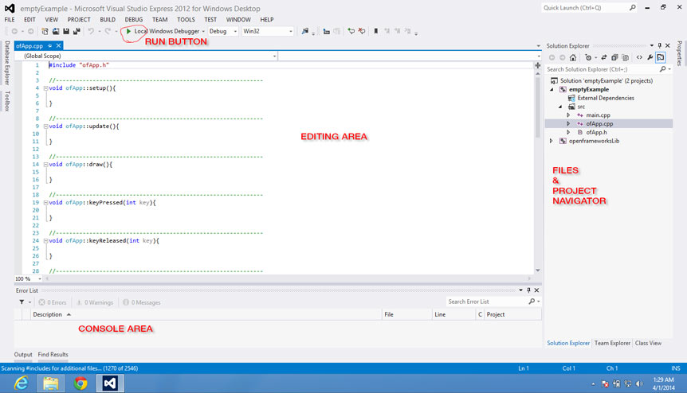

#openFrameworks project structure and setup

Now that you've learned the basics of C++ in Chapter 2, let's get into openFrameworks–OF from now on. Chapter 1 talks about OF in very abstract and conceptual manner, which is really useful for understanding the design of the OF environment. It's really important to read Chapter 1 if you haven't yet.

I have found that it is very useful to explain OF by making analogies to cooking. Coding and cooking have a lot of things in common, and most people are familiar with the act of cooking. In this chapter, I'll be drawing connections between processes and terminology in cooking and openFrameworks.


##First things first##
You need to download the OF version and the IDE (Integrated Development Environment) that suit your platform. The IDE is a piece of software that will let you write, compile, run and debug the code you write. It is "integrated" because it uses other pieces of software to do each of the mentioned tasks. You can run your code without using the IDE, but the IDE will make your programming life much easier.

Go to [www.openframeworks.cc/downloads](www.openframeworks.cc/downloads "Download openFrameworks!") and download the version that you need. By the side of each available version you will find a link to the where to download the needed IDE and how to install it. 

##Welcome to your new kitchen##

###IDE:###
- The main goal here would be to establish the similarities between all IDEs and explain where are the fundamental options needed to compile and solve common errors (missing include paths, linker errors).
- Adding files to the IDE, in particular adding addons (should we mention, as a sidenote Adam's Xcode OF plugin?). How it must be done in each IDE.

As said before, the Integrated Development Environment, IDE, is the application you will be using to build your openFrameworks projects. It will let you write code, compile (bake it), test it and debug it (find out what is giving you problems, if there is any, and fix it).
There are several different IDEs, at least one for each platform you might be utilizing.
The IDE is your new kitchen, where you'll find all the tools to cook incredible stuff. Yet there are a lot of different kitchen brands, just like IDEs. All do the same but things might be laid out and named in a slightly different way. If you know how to use one, you can use any other. For clarification, I will go through each IDE and show where you will find the most used commands, controls and settings. Only read for the IDE you are going to use.    
All IDEs have a very similar interface:

- Toolbar and Run Button: In the tool bar you'll find several useful buttons, such as open, save, save all, et cetera. The "run" button is very important. Usually it is labeled with a triangle pointing to the right, like the "play" button. When you press it, it will compile your code and if it went with no problem it will automatically run your code. Hence this is a frequently used button.
- File selector and project navigator area: Here you will see your project and the files associated with it. Usually it is displayed like a hierarchically ordered list of files. Here you'll find all the OF library files, as well as the files that are particular to your project.
- Editing area: When you open a file in the project navigation area, usually by double clicking it, it should open in the editing area. This looks just like any regular text-editing software, and behaves quite much the same.
- Console: This is where your app, when running, outputs messages. These messages are really useful for debugging, You can print text messages to the console using the ````cout```` comand  or ````ofLog(...)```` function.

####Apple Xcode####

Xcode is Apple's IDE. Used both for iOS apps and desktop apps.
Even though there are other IDEs for MacOSX, Xcode is a a pretty mature one, with lots of nice and useful features, specially for dealing with iOS apps.
The latest Xcode version is 5.0.2 yet the OF projects can be opened in version 3 onwards. **[Cofirm this]**

**[this screenshot is from Xcode 4. I think Xcode5's layout is slightly different. Can anyone confirm this please? If so, should we change this screenshot to Xcode5?]**

####Microsoft Visual Studio 2012 Express####
This is Microsoft's IDE, it is aimed for Windows development. Even though this is the express version it comes packed with a lot of really nice stuff.

**[This screenshot was taken on Windows 8. Does it look different on Windows7? If so which one should we use?]**

#### Code::Blocks####
Code::Blocks is a free IDE. It runs on several platforms(several Linux distros, Windows and MacOSX). It is quite nice.
**[add C::B screenshot]**

####Eclipse####
Eclipse is the IDE of choice for Linux, yet it also runs on Mac and Windows machines. For Android development you'll need to use Eclipse, regardless of your platform.


####The NO-IDE IDE.####
Using the terminal and makefiles. 
OF has implemented makefiles across it complete ecosystem. Makefiles are some text files that describe how to compile something. These are used by a program called GNU Make, which is really nice as it allows to compile and configure large projects in a really simple way.  
When using this option your main interface will be the Terminal or Cmd app. It is a text-based interface, just like that old school DOS, but it is super powerful. 
Any experienced programmer should feel very comfortable with this option, as it will work for any platform, and in some cases it can speed up development.
If you are developing for the Raspberry Pi you'll have to make use of the Makefiles. These also come handy when compiling via SSH. If you want to develop an OF app for the Raspberry Pi you must use the Makefiles as another way, like using an IDE, has not been implemented in OF yet.
Sometimes you might need to compile your code in a remote machine. An easy way is to log into the remote machine using SSH and compile via command line using the Makefiles.
If you are really picky and you don't like any of the IDEs that OF has been implemented for, using the Makefiles will make it really easy to start using another IDE.
To use the Makefiles you need to have GNU Make installed. 
To install Make you must do the following:
- On MacOSX, if you already have Xcode installed, go to Preferences in Xcode, choose "Downloads" and install "Command Line Tools". Otherwise download the Command Line tools from [https://developer.apple.com/downloads/index.action](https://developer.apple.com/downloads/index.action "Download Command Line Tools!")
- On Windows, if you installed Visual Studio then you have Make already installed, yet the command used to run make will be ````nmake```` instead of ````make````. If not go download it and install from [http://gnuwin32.sourceforge.net/packages/make.htm](http://gnuwin32.sourceforge.net/packages/make.htm "Download Make!") 
- On Linux, it comes installed by default **[Please someone confirm this!]**

- How to use OF's make files.
- Using addons
                                 

###Running examples###
Find the uncompressed OF version that you downloaded. From now on we will refer to this folder as the OF root folder.
You can place the OF root folder anywhere you like. Open it. Inside of it you will find several folders. For now, open the one named "examples" (further on in this chapter we will see how the other folders are used). Inside of it you will see a lot of folders, choose any one you want (these are named according to the topic covered by the example). Open it, once again there will be more folders, these are for each example. Open any one you like. Inside of it you will find the project file for the example. The project files you find depend on the version of OF you downloaded. **[KL: maybe instead of letting a user choose any example, it would cut down this paragraph to just guide them to a specific one.]**
Look at the image below and open, by double-clicking, the project file. 
**[add project files icons]** 
Now your IDE should open and load the OF example you chose. It should look like the IDE screenshots above.
Locate the "Run Button" and click on it. The example should compile and run, which might take a few seconds. If everything went well, a new window will pop up and display the example you just compiled. If this happened, congrats! You just have installed and compiled openFrameworks successfully and you are ready to go on. If this didn't happen check the notes below for each IDE. 
- Xcode: make sure that the popdown menu just at the right of the run button has selected the item with the name of your example and not the one named "openFrameworks." There might be more than one item with the name of the example you are trying to run. Select anyone as long as it is not the one named "openFrameworks". This popdown menu selects the target you want to compile. If "openFrameworks" is selected you will just compile the openFrameworks core and not the example code. When you select the other items xcode will compile both the OF core and the code for your example and when done it will run the example. 
- **[add VS notes]**
- **[add C::B notes]**
- Eclipse: You might need to select the project in the project navigator, then press the hammer button in the tool bar, that will compile the project. Once compilation is done press the play button to run the application.
- **[add makefile notes]**
                           
Spend some time going through the examples and running them. It should be fun! 
Once done continue reading.

###OF folder structure###

Inside the OF root folder you will find several other folders, at least, the following:

####Addons####
The "addons" folder will contain the included "core" addons. Addons are extra pieces of code that extend OF's functionalities, allowing you to do almost anything with OF. Addons are usually written by third parties that have shared these. The "core" addons, the ones already included in your OF download, are addons that are used so frequently that it has been decided to include them as part of the official OF download. These are coded and maintained by OF's core developers.     
Check the examples/addons folder in your OF root folder where you will find at least one example about how to use each of these addons.
You can also go to [ofxAddons](http://ofxaddons.com/ "ofxaddons, a collection of OF addons") where you'll find almost every other addon ever made.

####Apps####
This is the folder where you put your project files.
Your current OF download contains the folder named "myApps" inside of "apps," which just has an empty example project folder.
IMPORTANT: you have to respect the folder structure within the apps folder, otherwise your projects won't compile. This should be like this:
.


####Examples####
Quite obvious. A folder with examples, sorted out by topic. There are a big bunch of examples that cover almost all of OF's aspects. Each example is made with the idea of keeping it simple and focused to the particular aspect it tries to address, thus making it easily understandable and a good starting point when you want to do something similar in your project.

####libs####
If you don't know what you are doing, **keep your hands out from this folder**.
Anything you change in here will affect your OF projects and probably you will not be able to compile.

####other##
Here you'll find an Arduino sketch for using with the serial example located at examples/communication/. This is handy to check that your serial communication with Arduino is set up correctly and working.

####projectGenerator_####

OF now ships with a simple project generator which is really useful for making new projects.  One of the larger challenges has always been making a new project and this tool takes a template and modifies it, chaning the name to a new name that you choose and even allowing you to add addons. It allows you to place the project anywhere you want, and while we've structured all the examples to be a certain distance away from the root, you can change the height using this tool.  It's designed to make it easy / trivial to start sketching in code, without worrying too much about making a new project.  In the past we've always recommend that you copy an old project and rename it, but this is a more civilized approach to making projects. Check the readme file inside where the usage of this app is described. Further down there are some instructions on how to use the project generator **[Should I add these instructions or is it enough by pointing the reader to the readme file?]**

####scripts####
**[should I call these bash or shell scripts. I understand the difference between these two, but as I don't want to go in depth into it I don't know what is the most correct naming.]**
Just a few bash scripts useful for compiling, cleaning and testing all the examples.
Bash scripts are a way to program command line instructions. The command line instructions are the ones you usually type into the Terminal or Cmd app and run. Using bash scripts you can save, run (and share!) several instructions to be performed. This scripts can get very complex by using loops and conditionals, even you can run these on different platforms and let the script to know on which it is running and proceed accordingly.
To run a one of these open the Terminal or Cmd app.
- On windows search for "cmd" the first match shown should be the cmd app. Open It. 
- On MacOSX go to Applications/Utilities and open Terminal.app.
- On Linux....
**[How do you open the terminal in Linux? Does drag and drop work on it?]**
Once opened you'll see a new window in which you can type text. It should display the working directory among other things as the username. Drag and drop into it any script file  and press enter. The script should now run and perform the instructions in it. It depends totally on what's written in the script what's going to happen. If the script was able to run with no errors an new line will show up, similar to the one that appeared when you opened the Terminal or Cmd app. If there were any errors a description of these will show up.


###The OF Pantry:###
Your default new kitchen will only have tools for coding, but the OF kitchen comes with a super nice pantry, filled up with really nice, cool and useful stuff. 
Imagine that you want to cook something but your kitchen has no pantry or if it has it is completely empty. In such conditions, cooking anything would be quite difficult, as you'll have to go out and buy the things you need and you probably won't find everything in one outing. This is not a nice scenario, especially if you want to get creative and make awesome things. 

So, what happens when you have your pantry filled with OF's components? You will be able to cook whatever you want because some really good ingredients are already there. Additionally, there are some really nice tools in there. This will let you complete recipes in a short amount of time, leaving you more time to get creative and try out new and more delicious recipes.

####What is inside the OF pantry####
Here you will find a lot of different things, from ingredients to tools, all ordered according to use.

- **3D**
    - Tools for drawing basic 3D polygonal objects, such as spheres, cubes, pyramids, etc.
    - 3D cameras. for navigating and viewing your 3D scene, either interactively or not.
    - 3D node. the base type for any 3d object, which allows it to be moved, rotated, scaled, nested and drawn.
    - 3D mesh. A collection of points in 3D space that allow you to draw them in several different ways such as points, lines, lines strips, triangles, triangles strips, and attach textures (images) to these. All of this is done very efficiently using your computer's GPU. 
    - Load and save 3D objects.
- **app**
    - Tools for setting and getting properties of your app such as window size, position, different drawing modes, framerate, et cetera.
- **communication**
    - Arduino communication via Firmata
    - Common serial port communication
- **events**
    - OF base events, event manager.
    - Listen to the base events, such as setup, draw, update, mouse, keys and window events.
    - You can also create your own custom events and listen to them, in a fast and straight forwards way, yet very reliable.
- **gl** 
    - OpenGL is the library for using the computer's GPU. 
    - OF comes with several openGL related stuff already implemented for multi-platform use, such as VBOs (Vertex Buffer Object), FBOs (Frame Buffer Object), Renderers, Lights, Materials, Shaders, Textures, and several other GL utilities.
    - OF implements different rendering pipelines, Fixed and Programable rendering pipelines as well as OpenGL ES (used on less powerful devices such as smartphones and the Raspberry Pi). You can choose to use the fixed or programable ones and OF takes care of handling everything needed for each rendering pipeline.
- **graphics**
    - There are a lot of capabilities here, such as loading and saving images of almost any kind, implementing several different methods for drawing in 2D, and exhibiting colors and styles. Most of the drawing tools rely on OpenGL so these are usually very fast. Graphics also allows you to render as PDF, and it features typography with several kinds of rendering options and utilities.
- **math**
    - Vectors, Matrices, Quaternions and some really useful math helpers.
- **sound**
    - Sound player and sound grabber, with behind-the-scenes implementations for all the supported platforms.
    - Base sound object that allows to chain different sound objects, creating sound processing chains.
- **base types**
    - A lot of different base types used extensively within OF.
- **utils**
    -  Utilities for file input and output, logging, threading, system dialogs (open, save, alert), URL file loader, reading and saving XML files (super useful for storing and reading your app's settings).
- **video**
    - Video Grabbers and players, with behind-the-scenes implementations for all the supported platforms. Get video from cameras attached to your computer or playback movies stored in it.s
 **[add image/drawing of the pantry]**

**[KL: It would help to go through and unify this list structure. Do full sentences come after each point on the list? If they're fragmented, how will you structure the list? Just be consistent in whatever method you choose so readers can follow along better. The same goes for lists below.]**

####Addons####
As mentioned before, addons extend OF core functionalities, and in each OF distribution there are several included addons, usually referred to as "core addons":

- **ofx3DModelLoader**
Used for loading 3D models into your OF project. It only works with .3ds files.
- **ofxAssimpModelLoader**
Also loads 3D models into your OF project, but it is done using the [assimp](http://assimp.sourceforge.net/) library, which supports a wide variety of 3D file formats, even animated 3D objects.
- **ofxGui**
This is the default GUI (Graphical User Interface) for OF. It lets you add sliders and buttons so you can easily modify parameters while your project is running. It relies heavilly on ofParameters and ofParameterGroup. It allows you to save and load the values for the parameters that you've adjusted.
- **ofxKinect**
Recently added as a core addon. As you probably infer, it's for using a Microsoft XBox Kinect 3D sensor with your OF project. This addon relies on [libfreenect](http://openkinect.org/wiki/Main_Page), so you can only access the depth and rgb images that the kinect reads and adjust some of its parameters, like tilt and light. It includes some handy functions that allow you to convert Kinect's data between several different kinds. Please note that ofxKinect doesn't perform skeleton tracking. For such thing you need to use ofxOpenNI. 
- **ofxNetwork**
Lets you deal with network protocols such as UDP and TCP. You can use it to communicate with other computers over the network. Check out chapter **[add correct chapter number]** about networking.
- **ofxOpenCv**
This is OF's implementation of the best and most used Computer Vision code library, openCV. Computer Vision is a complete world by itself, and being able to use openCV right out-of-the-box is a super important and useful OF feature. Check chapter **[add correct chapter number]** that goes through several Computer Vision features and uses.
- **ofxOsc**
OSC (Open Sound Control) implementation for OF. OSC easily comunicates with other devices or applications within the same network. OSC is used to send messages and parameters from one app to another one. Check out chapter **[add correct chapter number]** which goes in-depth with OSC and how to use it in the real word and chapter **[add correct chapter number]** that provides a more technical view of it.
- **ofxSvg**
Loads and displays SGV files. These are vector graphics files, usually exported from vector drawing programs such as Adobe Illustrator.
- **ofxThreadedImageLoader**
Loads images on a different thread, so your main thread (the one that draws to your screen) doesn't get stuck while loading images. Really useful when loading online images.
- **ofxVectorGraphics**
Used to write out EPS vector graphics files. It the same drawing syntax as OF's regular drawing syntax, so it is really easy to use. Check chapter **[add correct chapter numbre]** for more info about OF's drawing capabilities. 
- **ofxXmlSettings**
This is OF's old XML implementation. It is still here because a lot of addons rely on it. The current XML implementation is called ofXML. The first uses the TinyXML library to parse the XML files, the latter uses Poco library to do such, which happens to be more powerful than TinyXML.  

###The recipes of .h and .cpp files:###
Inside any OF project folder you will find a folder named "src" (short for source). Inside of it are the source code files used for each particular project. In the project navigator of your IDE you'll see this folder and its content listed. For any example or new project, at the most basic level, you'll see the following:
- main.cpp
- ofApp.h (testApp.h on older versions of OF)
- ofApp.cpp (testApp.cpp on older versions of OF) 

For now don't mind the "main.cpp" file as it only initializes the OF engine and starts your app, the one in the ofApp.h and ofApp.cpp files. We will focus on these two files. These are your app's recipes. 
Most cooking recipes have a list of materials, the needed tools, and the instructions. Your OF app also has these. The .h file is the list of materials and needed tools while the .cpp are the actual instructions and steps needed to compile and run (cook and eat) your app. In the most basic case we will just have one recipe, but you can have several other recipes used to create the main one. 
Why not have everything just in one big file? Actually you can, but it tends to be messier and a lot harder to read for anyone else.
If you are trying to understand someone else's code, it is much easier to do so when you have the .h and .cpp files. Or if, for example you want to use a certain addon, and you want to know which functions and methods are available you can simply go and read the .h file where you'll clearly see these listed, instead of going through a massive amount of text trying to figure out which are the available methods and functions.

Any OF app will have a predefined structure for coding it. 
Go to the examples and open the emptyExample. On your IDE's project navigator select the ofApp.h file and it should be displayed in the editing area.
It will look something like this

    #pragma once
    
    #include "ofMain.h"
	
	class ofApp : public ofBaseApp{
	public:
		void setup();
		void update();
		void draw();
		
		void keyPressed(int key);
		void keyReleased(int key);
		void mouseMoved(int x, int y);
		void mouseDragged(int x, int y, int button);
		void mousePressed(int x, int y, int button);
		void mouseReleased(int x, int y, int button);
		void windowResized(int w, int h);
		void dragEvent(ofDragInfo dragInfo);
		void gotMessage(ofMessage msg);
	};
Here is an explanation of whats going on line by line:  
````#pragma once```` Any line that starts with a # character is a preprocess directive. Before compiling happens all the needed files are stuck together. This directive says how this sticking together will commence. In the case of this line it is saying that this file must be included only once, otherwise you could have the same class defined more than once, which would lead into a compiler error. Usually, any .h file should have this at its very beginning.  
````#include "ofMain.h"```` This is another preprocess directive. It is saying to include the file ofMain.h, by which you'll have all the OF things available in your app. 
````class ofApp : public ofBaseApp{```` This is declaring a new class named ofApp (notice that usually classes are declared each on a separate file, with the filename the same as the class name. It is not a rule, it is just for tidiness). Then there is a colon that says this new class will inherit from another class, in this case the public methods and properties of ofBaseApp (the next chapter about object oriented programming (OOP) will explain this idea of inheritance).  
````public:```` This line is saying that the following declarations are public. This means that the declarations can be accessed from outside of this class. There also are "private", that only can be accessed by the class itself, and "protected" that can be accessed by the class itself or by a class that inherits from it.  

		void setup();
		void update();
		void draw();

These are OF's main loop methods (you should know what void means if you read the previous chapter).
````setup()```` is called only once when the app begins. This is where you set the initial parameters and initialize any object that your app is using that needs initialization. 
````update()```` is called constantly, once it finishes its execution it gets called again. How fast this happens depends on the framerate of your app, which you can set using ````ofSetFramerate(int )````, and the intensity of the tasks being done inside update(). These tasks usually have to do with processing data and updating variables, but not drawing.
````draw()```` is called every time the display refreshes, usually at 60Hz or 60 times per second. This speed depends on your computer settings. Inside of this method, you can say how things should be drawn into the screen. There are several chapters further on where you will learn how to draw in OF.    
By default the ````update()```` and ````draw()```` methods are synced, meaning that ````update()```` gets called first and then ````draw()````.
Like this:  
setup->update->draw->update->draw->.....  
You can set this with the function ````ofSetVerticalSync(bool bSync)````.  

Folks coming from processing, where there is just setup() and draw() often times wonder why we have two functions that repeat instead of one.  There's a couple of reasons: 

- Drawing in opengl is asynchronous, meaing after you fire off a bunch of commands to draw, they can be running in the background and return control back to your app.  If you separate out your drawing code from your non drawing code there's a potential your code will be faster.
- it's useful for debugging.  If you want to know why your code is running slow, now you can comment out the drawing and see if the visual representation that's slow or the updating.  


The next lines in the ofApp.h file are

		void keyPressed(int key);
		void keyReleased(int key);
		void mouseMoved(int x, int y);
		void mouseDragged(int x, int y, int button);
		void mousePressed(int x, int y, int button);
		void mouseReleased(int x, int y, int button);
		void windowResized(int w, int h);
		void dragEvent(ofDragInfo dragInfo);
		void gotMessage(ofMessage msg);

All of these methods are event-driven, which means they get called when a particular event happens. The key and mouse methods are very self-explanatory. 
````windowResized(int w, int h)```` gets called when the window is resized, and its parameters are the new window size.   
````dragEvent(ofDragInfo dragInfo)```` is called whenever you drag and drop files over your OF app window. In its parameter there's a list of the files being dragged and dropped as well as the position over the window at which these were dropped.  
````gotMessage(ofMessage msg)```` this gets called when a message is received. OF has a simple messaging system that allows to send messages from one object to another.

Now if you look at your ofApp.cpp file you'll se the following:
(I removed the separator comments and the empty lines, just to make it shorter and clearer here).


	#include "ofApp.h"

	void ofApp::setup(){ }
	void ofApp::update(){ }
	void ofApp::draw(){ }
	void ofApp::keyPressed(int key){ }
	void ofApp::keyReleased(int key){ }
	void ofApp::mouseMoved(int x, int y){ }
	void ofApp::mouseDragged(int x, int y, int button){ }
	void ofApp::mousePressed(int x, int y, int button){ }
	void ofApp::mouseReleased(int x, int y, int button){ }
	void ofApp::windowResized(int w, int h){ }
	void ofApp::gotMessage(ofMessage msg){ }
	void ofApp::dragEvent(ofDragInfo dragInfo){ }

Here once again we find at the very beginning of the file a preprocess directive. ```#include "ofApp.h"```. This declaration is what actually sticks your .h and .cpp files. So it is very important to have it there.

All the following lines are the implementation of the methods defined in the .h file, hence this are the actual instructions or steps needed to follow.
What´s important here is what goes in between { and }. In this case as we are looking at the empty example there's nothing but in any other example you'll find instructions. Now that you know when and how each of these methods are called you can imagine what an OF app does just by reading the code. 

As an exercise, open any example, preferably a simple one (with not to much lines of code), and try to imagine what is going to happen just by reading the code. Once done, run the code. Did it happen the same as what you imagined? If not try to figure out what was that you imagined wrong. It should be useful to comment lines (by placing ```//``` at the beginning of the line) and see what happens, thus you can figure out what each instruction is doing. I think this a very useful way to strengthen your OF skills as well as your abstract thinking (which you'll need a lot if you pretend to go on with coding). 


###Project Generator###
**[Should I add instructions on how to use the PG or is it enough with its readme file?]**


###Using addons in your project###


##Peeking at others or OF's files in search for some help.##

##Some basic OOP##
related to the idea of making a lot of the same recipe, how to deal with it. Link to the other chapters where OOP is covered.

##Into the oven (aka. compiling)

When you write code, your end goal is a compiled application - an .exe or .app that you can click on an run.  The job of the compiler is to make that executable for you, to turn text into compiled binary files. It's a 3 step process, and it's useful to know what's happening, especially since you can have errors at different steps along the way.  Most IDEs output out a very length file of the compiling, and this can be really useful if you are posting to the forums, for example.  Once you understand the process of how projects come to be, it can be easier to isolate errors.  Nothing is as frustrating or daunting as looking at 500+ errors in a project when you go to compile, but when you notice that there's a missing include, it's clear why and usually one thing will fix many of the problems. 

### preprocess

The first step is that a preprocessor modifies the text files themselves.  When you see the # symbol, that's a preprocessor operation.  The most common preprocessor statement you'll see is: 

`#include "xxxxx.h"`

which actually means, take the content of this file and put it right here.  **[NOTE: more on "" vs <> ]**  You'll also see things like: 

`#define PI 3.1428`

This means, when you see the word PI in the code, change it to this variable.  This isn't a variable, this is literally modifying text. 

Another common preprocessor step is asking a question. you can say things like: 

	#ifdef windows
		#include "windows.h"
	#else
	 	#include "nonWindows.h"
	#endif

As you can imagine this is increadibly useful for cross platform compilcation.  If you want to see preprocessor craziness, look at ofConstants.h. 

One common error you'll have in the preprocess phase is a file not found error, if you include a file like

	#include "opencv.h"
	
and it can't find the file, you will get an error at the preprocessing stage. The way to fix this is to add header search paths, basically the places (folders) the IDE goes to look for a file.  This is a common error when using a new library and one of the things the project generator is deisgned to help with when adding an addon. 

**[more on ofMain.h]**

### compile

Once the text has been modified, the job of the compiler is simply to take .cpp files and turn them into object code.  It's taking the text and turning it into machine language instructions (also referred to as assembly).  It doesn't touch the h files at all, it only thinks about .cpp files.  In the previous phase the .cpp file has all the h files it uses added to it recursively. 

This recursive h inclusion  is one reason while you will see include guards on the top of h files.  They will either look like:
	
	#ifndef SOMEWORD
	#define SOMEWORD
	...
	#endif
	
or the more modern 

	#pragma once

This is because if a file is included twice into a .cpp file the compiler could be confused.  If it's sees the same definition twice, like: 

	float position;
	float position;

it will not know which one is which.  The include guard prevents the file from being included twice. 

there are plenty of errors that can happen at compile time -- using a variable that you haven't defined for example.  The compiler will stop when it hits an error and the IDEs are designed to make it easy for you to see where the errors are and fix them.  

The compilers job in life is to take the .cpp files and turn them into .o files.  These are individual object files that it will compbine in the next phase, linking. 

### link

Finally, after we have a bunch of object files, our job is to link them into one thing -- in our case an application (alternatively, compilers can compile code into a library, for example).  This is what the linker does.  As you can imagine, there are jumps from one thing to another.  For example, in ofApp you could call a graphics call from ofGraphics: 

	void ofApp::draw(){
		ofCircle(100,100,20);
	}
	
This code is calling a function in another object.  The linker figures out the links from object to object (in this case between ofApp.o and ofGraphics.o) and links them together into one file. 

In addition to header search paths, there are also setting in the IDE for dealing with linker paths and libraries to link against.  A common error you might see is a link error, where the code in your project compiles fine, but it's having trouble linking because some object is missing.  For example, if you forget to include a .cpp file from the source code, the other code will comiple fine, but when the linker goes to make that jump, it can't find where to jump to.  Linker errors are described as "undefined reference" errors and occur at the end of the compile process. 


