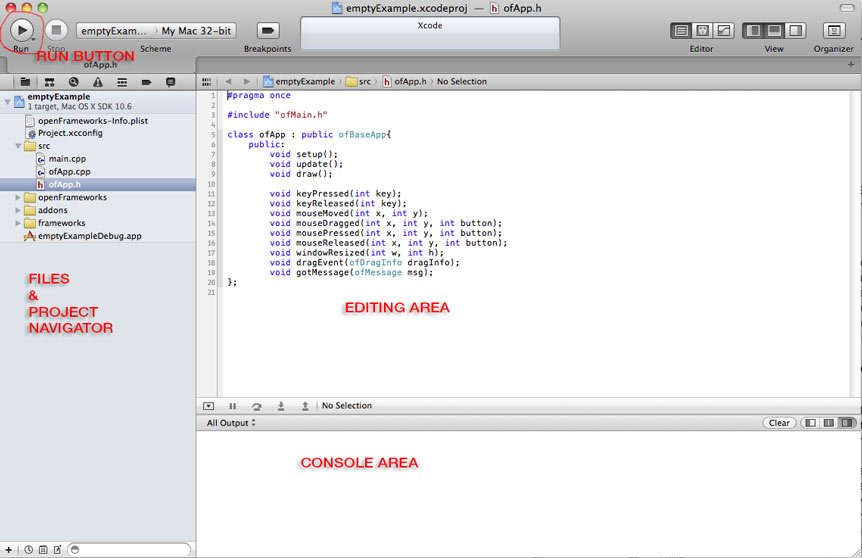

#openFrameworks project structure and setup

So, after you read a bit about C++ on chapter 2, let's get into openFrameworks, OF from now on. Chapter 1 talks about OF in very abstract and conceptual manner, which are really useful to understand in order to understand the decisions made to design the OF environment. So read it if you haven't.

I have found very useful to explain OF making analogies to cooking. Coding and cooking have a lot of things in common, and as almost everyone has experienced cooking it makes a lot of sense to me to use a cooking analogies/naming style.


##First things first##
You need to download the OF version and the IDE (acronym for Integrated Development Environment) that suit your platform. The IDE is a piece of software that will let you write, compile, run and debug the code you write. It is "Integrated" because this software uses other pieces of software to do each of the mentioned tasks, which you can also use in a separate way without using the IDE, but the IDE will make your programming life so much easier.

Go to [www.openframeworks.cc/downloads](www.openframeworks.cc/downloads "Download openFrameworks!") and download the version that you need. By the side of each available version you will find a link to the where to download the needed IDE and how to install it. 

##Welcome to your new kitchen##           

###IDE:###
- The main goal here would be to establish the similarities between all IDEs and explain where are the fundamental options needed to compile and solve common errors (missing include paths, linker errors).
- Adding files to the IDE, in particular adding addons (should we mention, as a sidenote Adam's xCode OF plugin?). How it must be done in each IDE.

As said before, the Integrated Development Environment, IDE, is the application you will be using to build your openFrameworks projects. It will let you write code, compile (bake it), test it and debug it (find out what is giving you problems, if there is any, and fix it).
There are several different IDEs, at least 1 for each platform you might be developing for.
The IDE is your new kitchen, where you'll find all the tools to cook incredible stuff. Yet there are a lot of different kitchen brands, just like IDEs. All do the same but things might be laid out and named in a slightly different way, but if you know how to use one you can use any other, you only need to get used to each one. This said, I will go through each IDE showing where you will find the most used commands, controls and settings. Only read for the IDE yo are going to use.    
All IDE's have a very similar interface, all of which will have the following, but perhaps arranged in a slightly different way.

- Toolbar and Run Button: In the tool bar you'll find several often used buttons, such as open, save, save all, et cetera. The one that is very important for us right now is the run button. Usually it is labeled with a triangle pointing to the right, like the "play" button. When you press it it will compile your code and if it went with no problem it will automatically run your code. Hence this is a very often used button.
- File selector and project navigator: in this area you will see your project and the files associated to it, Usually it is displayed like a hierarchically ordered list of files. Here you'll find all the OF library files, as well as the files that are particular to your object.
- Editing area: When you open a file in the project navigation area, usually by double clicking it, it should open in the editing area. This looks just like any regular text editing software, and behaves quite much the same.
- Console: This is where your app, when running, outputs messages. This messages are really useful for debugging, You can print text messages to the console using the ````cout```` comand  or ````ofLog(...)```` function.

####Apple xCode####

xCode is Apple's IDE. Used both for iOS apps and desktop apps.
Even though there are other IDEs for MacOSX, xCode is a a pretty mature one, with lots of nice and useful features, specially for dealing with iOS apps.
The latest xCode version is 5.0.2 yet the OF projects can be opened in version 3 onwards. **[Cofirm this]**


####Microsoft Visual Studio 2012 Express####
This is Microsoft's IDE, it is aimed for Windows development. Even though this is the express version it comes packed with lot's of really nice stuff.


#### Code::Blocks####
Code::Blocks is a free IDE. It runs on several platforms(several Linux distros, Windows and MacOSX). It is quite nice.
**[add C::B QUICK START GUIDE]**

####Eclipse####
Eclipse is the IDE of choice for Linux, yet it also runs on Mac and Windows machines. For Android development you'll need to use Eclipse, regardless of your platform.
**[add Eclipse screenshot]**

####The NO-IDE IDE.####
Using the terminal and makefiles. 
OF has implemented makefiles across it complete ecosystem. Makefiles are some text files that describe how to compile something. These are used by a program called Make, which is really nice as it makes compiling and configuring large projects in a really simple way.
When using this option your main interface will be the Terminal or Cmd window. It is a text based interface, just like that old-school DOS, but it is super powerful. 
Any experienced programer should feel very comfortable with this option, as it will work for any platform, and in some cases it can speed up development.
If you are developing for the Raspberry Pi you'll have to make use of the Makefiles. These also come handy when compiling via SSH.

- Possible scenarios where this is useful (rPI, remote compiling via SSH)
- How to deal with it. Installing the needed stuff to make it work (make, etc)
- How to use OF's make files. 
- Using addons
                                 
So once you've done this and tested that installation went fine, by opening any example, compiling and running it without problems we are ready to continue.
 
###Running examples###    
Find the uncompressed OF version that you downloaded. From now on we will refer to this folder as the OF root folder.
You can place the OF root folder anywhere you like. Open it. Inside of it you will find several folder. For now, open the one named "examples". (further down this chapter we will see what are all the other folder for). Inside of it you will see a lot of folders, choose anyone you want (these are named according to the topic covered by the example). Open it, once again there will be more folders, these are for each example. Open anyone you like. Inside of it you will find the project file for the example. It depends on the version of OF you downloaded which project files you'll find.
Look at the image below and open, by double-clicking, the project file. 
**[add project files icons]** 
Now your IDE should open and load the OF example you chose. It should look like the IDE screenshots above.
Locate the "Run Button" and click on it. The example should compile and run. It might take some seconds for this. If everything went fine a new window will popup and display the example you just compiled. If this happened, Congrats! You just have installed and compiled openFrameworks successfully and you are ready to go on. If this didn't happen check the notes below for each IDE. 
- xCode: make sure that the popdown menu just at the right of the run button has selected the item with the name of your example and not the one named "openFrameworks". There might be more than one item with the name of the example you are trying to run. Select anyone as long as it is not the one named "openFrameworks". This popdown menu selects the target you want to compile. If "openFrameworks" is selected you will just compile the openFrameworks core and not the example code. When you select the other items xcode will compile both the OF core and the code for your example and when done it will run the example. 
- **[add VS notes]**
- **[add C::B notes]**
- **[add Eclipse notes]** 
- **[add makefile notes]**
                           
Spend some time going through the examples and running them. It should be fun! 
Once done continue reading.

###OF folder structure###

Inside the OF root folder you will find several other folders, at least, the following:

####Addons####
Addons folder will contain the included "core" addons. Addons are extra pieces of code that extend OF's functionalities, allowing you to do almost anything with OF. Addons are usually written by third parties that have shared these. The "core" addons, the ones already included in your OF download, are addons that are used so frequently that it has been decided to include them as part of the official OF download. These are coded and maintained by the OF's core developers.     
Check the examples/addons folder in your OF root folder where you will find at least one example about how to use each of these addons.
You can also go to [ofxAddons](http://ofxaddons.com/ "ofxaddons, a collection of OF addons") where you'll find almost every other addon there is.

####Apps####
This is the folder where you put your project files.
Your current OF download just contains the folder named "myApps" inside of "apps",
which just has an empty example project folder.
IMPORTANT: you have to respect the folder structure within the apps folder, otherwise your projects won't compile. This should be like this:
**[add image depicting a correct and incorrect apps folder structure usage]**

####Examples####
Quite obvious. A folder with examples, sorted out by topic. There are a big bunch of examples that cover almost all of OF's aspects. Each example is made with the idea of keeping it simple and focused to the particular aspect it tries to address, thus making it easily understandable and a good startpoint when you want to do something similar in your project.

####libs####
If you don't know what you are doing, **keep your hands out from this folder**.
Anything you change in here will affect your OF projects and probably you will not be able to compile.

####other##
Here you'll find an Arduino sketch for using with the serial example located at examples/communication/. This is handy to check that your serial communication with Arduino is setup correctly and working.

####projectGenerator_####
Here you'll find the OF project generator app. This is a super useful app that lets you create new OF projects, add to it the addons you need  and configure the project correctly so the addons work. Check the readme file inside where the usage of this app is described.

####scripts####
Just a few bash scipts usefull for compiling, cleaning and testing all the examples.
**[Should I add here how to use these bash scripts?]**


###The OF Pantry:###
Your default new kitchen will only have tools for coding, but the OF kitchen comes with a super nice pantry, filled up with really nice, cool and useful stuff. 
Imagine that you want to cook something but your kitchen has no pantry or if it has it is completely empty. In such conditions cooking anything should be at least something long, as you'll have to go out and buy the things you need and probably you won't find everything needed. This is not a nice scenario, specially if you want to get creative and make awesome things. 

So, what happens when you have your pantry filled with OFs stuff? You will be able to cook whatever you wanted to, because some really good ingredients are already there. Not to say that there are some really nice tools in there. This will let you have your stuff done in a very short time, leaving you more time to get creative and try out new and more delicious recipes.

####What is inside the OF pantry####
Here you will find a lot of different things, from ingredients to tools, all ordered according to its use.

- **3d**
    - Tools for drawing basic 3d polygonal objects, such as spheres, cubes, pyramids, etc.
    - 3D cameras. For navigating and viewing your 3D scene. Either interactively or not.
    - 3D node. the base type for any 3d object, which allows it to be moved, rotated, scaled, parented
**[should I say "nested" instead]** and drawn.
    - 3D mesh. A collection of points in 3D space that allow you to draw them in several different ways,  such as points, lines, lines strips, triangles, triangles strips, and to attach textures (images) to these. All this done very efficiently using your computer's GPU. 
    - Load and save 3D objects.
- **app**
    - Tools for setting and getting properties of your app such as window size, position, different drawing modes, framerate, et cetera.
- **communication**
    - Arduino communication via Firmata
    - Common serial port communication
- **events**
    - OF base events, event manager.
    - Listen to the base events, such as setup, draw, update, mouse, keys and window events.
    - You can also create your own custom events and listen to them, in a fast and straight forwards way, yet very reliable.
- **gl** 
    - OpenGL is the library for using the computer's GPU. 
    - OF comes wit several openGL related stuff already implemented for multi-platform use, such as VBOs (Vertex Buffer Object), FBOs (Frame Buffer Object), Renderers, Lights, Materials, Shaders, Textures, and several other GL utilities.
- **graphics**
    - Here's a lot of things. Loading and saving images of almost any kind. Several different methods for drawing on 2D. colors and styles. Most of the drawing tools rely on OpenGl so these are usually very fast. Render as PDF. Typography with several kinds of rendering options and utilities.
- **math**
    - Vectors, Matrices, Quaternions and some really useful math helpers.
- **sound**
    - Sound player and sound grabber, with behind-the-scenes implementations for all the supported platforms.
    - Base sound object that allows to chain different sound objects, creating sound processing chains.
- **base types**
    - A lot of different base types used extensively within OF.
- **utils**
    -  File I/O utilities. Logging.Threading. System dialogs (open, save, alert). URL file loader. XML read and save (super useful for storing and reading your app's settings).
- **video**
    - Video Grabbers and players.
 **[add image/drawing of the pantry]**

####Addons####
As mentioned before, addons extend OF core functionalities, and in each OF distribution there are several included addons, usually referred to as "core addons". This are the following:
The included addons are the following:

- **ofx3DModelLoader**
Used for loading 3D models into your OF project. It only works with .3ds files.
- **ofxAssimpModelLoader**
Also loads 3D models into your OF project, but it is done using the [assimp](http://assimp.sourceforge.net/) library, which supports a wide variety of 3D file formats, even animated 3D objects.
- **ofxGui**
This is the default GUI (Graphical User Interface) for OF. It let's you add sliders and buttons so you can easily modify parameters while your project is running. It relies heavilly on ofParameters and ofParameterGroup. It allows you to save and load the values for the parameters that you've adjusted.
- **ofxKinect**
Recently added as a core addon. As you probably infer, it is to be able to use a Microsoft XBox Kinect 3D sensor with your OF project. This addon relies on [libfreenect](http://openkinect.org/wiki/Main_Page), so you can only access the depth and rgb images that the kinect reads and adjust some of it's parameters, like tilt and light. It includes some handy functions that allow you to convert kinect's data between several different kinds. Worth mentioning,  ofxKinect doesn't perform skeleton tracking. For such thing you need to use ofxOpenNI. 
- **ofxNetwork**
Lets you deal with network protocols such as UDP and TCP. You can use it to comunicate with other computers over the network. Check out chapter **[add correct chapter number]** about networking.
- **ofxOpenCv**
This is OF's implementation of the best and most used Computer Vision code library, openCV. Computer Vision is a complete world by itself, yet being able to use openCV right out-of-the-box is a super important and useful OF feature. Check chapter **[add correct chapter number]** that goes through several Computer Vision features and uses.
- **ofxOsc**
OSC (Open Sound Control) implementation for OF. OSC easily comunicates with other devices or applications within the same network. OSC is used to send mesagges and parameters from one app to another one. Check out chapter **[add correct chapter number]** which goes in depth with OSC and how to use it in the real word and chapter **[add correct chapter number]** that get into a more technical view of it.
- **ofxSvg**
Loads and displays SGV files. These are vector graphics files, usually exported from vector drawing programs such as Adobe Illustrator.
- **ofxThreadedImageLoader**
Loads images on a different thread, so your main thread (the one that draws to your screen) doesn't get stuck while loading images. Really useful when loading online images.
- **ofxVectorGraphics**
Used to write out EPS vector graphics files. It the same drawing syntax as OF's regular drawing syntax, so it is really easy to use. Check chapter **[add correct chapter numbre]** for more info about OF's drawing capabilities. 
- **ofxXmlSettings**
This is OF's old XML implementation. It is still here because a lot of addons and rely on it. The current XML implementation is called ofXml. The first uses the tinyxml library to parse the xml files, the latter uses Poco library to do such, which happens to be more powerful than tinyxml.  

###The recipes; .h and .cpp files:###
Inside any OF project folder you will find a folder named "src" (short for source). Inside of it are the source code files used for each particular project. In the project navigator of your IDE you'll see this folder and it's content listed. For any example or new project you'll see listed, at least, the following:
- main.cpp
- ofApp.h (testApp.h on older versions of OF)
- ofApp.cpp (testApp.cpp on older versions of OF) 

For now don't mind the "main.cpp" file as it only initializes the OF engine and starts your app, the one in the ofApp.h and ofApp.cpp files. So we will focus on these two files. These are your app's recipe. 
Most cooking recipes have a bill of materials, the needed tools and the instructions and steps. Your OF app also has these. The .h file is the bill of materials and needed tools while the .cpp are the actual instructions and steps needed to compile and run (cook and eat) your app. In the most basic case we will just have one recipe, but you can have several other recipes used to create the main one. 
Why not having everything just in one big file? Actually you can. But it usually tends to be more messier, and a lot harder to read for anyone else.
In case you are trying to understand someone else's code it is so much easier to do so when you have the .h and .cpp files. Or if, for example you want to use a certain addon, and you want to know which functions and methods are available you can simply go and read the .h file where you'll clearly see these listed, instead of going through a massive amount of text trying to figure out which are the available methods and functions. **[Should I go deeper into this subject and explain it from a more technical point of view?]**  

Any OF app will have a predefined structure for coding it. 
Go to the examples and open the emptyExample. On your IDE's project navigator select the ofApp.h file and it should be displayed in the editing area.
it should look something like this
````#pragma once
	
	#include "ofMain.h"
	
	class ofApp : public ofBaseApp{
	public:
		void setup();
		void update();
		void draw();
		
		void keyPressed(int key);
		void keyReleased(int key);
		void mouseMoved(int x, int y);
		void mouseDragged(int x, int y, int button);
		void mousePressed(int x, int y, int button);
		void mouseReleased(int x, int y, int button);
		void windowResized(int w, int h);
		void dragEvent(ofDragInfo dragInfo);
		void gotMessage(ofMessage msg);
	};
````
Now line by line:  
```` #pragma once ```` Any line that starts with a # character is a precompiler directive. Before compiling happens all the needed files are "sticked together". This directives say how this "sticking" must go on. In the case of this line it is saying that this file must be included only once otherwise you could have the same class defined more than once which would lead into a compiler error. Usually, any .h file should have this at it's very beginning.  
````#include "ofMain.h"```` this is another precompiler directive. It is saying to include the file ofMain.h, by which you'll have all the OF things available in your app. 
````class ofApp : public ofBaseApp{```` This is declaring a new class named ofApp (notice that usually classes are declared each on a separate file, with the filename the same as the class name. It is not a rule, it is just for tidiness). Then there is a colon (:) which is saying that this new class will inherit from another class, in this case the public methods and properties of ofBaseApp (the next chapter, about object oriented programming will explain this idea of inheritance).  
````public:```` This line is saying that the following declarations are public. This means that this can be accessed from outside of this class. There also are private, that only can be accessed by the class itself, and protected that can be accessed by the class itself or by a class that inherits from it,  
````
		void setup();
		void update();
		void draw();  ````
This are OF's main loop methods (you should know what void means as you already read the previous chapter). 
````setup()```` is called only once when the app begins. This is where you usually set the initial parameters and initialize any object that your app is using that needs initialization. 
````update()```` is called constantly, once it finishes it's execution it gets called again. How fast this happens depends on the framerate of your app, that you can set using ````ofSetFramerate(int )````, and how intensive are the tasks being done inside update(). These task usually have to do with processing data and updating variables, but not drawing.
````draw()```` is called every time the display refreshes, usually at 60Hz or 60 times per second. This speed depend on your computer settings. Inside of this method is where you say how things should be drawn into the screen. There are several chapters further on where you will be explained how to draw in OF.    
By default the ````update()```` and ````draw()```` methods are synced, meaning that ````update()```` gets called first and then ````draw()````. You can set this with the function ````ofSetVerticalSync(bool bSync)````.

The next lines in the ofApp.h file are
```` 		void keyPressed(int key);
		void keyReleased(int key);
		void mouseMoved(int x, int y);
		void mouseDragged(int x, int y, int button);
		void mousePressed(int x, int y, int button);
		void mouseReleased(int x, int y, int button);
		void windowResized(int w, int h);
		void dragEvent(ofDragInfo dragInfo);
		void gotMessage(ofMessage msg);```` 
All this methods are event driven. This means that these get called when a particular event happens. The key and mouse methods are very self explaining. 
````windowResized(int w, int h)```` gets called when the window is resized, and it's parameters are the new window size.   
````dragEvent(ofDragInfo dragInfo)```` is called whenever you drag and drop files over your OF app window. In it's parameter there's a list of the files being dragged and dropped as well as the position over the window at which these were dropped.  
````gotMessage(ofMessage msg)```` this gets called when a message is received. OF has a simple messaging system that allows to send messages from one object to another one.
                                                                                                                                                
###Peeking at others or OF's files in search for some help.###


- Some basic OOP, related to the idea of making a lot of the same recipe, how to deal with it. Link to the other chapters where OOP is covered.
