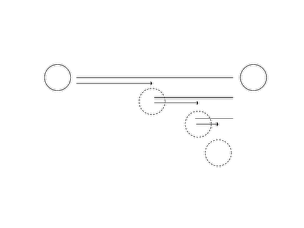

#Animation

## Background 

The word animation is a medieval term stemming from the Latin animare, which means ‘instill with life’. In modern terms, it's used to describe the process of creating movement from still, sequential images. Early creators of animation used spinning discs (phenakistoscopes) and cylinders (zoetropes) with successive frames to create the illusion of a smooth movement from persistence of vision.   In modern times, we're quite used to other techniques such as flip books and cinematic techniques like stop motion. Increasingly, artists have been using computational techniques to create animation -- using code to "bring life" to objects on the screen over successive frames. This chapter is going to look at these techniques and specifically try to address a central question: how can we create compelling, organic, and even absurd movement through code?

As a side note, I studied fine arts, painting and printmaking, and it was accidental that I started using computers. The moment that I saw how you could write code to move something across the screen, even as simple as silly rectangle, I was hooked. I began during the first dot-com era working with flash / actionscript and lingo / director and have never looked back.

This chapter will first explain some basic principles that are useful to understanding animation in OF, then attempt to show a few entrypoints to interesting approaches. 

## Animation in OF / useful concepts: 

### Draw cycle 
The first point to make about animation is that it's based on successive still frames. In openFrameworks we have a certain loop cycle that's based roughly on game programming paradigms. It goes like this: 

- setup()
- update()
- draw()
- update() 
- draw()
- ....

Setup gets called once, right at the start of an OF apps lifecycle and update / draw get called repeatedly. Sometimes people ask why two functions get called repeatedly, especially if they are used to Processing, which has only a setup and a draw command. There are a few reasons. The first is that drawing in openGL is asynchronous, meaning there's a chance, when you send drawing code to the computer, that it can return execution back to your program so that it can perform other operations while it draws. The second is that it's generally very practical to have your drawing code separated from your non-drawing code. If you need to quickly debug something–say, for example, your code is running slow–you can comment out the draw function and just leave the update running. It's separating out the update of the world from the presentation and it can often help clean up and organize your code. Think about it like a stop frame animator working with an overhead camera that might reposition objects while the camera is not taking a picture then snap a photograph the moment things are ready.  In the update function you would be moving things around and in the draw function you draw things exactly as they are at that moment. 

### Variables

The second point to make about animation is that it requires variables. A variable is a placeholder for a value, which means that you can put the value in and you can also get the value out. Variables are essential for animation since they "hold" value from frame to frame–e.g., if you put a value in to a variable in the setup function or update function, you can also get it out from memory in the draw function. Take this example: 

**[note: simple animation example here]**

### Frame rate

The third point to make about OF and animation is frame rate.  We animate in openframeworks using successive frames.  Frame rate refers to how quickly frames get drawn.  In OF there are several important functions to know about.

- `ofGetFrameRate()` returns the current frame rate (in frames per second). Set it 0 to run as fast as possible **[note:double check this]**
- `ofSetFrameRate( float targetFrameRate )` sets the maximum frame rate. If the software is animating faster than this, it will slow it down. Think of it like a speed limit. It doesn't make you go faster, but it prevents you from going too fast. 

In addition, openGL works with an output display and will attempt to synchronize with the refresh rate of the monitor -- sometimes called vertical-sync or vertical blanking.  If you don't synchronize with the refresh rate, you can get something called frame tearing, where the non-synchronization can mean frames get drawn before and after a change, leading to horizontal lines of discontinuity. 

**[note: frame rip graphic here]**

We have a function in OF for controlling this. Some graphics card drivers (see for example Nvidia's PC drivers) have settings that override application settings, so please be sure to check your driver options. 

- `ofSetVerticalSync (bool bUseSync)` set this true if you want to synchronized vertically, false if you want to draw as fast as possible. 

By default, OF enables vertical sync and sets a frame rate of 60FPS. You can adjust the VSYCN and frame rate settings if you want to animate faster, but please note that by default OF wants to run as fast as possible. It's not uncommon if you are drawing a simple scene to see frame rates of 800 FPS if you don't have VSYNC enabled (and the frame rate cap set really high or disabled).

Another imporant point which is a bit hard to cover deeply in this chapter is frame rate independence. If you animate using a simple model -- say for example, you create a variable called xPos, increase it by a certain amount every frame and draw it. 

	void testApp::setup(){
		xPos = 100;
	}
	
	void testApp::update(){
		xPos += 0.5;
	}
	
	void testApp::draw(){
		ofRect(xPos, 100, 10, 10);
	}

this kind of animation works fine, but it assumes that your frame rate is constant.  If you app runs faster, say by jumping from 30fps to 60fps, the object will appear to go twice as fast, since there will be 2x the number of update and draw functions called per second.   Typically more complex animation will be written to take this into account, either by using functions like time (explained below) or mixing the frame rate or elapsed time into your update.  For example, a solution might be something like: 

	void testApp::update(){
		xPos += 0.5 * (30.0 / ofGetFrameRate());
	}
	
if ofGetFrameRate() returns 30, we multiply 0.5 by 1, if ofGetFrameRate() returns 60, we multiply it by 1/2, so although we are animating twice as fast, we take half sized steps, therefore effectively moving at the same speed regardless of framerate.  Framerate indepence is fairly important to think about once you get the hang of things, since as observers of animation, we really do feel objects speeding up or slowwing down even slightly, but in this chapter I will skip it for the sake of simplicity in the code. 

### Time functions

Finally, there are a few other functions that are useful for animation timing: 

- `ofGetElapsedTimef()` returns the elapsed time in floating point numbers, starting from 0 when the app starts. 
- `ofGetElapsedTimeMillis()` similarly returns the elapsed time starting from 0 in milliseconds.
- `ofGetFrameNum()` returns the number of frames the software has drawn. If you wanted, for example, to do something every other frame you could use the mod operator, e.g., `if (ofGetFrameNum() % 2 == 0)`.

### Objects

In these examples, I'll be using objects pretty heavily. It's helpful to feel comfortable with OOP to understand the code. One object that is used heavily is `ofPoint`, which contains an x,y and z variable. In the past this was called "ofVec3f" (vector of three floating point numbers), but we just use the more convenient ofPoint. In some animation code, you'll see vectors used, and you should know that ofPoint is essentially a vector.  

You will also see objects that have basic functionality and internal variables. I will typically have a setup, update and draw inside them. A lot of times, these objects are either made because they are useful recipies to have many things on the screen or they help by putting all the variables and logic of movement in one place. I like to have as little code as possible at the testApp / ofApp level. If you are familiar with actionscript / flash, this would be similar to having as a little as possible in your main timeline. 

## linear movement

### getting from point a to point b

One of the most important things to think about when it comes to animation is answering the simple question:

*how do you get from point A to point B?*  

In this chapter we will look at animating movement (changing position over time) but we could very well be animating any other numeric property, such as color, the width or height of a drawn shape, radius of a circle, etc.  

The first and probably most important lesson of animation is that we **love** numbers between 0 and 1. 

**[note: love picture here]**

The thing about numbers between 0 and 1 is that they are super easy to use in interesting ways. We typically refer to these kinds of numbers as percent, and you'll see me use the shorthand `pct` in the code–this is a floating point number between 0 and 1. If we wanted to get from point A to point B, we could use this number to figure out how much of one point and how much of another point to use. The formula is this: 

    ((1-pct) * A) + (pct * B)
    
To add some detail if we are 0 pct of the way from A to B, we calculate 

    ((1-0) * A) + (0 * B)
    
which simplifies to `(1*A + 0*B)` or A. If we are 25 percent of the way, it looks like 

    ((1-0.75) * A) + (0.25 * B)
    
which is 75% of A + 25% of B. Essentially by taking a mix, you get from one to the other. The first example shows how this is done.

**[note: linear example code here]**

*As a side note, the function `ofMap`, which maps between an input range, uses pct internally. It takes a value, converts it into a percentage based on the input range, and then uses that pct to find the point between the output range.*  **[note: see omer's chapter]**

### Curves

One of the interesting properties of numbers between 0 and 1 is that they can be easily adjusted / curved.  

The easiest way to see this is by raising the number to a power.  A power, as you might remember from math class, is multiplying a number by itself,  e.g., 2^3 **[note: latex helpful here?]**  = `2*2*2 = 8`. Numbers between 0 and 1 have some interesting properties. If you raise 0 to any power it equals 0 (`0x0x0x0 = 0`). The same thing is true for 1 (`1*1*1*1 = 1`), but if you raise a number between 0 and 1 to a power, it changes. For example, 0.5 to the 2nd power = 0.25.

Let's look at a plot of pct raised to the second power: 

**[note: plot grpahic here]**

**[note: better explanation of how to read the chart]**
Think about the x value of the plot as the input and y value as the output. If put in 0, we get out a y value of 0, if we put in 0.1, we get out a y value of 0.01, all the way to putting in a value of 1 and getting out a value of 1.   

Things in the world don't move linearly. They don't take even steps. Roll a ball on the floor, it slows down. It's accelerating in a negative direction. Sometimes things speed up, like a baseball bat going from resting to swinging. Curving pct leads to interesting behavior. The objects still take the same amount of time to get there, but they do it in more lifelike, non-linear ways.

If you raise the incoming number between 0 and 1 to a larger power it looks more extreme. Interestingly, if you raise this value between 0 and 1 to a fractional (rational) power (i.e., a power that's less than 1 and greater than 0), it curves in the other direction.  

The second example shows an animation that uses pct again to get from A to B, but in this case, pct is raised to a power: 

http://en.wikipedia.org/wiki/12_basic_principles_of_animation#Slow_in_and_slow_out

**[note: can we get rights for a screenshot of masahiko sato curves DVD ? ]**

Raising percent to a power is one of a whole host of functions that are called "shaping functions" or "easing equations." Robert Penner wrote about and derived many of these functions so they are also commonly reffered to as "Penner Easing Equations."  [Easings.net](http://easings.net/) is a good resource, as well there are several openFrameworks addons for easing. 

- http://sol.gfxile.net/interpolation/#c1
- http://easings.net/

### Zeno

A small twist on the linear interpolation is a technique that I call "Zeno" based on Zeno the greek philosopher's *dichotomy paradox*: 

> Imagine there is a runner running a race and the runner runs 1/2 of the distance in a certain amount of time, and then they run 1/2 of the remaining distance in the same amount of time, and run 1/2 of the remaining the distance the distance, etc. Do they finish the race?  There is always some portion of the distance remaining left to run one half of.  The idea is that you can always keep splitting the distance.

If we take the linear interpolation code but always alter our own position instead (e.g., take 50% of our current position + 50% of our target position), we can animate our way from one value to another. I usually explain the algorithm in class by asking someone to do this: 

1. Start at one position in your room.
2. Pick a point to move to.
3. Calculate the distance between your current position and that point.
4. Move 50% closer.
5. Go to (3).

In code, that's basically the same as saying 

    currentValue = currentValue + ( targetValue - currentValue ) * 0.5.

In this case `targetValue - currentValue` is the distance. You could also change the size of the step you make every time, for example, taking steps of 10% instead of 50%: 

    currentValue = currentValue + ( targetValue - currentValue ) * 0.1.

If you expand the expression, you can write the same thing this way: 

    currentValue = currentValue * 0.9 + targetValue * 0.1.
    
This is a form of smoothing: you take some percentage of your current value and another percentage of the target and add them together. Those percentages have to add up to 100%, so if you take 95% of the current position, you need to take 5% of the target (e.g., currentValue * 0.95 + target * 0.05).

In Zeno's paradox, you never actually get to the target, since there's always some remaining distance to go. On the computer, since we are dealing with pixel positions on the screen and floating point numbers at a specific range, the object appears to stop. 

**[note: code walk through]**

## Function based movement

In this section of the book we'll look at a few examples that show function based movement, which means using a function that takes some input and returns an output that we'll use for animation. For input, we'll be passing in counters, elapsed time, position, and the output we'll use to control position. 

### Sine and Cosine

Another interesting and simple system to experiment with motion in openframeworks is using sin and cos.

Sin and cos (sine and cosine) are trigonometric functions, which means they are based on angles. They are the x and y position of a point moving in a constant rate around a circle. The circle is a unit circle with a radius of 1, which means the diameter is `2*r*PI` or `2*PI`.  In OF you'll see this constant as `TWO_PI`, which is 6.28318... 

*As a side note, sometimes it can be confusing that some functions in OF take degress where others take radians. Sin and cos are part of the math library, so they take radians, whereas most openGL rotation takes degrees. We have some helper constants such as `DEG_TO_RAD` and `RAD_TO_DEG`, which can help you convert one to the other.*

#### Everything about sin and cos in one graph

So here's a simple drawing

#### Simple examples

It's pretty easy to use sin to animate the position of an object.  

Here, we'll take the sin of the elapsed time `sin(ofGetElpasedTimef())`. This returns a number between negative one and one. It does this every 6.28 seconds.  We can use of map to map this to a new range. For example 

	void ofApp::draw(){
		float xPos = ofMap(sin(ofGetElpasedTimef()), -1, 1, 0, ofGetWidth());
		ofRect(xPos, ofGetHeight/2, 10,10);
	}
	
This draws a rectangle which move sinusoidally across the screen, back and forth every 6.28 seconds. 

You can do simple things with offseting the phase (how shifted over the sin wave is):

	void ofApp::draw(){
	
	}

*As a nerdy detail, floating point numbers are not linearly precise, e.g., there's a different number of floating point numbers between 0.0 and 1.0 than 100.0 and 101.0. You actually lose precision the larger a floating point number gets, so taking sin of elapsed time can start looking crunch after some time. For long running installations I will sometimes write code that looks like `sin((ofGetElapsedTimeMillis() % 6283) / 6283.0)` or something similar, to account for this. Even though ofGetElapsedTimef() gets larger over time, it's a worse and worse input to sin() as it grows.  ofGetElapsedTimeMillis() doesn't suffer from this problem since it's an integer number and the number of integers between 0 and 10 is the same as between 1000 and 1010.*

#### Circular movement

Since sin and cos are derived from the circle, if we want to move things in a circular way, we can figure this out via sin and cos. We have four variables we need to know: 

- the origin of the circle (xOrig, yOrig)
- the radius of the circle (radius)
- the angle around the circle (angle)

The formula is fairly simple: 

	xPos = xOrig + radius * cos(angle);
	yPos = yOrig + radius * sin(angle);

This allows us to create something moving in a circular way. For these examples, I start to add a "trail" to the object by using the ofPolyline object. I keep adding points, and once I have a certain number I delete the oldest one. This helps us better see the motion of the object. 

If we do things like change the radius of the circle, we can make spirals. 

#### Lisajous figures

Finally, if we alter the angles we pass in to x and y for this formula in different rates, we can get interesting figures, called "Lissajous" figures, named after the French mathematician, Jules Antoine Lissajous. These formulas look cool. **[note: more]**

### Noise

## Simulation

If you have a photograph of an object at one point in time, you know its position.  If you have a photograph of an object at another point in time and the camera hasn't changed, you can measure its velocity, i.e., its change in distance over time. If you have a photograph at three points in time, you can measure its acceleration, i.e., how much the speed changing over time.  

The individual measurements compared together tell us something about movement. Now, we're going to go in the opposite direction. Think about how we can use measurements like speed and acceleration to control position.

If you know how fast an object is traveling, you can determine how far it's traveled in a certain amount of time. For example, if you are driving at 50 miles per hour (roughly 80km / hour), how far have you traveled in one hour? That's easy. You've traveled 50 miles. How far have you traveled in two or three hours? There is a simple equation to calculate this distance:

    position = position + (velocity * elapsed time)

e.g.: 
    
    position = position + 50 * 1;   // for one hour away

or

    position = position + 50 * 2;   // for two hours driving
    
    
The key expression–position = position + velocity–in shorthand would be `p=p+v`.

*Note, the elapsed time part is important, but when we animate we'll be doing p=p+v quite regularly and you may see us drop this to simplify things (assume every frame has an elapsed time of one). This isn't entirely accurate but it keeps things simple. See the previous section on frame rate (and frame rate independence) for more details* 

In addition, if you are traveling at 50 miles per hour (apologies to everyone who thinks in km!) and you accelerate by 5 miles per hour, how fast are you driving in 1 hr? The answer is 55 mph. In 2 hrs, you'd be traveling 60 mph.  In these examples, you are doing the following: 

    velocity = velocity + acceleration

In shorthand, we'll use `v=v+a`. So we have two important equations for showing movement based on speed: 

    p = p + v;   // position = position + velocity
    v = v + a;   // velocity = velocity + acceleration

The amazing thing is that we've just described a system that can use acceleration to control position. Why is this useful? It's useful–if you remember from physics class– because Newton had very simple laws of motion, the second of which says 

    Force = Mass x Acceleration

In shorthand, `F = M x A`.  This means force and acceleration are linearly related.  If we assume that an object has a mass of one, then force equals acceleration.  This means we can use force to control velocity and velocity to control position.  

The cool, amazing, beautiful thing is that are plenty of forces we can apply to an object, such as spring forces, repulsion forces, alignment forces, etc. 

## where to go further

### physics and animation libraries

