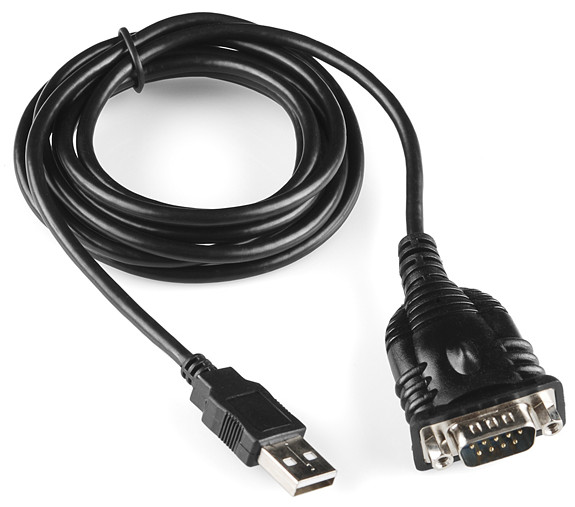

 #hardware

## introduction

This chapter will give you an introduction to working with openFrameworks outside of your computer screen and into the physical world. Why exactly would you want to do this? Well, given that we are physical creatures ourselves, having software control, sense and actuate real-world things can be pretty exciting and create truly visceral experiences. Screen based work can be captivating, but physical installations have the potential to deliver greater impact due to their more tangible nature.

There are a number of ways of taking your openFrameworks app out of the frame of your own personal computer and getting it to interact with the outside world. Largely this involves some kind of communication from openFrameworks to whatever hardware you've decided to hook up to. The different types of computer based communications (or protocols) vary, but the most common is what's known as 'serial' communication, so called because each bit of data sent is transferred one after the other (as opposed to multiple bits being sent in parallel). 

The first hardware that we’ll look at interfacing with is the excellent **Arduino** prototyping platform.  Arduino is, in its own words, an *“open-source electronics prototyping platform based on flexible, easy-to-use hardware and software… intended for artists, designers, hobbyists, and anyone interested in creating interactive objects or environments.*”  It’s easy to see why there’s a lot of overlap between communities of people interested in using openFrameworks and Arduino!  With Arduino, it’s quick to get your openFrameworks app hooked up to sensors (like light sensors, proximity sensors, or other methods of environmental input), actuators (like lights, motors, and other outputs), and real-time interaction.  You're free to move out of the realm of pixels and into the physical world.

This chapter assumes that you have the Arduino IDE installed, in addition to the environment that you normally use for working with openFrameworks.  If not, you can download it from the Arduino website (arduino.cc) or the Arduino github (github.com/arduino).

Additionally, following along with the examples in this chapter requires you to have a few pieces of basic hardware.  You’ll need an Arduino (any generation; an Uno, Leonardo, or Duemilanove will look the most like the graphics in this chapter but any USB-connected Arduino will work just fine) and the appropriate USB cable to connect to your computer.  

[** Callout - The Leonardo differs from earlier boards in that it has built-in USB communication, eliminating the need for a secondary processor. This allows the Leonardo to appear to a connected computer as a mouse and keyboard, in addition to a virtual serial port. This makes setting up interactive applications a very simple procedure - in your openFrameworks app all you need to do is check for a key press! **]

## getting started with serial communication

**SERIAL: ONE AFTER THE OTHER**

Serial, in the most basic language sense, refers to things that come one after another; it’s a term often used to describe magazines, crimes, and television programs.  That meaning also applies when talking about serial data:  “serial communication” means that all information between two entities is being sent one piece at a time, following in a single stream.  One piece of data, or one bit, is just a binary piece of information: you’re either sending a 0 or a 1.  Using the terminology of digital electronics, these are frequently referred to as “high” and “low”; 0 is low (like turning a light off) and 1 is high (flipping it back on).  8 bits (for example the stream 01000001, which represents the letter A) are sometimes packaged together to create a single byte.

Serial communication is actually a very broad topic and there are many serial protocols, including audio-visual protocols such as DMX (based on RS-485) and MIDI (serial at 31,250 bits per second) which we'll briefly cover in this chapter. The most common serial protocol is called RS-232 and computers used to be equipped with RS-232 serial ports (remember them?) but today they are rarely present, which is why serial communications involving a computer will typically require an RS-232 to USB adaptor (found on-line or at your local electronics store).

However, if you're connecting to an Arduino, it already appears to the computer as a virtual serial port and you just need a regular USB cable (the exact type is dependent on which model Arduino you have). The Arduino also has a built-in library which handles reading and writing to the serial port that appears on your computer. Additionally, the Arduino has bi-directional RS-232 serial ports which can be used to connect to other external serial devices. In short - the Arduino is well equipped for serial communications and does most of the hard work for you!

 **note: expand on Serial library**
 

The speed at which data is transmitted between the Arduino and your software is measured in bits per second, or bps, a fairly self-explanatory unit of measurement.  The rate of bits per second is commonly referred to as the baud rate, and will vary based on your application.  For example, the standard baud rate of 9600bps will transfer data more slowly than a rate of 115200, but the faster baud rate may have more issues with byte scrambling.

## digital and analog communication

**USING SERIAL MONITOR WITH ARDUINO**

The Arduino IDE has a built-in Serial monitor, which enables you to "tune in" to the data coming across a serial port at a specified baud rate.  You can find the Serial Monitor either under Tools - Serial Monitor in the Arduino menu bar, or in the "magnifying glass" icon at the top of the IDE.

In the Arduino sketch, set up Serial communication and print a basic "Hello world!" phrase to the Serial monitor in the setup() function:

	Serial.begin(9600);
    Serial.println("Hello world!");
    
Open the Serial monitor and make sure that your monitor is set to the same baud rate as your sketch (the variable that you set in Serial.begin() ). Note that the TX/RX lights on your Arduino flash once on setup - you can press the reset button on your Arduino (on most devices) to run setup again to see this more clearly.  The Arduino itself is sending the printed text over Serial and the Serial Monitor is picking up that text and printing it for us to read.

Of course, you can also use the Serial monitor to reflect more interesting data coming from devices that are connected to your Arduino.  You can print both digital and analog input data to Serial.

Digital inputs like pushbuttons, or a switch that only has open and closed positions, will send a binary value as their status.  You can walk through an example of connecting a pushbutton to your Arduino in the excellent Arduino tutorial found here:

http://arduino.cc/en/tutorial/button

To print the value of the pushbutton to Serial, store the returned value from digitalRead in a variable and print that variable to Serial, just as done previously with the "hello world!" example.  Here, though, print in the loop() function rather than setup() so that the value updates continuously rather than only once on reset.

    buttonState = digitalRead(buttonPin);
    Serial.println( buttonState );

If you're feeling limited by the binary nature of the pushbutton, you can also read from an analog input, using a component like a potentiometer, photoresistor, or any of the wide variety of sensors that provide non-binary input.

Analog inputs can only be connected on pins A0-A5 on a standard Arduino.  These analog-specific pins have an ADC (analog-digital converter) chip which enables them to convert the amount of voltage returning from the circuit into a digital-readable number between 0 and 1023.

There are a number of examples and tutorials for working with analog input; a basic one using a potentiometer can be found here:

http://arduino.cc/en/Tutorial/AnalogInput

Printing the incoming variables to the Serial monitor is the same as with a digital input, except that you'll be using the Arduino function for analogRead() rather than digitalRead():

    sensorValue = analogRead(sensorPin);
    Serial.println( sensorValue );

## using serial for communication between arduino and openframeworks

In the same way that Arduino uses Serial communication for communication between hardware and the Serial monitor, it can also use Serial communication to communicate between the Arduino board and any other running application, including openFrameworks.  This can be done quite simply using the ofSerial class, native to openFrameworks.  This class sets up a Serial listener at a specified baud rate and Serial port, giving it access to the same streaming data as the Serial library in the native Arduino IDE.  

There's a good, heavily commented demonstration of this in the communications folder of examples that comes bundled with openFrameworks.  The basic components needed to get this working are a Serial object, a toggle for knowing whether a message has been sent or not, and an array for storing the data that we receive.

**USING FIRMATA AS A SERIAL PROTOCOL**

Though it’s possible to navigate all serial communication manually, you’ll reach the limitations of what you’re able to do fairly quickly - as soon as you start wanting to address different devices or have multiple inputs, you’ll fall into a spiral of packet management and be much more prone to getting corrupt packets or inaccurate and scrambled data.  Rather than deal with this manually, it’s much simpler to use Firmata, an open source protocol for managing multiple Serial streams.

**OFARDUINO**

ofArduino, the built-in Arduino communication class for openFrameworks, is based on Firmata protocol.  Using ofArduino assumes that a default Firmata sketch is loaded onto the Arduino.  This sketch, found in the Arduino examples folder, enables all of the pins of the Arduino for communication through both analog and digital communication, as well as more specific addressing of pins for servomotor control.  

**EXAMPLE**: Work through the same LED blink sketch as done previously with only Arduino, but with OF.

The basic flow of what we’re going to do looks like this: (graphic missing)

* Make an ofArduino object
* Connect to the Arduino object at the correct port and baud rate
* Set up an event listener to determine whether we’re successfully connected to the Arduino
* Set up a pin to communicate with, and specify whether that communication is analog or digital
* Poll for data from the serial port
* Send HIGH and LOW (or analog value) arguments to that pin

**Make an ofArduino object**

The first step is to add an ofArduino object into the header file of your project (usually, testApp.h).  I'll call this myArduino.

	void setup();
	void update();
	void draw();
	
	ofArduino myArduino;

Now we've extended the capabilities of the native openFrameworks ofArduino class into our sketch, and we can work with the object myArduino.

**Connect to the Arduino object at the correct port and baud rate**

In the setup() of testApp.cpp, use the ofArduino `connect()` function to set up a connection at the appropriate port and baud rate.  `connect()` takes two parameters: the first is a String of the serial port name, which should match the serial port name you connected to in the Arduino application; the second is the baud rate.  Firmata uses a standard baud rate of 57600 bps.

	ard.connect("/dev/tty.usbserial-a700fiyD", 57600);
	
**Set up an event listener to determine whether we’ve successfully connected to the Arduino**

If you're working only within the Arduino IDE, it's easy to have functions (like setting up the pin modes) called only once at the start of the program -- you can just call those functions from within `setup()` with the confidence that they'll always be run once when the device initializes.   When you're communicating with other software like openFrameworks, however, it's important to have a checking system to ensure that any setup functions only occur after a connection has been established.  openFrameworks uses the ofEventUtils class to make this easier, relying on the default `ofAddListener()` and `ofRemoveListener()` functions to check for the connection event.

Within the openFrameworks app, we'll want to create an Arduino-specific `setup()` function, which is only called once as a result of the serial connection being established.  We'll declare this function first in testApp.h:

	void setupArduino(const int & version);
	
... and call it from testApp.cpp:

	void testApp::setupArduino(const int & version) {
		// Arduino setup tasks will go here
	}
	
The argument that's being passed to the function, `const int & version`, is a default return from the listener we're about to set up, which always responds to a connection event by sending back an argument with the connected firmware version.  That can stay as it is.

In the `setup()` of testApp.cpp, create a listener using `ofAddListener()`.  `ofAddListener()` is a function of ofEventUtils, which takes the arguments (event object, callback object, callback function).  When the event object happens (in this case, when the ofArduino EInitialized event is triggered), ofAddListener tells the callback object (here, a pointer to the testApp itself, referred to as “this”) to perform the setupArduino function that we created in the last step.

	ofAddListener(myArduino.EInitialized, this, &testApp.setupArduino);
	
When the EInitialized event is triggered (when the connection to the Arduino is complete, and the Arduino responds by sending back information about its firmware version), the listener sends us to the callback function, which in this case is `setupArduino()`.

Within `setupArduino()`, we can remove the listener, because we know a connection has been established.  `ofRemoveListener()` takes the same arguments as its counterpart.

	ofRemoveListener(myArduino.EInitialized, this, &testApp.setupArduino);
	
**Set up a pin to communicate with, and specify whether that communication is analog or digital**

Now it's time to treat our Arduino setup function just like we would within a standard Arduino app, and set up our pins and pin modes.  Here, I'm going to set up my Arduino Pin 13 as a digital output, in preparation for making a basic LED blink.

	myArduino.sendDigitalPinMode(13, ARD_OUTPUT);
	
The other options for pin setup follow in line with standard Arduino pin settings:

	sendDigitalPinMode(PIN_NUMBER, ARD_INPUT) // digital input
	sendAnalogPinMode(PIN_NUMBER, ARD_OUTPUT) // analog output
	sendAnalogPinMode(PIN_NUMBER, ARD_INPUT) // analog input
	
**Poll for data from the serial port**

In order to continuously update with new information on the serial port, it's important to periodically call the ofArduino `update()` function.  This can be done in its own Arduino-specific function, or can be called directly from `testApp::update()`:

	myArduino.update();
	
That's it! Now you're ready to start sending digital signals to pin 13 on your Arduino. 

There are any number of triggers that you can use to control this signalling: you could set up a timer, integrate it into a game event, use a camera input... the possibilities are endless!  Here, I'm going to trigger my Pin 13 LED to turn on and off based on the up and down arrow keys.

Because I'm controlling activity with keyboard keys, I'm going to use the `void testApp::keyPressed (int key)` function, but you could also place your triggers within `draw()` or another function depending on your desired effect.

	void testApp::keyPressed  (int key){
	    switch (key) {
	        case OF_KEY_UP:
   	         	ard.sendDigital(13, ARD_HIGH);  // turn LED on
   	         	break;
			case OF_KEY_DOWN:
				ard.sendDigital(13, ARD_LOW); // turn LED off
				break;
       		default:
           		break;
    	}
	}
	
When all the parts are together, run the app and toggle your UP and DOWN arrow keys to turn the on-board LED on your Arduino on and off!  You can also put in a 3mm or 5mm LED on pin 13 to make the effect more obvious.  Remember that pin 13 is the only Arduino pin with a built-in resistor, so if you want to add LEDs or other components on other pins, you'll need to build a full circuit with resistors to avoid burning out your parts.

 
## Lights On - controlling hardware via DMX

DMX (which stands for Digital Multiplex), also known as DMX512 (512 being the number of channels each output can accommodate), is a protocol for controlling lighting and stage equipment. It's been around since the 80's, and is sometimes referred to as the MIDI of the lighting world as it achieves a fairly similar outcome - the sequencing and controlling of hardware through the use of a computer. DMX can be used to control anything from strobes to RGB par-can lights to LED fixtures. It's even possible to drive LED strips by Pulse Width Modulation if you have the right hardware. The advantage of sending DMX through a custom openFrameworks app is that you can then integrate it via all the other goodness OF has to offer, including custom GUI's, custom sequencing algorithms, camera tracking - you name it.

**Overview of the DMX protocol**

In order to send DMX first of all you need a DMX to USB control interface. This is a special box that you'll need to purchase in order to enable your computer to send DMX data via a USB port. These interfaces can be easily purchased on-line in case you can't track one down locally. You'll also need some DMX cables to connect between the interface and the DMX device you want to control. Microphone cables with XLR connectors can be used to send DMX data, although the official standard for DMX is a 5-pin cable, unlike the 3-pins that XLR has to offer. There does exist adaptors between 5 and 3-pin connectors in case you need to mix and match them. In any case, hook up your hardware via cables to your DMX to USB device, install your drivers if required (Operating System dependent) and you are ready to send. As previously mentioned, each DMX output from your controller can send up to 512 channels of DMX data. In DMX terminology, each group of 512 channels is known as a "Universe". Multiple DMX Universes are often used in complex setups requiring lots of channels. Typically you won't need more than a single universe as a single coloured light will only use up around 3 channels (one each for red, green and blue).

**DMX data format**

A DMX packet, in other words the data sent to the hardware each frame, consists of 512 channels, with an 8-bit value sent per channels (i.e. 0-255). One of the idiosyncracies of DMX is that the channel numbering starts at 1, channel 0 being a start code and not a data channel. This means that when setting up an array to hold your per-frame DMX data, you'll need to make it a size of 513 bytes (a byte in this case being also known as an 'unsigned char').

    //setup the data structure
    unsigned char dmxData[513];

    // zero the first value
    dmxData[0] = 0;
    
    // channels are valid from here on up
    dmxData[1] = 126;

A number of OF addons have sprung up around DMX, a quick search of ofxAddons.com will reveal the most up to date. Typically these addons will have set up all the necessary data structures, including the one above, so you won't need to worry about anything other than sending the right data to the right channels. The hardest part will probably be installing the drivers for your controller!

**Structure of an OF DMX application**

No matter which code or which addon you use, the way in which you'll send DMX data will be very similar to the following pseudo-code (replace the comments with the relevant code):

    void Setup() {
        //connect to your DMX controller
    }

    void Update() {
    
        //assign the relevant values to your DMX data structure
        
        //update the DMX controller with the new data
    }
    
The only concern then becomes what colour you'll be setting your lights and how you'd like to dim them.

**Using a colour picker to set up your lights**

*TODO*

##Raspberry Pi - getting your OF app into small spaces##
The Raspberry Pi is a popular small sized computer (also known as a single board computer) running on hardware not entirely dissimilar to that which powers today's smartphones. The processor at least, is part of the same ARM family of chips. Originally the Raspberry Pi (abbreviated as RPi) was originally developed as an educational platform to be able to teach the basics of computing hardware in a simple and affordable package. The Raspberry Pi is part of a much larger ecosystem of ARM devices, and the Model B Pi, the most popular version available shortly after launch, is technically classified as an ARM6 device. OpenFrameworks currently supports ARM6 and ARM7 devices, of which the latter are typically more recent and faster hardware designs. While there are plenty of small form-factor alternatives to the Pi, it's a good choice as a computing platform  due to the community that's formed around it and the various hardware and software extensions that have been developed for it.  The Raspberry Pi is also completely open source, including the source code for the Broadcom graphics stack that it contains, which is quite unusual in the hardware world. The advantages of this are again that it enables enthusiasts and professionals from within the RPi community to extend this device to its fullest potential. Having a platform that is well tested and can be used in many different applications is also of benefit, particularly for installations that need to run for extensive periods of time. However, as with any technology, there are advantages and there are caveats, which we'll cover here, along with some practical scenarios which might be useful to anyone interested in taking this mini-computer into the wilds.

**Setting up a Raspberry Pi**

The Raspberry Pi is typically loaded with a version of the Linux operating system that has been tailored for its particular hardware requirements. The most common is the Raspbian distribution (recommended by the Raspberry Pi Foundation, the organisation producing the device) however whichever distribution you choose you'll end up having to engage with the intricacies of Linux at some point, and becoming familiar with using the command-line will be necessary. However fear not, you won't need to dig too deep and most likely you'll just be following well documented guides that others have set up - one of the aforementioned benefits of using this gadget. Having approximately the surface area of an Arduino Mega (although having a slightly higher profile), while far slower than a desktop computer, the RPi is a relatively powerful device with out-of-the-box features (USB 1.1 hub, full networking stack, HDMI and audio out etc.)  than you won't see on an Arduino yet similarly priced. More importantly, within the context of this chapter, the RPi is both small and has a serial port, which lends itself to well to hardware applications where  often both of those are prerequisites.
There's not much point in describing the full setup process of a Raspberry Pi as it's better described elsewhere. The following links will help you get started:

[Raspberry Pi quick start](http://www.raspberrypi.org/help/quick-start-guide/)

[OpenFrameworks Raspberry Pi setup](http://www.openframeworks.cc/setup/RPI)

**Raspberry Pi and Serial Ports**

There are multiple ways to set up a serial connection on the RPi. The first method requires a USB to serial cable and involves a virtual serial communication port. If you plug in your USB to serial cable, it should automatically create a software serial port . The naming and location of virtual serial ports on the Raspberry Pi is similar to what you'd find on any stardard Linux operating system.  It's also not unlike the setup found on OSX, which has a unix-like foundation. If you're coming from Windows however, it's a little different to the system of COM ports (COM1, COM2 etc) used there. 

Assuming you've successfully installed your RPi, if you've booted into the graphical environment, then open up a terminal window (double click the LXTerminal icon on the desktop if you're using Raspbian). Otherwise you'll already be on the command-line. Either way, type the following command:

    ls -la /dev/ttyUSB*

This should list all of the serial devices on your system, starting from ttyUSB0 and counting upwards. If you see such a device, your USB serial cable has been installed correctly. Plugging in an Arduino to a Raspberry Pi will also create such a serial device, so if you're heading down that path this is where you should look to confirm it is connected. The next thing you should check before moving on however is check what permissions the serial port has.  The Linux file system, much like OSX under the hood, uses the concept of an "owner" of a file and what "group" it belongs to. If you are a member of a file group, you'll be able to access that file even if you are not its owner. File permissions are there for security reasons, which is a good thing, but sometimes they'll trip you up. 
The above command should return with something like this:

    crw-rw---- 1 root dialout 4, 64 Apr  6 23:03 /dev/ttyUSB0
    
In order to be able to read and write to this device normally, you'll need to be a member of group it belongs to, in this case, the "dialout" group.

To check which groups you belong to, type in the following command:

    groups
    
This will return something like:

    adm dialout cdrom sudo dip video plugdev lpadmin sambashare
    
The only thing of note here is to make sure that the group assigned to the serial port (in this case "dialout") is in your groups list. if it isn't, just run the following command to add it, appending your user login name at the end:

    usermod -a -G dialout yourusername
    
Now you should be able to connect to other serial devices using your cable.

**Raspberry Pi and GPIO**
The RPi has a hardware serial port as well. 

 *TODO*

**Running the Rasperry PI headless**

*TODO*

**Case Study: Raspberry PI as a master DMX controller**

One of the nifty uses of a Raspberry Pi is to use it as a master DMX controller. It takes up little space and sending serial data doesn't require much processing power so it's a perfect candidate. Add to that the ability to control your OF app running on the PI remotely via OSC, for example using an Android or IOS tablet, and you have a fully fledged custom DMX set up which would otherwise require expensive commercial software to replicate.

