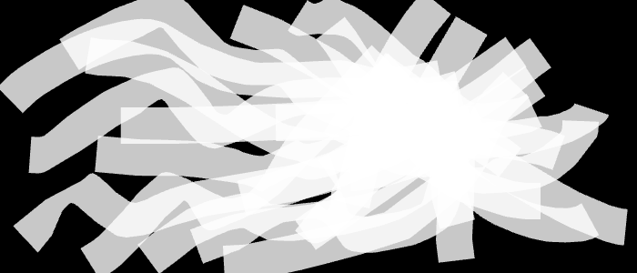
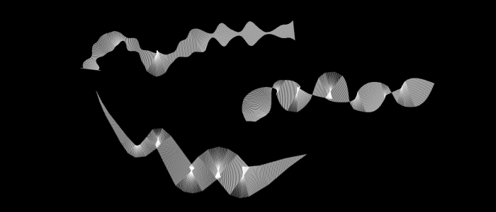

It doesn't seem terribly efficient to add thickness to our lines by drawing lots and lots of normals using `ofLine(...)`.  Instead, we can draw a filled polygon to cover the space that our normal lines are covering.  **[note: explain the winding order here]** So, we want to loop through all of our upper normal bounds from left to right, then loop around and follow the lower normal bounds from right to left.  In order to do this we are going to store our points and normals in vectors [**note: make sure vectors are explained**].  Again, let's comment out the code we just wrote and add in the following:

	float numPoints = polyline.size();
	float normalLength = 40;
	vector <ofVec3f> points;
	vector <ofVec3f> normals;
	for (int p=0; p<100; p+=1) { 
		ofVec3f point = polyline.getPointAtPercent(p/100.0);
		float floatIndex = p/100.0 * (numPoints-1);
		ofVec3f normal = polyline.getNormalAtIndexInterpolated(floatIndex) * normalLength;
		points.push_back(point);
		normals.push_back(normal);
	}

Nothing new here other than using vectors.  But it is important to note that we are using `p+=1` because we want to make sure that we are sampling our polyline at a high resolution.  We are now going to use three new functions: `ofBeginShape()`, `ofVertex(...)` and `ofEndShape()`.  We call [`ofBeginShape()`](http://openframeworks.cc/documentation/graphics/ofGraphics.html#show_ofBeginShape ofBeginShape Documentation Page) to tell openFrameworks that we want to build a polygon, we can then add vertices to the polygon by calling [`ofVertex(...)`](http://openframeworks.cc/documentation/graphics/ofGraphics.html#show_ofVertex ofVertex Documentation Page).  Finally, we finish our shape by calling [`ofEndShape()`](http://openframeworks.cc/documentation/graphics/ofGraphics.html#show_ofEndShape ofEndShape Documentation Page).  Note that we *must* add our vertices in between `ofBeginShape()` and `ofEndShape()`.  To loop through our normals and create the polygon, add:

	ofSetColor(255, 200);
	float numPoints = polyline.size();
	float normalLength = 40;
	ofSetLineWidth(0);
	ofBeginShape();
	for (int p=0; p<100; p+=1) {
		ofVec3f point = polyline.getPointAtPercent(p/100.0);
		float floatIndex = p/100.0 * (numPoints-1);
		ofVec3f normal = polyline.getNormalAtIndexInterpolated(floatIndex) * normalLength;
		ofVertex(point.x+normal.x/2.0, point.y+normal.y/2.0);
	}
	for (int p=90; p>=0; p-=1) {
		ofVec3f point = polyline.getPointAtPercent(p/100.0);
		float floatIndex = p/100.0 * (numPoints-1);
		ofVec3f normal = polyline.getNormalAtIndexInterpolated(floatIndex) * normalLength;
		ofVertex(point.x-normal.x/2.0, point.y-normal.y/2.0);
	}
	ofEndShape();
	
**[Note: explain above code, also maybe mention closing a shape with ofEndShape]**

**[Note: how do we stop drawing the outline of the polygon without setting `ofSetLineWidth(0)`]**

Before running, let's comment out our `polyline.draw()` line of code.  Then let's have at it:

**[Note: ugh, better graphic please]**

**[Note: insert last brush section on using math to control and animate the width of the brush]** 

**[Note: another test graphic, redo later using polygons and make animated]**

Before we get to that, we should modify our code so that we can switch between brushes while our code is running.

Let's define an integer, `drawingMode`, to identify which brush we are currently using, and the numbers `0`, `1`, `2` and `3` will represent the individual brushes.  We will use keyboard inputs to change the `drawingMode`, and then in `draw()`, we will use `drawingMode` to determine which brush code to execute.  So add these public variables to the header file:

	int drawingMode;
	int rectangleMode = 0;  // We define these modes to make our code more readable
	int circleMode = 1;  // This will make more sense when you see the draw() function
	int lineMode = 2;
	int triangleMode = 3;

Assign the initial drawing mode to the rectangle brush in `setup()` using: `drawingMode = rectangleMode`.  Now, we are going to reorganize the `draw()` function so that it looks like this:

	if (isRightMousePressed) ofBackground(0);  // If right mouse button is pressed, then erase the screen
	
	// If left mouse button is pressed, then draw the appropriate brush
	if (isLeftMousePressed) {	
		if (drawingMode == rectangleMode) {
			// Insert the rectangle drawing code here
		}		
		else if (drawingMode == circleMode) { }		
		else if (drawingMode == lineMode) { }		
		else if (drawingMode == triangleMode) { }
	}

Scroll down to find [`keyPressed(int key)`](http://openframeworks.cc/documentation/application/ofBaseApp.html#!show_keyPressed "keyPressed Documentation Page").  Similar to `mousePressed(...)`, this function is called any time a key is pressed, and it receives  an `int` called `key` to identify which key is currently being pressed.    That `int` is the [ASCII](http://en.wikipedia.org/wiki/ASCII "ASCII Wiki Page") code for the key that was pressed.  ASCII is an agreed upon system for assigning numbers to characters.  We will use `key` to change `drawingMode`: “r” for rectangle mode, “c” for circle mode, etc.  In C++, we can compare an integer like `key` with a character directly using `==` or `!=`.  Add these lines to `keyPressed(...)`:

	if (key == 'r') drawingMode = rectangleMode;  // It is important to use `r` and not "r" here
	else if (key == 'c') drawingMode = circleMode;  // See C++ Basics chapter on strings vs char for more info
	else if (key == 'l') drawingMode = lineMode;
	else if (key == 't') drawingMode = triangleMode;

Maybe circles are just too symmetric?   We can turn our circle into an ellipse using:
	
	float scaledWidth = radius * ofRandom(0.8, 1.2);
	float scaledHeight = radius * ofRandom(0.8, 1.2);
	ofEllipse(mouseX+xOffset, mouseY+yOffset, scaledWidth, scaledHeight);

What about outlines?  We can insert `ofNoFill()` into our circle brush code.  Try increasing our `alpha` to 10 and lowering our `radiusStepSize` to 1.  Don't forget that if we start using `ofNoFill()` in our circle brush, we should add `ofFill()` to our rectangle brush!

So we need is to reset the coordinate system using [`ofPushMatrix()`](http://www.openframeworks.cc/documentation/graphics/ofGraphics.html#show_ofPushMatrix "ofPushMatrix Documentation Page") and [`ofPopMatrix()`](http://www.openframeworks.cc/documentation/graphics/ofGraphics.html#show_ofPopMatrix "ofPopMatrix Documentation Page").  `ofPushMatrix()` saves the current coordinate system and `ofPopMatrix()` returns us to the last saved coordinate system.  The reason why they have these functions have the word matrix in them is because of what is happening behind the scenes in openFrameworks.  We start with an un-rotated, un-translated, and un-scaled coordinate system that we used in section 1 of this chapter, which we will call the unmodified coordinate system.  When we start using `ofTranslate(...)`, `ofRotate(...)` and `ofScale(...)`, the rotation, translation and scaling are all stored in a single transformation matrix, which represents the modified coordinate system.  Let's say we have a point (x, y, z) in the unmodified coordinate system, if we multiple it by the transformation matrix, we end up with a new point (x', y', z') that is in modified coordinate system.  The math chapter *[note: point to math chapter]** will go into more depth on this.  I just want to make sure that the word matrix in `ofPushMatrix()` and `ofPopMatrix()` has some context.  If we want, we can just think of it as ofSaveCoordinateSystem and ofReturnToLastSavedCoordinateSystem.

	// Rotated rectangle in red
	
	// Add half rect width and half rect height to the translate, 
	// so that (0,0) is now at the center of the blue rectangle
	ofTranslate(500+100, 200+100); 
	
	// Rotate around the center of the blue rectangle
	ofRotate(45);
	ofSetColor(255, 0, 0);
	
	// Now we want to draw our red rectangle by specifying the upper left corner
	// If we tried ofRect(0,0,200,200), we would draw the red's corner in the center of blue
	// Since (0,0) is currently the cetner of the blue rect, we want to draw the center of our 
	// red rectangle at (0,0).  To do that, we need to draw at (-width/2, -height/2):
	ofRect(-100, -100, 200, 200);
	

**Notes to Self**
- `polyline.getPointAtPercent(0)` and `polyline.getPointAtPercent(1.0)` return the same thing
- Add a line about what happens when alpha is very low (i.e. == 1)
- Rename figures to be more informative

- Section 1.1 Wish List:
  - Link to artists that take this generative brush approach 
  - Setup/update/draw description
  - Talk about how graphics are layered
  - Setting circle resolution
  - `ofDrawBitmapString()`
- Section 1.2.3 Wish List:
  - Key press constants 
  - Explain 8-bits color channels, why they are 0-255
  - Explanation of lerp
  - push/pop style
  - Point to lerp (in the getLerped section)
- Section 1.2.5 Wish List:
  - ofVec2f description that includes div, mult, scaler, etc. 
  - Mention getRotated

***

**[paragraph needs work]** ~~There are plenty of reasons why we might want to create visuals using code rather than with pencil and paper.  Code allows for easy repetition.  We can design a simple rule for making a mark on screen, and then we can repeat that rule and cover the screen in milliseconds.   Code allows for animation - from simple shapes wiggling on our screen to movies like Pixar's Monsters, Inc.  Code allows for interactivity, which ranges from games to web browsing.  Most importantly to me, code allows us to engage with digital information.  We can visualize and explore data.  We can take digital imagery and reimagine it.~~    

**[insert images of the works of artists making inspiring generative visuals]**