***

**Notes to Self**
- Condense!
- Break apart the chapter into more clearly defined sections
    - Each section should have an overview paragraph to give readers a better roadmap of what is coming
	- Optimally, I'd like each section to have suggestions of advanced extensions that could be made to the project
- Write introduction section
- Fill in missing graphics, flesh out descriptions, update ugly graphics
- Insert three small sections: saving a rasterized graphic, saving a vector graphic and saving an animation
- Write addons/more info section
- Rename figures to be more informative
- Change ++i to i++
- Change in-line references to functions that require parameters: use `functionName(...)` 
- Add arc to basic shapes?
- Use "we" + "our" over "you" + "your"
- How are links being handled?  I don't explicitly point them out most of the time since that would be redundant in an online version.

- Section 1.1 Wish List:
  - Setup/update/draw description
  - Talk about how graphics are layered
  - Setting circle resolution
  - `ofDrawBitmapString()`

***

# Graphics #

**Personal Introduction TDB**

This chapter is going to build off of the C++ Basics chapter **[chapter number]** and Project Setup and Structure chapter **[chapter number]**, so if you aren't already familiar with C++ and creating openFrameworks projects, definitely check out those chapters before diving into graphics.  

**[paragraph needs work]** ~~There are plenty of reasons why you might want to create visuals using code rather than with pencil and paper.  Code allows for easy repetition.  We can design a simple rule for making a mark on screen, and then we can repeat that rule and cover the screen in milliseconds.   Code allows for animation - from simple shapes wiggling on your screen to movies like Pixar's Monsters, Inc.  Code allows for interactivity, which ranges from games to web browsing.  Most importantly to me, code allows us to engage with digital information.  We can visualize and explore data.  We can take digital imagery and reimagine it.~~    

**[insert images of the works of artists making inspiring generative visuals]**

We are going to focus in on a mixture of repetition and interactivity in this chapter.  

In the first half of the chapter **[note which sections]**, we will be designing digital "paintbrushes."  If we pick up a paintbrush, dip it in some paint and then drag it across some canvas, physics is going to determine the characteristics of the resulting mark - the pressure we exert on the brush, the force of gravity pulling the paint downward, the ability of the paper to absorb water, etc.  When we digitize this process, the mouse will be our brush, and we get to create our own physics.  We create the rules that dictate how our brush makes marks on the screen.  ~~So we will use these brushes to create some images (that's the interactive part) and the brush physics will involve generating a lot of simple shapes (that's the repetition part).~~ **[last sentence doesn't flow well]** 

In the second half of the chapter **[note which sections]**, we will take a break from interactivity and create a hypnotizing animation of spiraling, repeating rectangles.  

Along the way from brushes to animated rectangles **[note which sections]**, we will learn how to save our work as images and animated gifs.  If you can't save and share your work, why make it?

**Our chapter roadmap:**

1. [Brushes with Basic Shapes](#empty)
  1. [Basic Shapes](#empty)
  1. [Brushes from Basic Shapes](#empty)
  1. [Saving Raster Graphics](#empty)
1. [Brushes with Freeform Shapes](#empty)
  1. [Freeform Shapes](#empty)
  1. [Brushes from Freeform Shapes](#empty)
  1. [Saving Vector Graphics](#empty)
1. [Coordinate Transformations](#empty)
  1. [Translating](#empty) 
  1. [Rotating and Scaling](#empty)
  1. [Saving Animated Graphics](#empty)

## 1. Brushes with Basic Shapes ##

**[Insert section on Setup/Update/Draw if Roy hasn't covered it]**

To create brushes, we need to define some basic building blocks of graphics.  We can classify the 2D graphics functions into two categories: basic shapes and freeform shapes.  Basic shapes are rectangles, circles, triangles and straight lines.  Freeform shapes are polygons and paths.  This classification of shapes is loose, and what it really amounts to is that basic shapes are easier to use but less flexible than the freeform shapes.

### 1.1 Basic Shapes ###

We have some basic building blocks, but how do we specify where we want to draw them on the screen?  Computer graphics use something called the [Cartesian coordinate system](http://en.wikipedia.org/wiki/Cartesian_coordinate_system "Wiki on Cartesian coordinate system").  Remember these grids from math class?

To locate a point in the Cartesian coordinate system we need to know two things.  First, we need a reference point, (0, 0), which we called the origin.  Second, we need to know a pair of values, (x, y), that tell us how far away our point is from the origin.  Positive x values are located to the right of the origin; negative x values are to the left of the origin; positive y values are above the origin; and negative y values are below the origin.

Computer graphics are based on this same system.  If we want to draw something on the screen, we can specify the pixels where we want to draw with (x, y).  There are two twists.  First, the (0, 0) point is the upper leftmost pixel.  Second, the y axis is flipped such that the positive y direction is located below the origin.  Let's zoom in on the top left of my screen, which happens to be my browser, to illustrate the graphical coordinate system:

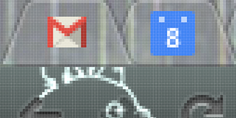

**[Finish this graphic by getting a better resolution on the grid lines and by overlaying an x- and y-axis]** 

Now we have all the concepts needed to draw graphics to a screen, but we don't yet know the syntax.  Time to start coding some basic shapes.  Create a new openFrameworks project and call it something more imaginative than "BasicShapes."  Open up the project in your preferred IDE **[point to roy's chapter]**.  

If we compile and run the project, we would see a gray screen.  We are going to change that by drawing one of each of the basic shapes (on each frame).  Open the source file, ofApp.cpp, and navigate to the `draw()` function.  Add the following:
    
	// Clear the screen with a black color
	ofBackground(0);
    
	// Set the drawing color to white
	ofSetColor(255);
	
	// Draw some filled shapes
	ofRect(50, 50, 100, 100);
	ofCircle(250, 100, 50);
	ofEllipse(400, 100, 80, 100);
	ofTriangle(500, 150, 550, 50, 600, 150);
	ofLine(700, 50, 700, 150);

**[need to make sure readers understand draw loop at this point]**  When we run the code, we see white shapes on a black background.  Success!  Each time our draw function executes, three things happen.  

First, we clear the screen by drawing a solid black background using [`ofBackground(...)`](http://www.openframeworks.cc/documentation/graphics/ofGraphics.html#show_ofBackground "ofBackground Documentation Page").  The `0` represents a grayscale color where `0` is completely black and `255` is completely white.  We'll be getting into other ways of specifying color in the next section.

Second, we tell openFrameworks what color it should use when drawing using [`ofSetColor(...)`](http://openframeworks.cc/documentation/graphics/ofGraphics.html#show_ofSetColor "ofColor Documentation Page").  We can think of this code as telling openFrameworks to pull out a particular colored sharpie.  When we draw, we will draw in that color until we specify that we want another color.

Third, we draw our basic shapes: `ofRect(...)`, `ofCircle(...)`, `ofEllipse(...)`, `ofTriangle(...)` and `ofLine(...)`.  With [`ofRect(...)`](http://openframeworks.cc/documentation/graphics/ofGraphics.html#!show_ofRect "ofRect Documentation Page"), we pass in the x and y values of the top left corner as well as the rectangle width and height, all in that order.  For [`ofCircle(...)`](http://openframeworks.cc/documentation/graphics/ofGraphics.html#show_ofCircle "ofCircle Documentation Page"), we pass in the x and y values of the center of the circle and the radius.  With [`ofEllipse(...)`](http://openframeworks.cc/documentation/graphics/ofGraphics.html#show_ofEllipse "ofEllipse Documentation Page"), we pass in the x and y values of the center as well as the width and height.  For [`ofTriangle()`](http://openframeworks.cc/documentation/graphics/ofGraphics.html#show_ofTriangle "ofTriangle Documentation Page"), we pass in the x and y positions of the three corners of the triangle.  Finally, with [`ofLine(...)`](http://openframeworks.cc/documentation/graphics/ofGraphics.html#show_ofLine "ofLine Documentation Page"), we pass in the x and y coordinates of the two endpoints of our desired straight line.

It is worth noting that these functions all have multiple ways that we can use them, so check out their documentation pages for more information.

But what if we only wanted to draw the outlines of our shapes?  There are two functions, [`ofFill()`](http://openframeworks.cc/documentation/graphics/ofGraphics.html#!show_ofFill "ofFill Documentation Page") and [`ofNoFill()`](http://openframeworks.cc/documentation/graphics/ofGraphics.html#!show_ofFill "ofNoFill Documentation Page"), that between drawing filled shapes and drawing outlines.  Our sharpie analogy from eariler doesn't fit with these functions - what would a sharipe that only draws outlines look like?  The concept still applies.  `ofFill()` tells openFrameworks to draw filled shapes until told otherwise.  `ofNoFill()` does the same but with outlines.  

Head back into our `draw()` function, and modify it so that it look like this:

	// Clear the screen with a black color
	ofBackground(0);
	
	// Set the drawing color to white
	ofSetColor(255);
    
	// If we omit this and leave ofNoFill(), all the shapes will be outlines!
	ofFill(); 
	
	// Draw some filled shapes
	ofRect(50, 50, 100, 100);
	ofCircle(250, 100, 50);
	ofEllipse(400, 100, 80, 100);
	ofTriangle(500, 150, 550, 50, 600, 150);
	ofLine(700, 50, 700, 150);
    
	// If we omit this and leave ofFill(), all the shapes will be filled!
	ofNoFill(); 
	
	// Draw some shape outlines
	ofRect(50, 250, 100, 100);
	ofCircle(250, 300, 50);
	ofEllipse(400, 300, 80, 100);
	ofTriangle(500, 250, 550, 50, 600, 150);
	ofLine(700, 250, 700, 350);

Now we have two rows of shapes on our screen - one filled and one outlines.  We can control the thickness of the outlines, and our `ofLine(...)` lines, using [`ofSetLineWidth(...)`](http://openframeworks.cc/documentation/graphics/ofGraphics.html#show_ofSetLineWidth "ofSetLineWidth Documentation Page").  Like `ofSetColor(...)` and `ofFill()`, `ofSetLineWidth(...)` will apply to all lines drawn until the thickness is set to a new value.  

Add the following lines to the `draw()` function:

	// Code omitted for clarity ...
	
	// If we omit this and leave ofNoFill(), all the shapes will be outlines!
	ofFill();
	ofSetLineWidth(1); // Default value is 1
	
	// Code omitted for clarity ...
	
    	// If we omit this and leave ofFill(), all the shapes will be filled!
	ofNoFill();     
	ofSetLineWidth(2); // A higher value will render thicker lines
	
	// Code omitted for clarity ...

We've got the recipes for basic shapes down, but let's add one more detail before moving on to brushes: [anti-aliasing](http://en.wikipedia.org/wiki/Spatial_anti-aliasing "Wiki on spatial anti-aliasing").  Our lines and outlines look a bit blocky, like paths of jagged pixels.  Anti-aliasing refers to a set of techniques that smooth out those jagged edges. Simply add [`ofEnableAntiAliasing()`](http://openframeworks.cc/documentation/graphics/ofGraphics.html#show_ofEnableAntiAliasing "ofEnableAntiAliasing Documentation Page") to your `setup` function, and poof, smoother lines.

**Extensions**

Let's say we wanted some challenges, we could:
- Draw some rounded rectangles using [`ofRoundedRect(...)`](http://openframeworks.cc/documentation/graphics/ofGraphics.html#!show_ofRectRounded "ofRoundedRect Documentation Page).
- Explore the world of curved lines with [`ofCurve(...)`](http://openframeworks.cc/documentation/graphics/ofGraphics.html#!show_ofCurve "ofCurve Documentation Page") and [`ofBezier(...)`](http://openframeworks.cc/documentation/graphics/ofGraphics.html#!show_ofBezier "ofBezier Documentation Page").
- Revisit the code from the C++ basics chapter **[chapter number]**.
  - Create a bouncing ball using `ofCircle(...)`.
  - Draw some randomly sized lines using `ofLine(...)`.

#### 1.1b Drawing to the screen! (But now the fun bits.) ####

You survived the boring bits!

Well, the necessary bits.  Why draw a single rectangle, when you can draw a million?  (Okay, not a million - but at least enough that you wouldn't bother counting.)

Let's create a new openFrameworks sketch and call it something like ShapeBrush.  We are going to use the basic recipes from the last section and mix in some randomness and repetition to create a digital "brush."  When we click somewhere on the screen, we will draw an explosion of random shapes.  To do this, we will need a canvas that doesn't constantly erase itself, and by default, openFrameworks clears the screen every frame with each invocation of `draw()`. Calling [`ofSetBackgroundAuto()`](http://openframeworks.cc/documentation/graphics/ofGraphics.html#show_ofSetBackgroundAuto "ofSetBackgroundAuto Documentation Page") allows us to control whether or not openFrameworks clears the background at the beginning of each frame.  Add the following lines into your `setup` function:

	ofSetBackgroundAuto(false);
	ofBackground(0); // If you omit this, the screen will be a default gray color

`ofSetBackgroundAuto()` requires a boolean parameter so let's pass in `false` to prevent the black background from being re-drawn each frame.  **[Note: point to c++ chapter's description of bools?]**   

Great!  We've created an exceptionally empty space that we can overload with shapes.

Since we will be doing all of our drawing inside of the `draw()` function we need to create some variables that let us know 1) where the mouse is located on the screen and 2) whether or not the left mouse button is being pressed.

For 1), we can use two built-in openFrameworks variables `mouseX` and `mouseY`.  These variables are updated internally by openFrameworks and we can use them inside our `draw()` function as we would any other integer variables.

For 2), we should take a look at two functions inside our openFrameworks source file (.cpp) that you probably haven't had a need to use yet: [`mousePressed()`](http://www.openframeworks.cc/documentation/application/ofBaseApp.html#show_mousePressed "mousePressed Documentation Page") and [`mouseReleased()`](http://www.openframeworks.cc/documentation/application/ofBaseApp.html#show_mouseReleased "mouseReleased Documentation Page") **[bd: I removed the parameters from the previous function listings per your convention that is used throughout the rest of the chapter. I think it is more clear to refer to function names without their parameters in the text and then illustrate the parameters in code examples but that is just my opinion.]**.  These functions are called by openFrameworks anytime the mouse button is pressed or released.  Each receives the x and y position of the mouse when the mouse was pressed/released as well as an integer representing which mouse button was pressed/released as its three parameters.   We can use this information to set up a boolean variable, `isLeftMousePressed`, and update its value when a mouse press/release event is triggered using these two functions.

Let's add this as a public property to our header file (.h):

**[note: point to properties section of c++ section]**

	bool isLeftMousePressed;

And add this inside of our `setup()` function in our source file (.cpp):

	isLeftMousePressed = false;  

Finally, add these lines to your `mousePressed()` and `mouseReleased()` functions:

	void testApp::mousePressed(int x, int y, int button){
		if (button == OF_MOUSE_BUTTON_LEFT) isLeftMousePressed = true;
	}
	
	void testApp::mouseReleased(int x, int y, int button){
		if (button == OF_MOUSE_BUTTON_LEFT) isLeftMousePressed = false;
	}

Whenever a button on the mouse is pressed or released, we want to check if that button is the left mouse button.  If it is, then we can update our `isLefMousePressed` boolean appropriately.  The `button` variable is an integer that identifies which button is being pressed/released and openFrameworks provides some handy constants that we can use to identify the button in a human-readable way (`OF_MOUSE_BUTTON_LEFT`, `OF_MOUSE_BUTTON_MIDDLE` and `OF_MOUSE_BUTTON_RIGHT`).  If we really wanted, we *could* just say `button == 0` to test for whether the pressed/released button is the left mouse button.

Let's hop into the `draw()` function and start making use of our mouse information:

	if (isLeftMousePressed) {
		ofSetColor(255);
		ofSetRectMode(OF_RECTMODE_CENTER);
		ofRect(mouseX, mouseY, 50, 50);
	}

[`ofSetRectMode()`](http://www.openframeworks.cc/documentation/graphics/ofGraphics.html#show_ofSetRectMode "ofSetRectMode Documentation Page") allows us to control how the x and y positions we pass into `ofRect()` are used to draw a rectangle.  Like with the mouse button constants, openFrameworks provides some rectangle mode constants for us to use: `OF_RECTMODE_CORNER` and `OF_RECTMODE_CENTER`.  By default rectangles are drawn by interpreting the x and y values we pass to it as the coordinates of the upper left corner (`OF_RECTMODE_CORNER`).  For our purposes, it is more convenient for us to specify the center of the rectangle (`OF_RECTMODE_CENTER`) so that our rectangle is centered over the mouse position.  So we draw the center of our white 50 x 50 rectangle at the mouse position using `mouseX` and `mouseY`.

Boring! We are going to make this a bit more interesting by adding 1) randomness and 2) repetition.

Randomness makes your openFrameworks sketches dark, mysterious and unpredictable.  So meet one of our new friends, [`ofRandom()`](http://openframeworks.cc/documentation/math/ofMath.html#!show_ofRandom "ofRandom Documentation Page").  `ofRandom()` can be used in two different ways: by passing in two values `ofRandom(float min, float max)` or by passing in a single value `ofRandom(float max)`.  If we pass in two values, they become the minimum and maximum values we want our random value to take.  If we pass in a single value, it is considered to be the maximum value we want and the minimum is assumed to be 0.  So when we specify the color of the rectangle we are about to draw, we can substitute a random value:

	ofSetColor(ofRandom(50, 255));

**[Note: Aside on what computer randomness is?]**

**[Note: Point to c++ section on float vs int and casting?]**

Remember that we are using grayscale colors and that they are represented by values between 0 and 255.  We can exclude some of the deep black colors because they won't be visible to us when drawing on a black background.  

**[Note: change image to cursive 'hi'?]**

**[Note: reference to c++ loops section?]**

Next, let's add some repetition. Instead of drawing a single rectangle every frame that the left mouse button is pressed, we can draw a burst of randomized rectangles.  To create that burst we are going use a `for` loop to generate some rectangles whose parameters are randomly chosen from a set of values.  So what can we randomize?  Grayscale color, width and height are easy candidates.  We can also use a small positive or negative value to randomly offset each rectangle from mouse position.  Modify your `draw()` function to look like this:  

**[What is the convention for 'for' loops]**

	if (isLeftMousePressed) {
		ofSetRectMode(OF_RECTMODE_CENTER);
		int numRects = 10;
		for (int r=0; r<numRects; r++) {
			ofSetColor(ofRandom(50, 255));
			float width = ofRandom(5, 20);
			float height = ofRandom(5, 20);
			float xOffset = ofRandom(-40, 40);
			float yOffset = ofRandom(-40, 40);
			ofRect(mouseX+xOffset, mouseY+yOffset, width, height);
		}
	}

But let's add one more thing inside `setup()` before hitting run.

	ofSetFrameRate(60);

**[Note: do I need to explain framerate?]**

Why do we care about setting the frame rate here?  We want to be able to accurately know (and control) how many rectangles our code will draw.  We are drawing 10 each frame when the `draw()` function is called, but without setting the frame rate, we don't know how many times the `draw()` function will be called per second.  By explicitly defining the frame rate as 60 frames per second, we can say that our code will generate 60 rectangles per second (`10 rectangles per frame * 60 frames per second = 60 rectangles per second`).

So what happens when we try using our new rectangle brush?  You get a messy, box-shaped spread of random rectangles.  Things are slowly becoming more interesting as you might have been expecting to see a circular spread?  Since we said that `xOffset` and `yOffset` could be random values between -40 and 40, we were actually picking values from a rectangular region of space.  You can imagine the boundaries of that region by thinking about what happens when `xOffset` and `yOffset` take on their extreme values (e.g. [`xOffset`, `yOffset`] values of [-40, -40], [40, -40], [40, 40], [-40, 40]).

To generate a circular spread, we need to introduce a bit of mathematics.  If we want to pick a random point that lives within a circle of a particular size, it helps to think in terms of angles.  Imagine that we are at the center of a circle.  If we rotate a random amount (let's call this the *polar angle*) and then move a random distance (let's call this the *polar radius*), we will end up in a random location within the circle (assuming we don't walk so far that we cross the boundary of our circle).  We've defined a point in space by a polar angle and a polar radius instead of using an x coordinate and a y coordinate.  We have just begun to think think in terms of [polar coordinates](http://en.wikipedia.org/wiki/Polar_coordinate_system "Polar Coordinates Wiki").  (In contrast, using x and y values to represent a point in space is called the [Cartesian coordinate system](http://en.wikipedia.org/wiki/Cartesian_coordinate_system "Cartesian coordinate system"]).)

**[Note: This could use a simple visual to show cartesian vs polar coords]**
**[bd: I can make a visual for you. remind me if I haven't done it by the time you read this.]**

So where does this leave us in terms of our code?  We want to pick a random direction (polar angle) and random distance (polar distance) from the mouse position and represent those values in polar coordinates.  Once we have those we can convert them back to Cartesian coordinates (x and y values) to be used for our `xOffset` and `yOffset`.  Let's modify our for loop inside of our `draw()` function to look like this:

**[Note: Explain the trig conversion from polar to cartesian, or point to the math chapter section?]**

	for (int r=0; r<numRects; r++) {
		ofSetColor(ofRandom(50, 255));
		float width = ofRandom(5, 20);
		float height = ofRandom(5, 20);
		float angle = ofRandom(2.0*PI);
		float distance = ofRandom(35);
		float xOffset = cos(angle) * distance;
		float yOffset = sin(angle) * distance;
		ofRect(mouseX+xOffset, mouseY+yOffset, width, height);
	}

**[Note: explain radians vs degrees]**

**[Note: if there is room, add in a gaussian distribution via box-muller transform]**

**[Note: Insert an image using the rectangle brush]**

You are now a rectangle master :).  The circles, ellipses, lines and triangles probably feel neglected.  Since we are going to create a few more brushes let's add two things to our code: 1) the ability to completely erase the screen and 2) the ability to switch between brushes.

Add the following lines to erase the screen.

In your header file (.h), create a property called `isRightMousePressed`:
	
	bool isRightMousePressed;

Initialize the property to false in your `setup()` function:
	
	isRightMousePressed = false;

Inside of `mousePressed()`, add:

	if (button == OF_MOUSE_BUTTON_RIGHT) isRightMousePressed = true; 

Inside of `mouseReleased()`, add:

	if (button == OF_MOUSE_BUTTON_RIGHT) isRightMousePressed = false;
	
Lastly, add this to the beginning of your `draw()` function:

	if (isRightMousePressed) ofBackground(0);

Now we can right click to get a fresh screen.  To add the ability to switch between brushes we are going to define an integer `drawingMode`.  Each number from 0 through 3 will represent a unique mode.  To make our code more human-readable, we will define an integer variable for each of those modes, e.g. `rectangleMode = 0`, etc.  Inside of `draw()` we can then check the `drawingMode` variable to determine what code to execute.  Finally, we will use keyboard inputs to switch between the different brush modes.

Add these properties to your header file (.h):

	int drawingMode;
	int rectangleMode = 0;
	int ellipseMode = 1;
	int circleMode = 2;
	int lineMode = 3;
	int triangleMode = 4;

Assign your first drawing mode to the rectangle brush in your `setup()` function:

	drawingMode = rectangleMode;

We are going to reorganize the `draw()` function so that it looks like this:

	// If right mouse button is pressed, then erase the screen
	if (isRightMousePressed) ofBackground(0);
	
	// If left mouse button is pressed, then draw the appropriate brush
	if (isLeftMousePressed) {
	
		if (drawingMode == rectangleMode) {
			// Insert the rectangle drawing code you wrote here
		}
		
		else if (drawingMode == circleMode) {
		}
		
		else if (drawingMode == lineMode) {
		}
		
		else if (drawingMode == triangleMode) {
		}
	}

We are going to make use of the [`keyPressed(int key)`](http://openframeworks.cc/documentation/application/ofBaseApp.html#!show_keyPressed keyPressed "Documentation Page") function that is already built into your openFrameworks `.cpp` file to handle key events.  Like `mousePressed()`, this function is called any time a key is pressed.  We can use the integer that is passed into `keyPressed()` to switch our `drawingMode` variable.  We will use "r" for rectangle mode, "c" for circle mode, etc.  

But how exactly does an integer tell us which key has been pressed?  That integer is actually the ASCII code for the key that was pressed.  You can check out the [ASCII wiki](http://en.wikipedia.org/wiki/ASCII "ASCII Wiki Page") for details, but for this chapter it is enough to just know that ASCII is an agreed upon system for assigning numbers to characters.  It turns out to be quite easy to check if the ASCII integer `key` is a particular character. Add these lines to your `keyPressed()` function to see what this looks like in code.

	if (key == 'r') drawingMode = rectangleMode;
	else if (key == 'c') drawingMode = circleMode;
	else if (key == 'l') drawingMode = lineMode;
	else if (key == 't') drawingMode = triangleMode;

**[bd: will the reader have been made aware at this point that single-line if statements can be written without curly brackets?]**

In C++, you can compare an integer like `key` with a character using `==` or `!=`.

**[Note: Explain char vs int, the double quote vs single quote.  Or is this in c++ chapter]**

**[Note: the constants that oF provides for key presses]**

Whew! When you run your code, you should now be able to clear your screen and switch between brushes.  Let's fill in those circle, line and triangle brushes!

For our circle brush, let's play with transparency and add some color.  Unlike what we did with rectangles, we are going to layer our circles on top of each other until they become hazy and indistinct.  We are going to draw a giant transparent circle, then draw a slightly smaller transparent circle, then repeat, repeat, repeat.

So far, we've only used opaque grayscale colors but you can make your colors transparent by adding an extra parameter to `ofSetColor()` (e.g.`ofSetColor(255, 50)`).  That second parameter represents the alpha channel.  It takes a value from 0 to 255 where 0 is completely transparent and 255 is completely opaque.  Before we use colors that have alpha we need to enable something called alpha blending.  This means that when two transparent colors occupy the same space on the screen, their colors get mixed.  Alpha blending is disabled by default because it requires additional computing power.  Let's add the following line to our `setup()` function:

	ofEnableAlphaBlending();

Now we can start working on our `draw()` function.  We will use the `angle`, `distance`, `xOffset` and `yOffset` code like we did with the rectangle brush.  The difference is that our loop will control the radius of our circle.  We will start by drawing a circle with a large radius value and slowly reduce it to 0.  Add the following to `draw()` inside of our if statement to check if the `drawingMode` is `circleMode`:

	int maxRadius = 100;
	int radiusStepSize = 5;
	int alpha = 3;
	int maxOffsetDistance = 100;
	for (int radius=maxRadius; radius>0; radius-=radiusStepSize) {
		float angle = ofRandom(2.0*PI);
		float distance = ofRandom(maxOffsetDistance);
		float xOffset = cos(angle) * distance;
		float yOffset = sin(angle) * distance;
		ofSetColor(255, alpha);
		ofCircle(mouseX+xOffset, mouseY+yOffset, radius);
	}

The result is something like drawing with a glowing light.  You can play with the `maxRadius`, `radiusStepSize`, `alpha` and `maxOffsetDistance` to make that glowing effect stronger, weaker, narrower or wider.

Kind of cool right?  You are probably tired of having to live in moody shades of gray for so long.  `ofSetColor()` can make use of the RGB color model in addition to the grayscale color model.  If you haven't heard of RGB before, you can check out the [wiki](http://en.wikipedia.org/wiki/RGB_color_model "Wiki on RGB Color Model").  It allows you to specify a color through quantifying the amount of red, blue and green light present in that color.  We refer to these color components as channels, and each channel can be represented by a value from 0 to 255.  (Alpha is a fourth possible channel.) Here are the forms of `ofSetColor()` we can now use:

**[Note: would it be helpful to somewhere explain 24-bit/32-bit color and where 256 comes from?]**

**[Note: would it be helpful to have a RGB diagram?]** **[bd: yes]**

	ofSetColor(255); // Opaque grayscale white
	ofSetColor(255, 10); // Very transparent grayscale white
	ofSetColor(255, 0, 0); // Opaque red! Hooray for color :)
	ofSetColor(255, 0, 0, 10); // Very transparent red

Let's go ahead and modify the `ofSetColor()` in our above circle brush code to use some color.  Here is a nice orange: `ofSetColor(255, 103, 0, 3)`.

There's another way we can use `ofSetColor()` that is also useful.  Meet [`ofColor`](http://openframeworks.cc/documentation/types/ofColor.html "ofColor Documentation Page"].  This is a handy class that openFrameworks provides for handling colors which allows you to do some fancy color math (among other things). Here are some examples of defining and modifying colors:

	ofColor myOrange(255, 132, 0); // Opaque orange color - specified using RGB
	
	ofColor myBlue(0, 0, 255, 50); // Transparent blue color - specified using RGBA
	
	// You can access the red, green, blue and alpha channels like this:
	ofColor myGreen(0, 0, 255, 255);
	
	cout << "Red channel:" << myGreen.r << endl;
	cout << "Green channel:" << myGreen.g << endl;
	cout << "Blue channel:" << myGreen.b << endl;
	cout << "Alpha channel:" << myGreen.a << endl;
	
	// You can also set the red, green, blue and alpha channels like this:
	ofColor myYellow;
	myYellow.r = 255;
	myYellow.b = 0;
	myYellow.g = 255;
	myYellow.a = 255;

Now, let's say that instead of just using an orange or a red color for our circle brush, what if we want to pick a random color in-between orange and red?  `ofColor` has a solution for using what is called [linear interpolation](http://en.wikipedia.org/wiki/Linear_interpolation "Wiki for Linear Interpolation").  Replace your `ofSetColor` line of code with these four lines: 

**[Note: explain lerp for the math averse and explain the syntax]**

	ofColor myOrange(255, 132, 0, alpha);
	ofColor myRed(255, 6, 0, alpha);
	ofColor inBetween = myOrange.getLerped(myRed, ofRandom(1.0));
	ofSetColor(inBetween);
	
Maybe we aren't a fan of circles?  We can turn our circle into an ellipse using:
	
	float scaledWidth = radius * ofRandom(0.8, 1.2);
	float scaledHeight = radius * ofRandom(0.8, 1.2);
	ofEllipse(mouseX+xOffset, mouseY+yOffset, scaledWidth, scaledHeight);

What if we use outlines instead of solid shapes by inserting `ofNoFill()` into our circle brush code?  If we do that, let's try increasing our `alpha` to 10 and lowering our `radiusStepSize` to 1.  Don't forget that if we start using `ofNoFill()` in our circle brush, we should add `ofFill()` to our rectangle brush!

**[Note: opportunity to explain push/pop style]**

**[Note: if there is time, extension with using an exponential decay for circle radius]**

**[Note: Why does the hue break when using alpha == 1?]**

Rectangles, check.  Circle and ellipses, check.  What about lines?  We're all familiar with an asterisk, right?  We are going to create a brush that draws a bunch of lines that all intersect at their midpoints to create something similar to an asterisk. Done correctly, this should look like a twinkling star.  

The code we've learned so far is almost all that we need to create this brush.  We will draw a set of randomly sized lines that extend out from the mouse position in random directions.  If we want our brush to look a bit more "twinkly" we can make it brightest in the center and fade towards the periphery.  Let's add the following to the line brush section of the `draw()` function:

	int numLines = 30;
	int minRadius = 25;
	int maxRadius = 125;
	for (int i=0; i<numLines; ++i) {
		float distance = ofRandom(minRadius, maxRadius);
		float angle = ofRandom(2.0*PI);
		float xOffset = cos(angle) * distance;
		float yOffset = sin(angle) * distance;
		float alpha = ofMap(distance, minRadius, maxRadius, 50, 0);
		ofSetColor(255, alpha);
		ofLine(mouseX, mouseY, mouseX+xOffset, mouseY+yOffset);
	}

By golly what have we done with the alpha?  We've introduced a new function called [`ofMap`](http://www.openframeworks.cc/documentation/math/ofMath.html#show_ofMap "ofMap Documentation Page").  This function provides a quick way to do a linear interpolation.**[note: link to math]**. To get a "twinkle" we want our shortest lines to be the most opaque and our longer lines to be the most transparent.  We want to tie the alpha parameter to the distance parameter.  `ofMap` takes a value from one range and maps it into another range like this: `ofMap(float value, float inputMin, float inputMax, float outputMin, float outputMax)`.  We tell it that distance is a value in-between `minRadius` and `maxRadius` and that we want it mapped so that a distance value of 125 (`maxRadius`) returns an alpha value of 50 and a distance value of 25 (`minRadius`) returns an alpha value of 0.  The longer the line, the more transparent the color.

We could also play with the line thickness if we wanted to:
	
	ofSetLineWidth(ofRandom(1.0, 5.0));

Just remember that if we change the line width here we will need go back and set our line width back to 1 for our other brushes. 

**[Note: maybe expand upon linking variables together - now that we know how to do this, what could we have done with your prior brushes to make them cooler?]**

Time for the last brush from a predefined shape - the triangle!  The general idea for this brush is to draw a bunch of randomized triangles that appear to be directed outward from the mouse position like this:

But first we will need to introduce the [`ofVec2f`](http://openframeworks.cc/documentation/math/ofVec2f.html "ofVec2f Documentation Page") class.  We've been defining a point in space by keeping two separate variables - one for the x position and one for the y position.  A triangle is defined by three points, so we would end up with six separate variables if we tried to represent one using what we know so far.  `ofVec2f` is a vector, and as 2 dimensional vector that allows us to hold both the x and y coordinates in one variable. It also comes with some handy math operations.  You can use an ofVec2f variable like this:

	ofVec2f mousePos(mouseX, mouseY);
	
	// Access the x and y coordinates like this: 
	cout << "Mouse X: " << mousePos.x << endl;
	cout << "Mouse Y: " << mousePos.y << endl;
	
	// Or you can modify the coordinates like this:
	float xOffset = 10.0;
	float yOffset = 30.0;
	mousePos.x += xOffset;
	mousePos.y += yOffset;
	
	// But you can do what we just did above by adding or subtracting two vectors directly
	ofVec2f offset(10.0, 30.0);
	mousePos += offset;
	
**[Note: this may need more description; division/mult, scaler vs vector]**

ofVec2f isn't that scary, right?  Plus it's actually quite useful.  Let's start using it to build the triangle brush.  The first step is to draw an isosceles triangle at the mouse cursor. 

**[Note: Stolen graphics from wolfram, generate something similar later]**

An isosceles triangle has two sides that are of equal length (labeled as b) and one side of a different length (labeled a).  You can also see that the height (labeled h) is drawn in the figure.  We are going to draw a skinny triangle using one side (a) and the height (h).  It will become important later, but we are going to draw our triangle starting from the mouse cursor and pointing to the right.  Add these lines to the triangle section of your `draw()` function:

	ofVec2f mousePos(mouseX, mouseY);
	
	// Define the parameters of the triangle
	float triangleHeight = 100;
	float triangleSide = triangleHeight/2.0;
	
	// Define a triangle around the origin (0,0)
	ofVec2f p1(0, triangleSide/2.0);
	ofVec2f p2(triangleHeight, 0);
	ofVec2f p3(0, -triangleSide/2.0);
	
	// Shift the triangle to the mouse position
	p1 += mousePos;
	p2 += mousePos;
	p3 += mousePos;
	
	ofSetColor(255, 50);
	ofTriangle(p1, p2, p3);

We are defining the three points of the triangle using three points set relative to the mouse position.  If all goes well, we will end up with something like this:

We've just used vectors!  Now we are going to want to be able to rotate our triangles to point in any direction.  Previously, we've fearlessly used trigonometry (sin and cos) for our rotations.  But `ofVec2f` has a [`rotate()`](http://www.openframeworks.cc/documentation/math/ofVec2f.html#show_rotate "ofVec2f's rotate function documentation page") function.  Let's try adding rotation into our code:

	ofVec2f mousePos(mouseX, mouseY);
	
	// Define the parameters of the triangle
	float triangleHeight = 100;
	float triangleSide = triangleHeight/2.0;
	
	// Define a triangle around the origin (0,0)
	ofVec2f p1(0, triangleSide/2.0);
	ofVec2f p2(triangleHeight, 0);
	ofVec2f p3(0, -triangleSide/2.0);
	
	// Rotate the triangle points around the origin
	float rotation = ofRandom(360); // Uses degrees!
	p1.rotate(rotation);	
	p2.rotate(rotation);
	p3.rotate(rotation);
	
	// Shift the triangle to the mouse position
	p1 += mousePos;
	p2 += mousePos;
	p3 += mousePos;
	
	ofSetColor(255, 50);
	ofTriangle(p1, p2, p3);

See how `ofVec2f` simplifies your life (or at least your code)?  If we were to move that rotation code to *after* we shifted the triangle to the mouse position, the code wouldn't work very nicely.  The way we are using `rotate` assumes that we want to rotate all of our points around the origin, which is (0,0).  But there is an alternate way to use `rotate()` where we pass in two parameters: the rotation angle and a pivot point.  We could shift our triangle to the mouse position and then use `p1.rotate(rotation, mousePos)` - everything would work just fine!

We're getting there!  Next step, let's integrate this code into our prior approach of drawing multiple shapes that are offset from the mouse position:

	ofVec2f mousePos(mouseX, mouseY);
	
	int numTriangles = 10;
	int minOffset = 5;
	int maxOffset = 70;
	int minHeight = 6;
	int maxHeight = 20;
	int alpha = 150;
	
	for (int t=0; t<numTriangles; ++t) {
		float offsetDistance = ofRandom(minOffset, maxOffset);
		float triangleHeight = ofMap(offsetDistance, minOffset, maxOffset, maxHeight, minHeight);
		float triangleSide = triangleHeight/2.0;
		
		ofVec2f p1(0, triangleSide/2.0);
		ofVec2f p2(triangleHeight, 0);
		ofVec2f p3(0, -triangleSide/2.0);
		
		float rotation = ofRandom(360);
		p1.rotate(rotation);
		p2.rotate(rotation);
		p3.rotate(rotation);
		
		ofVec2f triangleOffset(offsetDistance, 0.0);
		triangleOffset.rotate(rotation);
		
		p1 += mousePos + triangleOffset;
		p2 += mousePos + triangleOffset;
		p3 += mousePos + triangleOffset;
		
		ofSetColor(255, alpha);
		ofTriangle(p1, p2, p3);
	}

So we are now using `ofVec2f` to figure out our offset.  To do that we need to create a vector that points rightward.  Why rightward?  Well that's the 0 degree direction.  This is why we initially created our triangles pointing rightward from the mouse.  Both our offset and our triangle are pointing in the same direction.  So when we apply the same rotation to both of them they stay in sync (i.e. both pointing away from the mouse cursor).  See what happens if we try doing `triangleOffset.rotate(rotation+90);`  We get a swirling blob of triangles.   Hey, we might even like that effect better than the original.  

**[Note: this explanation may need clarification; also, possibly introduce vector length here?]**

How about we add some color?

		ofColor aqua(0, 252, 255, alpha);
		ofColor purple(198, 0, 205, alpha);
		ofColor inBetween = aqua.getLerped(purple, ofRandom(1.0));
		ofSetColor(inBetween);

	

Once again, we can play with turning off fill and changing line width if we would like.

By now we are a master of rectangles, circles, ellipses, lines and triangles. We also have a basic understanding for how we the can create custom digital brushes.  In the next section, we'll hop into freeform shapes and how we can use them to create paths using of our digital brush strokes.

**Go back and add subheaders for each brush to better break up the sections and then title them with the concepts that will be introduced (and add that to the outline)**

**Need a section on saving our final image**

**Need to include links to works by artists using these approaches**

### 1.2 Freeform Shapes ###

In the last section we drew our graphics directly onto the screen.  We were storing graphics (the brush strokes) as pixels, and therefore using [raster graphics](http://en.wikipedia.org/wiki/Raster_graphics "Raster Graphics Wiki").  For this reason, it is hard for us to erase just the last brush stroke.  It also makes it hard for us to rescale graphics once they are drawn.  In contrast, there is something called [vector graphics](http://en.wikipedia.org/wiki/Vector_graphics "Vector Graphics Wiki").  With vector graphics, the graphics that we draw are stored as a list of geometric objects (also called geometric primitives) instead of pixel values.  Those objects can be modified after we "place" them on our screen.  This allows us to erase or rescale a brush stroke with ease.  Vector graphics are used most prominently with software Adobe Illustrator, Inkscape, etc.

Why does any of that matter?  We are moving into the territory of vector graphics by using freeform shapes in openFrameworks.  We are going to be using structures that allow us to store and draw paths.

#### 1.2a Hello Polyline ####

Create a new project and call it something like PathBrush.  Then say hello to [`ofPolyline`](http://www.openframeworks.cc/documentation/graphics/ofPolyline.html "ofPolyline Documentation Page"), who is about to become our buddy. `ofPolyline` is a data structure that allows us to store a series of sequential points and then draw them to create a line or shape.  Like with `ofColor` and `ofVec2f`, `ofPolyline` gives us a bunch of handy helper functions to make life easier.

How about we get acquainted with `ofPolyline` in the context of some code?  Let's define three `ofPolylines` in the header file (.h):

	ofPolyline straightSegmentPolyline;
	ofPolyline curvedSegmentPolyline;
	ofPolyline closedShapePolyline;

Now, we can fill those polylines with points in the `setup()` function of the source file (.cpp):

	straightSegmentPolyline.addVertex(100, 100);
	straightSegmentPolyline.addVertex(150, 150);
	straightSegmentPolyline.addVertex(200, 100);
	straightSegmentPolyline.addVertex(250, 150);
	straightSegmentPolyline.addVertex(300, 100);
	
	curvedSegmentPolyline.curveTo(350, 100); // Necessary Duplicate
	curvedSegmentPolyline.curveTo(350, 100);
	curvedSegmentPolyline.curveTo(400, 150);
	curvedSegmentPolyline.curveTo(450, 100);
	curvedSegmentPolyline.curveTo(500, 150);
	curvedSegmentPolyline.curveTo(550, 100);
	curvedSegmentPolyline.curveTo(550, 100); // Necessary Duplicate
	
	closedShapePolyline.addVertex(600, 125);
	closedShapePolyline.addVertex(700, 100);
	closedShapePolyline.addVertex(800, 125);
	closedShapePolyline.addVertex(700, 150);
	closedShapePolyline.close();
	
We can now draw our polylines in the `draw()` function:

	ofBackground(0);
	ofSetLineWidth(2.0);
	ofSetColor(255,100,0);
	straightSegmentPolyline.draw();
	curvedSegmentPolyline.draw();
	closedShapePolyline.draw();

So what did we do here?  We created three different types of polylines.  

For our first polyline, `straightSegmentPolyline`, we used `ofPolyline`'s [`addVertex()`](http://www.openframeworks.cc/documentation/graphics/ofPolyline.html#show_addVertex "addVertex Documentation Page") method.  This allows us to add points that will be connected by a series of straight lines.  We can pass an `ofVec2f` (or `ofVec3f`) to `addVertex()`, or we can pass in x and y (and an optional z) into the function in that order.  

For the second one, `curvedSegmentPolyline`, we used the same points but they are connected with curved lines using `ofPolyline`'s [`curveTo`](http://www.openframeworks.cc/documentation/graphics/ofPolyline.html#show_curveTo "curveTo Function Documentation Page") method.  `curveTo()` accepts the same types of parameters as `addVertex()`.  Notice that we had to add the first vertex and last vertex twice.  The `curveTo()` method, like its name suggests, curves from the last vertex to the vertex that you pass in.  **[note: explain why you need a first duplicate AND a last duplicate]**  

For the final polyline, `closedShapePolyline`, we used straight line segments again, but we called `ofPolyline`'s [`close()`](http://www.openframeworks.cc/documentation/graphics/ofPolyline.html#show_close "close Function Documentation Page") method to connect our last vertex to our first vertex.  **[note: explain why you would want to close a polyline]**  

After we created the polylines in `setup()`, we were able to draw them using the `ofPolyline`'s [`draw()`](http://www.openframeworks.cc/documentation/graphics/ofPolyline.html#show_draw "draw Function Documentation Page") method to render them to the screen. Our sketch should look something that looked like this:

Additionally, we can use `ofPolyline`'s `ofSetLineWidth()` method to adjust the line width of each polyline.

The advantage of drawing paths and shapes in this way (versus what we did in the last section) is that those polyline objects become modifiable.  We could easily move, delete, add to, or even scale our vertices on the the fly.  **[note: maybe put a little more effort to explain the power]** 

#### 1.2b Polyline Brushes ####

Let's start using polylines to track brush "strokes."  When the left mouse button is held down we will add the mouse position to a polyline.  

We are going to need a boolean to tell us whether the left mouse button is being held down.  If it is being held down, then we will need to get the mouse position every frame.  It would be tempting to just add all of those mouse positions to a polyline, but that could cause some problems.  If we were to just hold the left mouse button down without moving the mouse, we would add a duplicate point to our polyline on every frame.  That could potentially add up to cause slowdowns or crashing, so it is best to plan ahead.  Instead of adding *every* mouse position, let's just add the mouse positions where the mouse has moved a sufficient distance away from the last point in our polyline. 

We've got some idea of what we are going to do so let's move on to the code.  Put these lines into the header file (.h):

	ofPolyline currentPolyline;
	bool currentlyAddingPoints;
	ofVec2f lastPoint;
	float minDistance;
	
And put these lines into the `setup()` function of the source file (.cpp):

	minDistance = 10;
	currentlyAddingPoints = false;
	
Now that we have our variables we can start dealing with the mouse button press events inside the `mousePressed()` function:

	if (button == OF_MOUSE_BUTTON_LEFT) {
		leftMouseButtonPressed = true;
		currentPolyline.addVertex(x, y);
		lastPoint.set(x, y);
	}
	
When the left mouse button is pressed, we update our variables.  Remember that the variables `x` and `y` in the `mousePressed()` and `mouseReleased()` functions give us the position of the mouse when a button is pressed/released.  

Our `mouseReleased()` function will be quite simple for the moment:

	if (button == OF_MOUSE_BUTTON_LEFT) {
		leftMouseButtonPressed = false;
		currentPolyline.clear();	
	}
    
We haven't talked about `ofPolyline`'s [`clear()`](http://www.openframeworks.cc/documentation/graphics/ofPolyline.html#show_clear "clear Documentation Page") method yet, but it does what you might expect. `clear()` removes all the points that are stored in the polyline.  We use it so that we can start a new brush stroke with each click of the mouse.  

Great, we've set up our variables and handled mouse button pressed. The code that will take care of adding the mouse position to our polyline is pretty short.  Add these lines into the `update()` function:

	if (leftMouseButtonPressed) {
		ofVec2f mousePos(mouseX, mouseY);
		if (lastPoint.distance(mousePos) >= minDistance) {
			currentPolyline.addVertex(mousePos);
			lastPoint = mousePos;
		}
	}

This code handles adding the mouse position to the polyline, but only does so when the mouse has moved a certain threshold amount (`minDistance`) away from the last point we added to the polyline.  The last thing to do is draw our polyline using the following code in our `draw()` function:

	ofBackground(0);    
	ofSetLineWidth(2);
	ofSetColor(255,100,0);
	currentPolyline.draw();

Now we have a super basic drawing tool.  Maybe it is a little too blocky for our tastes?  The polyline is made up of straight line segments at the moment...so let's change that by using `curveTo`.

In `mousePressed`, instead of `currentPolyline.addVertex(x, y)`, 	try:
	
	currentPolyline.curveTo(x, y); // Necessary duplicate for first point when using curveTo
	currentPolyline.curveTo(x, y);
	
In `update`, instead of `currentPolyline.addVertex(mousePos)`, 	use `currentPolyline.curveTo(mousePos)`.

Lastly, in `mouseReleased()`, let's add `currentPolyline.curveTo(x, y)` inside our if statement.  This provides our necessary duplicate of our last point.

Our lines should be slightly more attractive (or in the case of my awful mouse control, much more attractive).  Now we've got a basic polyline drawing program, but we don't have the ability to save our polylines.  For that we will turn to something called a `vector`.  C++ `vector`s are very similar to `array`s in other languages. 

This isn't the same kind of vector that we talked about earlier in the context of `of2Vecf`. **[Note: need to explain vector]**

We can use a `vector <ofPolylines>` to save our polyline brush strokes.  When we finish a stroke, we want to add the polyline to our vector.  So in the if statement inside of `mouseReleased()`, let's add:

	polylines.push_back(currentPolyline);

Then we can draw our saved polylines in a different color than our current polyline.  So our `draw` function should look like this:

	ofBackground(0);
	ofSetLineWidth(2);
	
	ofSetColor(255);
	for (int i=0; i<polylines.size(); ++i) {
		ofPolyline polyline = polylines[i];
		polyline.draw();
	}
	
	ofSetColor(255,100,0);
	currentPolyline.draw();

And you can draw a doopy smiley face:

**[Note: could add a description of how to implement a delete/undo feature]**

Now that we have the basic drawing in place, why don't we play with how we are rendering our polylines to the screen?  

First, let's draw circles where the points in our polylines are.  Inside of the for loop in your `draw()` function (after `polyline.draw()`), add this:

	vector<ofVec3f> vertices = polyline.getVertices();
	for (int vertexIndex=0; vertexIndex<vertices.size(); ++vertexIndex) {
		ofVec3f vertex = vertices[vertexIndex];
		ofCircle(vertex, 5);
	}
	
**[Note: explain vector<ofVec3f>, getVertices(), vertices.size()]**

What happens when we run it?  Our white lines look thicker.  That's because our polyline is jam-packed with vertices!  Every time we call the `curveTo()` method, we create 20 extra vertices (by default).  These are needed to make a smooth-looking curve.  We can adjust how many vertices are added with an optional parameter (`curveResolution`) that we pass to `curveTo` (check out the [documentation page](http://openframeworks.cc/documentation/graphics/ofPolyline.html#show_curveTo "curveTo Documentation Page")).  We don't need quite that many vertices on our polylines, but instead of lowering the `curveResolution`, we can make use of another `ofPolyline` method called [`simplify()`](http://openframeworks.cc/documentation/graphics/ofPolyline.html#show_simplify "simplify Documentation Page").

`simplify()` is a method that will remove "duplicate" points from our polyline.  We pass a single argument into it: `tolerance`, a value between 0.0 and 1.0.  The `tolerance` describes how dis-similar points must be in order to be considered 'unique' enough to not be deleted.  The higher the `tolerance`, the more points will be removed.  So right before we save our polyline by putting it into our `polylines` vector, we will simplify it to reduce the number of vertices.  Inside of the if statement within `mouseReleased()` (before `polylines.push_back(currentPolyline)`), add: `currentPolyline.simplify(0.75)`.  Now we should see something like this:

We can also sample points along the polyline using [`getPointAtPercent()`](http://openframeworks.cc/documentation/graphics/ofPolyline.html#show_getPointAtPercent "getPointAtPercent Documentation Page").  **[Note: explain the function]**.  Inside the `draw()` function, comment out the code that draws a circle at each vertex.  Below that, add: 

        for (int p=0; p<100; p+=10) {
            ofVec3f point = polyline.getPointAtPercent(p/100.0);
            ofCircle(point, 5);
        }

Now we have evenly spaced points:

Let's try creating a brush stroke where the thickness of the line changes. To do this we need to use a [normal vector](http://en.wikipedia.org/wiki/Normal_(geometry) "Wiki on normal vectors in geometry").  You might remember those words from high school math, or you might remember another word, [perpendicular](http://en.wikipedia.org/wiki/Perpendicular "Wiki on perpendicular lines").  If we start with one line, the normal vector points in the opposite direction.  If we draw the normal vector overtop our original line, they will appear perpendicular, forming a cross.

**[Note: quick pick would be enough to help cut down on the words here]**

Why do we care about normals?  Well, imagine we have a straight, horizontal `ofPolyline` line that we just drew, and we want to make it thicker.  We could walk along every pixel of our line, and at each pixel, color in the pixels that are directly above or below us. **[bd: awkward wording]**  What we are doing is coloring in the pixels that are perpendicular to our line or the normal vectors.  Well, `ofPolyline` will let us do just that in our code.   

**[Note: work on better explanation]**
	
We can comment out our lines of code that draw circles in our `draw()` function and add these lines of code below them: 

        vector<ofVec3f> vertices = polyline.getVertices();
        float normalLength = 40;
        for (int vertexIndex=0; vertexIndex<vertices.size(); ++vertexIndex) {
            ofVec3f vertex = vertices[vertexIndex];
            ofVec3f normal = polyline.getNormalAtIndex(vertexIndex) * normalLength;
            ofLine(vertex-normal/2, vertex+normal/2);
        }
        
Like with the first time we drew circles, we getting the all of the vertices in our `ofPolyline`.  But here, we are also using [`getNormalAtIndex`](http://www.openframeworks.cc/documentation/graphics/ofPolyline.html#show_getNormalAtIndex "getNormalAtIndex Documentation Page"] which you have already guess, takes an index and returns to you an `ofVec3f` that represents the normal vector for the vertex at that index.  **[Note: explain how normal vector is relative to (0,0,0) and how to center it on the vertex]** 

**[Note: has ofVec3f been properly introduced for this part to make sense?]**

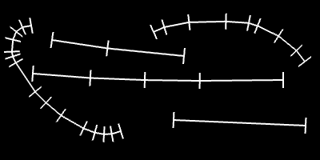

Well, you may have also guessed that `ofPolyline` lets us sample normals as well as points, using the function [`getNormalAtIndexInterpolated`](http://www.openframeworks.cc/documentation/graphics/ofPolyline.html#show_getNormalAtIndexInterpolated "getNormalAtIndexInterpolated Documentation Page").  So let's comment out the code we just wrote, and try sampling our normals evenly along the polyline:

	float numPoints = polyline.size();
	float normalLength = 20;
	for (int p=0; p<100; p+=10) {
		ofVec3f point = polyline.getPointAtPercent(p/100.0);
		float floatIndex = p/100.0 * (numPoints-1);
		ofVec3f normal = polyline.getNormalAtIndexInterpolated(floatIndex) * normalLength;
		ofLine(point-normal/2, point+normal/2);
	}
	
We can get an evenly spaced point by using percents again, but `getNormalAtIndexInterpolated()` is asking for an index.  Specifically, it is asking for a `floatIndex` which means that we can pass in 1.5 and the polyline will return a normal that lives halfway between the point at index 1 and halfway between the point at index 2.  So we need to convert our percent, `p/100.0`, to a `floatIndex`.  All we need to do is to multiply the percent by the last index in our polyline (which we can get from subtracting one from the [`size()`](http://www.openframeworks.cc/documentation/graphics/ofPolyline.html#show_size "size Documentation Page") which tells us how many vertices are in our polyline).
	
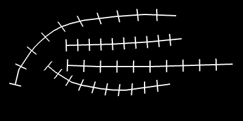

What if we pumped up the number of normals in our drawing?  Let's change our loop increment from `p+=10` to `p+=1`, change our loop condition from `p<100` to `p<500` and change our `p/100.0` lines of code to `p/500.0`.  We might also want to use a transparent white for drawing these normals, so let's add `ofSetColor(255,100)` right before our loop.  We will end up being able to draw ribbon lines:

**[Note: this should probably be done by sampling by length rather than percent, but I don't know if it is worth explaining that]**

We've just added some thickness to our polylines.  Now let's have a quick aside about tangents.  These wonderful things are perpendicular to the normals that we just drew.  So if we drew tangents along a perfectly straight line we wouldn't really see anything.  The fun part comes when we draw tangents on a curved line, so let's see what that looks like.  Same drill as before.  Comment out the last code and add in the following:

	vector<ofVec3f> vertices = polyline.getVertices();
	float tangentLength = 80;
	for (int vertexIndex=0; vertexIndex<vertices.size(); ++vertexIndex) {
		ofVec3f vertex = vertices[vertexIndex];
		ofVec3f tangent = polyline.getTangentAtIndex(vertexIndex) * tangentLength;
		ofLine(vertex-tangent/2, vertex+tangent/2);
	}
	
This should look very familiar except for [`getTangentAtIndex()`](http://www.openframeworks.cc/documentation/graphics/ofPolyline.html#show_getTangentAtIndex "getTangentAtIndex Documenation Page") which is the equivalent of `getNormalAtIndex()` but for tangents.  Not much happens for straight and slightly curved lines, however, sharply curved lines reveal the tangents:
        
**[Note: again diagram would explain the concept]**

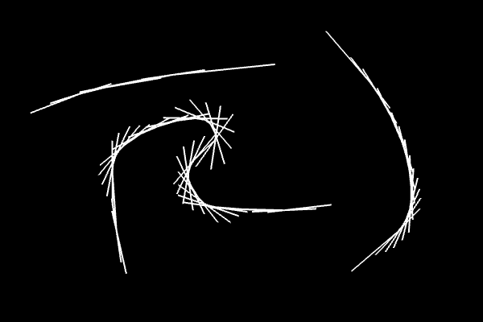

I'm sure you can guess what's next... drawing a whole bunch of tangents at evenly spaced locations!  It's more fun that in sounds.  Same drill, comment out the last code, and add the following:

	ofSetColor(255, 50);
	float numPoints = polyline.size();
	float tangentLength = 300;
	for (int p=0; p<500; p+=1) {
		ofVec3f point = polyline.getPointAtPercent(p/500.0);
		float floatIndex = p/500.0 * (numPoints-1);
		ofVec3f tangent = polyline.getTangentAtIndexInterpolated(floatIndex) * tangentLength;
		ofLine(point-tangent/2, point+tangent/2);
	}

[`getTangentAtIndexInterpolated()`](http://www.openframeworks.cc/documentation/graphics/ofPolyline.html#show_getTangentAtIndexInterpolated "getTangentAtIndexInterpolated Documentation Page") works like `getNormalAtIndexInterpolated()`.  We get something like this:

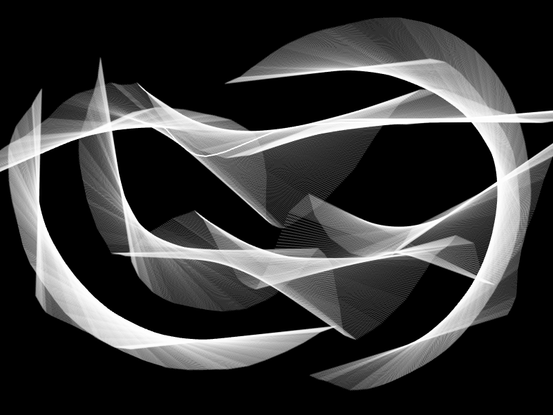

That was worth the aside, right?  (I'm desperately trying to avoid a tangent pun.)  Back to the normals we were working with, eh?   

It doesn't seem terribly efficient to add thickness to our lines by drawing lots and lots of normals using `ofLine()`.  Instead, we can draw a filled polygon to cover the space that our normal lines are covering.  **[note: explain the winding order here]** So, we want to loop through all of our upper normal bounds from left to right, then loop around and follow the lower normal bounds from right to left.  In order to do this we are going to store our points and normals in vectors [**note: make sure vectors are explained**].  Again, let's comment out the code we just wrote and add in the following:

	float numPoints = polyline.size();
	float normalLength = 40;
	vector <ofVec3f> points;
	vector <ofVec3f> normals;
	for (int p=0; p<100; p+=1) { 
		ofVec3f point = polyline.getPointAtPercent(p/100.0);
		float floatIndex = p/100.0 * (numPoints-1);
		ofVec3f normal = polyline.getNormalAtIndexInterpolated(floatIndex) * normalLength;
		points.push_back(point);
		normals.push_back(normal);
	}

Nothing new here other than using vectors.  But it is important to note that we are using `p+=1` because we want to make sure that we are sampling our polyline at a high resolution.  We are now going to use three new functions: `ofBeginShape()`, `ofVertex()` and `ofEndShape()`.  We call [`ofBeginShape()`](http://openframeworks.cc/documentation/graphics/ofGraphics.html#show_ofBeginShape ofBeginShape Documentation Page) to tell openFrameworks that we want to build a polygon, we can then add vertices to the polygon by calling [`ofVertex()`](http://openframeworks.cc/documentation/graphics/ofGraphics.html#show_ofVertex ofVertex Documentation Page).  Finally, we finish our shape by calling [`ofEndShape()`](http://openframeworks.cc/documentation/graphics/ofGraphics.html#show_ofEndShape ofEndShape Documentation Page).  Note that we *must* add our vertices in between `ofBeginShape()` and `ofEndShape()`.  To loop through our normals and create the polygon, add:

	ofSetColor(255, 200);
	float numPoints = polyline.size();
	float normalLength = 40;
	ofSetLineWidth(0);
	ofBeginShape();
	for (int p=0; p<100; p+=1) {
		ofVec3f point = polyline.getPointAtPercent(p/100.0);
		float floatIndex = p/100.0 * (numPoints-1);
		ofVec3f normal = polyline.getNormalAtIndexInterpolated(floatIndex) * normalLength;
		ofVertex(point.x+normal.x/2.0, point.y+normal.y/2.0);
	}
	for (int p=90; p>=0; p-=1) {
		ofVec3f point = polyline.getPointAtPercent(p/100.0);
		float floatIndex = p/100.0 * (numPoints-1);
		ofVec3f normal = polyline.getNormalAtIndexInterpolated(floatIndex) * normalLength;
		ofVertex(point.x-normal.x/2.0, point.y-normal.y/2.0);
	}
	ofEndShape();
	
**[Note: explain above code, also maybe mention closing a shape with ofEndShape]**

**[Note: how do you stop drawing the outline of the polygon without setting `ofSetLineWidth(0);`]**

Before running, let's comment out our `polyline.draw()` line of code.  Then let's have at it:

**[Note: ugh, better graphic please]**

**[Note: insert last brush section on using math to control and animate the width of the brush]** 

**[Note: another test graphic, redo later using polygons and make animated]**

## 2. Moving The World ##

Jeeze.  We've been making brushes for a long time.  Let's take a break from that and create a smaller project that will help demonstrate how we can move the world. By move the world, I really just mean move the coordinate system (though it sounds more exciting the other way).

Whenever we call a drawing function, like `ofRect()` for example, we pass in an `x` and `y` location at which we want our shape to be drawn.  We know (0,0) to be the upper left pixel of our window, that the positive x direction is rightward across our window and that positive y direction is downward along our window.  We are about to violate this established knowledge.

**[Note: this section needs pictures to go along with the analogy]**

For a physical analogy, imagine that we have a piece of graphing paper in front of us ~~(or go ahead and grab one)~~.  The graph squares represent the pixels of our screen.  How would we draw a black rectangle at (5, 10) that is 5 pixels wide and 2 pixels high?  We would probably grab a black pen, move our hands over to the location (5, 10) on our graphing paper, and start filling in pixels?  Good, that seems normal.  But we could have also have kept our pen hand stationary, moved our paper 5 pixels left and 10 pixels down and then started filling in pixels.  That initially seems like an odd thing to do right?  It turns out that this is a powerful thing to do in code.  With openFrameworks, we can move our coordinate system like this using `ofTranslate()`, but we can also rotate or scale the coordinate system with `ofRotate()` and `ofScale()`.  
**[Note: explain why ofBackground can't be used with transparency]**

So let's tackle [`ofTranslate`](http://www.openframeworks.cc/documentation/graphics/ofGraphics.html#show_ofTranslate "ofTranslate Documentation Page") first.  `ofTranslate` takes an x, a y and an optional z parameter, and then shifts the coordinate system by those specified values.  Why would you ever want to shift the coordinate system like this?  Imagine that you wrote some code to draw a little stick figure family.  Or better yet, create a new project and add this to your `draw` function of your source file (.cpp):

	ofBackground(255);
	
        ofColor purpleColor(231, 49, 247, 200);
	
	ofSetColor(purpleColor);
	ofCircle(30, 30, 30);
	ofRect(5, 70, 50, 100);
	
	ofSetColor(purpleColor);
	ofCircle(95, 30, 30);
	ofRect(70, 70, 50, 100);
	
	ofSetColor(purpleColor);
	ofCircle(45, 90, 15);
	ofRect(30, 110, 30, 60);
	
	ofSetColor(purpleColor);
	ofCircle(80, 90, 15);
	ofRect(65, 110, 30, 60);

And you end up with something like this:

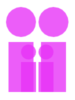

What if, after figuring out the coordinates for all your shapes, you decided that you wanted to draw that family at a different spot on the screen, or you decided that you wanted to clone the family and draw a row of them?  You *could* change all the positions of the shapes you are drawing, or you could just use `ofTranslate` to move your coordinate system and leave the positions as they are:

	ofBackground(255);
	ofColor purpleColor(231, 49, 247, 200);
        
	for (int cols=0; cols<10; cols++) {
	
		ofSetColor(purpleColor);
		ofCircle(30, 30, 30);
		ofRect(5, 70, 50, 100);
		
		ofSetColor(purpleColor);
		ofCircle(95, 30, 30);
		ofRect(70, 70, 50, 100);
		
		ofSetColor(purpleColor);
		ofCircle(45, 90, 15);
		ofRect(30, 110, 30, 60);
		
		ofSetColor(purpleColor);
		ofCircle(80, 90, 15);
		ofRect(65, 110, 30, 60);
        
		ofTranslate(150, 0);
	}

So we have just taken our original cricle and rectangle code and wrapped it in a loop which ends with `ofTranslate(150, 0)` which shifts our graph paper (coordinate system) to the left 150 pixels each time it executes.  And you'll end up with something like this:

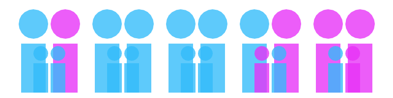

Or almost like that.  I added a tweak to randomize the colors of the people - every family is different, right?  If you wanted to create a whole grid of families, you will run into problems.  After the first row of families, your coordinate system will have been moved quite far to the left.  If you move your coordinate system up in order to start drawing your second row, you will end up drawing off the screen.  It would look something like this:

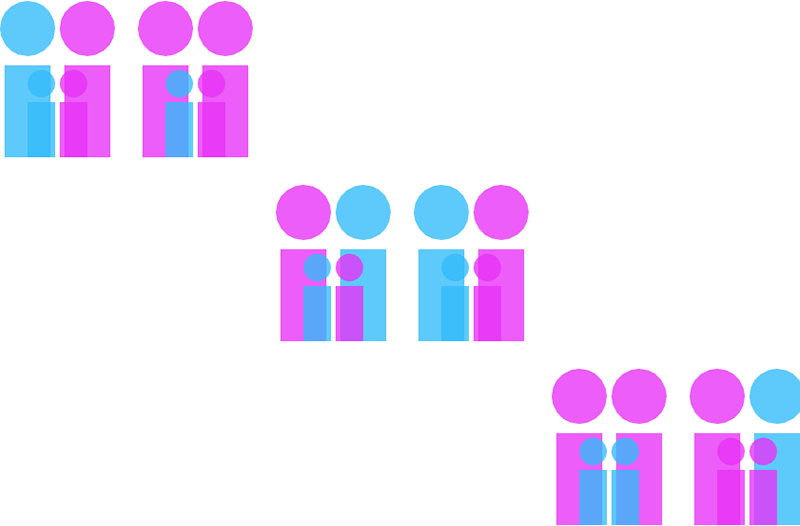

So what we need is some way to reset the coordinate system.  You'll want to start using [`ofPushMatrix`](http://www.openframeworks.cc/documentation/graphics/ofGraphics.html#show_ofPushMatrix "ofPushMatrix Documentation Page") and [`ofPopMatrix`](http://www.openframeworks.cc/documentation/graphics/ofGraphics.html#show_ofPopMatrix "ofPopMatrix Documentation Page").

`ofPushMatrix` saves the current coordinate system and `ofPopMatrix` returns you to the last saved coordinate system.  The reason why they have these functions have the word matrix in them is because of what is happening behind the scenes in openFrameworks.  You start with an un- rotated, un-translated, and un-scaled coordinate system that you used in section 1 of this chapter, which we will call the unmodified coordinate system.  When you start using `ofTranslate`, `ofRotate` and `ofScale`, the rotation, translation and scaling are all stored in a single transformation matrix, which represents the modified coordinate system.  Let's say you have a point (x, y, z) in the unmodifed coordinate system, if you multiple it by the transformation matrix, you end up with a new point (x', y', z') that is in modified coordinate system.  The math chapter *[note: point to math chapter]** will go into more depth on this.  I just want to make sure that the word matrix in `ofPushMatrix` and `ofPopMatrix` has some context.  If you want, you can just think of it as ofSaveCoordinateSystem and ofReturnToLastSavedCoordinateSystem.

So we can use these new functions like this:
	
        for (int rows=0; rows<10; rows++) {
            ofPushMatrix(); // Save the coordinate system before you shift it horizontally
            for (int cols=0; cols<10; cols++) {

                // Code omitted for clarity ...
                
                ofTranslate(150, 0);
            }
            ofPopMatrix(); // Return to the coordinate system before you shifted it horizontally
            ofTranslate(0, 200);
        }

**[note: wrap whole thing in push/pop for good practice? also indent code between push/pop for readability]**

And you should end up with a grid.  I've skipped ahead and used `ofScale`, but you should end up with a nice grid like this:

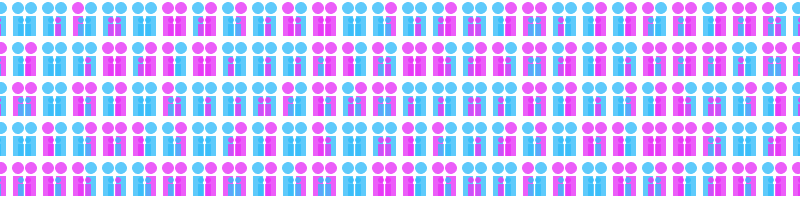

Or if you hate grids, you can make a mess of a crowd using random translations:

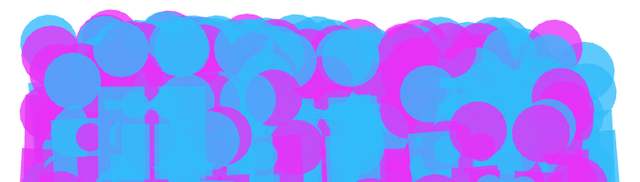

**[note: better purple-ish could be used here]**

And onto `ofScale` and `ofRotate`!  Go ahead and create a new project where you'll be creating some rotating and scaling rectangles that will end up looking like the below image.  Guess what?  At the heart of the code, there will be single `ofRect` that is called inside a loop with a bunch of scaling and rotations.

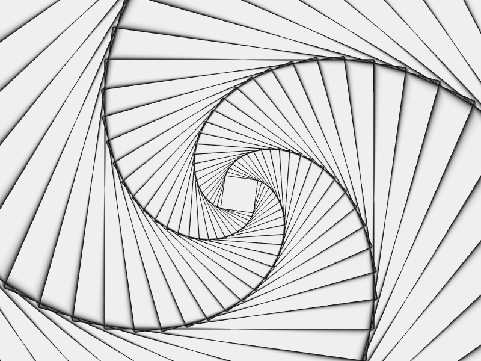

Before knowing that an `ofRotate` command existed.  How would you have gone about drawing a rotated rectangle?  `ofRect` would be no help.  You might try calculating the vertices and create a polygon using `ofBeginShape` and `ofEndShape`.  You could do that, but it feels tedious, right?  [`ofRotate`](http://www.openframeworks.cc/documentation/graphics/ofGraphics.html#show_ofRotate "ofRotate Documentation Page") is here to make that easier.  `ofRotate` takes an angle in degrees and will rotate our coordinate system around the current origin (0, 0).  (There is another way to use `ofRotate` to control rotation around the x, y and z axes, but we won't be using it.) 

Let's set up some code in our `draw` function:

	ofBackground(255);
	ofSetColor(0, 0, 255);
	ofRect(500, 200, 200, 200);

Rectangle, no sweat.  Rotated rectangle...uh, well, let's try `ofRotate`:

	ofBackground(255);
	ofPushMatrix();
		// Original rectangle in blue
		ofSetColor(0, 0, 255);
		ofRect(500, 200, 200, 200);
		
		// Rotated rectangle in red
		ofRotate(45);
		ofSetColor(0, 0, 255);
		ofRect(500, 200, 200, 200);
	ofPopMatrix();

Hmm, not quite right:

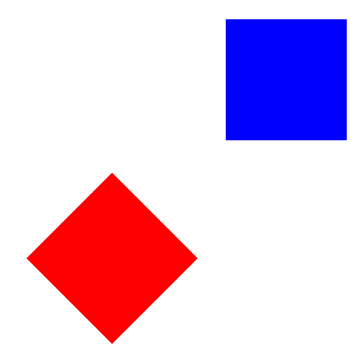

Well, `ofRotate` rotates the coordinate system around the current origin (0,0) of the coordinate system.  That origin starts out in the top left corner of the screen by default, so our rectangle rotated 45 degrees clockwise around the upper left pixel in our image.  If we want to rotate our rectangle in place, we need to use `ofTranslate` to move the origin to our rectangle *before* rotating.  Then our rectangle will rotate in place.  So update the red rectangle's code:
	// Rotated rectangle in red
	ofTranslate(500, 200);
	ofRotate(45);
	ofSetColor(0, 0, 255);
	ofRect(0, 0, 200, 200);

And we get a rectangle that rotates around its upper left corner:

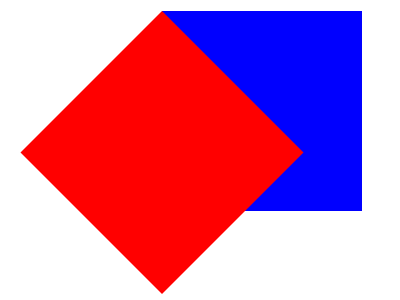

Remember that by default, when you pass an (x,y) position to `ofRect`, it will assume that (x,y) is the position of the upper left corner.  If you want to rotate the rectangle around its center, you can use `ofSetRectMode(OF_RECTMODE_CENTER);` to tell openFrameworks that the (x,y) position defines the center of the rectangle.  The alternative to leave the rectangle mode as set as the upper left corner and modify your code like this:

	// Rotated rectangle in red
	
	// Add half rect width and half rect height to the translate, 
	// so that (0,0) is now at the center of the blue rectangle
	ofTranslate(500+100, 200+100); 
	
	// Rotate around the center of the blue rectangle
	ofRotate(45);
	ofSetColor(255, 0, 0);
	
	// Now we want to draw our red rectangle by specifying the upper left corner
	// If we tried ofRect(0,0,200,200), we would draw the red's corner in the center of blue
	// Since (0,0) is currently the cetner of the blue rect, we want to draw the center of our 
	// red rectangle at (0,0).  To do that, we need to draw at (-width/2, -height/2):
	ofRect(-100, -100, 200, 200);
	
**[Note: maybe omit this code?  the explanation of the (-100, -100) needs diagrams with graph paper for a better understanding]**

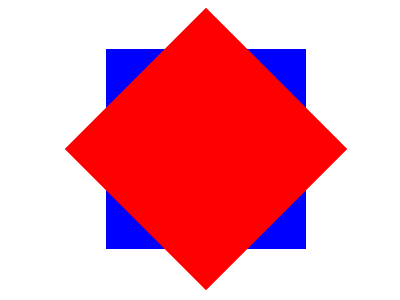

You can now push, pop, rotate and translate like a pro, so the only thing left to do is figure out how to use [`ofScale`](http://www.openframeworks.cc/documentation/graphics/ofGraphics.html#show_ofScale "ofScale Documentation Page") and then we can create some infinitely spiraling rectangles.

`ofScale` takes three arguments, the desired scaling in x, y and z directions.  The z parameter is option and defaults to 1.  Since we are working in two dimensions (x and y), we should just leave the z scale as 1.0.  Our scaling code applied to the blue and red rectangles looks like:

	ofSetRectMode(OF_RECTMODE_CENTER);
	ofBackground(255);
	
	ofPushMatrix();
		// Original rectangle in blue
		ofSetColor(0, 0, 255);
		ofRect(500, 200, 200, 200);
		
		// Scaled down rectangle in red
		ofTranslate(500, 200);
		ofScale(0.5, 0.5);
		ofSetColor(255, 0, 0);
		ofRect(0, 0, 200, 200);
	ofPopMatrix();

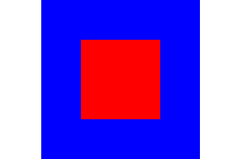

We'll run into the same issues that we ran into with centering.  The solution is the same - translate before scaling if you want centered rectangles.

If you want to create some trippy rectangles, start a new project (or just delete the red and blue rectangle code you wrote).  The core of the idea is really simple, we are going to draw a rectangle at the center of the screen, scale, rotate, draw a rectangle, repeat and repeat.  So we'll code the core and then we'll add some motion and graphical florishes.  Add the following to your `draw` function:

	ofBackground(255);
	
	ofSetRectMode(OF_RECTMODE_CENTER);
	ofSetColor(0);
	ofNoFill();
	ofPushMatrix();
		ofTranslate(ofGetWidth()/2, ofGetHeight()/2);
		for (int i=0; i<100; ++i) {
			ofScale(1.1, 1.1);
			ofRotate(5);
			ofRect(0, 0, 50, 50);
		}
	ofPopMatrix();

**[Note: has ofGetWidth and ofGetHeight been explained at this point?]**

And that's it:

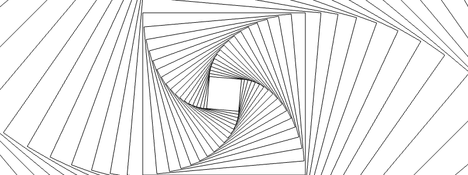

You can play with the scaling, rotation, size of the rectangle, etc.  Three lines of code will add some life to our rectangles and cause them to coil and uncoil over time.  Put these in the place of `ofRotate(5);`:

	float time = ofGetElapsedTimef();
	float timeScale = 0.5;
	float noise = ofSignedNoise(time * timeScale) * 20.0;
	ofRotate(noise);

**[Note: noise is a loaded concept.  I'm not sure who is covering it, but I can add a section here explaining it.]**

Next up is to make our spiral leave a visual smear as it rotates.  We turned off the background automatic clearing (`ofSetBackgroundAuto(false)`) in section 1 with our brushes.  What if we extended that concept and used it here?  We want to draw new frames of our animation on top of faded versions of the past frames of our animation to create a smear (which is usually called a "trail effect").  For our app, this is a lot easier than it sounds to implement.  We will turn off the background automatic clearing, and then every time we are about to draw a frame of the animation, we will draw a transparent screen over our window.  This will cause the frames of our animation to fade out over time.

So first step is to add a few things to `setup`:

	ofSetBackgroundAuto(false);
	ofEnableAlphaBlending(); // Remember if we are using transparency, we need to let openFrameworks know
	ofBackground(255);

Delete `ofBackground(255);` from your `draw` function and what do you get?

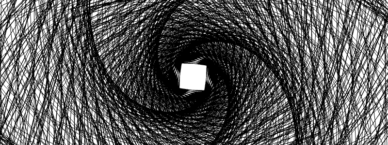

Messy, huh?  Add this to the beginning of your `draw` function:
	
	float clearAlpha = 100;
	ofSetColor(255, clearAlpha);
	ofSetRectMode(OF_RECTMODE_CORNER);
	ofFill();
	ofRect(0, 0, ofGetWidth(), ofGetHeight());
	
By drawing a transparent rectangle over the whole window, we can clean up some of that mess while still leaving a smear or trail.  If you turn up the alpha, you will turn down the smear.  If you turn down the alpha, you will turn up the smear.  **[note: explain why you can't use ofBackground here]**

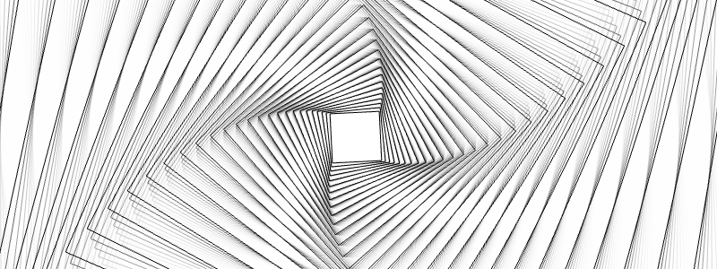

Okay, you've got some code.  It does something neat.  But it has a bunch of variables that you are playing with by manually changing them and reruning your code.  It would be much nicer to take these parameters and change them at runtime, so that you can find the settings you like best.  It doesn't matter quite so much for this project, but in your own work, this process of parameterization and exploration will be very important (especially, if you are creating any generative visuals).

We've got a couple parameters that drastically change the visual experience of our spirals.  Let's focus in on the `timeScale` of our noise and the `clearAlpha` used to set transparency.  We can use the mouse position to control both of these variables on the fly.  Horizontally moving the mouse can turn the `clearAlpha` up and down while moving the mouse vertically can turn the `timeScale` up and down.  (Using the mouse like this is handy if you've got one or two parameters to explore).

Delete those lines of code that define `timeScale` and `clearAlpha`.  Instead add this to your header (.h) file:

	float clearAlpha;
	float timeScale;
	
Initialize them in the `setup` function of your source file (.cpp):

	clearAlpha = 100;
	timeScale = 0.5;

We haven't talked about this function yet, but [`mouseMoved(int x, int y )`](http://openframeworks.cc/documentation/application/ofBaseApp.html#!show_mouseMoved "mouseMoved Documentation Page") will get run anytime the mouse position changes in our openFrameworks window.  We can use it to change our parameters through a mapping of the x and y mouse positions:

	clearAlpha = ofMap(x, 0, ofGetWidth(), 0, 255);
	timeScale = ofMap(y, 0, ofGetHeight(), 0, 1);

**[note: ofMap, ofGetWidth and ofGetHeight have probably been explained earlier in the tutorial?]**

One last extension, just for fun.  We are drawing black rectangles on a white background.  We could easily draw white rectangles on a black background.  We could also slowly flip between those two.  Add this code at the top of the `draw` function:

	ofColor darkColor(0,0,0,255);
	ofColor lightColor(255,255,255,255);
	float time = ofGetElapsedTimef();
	float percent = ofMap(cos(time/2.0), -1, 1, 0, 1, true);
	ofColor bgColor = darkColor;
	bgColor.lerp(lightColor, percent);
	bgColor.a = clearAlpha;
	ofColor fgColor = lightColor;
	fgColor.lerp(darkColor, percent);

Then use `bgColor` when you call `ofSetColor` before drawing the transparent rectangle, and use `fgColor` when you call `ofSetColor` for your rectangle outlines.

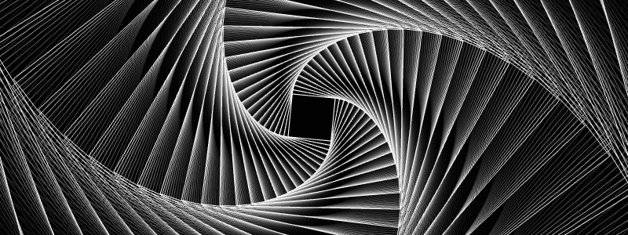

**[note: this code could use some explanation]**

**[note: there should be a gif in here showing the animation]**

**[note: any possibly a section about documenting your work via gif and video]**

Congrats, you survived coordinate transformations :)

## 3. See outline ##

This chapter is super long to begin with...but I have another project in the outline around generative color.  It might be time to cut that.

## Notes to Self ## 

**openFrameworks Bugs and Weirdness:**
- Setting alpha to 1 causes the hue information on a color to shift when drawing overlapping shapes (need to verify this happens outside of the brush app)
- `polyline.getPointAtPercent(0)` and `polyline.getPointAtPercent(1.0)` return the same thing

**General notes:**
- might be a small thing, but I'm considering going back and rewritting all for loops to use i++ over ++i. i++ is more readable for a beginner **[bd: I think this is a good idea.]**

