# Graphics #

_This chapter builds off **chapters # and #**, so if you aren't familiar with basic C++ and creating openFrameworks projects, check out those chapters first._

In sections 1 and 2, we create "paintbrushes" where the mouse is our brush and our code defines how our brush makes marks on the screen.  In section 3, we will explore something called "coordinate system transformations" to create hypnotizing, spiraling rectangles. 

**Chapter roadmap:**

1. Brushes with Basic Shapes
	1. Basic Shapes
	1. Brushes from Basic Shapes
    	1. Single Rectangle Brush: Using the Mouse
    	1. Bursting Rectangle Brush: Creating Randomized Bursts
    	1. Glowing Circle Brush: Using Transparency and Color
    	1. Star Line Brush: Working with a Linear Map
    	1. Fleeing Triangle Brush: Vectors and Rotations
		1. Raster Graphics: Taking a Snapshot
1. Brushes with Freeform Shapes
	1. Basic Polylines
	1. Building a Brushes from Polylines
		1. Tracking the Mouse
		1. Points, Normals and Tangents
	1. Saving Vector Graphics
1. Moving the World
	1. Translating: Stick Family
	1. Rotating and Scaling: Spiraling Rectangles
1. Next Steps 

## Brushes with Basic Shapes ##

To create brushes, we need to define some basic building blocks of graphics.  We can classify the 2D graphics functions into two categories: basic shapes and freeform shapes.  Basic shapes are rectangles, circles, triangles and straight lines.  Freeform shapes are polygons and paths.  In this section, we will focus on the basic shapes.

### Basic Shapes ###

Before drawing any shape, we need to know how to specify locations on screen.  Computer graphics use the [Cartesian coordinate system](http://en.wikipedia.org/wiki/Cartesian_coordinate_system "Wiki on Cartesian coordinate system").  Remember **figure x** from math class?  A pair of values `(x, y)` told us how far away we were from `(0, 0)`, the origin.  Computer graphics are based on this same system, but with two twists.  First, `(0, 0)` is the upper leftmost pixel of the screen.  Second, the y axis is flipped such that the positive y direction is located below the origin (**figure x**).  

If we apply this to the top left of my screen (**figure x**), which happens to be my browser.  We can see the pixels and identify their locations in our new coordinate system.  The top left pixel is `(0, 0)`.  The top left pixel of the blue calender icon (with the white "19") is `(58, 5)`.  

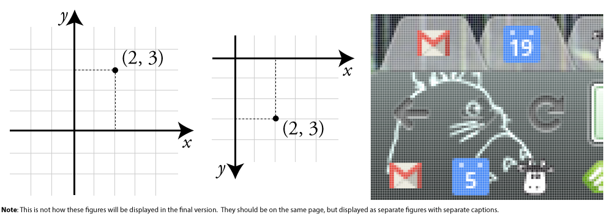

Now that we can talk about locations, let's jump into code.  Create an openFrameworks project and call it "BasicShapes" (or something more imaginative).  Open the source file, ofApp.cpp, and navigate to the `draw()` function.  Add the following:
    
	ofBackground(0);  // Clear the screen with a black color
	ofSetColor(255);  // Set the drawing color to white
	
	// Draw some shapes
	ofRect(50, 50, 100, 100); // 100 wide x 100 high, top left corner at (50, 50)
	ofCircle(250, 100, 50); // Radius of 50, centered at (250, 100)
	ofEllipse(400, 100, 80, 100); // 80 wide x 100 high, centered at (400 100)
	ofTriangle(500, 150, 550, 50, 600, 150); // Three corners: (500, 150), (550, 50), (600, 150)
	ofLine(700, 50, 700, 150); // Line from (700, 50) to (700, 150)

When we run the code, we see white shapes on a black background.  Success!  Each time our `draw()` function executes, three things happen.  First, we clear the screen by drawing a solid black background using [`ofBackground(...)`](http://www.openframeworks.cc/documentation/graphics/ofGraphics.html#show_ofBackground "ofBackground Documentation Page").  The `0` represents a grayscale color where `0` is completely black and `255` is completely white. econd, we specify what color should be used for drawing with [`ofSetColor(...)`](http://openframeworks.cc/documentation/graphics/ofGraphics.html#show_ofSetColor "ofColor Documentation Page").  We can think of this code as telling openFrameworks to pull out a specific colored sharpie.  When we draw, we will draw in that color until we specify that we want another color.  Third, we draw our basic shapes: `ofRect(...)`, `ofCircle(...)`, `ofEllipse(...)`, `ofTriangle(...)` and `ofLine(...)`.  See the comments for a description of how we use them.  There aren't the only ways to use them, so check out their documentation pages.

[`ofFill()`](http://openframeworks.cc/documentation/graphics/ofGraphics.html#!show_ofFill "ofFill Documentation Page") and [`ofNoFill()`](http://openframeworks.cc/documentation/graphics/ofGraphics.html#!show_ofFill "ofNoFill Documentation Page") toggle between drawing filled shapes and drawing outlines.  The sharpie analogy doesn't fit, but he concept still applies.  `ofFill()` tells openFrameworks to draw filled shapes until told otherwise.  `ofNoFill()` does the same but with outlines.  So we can draw two rows of shapes on our screen (**figure x**) - one filled and one outlines - if we modify our `draw()` function to look like:
    
	ofFill(); // If we omit this and leave ofNoFill(), all the shapes will be outlines!
	// Draw some shapes (code omitted)     

	ofNoFill(); // If we omit this and leave ofFill(), all the shapes will be filled!	
	// Draw some shapes (code omitted)

We can control the thickness of the outlines, and our `ofLine(...)` lines, using [`ofSetLineWidth(...)`](http://openframeworks.cc/documentation/graphics/ofGraphics.html#show_ofSetLineWidth "ofSetLineWidth Documentation Page").  Like `ofFill()`, `ofSetLineWidth(...)` will apply to all lines drawn until the thickness is set to a new value:

	ofSetLineWidth(2); // Line width is a default value of 1 if you don't modify it
	// Draw some shapes (code omitted)     

	ofSetLineWidth(4.5); // A higher value will render thicker lines
	// Draw some shapes (code omitted)

Lines looking jagged?  We can fix that with a smoothing technique called [anti-aliasing](http://en.wikipedia.org/wiki/Spatial_anti-aliasing "Wiki on spatial anti-aliasing").  Add [`ofEnableAntiAliasing()`](http://openframeworks.cc/documentation/graphics/ofGraphics.html#show_ofEnableAntiAliasing "ofEnableAntiAliasing Documentation Page") to `setup()`.  (For future reference, you can turn it off to save computing power: [`ofDisableAntiAliasing()`](http://openframeworks.cc/documentation/graphics/ofGraphics.html#show_ofDisableAntiAliasing "ofDisableAntiAliasing Documentation Page").)

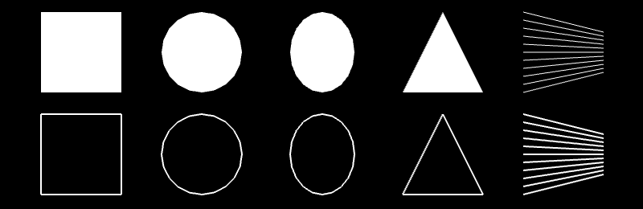

**Extensions**

1. Draw some rounded rectangles using [`ofRoundedRect(...)`](http://openframeworks.cc/documentation/graphics/ofGraphics.html#!show_ofRectRounded "ofRoundedRect Documentation Page").
1. Explore the world of curved lines with [`ofCurve(...)`](http://openframeworks.cc/documentation/graphics/ofGraphics.html#!show_ofCurve "ofCurve Documentation Page") and [`ofBezier(...)`](http://openframeworks.cc/documentation/graphics/ofGraphics.html#!show_ofBezier "ofBezier Documentation Page").

### Brushes from Basic Shapes ###

We survived the boring bits, but why draw one rectangle, when we can draw a million (**figure x**)? That is essentially what we will be doing in this section.  We will build brushes that drop a burst of many small shapes whenever we press the left mouse button.  To make things more exciting, we will mix in some randomness.  Start a new openFrameworks project, called "ShapeBrush." 

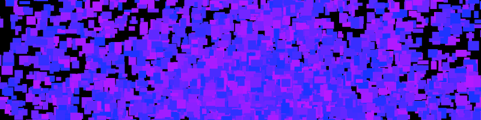

#### Single Rectangle Brush ####

We are going to lay down the foundation for our brushes by making a simple one that draws a single rectangle when we hold down the mouse.  To get started, we are going to need to know 1) the mouse location and 2) if the left mouse button is pressed.

For 1), we can use two openFrameworks `int` variables [`mouseX`](http://openframeworks.cc/documentation/application/ofBaseApp.html#!show_mouseX "mouseX Documenation Page") and [`mouseY`](http://openframeworks.cc/documentation/application/ofBaseApp.html#show_mouseY "mouseY Documentation Page").  They are public variables, so we have access to them anywhere within ofApp.  We will use them in `draw()`.

For 2), look at the [`mousePressed(...)`](http://www.openframeworks.cc/documentation/application/ofBaseApp.html#show_mousePressed "mousePressed Documentation Page") and [`mouseReleased(...)`](http://www.openframeworks.cc/documentation/application/ofBaseApp.html#show_mouseReleased "mouseReleased Documentation Page") functions in our source file (ofApp.cpp).  These functions are called anytime the mouse button is pressed/released, and has three parameters: the x and y position of the mouse and an `int` representing which button was pressed/released.  (Note: these are called once *upon* press/release, not called continuously for holding a button.)  We will use these functions to update a public `bool` variable, `isLeftMousePressed`.

Our public variables should be declared inside our header file (ofApp.h), so add this there:

    bool isLeftMousePressed;

Over in our source file (ofApp.cpp), we should initialize that variable in `setup()`:

	isLeftMousePressed = false;  

Finally, we should modify our `mousePressed(...)` and `mouseReleased(...)` functions to look like:

	void testApp::mousePressed(int x, int y, int button){
		if (button == OF_MOUSE_BUTTON_LEFT) isLeftMousePressed = true;
	}
	
	void testApp::mouseReleased(int x, int y, int button){
		if (button == OF_MOUSE_BUTTON_LEFT) isLeftMousePressed = false;
	}

The `button` variable above is an `int` that identifies which button is being pressed/released.  openFrameworks provides some public constants for us to identify `button`: `OF_MOUSE_BUTTON_LEFT`, `OF_MOUSE_BUTTON_MIDDLE` and `OF_MOUSE_BUTTON_RIGHT`.  

Let's add some graphics.  Hop over to the `draw()` function where we can start making use of our newly acquired mouse information:

    if (isLeftMousePressed) {
		ofSetColor(255);
		ofSetRectMode(OF_RECTMODE_CENTER);
		ofRect(mouseX, mouseY, 50, 50);  // Draw a 50 x 50 rect centered over the mouse
	}

[`ofSetRectMode(...)`](http://www.openframeworks.cc/documentation/graphics/ofGraphics.html#show_ofSetRectMode "ofSetRectMode Documentation Page") allows us to control how the `(x, y)` we pass into `ofRect(...)` are used to draw.  By default, they are interpreted as the upper left corner (`OF_RECTMODE_CORNER`).  For our purposes, we want them to be the center (`OF_RECTMODE_CENTER`), so our rectangle is centered over the mouse.

Compile and run.  A white rectangle is drawn at the mouse position when we press the left mouse button...but it disappears immediately.  By default, the screen is cleared with every `draw()` call.  We can change that with [`ofSetBackgroundAuto(...)`](http://openframeworks.cc/documentation/graphics/ofGraphics.html#show_ofSetBackgroundAuto "ofSetBackgroundAuto Documentation Page").  Passing in a value of `false` turns off the automatic background clearing.  Add the following lines into `setup()`:

	ofSetBackgroundAuto(false);
    
    // We still want to draw on a black background, so we need to draw 
	// the background before we do anything with the brush
	ofBackground(0);   

First brush, done!  We are going to make this a bit more interesting by adding 1) randomness and 2) repetition.

Randomness can make our code dark, mysterious and unpredictable.  Meet [`ofRandom(...)`](http://openframeworks.cc/documentation/math/ofMath.html#!show_ofRandom "ofRandom Documentation Page").  It can be used in two different ways: by passing in two values `ofRandom(float min, float max)` or by passing in a single value `ofRandom(float max)` where the min is assumed to be `0`.  The function returns a random value between the min and max.  We can inject some randomness into our rectangle color (**figure x**) by using:
	
	float randomColor = ofRandom(50, 255);
	ofSetColor(randomColor);  // Exclude dark grayscale values (0 - 50) that won't show on black background

To finish off this single rectangle brush, let's add the ability to erase by pressing the right mouse button.  We will create a `isRightMousePressed` that will act very similarly to our `isLeftMousePressed`.  In the header file, create a public variable `bool isRightMousePressed`.  Initialize the value to false in `setup()`.  Inside of `mousePressed(...)`, set it to `true` if `button == OF_MOUSE_BUTTON_RIGHT`, and inside of `mouseReleased(...)`, set it to `false` if `button == OF_MOUSE_BUTTON_RIGHT`.  Lastly, at the beginning of the `draw()` function, draw a black background when `isRightMousePressed == true`.

#### Bursting Rectangle Brush #####

We now have the basics in place for a brush, but instead of drawing a single rectangle in `draw()`, let's draw a burst of randomized rectangles.  We are going use a `for` loop to create multiple rectangles whose parameters are randomly chosen.  What can we randomize?  Grayscale color, width and height are easy candidates.  We can also use a small positive or negative value to offset each rectangle from mouse position.  Modify `draw()` to look like this:  

	if (isLeftMousePressed) {
		ofSetRectMode(OF_RECTMODE_CENTER);
		int numRects = 10;
		for (int r=0; r<numRects; r++) {
			ofSetColor(ofRandom(50, 255));
			float width = ofRandom(5, 20);
			float height = ofRandom(5, 20);
			float xOffset = ofRandom(-40, 40);
			float yOffset = ofRandom(-40, 40);
			ofRect(mouseX+xOffset, mouseY+yOffset, width, height);
		}
	}

But!  Add one more thing, inside of `setup()`, before hitting run: `ofSetFrameRate(60)`.  The frame rate is the speed limit of our program, frames per second (fps).  `update()` and `draw()` will not run more than `60` times per second.  (Note: this is a speed *limit*, not a speed *minimum* - our code can run slower.)  We set the frame rate in order to control how many rectangles will be drawn.  If `10` rectangles are drawn with the mouse pressed and we know `draw()` won't be called more than `60` times per second, then we will generate a max of `600` rectangles per second.

Compile, run.  We get a box-shaped spread of random rectangles (**figure x, left**).  Why didn't we get a circular spread (**figure x, right**)?  Since `xOffset` and `yOffset` could be any value between `-40` and `40`, think about what happens when `xOffset` and `yOffset` take on their most extreme values, i.e. (`xOffset`, `yOffset`) values of (`-40`, `-40`), (`40`, `-40`), (`40`, `40`), (`-40`, `40`).

If we want a random point within a circle, it helps to think in terms of angles.  Imagine we are at the center of a circle.  If we rotate a random amount (the *polar angle*) and then move a random distance (the *polar radius*), we end up in a random location within the circle (assuming we don't walk so far that we cross the boundary of our circle).  We just defined a point by a polar angle and a polar radius instead of using `(x, y)`. We have just thought about space in terms of [polar coordinates](http://en.wikipedia.org/wiki/Polar_coordinate_system "Polar Coordinates Wiki"), instead of Cartesian coordinates.

Back to the code.  When we figure out our offsets, we want to pick a random direction (polar angle) and random distance (polar distance) which we can then convert to Cartesian coordinates (see code) to use as `xOffset` and `yOffset`.  Our loop inside of `draw()` will look like this:

	for (int r=0; r<numRects; r++) {
		ofSetColor(ofRandom(50, 255));
		float width = ofRandom(5, 20);
		float height = ofRandom(5, 20);
		float angle = ofRandom(2.0*PI); // Angle in radians because sin(...) and cos(...) use radians
		float distance = ofRandom(35);

		// Formula for converting from polar to Cartesian coordinates:
		//	x = cos(polar angle) * (polar distance)
		//  y = sin(polar angle) * (polar distance)

		float xOffset = cos(angle) * distance;
		float yOffset = sin(angle) * distance;
		ofRect(mouseX+xOffset, mouseY+yOffset, width, height);
	}

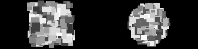  

#### Glowing Circle Brush ####

Unlike what we did with the rectangle brush, we are going to layer colorful, transparent circles on top of each to create a glowing haze.  We will draw a giant transparent circle, then draw a slightly smaller transparent circle on top of it, then repeat, repeat, repeat.  We can add transparency to `ofSetColor(...)` with a second parameter, the alpha channel (e.g.`ofSetColor(255, 50)`), with a value from `0` (completely transparent) to `255` (completely opaque).  

Before we use alpha, we need to enable something called "alpha blending."  Using transparency costs computing power, so [`ofEnableAlphaBlending()`](http://www.openframeworks.cc/documentation/graphics/ofGraphics.html#show_ofEnableAlphaBlending "ofEnableAlphaBlending Documentation Page") and [`ofDisableAlphaBlending()`](http://www.openframeworks.cc/documentation/graphics/ofGraphics.html#show_ofDisableAlphaBlending "ofDisableAlphaBlending Documentation Page") allow us to turn on and off this blending at our discretion.  We need it, so enable it in `setup()`.  

Comment out the rectangle brush code inside the `if (isLeftMousePressed)` statement.  Now we can start working on our circle brush.  We will use the `angle`, `distance`, `xOffset` and `yOffset` code like before.  Our `for` loop will start with a large radius and step its value to `0`.  Add the following:

	int maxRadius = 100;  // Increase for a wider brush
	int radiusStepSize = 5;  // Decrease for more circles (i.e. a more opaque brush)
	int alpha = 3;  // Increase for a more opaque brush
	int maxOffsetDistance = 100;  // Increase for a larger spread of circles
	for (int radius=maxRadius; radius>0; radius-=radiusStepSize) {
		float angle = ofRandom(2.0*PI);
		float distance = ofRandom(maxOffsetDistance);
		float xOffset = cos(angle) * distance;
		float yOffset = sin(angle) * distance;
		ofSetColor(255, alpha);
		ofCircle(mouseX+xOffset, mouseY+yOffset, radius);
	}

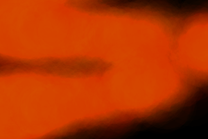

We end up with something like **figure x**, a glowing light except without color.  Tired of living in moody shades of gray?  `ofSetColor(...)` can make use of the [Red Blue Green (RGB) color model](http://en.wikipedia.org/wiki/RGB_color_model "Wiki on RGB Color Model") in addition to the grayscale color model.  We specify the amount (`0` to `255`) of red, blue and green light respectively, e.g. `ofSetColor(255, 0, 0)` for opaque red.  We can also add alpha, e.g. `ofSetColor(0, 0, 255, 10)` for transparent blue.  Go ahead and modify the `ofSetColor(...)` in our circle brush to use a nice orange: `ofSetColor(255, 103, 0, alpha)`.

There's another way we can use `ofSetColor(...)`.  Meet [`ofColor`](http://openframeworks.cc/documentation/types/ofColor.html "ofColor Documentation Page"), a handy class for handling colors which allows for fancy color math (among other things). Here are some examples of defining and modifying colors:

	ofColor myOrange(255, 132, 0); // Defining an opaque orange color - specified using RGB	
	ofColor myBlue(0, 0, 255, 50); // Defining a transparent blue color - specified using RGBA
	
	// We can access the red, green, blue and alpha channels like this:
	ofColor myGreen(0, 0, 255, 255);	
	cout << "Red channel:" << myGreen.r << endl;
	cout << "Green channel:" << myGreen.g << endl;
	cout << "Blue channel:" << myGreen.b << endl;
	cout << "Alpha channel:" << myGreen.a << endl;
	
	// We can also set the red, green, blue and alpha channels like this:
	ofColor myYellow;
	myYellow.r = 255;
	myYellow.b = 0;
	myYellow.g = 255;
	myYellow.a = 255;

If we wanted to make our brush fierier, we would draw using random colors that are in-between orange and red.  `ofColor` gives us in-betweenness using something called "[linear interpolation](http://en.wikipedia.org/wiki/Linear_interpolation "Wiki for Linear Interpolation")." with a function called [`getLerped(...)`](http://www.openframeworks.cc/documentation/types/ofColor.html#show_getLerped "getLerped Documentation Page").  `getLerped(...)` is a class method of `ofColor`, so we call it using an instance of `ofColor` like this: `myFirstColor.getLerped(mySecondColor, 0.3)`.  We pass in two arguments, an `ofColor` and a `float` value between `0.0` and `1.0`.  The function returns a new `ofColor` that is between the two specified colors, and the `float` determines how close the new color is to our original color (here, `myFirstColor`).  We can use this in `draw()` like this: 

	ofColor myOrange(255, 132, 0, alpha);
	ofColor myRed(255, 6, 0, alpha);
	ofColor inBetween = myOrange.getLerped(myRed, ofRandom(1.0));
	ofSetColor(inBetween);

#### Star Line Brush ####

What about lines?  We are going to create a brush that draws lines that radiate out from the mouse to create something similar to an asterisk or a twinkling star (**figure x**).  Comment out the circle brush and add:

	int numLines = 30;
	int minRadius = 25;
	int maxRadius = 125;
	for (int i=0; i<numLines; i++) {
		float distance = ofRandom(minRadius, maxRadius);
		float angle = ofRandom(2.0*PI);
		float xOffset = cos(angle) * distance;
		float yOffset = sin(angle) * distance;
		float alpha = ofMap(distance, minRadius, maxRadius, 50, 0);  // Make shorter lines more opaque
		ofSetColor(255, alpha);
		ofLine(mouseX, mouseY, mouseX+xOffset, mouseY+yOffset);
	}

What have we done with the alpha?  We used [`ofMap(...)`](http://www.openframeworks.cc/documentation/math/ofMath.html#show_ofMap "ofMap Documentation Page") to do a linear interpolation, similar to `getLerped(...)`.  To get a "twinkle" we want our shortest lines to be the most opaque and our longer lines to be the most transparent.  `ofMap(...)` takes a value from one range and maps it into another range like this: `ofMap(value, inputMin, inputMax, outputMin, outputMax)`.  We tell it that distance is a value in-between `minRadius` and `maxRadius` and that we want it mapped so that a distance value of 125 (`maxRadius`) returns an alpha value of 50 and a distance value of 25 (`minRadius`) returns an alpha value of 0.

We can also vary the line width using: `ofSetLineWidth(ofRandom(1.0, 5.0))`, but remember that if we change the line width in this brush, we will need go back and set our line width back to `1.0` in our other brushes.

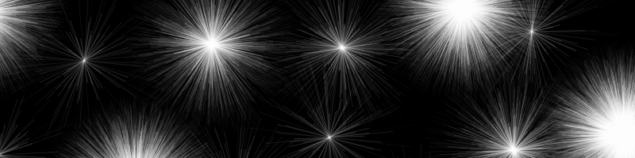

#### Fleeing Triangle Brush ####

Time for the last brush in section 1: the triangle.  We'll draw a bunch of triangles that are directed outward from the mouse position (**figure x**).  `ofTriangle(...)` requires us to specify the three corners of the triangle, which means that we will need to calculate the rotation of the corners to make the triangle point away from the mouse.  A new class will make that math easier: [`ofVec2f`](http://openframeworks.cc/documentation/math/ofVec2f.html "ofVec2f Documentation Page").

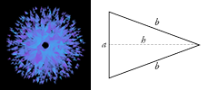

We've been defining points by keeping two separate variables: x and y.  `ofVec2f` is a 2D vector which allows us to hold both in one variable (and perform handy math operations):

	ofVec2f mousePos(mouseX, mouseY);  // Defining a new ofVec2f
	
	// Access the x and y coordinates like this: 
	cout << "Mouse X: " << mousePos.x << endl;
	cout << "Mouse Y: " << mousePos.y << endl;
	
	// Or we can modify the coordinates like this:
	float xOffset = 10.0;
	float yOffset = 30.0;
	mousePos.x += xOffset;
	mousePos.y += yOffset;
	
	// But we can do what we just did above by adding or subtracting two vectors directly
	ofVec2f offset(10.0, 30.0);
	mousePos += offset;
	
Let's start using it to build the triangle brush.  The first step is to draw a triangle **figure x** at the mouse cursor.  It will become important later, but we are going to draw our triangle starting from the mouse cursor and pointing to the right.  Comment out the line brush, and add:

	ofVec2f mousePos(mouseX, mouseY);
	
	// Define a triangle at the origin (0,0) that points to the right
	ofVec2f p1(0, 25.0);
	ofVec2f p2(100, 0);
	ofVec2f p3(0, -25.0);
	
	// Shift the triangle to the mouse position
	p1 += mousePos;
	p2 += mousePos;
	p3 += mousePos;
	
	ofSetColor(255, 50);
	ofTriangle(p1, p2, p3);

Run it and see what happens.  We can add rotation with the `ofVec2f` class method [`rotate(...)`](http://www.openframeworks.cc/documentation/math/ofVec2f.html#show_rotate "ofVec2f's rotate function documentation page") like this: `myPoint.rotate(45.0)` where `myPoint` is rotated around the origin by `45.0` degrees. Back to our code, add this right before shifting the triangle to the mouse position:
		
	// Rotate the triangle points around the origin
	float rotation = ofRandom(360); // Uses degrees!
	p1.rotate(rotation);	
	p2.rotate(rotation);
	p3.rotate(rotation);

Our brush looks something like **figure x**.  If we were to move that rotation code to *after* we shifted the triangle position, the code wouldn't work very nicely because `rotate(...)` assumes we want to rotate our point around the origin.  (Check out the documentation for an alternate way to use `rotate(...)` that rotates around an arbitrary point.)  Last step, let's integrate our prior approach of drawing multiple shapes that are offset from the mouse:

	ofVec2f mousePos(mouseX, mouseY);
	
	int numTriangles = 10;
	int minOffset = 5;
	int maxOffset = 70;
	int alpha = 150;	
	for (int t=0; t<numTriangles; ++t) {
		float offsetDistance = ofRandom(minOffset, maxOffset);
		
		// Define a triangle at the origin (0,0) that points to the right (code omitted)

		// Shift the triangle to the mouse position (code omitted)

		ofVec2f triangleOffset(offsetDistance, 0.0);
		triangleOffset.rotate(rotation);
		
		p1 += mousePos + triangleOffset;
		p2 += mousePos + triangleOffset;
		p3 += mousePos + triangleOffset;
		
		ofSetColor(255, alpha);
		ofTriangle(p1, p2, p3);
	}

We are now using `ofVec2f` for our offset.  We started with a vector that points rightward, the same direction our triangle starts out pointing.  When we apply the rotation to them both, they stay in sync (i.e. both pointing away from the mouse).  We can push them out of sync with: `triangleOffset.rotate(rotation+90)`, and we get a swirling blob of triangles.  After that, we can add some color using `ofRandom(...)` and `getLerped(...)` again (**figure x**) or play with fill and line width.

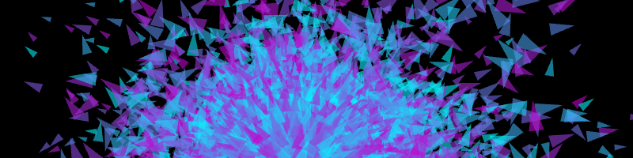	

**Extensions**

1. **Add back the switching functionality**
1. Use keypresses and some public variables to control parameters at runtime (transparency, brush width, etc.)
1. Track the mouse position over time and use the distance it moves between frames to control parameters (brush width, color, offset, etc.)
1. Create an erasure brush by drawing transparent black shapes
1. Think about the ways we can change the brush color on-the-fly

#### Saving Raster Graphics ####

Before we move on, let's save a snapshot of our canvas.  In the `keyPressed(...)` function, add the following:

    if (key == 's') {
        glReadBuffer(GL_FRONT);  // HACK: only needed on windows, when using ofSetAutoBackground(false)
        ofSaveScreen("savedScreenshot.png");
    }

[`ofSaveScreen(...)`](http://www.openframeworks.cc/documentation/utils/ofUtils.html#show_ofSaveScreen "ofSaveScreen Documentation Page") grabs the current screen and saves it to a file inside of our app's `/bin/data` folder with a filename we specify. So press the `s` key and check out "savedScreenshot.png."

## Brushes from Freeform Shapes ##

In the last section, we drew directly onto the screen.  We were storing graphics (brush strokes) as pixels, and therefore working with [raster graphics](http://en.wikipedia.org/wiki/Raster_graphics "Raster Graphics Wiki").  For this reason, it is hard to isolate, move or erase a single brush stroke.  It also means we can't re-render our graphics at a different resolution.  In contrast, [vector graphics](http://en.wikipedia.org/wiki/Vector_graphics "Vector Graphics Wiki") store graphics as a list of geometric objects instead of pixel values.  Those objects can be modified (erased, moved, rescaled, etc.) after we "place" them on our screen.  

We are now moving into vector graphics by using freeform shapes in openFrameworks.  We will use structures that allow us to store and draw the path that the mouse takes on the screen.  Then we will play with those paths to create brushes that do more than just trace out the cursor's movement.  Finally, we will learn how to save our new vector graphics.

### Freeform Shapes ###

Create a new project called "Polylines," and say hello to [`ofPolyline`](http://www.openframeworks.cc/documentation/graphics/ofPolyline.html "ofPolyline Documentation Page"). `ofPolyline` is a data structure that allows us to store a series of sequential points and then connect them to draw a line.  Let's dive into some code.  Define three `ofPolylines` (`straightSegmentPolyline`, `curvedSegmentPolyline`, `closedShapePolyline`) in the header file.  We can fill those with points in `setup()`:

	straightSegmentPolyline.addVertex(100, 100);  // Add a new point: (100, 100)
	straightSegmentPolyline.addVertex(150, 150);  // Add a new point: (150, 150)
	straightSegmentPolyline.addVertex(200, 100);  // etc...
	straightSegmentPolyline.addVertex(250, 150);
	straightSegmentPolyline.addVertex(300, 100);
	
	curvedSegmentPolyline.curveTo(350, 100);  // These curves are Catmull-Rom splines
	curvedSegmentPolyline.curveTo(350, 100);  // Necessary Duplicate for Control Point
	curvedSegmentPolyline.curveTo(400, 150);
	curvedSegmentPolyline.curveTo(450, 100);  
	curvedSegmentPolyline.curveTo(500, 150);
	curvedSegmentPolyline.curveTo(550, 100);
	curvedSegmentPolyline.curveTo(550, 100);  // Necessary Duplicate for Control Point
	
	closedShapePolyline.addVertex(600, 125);
	closedShapePolyline.addVertex(700, 100);
	closedShapePolyline.addVertex(800, 125);
	closedShapePolyline.addVertex(700, 150);
	closedShapePolyline.close();  // Connect first and last vertices
	
We can now draw our polylines in the `draw()` function:

	ofBackground(0);
	ofSetLineWidth(2.0);  // Line width will apply to polylines
	ofSetColor(255,100,0);
	straightSegmentPolyline.draw();  // This is how we draw polylines
	curvedSegmentPolyline.draw();  // Nice and easy, right?
	closedShapePolyline.draw();

We created three different types of polylines (**figure x**). `straightSegmentPolyline` is composed of a series points connected with straight lines.  `curvedSegmentPolyline` uses the same points but connects them with curved lines.  The curves that are created are [Catmull–Rom splines](http://en.wikipedia.org/wiki/Centripetal_Catmull%E2%80%93Rom_spline "Wiki on Catmull-Rom splines"), which use four points to define a curve: two define the start and end, while two control points determine the curvature.  These control points are the reason why we need to add the first and last vertex twice.  Lastly, `closedShapePolyline` uses straight line segments that are closed, connecting the first and last vertices.

The advantage of drawing in this way (versus raster graphics) is that the polylines are modifiable.  We could easily move, add, delete, scale our vertices on the the fly.

**Extensions**

1. Check out the [`arc(...)`](http://www.openframeworks.cc/documentation/graphics/ofPolyline.html#show_arc "arc Documentation Page"), [`arcNegative(...)`](http://www.openframeworks.cc/documentation/graphics/ofPolyline.html#show_arcNegative "arcNegative Documentation Page") and [`bezierTo(...)`](http://www.openframeworks.cc/documentation/graphics/ofPolyline.html#show_bezierTo "bezierTo Documentation Page") methods to find some other ways to draw shapes with `ofPolyline`.
2. Fill the screen with some randomly defined `ofPolylines`.
3. **These are weak...**

### Brushes from Freeform Shapes ###

Let's use polylines to draw brush strokes.  Create a new project, "PolylineBrush."  When the left mouse button is held down, we will create an `ofPolyline` and continually extend it to the mouse position.  We will use a `bool` to tell us if the left mouse button is being held down.  If it is being held down, we'll add the mouse position to the polyline, but instead of adding *every* mouse position, we'll add the mouse positions where the mouse has moved a distance away from the last point in our polyline. 

Let's move on to the code.  Create four variables in the header: `ofPolyline currentPolyline`, `bool currentlyAddingPoints`, `ofVec2f lastPoint` and `float minDistance.`  Initialize `minDistance` to `10` and `currentedAddingPoints` to `false` in `setup()`.  Inside of `mousePressed(...)`, we want to start the polyline:

	if (button == OF_MOUSE_BUTTON_LEFT) {
		leftMouseButtonPressed = true;
		currentPolyline.curveTo(x, y);  // Remember that x and y are the location of the mouse
		currentPolyline.curveTo(x, y);  // Necessary duplicate for first control point 
		lastPoint.set(x, y);  // Set the x and y of a ofVec2f in a single line
	}
	
Inside of `mouseReleased(...)`, we want to end the polyline:

	if (button == OF_MOUSE_BUTTON_LEFT) {
		leftMouseButtonPressed = false;
		currentPolyline.curveTo(x, y);   // Necessary duplicate for last control point
		currentPolyline.clear();  // Erase the vertices, allows us to start a new brush stroke 
	}

Now we add points to our polyline in `update()`:

	if (leftMouseButtonPressed) {
		ofVec2f mousePos(mouseX, mouseY);
		if (lastPoint.distance(mousePos) >= minDistance) {
			currentPolyline.curveTo(mousePos);  // You can also call curveTo with an ofVec2f
			lastPoint = mousePos;
		}
	}

Note that this only adds points so when the mouse has moved a certain threshold amount (`minDistance`) away from the last point we added to the polyline.  This uses the [`distance`](http://openframeworks.cc/documentation/math/ofVec2f.html#show_distance "distance Documentation Page") method of `ofVec2f`.  

All that is left is to add code to draw the polyline in `draw()`, and we've got a basic curved polyline drawing program.  But we don't have the ability to save multiple polylines... For that we will turn to something called a `vector`.  This isn't the same kind of vector that we talked about earlier in the context of `of2Vecf`. **[std::vector, C++ basics?]**

**Missing declaration** We can use a `vector <ofPolylines>` to save our polyline brush strokes.  When we finish a stroke, we want to add the polyline to our vector.  So in the if statement inside of `mouseReleased(...)`, let's add `polylines.push_back(currentPolyline)`.  Then we can draw the polylines like this:

	ofSetColor(255);  // White color for saved polylines
	for (int i=0; i<polylines.size(); i++) {
		ofPolyline polyline = polylines[i];
		polyline.draw();
	}	
	ofSetColor(255,100,0);  // Orange color for active polyline
	currentPolyline.draw();

And we have a simple brush that tracks the mouse, and we can draw a dopey smiley face (**figure x**).

**Extensions**

1. Add an undo feature
1. Add a redo feature
1. Add color

#### Points, Normals and Tangents ####

Since we have the basic drawing in place, now we play with how we are rendering our polylines.  We will draw points, normals and tangents.  

First, let's draw circles at the vertices in our polylines.  Inside the `for` loop in `draw()` (after `polyline.draw()`), add this:

	vector<ofVec3f> vertices = polyline.getVertices();
	for (int vertexIndex=0; vertexIndex<vertices.size(); ++vertexIndex) {
		ofVec3f vertex = vertices[vertexIndex];
		ofCircle(vertex, 5);
	}

[`getVertices()`](http://www.openframeworks.cc/documentation/graphics/ofPolyline.html#show_getVertices "getVertices Documentation Page") returns a `vector` of `ofVec3f` objects that represent the vertices of our polyline.  This is basically what an `ofPolyline` is - an ordered set of `ofVec3f`s (with some extra math). We can loop through the indices of the vector to pull out the individual vertex locations, and use them to draw circles.

What happens when we run it?  Our white lines look thicker.  That's because our polyline is jam-packed with vertices!  Every time we call the `curveTo(...)` method, we create 20 extra vertices (by default).  These help make a smooth-looking curve.  We can adjust how many vertices are added with an optional parameter, `curveResolution`, in `curveTo(...)`.  We don't need that many vertices, but instead of lowering the `curveResolution`, we can make use [`simplify(...)`](http://openframeworks.cc/documentation/graphics/ofPolyline.html#show_simplify "simplify Documentation Page").

`simplify(...)` is a method that will remove "duplicate" points from our polyline.  We pass a single argument into it: `tolerance`, a value between 0.0 and 1.0.  The `tolerance` describes how dis-similar points must be in order to be considered 'unique' enough to not be deleted.  The higher the `tolerance`, the more points will be removed.  So right before we save our polyline by putting it into our `polylines` vector, we can simplify it.  Inside of the if statement within `mouseReleased(...)` (before `polylines.push_back(currentPolyline)`), add: `currentPolyline.simplify(0.75)`.  Now we should see something like **figure x (left)**.

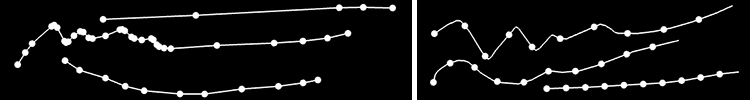

We can also sample points along the polyline using [`getPointAtPercent(...)`](http://openframeworks.cc/documentation/graphics/ofPolyline.html#show_getPointAtPercent "getPointAtPercent Documentation Page").  **[Note: explain sampling + function]**.  Inside the `draw()` function, comment out the code that draws a circle at each vertex.  Below that, add: 

        for (int p=0; p<100; p+=10) {
            ofVec3f point = polyline.getPointAtPercent(p/100.0);
            ofCircle(point, 5);
        }

Now we have evenly spaced points (**figure x, right**).  Let's try creating a brush stroke where the thickness of the line changes. To do this we need to use a [normal vector](http://en.wikipedia.org/wiki/Normal_(geometry) "Wiki on normal vectors in geometry").  If we start with one line, the normal vector points in the opposite direction. Check out **figure x (left)**.  Normals are drawn over some polylines.  Imagine drawing a normal at every point along a polyline (**like figure x**).  That is one way to add "thickness" to our brush.
	
We can comment out our circle drawing code in `draw()`, and add these lines of code instead: **break code into simpler chunks**

        vector<ofVec3f> vertices = polyline.getVertices();
        float normalLength = 40;
        for (int vertexIndex=0; vertexIndex<vertices.size(); ++vertexIndex) {
            ofVec3f vertex = vertices[vertexIndex];
            ofVec3f normal = polyline.getNormalAtIndex(vertexIndex) * normalLength;
            ofLine(vertex-normal/2, vertex+normal/2);
        }
      
We getting the all of the vertices in our `ofPolyline`.  But here, we are also using [`getNormalAtIndex`](http://www.openframeworks.cc/documentation/graphics/ofPolyline.html#show_getNormalAtIndex "getNormalAtIndex Documentation Page"] which takes an index and returns an `ofVec3f` that represents the normal vector for the vertex at that index.  **[Note: explain how normal vector is relative to (0,0,0) and how to center it on the vertex]** 

We have something like **figure x (left)**, but we can also sample normals, using the function [`getNormalAtIndexInterpolated(...)`](http://www.openframeworks.cc/documentation/graphics/ofPolyline.html#show_getNormalAtIndexInterpolated "getNormalAtIndexInterpolated Documentation Page").  So let's comment out the code we just wrote, and try sampling our normals evenly along the polyline:

	float numPoints = polyline.size();
	float normalLength = 20;
	for (int p=0; p<100; p+=10) {
		ofVec3f point = polyline.getPointAtPercent(p/100.0);
		float floatIndex = p/100.0 * (numPoints-1);
		ofVec3f normal = polyline.getNormalAtIndexInterpolated(floatIndex) * normalLength;
		ofLine(point-normal/2, point+normal/2);
	}
	
We can get an evenly spaced point by using percents again, but `getNormalAtIndexInterpolated(...)` is asking for an index.  Specifically, it is asking for a `floatIndex` which means that we can pass in 1.5 and the polyline will return a normal that lives halfway between the point at index 1 and halfway between the point at index 2.  So we need to convert our percent, `p/100.0`, to a `floatIndex`.  All we need to do is to multiply the percent by the last index in our polyline (which we can get from subtracting one from the [`size()`](http://www.openframeworks.cc/documentation/graphics/ofPolyline.html#show_size "size Documentation Page") which tells us how many vertices are in our polyline), resulting in **figure x (right)**.

Now we can pump up the number of normals in our drawing/  Let's change our loop increment from `p+=10` to `p+=1`, change our loop condition from `p<100` to `p<500` and change our `p/100.0` lines of code to `p/500.0`.  We might also want to use a transparent white for drawing these normals, so let's add `ofSetColor(255,100)` right before our loop.  We will end up being able to draw ribbon lines, like **figure x**.

We've just added some thickness to our polylines.  Now let's have a quick aside about tangents, the "opposite" of normals.  These wonderful things are perpendicular to the normals that we just drew.  So if we drew tangents along a perfectly straight line we wouldn't really see anything.  The fun part comes when we draw tangents on a curved line, so let's see what that looks like.  **ref circle tangents**  Same drill as before.  Comment out the last code and add in the following:

	vector<ofVec3f> vertices = polyline.getVertices();
	float tangentLength = 80;
	for (int vertexIndex=0; vertexIndex<vertices.size(); ++vertexIndex) {
		ofVec3f vertex = vertices[vertexIndex];
		ofVec3f tangent = polyline.getTangentAtIndex(vertexIndex) * tangentLength;
		ofLine(vertex-tangent/2, vertex+tangent/2);
	}
	
This should look very familiar except for [`getTangentAtIndex(...)`](http://www.openframeworks.cc/documentation/graphics/ofPolyline.html#show_getTangentAtIndex "getTangentAtIndex Documenation Page") which is the equivalent of `getNormalAtIndex(...)` but for tangents.  Not much happens for straight and slightly curved lines, however, sharply curved lines reveal the tangents (**figure x, left**).

I'm sure you can guess what's next... drawing a whole bunch of tangents at evenly spaced locations!  It's more fun that it sounds.  Same drill, comment out the last code, and add the following:

	ofSetColor(255, 50);
	float numPoints = polyline.size();
	float tangentLength = 300;
	for (int p=0; p<500; p+=1) {
		ofVec3f point = polyline.getPointAtPercent(p/500.0);
		float floatIndex = p/500.0 * (numPoints-1);
		ofVec3f tangent = polyline.getTangentAtIndexInterpolated(floatIndex) * tangentLength;
		ofLine(point-tangent/2, point+tangent/2);
	}

[`getTangentAtIndexInterpolated(...)`](http://www.openframeworks.cc/documentation/graphics/ofPolyline.html#show_getTangentAtIndexInterpolated "getTangentAtIndexInterpolated Documentation Page") works like `getNormalAtIndexInterpolated(...)`.  We get something like **figure x (right)**.  That was worth the aside, right?  (I'm desperately trying to avoid a tangent pun.)  **concluding sentence**

**Extensions**

1. **Other polyline methods? Length?**
1. **Draw shapes other than lines**
1. **Hook the polyline rendering to our brushes from section 1**
1. **Check out how to draw polygons (beginShape, ofPath) and use those to create brush strokes** 
1. **Animation**

## Moving The World ##

We've been making brushes for a long time, so let's move onto something different: moving the world. By the world, I really just mean the coordinate system (though it sounds more exciting the other way).

Whenever we call a drawing function, like `ofRect(...)` for example, we pass in an `x` and `y` location at which we want our shape to be drawn.  We know (0,0) to be the upper left pixel of our window, that the positive x direction is rightward across our window and that positive y direction is downward along our window **recall figure x**.  We are about to violate this established knowledge.

Imagine that we have a piece of graphing paper in front of us.  How would we draw a black rectangle at (5, 10) that is 5 units wide and 2 units high?  We would probably grab a black pen, move our hands to (5, 10) on our graphing paper, and start filling in boxes?  Pretty normal, but we could have also have kept our pen hand stationary, moved our paper 5 units left and 10 units down and then started filling in boxes.  Seems odd, right?  This is actually a powerful concept.  With openFrameworks, we can move our coordinate system like this using `ofTranslate(...)`, but we can *also* rotate and scale with `ofRotate(...)` and `ofScale(...)`.  We will start with translating to cover our screen with stick figures, and then we will rotate and scale to create spiraling rectangles.

### New section ###

[`ofTranslate`](http://www.openframeworks.cc/documentation/graphics/ofGraphics.html#show_ofTranslate "ofTranslate Documentation Page") first.  `ofTranslate(...)` takes an x, a y and an optional z parameter, and then shifts the coordinate system by those specified values.  Why do this?  Create a new project and add this to our `draw()` function of our source file (.cpp):

	// Draw the stick figure family
	ofCircle(30, 30, 30);
	ofRect(5, 70, 50, 100);
	ofCircle(95, 30, 30);
	ofRect(70, 70, 50, 100);
	ofCircle(45, 90, 15);
	ofRect(30, 110, 30, 60);
	ofCircle(80, 90, 15);
	ofRect(65, 110, 30, 60);

Draw a white background and color your shapes, and we end up with something like **figure x**.

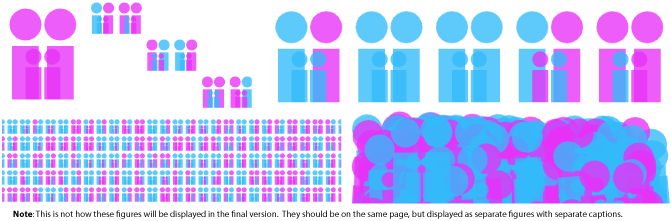

What if, after figuring out where to put our shapes, we needed to draw them at a different spot on the screen, or to draw a row of copies?  We *could* change all the positions manually, or we could use `ofTranslate(...)` to move our coordinate system and leave the positions alone:
    
	// Loop and draw a row
	for (int cols=0; cols<10; cols++) {
	
		// Draw the stick figure family (code omitted)
        
		ofTranslate(150, 0);
	}

So our original shapes are wrapped it in a loop with `ofTranslate(150, 0)`, which shifts our coordinate system to the left 150 pixels each time it executes.  And we'll end up with **figure x**.  Or almost, I randomized the colors - every family is different, right?

If we wanted to create a grid of families, we will run into problems.  After the first row of families, our coordinate system will have been moved quite far to the left.  If we move our coordinate system up in order to start drawing our second row, we will end up drawing off the screen.  It would look like **figure x**.

So we need is to reset the coordinate system using [`ofPushMatrix()`](http://www.openframeworks.cc/documentation/graphics/ofGraphics.html#show_ofPushMatrix "ofPushMatrix Documentation Page") and [`ofPopMatrix()`](http://www.openframeworks.cc/documentation/graphics/ofGraphics.html#show_ofPopMatrix "ofPopMatrix Documentation Page").  `ofPushMatrix()` saves the current coordinate system and `ofPopMatrix()` returns us to the last saved coordinate system.  These functions have the word matrix in them because openFrameworks stores all of our combined rotations, translations and scalings in a single matrix.  For now, we can just them as ofSaveCoordinateSystem and ofReturnToLastSavedCoordinateSystem.  So we can use these new functions like this:
	
        for (int rows=0; rows<10; rows++) {
            ofPushMatrix(); // Save the coordinate system before we shift it horizontally
				
				// It is often helpful to indent any code in-between push and pop matrix for readability

            	// Loop and draw a row (code omitted)

            ofPopMatrix(); // Return to the coordinate system before we shifted it horizontally
            ofTranslate(0, 200);
        }

And we should end up with a grid.  See **figure x** (I used `ofScale` to jam many in one image). Or if you hate grids, we can make a mess of a crowd using random rotations and translations, **figure x**.

### New Section ###

Onto `ofScale(...)` and `ofRotate(...)`!  Let's create a new project where rotating and scaling rectangles to get something like **figure x**.

Before knowing about `ofRotate(...)`, we couldn't have drawn a rotated rectangle with `ofRect(...)`.  [`ofRotate(...)`](http://www.openframeworks.cc/documentation/graphics/ofGraphics.html#show_ofRotate "ofRotate Documentation Page") takes an angle (in degrees) and rotates our coordinate system around the current origin.  Let's attempt a rotated rectangle:

	ofBackground(255);
	ofPushMatrix();
		// Original rectangle in blue
		ofSetColor(0, 0, 255);
		ofRect(500, 200, 200, 200);
		
		// Rotated rectangle in red
		ofRotate(45);
		ofSetColor(0, 0, 255);
		ofRect(500, 200, 200, 200);
	ofPopMatrix();

Hmm, not quite right (**figure x**).  `ofRotate(...)` rotates around the current origin, the top left corner of the screen.  To rotate in place, we need `ofTranslate(...)` to move the origin to our rectangle *before* we rotate.  Add `ofTranslate(500, 200)` before rotating (**figure x**).  Now we are rotating around the upper left corner of the rectangle.  The easiest way to rotate the rectangle around its center is to use `ofSetRectMode(OF_RECTMODE_CENTER)` draw the center at (500, 200).  Do that, and we finally get **figure x**. 

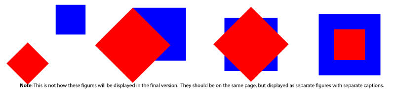

Push, pop, rotate, translate - no problem.  Only thing left is [`ofScale(...)`](http://www.openframeworks.cc/documentation/graphics/ofGraphics.html#show_ofScale "ofScale Documentation Page").  It takes two arguments: the desired scaling in x and y directions (and an optional z scaling).  Applying scaling to our rectangles:

	ofSetRectMode(OF_RECTMODE_CENTER);
	ofBackground(255);
	
	ofPushMatrix();
		// Original rectangle in blue
		ofSetColor(0, 0, 255);
		ofRect(500, 200, 200, 200);
		
		// Scaled down rectangle in red
		ofTranslate(500, 200);
		ofScale(0.5, 0.5);  // We are only working in x and y, so let's leave the z scale at its default (1.0)
		ofSetColor(255, 0, 0);
		ofRect(0, 0, 200, 200);
	ofPopMatrix();

We'll run into the same issues that we ran into with rotation and centering.  The solution is the same - translating before scaling and using `OF_RECTMODE_CENTER`.

Now we can make trippy rectangles.  Start a new project.  The idea is really simple, we are going to draw a rectangle at the center of the screen, scale, rotate, draw a rectangle, repeat and repeat.  Add the following to our `draw()` function:

	ofBackground(255);
	
	ofSetRectMode(OF_RECTMODE_CENTER);
	ofSetColor(0);
	ofNoFill();
	ofPushMatrix();
		ofTranslate(ofGetWidth()/2, ofGetHeight()/2);  // Translate to the center of the screen
		for (int i=0; i<100; i++) {
			ofScale(1.1, 1.1);  
			ofRotate(5);
			ofRect(0, 0, 50, 50);
		}
	ofPopMatrix();

That's it: **figure x**.  We can play with the scaling, rotation, size of the rectangle, etc.  Three lines of code will add some life to our rectangles and cause them to coil and uncoil over time.  Put these in the place of `ofRotate(5)`:
	
	// Noise is a topic that will be covered in later chapters (reference?)
	float time = ofGetElapsedTimef();
	float timeScale = 0.5;
	float noise = ofSignedNoise(time * timeScale) * 20.0;
	ofRotate(noise);

Next, we can create a visual smear ("trail effect") as it rotates if we will turn off the background automatic clearing and partially erase the screen before drawing again.  To do this add a few things to `setup()`:

	ofSetBackgroundAuto(false);
	ofEnableAlphaBlending(); // Remember if we are using transparency, we need to let openFrameworks know
	ofBackground(255);

Delete `ofBackground(255)` from our `draw()` function.  Then, add this to the beginning of our `draw()` function:
	
	float clearAlpha = 100;
	ofSetColor(255, clearAlpha);
	ofSetRectMode(OF_RECTMODE_CORNER);
	ofFill();
	ofRect(0, 0, ofGetWidth(), ofGetHeight());  // ofBackground doesn't work with alpha, so draw a transparent rect
	
Pretty hypnotizing? If we turn up the `clearAlpha`, we will turn down the smear.  If we turn down the `clearAlpha`, we will turn up the smear.

Now we've got two parameters that drastically change the visual experience of our spirals, specifically: `timeScale` of noise and `clearAlpha` of the trail effect.  Instead of manually tweaking their values in the code, we can use the mouse position to independently control the values during run time.  Horizontal position can adjust the `clearAlpha` while vertical position can adjust the `timeScale`.  This type of exploration of parameter settings is super important (especially when making generative graphics).  Using the mouse like this is handy if we've got one or two parameters to explore.

[`mouseMoved(int x, int y )`](http://openframeworks.cc/documentation/application/ofBaseApp.html#!show_mouseMoved "mouseMoved Documentation Page") runs anytime the mouse moves (in our app).  We can use it to change our parameters, but we need them to be global first.  Delete the code that defines `timeScale` and `clearAlpha` locally in `draw()` and add them to the header.  Initialize the values in `setup()` to `100` and `0.5` respectively.  Then add these to `mouseMoved(...)`:

	clearAlpha = ofMap(x, 0, ofGetWidth(), 0, 255);  // clearAlpha goes from 0 to 255 as the mouse moves from left to right
	timeScale = ofMap(y, 0, ofGetHeight(), 0, 1);  // timeScale goes from 0 to 1 as the mouse moves from top to bottom

One last extension.  We can slowly flip the background and rectangle colors, by adding this to the top of `draw()`:

	ofColor darkColor(0,0,0,255);  // Opaque black
	ofColor lightColor(255,255,255,255);  // Opaque white
	float time = ofGetElapsedTimef();  // Time in seconds
	float percent = ofMap(cos(time/2.0), -1, 1, 0, 1);  // Create a value that oscillates between 0 to 1
	ofColor bgColor = darkColor;  // Color for the transparent rectangle we use to clear the screen
	bgColor.lerp(lightColor, percent);  // This modifies our color "in place", check out the documentation page
	bgColor.a = clearAlpha;  // Our initial colors were opaque, but our rectangle needs to be transparent
	ofColor fgColor = lightColor;  // Color for the rectangle outlines
	fgColor.lerp(darkColor, percent);  // Modifies color in place

Now use `bgColor` for the transparent rectangle we draw on the screen and `fgColor` for the rectangle outlines to get **figure x**.

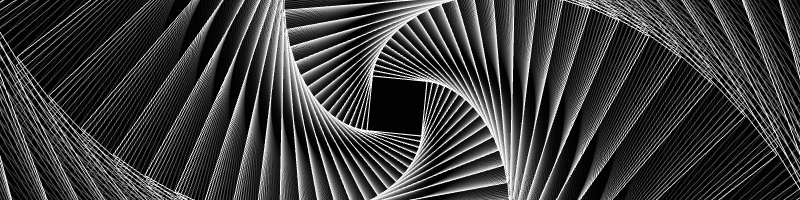

Congrats, you survived coordinate transformations :)

**Extensions**

1. **Saving vector graphics**
1. **Check out other ways to use ofTranslate, ofRotate, ofScale**
1. **Try rotating something without using center**

## Next Steps ##

Addons, Other book chapters, Tutorials on ofSite
