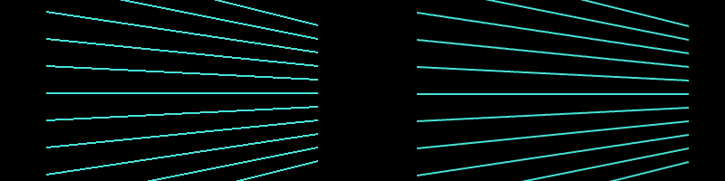

# Graphics #

**Personal Introduction TDB**

This chapter is going to build off of the C++ Basics chapter **(chapter #)** and Project Setup and Structure chapter **(chapter #)**, so if you aren't already familiar with C++ and creating openFrameworks projects, definitely check out those chapters before diving into graphics in here. 

In the first half of the chapter (sections 1 and 2), we will be designing digital "paintbrushes."  The mouse will be our brush, and we will design rules for how our brush will make marks on the screen.  In the second half of the chapter (section 3), explore something called "coordinate system transformations" to create hypnotizing, spiraling rectangles.  

**Our chapter roadmap:**

1. Brushes with Basic Shapes
	1. Basic Shapes
	1. Brushes from Basic Shapes
    	1. Single Rectangle Brush: Using the Mouse
    	1. Bursting Rectangle Brush: Creating Randomized Bursts
    	1. Glowing Circle Brush: Using Transparency and Color
    	1. Star Line Brush: Working with a Linear Map
    	1. Fleeing Triangle Brush: Vectors and Rotations
		1. Raster Graphics: Taking a Snapshot
1. Brushes with Freeform Shapes
	1. Basic Polylines
	1. Building a Brushes from Polylines
		1. Tracking the Mouse
		1. Points, Normals and Tangents
		1. Polygons
	1. Saving Vector Graphics
1. Moving the World
	1. Translating: Stick Family
	1. Rotating and Scaling: Spiraling Rectangles
	1. Saving Animated Graphics
1. Next Steps 

## 1. Brushes with Basic Shapes ##

To create brushes, we need to define some basic building blocks of graphics.  We can classify the 2D graphics functions into two categories: basic shapes and freeform shapes.  Basic shapes are rectangles, circles, triangles and straight lines.  Freeform shapes are polygons and paths.  This classification of shapes is loose, and what it really amounts to is that basic shapes are easier to use but less flexible than the freeform shapes.  In this section, we will focus on the basic shapes.

### 1.1 Basic Shapes ###

We have some basic building blocks, but how do we specify where we want to draw them on the screen?  Computer graphics use something called the [Cartesian coordinate system](http://en.wikipedia.org/wiki/Cartesian_coordinate_system "Wiki on Cartesian coordinate system").  Remember the grid in **figure x** from math class?

To locate a point in the Cartesian coordinate system, we need three things.  First, we need a reference point, `(0, 0)`, the origin.  Second, we need a pair of values, `(x, y)`, that tell us how far away our point is from the origin.  Third, we need to know which directions are positive: positive x values are located to the right of the origin, and positive y values are above the origin.

Computer graphics are based on this same system.  If we want to draw something on the screen, we can specify the pixels where we want to draw with `(x, y)`.  There are two twists.  First, the `(0, 0)` point is the upper leftmost pixel of the screen.  Second, the y axis is flipped such that the positive y direction is located below the origin.  Our graphing paper would now look like in **figure x**.  

Let's zoom in on the top left of my screen (**figure x**), which happens to be my browser.  We can see the pixels and identify their locations in our new coordinate system.  The top left pixel is `(0, 0)`.  The top left pixel of the blue calender icon (with the white "19") is `(58, 5)`.  

Now we know how to describe where to place shapes, it is time to start coding some basic shapes.  Create a new openFrameworks project and call it "BasicShapes" (or something more imaginative).

Open it up, then compile and run the project.  We end up with a gray screen.  We are going to change that by drawing one of each of the basic shapes.  Open the source file, ofApp.cpp, and navigate to the `draw()` function.  Add the following:
    
	// Clear the screen with a black color
	ofBackground(0);
    
	// Set the drawing color to white
	ofSetColor(255);
	
	// Draw some shapes
	ofRect(50, 50, 100, 100); // 100 x 100 rectangle with top left corner at (50, 50)
	ofCircle(250, 100, 50); // Circle with a radius of 50, centered at (250, 100)
	ofEllipse(400, 100, 80, 100); // 80 x 100 ellipse, centered at (400 100)
	ofTriangle(500, 150, 550, 50, 600, 150); // Triangle with points: (500, 150), (550, 50), (600, 150)
	ofLine(700, 50, 700, 150); // Line from (700, 50) to (700, 150)

When we run the code, we see white shapes on a black background.  Success!  Each time our `draw()` function executes, three things happen.  **[Cover Setup/Update/Draw if Roy hasn't covered it]**

First, we clear the screen by drawing a solid black background using [`ofBackground(...)`](http://www.openframeworks.cc/documentation/graphics/ofGraphics.html#show_ofBackground "ofBackground Documentation Page").  The `0` represents a grayscale color where `0` is completely black and `255` is completely white.  (Other ways of specifying color to come later in the chapter.)

Second, we specify what color should be used for drawing with [`ofSetColor(...)`](http://openframeworks.cc/documentation/graphics/ofGraphics.html#show_ofSetColor "ofColor Documentation Page").  We can think of this code as telling openFrameworks to pull out a specific colored sharpie.  When we draw, we will draw in that color until we specify that we want another color.

Third, we draw our basic shapes: `ofRect(...)`, `ofCircle(...)`, `ofEllipse(...)`, `ofTriangle(...)` and `ofLine(...)`.  With [`ofRect(...)`](http://openframeworks.cc/documentation/graphics/ofGraphics.html#!show_ofRect "ofRect Documentation Page"), we pass in the x and y values of the top left corner as well as the width and height, all in that order.  For [`ofCircle(...)`](http://openframeworks.cc/documentation/graphics/ofGraphics.html#show_ofCircle "ofCircle Documentation Page"), we pass in the x and y values of the center and the radius.  With [`ofEllipse(...)`](http://openframeworks.cc/documentation/graphics/ofGraphics.html#show_ofEllipse "ofEllipse Documentation Page"), we pass in the x and y values of the center as well as the width and height.  For [`ofTriangle()`](http://openframeworks.cc/documentation/graphics/ofGraphics.html#show_ofTriangle "ofTriangle Documentation Page"), we pass in the x and y positions of the three corners.  Finally, with [`ofLine(...)`](http://openframeworks.cc/documentation/graphics/ofGraphics.html#show_ofLine "ofLine Documentation Page"), we pass in the x and y coordinates of the two endpoints.

It is worth noting that these functions all have multiple ways that we can use them, so check out their documentation pages for more information.

But what if we only wanted to draw the outlines of our shapes?  There are two functions, [`ofFill()`](http://openframeworks.cc/documentation/graphics/ofGraphics.html#!show_ofFill "ofFill Documentation Page") and [`ofNoFill()`](http://openframeworks.cc/documentation/graphics/ofGraphics.html#!show_ofFill "ofNoFill Documentation Page"), that toggle between drawing filled shapes and drawing outlines.  Our sharpie analogy from earlier doesn't fit with these functions - what would a sharpie that only draws outlines look like?  The concept still applies.  `ofFill()` tells openFrameworks to draw filled shapes until told otherwise.  `ofNoFill()` does the same but with outlines.  

So we can draw two rows of shapes on our screen (**figure x**) - one filled and one outlines - if we modify our `draw()` function to look like:
    
	ofFill(); // If we omit this and leave ofNoFill(), all the shapes will be outlines!
	// Draw some shapes (code omitted)     

	ofNoFill(); // If we omit this and leave ofFill(), all the shapes will be filled!	
	// Draw some shapes (code omitted)

We can control the thickness of the outlines, and our `ofLine(...)` lines, using [`ofSetLineWidth(...)`](http://openframeworks.cc/documentation/graphics/ofGraphics.html#show_ofSetLineWidth "ofSetLineWidth Documentation Page").  Like `ofFill()`, `ofSetLineWidth(...)` will apply to all lines drawn until the thickness is set to a new value:

	ofSetLineWidth(2); // Line width is a default value of 1 if you don't modify it
	// Draw some shapes (code omitted)     

	ofSetLineWidth(4.5); // A higher value will render thicker lines
	// Draw some shapes (code omitted)

We've got the recipes for basic shapes down, but let's add one more detail before moving on to brushes: [anti-aliasing](http://en.wikipedia.org/wiki/Spatial_anti-aliasing "Wiki on spatial anti-aliasing").  Our lines and outlines look a bit blocky, like paths of jagged pixels.  Anti-aliasing refers to a set of techniques that smooth out those jagged edges. Simply add [`ofEnableAntiAliasing()`](http://openframeworks.cc/documentation/graphics/ofGraphics.html#show_ofEnableAntiAliasing "ofEnableAntiAliasing Documentation Page") to our `setup()` function, and poof, smoother lines (**figure x**).  Now, anti-aliasing will apply to anything we draw until we call [`ofDisableAntiAliasing()`](http://openframeworks.cc/documentation/graphics/ofGraphics.html#show_ofDisableAntiAliasing "ofDisableAntiAliasing Documentation Page").

**Extensions**

Let's say we wanted some challenges, we could:

1. Draw some rounded rectangles using [`ofRoundedRect(...)`](http://openframeworks.cc/documentation/graphics/ofGraphics.html#!show_ofRectRounded "ofRoundedRect Documentation Page").
1. Explore the world of curved lines with [`ofCurve(...)`](http://openframeworks.cc/documentation/graphics/ofGraphics.html#!show_ofCurve "ofCurve Documentation Page") and [`ofBezier(...)`](http://openframeworks.cc/documentation/graphics/ofGraphics.html#!show_ofBezier "ofBezier Documentation Page").
1. Revisit the code from the C++ basics chapter **[chapter number]**.
	1. Create a bouncing ball using `ofCircle(...)`.
	1. Draw some randomly sized lines using `ofLine(...)`.
	1. **[Note: What else?]**

### 1.2 Brushes from Basic Shapes ###

We survived the (necessary) boring bits!  But why draw one rectangle, when we can draw a million (**figure x**)?  Okay, not a million, but enough that we won't bother counting.

That is essentially what we will be doing in this section.  Using the recipes for shapes from the last section, we will build brushes that drop a burst of many small shapes whenever we press the left mouse button.  To make things more exciting, we will mix in some randomness.  So our interactive brushes will be a combination of repetition and randomness.

Start a new openFrameworks project.  Call it something like "ShapeBrush." 

#### 1.2.1 Single Rectangle Brush ####

We are going to lay down the foundation for our brushes by making a simple one that draws a single rectangle when we hold down the mouse.  To get started, we are going to need to know 1) where the mouse is located on the screen and 2) whether or not the left mouse button is being pressed.

For 1), we can use two openFrameworks variables [`mouseX`](http://openframeworks.cc/documentation/application/ofBaseApp.html#!show_mouseX "mouseX Documenation Page") and [`mouseY`](http://openframeworks.cc/documentation/application/ofBaseApp.html#show_mouseY "mouseY Documentation Page").  These variables are updated internally by openFrameworks.  They are public variables **(point to C++ basics on public)**, so we have access to them anywhere within our ofApp.cpp source file.  We will use them inside our `draw()` function just like we would any other `int` variables.

For 2), we should take a look at the [`mousePressed(...)`](http://www.openframeworks.cc/documentation/application/ofBaseApp.html#show_mousePressed "mousePressed Documentation Page") and [`mouseReleased(...)`](http://www.openframeworks.cc/documentation/application/ofBaseApp.html#show_mouseReleased "mouseReleased Documentation Page") functions in our source file (ofApp.cpp).  These functions are called by openFrameworks anytime the mouse button is pressed or released.  Each receives three parameters: the x and y position of the mouse when the mouse was pressed/released and an `int` representing which mouse button was pressed/released.  (Note: these are called *upon* press or release, so it doesn't matter how long we hold the mouse button down before releasing it.  There will only be one `mousePressed(...)` call and one `mouseReleased(...)` call.)

So within the `mousePressed(...)` and `mouseReleased(...)` functions, we can check if the left mouse button was released.  In order to have access to that information inside of our `draw()` function, we need to create a public variable.  We will set up a `bool` variable **(point to C++ basics on bool)**, `isLeftMousePressed`, and update its value when a mouse press/release event is triggered using the two functions.

We should keep our public variables inside our header file (ofApp.h), so add this there:

    bool isLeftMousePressed;

Over in our source file (ofApp.cpp), we should initialize that `bool` in `setup()`:

	isLeftMousePressed = false;  

Finally, we should modify our `mousePressed(...)` and `mouseReleased(...)` functions to look like:

	void testApp::mousePressed(int x, int y, int button){
		if (button == OF_MOUSE_BUTTON_LEFT) isLeftMousePressed = true;
	}
	
	void testApp::mouseReleased(int x, int y, int button){
		if (button == OF_MOUSE_BUTTON_LEFT) isLeftMousePressed = false;
	}

**[constants, control statements, syntactic sugar...link to C++?]**

Whenever a button on the mouse is pressed or released, we want to check if that button is the left mouse button.  If it is, then we can update `isLefMousePressed` appropriately.  The `button` variable is an `int` that identifies which button is being pressed/released, and openFrameworks provides some handy constants that we can use to identify what `button` means in a human-readable way: `OF_MOUSE_BUTTON_LEFT`, `OF_MOUSE_BUTTON_MIDDLE` and `OF_MOUSE_BUTTON_RIGHT`.  If we really wanted, we *could* just write `button == 0` to test for whether the pressed/released button is the left mouse button.

Let's add some graphics.  Hop over to the `draw()` function where we can start making use of our newly acquired mouse information:

    if (isLeftMousePressed) {
		ofSetColor(255);
		ofSetRectMode(OF_RECTMODE_CENTER);
		ofRect(mouseX, mouseY, 50, 50);
	}

[`ofSetRectMode(...)`](http://www.openframeworks.cc/documentation/graphics/ofGraphics.html#show_ofSetRectMode "ofSetRectMode Documentation Page") allows us to control how the x and y positions we pass into `ofRect(...)` are used to draw a rectangle.  Like with the mouse button constants, openFrameworks provides some rectangle mode constants for us to use: `OF_RECTMODE_CORNER` and `OF_RECTMODE_CENTER`.  By default rectangles are drawn by interpreting the x and y values as the coordinates of the upper left corner (`OF_RECTMODE_CORNER`).  For our purposes, it is more convenient for us to specify the center of the rectangle (`OF_RECTMODE_CENTER`) so that our rectangle is centered over the mouse position (`mouseX` and `mouseY`).  

Compile and run.  What happens?  There is a white 50 x 50 rectangle at the mouse position when we press the left mouse button...but it gets erased from the screen immediately.  That's not a terribly effective brush.  By default, openFrameworks will clear the screen every time `draw()` is run.  We can change that behavior by calling [`ofSetBackgroundAuto(...)`](http://openframeworks.cc/documentation/graphics/ofGraphics.html#show_ofSetBackgroundAuto "ofSetBackgroundAuto Documentation Page").  Passing in a value of `false` turns off the automatic background clearing.  So, let's add the following lines into our `setup()` function:

	ofSetBackgroundAuto(false);
    
    // We still want to draw on a black background, so we need to draw 
	// the background before we do anything with the brush
	ofBackground(0);   

Our first brush, done.  We are going to make this a bit more interesting by adding 1) randomness and 2) repetition.

Randomness can make our code dark, mysterious and unpredictable.  Meet [`ofRandom(...)`](http://openframeworks.cc/documentation/math/ofMath.html#!show_ofRandom "ofRandom Documentation Page").  `ofRandom(...)` can be used in two different ways: by passing in two values `ofRandom(float min, float max)` or by passing in a single value `ofRandom(float max)`.  If we pass in two values, the function will return a random `float` value between the minimum and maximum we specify.  If we pass in a single value, the function will return a random `float` between 0 and the maximum we specify.  **(floats, returns...link to C++)**

We can inject some randomness into our rectangle color (**figure x**) by using:
	
	float randomColor = ofRandom(50, 255);
	ofSetColor(randomColor);  // Exclude dark grayscale values (0 - 50) that won't show on black background

To finish off this single rectangle brush, we might want the ability to erase what we have drawn, right?  Let's use the right mouse button to clear the screen.  We will be creating a `isRightMousePressed` that will act very similarly to our `isLeftMousePressed`.  In the header file (ofApp.h), create a public variable `bool isRightMousePressed`.  Initialize the value to false in `setup()`.  Inside of `mousePressed(...)`, set it to `true` if `button == OF_MOUSE_BUTTON_RIGHT`, and inside of `mouseReleased(...)`, set it to `false` if `button == OF_MOUSE_BUTTON_RIGHT`.  Lastly, at the beginning of the `draw()` function, draw a black background when `isRightMousePressed == true`.

#### 1.1.2 Bursting Rectangle Brush #####

We have the basic architecture in place for a brush.  But why limit ourselves to a single rectangle?  Let's add some repetition and randomness. Instead of drawing a single rectangle every frame that the left mouse button is pressed, we can draw a burst of randomized rectangles.  

To create that burst, we are going use a `for` loop **(loops, link to C++)** to generate some rectangles whose parameters are randomly chosen from a set of values.  So what can we randomize?  Grayscale color, width and height are easy candidates.  We can also use a small positive or negative value to randomly offset each rectangle from mouse position.  Modify our `draw()` function to look like this:  

	if (isLeftMousePressed) {
		ofSetRectMode(OF_RECTMODE_CENTER);
		int numRects = 10;
		for (int r=0; r<numRects; r++) {
			ofSetColor(ofRandom(50, 255));
			float width = ofRandom(5, 20);
			float height = ofRandom(5, 20);
			float xOffset = ofRandom(-40, 40);
			float yOffset = ofRandom(-40, 40);
			ofRect(mouseX+xOffset, mouseY+yOffset, width, height);
		}
	}

But! Let's add one more thing before hitting run.  Inside of `setup()`, add:

	ofSetFrameRate(60);

The frame rate is the speed limit of our program, frames per second (fps).  Our program will not run the `update()` and `draw()` function more than `60` times per second.  (Note that this is a speed *limit*.  If our code is really time consuming, our program will be slower than `60` fps.)

Why do we care about setting the frame rate here?  We want to be able to control how many rectangles our code will draw.  We are drawing 10 rectangles each frame when the `draw()` function is called with the mouse pressed, but without setting the frame rate, we don't know how many times the `draw()` function will be called per second.  By explicitly defining the frame rate as 60 fps, we can say that our code will generate 600 rectangles per second when the mouse is pressed.

Compile, run and we get a messy, box-shaped spread of random rectangles (**figure x, left**).  Things are slowly becoming more interesting.  But why didn't our code generate a circular spread (**figure x, right**)?  Since `xOffset` and `yOffset` could be any random values between `-40` and `40`, we were actually picking random locations from a rectangular region of space: think about what happens when `xOffset` and `yOffset` take on their most extreme values, i.e. (`xOffset`, `yOffset`) values of (`-40`, `-40`), (`40`, `-40`), (`40`, `40`), (`-40`, `40`).

If we want to pick a random point within a circle of a particular size, it helps to think in terms of angles.  Imagine that we are at the center of a circle.  If we rotate a random amount (let's call this the *polar angle*) and then move a random distance (let's call this the *polar radius*), we will end up in a random location within the circle (assuming we don't walk so far that we cross the boundary of our circle).  What we have just done is define a point in space by a polar angle and a polar radius instead of using an x coordinate and a y coordinate.  We have just thought about space in terms of [polar coordinates](http://en.wikipedia.org/wiki/Polar_coordinate_system "Polar Coordinates Wiki"), instead of Cartesian coordinates.

Where does this leave us in terms of our code?  When we figure out our offsets, we want to pick a random direction (polar angle) and random distance (polar distance) which we can then convert to Cartesian coordinates (see code) to use as `xOffset` and `yOffset`.  Let's modify our for loop inside of our `draw()` function to look like this:

**(link to math or C++ for radians + polar)**

	for (int r=0; r<numRects; r++) {
		ofSetColor(ofRandom(50, 255));
		float width = ofRandom(5, 20);
		float height = ofRandom(5, 20);
		float angle = ofRandom(2.0*PI); // Angle in radians because sin(...) and cos(...) use radians
		float distance = ofRandom(35);

		// Formula for converting polar to Cartesian:
		//	x = cos(angle) * distance
		//  y = sin(angle) * distance

		float xOffset = cos(angle) * distance;
		float yOffset = sin(angle) * distance;
		ofRect(mouseX+xOffset, mouseY+yOffset, width, height);
	}

We have mastered rectangles.  Circles, ellipses, lines and triangles are up next.  

#### 1.2.3 Glowing Circle Brush ####

Unlike what we did with the rectangle brush, we are going to layer colorful, transparent circles on top of each to create a glowing haze.  But before we get into that, we should modify our code so that we can switch between brushes while our code is running.

Let's define an integer, `drawingMode`, to identify which brush we are currently using.  Each number from 0 through 3 will represent a unique mode - one for each brush we will make.  We will use keyboard inputs to change the `drawingMode`, and then in `draw()`, we will use `drawingMode` to determine which brush code to execute.

Add these public variables to the header file (ofApp.h):

	int drawingMode;
	int rectangleMode = 0;  // We define these modes to make our code more readable
	int circleMode = 1;  // This will make more sense when you see the draw() function
	int lineMode = 2;
	int triangleMode = 3;

Assign the initial drawing mode to the rectangle brush in `setup()`using: `drawingMode = rectangleMode`.  Now, we are going to reorganize the `draw()` function so that it looks like this:

	// If right mouse button is pressed, then erase the screen
	if (isRightMousePressed) ofBackground(0);
	
	// If left mouse button is pressed, then draw the appropriate brush
	if (isLeftMousePressed) {	
		if (drawingMode == rectangleMode) {
			// Insert the rectangle drawing code here
		}		
		else if (drawingMode == circleMode) { }		
		else if (drawingMode == lineMode) { }		
		else if (drawingMode == triangleMode) { }
	}

Scroll down in ofApp.cpp to find the [`keyPressed(int key)`](http://openframeworks.cc/documentation/application/ofBaseApp.html#!show_keyPressed keyPressed "Documentation Page") function.  Similar to `mousePressed(...)`, this function is called any time a key is pressed, and it receives  an `int` called `key` to identify which key is currently being pressed.  We will use `key` to change our `drawingMode` variable: press "r" for rectangle mode, "c" for circle mode, etc.  

**(omit section if covered in C++)** But how exactly does an `int` tell us which key has been pressed?  That `int` is the ASCII code for the key that was pressed.  Check out the [ASCII wiki](http://en.wikipedia.org/wiki/ASCII "ASCII Wiki Page") for details, but for this chapter, it is enough to know that ASCII is an agreed upon system for assigning numbers to characters.  It turns out to be quite easy to check if the ASCII integer `key` represents a particular character.  In C++, we can compare an integer like `key` with a character directly using `==` or `!=`.  Add these lines to the `keyPressed(...)` function:

	if (key == 'r') drawingMode = rectangleMode;  // It is important to use `r` and not "r" here
	else if (key == 'c') drawingMode = circleMode;  // See C++ Basics chapter on strings vs char for more info
	else if (key == 'l') drawingMode = lineMode;
	else if (key == 't') drawingMode = triangleMode;

Whew, circle time!  Instead of drawing an explosion of shapes, we are going to draw a giant transparent circle, then draw a slightly smaller transparent circle on top of it, then repeat, repeat, repeat.

We've only used opaque grayscale colors so far.  We can add transparency by adding an extra parameter to `ofSetColor(...)` (e.g.`ofSetColor(255, 50)`).  That second parameter represents the alpha channel.  It takes a value from '0' (completely transparent) to '255' (completely opaque).  

Before we use colors that have an alpha channel, we need to enable something called "alpha blending."  If we held up two pieces of transparent paper - one red and one blue - and looked through them, the world would appear purple.  This "blending" is a given in real life.  In code, this blending costs computing power, so[`ofEnableAlphaBlending()`](http://www.openframeworks.cc/documentation/graphics/ofGraphics.html#show_ofEnableAlphaBlending "ofEnableAlphaBlending Documentation Page") allows us to turn alpha blending on when we want it, and [`ofDisableAlphaBlending()`](http://www.openframeworks.cc/documentation/graphics/ofGraphics.html#show_ofDisableAlphaBlending "ofDisableAlphaBlending Documentation Page") lets us turn it off when we don't need it.  

So enable alpha blending in `setup()`.  Now we can start working on our `draw()` function.  We will use the `angle`, `distance`, `xOffset` and `yOffset` code like we did with the rectangle brush.  The difference is that our `for` loop will control the radius of our circle.  We will start with a large radius value and step its value down to 0.  Add the following to `draw()`, but remember to put it inside of our `if (drawingMode == circleMode)` if statement:

	int maxRadius = 100;
	int radiusStepSize = 5;
	int alpha = 3;
	int maxOffsetDistance = 100;
	for (int radius=maxRadius; radius>0; radius-=radiusStepSize) {
		float angle = ofRandom(2.0*PI);
		float distance = ofRandom(maxOffsetDistance);
		float xOffset = cos(angle) * distance;
		float yOffset = sin(angle) * distance;
		ofSetColor(255, alpha);
		ofCircle(mouseX+xOffset, mouseY+yOffset, radius);
	}

We end up with something like **figure x**, a glowing light.  We can play with the `maxRadius`, `radiusStepSize`, `alpha` and `maxOffsetDistance` to make that glowing effect stronger, weaker, narrower or wider.

Tired of living in moody shades of gray?  `ofSetColor(...)` can make use of the [RGB color model](http://en.wikipedia.org/wiki/RGB_color_model "Wiki on RGB Color Model") in addition to the grayscale color model.  RGB allows us to specify a color through specifying the amount of red, blue and green light present.  We refer to these color components as channels, and each channel is a value from 0 to 255.  (Alpha is an optional fourth channel which gives us RGBA.)  Here are the forms of `ofSetColor(...)` we now know:

	ofSetColor(255); // Opaque grayscale white
	ofSetColor(255, 10); // Very transparent grayscale white
	ofSetColor(255, 0, 0); // Opaque red! Hooray for color :)
	ofSetColor(255, 0, 0, 10); // Very transparent red

Let's go ahead and modify the `ofSetColor(...)` in our circle brush code to use some color with a nice orange: `ofSetColor(255, 103, 0, 3)`.

There's another way we can use `ofSetColor(...)`.  Meet [`ofColor`](http://openframeworks.cc/documentation/types/ofColor.html "ofColor Documentation Page"), a handy class for handling colors which allows for fancy color math (among other things). Here are some examples of defining and modifying colors:

	ofColor myOrange(255, 132, 0); // Opaque orange color - specified using RGB	
	ofColor myBlue(0, 0, 255, 50); // Transparent blue color - specified using RGBA
	
	// We can access the red, green, blue and alpha channels like this:
	ofColor myGreen(0, 0, 255, 255);	
	cout << "Red channel:" << myGreen.r << endl;
	cout << "Green channel:" << myGreen.g << endl;
	cout << "Blue channel:" << myGreen.b << endl;
	cout << "Alpha channel:" << myGreen.a << endl;
	
	// We can also set the red, green, blue and alpha channels like this:
	ofColor myYellow;
	myYellow.r = 255;
	myYellow.b = 0;
	myYellow.g = 255;
	myYellow.a = 255;

Now, if we wanted to make our brush fierier, we would want to draw using random colors that are in-between orange and red.  Intuitively, we know what an in-between color is, but we need to specify it mathematically in our code.  `ofColor` gives us that mathematical in-betweenness using something called "[linear interpolation](http://en.wikipedia.org/wiki/Linear_interpolation "Wiki for Linear Interpolation")." with a function called [`getLerped(...)`](http://www.openframeworks.cc/documentation/types/ofColor.html#show_getLerped "getLerped Documentation Page").  **[point to math section for lerp]**

`getLerped(...)` is a class method of `ofColor`, so we call it using an instance of `ofColor` like this: `myFirstColor.getLerped(mySecondColor, 0.3)`.  We pass in two arguments, an `ofColor` and a `float` value between `0.0` and `1.0`.  The function returns a new `ofColor` that is between the two specified colors, and the `float` determines how close the new color is to our original color.  A `float` of `0.0` will return a color that is 0% of the way from our first color to our second color, while a `float` of `1.0` will return a color that is 100% of the way from our first color to our second color. 

We can put that to use in our `draw()` function by replace our current `ofSetColor` code with these four lines: 

	ofColor myOrange(255, 132, 0, alpha);
	ofColor myRed(255, 6, 0, alpha);
	ofColor inBetween = myOrange.getLerped(myRed, ofRandom(1.0));
	ofSetColor(inBetween);
	
Maybe circles are just too symmetric?   We can turn our circle into an ellipse using:
	
	float scaledWidth = radius * ofRandom(0.8, 1.2);
	float scaledHeight = radius * ofRandom(0.8, 1.2);
	ofEllipse(mouseX+xOffset, mouseY+yOffset, scaledWidth, scaledHeight);

What about outlines?  We can insert `ofNoFill()` into our circle brush code.  Try increasing our `alpha` to 10 and lowering our `radiusStepSize` to 1.  Don't forget that if we start using `ofNoFill()` in our circle brush, we should add `ofFill()` to our rectangle brush!

#### 1.2.4 Star Line Brush ####

Rectangles, check.  Circle and ellipses, check.  What about lines?  We are going to create a brush that draws a bunch of lines that all intersect at their midpoints to create something similar to an asterisk or a twinkling star.  

The code we've learned so far is almost all that we need to create this brush.  We will draw a set of randomly sized lines that extend out from the mouse position in random directions.  If we want our brush to look a bit "twinkly" we can make it brightest in the center and fade towards the periphery.  Let's add the following to the line brush section of the `draw()` function:

	int numLines = 30;
	int minRadius = 25;
	int maxRadius = 125;
	for (int i=0; i<numLines; i++) {
		float distance = ofRandom(minRadius, maxRadius);
		float angle = ofRandom(2.0*PI);
		float xOffset = cos(angle) * distance;
		float yOffset = sin(angle) * distance;
		float alpha = ofMap(distance, minRadius, maxRadius, 50, 0);
		ofSetColor(255, alpha);
		ofLine(mouseX, mouseY, mouseX+xOffset, mouseY+yOffset);
	}

What have we done with the alpha?  We've introduced a new function called [`ofMap(...)`](http://www.openframeworks.cc/documentation/math/ofMath.html#show_ofMap "ofMap Documentation Page").  This function provides a quick way to do a linear interpolation, like we did earlier with `ofColor`.  To get a "twinkle" we want our shortest lines to be the most opaque and our longer lines to be the most transparent.  We use `ofMap(...)` to tie the alpha parameter to the distance parameter.  `ofMap(...)` takes a value from one range and maps it into another range like this: `ofMap(value, inputMin, inputMax, outputMin, outputMax)`.  We tell it that distance is a value in-between `minRadius` and `maxRadius` and that we want it mapped so that a distance value of 125 (`maxRadius`) returns an alpha value of 50 and a distance value of 25 (`minRadius`) returns an alpha value of 0.  The longer the line, the more transparent the color.

We could also play with the line thickness if we wanted to:
	
	ofSetLineWidth(ofRandom(1.0, 5.0));

Just remember that if we change the line width here we will need go back and set our line width back to `1.0` for our other brushes. We should end up with something like **figure x**.

#### 1.2.5 Fleeing Triangle Brush ####

Time for the last brush in section 1.  The triangle.  The general idea for this brush is to draw a bunch of randomized triangles that appear to be directed outward from the mouse position (**figure x**).  Remember that `ofTriangle(...)` requires us to specify the three points (vertices) of the triangle, which means that we will need to calculate the rotation of the triangles such that they point away from the mouse.  A new class will make that math easier: [`ofVec2f`](http://openframeworks.cc/documentation/math/ofVec2f.html "ofVec2f Documentation Page").

We've been defining a point in space by keeping two separate variables - one for the x position and one for the y position.  A triangle is defined by three points, so that's six variables.  `ofVec2f` is a two-dimensional vector which allows us to hold both the x and y coordinates in one variable.  It also comes with some handy math operations (like being able to rotate points in space).  We can use an ofVec2f variable like this:

	ofVec2f mousePos(mouseX, mouseY);
	
	// Access the x and y coordinates like this: 
	cout << "Mouse X: " << mousePos.x << endl;
	cout << "Mouse Y: " << mousePos.y << endl;
	
	// Or we can modify the coordinates like this:
	float xOffset = 10.0;
	float yOffset = 30.0;
	mousePos.x += xOffset;
	mousePos.y += yOffset;
	
	// But we can do what we just did above by adding or subtracting two vectors directly
	ofVec2f offset(10.0, 30.0);
	mousePos += offset;
	
ofVec2f isn't that scary, right?  Let's start using it to build the triangle brush.  The first step is to draw an isosceles triangle at the mouse cursor. 

An isosceles triangle (**figure x**) has two sides of equal length, b, one side of a different length, a, and a  height, h.  We are going to draw a skinny triangle using one side (a) and the height (h).  It will become important later, but we are going to draw our triangle starting from the mouse cursor and pointing to the right.  Add these lines to the triangle section of our `draw()` function:

	ofVec2f mousePos(mouseX, mouseY);
	
	// Define the parameters of the triangle
	float triangleHeight = 100;
	float triangleSide = triangleHeight/2.0;
	
	// Define a triangle at the origin (0,0)
	ofVec2f p1(0, triangleSide/2.0);
	ofVec2f p2(triangleHeight, 0);
	ofVec2f p3(0, -triangleSide/2.0);
	
	// Shift the triangle to the mouse position
	p1 += mousePos;
	p2 += mousePos;
	p3 += mousePos;
	
	ofSetColor(255, 50);
	ofTriangle(p1, p2, p3);

We are defining the three points of the triangle relative to the mouse position.  Run it and see what happens.

We can use the `ofVec2f` class method `rotate(...)` to rotate our triangle.  Previously, we fearlessly used trigonometry (sin and cos) for our rotations.  We use [`rotate(...)`](http://www.openframeworks.cc/documentation/math/ofVec2f.html#show_rotate "ofVec2f's rotate function documentation page") like this: `myPoint.rotate(45.0)`.  We pass in a rotation amount as a `float` number of degrees and our `myPoint` variable is rotated around the origin counter-clockwise by that amount.   Let's try adding rotation into our code:

	ofVec2f mousePos(mouseX, mouseY);
	
	// Define the parameters of the triangle
	float triangleHeight = 100;
	float triangleSide = triangleHeight/2.0;
	
	// Define a triangle around the origin (0,0)
	ofVec2f p1(0, triangleSide/2.0);
	ofVec2f p2(triangleHeight, 0);
	ofVec2f p3(0, -triangleSide/2.0);
	
	// Rotate the triangle points around the origin
	float rotation = ofRandom(360); // Uses degrees!
	p1.rotate(rotation);	
	p2.rotate(rotation);
	p3.rotate(rotation);
	
	// Shift the triangle to the mouse position
	p1 += mousePos;
	p2 += mousePos;
	p3 += mousePos;
	
	ofSetColor(255, 50);
	ofTriangle(p1, p2, p3);

Our brush looks something like **figure x**.  See how `ofVec2f` simplifies our lives (or at least our code)?  If we were to move that rotation code to *after* we shifted the triangle to the mouse position, the code wouldn't work very nicely.  The way we are using `rotate(...)` assumes that we want to rotate our points around the origin, which is (0,0).  But there is an alternate way to use `rotate(...)` where we pass in two parameters: the rotation angle and a pivot point.  We could shift our triangle to the mouse position, use `p1.rotate(rotation, mousePos)`, and everything would work just fine.

We're getting there!  Next step, let's integrate this code into our prior approach of drawing multiple shapes that are offset from the mouse position:

	ofVec2f mousePos(mouseX, mouseY);
	
	int numTriangles = 10;
	int minOffset = 5;
	int maxOffset = 70;
	int minHeight = 6;
	int maxHeight = 20;
	int alpha = 150;
	
	for (int t=0; t<numTriangles; ++t) {
		float offsetDistance = ofRandom(minOffset, maxOffset);
		float triangleHeight = ofMap(offsetDistance, minOffset, maxOffset, maxHeight, minHeight);
		float triangleSide = triangleHeight/2.0;
		
		ofVec2f p1(0, triangleSide/2.0);
		ofVec2f p2(triangleHeight, 0);
		ofVec2f p3(0, -triangleSide/2.0);
		
		float rotation = ofRandom(360);
		p1.rotate(rotation);
		p2.rotate(rotation);
		p3.rotate(rotation);
		
		ofVec2f triangleOffset(offsetDistance, 0.0);
		triangleOffset.rotate(rotation);
		
		p1 += mousePos + triangleOffset;
		p2 += mousePos + triangleOffset;
		p3 += mousePos + triangleOffset;
		
		ofSetColor(255, alpha);
		ofTriangle(p1, p2, p3);
	}

We are now using `ofVec2f` to figure out our offset.  We started with a vector that points rightward.  Why rightward?  Well, that's the 0 degree direction.  This is why we initially created our triangles pointing rightward from the mouse.  Both our offset and our triangle are pointing in the same direction.  So when we apply the same rotation to both of them they stay in sync (i.e. both pointing away from the mouse cursor).  See what happens if we try doing `triangleOffset.rotate(rotation+90)`?  We get a swirling blob of triangles.   Hey, we might even like that effect better than the original.  

You can go ahead and add some color using `ofRandom(...)` and `getLerped(...)` again (**figure x**).  You can also play with fill and line width.

	

By now, we are masters of rectangles, circles, ellipses, lines and triangles.  We also have a basic understanding for how to create digital brushes.  In the next section, we will extend this knowledge into the realm of freeform shapes.

**Extensions**

1. Use keypresses and some public variables to control parameters at runtime (transparency, brush width, etc.)
1. Track the mouse position over time and use the distance it moves between frames to control parameters (brush width, color, offset, etc.)
1. Create an erasure brush by drawing transparent black shapes
1. Think about the ways we can change the brush color on-the-fly

#### 1.3 Saving Raster Graphics ####

Before we move on, why don't we add a couple lines of code to allow us to take a snapshot of our canvas?  In the `keyPressed(...)` function, add the following at the end of our block of `if` statements:

    else if (key == 's') {
        glReadBuffer(GL_FRONT); // HACK: only needed on windows machines - may be fixed
        ofSaveScreen("savedScreenshot.png");
    }

[`ofSaveScreen(...)`](http://www.openframeworks.cc/documentation/utils/ofUtils.html#show_ofSaveScreen "ofSaveScreen Documentation Page") grabs the current screen and saves it to a file inside of our app's `/bin/data` folder with a filename we specify. So press the `s` key and check out "savedScreenshot.png."

## 2. Brushes from Freeform Shapes ##

In the last section, we drew our graphics directly onto the screen.  We were storing graphics (the brush strokes) as pixels, and therefore working with [raster graphics](http://en.wikipedia.org/wiki/Raster_graphics "Raster Graphics Wiki").  For this reason, it is hard for us to isolate, move or erase a single brush stroke.  It also means we can't re-render our graphics at a larger or smaller resolution.  In contrast, [vector graphics](http://en.wikipedia.org/wiki/Vector_graphics "Vector Graphics Wiki") store graphics as a list of geometric objects (also called geometric primitives) instead of pixel values.  Those objects can be modified  (erased, moved, rescaled, etc.) after we "place" them on our screen.  Vector graphics are used most prominently with software like Adobe Illustrator, Inkscape, etc.

Why does any of that matter?  We are moving into the territory of vector graphics by using freeform shapes in openFrameworks.  We are going to be using structures that allow us to store and draw the path that the mouse takes on the screen.  Then we will play with those paths to create brushes that do more than just trace out the cursor's movement.  Finally, we will learn how to save our new vector graphics.

### 2.1 Freeform Shapes ###

Create a new project called "Polylines," and say hello to [`ofPolyline`](http://www.openframeworks.cc/documentation/graphics/ofPolyline.html "ofPolyline Documentation Page"). `ofPolyline` is a data structure that allows us to store a series of sequential points and then connect them to draw a line (among other things).  Let's dive into some code.  Define three `ofPolylines` (`straightSegmentPolyline`, `curvedSegmentPolyline`, `closedShapePolyline`) in the header file (.h).  We can fill those with points in the `setup()` function:

	straightSegmentPolyline.addVertex(100, 100);
	straightSegmentPolyline.addVertex(150, 150);
	straightSegmentPolyline.addVertex(200, 100);
	straightSegmentPolyline.addVertex(250, 150);
	straightSegmentPolyline.addVertex(300, 100);
	
	curvedSegmentPolyline.curveTo(350, 100); // Necessary Duplicate for Control Point
	curvedSegmentPolyline.curveTo(350, 100);
	curvedSegmentPolyline.curveTo(400, 150);
	curvedSegmentPolyline.curveTo(450, 100);
	curvedSegmentPolyline.curveTo(500, 150);
	curvedSegmentPolyline.curveTo(550, 100);
	curvedSegmentPolyline.curveTo(550, 100); // Necessary Duplicate for Control Point
	
	closedShapePolyline.addVertex(600, 125);
	closedShapePolyline.addVertex(700, 100);
	closedShapePolyline.addVertex(800, 125);
	closedShapePolyline.addVertex(700, 150);
	closedShapePolyline.close();  // Connect first and last vertices
	
We can now draw our polylines in the `draw()` function:

	ofBackground(0);
	ofSetLineWidth(2.0);
	ofSetColor(255,100,0);
	straightSegmentPolyline.draw();
	curvedSegmentPolyline.draw();
	closedShapePolyline.draw();

So what did we do here?  We created three different types of polylines (**figure x**).  

For our first polyline, `straightSegmentPolyline`, we use `ofPolyline`'s [`addVertex(...)`](http://www.openframeworks.cc/documentation/graphics/ofPolyline.html#show_addVertex "addVertex Documentation Page") method.  This allows us to add points that will be connected by a series of straight lines.  We can pass an `ofVec2f` (or `ofVec3f`) to `addVertex(...)`, or we can pass in x and y (and an optional z) into the function in that order.  

For the second one, `curvedSegmentPolyline`, we use the same points but connect them with curved lines using `ofPolyline`'s [`curveTo(...)`](http://www.openframeworks.cc/documentation/graphics/ofPolyline.html#show_curveTo "curveTo Function Documentation Page") method.  `curveTo(...)` accepts the same types of parameters as `addVertex(...)`.  The `curveTo(...)` method, like its name suggests, draws a curve from the last vertex to the vertex that we pass into the method.

The curves that `curveTo(...)` creates are called [Catmull–Rom splines](http://en.wikipedia.org/wiki/Centripetal_Catmull%E2%80%93Rom_spline "Wiki on Catmull-Rom splines").  Splines are beyond the scope of this chapter, but the key concept to understand here is that Catmull-Rom splines use four points to define a curve.  Two of the points define the starting and ending points of the curve, while the other two points (the control points) are used to control the shape of the curve.  These control points are the reason why we had to add the first vertex and last vertex twice.  For now, it is enough to remember to just add the first and last vertices in our curves twice. **Curve resolution?**

For the final polyline, `closedShapePolyline`, we use straight line segments again, but we call `ofPolyline`'s [`close()`](http://www.openframeworks.cc/documentation/graphics/ofPolyline.html#show_close "close Function Documentation Page") method to connect the first and last vertices.

After creating the polylines in `setup()`, we were able to draw them using the `ofPolyline`'s [`draw()`](http://www.openframeworks.cc/documentation/graphics/ofPolyline.html#show_draw "draw Function Documentation Page") method.  We can use `ofPolyline`'s `ofSetLineWidth(...)` method to adjust the line width of each polyline.

The advantage of drawing paths and shapes in this way (versus what we did in the last section) is that the polyline objects are modifiable.  We could easily move, add, delete, scale our vertices on the the fly.

**Extensions**

1. Check out the [`arc(...)`](http://www.openframeworks.cc/documentation/graphics/ofPolyline.html#show_arc "arc Documentation Page"), [`arcNegative(...)`](http://www.openframeworks.cc/documentation/graphics/ofPolyline.html#show_arcNegative "arcNegative Documentation Page") and [`bezierTo(...)`](http://www.openframeworks.cc/documentation/graphics/ofPolyline.html#show_bezierTo "bezierTo Documentation Page") methods to find some other ways to draw shapes with `ofPolyline`.
2. Fill the screen with some randomly defined `ofPolylines`.
3. **These are weak...**

### 2.2 Brushes from Freeform Shapes ###

Now that we know how to use polylines, let's use them to draw brush strokes.  Create a new project called "PolylineBrush."  When the left mouse button is held down, we will create an `ofPolyline` and continually extend it to the mouse position.  

We will use a `bool` to tell us if the left mouse button is being held down.  If it is being held down, then we will need to get the mouse position every frame.  It would be tempting to just add all of those mouse positions to our polyline.  If we were to just hold the left mouse button down without moving the mouse, we would add a duplicate point to our polyline on every frame.  That *could* slow or crash our app.  Instead of adding *every* mouse position, let's just add the mouse positions where the mouse has moved a sufficient distance away from the last point in our polyline. 

Let's move on to the code.  Create four variables in the header: `ofPolyline currentPolyline`, `bool currentlyAddingPoints`, `ofVec2f lastPoint` and `float minDistance.`  Initialize `minDistance` to 10 and `currentedAddingPoints` to `false` in `setup()`.  Now that we have our variables we can start dealing with the mouse button press events inside the `mousePressed(...)` function:

	if (button == OF_MOUSE_BUTTON_LEFT) {
		leftMouseButtonPressed = true;
		currentPolyline.addVertex(x, y);
		lastPoint.set(x, y);  // Allows us to set the x and y values of a ofVec2f in a single line
	}
	
When the left mouse button is pressed, we update our variables.  Remember that the variables `x` and `y` in the `mousePressed(...)` and `mouseReleased(...)` functions give us the position of the mouse when a button is pressed/released.  Our `mouseReleased(...)` function will be quite simple for the moment:

	if (button == OF_MOUSE_BUTTON_LEFT) {
		leftMouseButtonPressed = false;
		currentPolyline.clear();  // Erase the vertices from polyline - allows us to start a new brush stroke 
	}

Great, we've set up our variables and handled mouse button presses. Let's head into `update()`:

	if (leftMouseButtonPressed) {
		ofVec2f mousePos(mouseX, mouseY);
		if (lastPoint.distance(mousePos) >= minDistance) {
			currentPolyline.addVertex(mousePos);
			lastPoint = mousePos;
		}
	}

This code handles adding the mouse position to the polyline, but only does so when the mouse has moved a certain threshold amount (`minDistance`) away from the last point we added to the polyline.  The last thing to do is draw our polyline using the following code in our `draw()` function:

	ofBackground(0);    
	ofSetLineWidth(2);
	ofSetColor(255,100,0);
	currentPolyline.draw();

Now we have a super basic brush.  Maybe it is a little too blocky?  The polyline is made up of straight line segments at the moment, but we can use curves with the following changes.  In `mousePressed(...)`, instead of `currentPolyline.addVertex(x, y)`, try:
	
	currentPolyline.curveTo(x, y); // Necessary duplicate for control point when using curveTo(...)
	currentPolyline.curveTo(x, y);
	
In `update()`, instead of `currentPolyline.addVertex(mousePos)`, use `currentPolyline.curveTo(mousePos)`.  Lastly, in `mouseReleased(...)`, add `currentPolyline.curveTo(x, y)` inside our `if` statement.  This provides our necessary control point for the last vertex.

Our lines should be slightly more attractive (or in the case of my awful mouse control, much more attractive).  Now we've got a basic polyline drawing program, but we don't have the ability to save multiple polylines.  For that we will turn to something called a `vector`.  This isn't the same kind of vector that we talked about earlier in the context of `of2Vecf`. **[std::vector, C++ basics?]**

**Missing declaration** We can use a `vector <ofPolylines>` to save our polyline brush strokes.  When we finish a stroke, we want to add the polyline to our vector.  So in the if statement inside of `mouseReleased(...)`, let's add:

	polylines.push_back(currentPolyline);

Then we can draw our saved polylines in a different color than our current polyline.  So our `draw()` function should look like this:

	ofBackground(0);
	ofSetLineWidth(2);
	
	ofSetColor(255);
	for (int i=0; i<polylines.size(); i++) {
		ofPolyline polyline = polylines[i];
		polyline.draw();
	}
	
	ofSetColor(255,100,0);
	currentPolyline.draw();

And we have a simple brush that tracks the mouse, and we can draw a dopey smiley face (**figure x**).

**Extensions**

1. Add an undo feature
1. Add a redo feature
1. Add color

#### 2.2 Points, Normals and Tangents ####

Since we have the basic drawing in place, now we play with how we are rendering our polylines.  We will draw points, normals and tangents.  

First, let's draw circles at the vertices in our polylines.  Inside the `for` loop in `draw()` (after `polyline.draw()`), add this:

	vector<ofVec3f> vertices = polyline.getVertices();
	for (int vertexIndex=0; vertexIndex<vertices.size(); ++vertexIndex) {
		ofVec3f vertex = vertices[vertexIndex];
		ofCircle(vertex, 5);
	}

[`getVertices()`](http://www.openframeworks.cc/documentation/graphics/ofPolyline.html#show_getVertices "getVertices Documentation Page") returns a `vector` of `ofVec3f` objects that represent the vertices of our polyline.  This is basically what an `ofPolyline` is - an ordered set of `ofVec3f`s (with some extra math). We can loop through the indices of the vector to pull out the individual vertex locations, and use them to draw circles.

What happens when we run it?  Our white lines look thicker.  That's because our polyline is jam-packed with vertices!  Every time we call the `curveTo(...)` method, we create 20 extra vertices (by default).  These help make a smooth-looking curve.  We can adjust how many vertices are added with an optional parameter, `curveResolution`, in `curveTo(...)`.  We don't need that many vertices, but instead of lowering the `curveResolution`, we can make use [`simplify(...)`](http://openframeworks.cc/documentation/graphics/ofPolyline.html#show_simplify "simplify Documentation Page").

`simplify(...)` is a method that will remove "duplicate" points from our polyline.  We pass a single argument into it: `tolerance`, a value between 0.0 and 1.0.  The `tolerance` describes how dis-similar points must be in order to be considered 'unique' enough to not be deleted.  The higher the `tolerance`, the more points will be removed.  So right before we save our polyline by putting it into our `polylines` vector, we can simplify it.  Inside of the if statement within `mouseReleased(...)` (before `polylines.push_back(currentPolyline)`), add: `currentPolyline.simplify(0.75)`.  Now we should see something like **figure x (left)**.

We can also sample points along the polyline using [`getPointAtPercent(...)`](http://openframeworks.cc/documentation/graphics/ofPolyline.html#show_getPointAtPercent "getPointAtPercent Documentation Page").  **[Note: explain sampling + function]**.  Inside the `draw()` function, comment out the code that draws a circle at each vertex.  Below that, add: 

        for (int p=0; p<100; p+=10) {
            ofVec3f point = polyline.getPointAtPercent(p/100.0);
            ofCircle(point, 5);
        }

Now we have evenly spaced points (**figure x, right**).  Let's try creating a brush stroke where the thickness of the line changes. To do this we need to use a [normal vector](http://en.wikipedia.org/wiki/Normal_(geometry) "Wiki on normal vectors in geometry").  If we start with one line, the normal vector points in the opposite direction. Check out **figure x (left)**.  Normals are drawn over some polylines.  Imagine drawing a normal at every point along a polyline (**like figure x**).  That is one way to add "thickness" to our brush.
	
We can comment out our circle drawing code in `draw()`, and add these lines of code instead: **break code into simpler chunks**

        vector<ofVec3f> vertices = polyline.getVertices();
        float normalLength = 40;
        for (int vertexIndex=0; vertexIndex<vertices.size(); ++vertexIndex) {
            ofVec3f vertex = vertices[vertexIndex];
            ofVec3f normal = polyline.getNormalAtIndex(vertexIndex) * normalLength;
            ofLine(vertex-normal/2, vertex+normal/2);
        }
      
We getting the all of the vertices in our `ofPolyline`.  But here, we are also using [`getNormalAtIndex`](http://www.openframeworks.cc/documentation/graphics/ofPolyline.html#show_getNormalAtIndex "getNormalAtIndex Documentation Page"] which takes an index and returns an `ofVec3f` that represents the normal vector for the vertex at that index.  **[Note: explain how normal vector is relative to (0,0,0) and how to center it on the vertex]** 

We have something like **figure x (left)**, but we can also sample normals, using the function [`getNormalAtIndexInterpolated(...)`](http://www.openframeworks.cc/documentation/graphics/ofPolyline.html#show_getNormalAtIndexInterpolated "getNormalAtIndexInterpolated Documentation Page").  So let's comment out the code we just wrote, and try sampling our normals evenly along the polyline:

	float numPoints = polyline.size();
	float normalLength = 20;
	for (int p=0; p<100; p+=10) {
		ofVec3f point = polyline.getPointAtPercent(p/100.0);
		float floatIndex = p/100.0 * (numPoints-1);
		ofVec3f normal = polyline.getNormalAtIndexInterpolated(floatIndex) * normalLength;
		ofLine(point-normal/2, point+normal/2);
	}
	
We can get an evenly spaced point by using percents again, but `getNormalAtIndexInterpolated(...)` is asking for an index.  Specifically, it is asking for a `floatIndex` which means that we can pass in 1.5 and the polyline will return a normal that lives halfway between the point at index 1 and halfway between the point at index 2.  So we need to convert our percent, `p/100.0`, to a `floatIndex`.  All we need to do is to multiply the percent by the last index in our polyline (which we can get from subtracting one from the [`size()`](http://www.openframeworks.cc/documentation/graphics/ofPolyline.html#show_size "size Documentation Page") which tells us how many vertices are in our polyline), resulting in **figure x (right)**.

Now we can pump up the number of normals in our drawing/  Let's change our loop increment from `p+=10` to `p+=1`, change our loop condition from `p<100` to `p<500` and change our `p/100.0` lines of code to `p/500.0`.  We might also want to use a transparent white for drawing these normals, so let's add `ofSetColor(255,100)` right before our loop.  We will end up being able to draw ribbon lines, like **figure x**.

We've just added some thickness to our polylines.  Now let's have a quick aside about tangents, the "opposite" of normals.  These wonderful things are perpendicular to the normals that we just drew.  So if we drew tangents along a perfectly straight line we wouldn't really see anything.  The fun part comes when we draw tangents on a curved line, so let's see what that looks like.  **ref circle tangents**  Same drill as before.  Comment out the last code and add in the following:

	vector<ofVec3f> vertices = polyline.getVertices();
	float tangentLength = 80;
	for (int vertexIndex=0; vertexIndex<vertices.size(); ++vertexIndex) {
		ofVec3f vertex = vertices[vertexIndex];
		ofVec3f tangent = polyline.getTangentAtIndex(vertexIndex) * tangentLength;
		ofLine(vertex-tangent/2, vertex+tangent/2);
	}
	
This should look very familiar except for [`getTangentAtIndex(...)`](http://www.openframeworks.cc/documentation/graphics/ofPolyline.html#show_getTangentAtIndex "getTangentAtIndex Documenation Page") which is the equivalent of `getNormalAtIndex(...)` but for tangents.  Not much happens for straight and slightly curved lines, however, sharply curved lines reveal the tangents (**figure x, left**).

I'm sure you can guess what's next... drawing a whole bunch of tangents at evenly spaced locations!  It's more fun that it sounds.  Same drill, comment out the last code, and add the following:

	ofSetColor(255, 50);
	float numPoints = polyline.size();
	float tangentLength = 300;
	for (int p=0; p<500; p+=1) {
		ofVec3f point = polyline.getPointAtPercent(p/500.0);
		float floatIndex = p/500.0 * (numPoints-1);
		ofVec3f tangent = polyline.getTangentAtIndexInterpolated(floatIndex) * tangentLength;
		ofLine(point-tangent/2, point+tangent/2);
	}

[`getTangentAtIndexInterpolated(...)`](http://www.openframeworks.cc/documentation/graphics/ofPolyline.html#show_getTangentAtIndexInterpolated "getTangentAtIndexInterpolated Documentation Page") works like `getNormalAtIndexInterpolated(...)`.  We get something like **figure x (right)**.  That was worth the aside, right?  (I'm desperately trying to avoid a tangent pun.)  **concluding sentence**

**Extensions**

1. **Other polyline methods? Length?**
1. **Draw shapes other than lines**
1. **Hook the polyline rendering to our brushes from section 1**
1. **Check out how to draw polygons (beginShape, ofPath) and use those to create brush strokes** 
1. **Animation**

## 2. Moving The World ##

We've been making brushes for a long time, so let's move onto something different: moving the world. By the world, I really just mean the coordinate system (though it sounds more exciting the other way).

Whenever we call a drawing function, like `ofRect(...)` for example, we pass in an `x` and `y` location at which we want our shape to be drawn.  We know (0,0) to be the upper left pixel of our window, that the positive x direction is rightward across our window and that positive y direction is downward along our window **recall figure x**.  We are about to violate this established knowledge.

Imagine that we have a piece of graphing paper in front of us.  How would we draw a black rectangle at (5, 10) that is 5 units wide and 2 units high?  We would probably grab a black pen, move our hands to (5, 10) on our graphing paper, and start filling in boxes?  Pretty normal, but we could have also have kept our pen hand stationary, moved our paper 5 units left and 10 units down and then started filling in boxes.  Seems odd, right?  This is actually a powerful concept.  With openFrameworks, we can move our coordinate system like this using `ofTranslate(...)`, but we can *also* rotate and scale with `ofRotate(...)` and `ofScale(...)`.  We will start with translating to cover our screen with stick figures, and then we will rotate and scale to create spiraling rectangles.

### New section ###

[`ofTranslate`](http://www.openframeworks.cc/documentation/graphics/ofGraphics.html#show_ofTranslate "ofTranslate Documentation Page") first.  `ofTranslate(...)` takes an x, a y and an optional z parameter, and then shifts the coordinate system by those specified values.  Why do this?  Create a new project and add this to our `draw()` function of our source file (.cpp):

	// Draw the stick figure family
	ofCircle(30, 30, 30);
	ofRect(5, 70, 50, 100);
	ofCircle(95, 30, 30);
	ofRect(70, 70, 50, 100);
	ofCircle(45, 90, 15);
	ofRect(30, 110, 30, 60);
	ofCircle(80, 90, 15);
	ofRect(65, 110, 30, 60);

Draw a white background and color your shapes, and we end up with something like **figure x**.

What if, after figuring out where to put our shapes, we needed to draw them at a different spot on the screen, or to draw a row of copies?  We *could* change all the positions manually, or we could use `ofTranslate(...)` to move our coordinate system and leave the positions alone:
    
	// Loop and draw a row
	for (int cols=0; cols<10; cols++) {
	
		// Draw the stick figure family (code omitted)
        
		ofTranslate(150, 0);
	}

So our original shapes are wrapped it in a loop with `ofTranslate(150, 0)`, which shifts our coordinate system to the left 150 pixels each time it executes.  And we'll end up with **figure x**.  Or almost, I randomized the colors - every family is different, right?

If we wanted to create a grid of families, we will run into problems.  After the first row of families, our coordinate system will have been moved quite far to the left.  If we move our coordinate system up in order to start drawing our second row, we will end up drawing off the screen.  It would look like **figure x**.

So we need is to reset the coordinate system using [`ofPushMatrix()`](http://www.openframeworks.cc/documentation/graphics/ofGraphics.html#show_ofPushMatrix "ofPushMatrix Documentation Page") and [`ofPopMatrix()`](http://www.openframeworks.cc/documentation/graphics/ofGraphics.html#show_ofPopMatrix "ofPopMatrix Documentation Page").  `ofPushMatrix()` saves the current coordinate system and `ofPopMatrix()` returns us to the last saved coordinate system.  These functions have the word matrix in them because openFrameworks stores all of our combined rotations, translations and scalings in a single matrix.  For now, we can just them as ofSaveCoordinateSystem and ofReturnToLastSavedCoordinateSystem.  So we can use these new functions like this:
	
        for (int rows=0; rows<10; rows++) {
            ofPushMatrix(); // Save the coordinate system before we shift it horizontally
				
				// It is often helpful to indent any code in-between push and pop matrix for readability

            	// Loop and draw a row (code omitted)

            ofPopMatrix(); // Return to the coordinate system before we shifted it horizontally
            ofTranslate(0, 200);
        }

And we should end up with a grid.  See **figure x** (I used `ofScale` to jam many in one image). Or if you hate grids, we can make a mess of a crowd using random rotations and translations, **figure x**.

### New Section ###

Onto `ofScale(...)` and `ofRotate(...)`!  Go ahead and create a new project where we'll be creating some rotating and scaling rectangles that will end up looking like **figure x**.  At the heart of the code, there will be a single `ofRect(...)` inside of a loop that scales and rotates.

Before knowing that an `ofRotate(...)` command existed, how would we have gone about drawing a rotated rectangle?  `ofRect(...)` would be no help, so enter [`ofRotate(...)`](http://www.openframeworks.cc/documentation/graphics/ofGraphics.html#show_ofRotate "ofRotate Documentation Page").  It takes an angle in degrees and rotates our coordinate system around the current origin (0, 0).  So let's attempt a rotated rectangle:

	ofBackground(255);
	ofPushMatrix();
		// Original rectangle in blue
		ofSetColor(0, 0, 255);
		ofRect(500, 200, 200, 200);
		
		// Rotated rectangle in red
		ofRotate(45);
		ofSetColor(0, 0, 255);
		ofRect(500, 200, 200, 200);
	ofPopMatrix();

Hmm, not quite right (**figure x**).  `ofRotate(...)` rotates around the current origin (0,0), which is the top left corner of the screen by default.  To rotate our rectangle in place, we need to use `ofTranslate(...)` to move the origin to our rectangle *before* rotating.  Then our rectangle will rotate in place.  So add `ofTranslate(500, 200)` before rotating (**figure x**).

Now we have a rectangle that rotates around its upper left corner.  When we pass an (x,y) position to `ofRect(...)`, it will assume that (x,y) is the position of the upper left corner.  The easiest way to rotate the rectangle around its center is to use `ofSetRectMode(OF_RECTMODE_CENTER)` to say that the (x,y) defines the center of the rectangle.  Do that, and we get **figure x**. 

We can now push, pop, rotate and translate like a pro, so the only thing left to do is figure out how to use [`ofScale(...)`](http://www.openframeworks.cc/documentation/graphics/ofGraphics.html#show_ofScale "ofScale Documentation Page") and then we can create some infinitely spiraling rectangles.

`ofScale(...)` takes two arguments: the desired scaling in x and y directions (and an optional z scaling).  Applying scaling to our rectangles:

	ofSetRectMode(OF_RECTMODE_CENTER);
	ofBackground(255);
	
	ofPushMatrix();
		// Original rectangle in blue
		ofSetColor(0, 0, 255);
		ofRect(500, 200, 200, 200);
		
		// Scaled down rectangle in red
		ofTranslate(500, 200);
		ofScale(0.5, 0.5);  // We are only working in x and y, so let's leave the z scale at its default (1.0)
		ofSetColor(255, 0, 0);
		ofRect(0, 0, 200, 200);
	ofPopMatrix();

We'll run into the same issues that we ran into with rotation and centering.  The solution is the same - translating before scaling and using `OF_RECTMODE_CENTER`.

If we want to create some trippy rectangles, start a new project (or just delete the red and blue rectangle code we wrote).  The core of the idea is really simple, we are going to draw a rectangle at the center of the screen, scale, rotate, draw a rectangle, repeat and repeat.  So we'll code the core and then we'll add some motion and graphical flourishes.  Add the following to our `draw()` function:

	ofBackground(255);
	
	ofSetRectMode(OF_RECTMODE_CENTER);
	ofSetColor(0);
	ofNoFill();
	ofPushMatrix();
		ofTranslate(ofGetWidth()/2, ofGetHeight()/2);  // Translate to the center of the screen
		for (int i=0; i<100; i++) {
			ofScale(1.1, 1.1);
			ofRotate(5);
			ofRect(0, 0, 50, 50);
		}
	ofPopMatrix();

And that's it, **figure x**.  We can play with the scaling, rotation, size of the rectangle, etc.  Three lines of code will add some life to our rectangles and cause them to coil and uncoil over time.  Put these in the place of `ofRotate(5)`:

	float time = ofGetElapsedTimef();
	float timeScale = 0.5;
	float noise = ofSignedNoise(time * timeScale) * 20.0;
	ofRotate(noise);

**[Note: noise is a loaded concept.  I'm not sure who is covering it, but I can add a section here explaining it.]**

Next up is to make our spiral leave a visual smear as it rotates.  We turned off the background automatic clearing (`ofSetBackgroundAuto(false)`) in section 1 with our brushes.  What if we extended that concept and used it here?  We want to draw new frames of our animation on top of faded versions of the past frames of our animation to create a smear (which is usually called a "trail effect").  For our app, this is a lot easier than it sounds to implement.  We will turn off the background automatic clearing, and then every time we are about to draw a frame of the animation, we will draw a transparent screen over our window.  This will cause the frames of our animation to fade out over time.

So first step is to add a few things to `setup()`:

	ofSetBackgroundAuto(false);
	ofEnableAlphaBlending(); // Remember if we are using transparency, we need to let openFrameworks know
	ofBackground(255);

Delete `ofBackground(255)` from our `draw()` function and what do we get?

Messy, huh?  Add this to the beginning of our `draw()` function:
	
	float clearAlpha = 100;
	ofSetColor(255, clearAlpha);
	ofSetRectMode(OF_RECTMODE_CORNER);
	ofFill();
	ofRect(0, 0, ofGetWidth(), ofGetHeight());  // ofBackground doesn't work with alpha, so draw a transparent rect
	
By drawing a transparent rectangle over the whole window, we can clean up some of that mess while still leaving a smear or trail.  If we turn up the alpha, we will turn down the smear.  If we turn down the alpha, we will turn up the smear.

Okay, we've got some code.  It does something neat.  But it has a bunch of variables that we are playing with by manually changing them and reruning our code.  It would be much nicer to take these parameters and change them at runtime, so that we can find the settings we like best.  It doesn't matter quite so much for this project, but in our own work, this process of parameterization and exploration will be very important (especially, if we are creating any generative visuals).

We've got a couple parameters that drastically change the visual experience of our spirals.  Let's focus in on the `timeScale` of our noise and the `clearAlpha` used to set transparency.  We can use the mouse position to control both of these variables on the fly.  Horizontally moving the mouse can turn the `clearAlpha` up and down while moving the mouse vertically can turn the `timeScale` up and down.  (Using the mouse like this is handy if we've got one or two parameters to explore).

Delete those lines of code that define `timeScale` and `clearAlpha`.  Instead add this to our header (.h) file:

	float clearAlpha;
	float timeScale;
	
Initialize them in the `setup()` function of our source file (.cpp):

	clearAlpha = 100;
	timeScale = 0.5;

We haven't talked about this function yet, but [`mouseMoved(int x, int y )`](http://openframeworks.cc/documentation/application/ofBaseApp.html#!show_mouseMoved "mouseMoved Documentation Page") will get run anytime the mouse position changes in our openFrameworks window.  We can use it to change our parameters through a mapping of the x and y mouse positions:

	clearAlpha = ofMap(x, 0, ofGetWidth(), 0, 255);
	timeScale = ofMap(y, 0, ofGetHeight(), 0, 1);

**[note: ofMap, ofGetWidth and ofGetHeight have probably been explained earlier in the tutorial?]**

One last extension, just for fun.  We are drawing black rectangles on a white background.  We could easily draw white rectangles on a black background.  We could also slowly flip between those two.  Add this code at the top of the `draw()` function:

	ofColor darkColor(0,0,0,255);
	ofColor lightColor(255,255,255,255);
	float time = ofGetElapsedTimef();
	float percent = ofMap(cos(time/2.0), -1, 1, 0, 1, true);
	ofColor bgColor = darkColor;
	bgColor.lerp(lightColor, percent);
	bgColor.a = clearAlpha;
	ofColor fgColor = lightColor;
	fgColor.lerp(darkColor, percent);

Then use `bgColor` when we call `ofSetColor(...)` before drawing the transparent rectangle, and use `fgColor` when we call `ofSetColor(...)` for our rectangle outlines.

**[note: this code could use some explanation]**

**[note: there should be a gif in here showing the animation]**

**[note: any possibly a section about documenting our work via gif and video]**

Congrats, you survived coordinate transformations :)

Saving vector graphics
Check out other ways to use ofTranslate, ofRotate, ofScale
Try rotating something without using center

## 4. Next Steps ##

Addons

Other book chapters

Tutorials on ofSite
