# Graphics #

**Introduction TDB**

I'm aiming to make sure we don't lose any beginners, so I realize that this chapter may be overly pedantic.  It can be tightened up in revisions.

## 0. Outline
- 1. [Drawing Shapes. Then Drawing Many, Many, Many Shapes](#1-drawing-shapes--then-drawing-many-many-many-shapes)
	- 1.1 [Predefined Shapes](#11-predefined-shapes)
		-  1.1a [Drawing to the screen!](#11a-drawing-to-the-screen)
			- background, rectangles, circles, ellipses, lines, triangles, fill, antialiasing
		-  1.1b [Drawing to the screen! (But now the fun bits.)](#11b-drawing-to-the-screen-but-now-the-fun-bits)
			- rectangles, circles, ellipses, lines, triangles, mouse position, mouse clicks, keyboard input, randomness, RGB colors, transparency, linear interpolation, polar coordinates, ofVec2f  
	- 1.2 [Freeform Shapes](#12-freeform-shapes)
		-  1.2a [Hello Polyline](#12a-hello-polyline)
			- addVertex, curveTo, close  
		-  1.2b [Polyline Brushes](#12b-polyline-brushes)
- 2. Moving Coordinate System - described in outline.md
- 3. Recursion Generative Color Compositions - described in outline.md

## 1. Drawing Shapes.  Then Drawing Many, Many, Many Shapes ##

This section needs an introduction explaining the flow of this section - we are making generative brushes because it is allows for us to jump into graphics with minimal math+conceptual overhead but it still allows for hitting all the graphical concepts.  (But it still leaves room for adding in advanced math+concepts.)

**[Note: Insert Section on Setup/Update/Draw]**

**[Note: Insert Section on XY coordinate system]**

To get started creating brushes, we need to find the basic building blocks of graphics.  You can classify the 2D graphics functions that openFrameworks provides into two categories: predefined shapes and freeform shapes.  The predefines shapes are rectangles, circles, triangles and straight lines.  The freeform shapes are polygons and paths.

### 1.1 Predefined Shapes ###

#### 1.1a Drawing to the screen! ####

Okay, okay.  Time for actual code.  Add the following line to your `draw()` function and like magic you will have an empty, empty, black void of a window on your screen.

	ofBackground(0);

Now that we have our background in place, we can start drawing on top of it.  Let's draw a rectangle, a circle, an ellipse, a triangle and some straight lines by adding the following lines to the end of the `draw()` function:

	ofSetColor(0);
	
	// Let's draw some filled shapes
	ofRect(50, 50, 100, 100);
	ofCircle(250, 100, 50);
	ofEllipse(400, 100, 80, 100);
	ofTriangle(500, 150, 550, 50, 600, 150);
	ofLine(700, 50, 700, 150);

The first line of code tells openFrameworks what color it should be using when drawing.  You can think of it as telling openFrameworks to pull out a particular colored sharpie - it will draw in that color until you tell it to switch to another color.  We'll be exploring how you can specify color as we go, but for now, we are using grayscale colors.  If you pass in a single integer value (between 0 and 255) to [`ofSetColor`](http://openframeworks.cc/documentation/graphics/ofGraphics.html#show_ofSetColor "ofColor Documentation Page"), openFrameworks will interpret that as a grayscale color where 0 is black (i.e. no light) and 255 is white (i.e. all light).

Now that we have color squared away, we make use of some handy functions to draw shapes: `ofRect`, `ofCircle`, `ofEllipse`, `ofTriangle` and `ofLine`.  The documentation page for [`ofRect`](http://openframeworks.cc/documentation/graphics/ofGraphics.html#!show_ofRect "ofRect Documentation Page") shows that we can create a rectangle in a number of different ways.  Here, we are passing in the x and y values of the top left corner as well as the width and height that we would like, all in that order.  For [`ofCircle`](http://openframeworks.cc/documentation/graphics/ofGraphics.html#show_ofCircle "ofCircle Documentation Page"), we are passing in the x and y values of the center of the circle and the radius.  With [`ofEllipse`](http://openframeworks.cc/documentation/graphics/ofGraphics.html#show_ofEllipse "ofEllipse Documentation Page"), we are passing in the x and y values of the center as well as the width and height.  For [`ofTriangle`](http://openframeworks.cc/documentation/graphics/ofGraphics.html#show_ofTriangle "ofTriangle Documentation Page"), we pass in the x and y positions of the three corners of the triangle.  Finally, with [`ofLine`](http://openframeworks.cc/documentation/graphics/ofGraphics.html#show_ofLine "ofLine Documentation Page"), we pass in the x and y coordinates of the two endpoints of our desired straight line.

And when you run all of that, you should see some filled shapes hanging out in your black void.

But what if you only wanted to draw the outline of the shapes?  There are two functions, [`ofFill`](http://openframeworks.cc/documentation/graphics/ofGraphics.html#!show_ofFill "ofFill Documentation Page") and [`ofNoFill`](http://openframeworks.cc/documentation/graphics/ofGraphics.html#!show_ofFill "ofNoFill Documentation Page") that will allow you to toggle between drawing filled shapes and drawing outlines.  Let's modify our `draw` function again, so that it looks like this:

	ofBackground(0);
	
	ofSetColor(255);
	
	ofFill(); // If you omit this and leave ofNoFill(), all the shapes will be outlines!
	
	// Let's draw some filled shapes
	ofRect(50, 50, 100, 100);
	ofCircle(250, 100, 50);
	ofEllipse(400, 100, 80, 100);
	ofTriangle(500, 150, 550, 50, 600, 150);
	ofLine(700, 50, 700, 150);
	
	ofNoFill(); // If you omit this and leave ofFill(), all the shapes will be filled!
	
	// Let's draw some shape outlines
	ofRect(50, 250, 100, 100);
	ofCircle(250, 300, 50);
	ofEllipse(400, 300, 80, 100);
	ofTriangle(500, 250, 550, 50, 600, 150);
	ofLine(700, 250, 700, 350);

Here, we've redraw our same shapes but without the fill and shifted down 200 pixels on the screen.  Much like `ofSetColor`, `ofFill` tells openFrameworks that it should be ready to draw filled shapes until it sees `ofNoFill`. (And `ofNoFill` says to draw outlines until the next `ofFill`.)

**[Note: mention why ofLine is lighter than full white]** 

And if you want to control the thickness of the outlines (or the straight lines drawn with `ofLine`), you can use [`ofSetLineWidth`](http://openframeworks.cc/documentation/graphics/ofGraphics.html#show_ofSetLineWidth "ofSetLineWidth Documentation Page").  Again, like `ofSetColor`, `ofSetLineWidth` will effect all lines drawn until the thickness is changed again.  Add the following lines to your `draw` function:

	// Code omitted for clarity ...
	
	ofFill(); // If you omit this and leave ofNoFill(), all the shapes will be outlines!
	ofSetLineWidth(1); // Default value is 1
	
	// Code omitted for clarity ...
	
	ofNoFill(); // If you omit this and leave ofFill(), all the shapes will be filled!
	ofSetLineWidth(2); // Try playing with the value
	
	// Code omitted for clarity ...

Okay, so you've got the recipes for some basic shapes down.  Before we start putting those snippets of code to some creative uses, there's one more line of code that you should add, [`ofEnableAntiAliasing`](http://openframeworks.cc/documentation/graphics/ofGraphics.html#show_ofEnableAntiAliasing "ofEnableAntiAliasing Documentation Page").  You might have noticed that your outlines (and ofLines) look a bit blocky.  The lines look like paths of jagged pixels.  We can smooth out these pixels using an anti-aliasing technique.  Luckily, you don't have to do anything other than add `ofEnableAntiAliasing();` to your `setup` function, and poof, smoother lines.  (If you want to understand what's happening under the hood, check out the wiki on [anti-aliasing](http://en.wikipedia.org/wiki/Spatial_anti-aliasing "Wiki on spatial anti-aliasing").

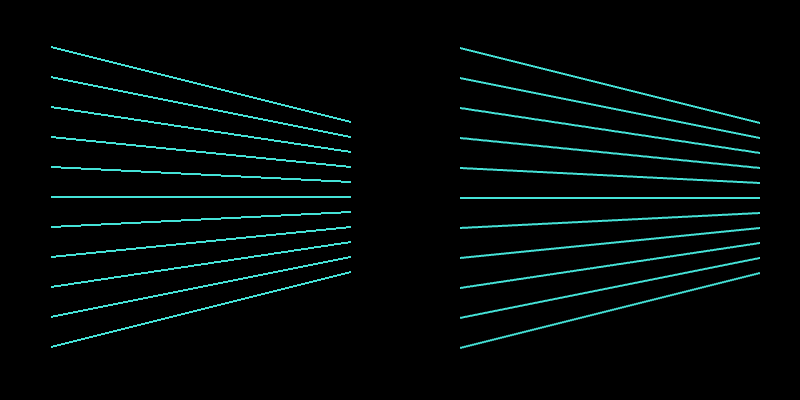
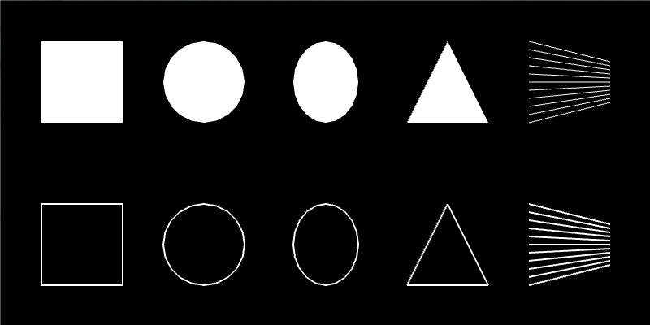

**[Note: Include something about rounded rect]**
**[Note: Include something about layering, explaining screen buffer]**
**[Note: Include something about setting rect mode, circle resolution]**
**[Note: Include something about RGB colors]**

#### 1.1b Drawing to the screen! (But now the fun bits.) ####

You surivived the boring bits!

Well, the necessary bits.  Why draw a single rectangle, when you can draw a bagillion?

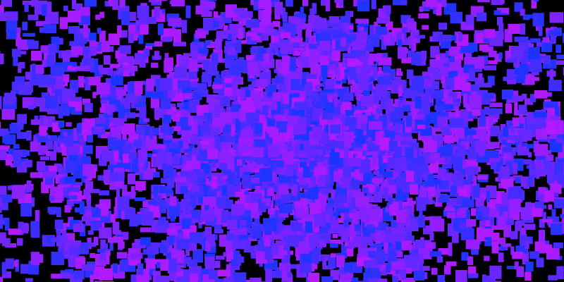

Let's create a new openFrameworks project and call it something like ShapeBrush.  We are going to just use the basic recipes from the last section and mix in some randomness and repetition to create a digital 'brush.'  When we click somewhere on the screen, we will draw a ton of shapes.  But we need a canvas that doesn't constantly erase itself. openFrameworks clears the screen on with each invocation of `draw`, so enter [`ofSetBackgroundAuto`](http://openframeworks.cc/documentation/graphics/ofGraphics.html#show_ofSetBackgroundAuto "ofSetBackgroundAuto Documentation Page"), which allows us to stop openFrameworks from clearing the screen on each update.  Add the following lines into your `setup` function:

	ofSetBackgroundAuto(false);
	ofBackground(0); // If you omit this, the screen will be a default gray color

`ofSetBackgroundAuto` takes a boolean value, so pass in `false` and then we draw a black background.  **[Note: point to c++ chapter's description of bools?]**   Great!  We've created an exceptionally empty space that we can overload with shapes.

Since we will be doing all our drawing inside of the `draw` function, what we need to create some variables that let us know 1) where the mouse is located on the screen and 2) whether or not the left mouse button is currently pressed.

For 1), we can use two built-in openFrameworks variables `mouseX` and `mouseY`.  These variables are updated internally by openFrameworks. We can use them inside our `draw` function as we would any other integer variables.

For 2), we should take a look at two functions inside your openFrameworks source file (.cpp) that you probably haven't had a need to use yet: [`mousePressed(int x, int y, int button)`](http://www.openframeworks.cc/documentation/application/ofBaseApp.html#show_mousePressed "mousePressed Documentation Page") and [`mouseReleased(int x, int y, int button)`](http://www.openframeworks.cc/documentation/application/ofBaseApp.html#show_mouseReleased) "mouseReleased Documentation Page").  These functions are called by openFrameworks anytime a mouse button is pressed or released.  It recieves the x and y position of the mouse when the mouse was pressed/released as well as an integer representing which mouse button was pressed/released.   We can thus set up a boolean variable, isLeftMousePressed, and change its value inside of these two functions.

So add this to your header file (.h):

	bool isLeftMousePressed;

And add this into the `setup` function of your source file (.cpp):

	isLeftMousePressed = false;  

Now that the boolean variable is set up, add these lines to your `mousePressed` and `mouseReleased` functions:

	void testApp::mousePressed(int x, int y, int button){
		if (button == OF_MOUSE_BUTTON_LEFT) isLeftMousePressed = true;
	}
	
	void testApp::mouseReleased(int x, int y, int button){
		if (button == OF_MOUSE_BUTTON_LEFT) isLeftMousePressed = false;
	}

Whenever a button on the mouse is pressed or released, we want to check if that button is the left mouse button.  If it is, then we can adjust our `isLefMousePressed` boolean appropriately.  The `button` variable is an integer that identifies which button is pressed/released, and openFrameworks provides some handy constants that we can use to identify the button in a human-readable way (`OF_MOUSE_BUTTON_LEFT`, `OF_MOUSE_BUTTON_MIDDLE` and `OF_MOUSE_BUTTON_RIGHT`).  If you really wanted, you *could* just say `button == 0` to test for whether the pressed/released button is the left mouse button.

Let's hop into the `draw` function and start making use of our mouse information:

	if (isLeftMousePressed) {
		ofSetColor(255);
		ofSetRectMode(OF_RECTMODE_CENTER);
		ofRect(mouseX, mouseY, 50, 50);
	}

[`ofSetRectMode`](http://www.openframeworks.cc/documentation/graphics/ofGraphics.html#show_ofSetRectMode "ofSetRectMode Documentation Page") allows us to control how the x and y positions we pass into `ofRect` are used to draw a rectangle.  Like with the mouse button constants, openFrameworks provides some rectangle mode constants for us to use: `OF_RECTMODE_CORNER` and `OF_RECTMODE_CENTER`.  By default rectangles are drawn by interpreting the x and y values you pass to it as the coordinates of the upper left corner (`OF_RECTMODE_CORNER`).  For our purposes, it is more convient for us to specify the center of the rectangle (`OF_RECTMODE_CENTER`) so that our rectangle is centered over the mouse position.  So we draw the center of our white, 50 x 50 rectangle at the mouse position using `mouseX` and `mouseY`.

Boring! We are going to make this a bit more interesting by 1) adding randomness and 2) adding repeptition.

Randomness makes your openFrameworks sketches dark, mysterious and unpredictable.  So meet one of your new friends, [`ofRandom`](http://openframeworks.cc/documentation/math/ofMath.html#!show_ofRandom "ofRandom Documentation Page").  `ofRandom` can be used in two different ways: by passing in two values `ofRandom(float min, float max)` or by passing in a single value `ofRandom(float max)`.  If you pass in two values, they are the minimum and maximum values you want your random value to take.  If you pass in a single value, it is considered to be the maximum value you want and the minimum is assumed to be 0.  So when we go to specify the color of the rectangle we are about to draw, we can substitute a random value:

	ofSetColor(ofRandom(50, 255));

**[Note: Aside on what computer randomness is?]**

**[Note: Point to c++ section on float vs int and casting?]**

Remember that we are using grayscale colors and that they take on values between 0 and 255.  We can exlude some of the deep black colors because they won't be visible to us when drawing on a black background.  

**[Note: change image to cursive 'hi'?]**

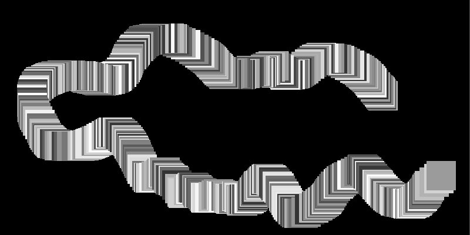

**[Note: reference to c++ loops section?]**

So whenever you are done drawing weird rectangle snakes, we can move on to adding repetition.  Instead of drawing a single rectangle every frame during which the left mouse button is pressed, we can draw a burst of randomized rectangles.  To create that burst, we are going use a for loop to generate a set some number of rectangles where each rectangle's parameters are randomly chosen from a set of values.  So what can we randomize?  Grayscale color, width and height are easy candidates.  We can also use a small positive or negative value to randomly offset each rectangle from mouse position.  Modify your `draw` function to look like this:  

	if (isLeftMousePressed) {
		ofSetRectMode(OF_RECTMODE_CENTER);
		int numRects = 10;
		for (int r=0; r<numRects; r++) {
			ofSetColor(ofRandom(50, 255));
			float width = ofRandom(5, 20);
			float height = ofRandom(5, 20);
			float xoffset = ofRandom(-40, 40);
			float yoffset = ofRandom(-40, 40);
			ofRect(mouseX+xoffset, mouseY+yoffset, width, height);
		}
	}

But let's add one more thing before you hit run.  Into `setup`, add:

	ofSetFrameRate(60);

**[Note: do I need to explain framerate?]**

Why do we care about setting the framerate here?  We want to be able to accurately know (and control) how many rectangles our code will draw.  We are drawing 10 every time the `draw` function is called, but without setting the framerate, we don't know ahout many times the `draw` function will be called per second.  By setting the framerate to 60 frames per second, then we can say that our code will generate `10 rectangles per frame * 60 frames per second = 60 rectangles per second`.

So what happens when you try using your new rectangle brush?  You get a box-shaped, messy spread of random rectangles.  Things are slowly becoming more interesting.  But you might have been expecting to see a circular spread?  Since we said that `xoffset` and `yoffset` could be random values between -40 and 40, we were actually picking values from a rectangular region of space.  You can imagine the boundries of that region by thinking about what happens when `xoffset` and `yoffset` take on their extreme values (e.g. [`xoffset`, `yoffset`] values of [-40, -40], [40, -40], [40, 40], [-40, 40]).

To generate a circular spread, we need to introduce a tiny pinch of mathematics.  If we want to pick a random point that lives within a circle that has a particular size, it helps to think in terms of angles.  Image you are at the center of a circle.  If you rotate a random amount (let's call this the *polar angle*) and then move a random distance (let's call this the *polar radius*), you will end up in a random location within the circle (assuming you don't walk so far that you cross the boundry of your circle).  You've defined a point in space by a polar angle and a polar radius instead of using an x coordinate and a y coordinate.  What you've done is think in terms of what are called [polar coordinates](http://en.wikipedia.org/wiki/Polar_coordinate_system "Polar Coordinates Wiki").  (In contrast, using x and y values to define a point is the [Cartesian coordinate system](http://en.wikipedia.org/wiki/Cartesian_coordinate_system "Cartesian coordinate system"].)

**[Note: This could use a simple visual to show cartesian vs polar coords]**

So where does this leave us in terms of our code?  If we start at the mouse position, we want to pick a random direction (polar angle) and random distance (polar distance).  Once we have those, we can convert them back to Cartesian coordinates (x and y values) to be used for our `xoffset` and `yoffset`.  So modify your for loop inside your `draw` function to look like this:

**[Note: Explain the trig conversion from polar to cartesian, or point to the math chapter section?]**

	for (int r=0; r<numRects; r++) {
		ofSetColor(ofRandom(50, 255));
		float width = ofRandom(5, 20);
		float height = ofRandom(5, 20);
		float angle = ofRandom(2.0*PI);
		float distance = ofRandom(35);
		float xoffset = cos(angle) * distance;
		float yoffset = sin(angle) * distance;
		ofRect(mouseX+xoffset, mouseY+yoffset, width, height);
	}

**[Note: explain radians vs degrees]**

**[Note: if there is room, add in a gaussian distribution via box-muller transform]**

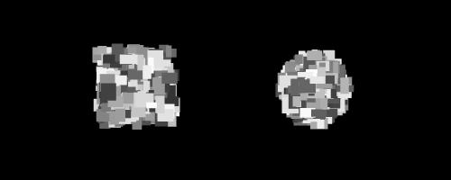

**[Note: Insert an image using the rectangle brush]**

:) You are a rectangle master now.  But the circles, ellipses, lines and triangles probably feel neglected.  Since we are going to create a few more brushes, let's add two things to our code 1) the ability to erase the screen and 2) the ability to switch between brushes.

For erasing the screen, add the following lines (check the comments to see where to put them):
	
	// Add to your header (.h):
	bool isRightMousePressed;
		
	// Add to setup()
	isRightMousePressed = false;
		
	// Add to mousePressed()
	if (button == OF_MOUSE_BUTTON_RIGHT) isRightMousePressed = true; 
	
	// Add to mouseReleased()
	if (button == OF_MOUSE_BUTTON_RIGHT) isRightMousePressed = false;
	
	// Add to the beginning of draw()
	if (isRightMousePressed) ofBackground(0);

Now we can right click to get a fresh screen.  For adding the ability to switch between brushes, we are going to define an integer `drawingMode` and each number from 0 through 3 will represent a unique mode.  To make our code more human-readable, we will define an integer variable for each of those modes, e.g. `rectangleMode = 0`, etc.  Inside of `draw`, we can then check the drawingMode variable to determine what code to execute.  Then finally, we will use keyboard inputs to switch between the different brush modes.

Add these variables to your header file (.h):

	int drawingMode;
	int rectangleMode = 0;
	int ellipseMode = 1;
	int circleMode = 2;
	int lineMode = 3;
	int triangleMode = 4;

In your `.cpp` function, initialize your drawing mode to the rectangle brush:

	drawingMode = rectangleMode;

We are going to reorganize the `draw` function, so that it looks like this:

	// If right mouse button pressed, erase the screen
	if (isRightMousePressed) ofBackground(0);
	
	// If left mouse button pressed, draw the appropriate brush
	if (isLeftMousePressed) {
	
		if (drawingMode == rectangleMode) {
			// Insert the rectangle drawing code you wrote here
		}
		
		else if (drawingMode == circleMode) {
		}
		
		else if (drawingMode == lineMode) {
		}
		
		else if (drawingMode == triangleMode) {
		}
	}

And for getting keyboard inputs, we are going to make use of the [`keyPressed(int key)`](http://openframeworks.cc/documentation/application/ofBaseApp.html#!show_keyPressed keyPressed "Documentation Page") function that is already built into your openFrameworks code.  Like `mousePressed`, this function is called any time a key is pressed.  We just need to use that integer that is passed in to keyPressed to switch our `drawingMode`.  "r" for rectangle mode, "c" for circle mode, etc.  

But how exactly does an integer tell us which key has been pressed?  Well that integer is actually the ASCII code for the key that was pressed.  You can check out the [ASCII wiki](http://en.wikipedia.org/wiki/ASCII "ASCII Wiki Page") for details, but for this chapter, it is enough to just know that ASCII is an agreed upon system for assigning numbers to characters.  And it turns out to be quite easy to check if that ASCII integer `key` is a particular character.  Let's see what this looks like in code.  Add these lines to your `keyPressed` function:

	if (key == 'r') drawingMode = rectangleMode;
	else if (key == 'c') drawingMode = circleMode;
	else if (key == 'l') drawingMode = lineMode;
	else if (key == 't') drawingMode = triangleMode;

In c++, you can compare an integer like `key` with a character through an inequality.  

**[Note: Explain char vs int, the double quote vs single quote.  Or is this in c++ chapter]**

**[Note: the constants that oF provides for key presses]**

Whew! Now when you run your code, you should be able to clear your screen and switch between brushes.  Now let's fill in those circle, line and triangle brushes!

With our circle brush, let's play with transparency and then add in some color.  Unlike what we did with rectangles, we are going to layer our circles on top of each other until they become hazy and indistinct.  We are going to draw a giant transparent circle, then draw a slightly smaller transparent circle, then repeat, repeat, repeat.

Transparency? So far, we've only used opaque grayscale colors, but you can make your colors transparent by adding an extra parameter to `ofSetColor`, like `ofSetColor(255, 50)`.  That second parameter that we passed in is the alpha channel.  It takes a value from 0 to 255 where 0 is completely transparent and 255 is completely opaque.  But before we use colors that have alpha, we need to enable something called alpha blending.  This just means that when two transparent colors occupy the same space on the screen, their colors get mixed.  Alpha blending is disabled by default because it requires additional computational power over drawing opaque colors.  In the `setup` function, add the following line:

	ofEnableAlphaBlending();

Now we can start working on our `draw` function.  We will use the `angle`, `distance`, `xoffset` and `yoffset` code like we did with the rectangle brush.  The difference is that our loop will control the radius of our circle.  We will start with drawing a large radius circle and slowly reduce our radius to 0.  So add the following to `draw`:

	int maxRadius = 100;
	int radiusStepSize = 5;
	int alpha = 3;
	int maxOffsetDistance = 100;
	for (int radius=maxRadius; radius>0; radius-=radiusStepSize) {
		float angle = ofRandom(2.0*PI);
		float distance = ofRandom(maxOffsetDistance);
		float xoffset = cos(angle) * distance;
		float yoffset = sin(angle) * distance;
		ofSetColor(255, alpha);
		ofCircle(mouseX+xoffset, mouseY+yoffset, radius);
	}

The result is something like drawing with glowing light.  You can play with the maxRadius, radiusStepSize, alpha and maxOffsetDistance to get make that glowing effect stronger, weaker, narrower or wider.

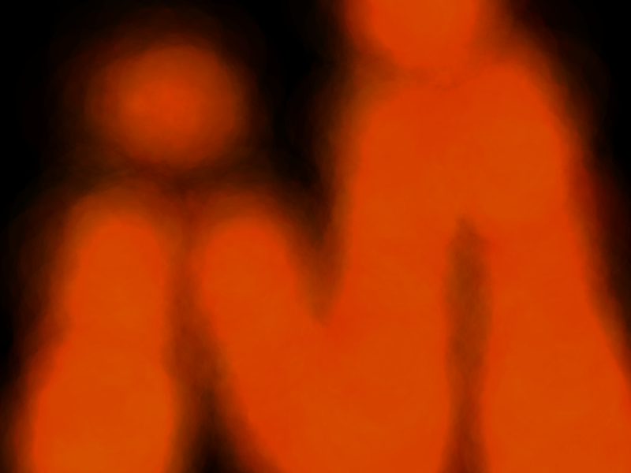

Kind of cool right?  You are probably tired of having to live in moody shades of gray for so long.  Well, `ofSetColor` has some alternate forms that make use of the RGB color model.  If you haven't heard of RGB before, you can check out the [wiki](http://en.wikipedia.org/wiki/RGB_color_model "Wiki on RGB Color Model").  It allows you to specify a color through quantifying the amount of red, blue and green light in the color.  We refer to these color components as channels, and each channel can take on a value from 0 to 255.  (Alpha is another possible channel.) So here are the forms of `ofSetColor` we can now use:

**[Note: would it be helpful to somewhere explain 24-bit/32-bit color and where 256 comes from?]**

**[Note: would it be helpful to have a RGB diagram?]**

	ofSetColor(255); // Opaque grayscale white
	ofSetColor(255, 10); // Very transparent grayscale white
	ofSetColor(255, 0, 0); // Opaque red! Hooray for color :)
	ofSetColor(255, 0, 0, 10); // Very transparent red

So go ahead and modify your `ofSetColor` line of code inside of your circle brush to use some color you like.  I'll just leave this orange here: `ofSetColor(255, 103, 0, 3);`

There's another way we can use `ofSetColor` that is useful.  Meet [`ofColor`](http://openframeworks.cc/documentation/types/ofColor.html "ofColor Documentation Page"].  This is a handy class that openFrameworks provides for handling colors that allows you to do some color math (among other things). Here are some examples of defining and modifying colors:

	ofColor orange(255, 132, 0); // Opaque orange color - specified using RGB
	
	ofColor blue(0, 0, 255, 50); // Transparent blue color - specified using RGBA
	
	// You can access the red, green, blue and alpha channels like this:
	ofColor green(0, 0, 255, 255);
	cout << "Red channel:" << green.r << endl;
	cout << "Green channel:" << green.g << endl;
	cout << "Blue channel:" << green.b << endl;
	cout << "Alpha channel:" << green.a << endl;
	
	// You can also set the red, green, blue and alpha channels like this:
	ofColor yellow;
	yellow.r = 255;
	yellow.b = 0;
	yellow.g = 255;
	yellow.a = 255;

Now, let's say that instead of just using an orange or a red color for our circle brush, what if we wanted to pick a random color in-between orange and red?  `ofColor` has a solution for using what is called [linear interpolation](http://en.wikipedia.org/wiki/Linear_interpolation "Wiki for Linear Interpolation"].  Replace your `ofSetColor` line of code with these four lines of code: 

**[Note: explain lerp for the math averse and explain the syntax]**

	ofColor orange(255, 132, 0, alpha);
	ofColor red(255, 6, 0, alpha);
	ofColor inbetween = orange.getLerped(red, ofRandom(1.0));
	ofSetColor(inbetween);
	
Maybe you aren't a fan of circles?  You can turn your circle into an ellipse using:

	ofEllipse(mouseX+xoffset, mouseY+yoffset, radius*ofRandom(0.8, 1.2), radius*ofRandom(0.8, 1.2));

What about using outlines instead of solid shapes inserting `ofNoFill();` into your circle brush code?  If you do that, try increasing your `alpha` to 10 and lowering your `radiusStepSize` to 1.  (Don't forget that if you start using `ofNoFill` in your circle brush, you should add `ofFill` to your rectangle brush!)

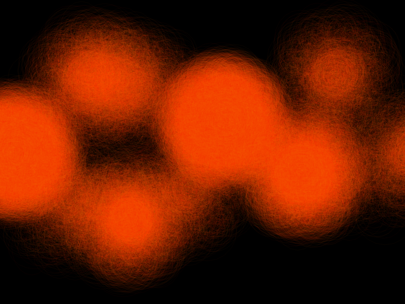

**[Note: opportunity to explain push/pop style]**

**[Note: if there is time, extension with using an exponential decay for circle radius]**

**[Note: Why does the hue break when using alpha == 1?]**

Rectangles, check.  Circle and ellipses, check.  Lines.  We're all familiar with an asterisk, right?  We are going to create a brush that draws a bunch of lines that all intersect at their midpoints - something like an asterisk - and look like a twinkling star.  

The code you've used before is almost all that you need to create this brush.  We will draw a set of randomly sized lines that extend out from the mouse position in random directions.  One new wrinkle, if we want our brush to look "twinkly", is that we want our brush to be brightest in the center and fade towards the periphery.  So let's add this in the line brush section of the `draw` function:

	int numLines = 30;
	int minRadius = 25;
	int maxRadius = 125;
	for (int i=0; i<numLines; ++i) {
		float distance = ofRandom(minRadius, maxRadius);
		float angle = ofRandom(2.0*PI);
		float xoffset = cos(angle) * distance;
		float yoffset = sin(angle) * distance;
		float alpha = ofMap(distance, minRadius, maxRadius, 50, 0);
		ofSetColor(255, alpha);
		ofLine(mouseX, mouseY, mouseX+xoffset, mouseY+yoffset);
	}

What have we done with the alpha?  We've introduced a new function called ['ofMap'](http://www.openframeworks.cc/documentation/math/ofMath.html#show_ofMap "ofMap Documentation Page").  This provides a quick way to do a linear interpolation **[note: link to math]**.  To get a "twinkle," We want our shortest lines to be the most opaque and our longer lines to be the most transparent.  We want to tie the alpha parameter to the distance parameter.  `ofMap` takes a value from one range and maps it into another range like this: `ofMap(float value, float inputMin, float inputMax, float outputMin, float outputMax)`.  We tell it that distance is a value in-between minRadius and maxRadius and that we want it mapped such a distance value of 125 (maxRadius) yields an alpha value of 50 and a distance value of 25 (minRadius) yields an alpha value of 0.  The longer the line, the more transparent the color.

If you wanted to, you could also play with the line thickness:
	
	ofSetLineWidth(ofRandom(1.0, 5.0));

Just remember that if you change the line width here, you will need to go to your other brushes and set the line width back to 1. 

**[Note: maybe expand upon linking variables together - now that you know how to do this, what could you have done with your prior brushes to make them cooler?]**

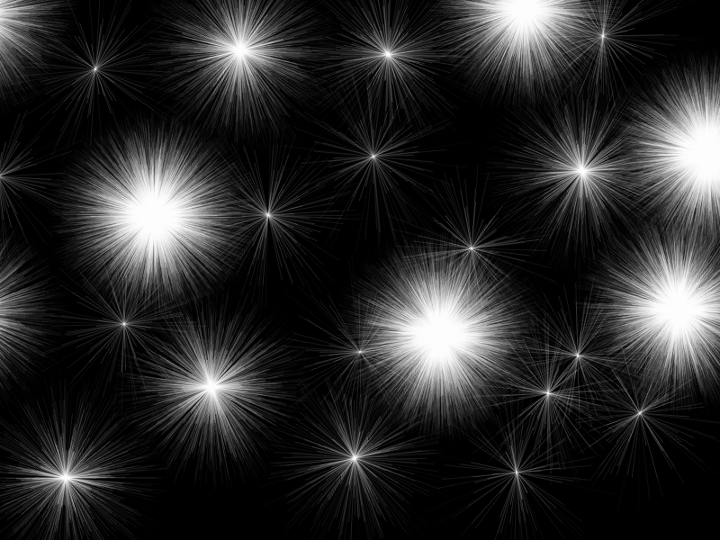

Whew, time for the last brush from predefined shapes - the triangle!  The general idea for this brush is to draw a bunch of randomized triangles that appear to be directed out from the mouse position.  Like this:

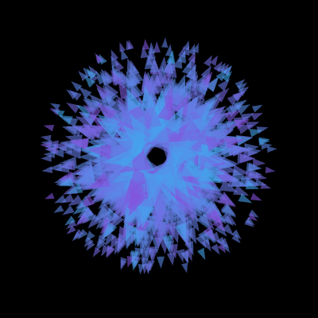

But to be able to get to that, we will need to introduce [`ofVec2f`](http://openframeworks.cc/documentation/math/ofVec2f.html "ofVec2f Documentation Page").  We've been defining a point in space by keeping two separate variables - one for the x position and one for the y position.  A triangle is defined by three points, so we would end up with six separate variables if we continued with our current tactic.  `ofVec2f` is a vector, and it allows us to hold both the x and y coordinates in one variable (and comes with some handy math operations).  You can use an ofVec2f variable like this:

	ofVec2f mousePos(mouseX, mouseY);
	
	// Access the x and y coordinates like this: 
	cout << "Mouse X: " << mousePos.x << endl;
	cout << "Mouse Y: " << mousePos.y << endl;
	
	// Or you can modify the coordinates like this:
	float xoffset = 10.0;
	float yoffset = 30.0;
	mousePos.x += xoffset;
	mousePos.y += yoffset;
	
	// But you can do what we just did above by adding or subtracting two vectors directly
	ofVec2f offset(10.0, 30.0);
	mousePos += offset;
	
**[Note: this may need more description; division/mult, scaler vs vector]**

ofVec2f isn't that scary, right?  And it is quite useful.  So let's start using it to build towards the triangle brush.  First step is to draw a triangle at the mouse cursor.  Specifically, we are going to draw an isoceles triangle:

**[Note: Stolen graphics from wolfram, generate something similar later]**

An isoceles triangle is one that has two sides that are of equal length (labeled as b) and one side of a different length (labeled a).  You can also see that the height (labeled h) is drawn in the figure.  We are going to use draw a skinny triangle using one side (a) and the height (h).  It will become important later, but we are going to draw our triangle starting from the mouse cursor and pointing to the right.  Add these lines to the triangle section of your `draw` function:

	ofVec2f mousePos(mouseX, mouseY);
	
	// Define the parameters of the triangle
	float triangleHeight = 100;
	float triangleSide = triangleHeight/2.0;
	
	// Define a triangle around the origin (0,0)
	ofVec2f p1(0, triangleSide/2.0);
	ofVec2f p2(triangleHeight, 0);
	ofVec2f p3(0, -triangleSide/2.0);
	
	// Shift the triangle to the mouse position
	p1 += mousePos;
	p2 += mousePos;
	p3 += mousePos;
	
	ofSetColor(255, 50);
	ofTriangle(p1, p2, p3);

So we are defining the three points of the triangle using three points set relative to the mouse position.  If all goes well, you will end up with something like this:

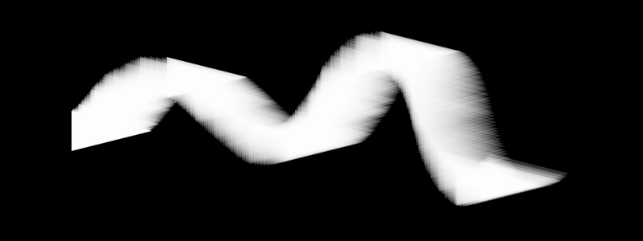

You've used vectors!  Now, we are going to want to be able to rotate our triangles to point in any direction.  Previously, we've fearlessly used trigonometry (sin and cos) for our rotations.  But! `ofVec2f` has a [`rotate`](http://www.openframeworks.cc/documentation/math/ofVec2f.html#show_rotate "ofVec2f's rotate function documentation page") function.  Let's try adding a rotation into our code:

	ofVec2f mousePos(mouseX, mouseY);
	
	// Define the parameters of the triangle
	float triangleHeight = 100;
	float triangleSide = triangleHeight/2.0;
	
	// Define a triangle around the origin (0,0)
	ofVec2f p1(0, triangleSide/2.0);
	ofVec2f p2(triangleHeight, 0);
	ofVec2f p3(0, -triangleSide/2.0);
	
	// Rotate the triangle points around the origin
	float rotation = ofRandom(360);
	p1.rotate(rotation);	// Uses degrees!
	p2.rotate(rotation);
	p3.rotate(rotation);
	
	// Shift the triangle to the mouse position
	p1 += mousePos;
	p2 += mousePos;
	p3 += mousePos;
	
	ofSetColor(255, 50);
	ofTriangle(p1, p2, p3);

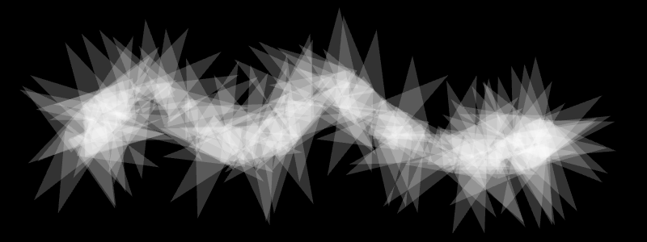

See how ofVec2f simplifies your life?  (Or at least your code.)  If you were to move that rotation code to *after* we shifted the triangle to the mouse position, the code wouldn't work very nicely.  The way we are using `rotate` assumes that we want to rotate all of our points around the origin, which is (0,0).  But there is an alternate way to use `rotate` where you pass in two paramters: the rotation angle and a pivot point.  So you could shift your triangle to the mouse position and then use `p1.rotate(rotation, mousePos)` - everything would work just fine!

We're getting there!  Next step, let's integrate this code into our prior approach of drawing multiple shapes that are offset from the mouse position:

	ofVec2f mousePos(mouseX, mouseY);
	
	int numTriangles = 10;
	int minOffset = 5;
	int maxOffset = 70;
	int minHeight = 6;
	int maxHeight = 20;
	int alpha = 150;
	
	for (int t=0; t<numTriangles; ++t) {
		float offsetDistance = ofRandom(minOffset, maxOffset);
		float triangleHeight = ofMap(offsetDistance, minOffset, maxOffset, maxHeight, minHeight);
		float triangleSide = triangleHeight/2.0;
		
		ofVec2f p1(0, triangleSide/2.0);
		ofVec2f p2(triangleHeight, 0);
		ofVec2f p3(0, -triangleSide/2.0);
		
		float rotation = ofRandom(360);
		p1.rotate(rotation);
		p2.rotate(rotation);
		p3.rotate(rotation);
		
		ofVec2f triangleOffset(offsetDistance, 0.0);
		triangleOffset.rotate(rotation);
		
		p1 += mousePos + triangleOffset;
		p2 += mousePos + triangleOffset;
		p3 += mousePos + triangleOffset;
		
		ofSetColor(255, alpha);
		ofTriangle(p1, p2, p3);
	}

So we are now using `of2Vec` to figure out our offset.  To do that, we need to create a vector that points rightward.  Why rightward?  Well, that's the 0 degree direction.  This is why we initially created our triangles pointing rightward from the mouse.  Both our offset and our triangle are pointing in the same direction.  So when we apply the same rotation to both of them, they stay in sync (i.e. both pointing away from the mouse cursor).  See what happens if you try doing `triangleOffset.rotate(rotation+90);`  You'll get a swirling blob of triangles.   Hey, you might even like that effect better than the original.  

**[Note: this explanation may need clarification; also, possibly introduce vector length here?]**

How about we add some color?  I won't get offended if you'd rather use your own colors.

		ofColor aqua(0, 252, 255, alpha);
		ofColor purple(198, 0, 205, alpha);
		ofColor inbetween = aqua.getLerped(purple, ofRandom(1.0));
		ofSetColor(inbetween);

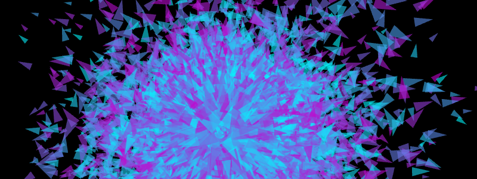	

And once again, you can play with turning off fill and changing line width if you like.

But now you are a master of rectangles, circles, ellipses, lines and triangles, you can make other brushes that strike your fancy.  (Or you can go off and make something other than a brush.)  In the next section, we'll hop into freeform shapes and how you can use those to create paths out of your digital brush strokes.

**Go back and add subheaders for each brush to better break up the sections and then title them with the concepts that will be introduced (and add that to the outline)**

**Need a section on saving your final image**

**Need to include links to works by artists using these approaches**

### 1.2 Freeform Shapes ###

In the last section, we drew our graphics directly onto the screen.  We were storing the graphics (the brush strokes) as pixels.  This is known as [raster graphics](http://en.wikipedia.org/wiki/Raster_graphics "Raster Graphics Wiki").  That means that it is hard for us to erase just the last brush stroke.  It also makes it hard for us to rescale graphics once they are drawn.  In contrast, there is something called [vector graphics](http://en.wikipedia.org/wiki/Vector_graphics "Vector Graphics Wiki").  The graphics that you draw as stored as a list of geometric objects (also called geometric primitives) instead of pixel values.  Those objects can be modified after you "place" them on your screen.  You can erase or rescale a brush stroke with ease.  You might already be familiar with the concept of vector graphics if you have used software like Adobe Illustrator, Inkscape, etc.

Why does any of that matter?  We are moving into the territory of vector graphics by using freeform shapes in openFrameworks.  We are going to be using structures that allow us to store and draw paths.

#### 1.2a Hello Polyline ####

Create a new project and call it something like PathBrush.  Say hello to [`ofPolyline`](http://www.openframeworks.cc/documentation/graphics/ofPolyline.html "ofPolyline Documentation Page"), who is about to become our buddy.  What's an ofPolyline?  It is a data structure that allows you to store a series of sequential points and then draw them to create a line or shape.  Like with `ofColor` and `ofVec2f`, `ofPolyline` gives you a bunch of handy helper functions to make life easier.

How about we get acquainted with ofPolyline in the context of some code?  Let's define three `ofPolylines` in the header file (.h):

	ofPolyline straightSegmentPolyline;
	ofPolyline curvedSegmentPolyline;
	ofPolyline closedShapePolyline;

Now, we can fill those polylines with points in the `setup` function of the source file (.cpp):

	straightSegmentPolyline.addVertex(100, 100);
	straightSegmentPolyline.addVertex(150, 150);
	straightSegmentPolyline.addVertex(200, 100);
	straightSegmentPolyline.addVertex(250, 150);
	straightSegmentPolyline.addVertex(300, 100);
	
	curvedSegmentPolyline.curveTo(350, 100); // Necessary Duplicate
	curvedSegmentPolyline.curveTo(350, 100);
	curvedSegmentPolyline.curveTo(400, 150);
	curvedSegmentPolyline.curveTo(450, 100);
	curvedSegmentPolyline.curveTo(500, 150);
	curvedSegmentPolyline.curveTo(550, 100);
	curvedSegmentPolyline.curveTo(550, 100); // Necessary Duplicate
	
	closedShapePolyline.addVertex(600, 125);
	closedShapePolyline.addVertex(700, 100);
	closedShapePolyline.addVertex(800, 125);
	closedShapePolyline.addVertex(700, 150);
	closedShapePolyline.close();
	
And finally, we can then draw our polylines in the `draw` function:

	ofBackground(0);
	ofSetLineWidth(2.0);
	ofSetColor(255,100,0);
	straightSegmentPolyline.draw();
	curvedSegmentPolyline.draw();
	closedShapePolyline.draw();

So what did we do here?  We created three different types of polylines.  

For the first one, `straightSegmentPolyline`, we used the [`addVertex`](http://www.openframeworks.cc/documentation/graphics/ofPolyline.html#show_addVertex "addVertex Documentation Page") function.  This allows us to add points that will be connected with a series of straight lines.  You can pass an `ofVec2f` (or `ofVec3f`) to `addVertex`, or you can pass in x and y (and an optional z) into the function in that order.  

For the second one, `curvedSegmentPolyline` we use the same points, but we connect up the points with curved lines using [`curveTo`](http://www.openframeworks.cc/documentation/graphics/ofPolyline.html#show_curveTo "curveTo Function Documentation Page").  `curveTo` accepts the same types of inputs as `addVertex`.  Notice that we had to add the first vertex and last vertex twice.  The `curveTo` function, like its name suggests, curves from the last vertex to the vertex that you pass in.  **[note: explain why you need a first duplicate AND a last duplicate]**  

For the final one, `closedShapePolyline`, we used straight line segments again, but we use the [`close`](http://www.openframeworks.cc/documentation/graphics/ofPolyline.html#show_close "close Function Documentation Page") function to connect our last vertex to our first vertex.  **[note: explain why you would want to close a polyline]**  

After you created those polylines in `setup`, then you were able to draw them using the polyline's [`draw`](http://www.openframeworks.cc/documentation/graphics/ofPolyline.html#show_draw "draw Function Documentation Page") function to display them to the screen.  (Note that `ofSetLineWidth` works to adjust the thickness of polylines.)  And you ended up with something that looked like this:

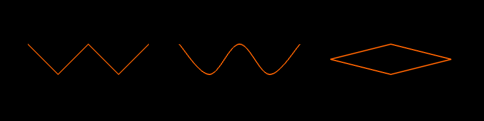

So the advantage of drawing paths and shapes in this way (versus what we did in the last section) is that those polyline objects are stored and are modifiable.  We could move our vertices around on the fly.  We could add or delete vertices on the fly.  **[note: maybe put a little more effort to explain the power]** 

#### 1.2b Polyline Brushes ####

Let's start using polylines to track brush "strokes."  When the left mouse button is held down, we will keep track of the mouse positions and add them to a polyline.  

How should we go about that?  We are going to need a boolean to tell us whether the left mouse button is being held down.  If it is being held down, then we need to get the mouse position every frame.  It would be tempting to just add all of those mouse positions to a polyline, but that could cause some problems.  If we were to just hold the left mouse button down without moving the mouse, we would add a duplicate point to our polyline on every frame.  That could potentially add up to cause slowdowns or crashing, so it is best to plan ahead.  Instead of adding *every* mouse position, let's just add the mouse positions where the mouse has moved a sufficient distance away from the last point in our polyline.  

We've got some idea of what we are going to do, so on to the code.  Put these lines into the header file (.h):

	ofPolyline currentPolyline;
	bool currentlyAddingPoints;
	ofVec2f lastPoint;
	float minDistance;
	
And put these lines into the `setup` function of the source file (.cpp):

	minDistance = 10;
	currentlyAddingPoints = false;
	
We've got our variables set up, so now we can start dealing with the mouse button presses in the `mousePressed` function:

	if (button == OF_MOUSE_BUTTON_LEFT) {
		leftMouseButtonPressed = true;
		currentPolyline.addVertex(x, y);
		lastPoint.set(x, y);
	}
	
When the left mouse button is pressed, we update our variables.  Remember that the variables `x` and `y` in the `mousePressed` and `mouseReleased` functions give us the position of the mouse when a button is pressed/released.  

Our `mouseReleased` function will be quite simple for the moment:

	if (button == OF_MOUSE_BUTTON_LEFT) {
		leftMouseButtonPressed = false;
		currentPolyline.clear();	
	}
    
We haven't talked about the polyline [`clear`](http://www.openframeworks.cc/documentation/graphics/ofPolyline.html#show_clear "clear Documentation Page") function yet, but it does was you might expect - remove all the points that are stored in the polyline.  This way we can start a new brush stroke with each click of the mouse.  

Great, we've set up our variables and handled mouse button pressed, so here's the workhourse code that will go into the `update` function:

	if (leftMouseButtonPressed) {
		ofVec2f mousePos(mouseX, mouseY);
		if (lastPoint.distance(mousePos) >= minDistance) {
			currentPolyline.addVertex(mousePos);
			lastPoint = mousePos;
		}
	}

This code handles adding the mouse position to the polyline (and only does so when the mouse has moved a certain threshold amount away from the last point we added to the polyline).  Last thing to do is draw our polyline in the `draw` function:

	ofBackground(0);    
	ofSetLineWidth(2);
	ofSetColor(255,100,0);
	currentPolyline.draw();

So you have a super basic pen.  Hooray?  Maybe it is a little too blocky for your tastes?  The polyline is made up of straight line segments at the moment...so let's change that by using `curveTo`.

In `mousePressed`, instead of `currentPolyline.addVertex(x, y);`, try:
	
	currentPolyline.curveTo(x, y); // Necessary duplicate for first point when using curveTo
	currentPolyline.curveTo(x, y);
	
In `update`, instead of `currentPolyline.addVertex(mousePos);`, use `currentPolyline.curveTo(mousePos);`.

And lastly, in `mouseReleased`, add `currentPolyline.curveTo(x, y);` inside your if statement.  This provides our necessary duplicate of our last point.

Your lines should be slightly more attractive (or in the case of my awful mouse control, much more attractive).  Now you've got a basic polyline drawing program, but you don't have the ability to save your polylines.  For that, we will turn to something called a `vector`.  

This isn't the same kind of vector that we talked about earlier in the context of `of2Vecf`. **[Note: need to explain vector]**

So we can use a `vector <ofPolylines>` to save our polyline brush strokes.  When we finish a stroke, we want to add the polyline to our vector.  So in the if statement inside of `mouseReleased`, let's add:

	polylines.push_back(currentPolyline);

Then we can draw our saved polylines in a different color than our current polyline.  So your `draw` function should look like this:

	ofBackground(0);
	ofSetLineWidth(2);
	
	ofSetColor(255);
	for (int i=0; i<polylines.size(); ++i) {
		ofPolyline polyline = polylines[i];
		polyline.draw();
	}
	
	ofSetColor(255,100,0);
	currentPolyline.draw();
	
And you can draw a doopy smiley face:

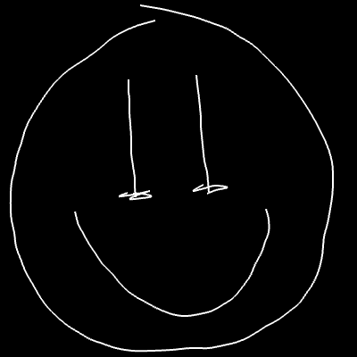

**[Note: could add a description of how to implement a delete/undo feature]**

Now that we have the basic drawing in place, why don't we play with how we are rendering our polylines to the screen?  

First, let's draw circles where the points in our polylines are.  Inside of the for loop in your `draw` function (after `polyline.draw();`, add this:

	vector<ofVec3f> vertices = polyline.getVertices();
	for (int vertexIndex=0; vertexIndex<vertices.size(); ++vertexIndex) {
		ofVec3f vertex = vertices[vertexIndex];
		ofCircle(vertex, 5);
	}
	
**[Note: explain vector<ofVec3f>, getVertices, vertices.size()]**

What happens when you run it?  Your white lines just look thicker?  That's because our polyline is jam-packed with vertices!  Every time we call the `curveTo` function, we create 20 extra vertices (by default).  These are needed to make a smooth-looking curve.  You can adjust how many vertices are added with an optional parameter (`curveResolution`) that you pass to `curveTo` (check out the [documentation page](http://openframeworks.cc/documentation/graphics/ofPolyline.html#show_curveTo "curveTo Documentation Page")).  We don't need quite that many vertices on our polylines, but instead of lowering the `curveResolution`, we can make use of another polyline function called [`simplify`](http://openframeworks.cc/documentation/graphics/ofPolyline.html#show_simplify "simplify Documentation Page").

`simplify` is a function that will remove 'duplicate' points from your polyline.  You pass a single argument into it: `tolerance`, a value between 0.0 and 1.0.  The `tolerance` describes how dis-similar points must be in order to be considered 'unique' enough to not be deleted.  The higher the tolerance, the more points that will be removed.  So right before we save our polyline by putting it into our `polylines` vector, we will simplify it to reduce the number of vertices.  Inside of the if statment within `mouseReleased` (before `polylines.push_back(currentPolyline);`), add: `currentPolyline.simplify(0.75);`.  Now you should see something like this:

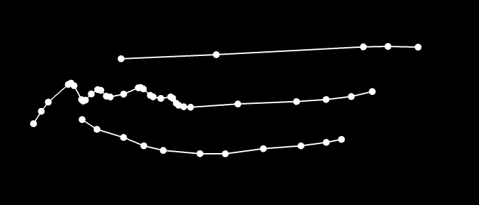

We can also sample points along the polyline using [`getPointAtPercent`](http://openframeworks.cc/documentation/graphics/ofPolyline.html#show_getPointAtPercent "getPointAtPercent Documentation Page").  **[Note: explain the function]**.  Inside the `draw` function, comment out the code that draws a circle at each vertex.  Below that, add: 

        for (int p=0; p<=100; p+=10) {
            ofVec3f point = polyline.getPointAtPercent(p/100.0);
            ofCircle(point, 5);
        }

And now you have evenly spaced points:

Additional extensions to write up:
- Drawing normal lines
- Drawing tangents lines
- Drawing normal shape
- Something fun to cap off all of the concepts

