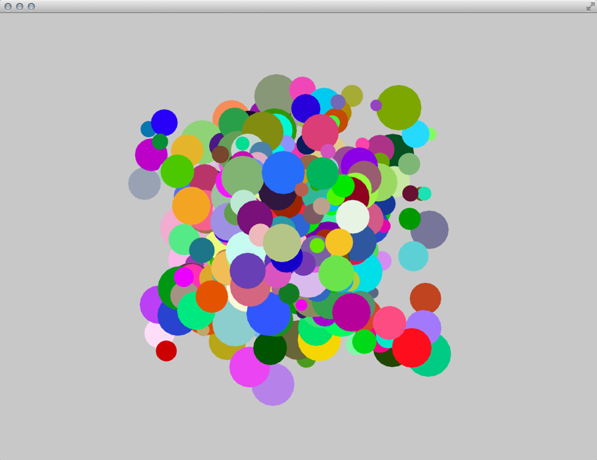

# Ooops! = Object Oriented Programming + Classes

*by [Rui Pereira](http://www.rux-werx-here.net/)*


## Overview
This tutorial is a quick and practical introduction to Object-Oriented Programming in openFrameworks and a how-to guide to build and use your own classes.
By the end of this chapter, you should understand how to create your own objects and have a lot of balls bouncing on your screen!



## What is Object Oriented Programming
Object-Oriented Programming (OOP) is a programming paradigm based on the use of objects and their interactions. A recurring analogy is to see a "class" as a cookie cutter that can create many cookies, the "objects".
Some terms and definitions used within OOP are listed below:

- A class defines the characteristics of a thing - the object - and its behaviors; it defines not only its properties and attributes but also what it can do.

- An object is an instance of a class.

- The methods are the object's abilities.

## How to build your own Classes (simple Class)
Classes and objects are the fundamental part of Object Oriented programming.
Because of cooking, like coding, is fun and we tend to experiment in the kitchen let's continue with the classic metaphor of a cookie cutter as a class, defining its interactions, capabilities and affordances, and cookies as the objects.
Every class has two files: a header file, also known as declarations file with the termination '.h' and an implementation file, terminating in '.cpp'.
A very easy way of knowing what these two files do is to think of the header file (.h) as a recipe, a list of the main ingredients of your cookie. The implementation file (.cpp) is what we're going to do with them, how you mix and work them to be the perfect cookie!
So let's see how it works:

First of all, let's create the two class files: `Ball.h` and `Ball.cpp` and place these in the project's `src` folder.

If you're using Xcode as your IDE (it stands for Integrated Development Environment), select the src folder and left Click (or CTRL + click), on the pop-up menu select 'New File' and you'll be taken to a new window menu, choose the appropriate platform you're developing for (OS X or iOS) and select C++ class and finally choose a name (we used 'Ball'). You'll automatically see the two files in your `src` folder: `Ball.h` and `Ball.cpp`.

If you are using other IDEs it should be quite similar.

Declare a class in the header file (.h). In this case, the file name should be `Ball.h`.
Follow the code below and type into your own `Ball.h` file, please note the comments I've included to guide you along.

```cpp
#ifndef _BALL // if this class hasn't been defined, the program can define it
#define _BALL // by using this if statement you prevent the class to be called more than once which would confuse the compiler
#include "ofMain.h" // we need to include this to have a reference to the openFrameworks framework
class Ball {

    public: // place public functions or variables declarations here

    // methods, equivalent to specific functions of your class objects
    void setup();    // setup method, use this to setup your object's initial state
    void update();  // update method, used to refresh your objects properties
    void draw();    // draw method, this where you'll do the object's drawing

    // variables
    float x;        // position
    float y;
    float speedY;   // speed and direction
    float speedX;
    int dim;        // size
    ofColor color;  // color using ofColor type

    Ball();  // constructor - used to initialize an object, if no properties are passed the program sets them to the default value
    private: // place private functions or variables declarations here
}; // don't forget the semicolon!
#endif
```

We have declared the Ball class header file (the list of ingredients) and now let's get to the cooking part to see what these ingredients can do!
Please notice the '#include' tag. This is a way to tell the [compiler](http://www.cplusplus.com/doc/tutorial/introduction/ "Compiler introduction on cplusplus.com") ([wikipedia](https://en.wikipedia.org/wiki/Compiler "Wikipedia on compilers")) about any files to include in the implementation file. When the program is compiled these '#include' tags will be replaced by the original file they're referring to.
The 'if statement' (#ifndef) is a way to prevent the repetition of header files which could easily occur. This is called an [include guard](https://en.wikipedia.org/wiki/Include_guard "Wikipedia on include guards"). Using this pattern helps the compiler to only include the file once and avoid repetition. Don't worry about this now, we'll talk about it later on!

We will now create a class for a ball object. This ball will have color, speed and direction properties: it will move across the screen and bounce against the wall. Some of these properties we will create with randomized attributes but we'll be careful to create the right logic for its motion behaviors.

Here's how you can write the class `Ball.cpp` file, the implementation file:

```cpp
#include "Ball.h"
Ball::Ball(){
}

void Ball::setup(){
    x = ofRandom(0, ofGetWidth());      // give some random positioning
    y = ofRandom(0, ofGetHeight());

    speedX = ofRandom(-1, 1);           // and random speed and direction
    speedY = ofRandom(-1, 1);

    dim = 20;

    color.set(ofRandom(255),ofRandom(255),ofRandom(255)); // one way of defining digital color is by addressing its 3 components individually (Red, Green, Blue) in a value from 0-255, in this example we're setting each to a random value
}

void Ball::update(){
    if(x < 0 ){
        x = 0;
        speedX *= -1;
    } else if(x > ofGetWidth()){
        x = ofGetWidth();
        speedX *= -1;
    }

    if(y < 0 ){
        y = 0;
        speedY *= -1;
    } else if(y > ofGetHeight()){
        y = ofGetHeight();
        speedY *= -1;
    }

    x+=speedX;
    y+=speedY;
}

void Ball::draw(){
    ofSetColor(color);
    ofDrawCircle(x, y, dim);
}
```

Now, this is such a simple program that we could have written it inside our ofApp(.h and .cpp) files and that would make sense if we didn't want to reuse this code elsewhere. One of the advantages of Object Oriented Programming is reuse. Imagine we want to create thousands of these balls. The code could easily get messy without OOP. By creating our own class we can later re-create as many objects as we need from it and just call the appropriate methods when needed keeping our code clean and efficient. In a more pragmatic example think of creating a class for each of your user-interface (UI) elements (button, slider, etc) and how easy it would be to then deploy them in your program but also to include and reuse them in future programs.


## Make an Object from your Class
Now that we've created a class let's make the real object! In your ofApp.h (header file) we'll have to declare a new object but first, we need to include (or give the instructions to do so) your Ball class in our program. To do this we need to write:

```cpp
#include "Ball.h"
```

on the top of your ofApp.h file. Then we can finally declare an instance of the class in our program. Add the following line inside the `ofApp` class, just above the final "};".

```cpp
Ball myBall;
```

Now let's get that ball bouncing on screen! Go to your project ofApp.cpp (implementation) file. Now that we've created the object, we just need to set it up and then update its values and draw it by calling its methods.

In the `setup()` function of ofApp.cpp add the following code:

```cpp
myBall.setup(); // calling the object's setup method
```

In the `update()` function add:

```cpp
myBall.update(); // calling the object's update method
```

and in the `draw()` function lets add:

```cpp
myBall.draw(); // call the draw method to draw the object
```

Compile and run! At this point, you should be seeing a bouncing ball on the screen! Great!

## Make objects from your Class

By now, you're probably asking yourself why you went to so much trouble to create a bouncing ball. You could have done this (and probably have) without using classes. In fact, one of the advantages of using classes is to be able to create multiple individual objects with the same characteristics. So, let's do that now! Go back to your ofApp.h file and create a couple of new objects:

```cpp
Ball myBall1;
Ball myBall2;
Ball myBall3;
```

In the implementation file (ofApp.cpp), call the corresponding methods for each of the objects
in the ofApp's `setup()` function:

```cpp
myBall1.setup();
myBall2.setup();
myBall3.setup();
```

in the ofApp's `update()` function:

```cpp
myBall1.update();
myBall2.update();
myBall3.update();
```

and also in the `draw()` function:

```cpp
myBall1.draw();
myBall2.draw();
myBall3.draw();
```

## Make more Objects from your Class
We've just created 3 objects but you can have already see how tedious it would be to create 10, 100 or maybe 1000's of them. Hard-coding them one by one would be a long and painful process that could be easily solved by automating the object creation and function calls. Just by using a couple for loops we'll make this process simpler and cleaner. Instead of declaring a list of objects one by one, we'll create an array of objects of type `Ball`. We'll also introduce another new element: a constant. Constants are set after any #includes as #define CONSTANT_NAME value. This is a way of setting a value that won't ever change in the program.
In the ofApp class header file, where you define the balls objects, you also define the constant that we'll use for the number of objects:

```cpp
#define NBALLS 10
```

We'll now use the constant NBALLS value to define the size of our array of objects:

```cpp
Ball groupOfBalls[NBALLS];
```

An array is an indexed list of items of the same type. The index is used to access a particular item in the list. This index usually starts with 0, so the first `Ball` (object) is found at groupOfBalls[0]. Only a handful of programming languages start the index of an array with 1. If you try to access an invalid index (either larger than the size of the array or a negative one), you get an error. Check the 'C++ basics' chapter for more information on arrays. In our implementation file, we create an array of objects and call their methods through 'for' loops.

In the `setup()` function remove:

```cpp
myBall1.setup();
myBall2.setup();
myBall3.setup();
```

and add

```cpp
for(int i=0; i<NBALLS; i++){
    groupOfBalls[i].setup();
}
```

instead.

In the `update()` function remove

```cpp
myBall1.update();
myBall2.update();
myBall3.update();
```

and write

```cpp
for(int i=0; i<NBALLS; i++){
    groupOfBalls[i].update();
}
```

In the `draw()` function replace

```cpp
myBall1.draw();
myBall2.draw();
myBall3.draw();
```

with

```cpp
for(int i=0; i<NBALLS; i++){
    groupOfBalls[i].draw();
}
```

By using the for loop, the `setup()`, the `update()` and the `draw()` method is called for each `Ball` object in the `myBall`-array and no object has to be touched manually.


## Make even more Objects from your Class: properties and constructors

As we've seen, each of the objects has a set of properties defined by its variables (position, speed, direction, and dimension). Another advantage of object-oriented programming is that the objects created can have different values for each of their properties. For us to have better control of each object, we can have a method that allows us to define these characteristics and lets us access them. Because we want to do this right after creating the object, let's do this in the method called `setup()`.  We will modify it to pass in some of the properties of the object, let's say its position and dimension. First, let's do this in the Ball definitions file (*.h):

```cpp
void setup(float _x, float _y, int _dim);
```

We'll need to update the Ball implementation (*.cpp) file to reflect these changes.

```cpp
void Ball::setup(float _x, float _y, int _dim){
    x = _x;
    y = _y;
    dim = _dim;

    speedX = ofRandom(-1, 1);
    speedY = ofRandom(-1, 1);
}
```

Your `Ball.cpp` file should look like this by now:

```cpp
#include "Ball.h"

Ball::Ball(){
};

void Ball::setup(float _x, float _y, int _dim){
    x = _x;
    y = _y;
    dim = _dim;

    speedX = ofRandom(-1, 1);
    speedY = ofRandom(-1, 1);

    color.set(ofRandom(255), ofRandom(255), ofRandom(255));
}

void Ball::update(){
    if(x < 0 ){
        x = 0;
        speedX *= -1;
    } else if(x > ofGetWidth()){
        x = ofGetWidth();
    speedX *= -1;
    }

    if(y < 0 ){
        y = 0;
        speedY *= -1;
    } else if(y > ofGetHeight()){
        y = ofGetHeight();
        speedY *= -1;
    }

    x+=speedX;
    y+=speedY;
}

void Ball::draw(){
    ofSetColor(color);
    ofDrawCircle(x, y, dim);
}
```

Now in the ofApp.cpp file we will need to run this newly implemented method right when we start our application so it will reflect the different settings on each object as they are created. So, in the `ofApp::setup()`

```cpp
for(int i=0; i<NBALLS; i++){

    int size = (i+1) * 10; // defining the size of each ball based on its place in the array
    int randomX = ofRandom( 0, ofGetWidth() ); //generate a random value bigger than 0 and smaller than our application screen width
    int randomY = ofRandom( 0, ofGetHeight() ); //generate a random value bigger than 0 and smaller than our application screen height

    groupOfBalls[i].setup(randomX, randomY, size);
}
```

As you see it is now possible to directly control the properties of the object on its creation. Now we'll just need to use the for loop from above to go through the balls to update and draw them in the respective functions.

```cpp
groupOfBalls[i].update();

groupOfBalls[i].draw();
```


## Make Objects on the fly

While many times you'll already have a pre-defined number of objects you'll need to create and using arrays is the right choice, there are other ways to create multiple objects that offer other advantages: welcome vectors!
Vectors are really great as they'll allow creating collections of objects without a predefined number of elements. They're quite dynamic and allow you to add objects on the fly (e.g. while your program is running) but also to remove them when you no longer need the objects. Think of them as elastic arrays.
So, let's use them!
Note: You'll be hearing about two different types of vectors throughout this book. Please don't confuse stl::vectors (the type of the elastic array we're talking about) with mathematical vectors (e.g. forces).

To learn more about stl::vector checks the "C++ basics" chapter or the [short online tutorial on the openFrameworks website](http://openframeworks.cc/tutorials/c++%20concepts/001_stl_vectors_basic.html).

Back to our beloved ofApp.h file, let's define a vector of `Ball` objects by typing:

```cpp
vector <Ball> groupOfBalls;
```

In this expression, we're creating a type (vector) of type (Ball pointers) and naming it groupOfBalls.
Now, let's head to our ofApp.cpp and start cooking!
Ignore the `setup()`, `update()` and `draw()` methods in the ofApp for now, let's jump to `ofApp::mouseDragged(...)` method. This method constantly listens to the mouse drag action and if it has changed it reveals its values (position and button state) to us.

```cpp
void ofApp::mouseDragged(int x, int y, int button){
}
```

In this method, we're listening to the dragging activity of your mouse, and we'll use this to create interaction! So let's just create some code to create `Ball`s and add them to our program when we drag the mouse.
The dragging activity of your mouse or trackpad is an ubiquitous, simple but also very gestural source of data and we'll use this simple to create interaction! Let's add some code to create `Ball`s and add them to our program when we drag the mouse.

```cpp
void ofApp::mouseDragged(int x, int y, int button){
    Ball tempBall;                            // create the ball object
    tempBall.setup(x,y, ofRandom(10,40));    // setup its initial state
    groupOfBalls.push_back(tempBall);                // add it to the vector
}
```

A few new things in our code: we begin by declaring a temporary object, think of it as a placeholder for the real object - that will be inside the vector! - we then define its initial properties by assigning the `x` and `y` mouse drag coordinates to its setup variables. Afterwards, we use this temporary object as a placeholder to add `Ball` objects to our vector.

Back to our update and draw methods. We can add the needed 'for loops' to iterate over the objects in the vector to update and draw them like we would do with arrays. This time though we didn't declare a variable that stores the maximum number of objects instead, the vector object provides us with a handy method we can call to know their size (`size()`).
See code below for `update()`

```cpp
for (int i = 0; i<groupOfBalls.size(); i++) {
    groupOfBalls[i].update();
}
```

and for `draw()`:

```cpp
for (int i = 0 ; i<groupOfBalls.size(); i++) {
    groupOfBalls[i].draw();
}
```

Now the 'for' loop iterates over all objects in the vector without us needing to specify the exact number of items beforehand. It gets adjusted on the fly thanks to `size()`.


## Making and delete as you wish - using vectors

If you run the previous code you'll see that in a very short time you'll not only create a huge amount of balls but at some point, your system might become sluggish because there are just way too many objects on the screen. As we just mentioned vectors are very special as we can add and remove elements dynamically. That's their magic: vectors are elastic!
So, let's also implement a way to delete them before we have way too many Balls.

On the `ofApp::MousePressed(...)` call we will loop through our vector and check the distance between the coordinates of the mouse with a particular `Ball` position. If this distance is smaller than the `Ball` radius then we know that we're clicking on it and we can delete it. Because we're using the `vector.erase(...)` method we need to use an iterator (`groupOfBalls.begin()`). Iterators are pointing to some element in a larger contained group and have the ability to iterate through the elements of that range. See them as paths or links. In this very case they are a shortcut that references the first element of the vector as a starting point to access the vector element we really want to erase (`i`), thus `groupOfBalls.begin()+i`.


```cpp
for (int i =0; i < groupOfBalls.size(); i++) {
    float distance = ofDist(x,y, groupOfBalls[i].x, groupOfBalls[i].y); // a method oF gives us to check the distance between two coordinates

    if (distance < groupOfBalls[i].dim) {
        groupOfBalls.erase(groupOfBalls.begin()+i); // we need to use an iterator/ reference to the vector position we want to delete
    }
}
```

But because there's always a time you might just want to destroy them all, vectors also have a very handy method to help you: `clear()`.
Feel free to experiment and try using it yourself!

```cpp
groupOfBalls.clear();
```


## Quick intro to polymorphism (inheritance)

You're now discovering the power of OOP: making a class and creating as many objects from that in an instant, adding and deleting by your application needs. Now, for a second let's go back to our cooking metaphor (yummy!) and imagine that your cookies, even though sharing the same cookie cutter and dough, are using some different sprinkles on each to add some desired variation to our cookie jar selection!
This is also the power of OOP and inheritance. It allows us to use a base class and add some specific behaviors, overwriting some of the behaviors of a class, creating a subset of instances/objects with slightly different behaviors.
The great thing about this is its reusability. We're using the parent class as a starting point, using all its capabilities but we overwrite one of its methods to give it more flexibility.
Going back to the initial version of our `Ball` class we'll build some child classes based on its main characteristics (motion behaviors and shape) but we'll distinguish each inherited sub-class by using a different color in its drawing method.

Your Ball header file should look like this:

```cpp
#ifndef _BALL // if this class hasn't been defined, the program can define it
#define _BALL // by using this if statement you prevent the class to be called more than once which would confuse the compiler
#include "ofMain.h"


class Ball {
    public: // place public functions or variables declarations here

    void setup();
    void update();
    void draw();

    // variables
    float x;
    float y;
    float speedY;
    float speedX;
    int dim;

    ofColor color;

    Ball();

    private:
};
#endif
```

Let's make some slight changes to the implementation file. Let's change the minimum and maximum values of the random size to larger values and set the position to the center of the screen. Make the source code look like this:

```cpp
#include "Ball.h"

Ball::Ball(){
}

void Ball::setup(){

    x = ofGetWidth()*.5;
    y = ofGetHeight()*.5;
    dim = ofRandom(200,250);

    speedX = ofRandom(-1, 1);
    speedY = ofRandom(-1, 1);

    color.set(ofRandom(255), ofRandom(255), ofRandom(255));
}
```

We can leave the `update()` and `draw()` functions as they were, but `mouseDragged(...)` inside ofApp.cpp needs to be adjusted to the new `setup()` function by removing the three arguments:

```cpp
void ofApp::mouseDragged(int x, int y, int button){
    Ball tempBall;                // create the ball object
    tempBall.setup();            // setup its initial state
    groupOfBalls.push_back(tempBall);    // add it to the vector
}
```

Now, let's start making child versions of this parent class.
Create a new class set of files and name them `BallBlue`. Feel free to copy the code below.
It's '.h' should look like this:

```cpp
#pragma once                // another and more modern way to prevent the compiler from including this file more than once

#include "ofMain.h"
#include "Ball.h"            // we need to include the parent class, the compiler will include the mother/base class so we have access to all the methods inherited

class BallBlue : public Ball {     // we set the class to inherit from 'Ball'
    public:
        virtual void draw();       // this is the only method we actually want to be different from the parent class
};
```

In the '.cpp' the file we'll need to then specify what we want the new `draw()` method to behave differently from the one in the parent class.

```cpp
#include "BallBlue.h"

void BallBlue::draw(){
    ofSetColor(ofColor::blue);    // this is a shortcut for full blue color ;)
    ofDrawCircle(x, y, dim);
}
```

Now create two new classes on your own: `BallRed` and `BallGreen` based on the `Ball` class like `BallBlue`.
Back to your 'ofApp.h'. Include the newly made classes and create one instance of each and in your 'ofApp.cpp' file. Initialize them and call their `update()` and `draw()` methods. A quick trick! Right before you call the `draw()` method, make this call:

```cpp
ofEnableBlendMode(OF_BLENDMODE_ADD);
```

This will make your application drawing methods have an additive blending mode. For more on this check the "Graphics" chapter.

Hope you enjoyed this short tutorial!
Have fun!
