# Basics of Generating Meshes from an Image

*By: [Michael Hadley](http://www.mikewesthad.com/).*

## Basics of Generating Meshes from an Image

This chapter is aimed at anyone who feels comfortable with the basic chapters (setting up openFrameworks, using variables, creating loops, etc.) and is itching to start playing with 3D shapes.  It may be pedantic at times, but it will take you through the logic and code for taking this image (from the [Hubble star gallery](http://hubblesite.org/gallery/album/star/)):


and making something like this:

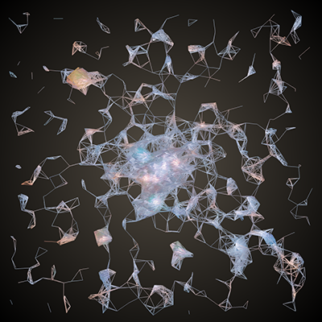

The chapter is broken into four sections:

1. [Basics: Working with ofMesh](#basicsworkingwithofmesh)
	- Points
	- Colors
	- Lines
	- Indices
2. [Generative Mesh: Using an image to drive the creation of an mesh](#generative)
	- Loading an image
	- Creating a mesh from the pixels
	- Using ofEasyCam to navigate the mesh
3. [Manipulations: Adding effects that modify the mesh](#manipulations)
	- Adding jitter
	- Making the vertices orbit
	- Creating an interactive magnifying effect
4. [Next Steps](#nextsteps)

**Note:** Since this chapter uses graphics commands, there is a _chance_ that your graphics card won't support some of the things we will be doing.  Make sure your graphics drivers are up-to-date.  If you are on a laptop that uses two graphics cards - one integrated and one dedicated - you will want to make sure that you are running your applications using the dedicated graphics card.

## Basics: Working with ofMesh

A mesh is a collection of **vertices** - [points in 3D space](https://en.wikipedia.org/wiki/Vertex_%28computer_graphics%29) - that can be connected up in different ways.  The shapes that are formed by connecting these vertices are called **primitives**.  The primitives are our smallest building blocks that we can put together to form a mesh.  We can create a couple different kinds of primitives:

- You can choose to not connect any of your vertices and just draw points as the primitives.
- You can choose to connect pairs of vertices and draw lines as the primitives.
- You can connect three or four (or more) vertices and draw triangles or quads  (or polygons) as the primitives.

To make this a little more concrete, check out the mesh below.  The vertices are orange dots.  The vertices are connected up in sets of three points to form triangle primitives which were then colored in gray.  For some deeper information, have a look at the _OpenGl_ chapter.

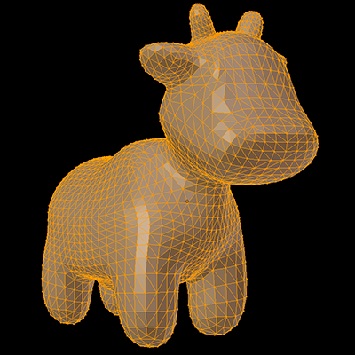

We are going to focus on using points and lines as our primitives.  Let's get something drawn on our screen.  When creating a mesh you should:

1. Define an [`ofMesh`](http://openframeworks.cc/documentation/3d/ofMesh/) variable.  Let's call it mesh.
2. Specify what primitive mode (points, lines, etc.) the mesh should use to connect its vertices using [`mesh.setMode(...)`](http://openframeworks.cc/documentation/3d/ofMesh/#show_setMode).  We'll be using points as our primitive, so that means we should use `OF_PRIMITIVE_POINTS` mode.
3. Add some vertices using [`mesh.addVertex(...)`](http://openframeworks.cc/documentation/3d/ofMesh/#show_addVertex).  A vertex is an [`ofVec3f`](http://openframeworks.cc/documentation/math/ofVec3f.html), so if you haven't used that class before, check out the example on the documentation page.
4. Draw your mesh using [`mesh.draw()`](http://openframeworks.cc/documentation/3d/ofMesh/#show_draw).

And onto the code!

Add a mesh variable to your header file (.h, e.g. ofApp.h):

```cpp
class ofApp : public ofBaseApp{

    public:
        ofMesh mesh;
    // ...
    // Keep the rest of the code that is already there.
```

Update `setup()` and `draw()` functions in your source file (.cpp) to look like this:

```cpp
void ofApp::setup() {
    mesh.setMode(OF_PRIMITIVE_POINTS);

    ofVec3f top(100.0, 50.0, 0.0);
    ofVec3f left(50.0, 150.0, 0.0);
    ofVec3f right(150.0, 150.0, 0.0);

    mesh.addVertex(top);
    mesh.addVertex(left);
    mesh.addVertex(right);
}
void ofApp::draw() {
    ofBackground(0);
    mesh.draw();
}
```

If you build and run your project, you should see three white dots that are placed in a triangular arrangement on top of a black background:

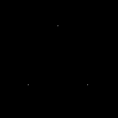

White is boring?  Well, you can add some color by modifying setup:

```cpp
void ofApp::setup() {
    mesh.setMode(OF_PRIMITIVE_POINTS);
    mesh.enableColors();

    ofVec3f top(100.0, 50.0, 0.0);
    ofVec3f left(50.0, 150.0, 0.0);
    ofVec3f right(150.0, 150.0, 0.0);

    mesh.addVertex(top);
    mesh.addColor(ofFloatColor(1.0, 0.0, 0.0)); // Red

    mesh.addVertex(left);
    mesh.addColor(ofFloatColor(0.0, 1.0, 0.0)); // Green

    mesh.addVertex(right);
    mesh.addColor(ofFloatColor(1.0, 1.0, 0.0)); // Blue
}
```

We first enable colors using [`mesh.enableColors()`](http://openframeworks.cc/documentation/3d/ofMesh/#show_enableColors).  Colors are enabled by default, but it is good practice to include this line.  Then we can add colors using [`mesh.addColor(...)`](http://openframeworks.cc/documentation/3d/ofMesh/#show_addColor).  Colors are specified using `ofFloatColor` which is like [`ofColor`](http://openframeworks.cc/documentation/types/ofColor.html) except that the red, blue, green and alpha channels are specified with a float between 0.0 and 1.0.  (You *can* use an ofColor if you want to do, because the mesh will automatically convert it to a ofFloatColor.)  The first color we add applies to the first vertex, the second color to the second vertex, etc.

You find our points boring?  Time for some lines then.  We need to change the primitive mode to lines, but there are three different line primitive options.  Try each of them for yourself by changing the first line of your setup function to any of these:

```cpp
    mesh.setMode(OF_PRIMITIVE_LINES);
    mesh.setMode(OF_PRIMITIVE_LINE_STRIP);
    mesh.setMode(OF_PRIMITIVE_LINE_LOOP);
```

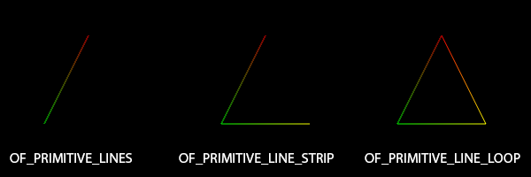

The modes for [`mesh.setMode(...)`](http://openframeworks.cc/documentation/3d/ofMesh/#show_setMode) each have a different way that they generate lines from the vertices:

* `OF_PRIMITIVE_LINE` creates an *independent* line out of each pair of vertices.  If you have a set of vertices - V<sub>1</sub>, V<sub>2</sub>, V<sub>3</sub>, V<sub>4</sub>, ... - then V<sub>1</sub> will connect to V<sub>2</sub> and V<sub>3</sub> will connect to V<sub>4</sub>, etc.
* `OF_PRIMITIVE_LINE_STRIP` will create a set of *connected* lines out of each pair of vertices.  V<sub>1</sub> will connect with V<sub>2</sub>,  V<sub>2</sub> will connect with V<sub>3</sub>, etc.
* `OF_PRIMITIVE_LINE_LOOP` does the same as `OF_PRIMITIVE_LINE_STRIP` but will also connect the last vertex to the first vertex.

Only `OF_PRIMITIVE_LINE_LOOP` outlined the whole triangle. If you wanted to create that same triangle using `OF_PRIMITIVE_LINE`, you might try adding some more vertices like this:

```cpp
    mesh.addVertex(top);
    mesh.addVertex(left);
    mesh.addVertex(left);
    mesh.addVertex(right);
    mesh.addVertex(right);
    mesh.addVertex(top);
```

Feels excessive to add duplicate vertices? Let's try something else:

```cpp
void ofApp::setup() {
    mesh.setMode(OF_PRIMITIVE_LINES);
    mesh.enableColors();
    mesh.enableIndices();

    ofVec3f top(100.0, 50.0, 0.0);
    ofVec3f left(50.0, 150.0, 0.0);
    ofVec3f right(150.0, 150.0, 0.0);

    mesh.addVertex(top);
    mesh.addColor(ofFloatColor(1.0, 0.0, 0.0));

    mesh.addVertex(left);
    mesh.addColor(ofFloatColor(0.0, 1.0, 0.0));

    mesh.addVertex(right);
    mesh.addColor(ofFloatColor(1.0, 1.0, 0.0));

    mesh.addIndex(0);
    mesh.addIndex(1);
    mesh.addIndex(1);
    mesh.addIndex(2);
    mesh.addIndex(2);
    mesh.addIndex(0);
}
```

Indices add a layer of abstraction.  Each vertex that you add to a mesh is tacked on to the end of a big old array.  That means that each vertex has a number that uniquely identifies its position (or index) in that array.  There's the zero-th vertex in the list, the first vertex in the list, the second, etc.  So, you can point to an existing vertex using its index number.

When you call [`mesh.enableIndices()`](http://openframeworks.cc/documentation/3d/ofMesh/#!show_enableIndices), openFrameworks creates an empty array of indices.  When you use [`addIndex(...)`](http://openframeworks.cc/documentation/3d/ofMesh/#show_addIndex), you are adding values to the end of this array.  When the mesh is about to be drawn to the screen, instead of looping through the array of vertices to create graphical primitives, openFrameworks will loop through your array of indices to determine how to create the primitives.

So when our mode is `OF_PRIMITIVE_LINE` and our array of indices is `{0, 1, 1, 2, 2, 0}`, then the 0th vertex and the 1st vertex are connected, the 1st vertex and the 2nd vertex are connected, and 2nd vertex and the 0th vertex are connected.  Lots of work in order to create a single triangle?  Yup.  But, the concept of indices is powerful and useful.

One more thing you might have noticed - the color of the lines.  This is some of the magic that is happening on your graphics card.  You can tell it that point A is red, point B is blue and that point A and B are connected with a line.  Then, the graphics card will (linearly) interpolate between those colors as it draws the pixels on the screen that constitute that line.

As a reward for reading the whole section:

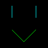

I know.  It's not a great reward.  But it does show off something you can do with `OF_PRIMITIVE_LINES` that you can't do with the two other line primitive modes - you can create separate lines.  We will take advantage of this in the next section.

```cpp
    mesh.setMode(OF_PRIMITIVE_LINES);
    mesh.enableColors();
    mesh.enableIndices();

    ofVec3f eyeLeftTop(50.0, 25.0, 0.0);
    ofVec3f eyeLeftBottom(50.0, 50.0, 0.0);
    ofVec3f eyeRightTop(100.0, 25.0, 0.0);
    ofVec3f eyeRightBottom(100.0, 50.0, 0.0);
    ofVec3f mouthLeft(50.0, 75.0, 0.0);
    ofVec3f mouthMiddle(75.0, 100.0, 0.0);
    ofVec3f mouthRight(100.0, 75.0, 0.0);

    mesh.addVertex(eyeLeftTop);
    mesh.addVertex(eyeLeftBottom);
    mesh.addIndex(0);
    mesh.addIndex(1);
    mesh.addColor(ofFloatColor(0.0, 1.0, 1.0));
    mesh.addColor(ofFloatColor(0.0, 1.0, 1.0));

    mesh.addVertex(eyeRightTop);
    mesh.addVertex(eyeRightBottom);
    mesh.addIndex(2);
    mesh.addIndex(3);
    mesh.addColor(ofFloatColor(0.0, 1.0, 1.0));
    mesh.addColor(ofFloatColor(0.0, 1.0, 1.0));

    mesh.addVertex(mouthLeft);
    mesh.addVertex(mouthMiddle);
    mesh.addVertex(mouthRight);
    mesh.addIndex(4);
    mesh.addIndex(5);
    mesh.addIndex(5);
    mesh.addIndex(6);
    mesh.addColor(ofFloatColor(0.0, 1.0, 0.0));
    mesh.addColor(ofFloatColor(0.0, 1.0, 0.0));
    mesh.addColor(ofFloatColor(0.0, 1.0, 0.0));
```


## Generative Mesh: Using an image to drive the creation of a mesh

Meshes! You now have the basic ingredients to start creating a "generative" mesh.  This is just a type of mesh that is created from a set of *rules* that are applied to some *data*.

So we need some data and some rules.  Let's grab some "data" in the form of an image from the Hubble Telescope:


Create a new openFrameworks project called HubbleMesh. Inside that project create the bin/data directory ('bin' may already exist) and save the above image there as "stars.png".  (Click [here](https://raw.githubusercontent.com/openframeworks/ofBook/master/chapters/generativemesh/images/stars.png), then right-click the image and "save as image.")

Now we have some colorful, pixely goodness, but what rules should we use to transform those pixels into a mesh?  We can start with drawing points and work our way up to drawing lines.  Our image has a ton of stars, so let's create some vertices where those stars are located.  Once we do that, we can connect up neighboring vertices with lines in order to create a web of sorts.

First things first, let's load that image.  Go into the main.cpp file and change the dimensions to match the dimensions of the image you just downloaded:

```cpp
    ofSetupOpenGL(800,800,OF_WINDOW);
```

Then go into your header file (ofApp.h) and add:

```cpp
    ofImage image;
```

And lastly, into your source file (ofApp.cpp):

```cpp
void ofApp::setup(){
    image.load("stars.png");
}

void ofApp::draw(){
    image.draw(0,0);
}
```

There is no dedicated `ofImage` chapter, but check out the Graphics section of the [openFrameworks learning](http://openframeworks.cc/learning/) page.

We just need to load our image using [`load(...)`](http://openframeworks.cc/documentation/graphics/ofImage/#show_load) and draw it at the top left corner of the screen with [`draw(0,0)`](http://openframeworks.cc/documentation/graphics/ofImage/#show_draw).

Great! Image loaded.  Now, we want to create a mesh with some vertices. If we only want to create vertices at the location of stars, we can do that by searching through our pixels and look for "bright" colors.  In order to do this, we will need to get access to the color information of the pixels using [`image.getColor(x, y)`](http://openframeworks.cc/documentation/graphics/ofImage/#show_getColor).  We want to loop through the pixels in the image and apply a [threshold](http://en.wikipedia.org/wiki/Thresholding_%28image_processing%29) such that we only create a vertex at the pixel locations where the intensity of the color is greater than some set value that we choose.

Add a mesh to ofApp.h:

```cpp
    ofMesh mesh;
```

And add this to ofApp.cpp:

```cpp
void ofApp::setup(){
    image.load("stars.png")

    mesh.setMode(OF_PRIMITIVE_POINTS);
    mesh.enableColors();

    float intensityThreshold = 150.0;
    int w = image.getWidth();
    int h = image.getHeight();
    for (int x=0; x<w; ++x) {
        for (int y=0; y<h; ++y) {
            ofColor c = image.getColor(x, y);
            float intensity = c.getLightness();
            if (intensity >= intensityThreshold) {
                ofVec3f pos(x, y, 0.0);
                mesh.addVertex(pos);
                // When addColor(...), the mesh will automatically convert
                // the ofColor to an ofFloatColor
                mesh.addColor(c);
            }
        }
    }
}
void ofApp::draw(){
    ofBackground(0,0,255);
    mesh.draw(); // Blue background, so it's easy to see the mesh
}
```

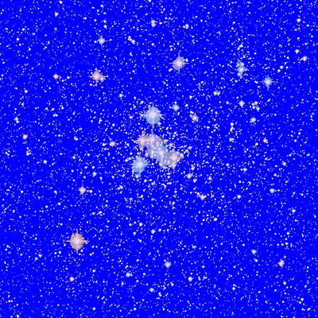

In that code, we created a mesh with points for primitives.  Then we looped through each pixel in the image (using [getWidth()](http://openframeworks.cc/documentation/graphics/ofImage/#show_getWidth) and [getHeight()](http://openframeworks.cc/documentation/graphics/ofImage/#show_getHeight)) and checked the intensity of each pixel's color using [getLightness()](http://openframeworks.cc/documentation/types/ofColor/#!show_getLightness).  If the intensity exceeded our threshold, we created a vertex at the location of the pixel and colored it with the pixel's color.  Finally, we drew our mesh on a blue background so that we could see which pixels from the image were used to generate vertices.  You can raise or lower the threshold value to decrease or increase (respectively) the number of vertices.

Let's make that background into something more fitting using [ofBackgroundGradient](http://openframeworks.cc/documentation/graphics/ofGraphics/#!show_ofBackgroundGradient)...

```cpp
void ofApp::draw(){
    ofColor centerColor = ofColor(85, 78, 68);
    ofColor edgeColor(0, 0, 0);
    ofBackgroundGradient(centerColor, edgeColor, OF_GRADIENT_CIRCULAR);
    mesh.draw();
}
```

Almost time for lines, lines, lines!

We have a lot of vertices in our mesh.  You can check the number using [getNumVertices()](http://openframeworks.cc/documentation/3d/ofMesh/#show_getNumVertices) if you like:

```cpp
// With a threshold of 150, there will be ~64,000 vertices
cout << mesh.getNumVertices() << endl;
```

If we were to start looping through those each of those 64,000 vertices to connect them up to the other vertices that are close-by, we could end up spending a fair chunk of time in that loop.  A fairly common thing to do to speed up the processing of an image is to shrink it:


```cpp
image.load("stars.png");
image.resize(200, 200);
```

And then because our image pixel are no longer one-to-one with our openFrameworks window pixels, we need to adjust the *pos* variable inside of our loop:

```cpp
if (intensity >= intensityThreshold) {
    // We shrunk our image by a factor of 4, so we need to multiply our pixel
    // locations by 4 in order to have our mesh cover the openFrameworks window
    ofVec3f pos(x*4, y*4, 0.0);
    mesh.addVertex(pos);
    mesh.addColor(c);
}
```

Now that we have a reasonable number of vertices (~2000), we can start connecting up vertices to form lines.  If we want to only connect vertices that are nearby to each other, then we need to loop through all possible pairs of vertices, check if the distance between them is less than a particular value, and if so, connect them.


```cpp
// Don't forget to change to lines mode!
mesh.setMode(OF_PRIMITIVE_LINES);

// We are going to be using indices this time
mesh.enableIndices();

// ...
// Omitting the code for creating vertices for clarity
// but don't erase it from your file!

// Let's add some lines!
float connectionDistance = 30;
int numVerts = mesh.getNumVertices();
for (int a=0; a<numVerts; ++a) {
    ofVec3f verta = mesh.getVertex(a);
    for (int b=a+1; b<numVerts; ++b) {
        ofVec3f vertb = mesh.getVertex(b);
        float distance = verta.distance(vertb);
        if (distance <= connectionDistance) {
            // In OF_PRIMITIVE_LINES, every pair of vertices or indices will be
            // connected to form a line
            mesh.addIndex(a);
            mesh.addIndex(b);
        }
    }
}
```

You should end up with something like this (if the code is taking too long to run on your machine, try increasing the *intensityThreshold* variable to reduce the number of vertices):

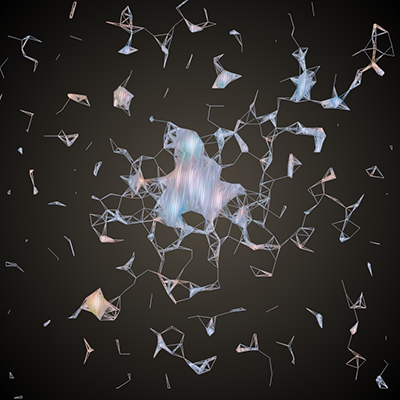

Let's take a look at that code again:

1. We need to get all unique pairs of vertices.  We can get the position of the *a*th vertex in our mesh using [`mesh.getVertex(...)`](http://openframeworks.cc/documentation/3d/ofMesh/#show_getVertex).  Then we can use two `for` loops to get every pair of vertices.  You might be wondering why the second loop starts `b=a+1`.  The order of the vertices does not matter when connecting them to form a line, so we can exclude a bunch of values for *b*.
2. Then, we need to find the distance between those vertices.  `ofVec3f` has a function to do just that: [`distance(...)`](http://openframeworks.cc/documentation/math/ofVec3f/#show_distance).
3. If the vertices are closer than a value set by *connectionDistance*, then we need to add a line between them.  Adding a line is just a matter of adding the indices *a* and *b* to the mesh's array of indices.

Boom! Generative mesh.  Let's add two more tweaks to make this into proper 3D.  Firstly, we can use the saturation of the color at a pixel to change the z-coordinate of its corresponding vertex.

```cpp
if (intensity >= intensityThreshold) {
    float saturation = c.getSaturation();
    float z = ofMap(saturation, 0, 255, -100, 100);
    ofVec3f pos(x*4, y*4, z);
    mesh.addVertex(pos);
    mesh.addColor(c);
}
```

This code will push brighter colors in the positive z-direction and whiter colors in the negative-z direction using [`ofMap(...)`](http://openframeworks.cc/documentation/math/ofMath/#!show_ofMap).  `ofMap` allows us to take a value that is within one range (for us, 0 to 255) and map it to a new range of values (again for us, -100 to 100).

Hm...that didn't change your mesh very much?  Well, now it's time for the last tweak in this section: adding a camera.

Add this to your header:

```cpp
		ofEasyCam easyCam;
```

And then modify your draw function:

```cpp
void ofApp::draw(){
    ofColor centerColor = ofColor(85, 78, 68);
    ofColor edgeColor(0, 0, 0);
    ofBackgroundGradient(centerColor, edgeColor, OF_GRADIENT_CIRCULAR);

    easyCam.begin();
        ofPushMatrix();
            ofTranslate(-ofGetWidth()/2, -ofGetHeight()/2);
            mesh.draw();
        ofPopMatrix();
    easyCam.end();
}
```

[`ofEasyCam`](http://openframeworks.cc/documentation/3d/ofEasyCam/) is a quick way to get a feel for that elusive 3rd dimension in your generative mesh.  The OpenGL chapter goes into cameras, [`ofPushMatrix()`](http://openframeworks.cc/documentation/graphics/ofGraphics/#!show_ofPushMatrix), [`ofPopMatrix()`](http://openframeworks.cc/documentation/graphics/ofGraphics/#!show_ofPopMatrix) and [`ofTranslate()`](http://openframeworks.cc/documentation/graphics/ofGraphics/#!show_ofTranslate).  This code will center your mesh in the camera's view.  Now you can left click and drag to rotate! And right click and drag to zoom!

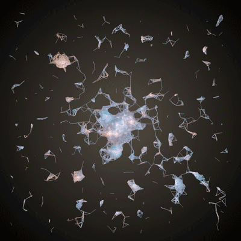


## Manipulations: Adding effects that modify the mesh

We've got ourselves a meshy mesh now, so let's go ahead and add some more rules to give our mesh some movement.

### Jitter

The mesh resembles something you might find under a microscope, so let's add some 'organic' movement to the vertices. The motion will likely be much faster on your machine than in the gif below (browsers cap the maximum framerate of gifs), but it will give you an idea of what we are going for:

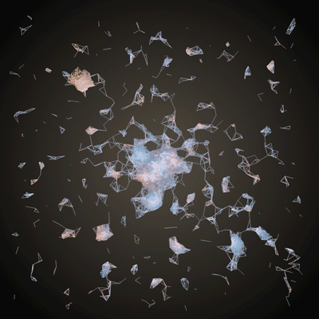

On each frame, we are going to move each vertex by a small, random amount.  Instead of using [`ofRandom(...)`](http://openframeworks.cc/documentation/math/ofMath/#show_ofRandom) to displace our vertices, we are going to use [`ofSignedNoise(...)`](http://openframeworks.cc/documentation/math/ofMath/#!show_ofSignedNoise) which generates a thing called [Perlin noise](https://en.wikipedia.org/wiki/Perlin_noise).  Check out Daniel Shiffman's description of Perlin noise in section [1.6 Perlin Noise (A Smoother Approach)](http://natureofcode.com/book/introduction/#i6-perlin-noise-a-smoother-approach) of his online book.  Perlin noise yields random values that smoothly vary over time.  You can get a good idea of the difference between random values and Perlin noise by checking out [figure 1.5](http://natureofcode.com/book/imgs/intro/intro_05.png) (which shows sequential values of noise) and [figure 1.6](http://natureofcode.com/book/imgs/intro/intro_06.png) (which shows sequential random values) from the book.

With `ofRandom(...)`, you specify a range of values, and it returns a random value within that range.  If you were to call it multiple times in a row, you will (very, very likely) get a new value every time you call it.  Perlin noise works a bit differently.  `ofSignedNoise(...)` will always return a value between -1.0 and 1.0, but you still have to pass in an input to the function.  Think of `ofSignedNoise(...)` as a squiggly line drawn on graph paper.  You pass in a coordinate, an x value, and it will return the corresponding y value.  If you were to call `ofSignedNoise(3.0)` multiple times, you would get the same value every time.

When using Perlin noise to generate motion, it is common to pass in the current time as the input (the x value).  So, in order to displace our vertices, we are going to pass in the time (using [`ofGetElapsedTimef()`](http://openframeworks.cc/documentation/utils/ofUtils/#!show_ofGetElapsedTimef])) to `ofSignedNoise`, so that it will give us values that change smoothly over time.  One caveat - we want our vertices to appear to move independently of one another.  If we pass in the same time to `ofSignedNoise` for every vertex on a frame, then every vertex will move in the same direction.  When we displace vertex one, we need to use a different time than when we displace vertex two (and vertex 3, vertex 4, etc.).

Let's jump into the code.  Add this to your header:

```cpp
		vector<ofVec3f> offsets;
```

And add the following two lines to your setup function:

```cpp
// Add this line to explicitly set the framerate to 60 frames per second:
ofSetFrameRate(60);

// Some lines of code omitted for clarity, you should still
// keep them in your local version

for (int x=0; x<w; ++x) {
    for (int y=0; y<h; ++y) {
        ofColor c = image.getColor(x, y);
        float intensity = c.getLightness();
        if (intensity >= intensityThreshold) {
            float saturation = c.getSaturation();
            float z = ofMap(saturation, 0, 255, -100, 100);
            ofVec3f pos(x*4, y*4, z);
            mesh.addVertex(pos);
            mesh.addColor(c);

            // And add this line to your existing for loop:
            // It will create a ofVec3f with 3 random values, which
            // will allow us to move the x, y and z coordinates of
            // each vertex independently
            offsets.push_back(ofVec3f(ofRandom(0,100000), ofRandom(0,100000), ofRandom(0,100000)));
        }
    }
}
```

And finally, add these lines to your update function:

```cpp
int numVerts = mesh.getNumVertices();
for (int i=0; i<numVerts; ++i) {
    ofVec3f vert = mesh.getVertex(i);

    float time = ofGetElapsedTimef();
    float timeScale = 5.0;
    float displacementScale = 0.75;
    ofVec3f timeOffsets = offsets[i];

    // A typical design pattern for using Perlin noise uses a couple parameters:
    // ofSignedNoise(time*timeScale+timeOffset)*displacementScale
    //     ofSignedNoise(time) gives us noise values that change smoothly over
    //         time
    //     ofSignedNoise(time*timeScale) allows us to control the smoothness of
    //         our noise (smaller timeScale, smoother values)
    //     ofSignedNoise(time+timeOffset) allows us to use the same Perlin noise
    //         function to control multiple things and have them look as if they
    //         are moving independently
    //     ofSignedNoise(time)*displacementScale allows us to change the bounds
    //         of the noise from [-1, 1] to whatever we want
    // Combine all of those parameters together, and you've got some nice
    // control over your noise

    vert.x += (ofSignedNoise(time*timeScale+timeOffsets.x)) * displacementScale;
    vert.y += (ofSignedNoise(time*timeScale+timeOffsets.y)) * displacementScale;
    vert.z += (ofSignedNoise(time*timeScale+timeOffsets.z)) * displacementScale;
    mesh.setVertex(i, vert);
}
```

In setup, we did two new things:

1. Specified that our program will be capped at 60 frames per second using [`ofSetFrameRate()`](http://openframeworks.cc/documentation/application/ofAppRunner/#!show_ofSetFrameRate).  We could get by without doing this, but it is a useful thing to do when you are making things move over time.
2. We created a variable called offsets.  It is `vector` of ofVec3fs that contain random values.  (See the _Introduction to Vectors_ chapter.)  These values allow us to move each vertex in a random x, y and z direction seemingly independently of the movement of the other vertices.

Then, in update:

1. We get the location of a vertex using [`mesh.getVertex(...)`](http://openframeworks.cc/documentation/3d/ofMesh/#!show_getVertex) and store it in a variable called `vert`.
3. We move the x, y and z values of `vert` using `ofSignedNoise(...)` with a set of a few parameters.
4. We update the position of our vertex using [`mesh.setVertex(...)`](/documentation/3d/ofMesh/#show_setVertex).

Great! Now we have a warbly mesh.

### Orbit

Next, we can add some swirling orbital motion.  These *were* originally stars after all, so it seems fitting.

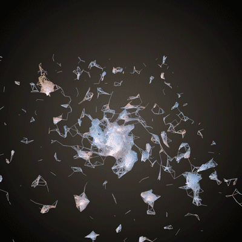

We're going to make use of trigonometric functions to make orbital motion.  If you want a good primer, check out [chapter 3](http://natureofcode.com/book/chapter-3-oscillation/) of The Nature of Code.

Let's forget about the z-dimension for now and focus in on the x- and y-dimensions.  If we want to take a point and have it orbit in a circle, we can make use of angles, sine and cosine to do that.  Check out the [wiki](http://en.wikipedia.org/wiki/Polar_coordinate_system) on polar coordinates - specifically, have a look at the section on "Converting between polar and Cartesian coordinates."

If we know how far our point is from the center, we can define its location in space using a distance and an angle (polar coordinates).  We can take that distance and angle and use it to convert to x and y values (Cartesian coordinates):

```cpp
x = distance * cos(angle)
y = distance * sin(angle)
```

If you want to swing that point around in a circle, then you just need to increase the angle over time, and the math will take care of the rest.

So for our meshy purposes, we need to:

1. Define a center point for our vertices to rotate around
2. Calculate the initial polar coordinates where are vertices are located
3. Slowly increase the angle of the polar coordinates for each vertex over time

Let's get some new variables in our header file:

```cpp
// We are going to use these to allow us to toggle orbiting on and off
ofMesh meshCopy;
bool orbiting;
float startOrbitTime;

// These variables will let us store the polar coordinates of each vertex
vector<float> distances;
vector<float> angles;
ofVec3f meshCentroid;
```

Add this at the end of your setup function:

```cpp
// We need to calculate our center point for the mesh
// ofMesh has a method called getCentroid() that will
// find the average location over all of our vertices
//    http://en.wikipedia.org/wiki/Centroid
meshCentroid = mesh.getCentroid();

// Now that we know our centroid, we need to know the polar coordinates
// (distance and angle) of each vertex relative to that center point.
// We've found the distance between points before, but what about the angle?
// This is where atan2 comes in.  atan2(y, x) takes an x and y value and returns
// the angle relative to the origin (0,0).  If we want the angle between two
// points (x1, y1) and (x2, y2) then we just need to use atan2(y2-y1, x2-x1).
for (int i=0; i<numVerts; ++i) {
    ofVec3f vert = mesh.getVertex(i);
    float distance = vert.distance(meshCentroid);
    float angle = atan2(vert.y-meshCentroid.y, vert.x-meshCentroid.x);
    distances.push_back(distance);
    angles.push_back(angle);
}

// These variables will allow us to toggle orbiting on and off
orbiting = false;
startOrbitTime = 0.0;
meshCopy = mesh; // Store a copy of the mesh, so that we can reload the original state
```

Add this into your update function:

```cpp
if (orbiting) {
    int numVerts = mesh.getNumVertices();
    for (int i=0; i<numVerts; ++i) {
        ofVec3f vert = mesh.getVertex(i);
        float distance = distances[i];
        float angle = angles[i];
        float elapsedTime = ofGetElapsedTimef() - startOrbitTime;

        // Lets adjust the speed of the orbits such that things that are closer to
        // the center rotate faster than things that are more distant
        float speed = ofMap(distance, 0, 200, 1, 0.25, true);

        // To find the angular rotation of our vertex, we use the current time and
        // the starting angular rotation
        float rotatedAngle = elapsedTime * speed + angle;

        // Remember that our distances are calculated relative to the centroid
        // of the mesh, so we need to shift everything back to screen
        // coordinates by adding the x and y of the centroid
        vert.x = distance * cos(rotatedAngle) + meshCentroid.x;
        vert.y = distance * sin(rotatedAngle) + meshCentroid.y;

        mesh.setVertex(i, vert);
    }
}
```

And then add a `keyPressed` function into your cpp file:

```cpp
void ofApp::keyPressed(int key){
	if (key == 'o') {
		orbiting = !orbiting; // This inverts the boolean
		startOrbitTime = ofGetElapsedTimef();
		mesh = meshCopy; // This restores the mesh to its original values
	}
}
```

Now you should be able to toggle orbiting on and off using the 'o' key!

One additional programming note: the variable *meshCopy* was used as a backup copy of the original mesh that could be reloaded when needed.  In the setup function, when we used the line:

```cpp
meshCopy = mesh;
```

We were creating a separate copy of the variable *mesh* and storing it in the variable *meshCopy*.  The ofMesh class provides what is called a deep copy in this instance, so if we change some vertices in *mesh* nothing in *meshCopy* will be changed.  Just be wary - not all objects provide deep copies by default!


### Magnifying

The last tweak we will add gives a bit of interactivity to the mesh.  We will add a magnifying glass effect:

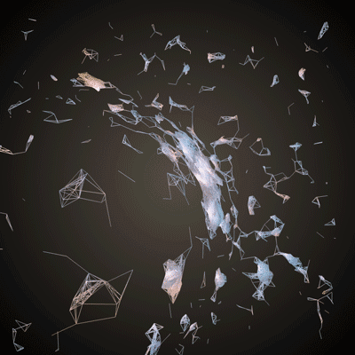

It's technically a misnomer to call it a magnifying glass effect. It is really based off of a thing in optics called [barrel distortion](http://en.wikipedia.org/wiki/Distortion_(optics)).  The effect looks like this when we apply it to a grid:

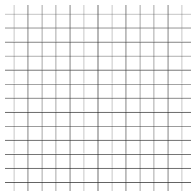

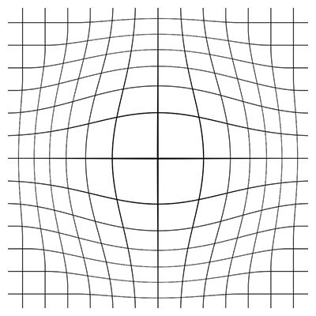

What we are going to do is:

1. Find where the mouse is on the screen.
2. Find the direction that points from the mouse to each vertex.
3. Push each vertex away from the mouse in that direction.
	- If a vertex is close to the mouse, push it a large distance.
	- If a vertex is far away from the mouse, push it a small distance.

This tweak will make use of some vector math, so check out the Math chapter if you are feeling lost.  On to the code!

Add a new variable to your header:

```cpp
		// Like with the orbiting tweak, this gives us a way to toggle on and off our magnifying effect
		bool mouseDisplacement;
```

Add a line at the end of our setup function:

```cpp
    // We want to start off without the effect turned on
    mouseDisplacement = false;
```

Add this chunk of code at that start of our update function:

```cpp
if (mouseDisplacement) {
    // Get the mouse location - it must be relative to the center of our screen
    // because of the ofTranslate() command in draw()
    ofVec3f mouse(mouseX, ofGetHeight()-mouseY, 0);

    // Loop through all the vertices in the mesh and move them away from the
    // mouse
    for (int i=0; i<mesh.getNumVertices(); ++i) {
        ofVec3f vertex = meshCopy.getVertex(i);
        float distanceToMouse = mouse.distance(vertex);

        // Scale the displacement based on the distance to the mouse
        // A small distance to mouse should yield a small displacement
        float displacement = ofMap(distanceToMouse, 0, 400, 300.0, 0, true);

        // Calculate the direction from the mouse to the current vertex
        ofVec3f direction = vertex - mouse;

        // Normalize the direction so that it has a length of one
        // This lets us easily change the length of the vector later
        direction.normalize();

        // Push the vertex in the direction away from the mouse and push it
        // a distance equal to the value of the variable displacement
        ofVec3f displacedVertex = vertex + displacement*direction;
        mesh.setVertex(i, displacedVertex);
    }
}
```

And lastly, add this chunk of code at that start of the `keyPressed` function:

```cpp
if (key == 'm') {
    mouseDisplacement = !mouseDisplacement; // Inverts the boolean
    mesh = meshCopy; // Restore the original mesh
}
```

You made it through the chapter! (Or you just scrolled all the way down, which is an awful lot of scrolling and should be an accomplishment by itself.)

## Next Steps

Check out the OpenGL chapter, and start playing around with the other primitive modes.

Go get some other data.  Make up some new rules.  Make something weird and share it in the openFrameworks forums!

For ideas of the types of things you can generate, check out these projects:

Golan Levin used portraits to create a series of lines in [Segmentation and Symptom](http://www.flong.com/projects/zoo/):

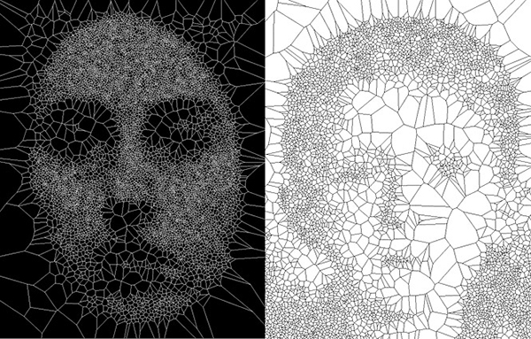

Quayola explored Flemish paintings in [Strata #4](http://www.quayola.com/strata4/)

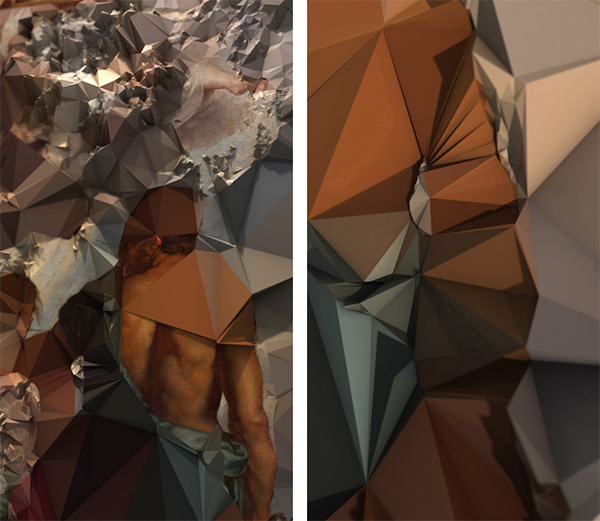

Marcin Ignac created some generative jellyfish creatures in [Cindermedusae](http://marcinignac.com/projects/cindermedusae/):


The Rockwell group used people's movement to change their meshes in [Hall of Fragments](http://lab.rockwellgroup.com/work/venice-biennale.html):

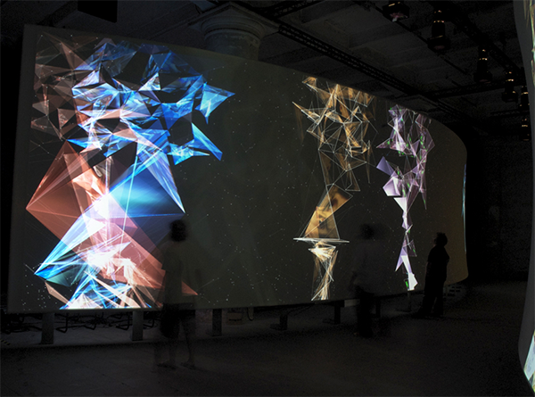

Onformative played with text in [Growing Data](http://www.onformative.com/work/growing-data/):

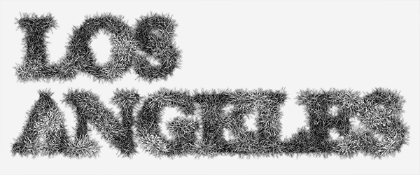
