# 이미지 처리와 컴퓨터 비전

[Golan Levin](http://www.flong.com/) 작성<br />
[Brannon Dorsey](http://brannondorsey.com) 편집

이 챕터에서는 오픈프레임웍스에서의 이미지 조작과 분석을 위한 몇가지 기본적인 테크닉을 소개합니다. 이 분야를 포괄적으로 다루는것은 불가능하므로, 여기서 다루는 주제들은 비디오에서 사람을 인식하기 위한 대표적인 방법인 배경제거의 예제를 통해 이미지가 어떻게 컴퓨터 메모리와 연관이 있는지로 한정합니다. 이 챕터는 컴퓨터 비전을 다루는 가이드는 아닙니다만, 혹시 더 상세한 정보를 원하신다면 Richard Szeliski의 [*Computer Vision: Algorithms and Applications*](http://szeliski.org/Book/)와 Gary Bradski의 [*Learning OpenCV*](http://cs.haifa.ac.il/~dkeren/ip/OReilly-LearningOpenCV.pdf)를 읽어보시길 추천해 드립니다.

우리는 "완전히 비닥부터 새롭게" 이 주제를 다룰것이라 배울것이 아주 많습니다, 따라서 시작하기전에 여러분이 하고싶은 무언가와 정확히 동일한 도구인지 아닌지 체크할 필요도 있습니다. 첫 챕터에서는, 영상처리 작업흐름을 잘 캡슐화해두어 인터랙티브 아트와 디자인분야에서 무료로 사용가능한 몇몇 도구들을 살펴보는걸로 시작해보고자 합니다.


## 어쩌면 이미 마법의 총알이 있을지도 모릅니다.

컴퓨터 비전은 여러분으로 하여금 이미지, 비디오, 카메라 피드에서 어떤일이 일어나는지에 관해서 단언할수 있게 합니다. 여러분만의 영상처리 소프트웨어를 만들기에 재밌습니다(그리고 상당히 교육적이기도 합니다)만, 그렇다고 해서 항상 *반드시* 이러한 테크닉들을 직접 구현할 필요는 없습니다. 대부분의 많은 컴퓨터 비전 작업흐름들은 어플리케이션에 잘 캡슐화되어있어서, 여러분이 원하는 작업들을 알아서 해주고, OSC를 통해 오픈프레임웍스 앱으로 그 결과를 전송받을수도 있거든요! 이 챕터에 들어가기 전, 아래에 언급하는 영상처리 도구들을 사용하여 프로토타입 프로그램을 만들수 있을지를 고려해보세요.

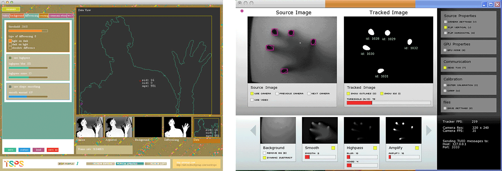

*TSPS(좌측) 과 Community Core Vision(우측)은 고급기능을 제공하는, 인터랙티브 인스톨레이션 분야에서 흔하게 쓰이는 컴퓨터 비전 도구입니다. 이 프로그램들은 그 분석결과를 OSC(미디어 아트분야에서 널리 사용되는 신호전송 프로토콜)로 전송합니다.

- [Toolkit for Sensing People in Spaces (TSPS)](http://opentsps.com/): A powerful toolkit for tracking bodies in video.
- [Community Core Vision](http://ccv.nuigroup.com/): Another full-featured toolkit for a wide range of tracking tasks.
- [FaceOSC](https://github.com/kylemcdonald/ofxFaceTracker/releases/): An app which tracks faces (and face parts, like eyes and noses) in video, and transmits this data over OSC.
- [Reactivision TUIO](http://reactivision.sourceforge.net/): A system which uses fiducial markers to track the positions and orientations of objects, and transmits this data over OSC.
- [EyeOSC](https://github.com/downloads/kylemcdonald/AppropriatingNewTechnologies/EyeOSC.zip) (.zip): An experimental, webcam-based eyetracker that transmits the viewer's fixation point over OSC.
- [Synapse for Kinect](http://synapsekinect.tumblr.com/post/6610177302/synapse): A Kinect-based skeleton tracker with OSC.
- [DesignIO kinectArmTracker](https://github.com/ofTheo/kinectArmTracker): A lightweight OSC app for tracking arm movements with the Kinect.
- [OCR-OSC](http://www.davidlubl.in/projects/#/ocr-osc/) A lightweight kit for performing optical character recognition (OCR) on video streams. 


This book's [chapter on Game Design](https://github.com/openframeworks/ofBook/blob/master/chapters/game_design/chapter.md) 서적에서는 이러한 도구들에 의해 만들어지는 OSC 메시지를 사용해 오픈프레임웍스 어플리케이션을 만드는 방법을 제공합니다. 당연하게도, 이러한 도구들이 여러분이 원하는 도구가 아니라면, 아래의 내용에 대해서 살펴봐야 할 것입니다...


## 이미지처리를 얘기하기 전에 알아두어야 할것들 

### 디지털 이미지 포착, 및 데이터 구조

이 챕터에서는 *래스터 이미지*를 다루는(그리고 래스터 이미지에서 특정 정보를 추출하는) 기법을 소개합니다. 비록 일반적인 용어로 **이미지**를 사용하지만, 이것은 종종 *비트맵 이미지* 혹은 *픽스맵 이미지*라고도 알려져 있는데, 각 사각 *픽셀* 그리드의 컬러값을 표현하는 숫자들의 배열(혹은 *버퍼*)입니다. 오픈프레임웍스에서, 버퍼는 앞으로 보게 되겠지만, 널리 사용되는 편리한 컨테이너 오브젝트입니다.

#### 이미지를 불러와 보여주기

이미지 처리의 시작은 당연히 *이미지*입니다. 편리하게도 오픈프레임웍스에서 이미지를 보여주는것은 아주 직관적입니다. 자 아주 조그만한, 낮은 해상도(12x16픽셀)인 링컨의 흑백 초상화로 시작해보죠:

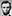 

아래의 이미지를 불러와 표시하는 아주 간단한 어플리케이션은, 예제의 *imageLoaderExample*와 아주 흡사합니다. 프로그램의 헤더파일인, *ofApp.h*에서, `ofImage`오브젝트의 인스턴스인 *myImage*를 선언합니다. 


```cpp
// Example 1: Load and display an image.
// This is ofApp.h

#pragma once
#include "ofMain.h"

class ofApp : public ofBaseApp{
	public:
		void setup();
		void draw();
		
		// Here in the header (.h) file, we declare an ofImage:
		ofImage myImage;
};

```

아래는 최종 *ofApp.cpp* 파일내용입니다. 링컨 이미지는 `setup()`함수에 의해 하드드라이브에서 (한번) *불러와집니다*. 그리고 나서 이것을 `draw()`함수에서 (1초에 여러번) *그려냅니다*. `loadImage()`함수의 파일경로에서 볼 수 있읏이, 이 프로그램은 실행파일과 같은 경로에 있는 "data" 디렉토리에서 *lincoln.png*를 취합니다:

```cpp
// Example 1: Load and display an image.
// This is ofApp.cpp

#include "ofApp.h"

void ofApp::setup(){
	// We load an image from our "data" folder into the ofImage:
	myImage.loadImage("lincoln.png");
	myImage.setImageType(OF_IMAGE_GRAYSCALE);
}

void ofApp::draw(){
	ofBackground(255);
	ofSetColor(255);

	// We fetch the ofImage's dimensions and display it 10x larger.  
	int imgWidth = myImage.width;
	int imgHeight = myImage.height;
	myImage.draw(10, 10, imgWidth * 10, imgHeight * 10);
}
```

위의 프로그램을 컴파일하고 실행하면 캔버스에 이 (쪼만한) 이미지를 10배 키워서, 좌측상단의 위치를 (10, 10)로 하여 그려냅니다.  이미지의 위치지정과 크기조절은 `myImage.draw()` 명령에 의해 수행됩니다. 이미지는 "흐리게" 보여지는데, 오픈프레임웍스는 확대된 이미지를 그려낼 때에 기본적으로 [linear interpolation](http://en.wikipedia.org/wiki/Linear_interpolation)를 사용하기 때문입니다.

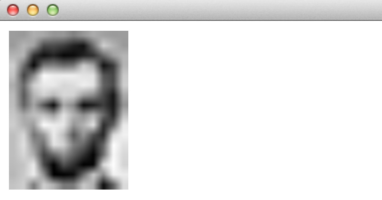

만약 오픈프레임웍스에서 이미지를 처음 다루는 분들이라면, 가능한 한 `draw()`나 `update()`함수에서 이미지를 불러오면 안된다라는 사실을 알고 계셔야 합니다. 왜냐구요? 디스크에서 데이터를 불러오는것은 가장 느린 작업이기 때문입니다. 대부분 필요한 모든 이미지는 프로그램이 초기화되는 `setup()`함수에서 단 한번만에 불러오면 됩니다. 이와 반대로, 만약 `draw()` 루프에서 같은 이미지를 1초에 60번 반복하여 불러오면, 어플리케이션의 성능이 떨어질 뿐만 아니라, 심지어 하드디스크의 손상을 가져올 수도 있습니다.

#### 이미지들은 어디서 오는거죠 ?

오픈프레임웍스에서, 래스터 이미지들은 다양한 소스에서 올 수 있습니다. 아래의 포맷들이 있죠 (하지만 이에 한정된다는 것은 아닙니다) :

- 하드디스크에서 `ofImage`로 불러져 압축해제되는 이미지 파일 (.JPEG, .PNG, .TIFF, 또는 .GIF 와 같이 일반적으로 사용되는 저장 포맷)
- 웹캠 또는 다른 비디오 카메라들에서 볼려진 실시간 이미지 스트림 (`ofVideoGrabber` 사용) 
- 디지털 비디오 파일에서 불려진 프레임의 시퀀스 (`ofVideoPlayer` 사용)
- `ofImage::grabScreen()을 사용하여 캡쳐된, 이미 화면에 출력된 것들을 취한 픽셀들의 버퍼
- `ofFBO`에서 얻은, 혹은 `ofPixels`나 `ofTexture`오브젝트에 저장된, 생성된 컴퓨터 그래픽 렌더링.
- a real-time video from a more specialized variety of camera, such as a 1394b Firewire camera (via `ofxLibdc`), a networked Ethernet camera (via `ofxIpCamera`), a Canon DSLR (using `ofxCanonEOS`), or with the help of a variety of other community-contributed addons like `ofxQTKitVideoGrabber`, `ofxRPiCameraVideoGrabber`, etc.
- (`ofxCanonEOS`을 통한) 캐논의 DSLR, (`ofxLibdc`를 통한)1394b 파이어와이어 카메라 및, 그 외 `ofxQTKitVideoGrabber`, `ofxRPiCameraVideoGrabber`와 같은 다양한 커뮤니티에서 제공하는 애드온을 사용하여, 좀 더 특별한 카메라들로부터 얻어올 수 있는 실시간 비디오
- *depth image*, 즉 픽셀 값들이 컬러정보가 아닌 *거리*정보를 갖는 훨씬 특별한 이미지. 뎁스 이미지는 특별한 카메라(`ofxKinect` 애드온을 사용하여 마이크로소프트의 키넥트장치를 사용할 수 있습니다)에서 캡쳐되거나, 또는 (예를들어 `ofFBO::getDepthTexture()`를 사용하여 GCI 씬들에서 추출할 수 있습니다.

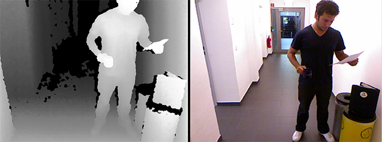 

*뎁스 이미지(좌측)과 이에 대응되는 RGB 컬러 이미지(우측) 마이크로소프트의 키넥트로 지속적으로 캡쳐된 이미지의 예제. 뎁스 이미지는 카메라에서부터의 거리가 픽셀의 밝기로 표현된다. (이 두 이미지들은, raw 상태로 표현되며, 아직 상호 "calibrate"되지 않았음 - 컬러와 뎁스의 각 이미지 픽셀들이 픽셀-대-픽셀에 대응되지 않는다는 의미)*

참고로, 오픈프레임웍스는 **인터넷에서 이미지를 바로** 쉽게 불러불러올수 있으며, 아래와 같이 파일명 인수에 URL을 넣어주면 됩니다.

```
myImage.loadImage("http://en.wikipedia.org/wiki/File:Example.jpg");
```

다만, 원격에-저장된 이미지를 물러올때는 *동기방식*으로 동작한다는 점을 명심하셔야 합니다, 다시말해 프로그램은 웹에서 모든 이미지를 다운받을 동안 "블락"(또는 멈춤) 상태가 된다는 것입니다. 유저 경험의 향상을 위해,`ofloadURLAsync()` 메소드를 사용하여 *비동기* 방식으로 이미지를 블러올 수도 있습니다. 이 내용은 오픈프레임웍스의 graphics 예제중 *imageLoaderWebExample*에서 보실수 있습니다. (또한 *threadedImageLoaderExample* 에서도 확인할 수 있습니다.) 예제에서는 API를 사용해 (예를들어 [Temboo](https://temboo.com/library/), [Instagram](http://instagram.com/developer/) or [Flickr](https://www.flickr.com/services/api/)또는 실시간 교통 트래픽 카메라들과 같은 온라인 자료들에서)*자동화된 방식으로* 이미지들을 불러올 수 있습니다/ 

#### 웹캠 이미지를 얻어와 화면에 그리기

실시간 웹캠 혹은 디지털 비디오파일에서 **비디오 스트림을 얻어오는** 절차는 `ofImage`를 불러오는것만큼이나 어렵지 않습니다. 가장 큰 차이점이라면 `ofVideoGrabber` 또는 `ofVideoPlayer`오브젝트에 포함된 이미지 데이터가 졔속해서 바뀐다는 점인데, 일반적으로 초당 30번(혹은 세팅 혹은 파일의 프레임률을 따름) 바뀝니다. 아래와 같이 `myVideoGrabber.draw()` 화면에 데이터를 그려내기 위해 매번 이 오브젝트에 요청을 하면, 새로 업데이트된 픽셀들이 포함된 데이터들을 얻을 수 있습니다.

아래의 프로그램(*videoGrabberExample*예제에서 찾을 수 있습니다)은 기본적인 절차를 보여줍니다. 아래의 예제에서는, 약간 재밌는 것들이 추가가 됐는데, 추가로 `ofVideoGrabber`의 픽셀이 담긴 데이터의 버퍼를 얻어온 뒤, 이것을 수학적으로 "반전" 시켜 ("네거티브 효과"를 만들기 위해), 그것을 `ofTexture`를 사용하여 화면에 그려냅니다.

헤더파일에서 컴퓨터에 기본적으로 내장된 웹캠에서 비디오 데이터를 얻어오기 위해 `ofVideoGrabber`를 선언했습니다. 또한 반전된 비디오 프레임을 저장하기 위한 `unsigned chars`의 버퍼와, 화면에 이 프레임을 그리기 위해 사용할 `ofTexture`를 선언했습니다:

```cpp
// Example 2. An application to capture, display,
// and invert live video from a webcam.
// This is ofApp.h

#pragma once
#include "ofMain.h"

class ofApp : public ofBaseApp{
	public:
	
		void setup();
		void update();
		void draw();

		ofVideoGrabber myVideoGrabber;
		ofTexture myTexture;

		unsigned char* invertedVideoData;
		int camWidth;
		int camHeight;
};

```

`unsigned char*`의 선언이 낯설죠? 이부분을 알아차리고 이해하는것이 매우 중요합니다, 사실상 이미지 데이터를 저장하거나 교환하는 가장 범용적인 방법이기 때문입니다. `unsigned` 키워드는 이미지의 컬러값을 특별하게 부호없는 숫자(즉 양수)로 표현하겠다는 의미입니다. `char`는 픽셀의 각 컬러 요소들을 하나의 8비트 숫자(바이트. 즉 0 - 255)로 표현하겠다는 것인데, 이는 수년간 문자(캐릭터,*char*acters)를 저장하는데에 사용되었던 데이터형 이기도 합니다. 그리고 별표(`*`)는 이 변수로 이름지어진 데이터가 하나의 unsigned char를 담는것이 아니라, unsigned char의 *배열*을 담는다는 것입니다(더 정확히 설명하자면, unsigned char 배열로 이루어진 버퍼를 가리키는 *포인터* 입니다). 이러한 데이터형에 관한 보다 자세한 정보는  *C++의 메모리* 챕터를 읽어보시길 바랍니다.

아래의 두번째 예제는 완성된 웹캠에서 이미지를 얻어오는 코드의 .cpp 파일입니다. 예상한대로. `ofVideoGrabber`오브젝트는 이 예제에서 다루지 않은 더 많은 세팅과 메소드를 제공합니다. 가령 이미지 캡쳐장치의 리스트를 제공하고, 선택을 할수 있게 한다거나; 캡쳐받을 해상도와 프레임률을 세팅하거나; (하드웨어와 드라이버에 따라 다르겠지만) 카메라의 밝기와 명암등을 조절하는 등의 기능을 제공합니다.

예제에서 무거운 계산처리는 `update()`메소드로, 그래픽을 그려내는 부분은 `draw()`로 분리되었음을 눈여겨 보시기 바랍니다. 이는 추천되는 코드의 구조입니다.


```cpp
// Example 2. An application to capture, invert,
// and display live video from a webcam.
// This is ofApp.cpp

#include "ofApp.h"

void ofApp::setup(){

	// Set capture dimensions of 320x240, a common video size.
	camWidth = 320;
	camHeight = 240;

	// Open an ofVideoGrabber for the default camera
	myVideoGrabber.initGrabber (camWidth,camHeight);

	// Create resources to store and display another copy of the data
	invertedVideoData = new unsigned char [camWidth * camHeight * 3];
	myTexture.allocate (camWidth,camHeight, GL_RGB);
}

void ofApp::update(){

	// Ask the grabber to refresh its data.
	myVideoGrabber.update();

	// If the grabber indeed has fresh data,
	if(myVideoGrabber.isFrameNew()){

		// Obtain a pointer to the grabber's image data.
		unsigned char* pixelData = myVideoGrabber.getPixels();
		
		// Reckon the total number of bytes to examine. 
		// This is the image's width times its height,
		// times 3 -- because each pixel requires 3 bytes
		// to store its R, G, and B color components.  
		int nTotalBytes = camWidth * camHeight * 3;
		
		// For every byte of the RGB image data,
		for(int i=0; i<nTotalBytes; i++){

			// pixelData[i] is the i'th byte of the image;
			// subtract it from 255, to make a "photo negative"
			invertedVideoData[i] = 255 - pixelData[i];
		}

		// Now stash the inverted data in an ofTexture
		myTexture.loadData (invertedVideoData, camWidth,camHeight, GL_RGB);
	}
}

void ofApp::draw(){
	ofBackground(100,100,100);
	ofSetColor(255,255,255);

	// Draw the grabber, and next to it, the "negative" ofTexture.
	myVideoGrabber.draw(10,10);
	myTexture.draw(340, 10);
}
```

이 어플리케이션은 연속해서 카메라의 피드를 화면에 그려내면서, 동시에 실시간으로 "필터링된"(반전효과) 버전도 함께 그려냅니다. 아래의 이미지가 제 노트북의 웹캠을 사용한 결과입니다.

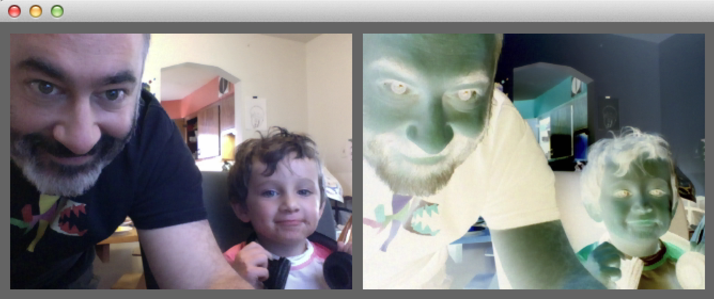

디스크에 저장된 퀵타임 무비 혹은 다른 디지털 비디오파일에서 프레임을 얻어오는 방법은 거의 동일합니다. 오픈프레임웍스에 내장된 *videoPlayerExample*예제의 구현이나 `ofVideoGrabber` 클래스의 [도큐멘트](http://openframeworks.cc/documentation/video/ofVideoGrabber.html)에서 자세한 사항을 살펴보시기 바랍니다.

인터랙티브 컴퓨터 비전 개발자들 사이에서 찾아볼수 있는 공통된 패턴은, 미리 저장된 "샘플" 비디오와 실시간 카메라에서 얻어온 비디오 사이에서 전환이 쉽다는 점입니다. 그리하여, 호텔방에서 처리 알고리즘을 테스트하고 다듬은 뒤, 설치 현장에서 "실제" 카메라 입력으로 전환할 수 있는 것이지요. 이러한 패턴의 "효과"를 보여주는 예제가 오픈프레임웍스의 애드온 예제 디렉토리에 있는 *opencvExample*인데, 이러한 "스위치" 기능이 `#define`[전처리기 지시자](http://www.cplusplus.com/doc/tutorial/preprocessor/)를 사용하여 내장되어 있습니다:

```cpp
    //...
	#ifdef _USE_LIVE_VIDEO
        myVideoGrabber.initGrabber(320,240);
	#else
        myVideoPlayer.loadMovie("pedestrians.mov");
        myVideoPlayer.play();
	#endif
	//...
```

*opencvExample* 예제의 .h파일 에서, `//#define _USE_LIVE_VIDEO` 부분을 주석해제하면, 컴파일러로 하여금 미리 저장된 샘플비디오 대신 웹캠을 사용하도록 해줍니다.

#### 메모리 내의 픽셀

이미지 처리와 컴퓨터 비전에 관해 공부하기 위해, 우리는 이미지를 불러오고 그려내는 것 이상의 것들이 더 필요합니다; *이것의 픽셀들이 숫자로 표현된 데이터에 접근, 조작, 분석* 하는 것입니다. 따라서 픽셀들이 어떻게 컴퓨터의 메모리에 저장되는지 살펴볼 필요가 있습니다. 아래는 에이브라함 링컨의 초상화가 저장된, 흑백이미지 버퍼를 간략하게 도식화한 것입니다. 각 픽셀의 밝기는-0(검정)에서 255(흰색)의 범위를 가지는 하나의 8-비트 숫자로 표현됩니다:

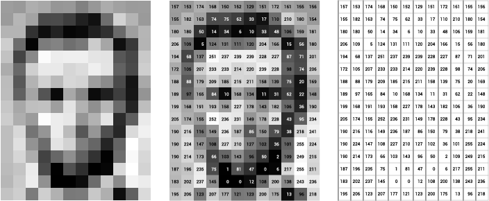


실제로, 픽셀의 값은 하드웨어 레벨의 관점에서, *1차원 배열*로 거의 동일한 방법으로 저장됩니다. 예를들어, 위의 이미지에서 얻어지는 데이터는, 아래의 긴 unsigned char의 리스트와 비슷한 방법으로 저장됩니다:

```cpp
{157, 153, 174, 168, 150, 152, 129, 151, 172, 161, 155, 156,
 155, 182, 163,  74,  75,  62,  33,  17, 110, 210, 180, 154,
 180, 180,  50,  14,  34,   6,  10,  33,  48, 106, 159, 181,
 206, 109,   5, 124, 131, 111, 120, 204, 166,  15,  56, 180,
 194,  68, 137, 251, 237, 239, 239, 228, 227,  87,  71, 201,
 172, 105, 207, 233, 233, 214, 220, 239, 228,  98,  74, 206,
 188,  88, 179, 209, 185, 215, 211, 158, 139,  75,  20, 169,
 189,  97, 165,  84,  10, 168, 134,  11,  31,  62,  22, 148,
 199, 168, 191, 193, 158, 227, 178, 143, 182, 106,  36, 190,
 205, 174, 155, 252, 236, 231, 149, 178, 228,  43,  95, 234,
 190, 216, 116, 149, 236, 187,  86, 150,  79,  38, 218, 241,
 190, 224, 147, 108, 227, 210, 127, 102,  36, 101, 255, 224,
 190, 214, 173,  66, 103, 143,  96,  50,   2, 109, 249, 215,
 187, 196, 235,  75,   1,  81,  47,   0,   6, 217, 255, 211,
 183, 202, 237, 145,   0,   0,  12, 108, 200, 138, 243, 236,
 195, 206, 123, 207, 177, 121, 123, 200, 175,  13,  96, 218};
```

이러한 이미지 데이터를 저장법을 볼때 대충 예상하실 수 있으실지도 모르겠습니다. 데이터가 사실상 2차원 배열처럼 *보이기* 때문이지요. 아직 컴퓨터 메모리는 단순한 한방향으로만 증가하는 주소 공간의 리스트일 뿐이지만요.

자 여기서 이 데이터는 아직 이미지의 가로와 세로크기에 관한 디테일이 없다는 점에 주목하시기 바랍니다. 이 값들의 리스트가 흑백 이미지이면서 가로세로 크기가 12x16로 해석되어야 할까요? 8x24? 아니면 3x64? 아니면 컬러 이미지로 해석될수도 있지 않을까요? 흠 일종의 '메타-데이터'가 어딘가에 있을텐데요 - 일반적으로 `ofImage`와 같은 컨테이너 오브젝트가 바로 그렇습니다.

#### 그레이스케일 픽셀들과 배열 인덱스

컴퓨터 메모리에 픽셀데이터가 어떻게 저장되는지 이해하는것은 매우 중요합니다. 각 픽셀은 정수(0부터 시작합니다)로 이루어진 *주소*를 갖습니다.

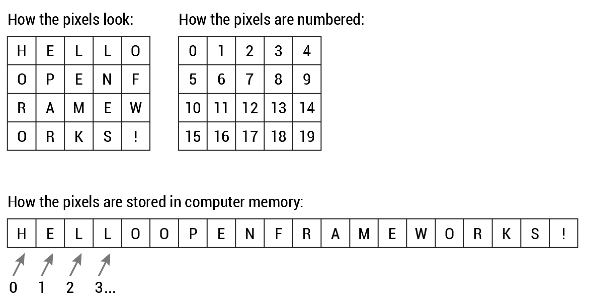

Observe how a one-dimensional list of values in memory can be arranged into successive rows of a two-dimensional grid of pixels, and vice versa.

자 어떻게 메모리 내의 1차원의 값 리스트가 픽셀의 2차원 그리드로, 혹은 그 반대로 변환되는지 살펴봅시다.

사실 `unsigned char*` 버퍼에 저장되어있는 이미지에서 *(x,y)* 좌표로 배열의 인덱스를 계산해야 하는 일은 자주 발생합니다. 메모리에서 아래의 패턴을 적용하면 됩니다:


```cpp
// Given:
// unsigned char *buffer, an array storing a one-channel image
// int x, the horizontal coordinate (column) of your query pixel
// int y, the vertical coordinate (row) of your query pixel
// int imgWidth, the width of your image

int arrayIndex = y*imgWidth + x;

// Now you can GET values at location (x,y), e.g.:
unsigned char pixelValueAtXY = buffer[arrayIndex];

// And you can also SET values at that location, e.g.:
buffer[arrayIndex] = pixelValueAtXY;
```

마찬가지로, 주어진 배열 인덱스에 대응하는 픽셀의 x, y위치를 얻어올 수도 있습니다:

```cpp
// Given:
// A one-channel (e.g. grayscale) image
// int arrayIndex, an index in that image's array of pixels
// int imgWidth, the width of the image

int y = arrayIndex / imgWidth; // NOTE, this is integer division!
int x = arrayIndex % imgWidth; // The friendly modulus operator.
```

<!-- #### Low-Level vs. High-Level Pixel Access Methods -->
#### 로우레벨 vs. 하이레벨 픽셀 접근 메소드들

대부분, 여러분은 `ofImage`와 같은 고급-레벨 컨테이너 오브젝트내에 저장되어있는 이미지를 가지고 작업하게 될 것입니다. 하지만 "로우-레벨" 메소드를 사용할때는, `.getPixles()`를 사용하여 ungiend char 픽셀데이터가, 담긴 배열을 가리키는 포인터를 요청하여 얻어올 수 있습니다. 이 부분에서 위에 언급했던 패턴을 사용해 배열-인덱스를 계산하게 됩니다.(참고로, `ofVideoGrabber`와 같은 대부분의 다른 오픈프레임웍스 이미지 컨테이너 역시 `.getPixels()`와 같은 메소드를 제공합니다.)

```cpp
int arrayIndex = (y * imgWidth) + x;
unsigned char* myImagePixelBuffer = myImage.getPixels();
unsigned char pixelValueAtXY = myImagePixelBuffer[arrayIndex];
```

고급-레벨의 두번째 메소드는 주어진 픽셀 위치에 저장된 *color*값을 리턴해줍니다:

```cpp
ofColor colorAtXY = myImage.getColor(x, y);
float brightnessOfColorAtXY = colorAtXY.getBrightness();
```

#### 이미지에서 가장 밝은 픽셀 찾기

우리가 살펴본 방법들을 알면, 이미지에서 가장 밝은 픽셀의 위치를 찾아내는 간단한 프로그램을 작성할 수 있습니다. 이 간단한 컨셉은 콜렉티브 아티스트인, 그래피티 리서치랩(Graffiti Research Lab(GRL))이 오픈프레임웍스를 사용하여 2007년에 작업한 [*L.A.S.E.R Tag*](http://www.graffitiresearchlab.com/blog/projects/laser-tag/) 프로젝트에서 사용되었습니다. *L.A.S.E.R Tag*의 컨셉은 레이저포인터를 사용하여, 사람들로 하여금 거대한 빌딩의 벽면에 그래피티를 그릴수 있게 하는 것입니다. 아래의 코드와 비슷한 방식으로 레이저포인터가 가리키는 밝은 위치를 트래킹하는데, 이러한 방식이 창의적인 인터랙티브 프로젝션 그래픽에 사용되었습니다.

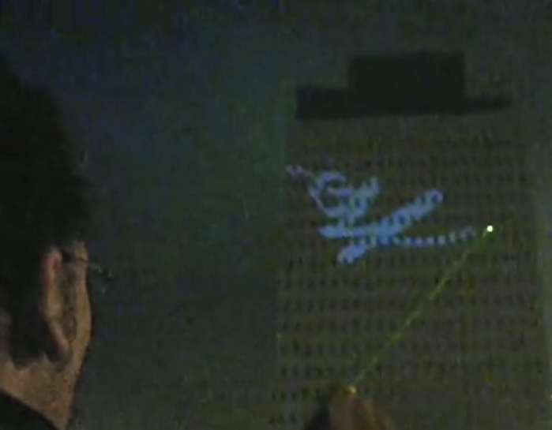

The .h file for our app loads an ofImage (`laserTagImage`) of someone pointing a laser at the building. (In the real application, a live camera was used.)

.h 파일에서는 빌딩에서 누군가가 레이저를 가리키고 있는 `laserTagImage` ofImage를 어플리케이션에 불러옵니다. (실제 어플리케이션에서는, 실시간 카메라가 사용됩니다.)

```cpp
// Example 3. Finding the Brightest Pixel in an Image
// This is ofApp.h

#pragma once
#include "ofMain.h"

class ofApp : public ofBaseApp{
	public:
		void setup();
		void draw();
		
		// Replace this ofImage with live video, eventually
		ofImage laserTagImage;
};
```

아래가 .cpp의 내용입니다:

```cpp
// Example 3. Finding the Brightest Pixel in an Image
// This is ofApp.cpp

#include "ofApp.h"

//---------------------
void ofApp::setup(){
	laserTagImage.loadImage("images/laser_tag.jpg");
}

//---------------------
void ofApp::draw(){
	ofBackground(255);

	int w = laserTagImage.getWidth();
	int h = laserTagImage.getHeight();

	float maxBrightness = 0; // these are used in the search
	int maxBrightnessX = 0; // for the brightest location
	int maxBrightnessY = 0;

	// Search through every pixel. If it is brighter than any
	// we've seen before, store its brightness and coordinates.
	// After testing every pixel, we'll know which is brightest!
	for(int y=0; y<h; y++) {
		for(int x=0; x<w; x++) {
			ofColor colorAtXY = laserTagImage.getColor(x, y);
			float brightnessOfColorAtXY = colorAtXY.getBrightness();
			if(brightnessOfColorAtXY > maxBrightness){
				maxBrightness = brightnessOfColorAtXY;
				maxBrightnessX = x;
				maxBrightnessY = y;
			}
		}
	}

	// Draw the image.
	ofSetColor (255);
	laserTagImage.draw(0,0);

	// Draw a circle at the brightest location.
	ofNoFill();
	ofDrawEllipse (maxBrightnessX, maxBrightnessY, 40,40);
}
```

우리의 이 작은 어플리케이션은 레이저가 가리키는 밝은 부분을 찾아내고 (다행히도 현장에서 가장 밝은 부분이었습니다), 그 주위에 원들을 그렸습니다. *L.A.S.E.R Tag*를 재현하기 위해, 이 위치들을 별도로 기록해두고, 그것을 프로젝션에 적합한, 컬러 잔상으로 그려내었습니다. 당연히, 이제부터는 어디가 가장 밝은(혹은 가장 어두운) 지점인지를 알수 있으므로, 태양 추적, 거북이 추적 등과 같은 다른 다양한 어플리케이션들을 개발할 수 있을것입니다...

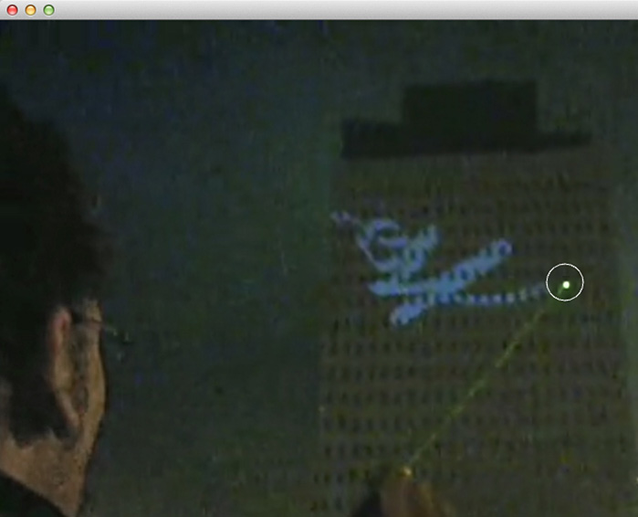

이미지에서 가장 밝은 부분들을 찾아내는 방법은 다른 방식으로도 사용할 수 있을것입니다. 가령 예를 들어 (키넥트 센서에 의해 만들어진) *depth image*를 사용한다면, 가장 밝은 픽셀은 *foremost point*, 즉 센서에서 가장 가까운 부분을 의미하게 됩니다. 이는 사용자의 손을 트래킹하는 인터랙티브 설치작업을 만드는데 아주 유용합니다.

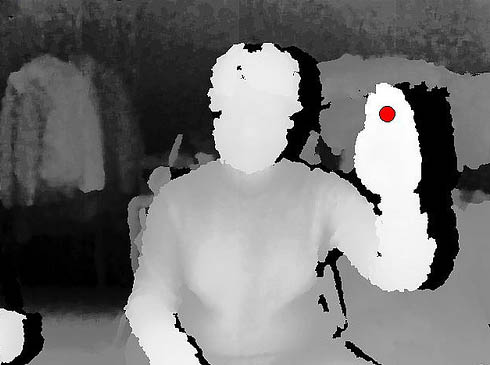

*depth image에서 가장 밝은 부분은 센서에서 가장 가까운 부분입니다. 여기에서 보여지는 설정에서는, "가장 가까운 부분"은 사용자의 손입니다.*

당연히 *하나 이상의* 밝은 부분을 트래킹하려면, 좀 더 복잡한 처리가 필요할 것입니다. 만약 여러분이 이러한 트래킹 환경을 디자인하고 제어하기 위해선, 씬에서 가장 빨간, 가장 녹색인, 가장 파란색인 세 오브젝트를 추적하는 효과적이면서도 간편한 방법이 있을것입니다. Zachary Lieberman은 이와 비슷한 방법을 사용하여, 타이포그래퍼인 Pierre & Damienet al과 함께 [*IQ Font*](https://vimeo.com/5233789)프로젝트를 진행했습니다. 이 프로젝트에서는, 특별한 마크가 달린 스포츠카의 움직임을 트래킹하여 글자를 만들어냅니다.

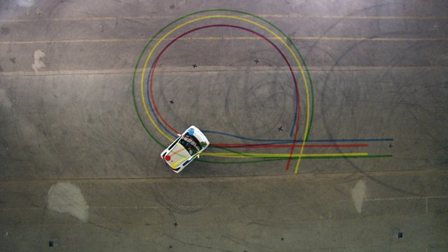

보다 더 일반적으로, 하나의 *구체적인* 컬러가 위치한 지점을 추적하는 시스템을 만들수도 있습니다. 이를 구현하는 가장 쉬운 방법은 ("RGB 공간" 에서) 타깃 컬러와 가장 짧은 유클리드 거리(Euclidean distance)를 갖는 컬러 픽셀을  찾는것입니다. 아래에서 보여지는 코드의 내용이 바로 그것입니다:

```cpp
// Code fragment for tracking a spot with a certain target color. 
// Our target color is CSS LightPink: #FFB6C1 or (255, 182, 193)
float rTarget = 255; 
float gTarget = 182;
float bTarget = 193; 

// these are used in the search for the location of the pixel 
// whose color is the closest to our target color.
float leastDistanceSoFar = 255; 
int xOfPixelWithClosestColor = 0; 
int yOfPixelWithClosestColor = 0;

for (int y=0; y<h; y++) {
	for (int x=0; x<w; x++) {
	
		// Extract the color components of the pixel at (x,y)
		// from myVideoGrabber (or some other image source)
		ofColor colorAtXY = myVideoGrabber.getColor(x, y);
		float rAtXY = colorAtXY.r; 
		float gAtXY = colorAtXY.g; 
		float bAtXY = colorAtXY.b;
		
		// Compute the difference between those (r,g,b) values 
		// and the (r,g,b) values of our target color
		float rDif = rAtXY - rTarget; // difference in reds 
		float gDif = gAtXY - gTarget; // difference in greens 
		float bDif = bAtXY - bTarget; // difference in blues 
		
		// The Pythagorean theorem gives us the Euclidean distance.
		float colorDistance = 
			sqrt (rDif*rDif + gDif*gDif + bDif*bDif); 
			
		if(colorDistance < leastDistanceSoFar){
			leastDistanceSoFar = colorDistance;
			xOfPixelWithClosestColor = x;
			yOfPixelWithClosestColor = y;
		}
	}
}

// At this point, we now know the location of the pixel 
// whose color is closest to our target color: 
// (xOfPixelWithClosestColor, yOfPixelWithClosestColor)

```

이러한 방식은 종종 사용자가 대상 컬러를 클릭하는 방식인 "컬러피커(스포이드)" 인터랙션에 사용되기도 합니다. 
*Delta-E* [calculation](http://colormine.org/delta-e-calculator/)는 빛의 여러 베리에이션 중 인간의 색상 인지에 적합하게 설계된  CIE76 컬러공산 상에서 "[color distance](http://en.wikipedia.org/wiki/Color_difference)"를 계산하는 것과 같이 보다 복잡한 방법을 사용하는 여러 사례들도 있습니다. 

#### 세가지-채널 (RGB) 이미지

우리의 링컨 초상화 이미지는 8-비트, 즉 1채널인 "[grayscale](http://en.wikipedia.org/wiki/Grayscale)" 이미지 입니다. 각 픽셀은 하나의 휘도를 표현하는, 하나의 숫자(기술적으로는, unsigned char)를 사용합니다. 하지만 다른 데이터 포맷 역시 가능합니다.

예를 들어, 일반적으로 컬러 이미지를 표현하기 위해 8-비트, *3-채널*을 사용합니다. 이 경우, 각 픽셀은 3 바이트로 묶이게 되는데. 각 1 바이트는 빨강, 녹색, 파란색의 정도를 표현하게 됩니다. 보시다시피, RGB 컬러 이미지는 3배의 정보를 포함하게 됩니다.

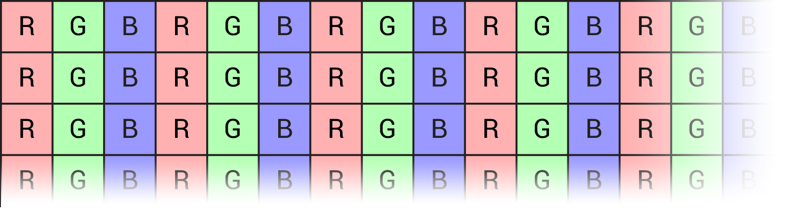

여러분의 LCD 모니터를 한번 가까이 들여다보시면, 이렇게 저장된 데이터들이 어떻게 디스플레이 장치의 형광체 레이아웃에 직접적으로 적용되는지를 볼 수 있을것입니다:

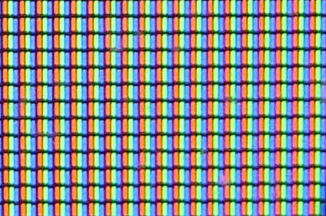

컬러 데이터는 교차로 배치(interleaved)되므로, RGB데이터가 담긴 버퍼의 픽셀값에 접근하는것은 살짝 복잡합니다. 아래의 코드는 주어진 *(x,y)*좌표의 RGB 픽셀에서 red, green, blue 각 요소 값들을 얻어오는 방법을 보여줍니다:

```cpp
// Code fragment for accessing the colors located at a given (x,y) 
// location in an RGB color image. 

// Given:
// unsigned char *buffer, an array storing an RGB image
// (assuming interleaved data in RGB order!)
// int x, the horizontal coordinate (column) of your query pixel
// int y, the vertical coordinate (row) of your query pixel
// int imgWidth, the width of the image

int rArrayIndex = (y*imgWidth*3) + (x*3);
int gArrayIndex = (y*imgWidth*3) + (x*3) + 1;
int bArrayIndex = (y*imgWidth*3) + (x*3) + 2;

// Now you can get and set values at location (x,y), e.g.:
unsigned char redValueAtXY   = buffer[rArrayIndex];
unsigned char greenValueAtXY = buffer[gArrayIndex];
unsigned char blueValueAtXY  = buffer[bArrayIndex];
```

이 내용은 사실, 앞의 흑백 이미지에서 픽셀값을 얻어오는 방법인 `index = y*width = x` 패턴의 3-채널 "RGB 버전" 입니다.

하지만 BGR과 같이 RGB 바이트가 다른 순서로 배치되는 외부 라이브러리나 이미지 하드웨어를 사용하는 상황이 발생할수도 있다는 점도 알아두시기 바랍니다.

#### 다양한 이미지 포맷들

8-비트 1-채널 (그레이스케일) 그리고 8-비트 3-채널 (RGB) 이미지는 가장 흔히 사용되는 포맷입니다. 하지만 이미지 처리 알고리즘의 넓은 세계에서는 아래 언급되는 포맷들처럼 다른 다양한 이미지 타입들이 있습니다:
- 8-비트 *palettized* 이미지 포맷은 각 픽셀에 최대 256 종류의 컬러들이 저장되어있는 배열의 인덱스를 담고 있습니다;
- 16-비트 (unsigned short)이미지는, 각 컬러 채널들이 *2* 바이트를 사용하며, 0-66535의 범위를 갖습니다;
- 32-비트 (float)이미지는, 각 컬러채널의 데이터가 부동소수점으로 표현됩니다.

좀더 실용적인 예시를 위해, 0-1000의 범위값으로 뎁스정보를 알려주는 XBox 360용 마이크로소프트의 키넥트 센서를 한번 더 생각해봅시다. 0-1000범위는 보통 이미지에서 사용되는 8-비트(0-255)의 범위를 벗어납니다만; 사실, 이 범위는 대략 11비트의 해상도를 갖게 됩니다. 이를 수용하기 위해 `ofxKinect`애드온은 이 정보를 16-비트 이미지 포맷을 사용하여 정보손실 없이 저장합니다. 이와 마찬가지로, 32-비트 부동소수점 포맷은 거의 대부분의 고-화질의 비디오포맷 처리에서 필수적으로 사용됩니다.

이밖에도 다양한 방식이 있습니다:

* 2-채널 이미지 : 휘도 + 투명 에서 일반적으로 사용됨
* 3-채널 이미지 : 일반적으로 RGB 데이터에서 사용되지만, 종종 HSB, YUV와 같은 다른 컬러공간을 사용하는 이미지 저장을 위해 사용됨
* 4-채널 이미지 : RGBA 이미지에서 사용되지만, CMYK에서도 종종 사용됨
* [*Bayer images*](https://en.wikipedia.org/wiki/Bayer_filter) : RGB 컬러이지만 교차로 저장되는 R-G-B-R-G-B-R-G-B... 이 아닌, 독특한 체커보드 패턴의 형태로 저장됨.


이보다 더 희한한 방식도 있습니다. 예를들어 ["Hyperspectral" imagery from the Landsat 8 satellite](https://www.mapbox.com/blog/putting-landsat-8-bands-to-work/)는 11채널을 사용하는데, 자외선 주파수대역, 근적외선 영역, 열화상 적외선 영역을 포함합니다!

#### 다양한 이미지 컨테이너 (데이터 구조)

이미지 *포맷*이 이미지 데이터를 어떻게 표현할것인가(가령 8-비트 그레이스케일 이미지 vs. RGB 이미지) 라면, 이미지 *컨테이너 클래스*는 좀 더 이미지 데이터를 다양한 방법과 컨텍스트를 사용하여 어떻게 사용(캡쳐, 디스플레이, 계산, 분석 또는 저장) 될수 있을까에 초점을 맞춘 라이브러리-스펙, 또는 데이터 구조를 말합니다.

- **unsigned char*** : unsigned char의 배열이며, 이는 픽셀데이터의 버퍼를 저장하기 위해 사용된 가장 전통적인, C-스타일의 포맷입니다. 비록 이 방식이 아주 "스마트" 하진 않지만(딱히 특별한 기능이나 *이미지*를 관리하기위한 메타데이터를 제공하지 않습니다), 서로 다른 라이브러리 사이에 정보교환을 할때에 종종 사용됩니다. 많은 이미지 처리 교과서에서는 이러한 방식을 사용합니다.

- **ofPixels** : 이는 오픈프레임웍스에서 픽셀데이터를 답는 컨테이너이며, `ofImage` 뿐만아니라 `ofVideoGrabber`와 같은 다른 클래스들에도 포함되어있습니다. 이미지의 가로, 세로크기와 같은 부가적인 정보를 담고있는 버퍼들을 포함한 래퍼입니다.

- **ofImage** : `ofImage`는 오픈프레임웍스에서 정적인 이미지를 불러오거나, 저장, 화면에 그려낼때 사용되는 아주 일반적인 오브젝트입니다. ofImage에 파일을 불러오면, 내부의 `ofPixels`오브젝트에 이미지 데이터를 저장합니다. `ofImage` 오브젝트는 단순한 컨테이너라기 보다는, 내부에 메소드들과 픽셀데이터를 화면에 그려내기 위한 `ofTexture`와 같은 오브젝트도 갖고 있습니다.

- **ofxCvImage** This is a container for image data used by the ofxOpenCV addon for openFrameworks, which supports a range of functionality from the popular OpenCV library for filtering, thresholding, and other image manipulations.

- **ofxCvImage** : ofxOpenCV 애드온에서 사용되는 이미지 컨테이너입니다. 인기있는 라이브러리인 OpenCV의 필터링, 임계처리, 및 다양한 이미지 처리 기능을 제공합니다.

- **ofTexture** : 이 컨테이너는 컴퓨터의 그래픽카드(GPU)의 텍스쳐 메모리에 이미지 데이터를 저장합니다. `ofImage`, `ofxCvImage`, `ofVideoPlayer`, `ofVideoGrabber`, `ofFbo`, `ofKinect`와 같은 클래스에 데이터를 화면에 그려내는 목적으로, 내부적으로 `ofTextre`가 포함되어있습니다.

- **ofFBO** : GPU의 "프레임 버퍼 오브젝트(frame buffer object)"는 텍스쳐와 추가적인 깊이버퍼(depth buffer, 역자주 : z버퍼라고도 불리움)를 위한 컨테이너입니다. 계산된 픽셀들이 이미지처럼 다뤄지는 여타 렌더러(3D 혹은 2D에 그려낼때 사용되는 캔버스)같은 것이라고 설명할 수 있습니다. 궁극적으로 `ofFBO`는 그려진 드로잉 패쓰를 표현하는, 그래픽카드에 저장되는 오브젝트라고 할 수 있습니다.


- **cv::Mat** : OpenCV에서 이미지 정보를 저장하는데 사용되는 자료구조입니다. 오픈프레임웍스에서 사용되지는 않지만, 만약 여러분이 자주 OpenCV로 작업한다면, 이 포맷으로 데이터를 다루고 추출하게 될 것입니다.

- **IplImage** : OpenCV에서 잘 동작하는 구형 자료구조입니다([Intel Image Processing Library](https://www.safaribooksonline.com/library/view/learning-opencv/9780596516130/ch03s03.html 에서 유래되었음). (적어도) 여러분이 OpenCV로 복잡한 일들을 하지 않는다면 일반적으로 IplImage에 대해서 걱정할 필요는 없습니다; ofxCvImage가 여러분이 필요로 하는 데이터 입출력을 맡아줄 것이기 때문이죠.

최대한의 확장성 위해, 오픈프레임웍스(그리고 ofxOpenCV, Kyle McDonald의 [ofxCv](https://github.com/kylemcdonald/ofxCv)와 같은 이미지 처리를 위한 애드온)의 디자이너들은 이러한 컨테이너들 간에 데이터교환을 쉽게 할 수 있도록 연산자들을 제공합니다.

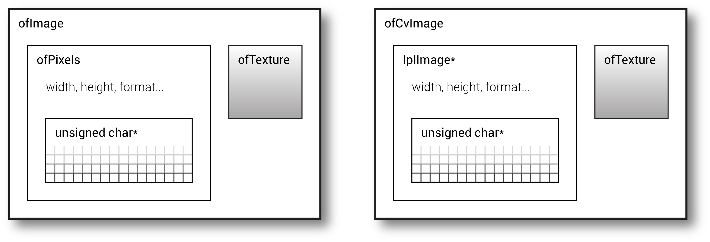

위의 다이어그램은 오픈프레임웍스에서 가장 많이 사용되는 두 종류의 이미지포맷을 간략하게 도식화한 것입니다. 좌측은, unsigned char의 배열을 갖고 있는 `ofImage` 핵심 컨테이너입니다. `ofPixels`오브젝트는 이 배열을 감싸고 있고, 이와 함께 이미지의 가로크기, 세로크기, 포맷(RGB, RGBA, 등등)과 같은 그것을 설명하는 메타데이터가 위치하고 있습니다. `ofImage`는 이 `ofPixels`오브젝트와 함께 이미지를 화면에 그려내는 기능을 제공하는 `ofTexture`를 함께 감싸고 있습니다. 우측의 `ofxCvImage`는 이와 아주 흡사하지만, 이미지 데이터를 IplImage에 저장합니다.이러한 모든 클래스들은 이미지 데이터를 불러오거나 내보내기 위한 다양한 메소드들을 제공합니다.

이미지데이터가 여러분의 컴퓨터 메모리 내에 아주 다른 부분들에 저장 될 수 있다는 점이 매우 중요합니다. 전통적인 unsigned chars와, `ofPixels`, `ofxCvImage` 컨테이너 내의 이미지 데이터들은 컴퓨터의 RAM에 저장되는데, 이는 CPU에 의해 이미지 연산을 하기에 편리합니다. 이와 반대로, `ofTexture`클래스는 앞에서 살펴봤듯이, CPU 메모리상에 데이터를 저장하는데, 이는 화면에 빠르게 렌더링하는데에 적합합니다. 또한 일반적으로 CPU와 GPU간에 이미지 데이터를 교환할 때 성능손실이 발생한다는 점도 알아두면 좋습니다, 가령 GPU에서 화면의 일부분을 캡쳐하는 `ofImage::grabScreen`메소드라든가, `ofPixels`에 이미지 데이터를 복사하는 `ofTexture::readToPixels()`와 `ofFBO::readToPixels`메소드가 바로 그렇습니다.

#### RGB 에서 Grayscale로의 변환, 그리고 컴퓨터비젼에서의 이러한 변환의 역할

많은 컴퓨터 비전 알고리즘(비록 전부는 아니겠지만)들은 일반적으로 싱글채널(그레이스케일 혹은 흑백) 이미지 상에서 이루어집니다. 설령 여러분의 프로젝트가 컬러 이미지를 사용한다고 해도, 결국은  이미지 처리 체인의 여러 중간 결과물은 그레이스케일 픽셀데이터로 처리됩니다. 이유는 단순합니다. 싱글채널 이미지 버퍼를 사용해야 이미치 처리 루틴의 속도가 향상되기 때문입니다. 이는 데이터 처리를 위한 메모리 크기와 동시에 연산량도 줄어들기 때문이지요.


예를들어, 만약 사용자의 바디 위치를 나타내기 위해 "blob"을 계산한다면, 이 blob을 싱글채널 이미지로 저장하는것이 일반적입니다; 보편적으로 이 이미지에서 255(흰색)이 담긴 픽셀은 전면 blob을 의미하고, 0(검정)이 담긴 픽셀은 배경을 의미합니다. 마찬가지로 비디오프레임의 차이를 이용해 움직임의 양을 표한하는 특별한 이미지를 사용한다면, 당연히 이 정보 또한 그레이스케일 이미지(0은 변화가 전혀없는, 255은 변화가 가장 큰)를 사용합니다. 이러한 연산에 대해서는 나중에 다른 섹션에서 다룰것입니다; 일단 이정도의 규칙만 알고 있다면 충분합니다: 만약 저장을 위해 버퍼를 사용하고, 그것을 1-차원의 수로 표현하려면, 1-차원 이미지 버퍼를 사용하면 됩니다. 따라서, *이 챕터에의 모든 예제에서는 여러분이 흑백 이미지를 가지고 작업한다고 가정합니다*
 
여러분에게 가공되지 않은 컬러비디오(일반적으로 웹캠을 사용하죠)가 있다고 해봅시다. 많은 이미지 처리 및 컴퓨터 비전 응용사례에서, 여러분이 가장 먼저 해야할 일은 *이것을 흑백으로 변환* 하는 것입니다. 여러분의 어플리케이션에 따라, 그 컬러를 직접 그레이스케일로 변환해버리거나, 혹은 별도의 처리를 통해 그레이스케일의 사본을 만들어내야 합니다.

컬러 이미지를 그레이스케일로 변환하는 아주 단순한 처리는, 오픈프레임웍스에서 해당 데이터를 `OF_IMAGE_GRAYSCALE` 이미지 타입으로 변경하는 것입니다. 이는 이미지를 재할당하고, ofTexture를 업데이트해줘야 하기 때문에, 자주 수행한다면 자칫 무거운 연산이 될 수도 있다는점을 명심하셔야 합니다. 또한, 원본의 컬러정보가 변환 과정에서 정보의 손실이 발생하므로 "손실 연산"이기도 합니다.

```cpp
ofImage myImage; 
myImage.loadImage ("colorful.jpg"); // Load a colorful image.
myImage.setImageType (OF_IMAGE_GRAYSCALE); // Poof! Now it's grayscale. 
```

ofxOpenCV 애드온 라이브러리는 컬러 이미지를 그레이스케일로 변환하는 몇가지 메소드를 제공합니다. 예를들어 `convertToGrayscalePlanarImage()`와 `setFromColorImage()` 함수는 `ofxColorImage`에 저장된 컬러 이미지 데이터를 변환하여 `ofxCvGrayscaleImage`를 생성 혹은 세팅해줍니다:

```
// Given a color ofxOpenCv image, already filled with RGB data:
// ofxCvColorImage kittenCvImgColor; 

// And given a declared ofxCvGrayscaleImage:
ofxCvGrayscaleImage kittenCvImgGray;
	
// The color-to-gray conversion is then performed by this assignment.
// NOTE: This uses "operator overloading" to customize the meaning of
// the '=' operator for ofxOpenCV images. 
kittenCvImgGray = kittenCvImgColor;
```

비록 오픈프레임웍스가 위와같은 컬러이미지를 그레이스케일로 변환하는 기능들을 제공해주긴 하지만, 실제로 변환하는 과정의 디테일들을 이해하는것도 나쁘지 않을겁니다. 이러한 변환을 수행하는 방법은 대체로 세가지 방법이 있습니다:

* **R, G, B 컬러 채널중 하나만 추출** : 이미지의 휘도를 대략적으로 추출하기 위한 방법입니다. 예를들자면 이미지의 휘도를 얻기위해, 빨강, 파랑 데이터는 무시하고 녹색 값들만 뽑아낼 수 있을것입니다. 일반적인 컬러이미지 byte 데이터는 R-G-B의 순서로 배치되어있으므로, 세번째 바이트만 뽑아내면 됩니다. 이 방법은 빠른 컴퓨터 연산이 가능하지만, 인간이 느끼기에 부정확하기도 하고, 자연 이미지들의 경우 노이즈가 많이 생기는 단점이 있습니다.

* **R, G, B 컬러 채널의 평균값 사용** : 느리지만 인지적으로 대체로 정확한 휘도(일반적으로 *Y*라고 표기하기도 합니다)을 얻기 위해 모픈 픽셀에 담긴 빨강, 녹색, 파란색 값의 평균을 구하는 것입니다: Y = (R+G+B)/3;`. 가시영역의 컬러 스펙트럼에서 보다 나은 휘도값을 얻을수 있으면서 동시에 모든 채널에서의 노이즈도 줄일 수 있는 방법이기도 합니다.

* **컬러 상수(colorimetric coefficient)를 이용하여 휘도값을 계산** : 인지적으로 가장 정확한 방법으로, RGB컬러데이터에서 그레이스케일값을 얻기위해 특별히 정의된 RGB컬러데이터의 평균 "표색(colormetric" 수치를 사용하여 계산하는 방법입니다. 이 방법은 대체로 비싼 연산이라고 할 수 있는데, 각 컬러채널별로 고유의 인지적 요소값을 곱하게 됩니다. ofxOpenCV애드온에서 사용되고 있는 OpenCV의 [cvtColor](http://docs.opencv.org/modules/imgproc/doc/miscellaneous_transformations.html#cvtcolor)함수에서 채택하고 있는 CCIR 601 이미징 스펙에 따르면, `Y = 0.299*R + 0.587*G + 0.114*B` 공식을 적용하고 있습니다.(추가적인 감마-수정을 적용한 RGB 값입니다). [위키피디아](http://en.wikipedia.org/wiki/Luma_(video))에 따르면, "이러한 상수는 인간의 삼중 인지강도를 바탕으로 하고 있는데, 일반적으로 인간의 시각은 파란색에 둔감하고 녹색에 더 민감하기 때문이다" 라고 서술되어 있습니다.

아래는 위에 서술된 내용을 바탕으로 C/C++로 작성된 컬러값을 그레이스케일로 변환하는 코드입니다. 3-채널 이미지를 단일 채널이미지로 변환함에 있어 픽셀단위로 처리하는 보다 일반적인 방법을 보여주고 있습니다.

```cpp
// Code fragment to convert color to grayscale (from "scratch")

// Load a color image, fetch its dimensions, 
// and get a pointer to its pixel data. 
ofImage myImage; 
myImage.loadImage ("colorful.jpg");
int imageWidth = myImage.getWidth();
int imageHeight = myImage.getHeight();
unsigned char* rgbPixelData = myImage.getPixels(); 

// Allocate memory for storing a grayscale version.
// Since there's only 1 channel of data, it's just w*h. 
int nBytesGrayscale = imageWidth * imageHeight; 
unsigned char* grayPixelData = new unsigned char [nBytesGrayscale];

// For every pixel in the grayscale destination image, 
for(int indexGray=0; indexGray<nBytesGrayscale; indexGray++){

	// Compute the index of the corresponding pixel in the color image,
	// remembering that it has 3 times as much data as the gray one. 
	int indexColor = (indexGray * 3); 

	// Fetch the red, green and blue bytes for that color pixel. 
	unsigned char R = rgbPixelData[indexColor  ]; 
	unsigned char G = rgbPixelData[indexColor+1]; 
	unsigned char B = rgbPixelData[indexColor+2]; 
	
	// Compute and assign the luminance (here, as an average of R,G,B).
	// Alternatively, you could use colorimetric coefficients.  
	unsigned char Y = (R+G+B)/3; 
	grayPixelData[indexGray] = Y;
}
```


## 이미지에서의 포인트 프로세싱 연산 (Point Processing Operation)

이 섹션에서는, 부가적인 분석 및 의사결정을 위한 precursor을 하는 이미지 처리 연산을 살펴보겠습니다. 특히, 우리가 살펴볼 것은 *포인트 프로세싱(point processing")* 연산, 즉 이미지 산술 및 임계처리 입니다. 

일단 *이미지 산술(arithmetic)*로 시작할텐데요, 이는 컴퓨터 비전 워크플로의 핵심입니다. 이것들은 우리가 일반적으로 알고 있는 기초적인 수학 연산자인 덧셈, 뺄셈, 곱셈, 나눗셈이지만, 이미지에 적용되는 것 뿐입니다. 개발자들은 여러가지 이유로, 지속적으로 이러한 연산들을 사용합니다.

### 상수를 사용한 이미지 산술

이미지 내 값에 적용하는 산술 변환의 가장 단순한 연산은 상수를 사용하는 것입니다. 아래의 예제에서는, 8-비트 흑백이미지 에 상수 **10**를 더하고 있습니다. 어떻게 *픽셀 단위*로 값이 더해지는지 살펴보시기 바랍니다: 결과가 되는 이미지의 각 픽셀은 원본이 되는 이미지보다 10씩 더 큰 값(그레이 레벨단위로 10씩 밝아짐)이 적용됩니다. 각 픽셀들은 인접한 픽셀과 별개로 독립적으로 처리되므로, 이러한 이미지 연산을 *포인트 프로세싱*이라고도 부릅니다.

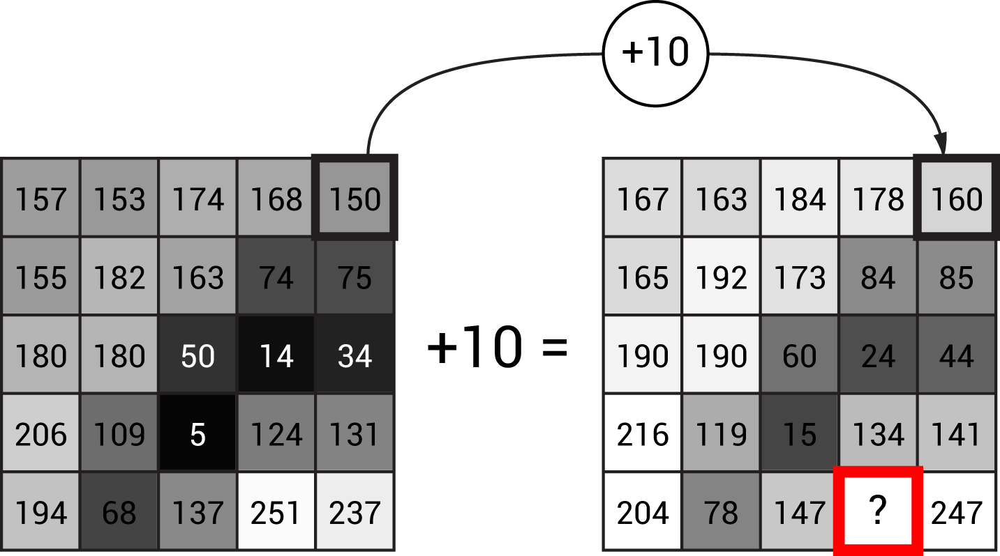

값을 더하면 이미지는 전체적으로 밝아지고, 반대로 값을 빼면 이미지는 전체적으로 어두워집니다.

아래의 코드에서는, 픽셀버퍼를 직접 조작하여 포인트 프로세싱을 구현합니다. 실제 컴퓨터비전 프로젝트에서는 이러한 과정을 OpenCV와 같은 고급-레벨의 라이브러리를 사용하겠지만, 실제 내부에서의 동작 원리를 살펴볼 수 있을것입니다.

```cpp
// Example 4: Add a constant value to an image.
// This is done from "scratch", without OpenCV.
// This is ofApp.h

#pragma once
#include "ofMain.h"

class ofApp : public ofBaseApp{
	public:
	void setup();
	void draw();
	
	ofImage lincolnOfImageSrc; // The source image
	ofImage lincolnOfImageDst; // The destination image
};
```

```cpp
// Example 4. Add a constant value to an image.
// This is ofApp.cpp
#include "ofApp.h"

void ofApp::setup(){
	
	// Load the image and ensure we're working in monochrome.
	// This is our source ("src") image. 
	lincolnOfImageSrc.loadImage("images/lincoln_120x160.png");
	lincolnOfImageSrc.setImageType(OF_IMAGE_GRAYSCALE);
	
	// Construct and allocate a new image with the same dimensions. 
	// This will store our destination ("dst") image. 
	int imgW = lincolnOfImageSrc.width;
	int imgH = lincolnOfImageSrc.height;
	lincolnOfImageDst.allocate(imgW, imgH, OF_IMAGE_GRAYSCALE);
	
	// Acquire pointers to the pixel buffers of both images. 
	// These images use 8-bit unsigned chars to store gray values. 
	// Note the convention 'src' and 'dst' -- this is very common.
	unsigned char* srcArray = lincolnOfImageSrc.getPixels();
	unsigned char* dstArray = lincolnOfImageDst.getPixels();
	
	// Loop over all of the destination image's pixels. 
	// Each destination pixel will be 10 gray-levels brighter
	// than its corresponding source pixel.
	int nPixels = imgW * imgH; 
	for(int i=0; i<nPixels; i++) {
		unsigned char srcValue = srcArray[i];
		dstArray[i] = srcValue + 10; 
	}
	
	// Don't forget this!
	// We tell the ofImage to refresh its texture (stored on the GPU)
	// from its pixel buffer (stored on the CPU), which we have modified.
	lincolnOfImageDst.update();
}

//---------------------
void ofApp::draw(){
	ofBackground(255);
	ofSetColor(255);

	lincolnOfImageSrc.draw ( 20,20, 120,160);
	lincolnOfImageDst.draw (160,20, 120,160);
}
```

### 정수 오버플로우에 관한 주의사항


이미지 산술은 단순합니다만, 픽셀에 저장된 값에 산술연산을 할때에 숨어있는 위험이 있습니다!: *[정수 오버플로우](http://en.wikipedia.org/wiki/Integer_overflow)*가 바로 그것입니다.

위의 그림에서 하단에 마킹된 픽셀에 10을 더하면 어떻게 될까요? 원래의 값은 251인데, 이 값은 unsigned char로 저장되므로 가능한 최대의 값은 255입니다! 그렇다면 결과는 어떻게 될까요? 좀 더 일반적으로 질문해본다면, 픽셀의 데이터타입에에 비해 너무 큰 픽셀값이 할당되면 어떤 일이 발생할까요?

정답은 바로 : *어떤 라이브러리를 사용하는지에 따라, 혹은 여러분이 사용하는 프로그래밍 스킬에 따라 다르다* 입니다. 그리고 이건 아주아주 중요한 결과가 될수 있죠! OpenCV와 같은 어떤 이미지 처리 라이브러리의 경우라면, 모든 산술연산에 데이터형에 따라 값을 잘라내거나 제한해줄 것입니다.  그러금로 만약 251에 10을 더하면, 결과는 255이상을 넘지 않습니다(이러한 방법은 "saturation"이라고도 알려져있습니다). 이와 다르게 우리가 위에서 작성했던 코드와 같이 직접 unsigned char를 처리한다고 하면, 데이터의 "롤오버" 현상을 감수해야 합니다, 자동차의 주행적산메터가 표현할수 있는 값을 넘어가면 0이 되는것처럼요. 자리올림의 기능없이, 오직 sifnificant bit만이 남게 되는것이죠. 따라서 unsigned char 데이터 단위에서는, 251에 10을 더하면... 6이 됩니다!

정수 오버플로우의 위험은 아래의 그림에서 살펴볼 수 있습니다. 위의 코드를 사용해, 모든 픽셀값에 상수값을 더해서 에이브라함 링컨의 초상화를 조금 밝게 적용해보았습니다. 에러(오버플로우)를 피하기위한 별도의 처리가 없다면, 밝은 픽셀들은 "오버플로우"에 의해 검게 바뀝니다.

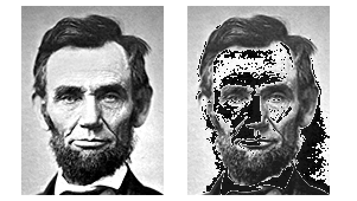

위의 예제에서, 새로운 픽셀값에 적용하기 전에, 정수값을 더하고, 그 결과를 값의 범위 제한(constraint)을 적용하는것으로 정수 오버플로우를 피할 수 있습니다:

```cpp
// 오버플로우를 피하기 위해, `min` 함수를 사용하여 255가 넘는 것을 방지한다.
dstArray[index] = min(255, (int)srcValue + 10);
```

곱셈, 뺄셈(이 경우 음수가 되는 에러)과 같은 다른 산술적 연산에서 역시 마찬가지로 정수 오버플로우를 방지할 수 있습니다.

### ofxOpenCv 애드온을 사용한 이미지 연산

OpenCV 컴퓨터 비전 라이브러리는, 빠르고, 사용하기 쉬운, 고급-레벨의 이미지 연산을 제공합니다. 아래는 우리가 위에 살펴본 똑같은 예제를, 오픈프레임웍스 코어에 포함되어있는 ofxOpenCV 애드온 라이브러리를 사용하여 재작성한것입니다:

* ofxOpenCv는 간편한 이미지들간의 데이터 복사 메소드를 제공합니다.
* ofxOpenCv는 이미지 연산을 위한 간편한 연산자들을 제공합니다.
* ofxOpenCv의 산술연산자들은, 정수오버플로우를 방지하므로 이에대해 걱정할 필요가 없습니다.
* 다른 모든 애드온과 마찬가지로, ofxOpenCV애드온을 프로젝트에 제대로 불러오는것이 중요합니다. (단순히 `#include "ofxOpenCv.h`를 헤더파일에 작성한다고 해서 되는것이 아닙니다!) 오픈프레임웍스의 [프로젝트 생성기](https://www.youtube.com/watch?v=4k2ZcvC0YEA)를 사용하면, 애드온을 새 프로젝트(혹은 이미 존재하는 프로젝트)에 쉽게 추가할 수 있습니다.

```cpp
// Example 5: Add a constant value to an image, with ofxOpenCv.
// Make sure to use the ProjectGenerator to include the ofxOpenCv addon.
// This is ofApp.h
#pragma once

#include "ofMain.h"
#include "ofxOpenCv.h"

class ofApp : public ofBaseApp{
	public:
		void setup();
		void draw();
		ofxCvGrayscaleImage lincolnCvImageSrc;
		ofxCvGrayscaleImage lincolnCvImageDst;
};
```

```cpp
// Example 5: Add a constant value to an image, with ofxOpenCv.
// This is ofApp.cpp
#include "ofApp.h"

void ofApp::setup(){
	
	// ofxOpenCV doesn't have image loading.
	// So first, load the .png file into a temporary ofImage.
	ofImage lincolnOfImage;
	lincolnOfImage.loadImage("lincoln_120x160.png");
	lincolnOfImage.setImageType(OF_IMAGE_GRAYSCALE);
	
	// Set the lincolnCvImage from the pixels of this ofImage.
	int imgW = lincolnOfImage.getWidth();
	int imgH = lincolnOfImage.getHeight();
	unsigned char *lincolnPixels = lincolnOfImage.getPixels();
	lincolnCvImageSrc.setFromPixels( lincolnPixels, imgW, imgH);
	
	// Make a copy of the source image into the destination.
	lincolnCvImageDst = lincolnCvImageSrc;
	
	// ofxOpenCV has handy operators for in-place image arithmetic.
	lincolnCvImageDst += 60;
}

//---------------------
void ofApp::draw(){
	ofBackground(255);
	ofSetColor(255);
	
	lincolnCvImageSrc.draw ( 20,20, 120,160);
	lincolnCvImageDst.draw (160,20, 120,160);
}
```

아래는 결과입니다. 큰 값들(밝은 부분들)이 오버플로우 에러 없이 제대로 밝아졌는지 확인해보세요.

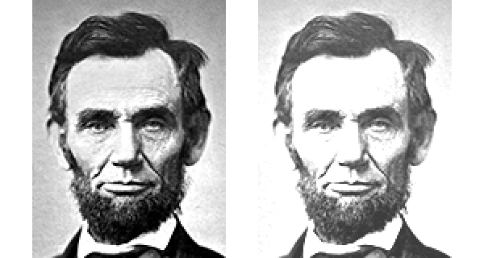

<!-- ### Arithmetic with Two Images: Absolute Differencing -->
### 두 이미지를 사용한 연산 : 절대 비교

이미지 연산은 두 이미지간에 적용하는 경우에 훨씬 유용합니다. 예상하셨겠지만, 두 이미지를 더해버리거나, 곱하거나, 한 이미지에서 다른 이미지를 뺼수도 있고, 나눠버릴수도 있습니다. 두 이미지간에 산술연산을 적용할 때(가령 덧셈),이러한 연산은 "픽셀별로" 적용됩니다: 이미지 *A*의 첫 픽셀이 이미지 *B*의 첫 픽셀에, 이미지 *A*의 두번째픽셀이 이미지 *B*의 픽셀에.. 이렇게 연속적으로 적용된다는 얘기입니다. 이 예시를 위해, 이미지 *A*, *B*는 모두 흑백이고, 같은 해상도를 가진다고 가정해봅시다.
많은 컴퓨터 비전 어플리케이션은 두 이미지의 비교 가능성에 의존하고 있습니다. 일단 아래 그림에서 볼수 있는 *절대 비교* 연산부터 시작해보도록 합시다. 이 연산은 이 연산은 한 임지ㅣ에서 다른 이미지의 값을 뺀 절대값을 계산하는 것과 동일합니다: *|A-B|*. 보시는것과 같이, 절대 비교는 *프레임 비교*, *배경 제거*와 같은 과정의 아주 핵심 과정입니다.

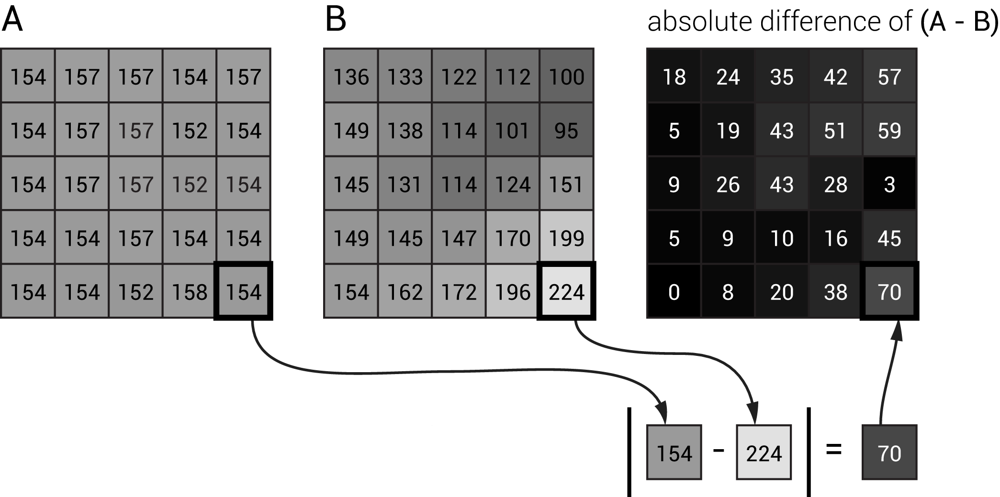

위에 보여지는 그림에서는, 5x5 해상도를 가지는 두 이미지간의 절대비교를 수행합니다. 우측하단의 픽셀이 가장 큰 차이를 보이는것을 볼 수 있습니다.

절대비교는 ofxOpenCv애드온을 사용한 딱 한줄의 코드로 가능합니다:

```cpp
// Given: 
// ofxCvGrayscaleImage myCvImageA;    // the minuend image
// ofxCvGrayscaleImage myCvImageB;    // the subtrahend image
// ofxCvGrayscaleImage myCvImageDiff; // their absolute difference

// The absolute difference of A and B is placed into myCvImageDiff:
myCvImageDiff.absDiff (myCvImageA, myCvImageB);
```

### 임계처리(Thresholding)

컴퓨터 비전 프로그램에서는, 어떤 영역들이(픽셀들이) 을 가져야 하는 부분인지, 그리고 역으로 무시해야할 부분은 어떤 영역들인지를 결정하는 과정이 자주 필요합니다. 이러한 판별을 위한 연산이 바로 *임계처리(thresholding)* 입니다.

임계처리는 *픽셀단위 조건 테스트*를 의미합니다- 즉, "만약" 원본 이미지의 각 *(x, y)*에 대항하는 픽셀에 담긴 값이 특정한 조건을 충족하는가 를 묻는것입니다. 임계처리는 그 결과로 원본 이미지의 해당 픽셀과 대응되는 픽셀에 조건이 충족하는지, 혹은 충족하지 않는지를 나타내는 대상 이미지를 리턴해줍니다. 앞서 우리가 잠깐 살펴봤듯이, 조건을 만족하는 픽셀은 255(흰색), 그렇지 않은경우 0(검정)이 됩니다. 그리고 앞으로 우리가 더 살펴보겠지만, 임계처리의 결과로 얻어낸 흰색 덩어리(blob)들은 *윤곽 추적(contour tracers)* 분석에 훨씬 더 적합합니다.

아래의 예시에서, 좌측에는 밝은-색의 세포 현미경 사진이 있습니다. 여기서 어떤 픽셀들이 세포인지, 그리고 어떤 픽셀들이 세포가 아닌지를 알고 싶다고 해봅시다. 우리의 기준이라면, 어떤 픽셀들이 그레이스케일의 밝기가 어떤 기준값, 즉 *임계값* 보다 큰지를 테스트 하면 될것입니다. 아래의 그림에서는, 0-255 범위의 중간값인 127을 임계값으로 설정하여 테스트합니다.

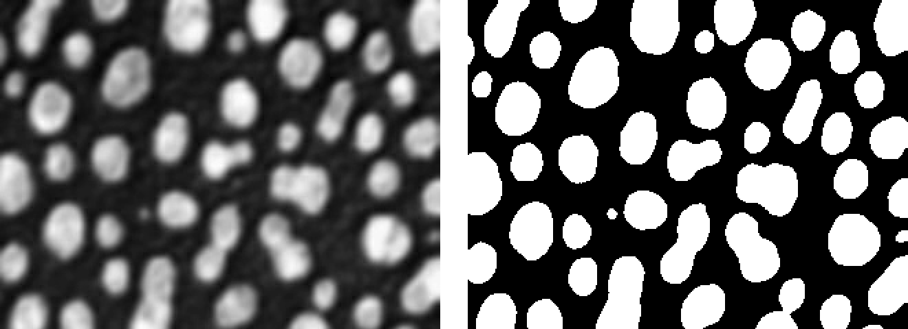

아래의 코드는 이미지의 임계처리를 위한 오픈프레임웍스의 프로그램입니다만, 상수값 (127)을 사용하는 대신, 마우스의 x좌표인 `mouseX`를 임계값으로 사용했습니다. 이러한 방법을 사용해 사용자 컨트롤에 의한 상호작용으로 임계연산을 적용할 수 있습니다.

```cpp
// Example 6: Thresholding 
// This is ofApp.h
#pragma once

#include "ofMain.h"
#include "ofxOpenCv.h"

class ofApp : public ofBaseApp{
	public:
		void setup();
		void draw();
		ofxCvGrayscaleImage myCvImageSrc;
		ofxCvGrayscaleImage myCvImageDst;
};
```

```cpp
// Example 6: Thresholding 
// This is ofApp.cpp
#include "ofApp.h"

//---------------------
void ofApp::setup(){
	
	// Load the cells image
	ofImage cellsOfImage;
	cellsOfImage.loadImage("cells.jpg");
	cellsOfImage.setImageType(OF_IMAGE_GRAYSCALE);
	
	// Set the myCvImageSrc from the pixels of this ofImage.
	int imgW = cellsOfImage.getWidth();
	int imgH = cellsOfImage.getHeight();
	unsigned char *cellsPixels = cellsOfImage.getPixels();
	myCvImageSrc.setFromPixels (cellsPixels, imgW, imgH);
}

//---------------------
void ofApp::draw(){
	ofBackground(255);
	ofSetColor(255);
	
	// Copy the source image into the destination:
	myCvImageDst = myCvImageSrc;
	
	// Threshold the destination image. 
	// Our threshold value is the mouseX, 
	// but it could be a constant, like 127.
	myCvImageDst.threshold (mouseX); 
	
	myCvImageSrc.draw ( 20,20,  320,240);
	myCvImageDst.draw (360,20,  320,240);
}
```
## A Complete Workflow: Background Subtraction
## 최종 워크플로우 : 배경 제거 

자 이제 컴퓨터비젼에서 가장 많이 사용되는 *배경제거 후 윤곽 추출 및 덩어리 추적법* 에 대해 살펴보고 구현해보도록 하겠습니다. 이 과정을 거치면 (예를 들어) 카메라의 시야에 들어오는 인체의 몸의 경계를 표현하는 덩어리의 (x, y) 좌표들을 얻어올 수 있습니다.


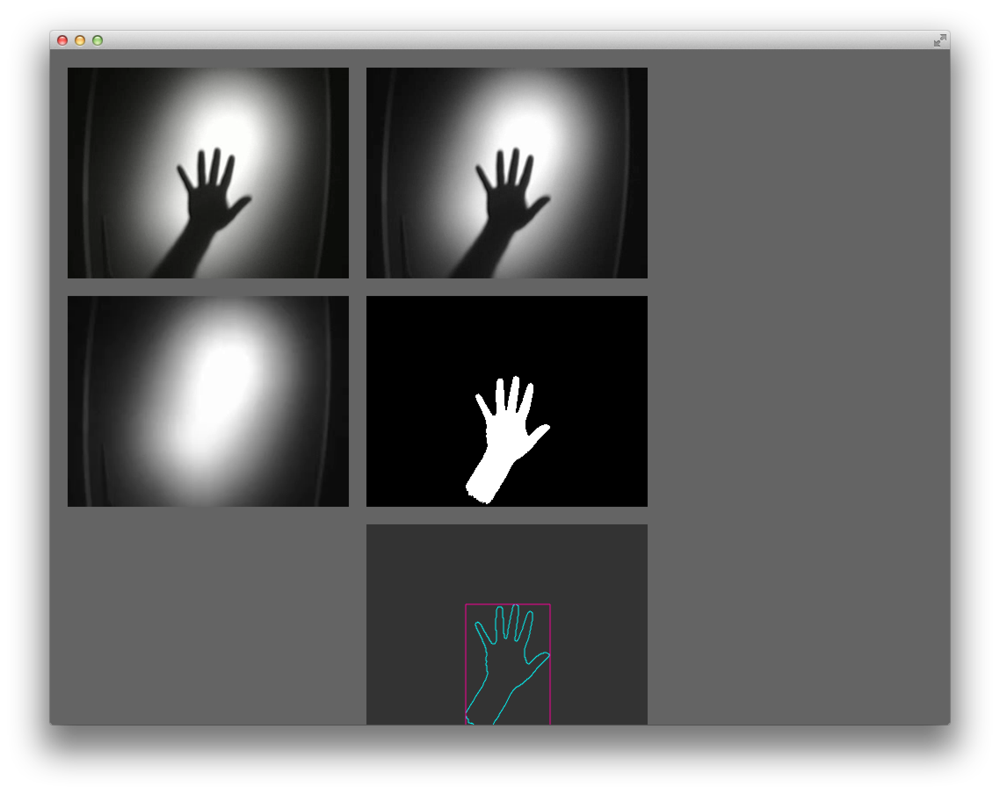

이 섹션에서는, 오픈프레임웍스 디렉토리 내의 `examples/addons/opencvExample`에 위치한 *opencvExample* 예제를 중점으로 합니다. 이 프로젝트를 컴파일한 뒤 실행하면, 손의 그림자와 함께, 우측하단에 손의 윤곽이 cyan색의 polyline으로 그려지는 결과를 보실 수 있을겁니다. 이 polyline이 바로 *결과물*로써, 이것으로 관객들의 각종 정보들을 얻을수 있습니다. 자 그럼 어떻게 이것을 얻어올 수 있을까요?

아래의 코드는 *opencvExample*예제를 살짝 단순화하여 보여줍니다; 몇가지 UI요소들과, 실시간 비디오 스트림과 미리 저장된 비디오파일 전환을 위한 (앞에서 언급했던 전처리구문인) `#define _USE_LIVE_VIDEO`도 빠져있습니다.

이제부터는 내부 과정을 다섯단계로 구분하고, 이것들이 어떻게 수행되고, 그려지는지 살펴볼 것입니다:

1. 비디오 얻기
2. 컬러를 그레이스케일로 변환
3. "배경 이미지" 저장
4. 임계처리 비교
5. 윤곽(contour) 추적

```cpp
// Example 7: Background Subtraction 
// This is ofApp.h

#pragma once
#include "ofMain.h"
#include "ofxOpenCv.h"

class ofApp : public ofBaseApp{
	public:
		void setup();
		void update();
		void draw();
		void keyPressed(int key);
	
		ofVideoPlayer			vidPlayer;
	
		ofxCvColorImage			colorImg;
		ofxCvGrayscaleImage 	grayImage;
		ofxCvGrayscaleImage 	grayBg;
		ofxCvGrayscaleImage 	grayDiff;
		ofxCvContourFinder		contourFinder;

		int						thresholdValue;
		bool					bLearnBackground;
};
```

```cpp
// Example 7: Background Subtraction 
// This is ofApp.cpp
#include "ofApp.h"

//---------------------
void ofApp::setup(){
	vidPlayer.load("fingers.mov");
	vidPlayer.play();

	colorImg.allocate(320,240);
	grayImage.allocate(320,240);
	grayBg.allocate(320,240);
	grayDiff.allocate(320,240);

	bLearnBackground = true;
	thresholdValue = 80;
}

//---------------------
void ofApp::update(){
	
	// Ask the video player to update itself.
	vidPlayer.update();
	
	if (vidPlayer.isFrameNew()){ // If there is fresh data...
		
		// Copy the data from the video player into an ofxCvColorImage
		colorImg.setFromPixels(vidPlayer.getPixels());
		
		// Make a grayscale version of colorImg in grayImage
		grayImage = colorImg;
		
		// If it's time to learn the background;
		// copy the data from grayImage into grayBg
		if (bLearnBackground == true){
			grayBg = grayImage; // Note: this is 'operator overloading'
			bLearnBackground = false; // Latch: only learn it once.
		}

		// Take the absolute value of the difference 
		// between the background and incoming images.
		grayDiff.absDiff(grayBg, grayImage);
		
		// Perform an in-place thresholding of the difference image.
		grayDiff.threshold(thresholdValue);

		// Find contours whose areas are betweeen 20 and 25000 pixels.
		// "Find holes" is true, so we'll also get interior contours.
		contourFinder.findContours(grayDiff, 20, 25000, 10, true);
	}
}

//---------------------
void ofApp::draw(){
	ofBackground(100,100,100);

	ofSetHexColor(0xffffff);
	colorImg.draw(20,20);    // The incoming color image
	grayImage.draw(360,20);  // A gray version of the incoming video
	grayBg.draw(20,280);     // The stored background image
	grayDiff.draw(360,280);  // The thresholded difference image

	ofNoFill();
	ofDrawRectangle(360,540,320,240);

	// Draw each blob individually from the blobs vector
	int numBlobs = contourFinder.nBlobs;
	for (int i=0; i<numBlobs; i++){
		contourFinder.blobs[i].draw(360,540);
	}
}

//---------------------
void ofApp::keyPressed(int key){
	bLearnBackground = true;
}
```

**단계 1. 비디오 얻기.** <br /> 
좌측 상단에는, 날것의, 처리되지 않은 손 비디오이 그려집니다. 그렇게 보이진 않겠지만, 이 비디오는 거의 흑백처럼 보일 뿐 사실 컬러 비디오입니다.

`setup()`에서, (ofApp.h에서 선언된) 몇가지 `ofxCvImage` 이미지 버퍼 전역변수들을 초기화하고, 메모리를 할당합니다. 또한 `ofVideoPlayer`의 전역변수인 `vidPlayer`에 손 비디오를 불러옵니다.

컴퓨터 비전 워크플로우에서는 복수의 이미지버퍼를 사용하는것이 일반적인데, 각 버퍼들은 이미지-처리 체인의 중간상태들을 저장하는데 사용됩니다. 최적의 성능을 위해, `allocate()`(역자 주:메모리 할당)은 `setup()`에서 한번만 해주는 것이 좋습니다; 그렇지 않다면, 매번 메모리를 할당해야 하므로 프레임이 떨어질 것입니다.

`colorImg`버퍼 (`ofxCvColorImage`)는 `vidPlayer`에서 얻어온 수정되지 않은 컬러 데이터가 저장되어있습니다; 이 프레임은 `update()`에서 매번 새롭게 얻어온 프레임이지요. `colorImg`는 이것의 복사본을 받습니다. 어떤 명령으로 `vidPlayer`에서 `colorImg`로 데이터가 적용되는지 살펴보시기 바랍니다:

```cpp
colorImg.setFromPixels(vidPlayer.getPixels());
```

(여기서 보여지진 않지만) opencvExample의 전체코드 중, ofApp.h 의 상단부분에서 실사간 웹캠사용을 위해 `#define`구문을 이용해 `ofVideoplayer`를 `ofVideoGrabber`로 변경할 수 있습니다.

**단계 2. 컬러를 그레이스케일로 변환.** <br />
우측 상단의 비디오는 그레이스케일로 변환된 같은 비디오입니다. 이 비디오가 바로 `grayImage` 오브젝트에 저장되어있는, `ofxCvGrayscaleImage`의 인스턴스 입니다.

그레이스케일로 변환되었다는 사실을 놓치기 쉽습니다; `=` 연산자 오버로딩을 사용해서 `grayImage = colorImg;` 한줄 코드에 의해서 변환되기 때문이죠.

**단계 3. "배경 이미지" 저장하기".**<br />
좌측 중간의 화면에는 *배경 이미지*가 보여집니다. 이 이미지는 비디오가 시작하는 순간, 손이 프레임 안에 들어오기전 장면이 캡쳐된 그레이스케일 이미지입니다.

배경이미지인 `garyBg`에는, 비디오의 첫 프레임이 저장되어있습니다; 이는 `grayBh = garyImage;`에 의해 수행됩니다. 불린 스위치(`bLearnBackground`)를 사용하여 매 프레임마다 배경이미지로 저장되는것을 막습니다. 대신에, 이 스위치는 키를 누름으로서 활성화됩니다.

이렇게 하면, (가령 손과같은) 오브젝트가 *프레임을 벗어났을때*, 시스템에서 "배경 학습"을 할수 있게 됩니다. 이렇게 하지 않으면, 오브젝트를 제대로 감지할 수 없겠죠!

**단계 4. 절대비교 후 임계처리.** <br />
우측 중간에 보여지는 이미지는 현재 프레임과 배경 프레임을 *절대 비교 후 임계처리된* 화면입니다. 흰색으로 보여지는 영역이 바로 배경과 명백히 다른 영역: 즉 손입니다!

절대비교와 임계처리는 아래에 보이는 코드에서 두 단계로 나뉘어집니다. `absDiff()`는 `grayBg`와 `grayImage`(현재프레임)간의 절대비교를 계산하여 그 결과를 `grayDiff`에 저장합니다.

임계처리의 결과는 *이진화*된 이미지입니다, 이말은 즉, 픽셀값이 검정(0) 또는 흰색(255)으로만 이루어졌다는 뜻입니다. 임계처리는 `grayDiff` 상에서 *in-place operation*에 의해 수행됩니다. 다시말해 `grayDiff`이미지자체가 임계처리된 결과 됩니다.

`thresholdValue` 값은 80으로 세팅되어있는데, 배경 이미지와 비교했을 때, 픽셀값이 최소 80이상의 gray-level 차이가 있어야 한다는 의미입니다. 공식 예제에서는, 키를 눌러 이 값을 조정할 수 있습니다.

```cpp
// Take the absolute value of the difference 
// between the background and incoming images.
grayDiff.absDiff(grayBg, grayImage);

// Perform an in-place thresholding of the difference image.
grayDiff.threshold(thresholdValue);
```

이 예제는 밝은 배경이미지에서 어두운 오브젝트를 구별하기 위해 임계처리를 사용합니다만, 이와 반대로 특정 이미지에서 밝은 부분을 추출할 수도 있습니다.

만약 여러분이 제공된 데모비디오인 "fingers.mov"파일 대신, 웹캠을 사용할 경우, 자동 보정기능이 때로는 배경 제거에 방해가 될 수 있다는 점을 명심하십시오. 이러한 경우 임계값의 값을 키우거나, 또는 좀 더 복잡한 배경제거 기술을 사용해야 합니다.

**단계 5. 윤곽 추적.** <br />
마지막 단계는 우측 상단에서 볼 수 있습니다. 이것이 이진화된 이미지에서 `findContoures()`에 의해 처리된 `ofxCvContourFinder`입니다. 이러한 과정은 연속적인 흰 픽셀 덩어리들을 판별한 뒤, 이 덩어리들의 윤곽을 추적하여 (x,y) 좌표들로 이루어진 `ofxCvBlob`로 변환합니다.

내부적으로, `ofxCvContourFinder` 는 우선 [*connected component labeling*](https://en.wikipedia.org/wiki/Connected-component_labeling)라고 불리우는 픽셀-단위 계산을 통해, 연결된(연속적인)영역을 고유한-이름을 가진 덩어리로 분류해둡니다. 그런 뒤 이러한 각 덩어리들의 윤곽을 [*chain code algorithm*](http://www.mind.ilstu.edu/curriculum/chain_codes_intro/chain_codes_intro.php)를 사용하여 `ofxPolyline`이라 불리우는 오브젝트에 저장합니다.

`findContoures()` 메서드에 적용되는 몇몇 파라메터들을 사용하여 추출할 덩어리의 최소, 최대크기를 지정할 수 있습니다. 이를 통해 (비디오의 노이즈에 의한) 작은 덩어리들을 무시하거나, 또는 (갑작스런 조도변화에 의한) 너무 큰 덩어리들을 무시할 수 있습니다.

```cpp
// Find contours whose areas are betweeen 20 and 25000 pixels.
// "Find holes" is set to true, so we'll also get interior contours.
contourFinder.findContours(grayDiff, 20, 25000, 10, true);
```

`draw()` 함수에서, 각 덩어리의 윤곽을 cyan으로, 또한 이 윤곽의 범위를 magenta의 사각형으로 그려냅니다.
```cpp
// Draw each blob individually from the blobs vector
int numBlobs = contourFinder.nBlobs;
for (int i=0; i<numBlobs; i++){
   contourFinder.blobs[i].draw(360,540);
}
```


### 프레임 비교

배경 제거와 아주 흡사한 방법으로 *프레임 비교*가 있습니다. 배경 제거 기법이 *등장* 감지에 유용한다고 하면(가령 누군가가 프레임에 등장하기 전과 등장 후를 비교), 프레임 비교는 *움직임*을 감지하는데 유용합니다.

배경 제거와 프레임 비교의 차이점은 아래와 같습니다:

* 배경 제거는 현재 프레임과 미리 저장된 배경이미지를 비교한다.
* 프레임 비교는 비디오의현재 프레임과 직전 프레임을 비교한다.

배경제거를 할때에는, 노이즈 제거를 위해 비교된 이미지를 임계처리하여 조정합니다. 프레임비교를 통하면, 씬에서 *얼마나 많은 움직임이 있었는지*의 정도를 측정할 수 있습니다. 이를 위해 비교된 이미지를 임계처리한 뒤, 흰 픽셀이 얼마나 되는지를 카운트하는 방법을 사용합니다.

실제로, 배경제어와 프레임비교는 빈번히 함께 사용됩니다. 예를들어, 배경제거를 통해 누군가가 방에 들어왔는지를 알아내고, 프레임 비교를 통해 얼마나 그(그녀)가 움직이는지를 알아차리릴 수 있습니다. 이렇게 (프레임 비교를 통한)동작감지와, (배경 제거를 통한)등장감지를 조합하여 범용적인 감지장치를 만들어내는 것이 일반적인 솔루션입니다. 이렇게 얻은 결과로 가중평균(weighted everage)을 구하고, 그 평균을 추가적인 임계처리값으로 사용합니다.

### 윤곽 게임

덩어리 윤곽은 (x,y)점의 좌표집합으로 이루어진 *벡터-기반* 표현입니다. 이렇게 얻어진 윤곽은 모든 종류의 흥미로운 기하학(geometric)적 플레이로 활용이 가능합니다.

아래에 보여지는 Cyril Diagne에 의해 진행된 아래의 프로젝트에서는, 바디의 윤곽을 [ofxTriangle](https://github.com/obviousjim/ofxTriangle)을 사용하여 삼각화(triangulate) 하고, 그 결과를 기반으로 [ofxBox2D](https://github.com/vanderlin/ofxBox2d)를 사용하여 물리 시뮬레이션 인터랙션을 만들어냈습니다. 관객들은 자신들의 실루엣으로 원형의 "공"들을 "캐치"할 수 있습니다.

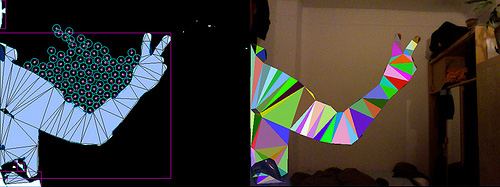

`ofxCvContourFinder::findContours()`함수에 적용되는 플래그 변수중 하나를 통해, *내부* 윤곽을 찾을지 무시할지를 결정할 수 있습니다. 이 내부 윤곽은 [*negative space*](https://en.wikipedia.org/wiki/Negative_space)라고도 불리웁니다. 이 효과를 사용한 인터랙티브 예술작품 Philip Worthington의 *Shadow Monters*에서는, 이 내부 윤곽들을 살아있는 눈알로 변환합니다.

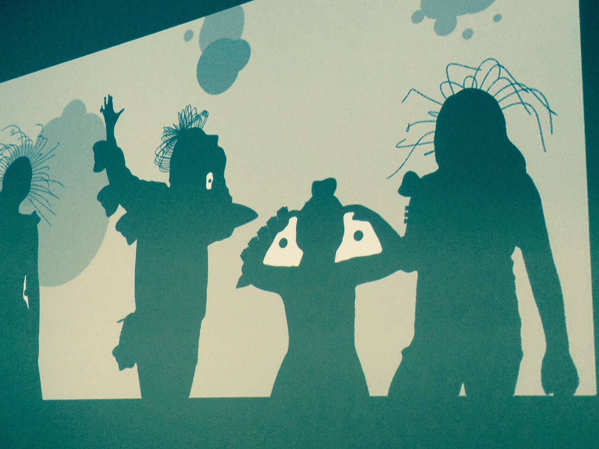

The original masterwork of contour play was Myron Krueger’s landmark interactive artwork, [*Videoplace*](https://www.youtube.com/watch?v=dmmxVA5xhuo), which was developed continuously between 1970 and 1989, and which premiered publicly in 1974. The *Videoplace* project comprised at least two dozen profoundly inventive scenes which comprehensively explored the design space of full-body camera-based interactions with virtual graphics — including telepresence applications and (as pictured here, in the “Critter” scene) interactions with animated artificial creatures. 
<!-- 
윤곽(컨투어)를 사용한 오리지널 명작은 Myron Krueger의 대표적인 인터랙티브 작품인 [*Videoplace*](https://www.youtube.com/watch?v=dmmxVA5xhuo)으로, 1970년부터 1089년까지 지속적으로 개발되왔었으며, 1974년 최초로 공개되었습니다. 이 *Videoplace* 프로젝트는 최소 24개의 독창적인  -->

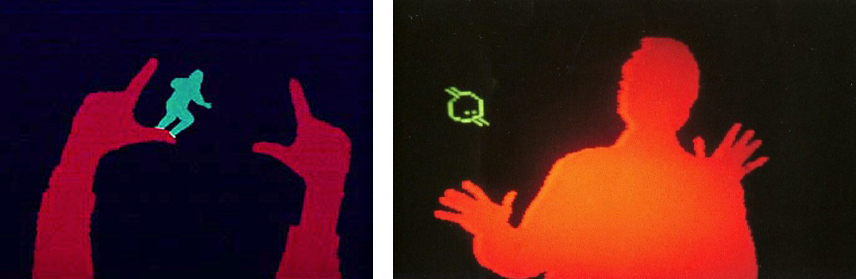

아래는 덩어리들로부터 추출된 윤곽들을 응용하여 만들어낼 수 있는 흥미로운 주제들입니다:

* 덩어리의 윤곽은 `ofPolyline`으로 표현되며, `ofPolyline::getSmoothed()`를 통해 단순화할 수 있습니다. 극단적으로 단순화시켜 실험해보세요.
* 만약 윤곽들의 좌표가 너무 많거나 적으면, `ofPolyline::getResampledBySpacing()` 또는 `ofPolyline::getResampledByCount()`를 통해 좌표의 수를 줄이거나 늘려보세요.
* `ofPolyline`은 윤곽의 부피(area), 윤곽의 둘레, 중심점, 바운딩 영역을 계산하는 메소드들을 제공합니다. 이것들을 오디오비주얼 또는 다른 인터랙티브한 요소들로 매핑해보세요. 예들을어, 도형의 부피를 (물리 시뮬레이션에서) 무게로 변환하거나, 그것의 색으로 변환할 수 있을것입니다.
* 도형에 (손의 손가락 끝이라던가, 사각형의 끝 점과 같은) "특별한" 점을 지정할 수 있습니다.`ofPolyline::getAngleAtindex()`응 사용하여 윤곽을 이루는 포인트들 중 높은 커브값을 갖는 점을 찾을 수 있습니다.
* [*shape metrics*](http://what-when-how.com/biomedical-image-analysis/spatial-domain-shape-metrics-biomedical-image-analysis/)은 윤곽 분석 및 사물인식과 같은 강력한 기능을 제공합니다. 이중 간단한 shape 측정도(metric)에는 [*aspect ratio*](https://en.wikipedia.org/wiki/Aspect_ratio)가 있는데, 도형의 가로세로 비율을 의미합니다. 또다른 멋진 shape 측정도는 *조밀함*([*isoperimetric ratio*](https://en.wikipedia.org/wiki/Isoperimetric_ratio)이라고도 합니다.)으로, 도형의 둘레의-제곱을 의미합니다. 이러한 측정법들을 사용하여 (예를들어) 동물이나 숫자의 컷아웃을 구별해 낼 수 있습니다.
* `ofxCvContourFinder`에 의해 얻어진 덩어리(blob)에 할당된 ID(배열 인덱스)를 통해 덩어리의 크기와 위치를 얻을 수 있습니다. 만약 각 블랍의 위치와 크기가 계속 바뀌는 여러 덩어리들을 *추적*하길 원한다면, [ofxCv](https://github.com/kylemcdonald/ofxCv/)Kyle McDonald의 애드온인 [ofxCv](https://github.com/kylemcdonald/ofxCv/)의 [*example-contours-tracking*](https://github.com/kylemcdonald/ofxCv/tree/master/example-contours-tracking)를 살펴보시가 바랍니다.

## 정리

이번 섹션에서는, 컴퓨터비전 프로그램의 성능과 품질향상을 위해 중요한 몇가지 주요 정리사항에 대해 살펴보겠습니다.

* 임계처리된 이미지 정리 : 침식(Erosion)과 팽창(Dilation)
* 자동 임계처리와 동적 임계처리
* 적응형(adaptive) 배경 추출
* 관심영역(ROI) 처리

#### 임계처리된 이미지 정리 : 침식(Erosion)과 팽창(Dilation)

종종 임계처리를 하면, 조각 덩어리가 생기거나 원하지 않은 얼룩등 노이즈가 발생하곤 합니다. 만약 임계값을 적용해도 이러한 문제들이 해결되지 않는다면, [*erosion*](http://homepages.inf.ed.ac.uk/rbf/HIPR2/erode.htm)과 [*dilation*](http://homepages.inf.ed.ac.uk/rbf/HIPR2/dilate.htm)에 대해 살펴볼 필요가 있습니다. 이것들은 이진화된 이미지에서의 *형태적 연산자* 종류이며, 아래와 같이 간략하게 설명될 수 있습니다,

* 침식(Erosion) 씬의 모든 덩어리에서 얻은 픽셀의 층을 *제거*한다.
* 팽창(Dilation)은 씬의 모든 덩어리에서 얻은 픽셀의 층을 *추가*한다.

아래에 보여지는 예제에서는, 좌측의 이미지에 erosion 처리를 한번 한 결과를 보여줍니다. 이를 통해 작은 노이즈 얼룩들을 제거하였습니다:

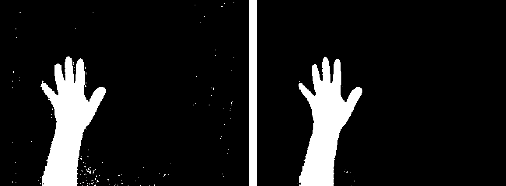

반대로, dilation처리가 인체감지 과정에서 어떻게 되는지 아래에서 살펴보시기 바랍니다:

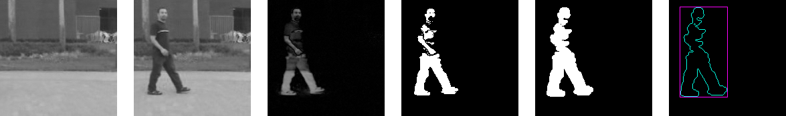


1. 캡쳐된 실시간 비디오는 그레이스케일로 변환됩니다. 씬에 아무도 없을때 배경이미지를 획득합니다. (종종, 실외와 같이 조도 환경이 바뀌는 경우에 카메라 피드에서 평균 이미지를 얻어 배경으로 사용되기도 합니다.)
2. 프레임 내에 사람이 걸어들어옵니다.
3. 실시간 미디오 이미지는 배경이미지와 비교됩니다. 이미지 (1)과 (2)의 절대 차이값이 계산됩니다.
4. 절대 차이값이 계산된 이미지 (3)은 임계처리됩니다. 안타깝게도, 사람의 몸체가 여러 조각으로 조각나 있습니다. 배경이미지와 비교했을 때 큰 차이가 나지 않기 때문입니다.
5. 임계처리된 이미지 (4)에 Dilation 처리를 두번 수행합니다. 이를 통해 조각난 덩어리들이 하나의 연속된 덩어리로 만들어집니다.
6. 여러 덩어리 대신 하나의 덩어리로 윤곽추적을 합니다.

OpenCV를 사용하면 erosion과 dilation을 쉽게 사용할 수 있습니다. `ofxCvImage::erod()`와 `ofxCvImage::dilate()`가 바로 이런 기능을 제공하는 메소드들입니다.


`ofxCvImage::blur()`와 `ofxCvImage::blufGaussian()`은 노이즈 제거에 어쩌면 도움이 될 수 있는 다른 연산들입니다. 이것들은 임계처리 후가 아니라 *전에* 사용되어야 합니다.

#### 적응형 배경 제거
조도 환경이 자주 변하는 실외 같은 환경에서는, 배경 제거가 어려울 수 있습니다. 일반적인 해결책 중 하나는 하루가 흐르는 동안 천천히 배경의 평균을 더해 업데이트하여 배경이미지를 적용하는 것입니다. 

`ofxCvImage`의 연산자 오버로딩 사용을 통해 평균값을 직관적으로 계산할 수 있습니다. 아래의 코드는, 배경을 지속적으로, 천천히 1%의 새 정보와 나머지 99%를 조합하여 계산합니다. 이를 *적응형 배경*이라고도 부릅니다.

```cpp
grayBg = 0.99*grayBg + 0.01*grayImage;
```
 
#### 자동 임계처리와 동적 임계처리
종종 입계값을 보다 정확하게 적용하는것이 어려울 때가 있습니다. 카메라의 조건이 바뀌거나, 조도값이 바뀌거나, 혹은 대상 씬이 바뀔때와 같은 경우이지요; 이럴 

이를 해결하기 위해, 위의 예제 6(위)와 같이, `mouseX`값을 입계값으로 사용하여 수동으로 조절하는 방법을 사용할 수 있습니다. 하지만 *자동 임계처리* 기법을 사용해 이미지의 밝기 히스토그램에 기반한 "이상적인" 임계값을 계산하는 방법도 있습니다. 이를 위한 여러 훌륭한 기법들이 있는데, [Otsu's Method](https://en.wikipedia.org/wiki/Otsu%27s_method), 가우시언 혼합모델링, IsoData 임계처리, 최대 엔드로피 임계처리 등등이 있습니다. US National Institute of Health에서 만든 오픈소스 (JAVA) 컴퓨터 키전 툴킷인 [ImageJ](http://imagej.nih.gov/ij/)에, 이 훌륭한 기법들이 잘 정리되어있으니 살펴보시기 바랍니다.


아래의 코드는 *Isodata* 방법을 사용한 코드입니다. 자동화된 이상적인 임계값을 계산하기 위한 단순한 방법중 하나입니다. 함수가 이미지의 *히스토그램*(이미지 전체에서 각 밝기레벨에 얼마나 많은 픽셀이 있는지를 카운트한 값이 256 정수로 나열된 배열)을 입력으로 받는다는 것을 보실 수 있습니다.

```cpp
/*
From: http://www.ph.tn.tudelft.nl/Courses/FIP/frames/fip-Segmenta.html
This iterative technique for choosing a threshold was developed by 
Ridler and Calvard. The histogram is initially segmented into two parts
using a starting threshold value such as th0 = 127, half the maximum
dynamic range for an 8-bit image. The sample mean (mf,0) of the gray 
values associated with the foreground pixels and the sample mean (mb,0) 
of the gray values associated with the background pixels are computed. 
A new threshold value th1 is now computed as the average of these two 
sample means. The process is repeated, based upon the new threshold, 
until the threshold value does not change any more. 

Input: imageHistogram, an array of 256 integers, each of which represents 
the count of pixels that have that particular gray-level. For example,
imageHistogram[56] contains the number of pixels whose gray-level is 56.
Output: an integer (between 0-255) indicating an ideal threshold.
*/

int ofApp::getThresholdIsodata (int *imageHistogram){
	int theThreshold = 127; // our output
	
	if (input != NULL){ // sanity check
		int thresh = theThreshold;
		int tnew = thresh;
		int thr  = 0;
		int sum  = 0;
		int mean1, mean2;
		int ntries = 0;
		
		do {
			thr = tnew;
			sum = mean1 = mean2 = 0;

			for (int i=0; i<thr; i++){
				mean1 += (imageHistogram[i] * i);
				sum   += (imageHistogram[i]);
			}     
			if (sum != 0){ mean1 = mean1 / sum;}

			sum = 0;
			for (int i=thr; i<255; i++){
				mean2 += (imageHistogram[i] * i);
				sum   += (imageHistogram[i]);	
			}

			if (sum != 0){ mean2 = mean2 / sum;}
			tnew = (mean1 + mean2) / 2;
			ntries++;

		} while ((tnew != thr) && (ntries < 64));
		theThreshold = tnew;
	}
	return theThreshold;
}
```

이미지의 그라이던트가 너무 강하다던가 하는 몇몇 조건에서는, 하나의 임계값으로는 전체이미지에 적합하지 않은 경우가 있습니다. 이럴 경우 *픽셀당 임계처리*와 같은 구현이 더 적합할 수 있습니다. 전체 이미지 대신 픽셀마다 각기 다른 임계값을 적용하는 것이죠.

아래에서 볼 수 있는것처럼, 특정 텍스트가 있는 원본 이미지는단인 임계값을 사용하면 제대로 처리가 되지 않습니다. 단일한 값을 사용하는 대신, 각 픽셀에 인접한 픽셀의 밝기값의 평균을 사용하여 임계처리를 합니다(상수를 뺍니다!).


이 기법을 *적응형 임계처리*라고 하며, [Hypertext Image Processing Reference](http://homepages.inf.ed.ac.uk/rbf/HIPR2/adpthrsh.htm)에서 더 자세한 내용을 찾으실 수 있습니다.

#### 관심영역(ROI) 처리

많은 이미지 처리 및 컴퓨터 비전 계산에서는, 전체 이미지의 일부 영역에 한해 처리하는 경우가 있는데 이를 *관심영역(resion of interst)* 혹은 ROI라고 합니다.

이 기능이 바로 `ofxCvImage::setROI()`인데, 이미지의 관심영역을 지정해줍니다. 관심영역은 추후 처리에 사용할 영역 오브젝트를 위한 이미지 내의 사각형 영역입니다. ROI가 한번 설정되면, OpenCV는 ROI에 한해 작업을 수행하므로, 처리하고 수정할 픽셀의 갯수를 줄일 수 있습니다.

## 더 많은 실험을 위한 제안

살펴볼 내용이 정말 많습니다! 우선 오픈프레임웍스에 포함된 모든 openCV 예제들을 살펴보는것을 강력히 추천드립니다. (고전적인 Viola-Jones의 얼굴인식을 구현한 *opencvHaarFinderExample*예제가 제일 인기가 많더라구요!) 오픈프레임웍스의 예제들을 다 살펴보셨다면, Kyle McDonald의 [ofxCv](https://github.com/kylemcdonald/ofxCv)예제들도 살펴보시기 바랍니다.

종종 저는 학생들에게 잘 알려진 인터랙티브 뉴미디어 프로젝트를 똑같이 구현해보는 과제를 내줍니다. 아래와 같이 절차적이면서, 디테일을 위해 관심의 한계를 테스트할 수 있는 프로젝트들을 재 구현해보는거죠. 다른 소스들에서 배울 수 없는, 직관성을 따라해보는겁니다. *이런것들을 한번 구현해보시길 바랍니다..*

#### A Slit-Scanner.
*Slit-scanning* 는, 시공간, 또는 "시-공간 이미징"의 종류로써, 인터랙티브 비디오 분야에서 20여년 이상 흔히 차용되어 왔습니다. 인터랙티브 slit-scanner는 다른 많은 실무자들에 의한 [literally dozens](http://www.flong.com/texts/lists/slit_scan/)뿐 만 아니라 존경받는 뉴미디어 아트분야의 선구자들(Toshio Iwai, paul de Marinis, Steina Vasulka)에 의해 개발되어왔습니다. 이는 끝없을 무한한 가능성을 가지는 실험을 위해 공개된 형태로 남아있습니다. 특히 이미지 데이터의 관리 및 이미지 하위영역의 추출 및 복사와 같은 내용을 연습하기에 좋습니다.

디지털 slit-scanning에서, 얇은 슬라이스들은 미디오 프레임의 시퀀스에서 얻어지고, 이것들을 이어 새 이미지로 조합됩니다. 이 결과로 얻는 이미지는 비디오 혹은 카메라 스트림에서의 움직임의 기록을 간략하게 보여줍니다. Danny Rozin의 [*Time Scan Mirror*](http://www.smoothware.com/danny/timescan.html)(2004)에서는 입력받는 비디오의 매 프레임의 중앙에서 세로의 얇은 픽셀 슬라이스를 얻은뒤, 이를 서로 연결해 이미지로 조합합니다. 이러한 slit-scanner는 20줄도 안되는 코드로 구현할 수 있으니 한번 도전해보세요!

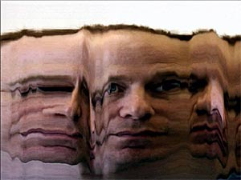

#### Utterback & Achituv의 *Text Rain* (1999) 커버
Camille Utterbak과 Romy Achituv의 *[Text Rain](http://camilleutterback.com/projects/text-rain/)* 작업은 인터랙티브 아트 분야에서 고전적인 작업으로써, 가상의 문자들이 관객의 "실루엣"에 "떨어지는" 작업입니다. Utterback은 이렇게 설명합니다: "*Text Rain* 설치작품에서, 관객들은 거대한 프로젝트 스크린 앞에서 서있거나, 움직입니다. 관객들은 흑백의 좌우반전된 자신들과, 그 위에 컬러의 흘러내리는 글자들의 애니메이션이 조합된 화면을 볼 수 있습니다. 글자들은 비나 눈처럼, 관객들의 손과 팔에 얹혀집니다. 글자들은 관객들의 움직임에 의해 반응하여 잡히거나, 들리거나, 떨어트릴 수 있습니다. 이 낙하하는 텍스트들은 특정 임계값보다 어두운 영역에는 '착지'하고, 그 어두운 장애물이 제거되면 '낙하'합니다"

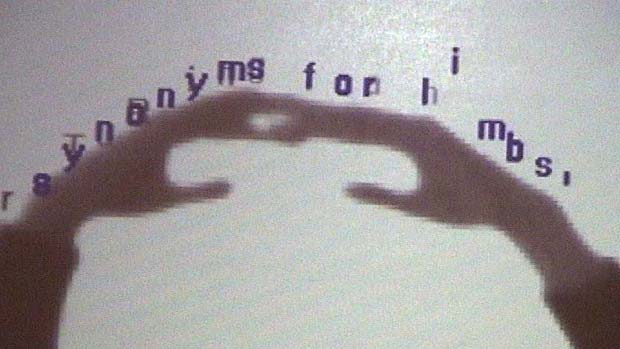

*Text Rain*은 대략 30줄 정도의 코드로 구현할 수 있으며, 특정 위치의 픽셀의 밝기들을 얻는 등 이 챕터에서 다뤘던 주제들과 연관이 있습니다. 또한 어떻게 (낙하하는 파티클의 글자들과 그 위치를 저장하기 위한)오브젝트 및 이 오브젝트들을 담은 배열들을 이해하고 적용할 수 있는지를 확인하기에 이상적인 프로젝트입니다.

========================================================  
## 관련 자료

본 챕터에서는 몇몇 입문용 이미지 처리 및 컴퓨터 비전의 기법에 대해 소개했습니다. 하지만 컴퓨터 비전은 정말 넙ㄹ고 계속해서 발전하는 영역입니다. 더 많은 정보를 위해, 아래의 서적과 온라인 자료를 살펴보시길 강력히 추천드립니다.

- Bradski, Gary. [Learning OpenCV](http://cs.haifa.ac.il/~dkeren/ip/OReilly-LearningOpenCV.pdf) (PDF)
- Cardoso, Jorge. [Computer vision techniques for interactive art](http://www.slideshare.net/jorgecardoso/computer-vision-techniques-for-interactive-art)
- Fisher, Robert, et. al. [HIPR2, The Hypertext Image Processing Reference](http://homepages.inf.ed.ac.uk/rbf/HIPR2/index.htm)
- [Introduction to Video and Image Processing](http://what-when-how.com/category/introduction-to-video-and-image-processing/)
- Levin, Golan. [Computer Vision for Artists and Designers](http://www.flong.com/texts/essays/essay_cvad/)
- Szeliski & Zisserman. [20 techniques that every computer vision researcher should know](http://www.frontiersincomputervision.com/slides/FCV_Core_Szeliski_Zisserman.pdf) (PDF)
- Szeliski, Richard. [Computer Vision: Algorithms and Applications](http://szeliski.org/Book/)
- [The OpenCV Reference Manual](http://docs.opencv.org/opencv2refman.pdf) (PDF)