# Installation up 4evr

*by [Blair Neal](http://blairneal.com/)*

私は最近、数ヶ月間、毎日、24時間、可能な限り最小限の不具合で動作し続ける異なる構成の4つのインスタレーションを人間の監視が要らないようセットアップしなければなりませんでした。これは多くのメディア・アーティストたちが常におこなう必要のあるもので、そこには長期運用に関する多くのノウハウが存在するのですが、私は自分の発見を共有したいと考えました。ここに記すのはあくまでひとつの方法であり、それぞれにまた違ったやり方があります。あなたが現場で見つけたヒントをぜひコメント欄で共有してください。

バグフリーで絶えず動かし続けるために必要なあらゆる情報を探すためにはいくつかのサイトを調べて回る必要がありました。幸いリソースや複雑さの面では今回扱ったインスタレーションのほとんどは軽度なものでしたが、安全策を持っておくことはいつだってベストプラクティスと言えます。

通常は開梱したての真新しいコンピューターを扱うため、この手順もゼロから始めます。取り上げる項目のほとんどは初期状態では逆に設定されています。

ヒント：もし複数のマシンで行う場合、まず1台目ですべてのステップを完了したあと、他のマシンをターゲットディスクモードで起動し [Carbon Copy Cloner](http://www.bombich.com/ja) などを使用して1台目の環境をミラーリングすることで可能な限り一貫性を保てます。

## ステップ1: ソフトウェアとコンピューターを準備しよう

何かを作る際には常にインスタレーションにおける長期運用のことを心に留めておきます。展示期間を通して調整の必要があるもの（または最後まで放っておいてもよいこと）は何かを考えましょう。私の経験上、それらをできるだけシンプルにしておけば Xcode を起動してコンパイルしたりアプリケーションを終了することなくオペレーターが修正や調整をするのが容易になります。今のうちに物事をシンプルにすることに時間を使えば、何か起こったときの遠隔対応が楽になるでしょう。

警告や何かしらのポップアップがアプリケーションの上に表示されないように、いくつかの初期設定を確認し、必要であればそれらをオフに設定する必要があります。この手順は OS X のバージョンごとに異なります。

Nick Hardeman 氏はこれらすべての属性値を一度に設定できるユーティリティを開発しています。[ここでチェックしてみてください](http://nickhardeman.com/610/openframeworks-configuring-osx-for-a-long-term-installation/)。

システム環境設定：

 - **デスクトップとスクリーンセーバー：** スクリーンセーバーの「開始までの時間」を「開始しない」に設定して無効化します。また、デスクトップの背景を黒、あるいはあなたのアプリないしはクライアントのロゴ画像にしておくことをおすすめします。それらを自動で切り替えるようにしてもよいでしょう。そして覚えておきたいのは**気付かれなければ壊れていないのと同じ**だということです。 :)
 - **省エネルギー：**ディスプレイとコンピューターのスリープを「しない」に設定します。また「停電後に自動的に再起動」と「コンピュータが操作不能になった場合に自動的に再起動」を有効にします（これらは OS X 10.7 以降で有効なオプションです）。
 - **ユーザーとグループ：** 「ログインオプション」の中の「自動ログイン」を「入」に設定します。
 - **ソフトウェアアップデート：**自動アップデートを無効化します。
 - **共有：**コンピューターにディスプレイが接続されていない、または物理的にアクセスできない場所にある場合、「画面共有」と「ファイル共有」をオンにしておくのを忘れないで下さい。この設定をおこなうことで同じネットワーク上にある別のコンピューターからのアクセスと操作が可能になります（セキュリティ設定に気をつけてください）。
 - **ネットワーク：**インスタレーションが外部のネットワークまたはインターネットに接続する必要がない場合、Wifi をオフにしておくのは悪い考えではないでしょう。思わぬときに「ワイヤレスネットワークを選択してください」というポップアップが出るのを避けることができます。オプションで、いつも使用するネットワークが見つからないときに現れる新規ネットワークへの接続確認ダイアログをオフにすることもできます。
 - **Bluetooth：**マウスやキーボードを挿さずに起動していると「Bluetooth 設定アシスタント」がポップアップしてイライラさせられることがあります。Bluetooth 環境設定の詳細設定から一時的にこれを無効化することができます。10.6 の場合、場所は下記の画像を参照してください。
 - **セキュリティとプライバシー：**自分なら「自動ログインを使用停止にする」のチェックが外れているかを確認します。これをしておけば再起動時にびっくりさせられることもなくなります。もし念を入れるなら、いくつかの Mac にいまだ存在する赤外線リモコンレシーバーを無効化しておくことで Apple TV リモコンによるイタズラを防ぐことができます。この設定をおこなうには「セキュリティとプライバシー」環境設定の「一般」タブから「詳細...」パネルを開き（10.8 以上の場合）「リモートコントロール赤外線レシーバーを無効にする」のチェックを外します。
 - **通知：** [通知センターを完全に無効化する](http://www.tekrevue.com/tip/how-to-completely-disable-notification-center-in-mac-os-x/)か、下の画像のように「おやすみモード」がずっと続くように時間を設定します。

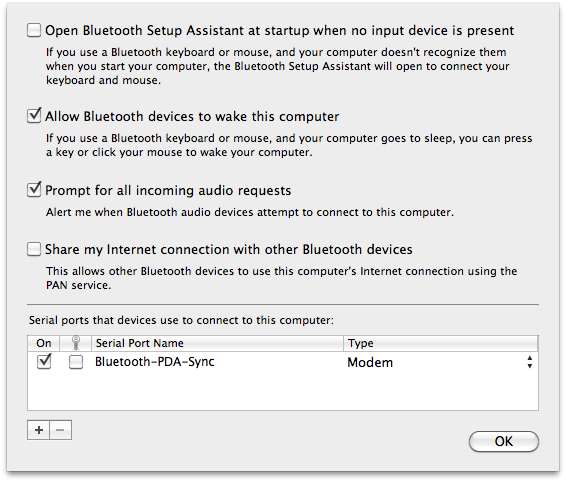

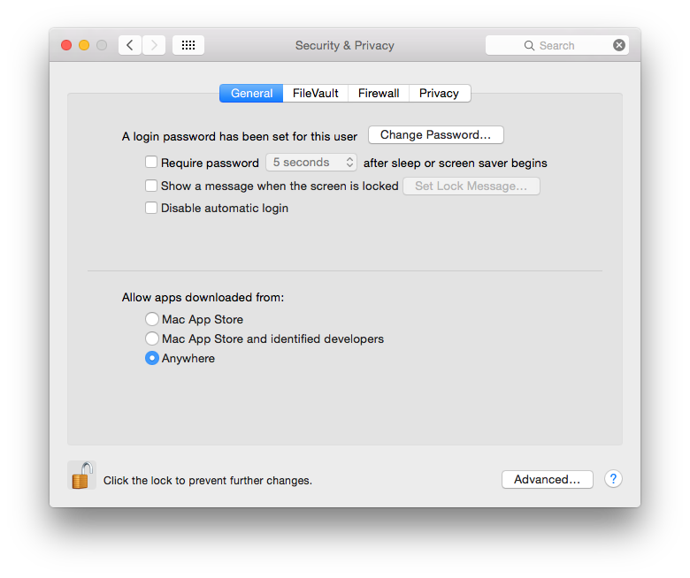

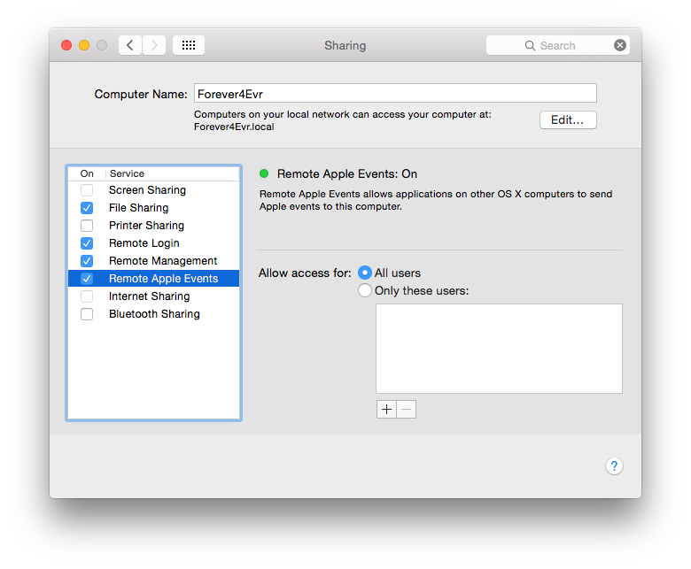

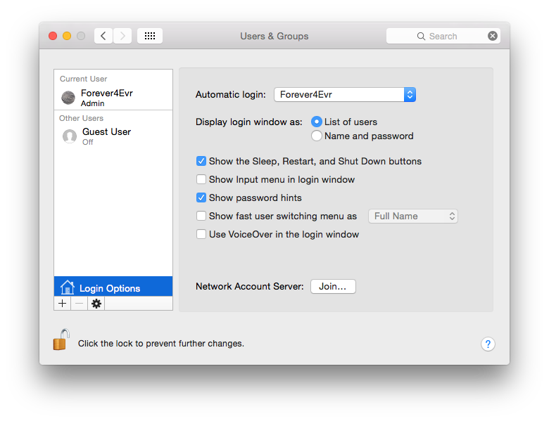

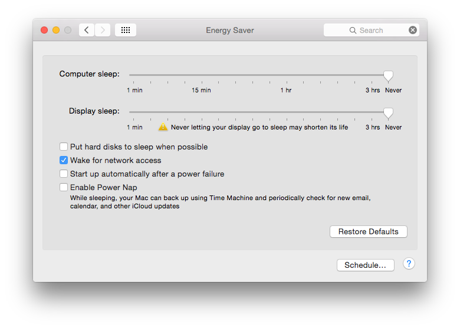

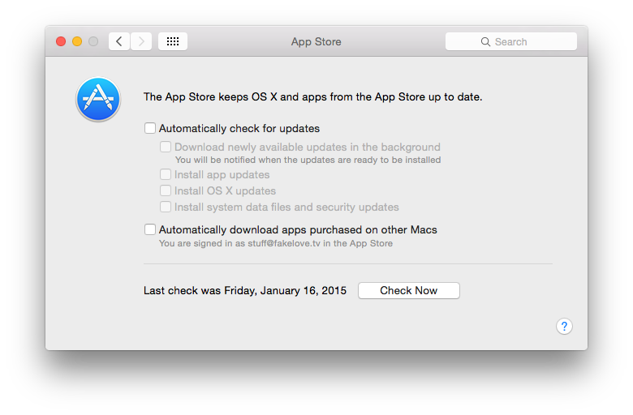

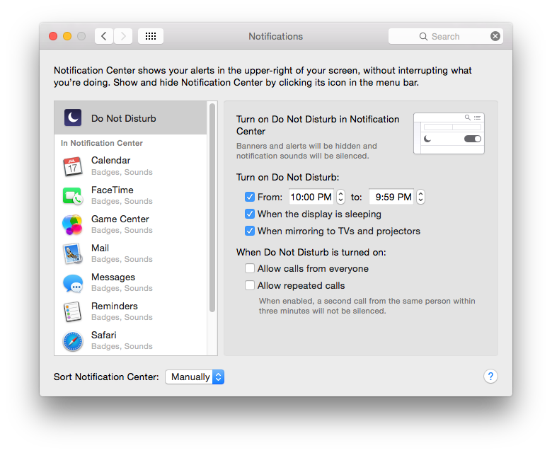

また、以下のコマンドを実行するか Problem Reporter.app をリネームすることで「アプリケーション〜は予期せず終了しました」のダイアログとそれに続くバグリポートメニューを無効化できます。

```bash
sudo chmod 000 /System/Library/CoreServices/Problem\ Reporter.app
```
[Tinkertool](http://www.bresink.com/osx/TinkerTool.html) は OS X の .plist ファイルを変更することでシステム環境設定がカバーしていない様々な設定を有効化・無効化することができます。

その他にも ```/System/Library/CoreServices``` 内の各ファイルをリネームすることで一時的にその機能を無効化できます。
たとえば「通知センター」を「通知センター_DEACTIVATE」等にすれば、あの最低な通知センターのポップアップが現れることはなくなるでしょう。

OSX 10.9 以降、アップルは App Nap と呼ばれるおかしな機能を有効にしました。これは簡単に言えばアプリケーションがアクティブでないときにリソースの節約をおこなうものですが、問題を引き起こすこともあります。[こちらのページ](http://www.tekrevue.com/tip/disable-app-nap-os-x-mavericks/)に無効化する方法が記載されています。

必要であれば以下のコマンドでデスクトップアイコンを非表示にすることもできます。

```bash
defaults write com.apple.finder CreateDesktop -bool false
```


## ステップ2：ソフトウェアを起動する

電源ケーブルが抜けた、電気が来なくなった、予備バッテリーのための予算やスペースがないなどなど...。ステップ1で、停電やフリーズ後にマシン自体を自動で再起動する設定について書きましたが、その際デスクトップが晒されっぱなしにならないようにアプリケーションの再起動もおこなう必要があります。方法は様々ですが、OS X のビルトインツールを使用するのがもっともシンプルです。「ユーザとグループ」環境設定から該当アカウントの「ログイン項目」パネルを開いて対象のアプリケーションをドラッグ&ドロップします。こうすることでシステム起動時に自動的にアプリケーションが起動します。

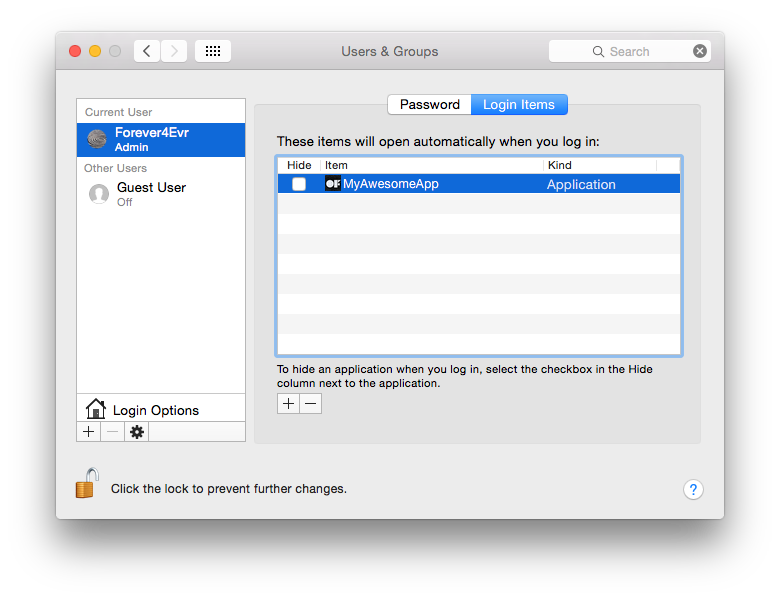

## ステップ3：動かし続ける

アプリケーションの起動を確認するための方法をいくつか紹介します。

### Launchd

ローンチデーモンはマシンの起動時にアプリケーションを読み込み、継続的に再起動をおこなうためのまた別の方法です。Launchd plists は cron の代わりとしても非常に有用で、カレンダーのスケジュールに沿って何かを定期的に実行することができます。Automator と iCal の組み合わせでも同様のことがおこなえるので、好みの方法を選ぶとよいでしょう。

[アップルのドキュメント](http://developer.apple.com/library/mac/#documentation/MacOSX/Conceptual/BPSystemStartup/Chapters/CreatingLaunchdJobs.html)に Launch Agent と Launch Demon の様々な使い方が記載されています。

Launch Demon と Launch Agent の使い分けについては[こちら](http://techjournal.318.com/general-technology/launchdaemons-vs-launchagents/)を参照するとよいでしょう。一般的にはある物事をユーザのログイン時に実行したいかどうかによります。ごく普通のアプリケーションを起動させたい場合は Launch Agent が適しています。

デーモンには .app 自身ではなくアプリケーションパッケージ（アプリケーションアイコンを右クリックし「パッケージの内容を表示」を選択します）内の ```Contents/MacOS``` に入っているファイルを指定するということを覚えておいてください。さもないとデーモンがアプリを起動してくれない！とハマることになります。

launchd の例は [admsyn](https://gist.github.com/4140204) を参照するとよいでしょう。

もちろん、上の gist に載っているテンプレートを使用してあなた自身の launchd 用 .plist を作成しても構いません。ターミナルで ```man launchd.plist``` と入力すればコントロール可能なオプションについてすべての情報が得られます。また、Lingon（App Store で 4.99ドル）もしくは [Lingon X](http://www.peterborgapps.com/lingon/) を使用すれば Launchd の設定がより楽になります。

Lingon のツールバーから + をクリックすると、基本的なエージェントとなる plist が新規作成されます。この plist を以下のように設定しましょう。

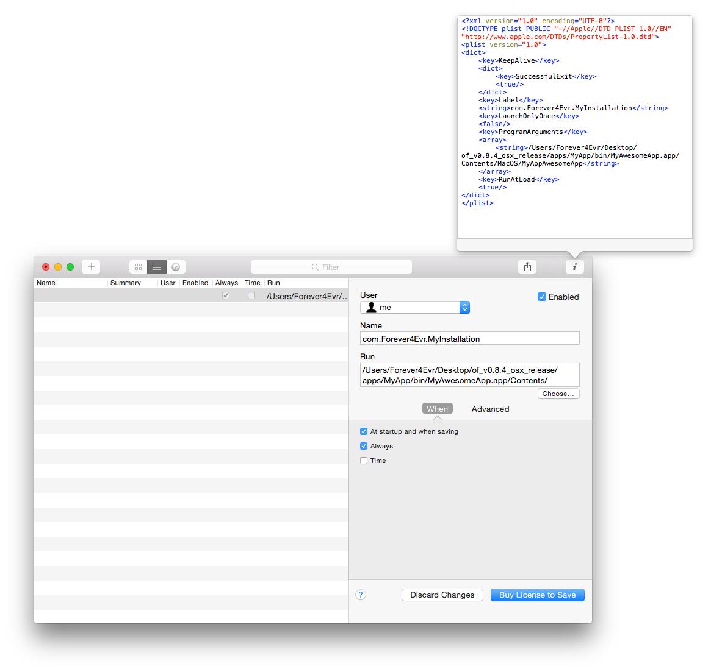

オプションとしてこの plist に "Successful Exit" のためのキーを追加することができます。これを追加するとアプリケーションの終了ステータスに応じた再起動の有無を設定できます。値が true の場合は正常終了（戻り値が 0）したときにのみ再起動をおこない、false の場合は正常終了以外（戻り値が 0 以外）のときに再起動をおこないます。有効化するには「詳細」タブの "SuccessfulExit" をチェックするか、上図のようにマニュアルで追加します。

### シェルスクリプト + Cron ジョブ

(以下の非常に有用な tips は [Kyle McDonald](http://kylemcdonald.net/) から教えてもらいました。)

この方法は launchd に対してやや非推奨とされています ー ここで学ぶのと同様の方法で Lingon や launchd からシェルスクリプトを実行できます。シェルスクリプトは最高の友です。下記のスクリプトと CronniX というアプリケーション（または Lingon）の助けがあれば Cron ジョブを使って現在起動中のプロセス一覧を確認することができます。一覧に対象のアプリケーション（この場合は Twtter.app）が見当たらない場合はそれを再び起動し、そうでない場合は何もしません。スクリプトをダウンロードするかテキストエディターに打ち込み Twitter.app の部分とファイルパスををあなたのアプリケーション名で書き換えましょう。if 文で拡張子 ".app" を忘れないでください！

```
#!/bin/sh

if [ $(ps ax | grep -v grep | grep "Twitter.app" | wc -l) -eq 0 ]; then
    echo "Twitter not running. opening..."
    open /Applications/Twitter.app
else
    echo "Twitter running"
fi
```

ファイル名を "KeepOpen.sh" として、アプリケーションと同じフォルダか適当な場所に保存します。

ファイルを作成したら実行可能にする必要があります。ターミナルで新規ウィンドウを開いて `chmod +x` と入力し、続けて先ほど作ったファイルへのパスを入力します（ターミナルのウィンドウへファイルをドラッグ&ドロップして入力することもできます）。例えば以下のようになるでしょう。

    4Evr-MacBook-Pro:~ Forever4Evr$ chmod +x /Users/Forever4Evr/Desktop/KeepOpen.sh

これで Cron ジョブとして設定する準備ができました。 _ヒント：ターミナルを使わず、単に拡張子を ".command" に変更することでスクリプトをテストすることもできますが、どちらでも同じです。_

Cron ジョブはタイマーで定時実行するよう設定される低レベルなシステムタスクです。ジョブの書き方についてはこの説明の範囲外ですが数多くの参考サイトが存在します。その代わりに CronniX が多くの難しい仕事を引き受けてくれるでしょう。

CronniX をダウンロードしたら起動して新規ジョブを作成しましょう。開いたパネルの「コマンド」セクションに KeepOpen.sh を指定し、「シンプル」パネル内の分、時、日、月などすべてのチェックボックスをチェックします。これはこのジョブを毎分、毎時、毎日、毎月実行せよという意味です。もっと違った頻度で実行させたい場合はスライダーで弄ってみてください。

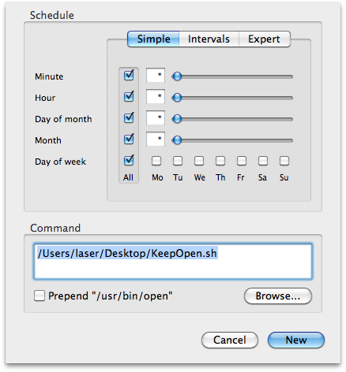

「新規」を押してパネルを閉じ、ツールバーから「保存」を押してシステムの Crontab へ登録します。少し待つと毎分アプリケーションを起動し始めます。

これによって、もし予期せぬクラッシュが起こっている場合でも1分以上ダウンしていることがなくなります。

### ノン Cron ジョブ - シェルスクリプトによる方法

    \#!/bin/bash

    while true
    do
    #using open to get focus
    echo "Trying to open empty example"
    open -a emptyExample
    sleep 10
    done

上のスクリプトをテキストエディターに入力して "KeepMyAppAlivePlz.command" という名前で保存したら、先ほどと同様に `chmod` コマンドで実行可能にし、こちらも同様にログイン項目にドラッグ&ドロップします。このスクリプトは10ミリ秒ごとにアプリケーションの起動を試みますが、すでに起動していた場合は OS の判断によってそれ以上起動されることはありません。

現場であれリモートであれ、インスタレーションのチェックをする際はどんな時でも、捕まえ損ねた例外がないか確認するためにコンソール.app をチェックしましょう。これはバギーなプログラミングを解決してくれるものではなく、単に物事を円滑に保つためのヘルパーです。さらに、なぜクラッシュが発生したのかについてメモを残しておくことで問題の核心により早く辿り着くことができます。

クリックやキー操作といったより OS 固有の操作をおこなう場合は AppleScript も良い選択です。

## ステップ4：定期的な再起動

これは予防策的でありつつも迷信的なため、なぜいいアイデアなのか具体的な理由を知っている人がいたら教えてください。アプリケーションによっては手の出しようのないメモリリークやOSのバグに遭遇することがあります。そうなってしまった場合には、毎日ないし毎週再起動をおこなうのもよいアイデアです。

もっともシンプルな選択肢は「省エネルギー」環境設定から「スケジュール...」パネルを開いて適当な時間を設定することです。必要であれば夜間やその他の使用されない時間帯にシステムを終了するよう設定して負荷を軽減することができます。発熱が問題を引き起こすこともあるので、もしマシンを休ませるチャンスがあるのならぜひこの設定をおこなった方がいいでしょう...電力の節約にも役立ちます。

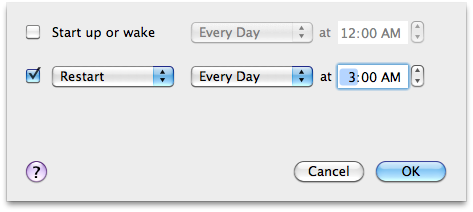

また、CronniX を使って任意の頻度でシステムの再起動をおこなうシェルスクリプトを設定することもできます。

そしてもう一つの選択肢は(あなたがターミナルやシェルスクリプトに関わりたくない場合) iCal を使って Automator の iCal イベントを呼び出すという方法です。スケジューリングについても、再起動スケジュールの可視化という点についても、おそらくこの方法はより簡単です。試しに Automator を起動して、新規 iCal イベント(カレンダーアラーム)を作成してみましょう。

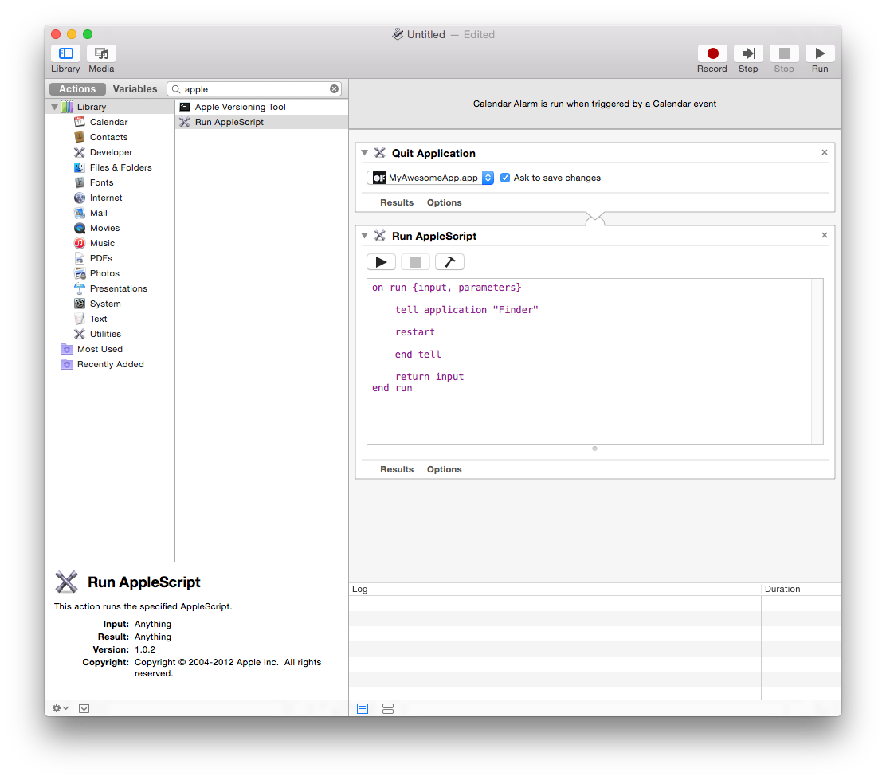

期待した通りに動いたら保存します。保存すると iCal が起動しアクションとして登録されているので、あとは好きな頻度の繰り返しを設定するだけです。再起動やスクリプトの実行時にあなたへメールで知らせるなどの設定も可能です。

プログラムを終了して再起動する間にバックグラウンドまたはフォアグラウンドで何かをおこないたいという場合は以下のようにします（一時停止は終了と再起動の実際の実行にかかる時間を合わせたものになります）。

## ステップ5：リモートチェックイン

[SSH](http://www.mactricksandtips.com/2009/06/ssh-into-your-mac.html) で VNC（[RealVNC](http://realvnc.com/) と Chicken of the VNC がよく併用されます）を使用するための選択肢として [Logmein](http://www.logmein.com/) や [Teamviewer](http://teamviewer.com/) などの Web サービスがあります。どれを選ぶかはあなたにとって使いやすいかどうか、そしてどの程度リモートメンテナンスの必要があるのかによりますが、これらを使わずに後のステップで説明するロギング手法を使用する選択肢もあります。

インスタレーション用のマシンとあなたの PC との間で Dropbox フォルダを共有しておくと非常に便利です。ほとんどの画面共有サービスもファイル共有機能を持っていますが、Dropbox はただただ最高です。

ことディスプレイに画面表示をおこなわないインスタレーションにおいて、DHCP で動的に割り当てられた IP アドレスを確認するのは苦痛以外の何物でもありません。Robb Godshaw はこれを少しでも和らげるため、マシンの起動から30秒後に IP アドレスを読み上げさせる Automator スクリプトを書きました。[Instructables でダウンロードできます](http://www.instructables.com/id/Configuring-a-Mac-for-an-always-on-operation/steps/9)。

## Step 6: テスト、テスト、テスト...


インスタレーションに向けてソフトウェアがばっちり整ったら、できる限り本番を想定した環境でこれまで見てきた方法と自動化スクリプトをテストしてみましょう。

すべての物事を説明できるわけではないので、何かが起こってしまっても自分を責める必要はありません。しかしそのとき、このリストがあなたのフラストレーションを少しでも軽減する役に立てば幸いです。幸運を！


## おまけ：ロギング

数週間〜数ヶ月間運用する場合、リモートログインを必要としない監視方法を用意するとよいでしょう。おすすめは、特定の情報をテキストファイル（リンク済みの Dropbox で管理します）に書き込み、さらにそれを Web でチェックできるようにサーバーへアップロードする方法です。

インスタレーションの状態に関してどんな情報を得たいかによっていくつかの方法があります。

現在走っているプロセスをリストアップするためには以下のコマンドが使用できます。

    ps aux (or ps ax)


(ps コマンドについての情報は[こちら](https://developer.apple.com/library/mac/documentation/Darwin/Reference/ManPages/man1/ps.1.html)) – さらに、特定のアプリケーションに関する情報のみにフィルタリングします。

    ps aux | grep "TweetDeck"

こうすると以下のような結果が得られます。

    USER             PID  %CPU %MEM      VSZ    RSS   TT  STAT STARTED      TIME COMMAND
    laser          71564   0.4  1.7  4010724 140544   ??  S    Sun03PM  14:23.76 /Applications/TweetDeck.app/Contents/MacOS/TweetDeck -psn_0_100544477
    laser          95882   0.0  0.0  2432768    600 s000  S+   12:11PM   0:00.00 grep TweetDeck

CPU 使用量、メモリ使用量(全体に対する割合)、ステータス、起動日時、アップタイム等の情報が得られました。

これらを以下のようにしてテキストファイルに書き込みましょう。

    ps aux | grep 'TweetDeck' >> $HOME/Dropbox/InstallationLogs/BigImportantInstall/Number6ProcessLog.txt

この行の意味は次の通りです。

- 起動中のプロセスを教えて (```px aux```)
- "Tweetdeck" を含む行だけちょうだい (```grep 'Tweetdeck'```)
- そしてそれらをこの場所にあるテキストファイルに書き込んでね (```>> path\_to\_text\_file```)

デーモンや cron に設定できるように、これを実行可能なシェルスクリプトにする必要があります。ステップ 3 に戻って Lingon と launchd を使用したスクリプトの定期的な実行方法を思い出しましょう。指定したアプリケーションが起動していない場合、その grep プロセスのみが返ってきます。これを記録しておくのはいいことです。なぜなら、アプリケーションが起ち上がっていなければ何もログが残らないので、その状態がどれだけの時間続いているのか知る術がありません。ですがこの grep プロセスをロギングしておけば、少なくともそれをチェックしたことだけは分かります。また grep コマンドはより正確にチェックした時間を教えてくれます。他のアプリでは起動時間とアップタイムしか得られません。

もう少し突っ込んでみましょう。仮に、接続している Triplehead2Go がかなり不安定で、マシンの再起動後にプロジェクターがオフになっているなどしてディスプレイないしはプロジェクターを必ずしも認識してくれないという状況だとしても、現在有効な解像度をログ出力できるのです！ターミナルに以下の行を入力してみてください。

    system_profiler SPDisplaysDataType

接続中のディスプレイと、その解像度や名前を含むいくつかのメタデータを返します。

常に 3840x720 の解像度で動作していることを確認したいか、解像度が変更されたことを記録したいとします。以下の行を試してみましょう。

    system_profiler SPDisplaysDataType | grep Resolution

"Resolution: 3840×720" が返されます。そして、起動中のプロセスとアクティブな解像度を一緒に記録するシェルスクリプトは以下のようになります。

    #!/bin/bash
    ps aux | grep 'YourAppName' >> /Users/you/filepath/Install6ProcessLog.txt
    system_profiler SPDisplaysDataType | grep Resolution >> /Users/you/Dropbox/Install6ProcessLog.txt

ワクワクしてきましたか？さらに、見えないところでおかしなことが起こっていないか確認するために定期的にスクリーンショットを撮りたくなると思います。そこで次の行を書き加えてみましょう。

    screencapture ~/Desktop/$(date +%Y%m%d-%H%M%S).png

これで指定フォーマットの日時をファイル名としたスクリーンショットがデスクトップに保存されます。パスは必要に応じて変更してください。データ容量が大きい場合は表示に問題が起こることがあるので、5分よりも1時間おきくらいがよいと思います。いつもどおり、デプロイ前にテストしましょう！

さらに付け加えるなら、インスタレーションに関する各種情報の一覧表を生成する Web ページを作っておくと便利です。

このようなロガーでは不十分な場合はメールアラートが使えます。何らかの不具合をメールで通知するシステムを構築すれば手動でチェックする必要がなくなります。これはコマンドラインと手元のツールで実現できますが、手順はやや複雑です。これから説明するのはごく一般的な手順なので、それぞれの環境に合わせて適宜変更してください。

まず最初に postfix の設定をしましょう。これで簡単にターミナルからメールを送信できるようになります。[こちらに書いてある手順](http://benjaminrojas.net/configuring-postfix-to-send-mail-from-mac-os-x-mountain-lion/)にできる限り忠実に従ってください。

Gmail を使用している場合、アカウント情報は以下のようになるでしょう。

*InstallationSupport@gmail.com*

*pass: yourpassword*

記事のステップ1の passwd ファイルは以下のようになります。

*smtp.gmail.com:587 installationSupport@gmail.com:yourpassword*

さっそくテストしてみましょう。以下のコマンドを実行します。

	echo “Hello” | mail -s “test” “InstallationSupport@gmail.com”

次にこれをアプリケーションの死活監視をするプロセスと組み合わせます。以下のスクリプトを適宜調整すれば動作するでしょう。

    #!/bin/sh
    if [ $(ps ax | grep -v grep | grep "YourApp.app" | wc -l) -eq 0 ] ; #"YourApp.app" をあなたのアプリケーション名に置き換えてください     
    then
    	SUBJECT="Shit broke"
    	EMAIL="InstallationSupport" #宛先
    	EMAILMESSAGE="This could be for adding an attachment/logfile"
		echo "The program isn't open - trying to re-open">$SUBJECT
		date | mail -s "$SUBJECT" "$EMAIL"  "$EMAILMESSAGE"

		echo "YourApp not running. Opening..."

		open /Applications/YourApp.app #reopen the app - set this to an exact filepath
    else
		echo "YourApp is running"
    fi

最後に、上記のスクリプトが lanuchd で起動するよう、ステップ3の手順に従ってセットアップする必要があります。5分毎にチェックをおこない、もしもクラッシュしていたらメールを受け取ることができます。必要に応じて if 文の中の条件を変えれば、たとえば解像度の変更をモニタリングすることもできます。

## メモリリーク・キラー

アプリケーションのメモリ使用量が一定の値を超えた際に再起動をかける手順を上記のプロセスに組み合わせる方法については[こちらの記事](http://blairneal.com/blog/memory-leak-murderer/)が参考になります。

おまけ：MadMapper を使っているなら[この AppleScript](http://blairneal.com/blog/applescript-to-automatically-fullscreen-madmapper-for-installations/) が役に立ちます。MapMapper の起動、フルスクリーン表示メニューの選択、やっかいなダイアログで自動的に "OK" を選択する一連の作業をおこなってくれます

## その他のリソース：

### MAC OS X

[ofxWatchdog](https://github.com/toolbits/ofxWatchdog) はアプリケーションに致命的なエラーが起こった場合でも強制的に再起動をかけ続けてくれる素晴らしいアドオンです。
This is an amazing addon for openFrameworks apps that keeps your application open even after a large range of failures: [ofxWatchdog](https://github.com/toolbits/ofxWatchdog)

[Configuring Mac OS X for Interactive Installations](http://vormplus.be/blog/article/configuring-mac-os-x-for-interactive-installations)

[ライブビジュアル / VJing 向けの同じような tips 集](http://vjforums.info/wiki/setting-up-os-x-for-vjing/)

[これまで書いてきた設定を一ヵ所でおこなうための Nick Hardeman によるユーティリティ](http://nickhardeman.com/610/openframeworks-configuring-osx-for-a-long-term-installation/)

同じくNick Hardeman による [ofxMacUtils](https://github.com/NickHardeman/ofxMacUtils)

### LINUX

[https://github.com/openframeworks/ofBook/blob/master/chapters/installation_up_4evr_linux/chapter.md](https://github.com/openframeworks/ofBook/blob/master/chapters/installation_up_4evr_linux/chapter.md)

### RASPBERRY PI

[https://sfpc.hackpad.com/rPi-run-4-ever-qFgafqYPM54](https://sfpc.hackpad.com/rPi-run-4-ever-qFgafqYPM54)

### WINDOWS:
もしここで紹介してきたようなタスクを Windows でおこなう方法を探しているのなら、Stephen Schieberl による [StayUp](http://www.bantherewind.com/stayup) と名付けられた最高のスクリプトをチェックしてみてください。また [Restart on Crash](http://www.softpedia.com/get/System/File-Management/Restart-on-Crash.shtml) という記事や、OS の制御をスクリプティングするための [NirCmd](http://www.nirsoft.net/utils/nircmd.html) というツールも存在します。[Eva Schindling によるステップ・バイ・ステップのセットアップガイド](http://www.evsc.net/home/prep-windows-machine-for-fulltime-exhibition-setup)もぜひチェックすることをおすすめします。