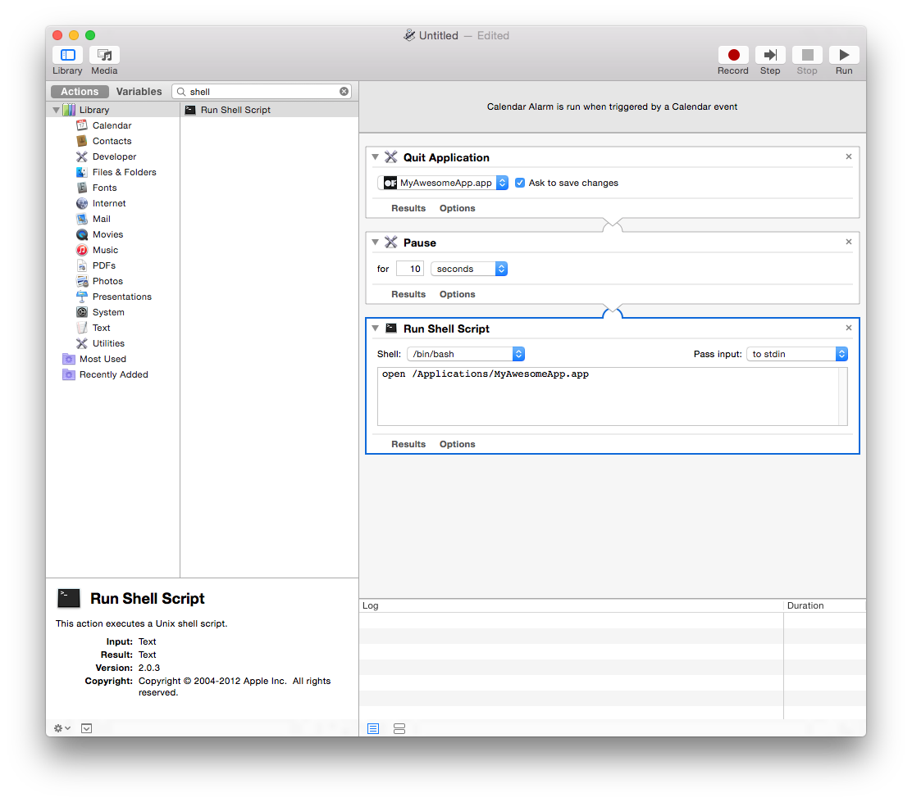

#Installation up 4evr#

*[Blair Neal](http://blairneal.com/) 에 의해 작성*

At work I recently had to set up a four installations of different configurations that would need to run all day, every day, 24 hours a day for a couple months with as few crashes or glitches as possible and without anyone going to check on them. This is something that a lot of media artists need to do all the time, and there are a bunch of different tricks and tips to keeping things up for an extended period, I figured I'd share my findings. There are alternate ways to do many of these tasks and this is only one road so please share some tips you've picked up out in the field down in the comments box below.

I had to do several searches in a couple different places to find all the information I needed to keep everything consistently up and bug free. Luckily most of the installations I was dealing with this time were fairly light in terms of resources and complications, but it's always best practices to have a safety net.

I usually run these off brand new, unboxed computers so this is sort of starting from scratch. Most of the things I point out are set to the opposite by default.

Tip: if you're doing multiple computers, do these prep steps on one of them and just boot the others into target disk mode and use something like [Carbon Copy Cloner](http://www.bombich.com/) to mirror the first one on the next so everything is as consistent as possible.

##Step 1: Prep your software and the computer
##단계 1: 여러분의 소프트웨어와 컴퓨터를 준비합니다.

여러분의 소프트웨어를 빌드, 혹은 앞으로 소행될 어떤 것이든, 오랫동안 동작할 설치임을 명심하시기 바랍니다. 설치의 시작부터 누가 되었든 간에 어떤 사람에 의해 조정될 필요가 있는 것이 어떤 것들인지를 기획하시기 바랍니다. 제 경험에 비추어 보면, 그것들은 가능한한 간단해야 합니다, 따라서 관리자가 고치기 쉬워야 하지, Xcode를 열어서 컴파일하거나 앱을 벗어나지 않도록 해야 합니다.  지금 여러분이 이런것들을 간단하게 만드는데 드는  시간이 나중에 뭔가 문제가 생겼을때 원격 디버깅을 하는 시간을 절약할 수 있을것입니다.

여러분의 어플리케이션이 항상 최상위에 있도록 하기 위해 아래의 사항들을 훑어가며 몇몇 자동화된 세팅을 끄거나 해제해야 합니다. 내용들은 10.7, 10.8, 10.9, 10.10 등등 여러분이 구동하는 환경에 따라 다소 차이가 있을 수 있습니다.

Nick Hardeman has made a utility application for setting all of these attributes and more from one location - [check it out here](http://nickhardeman.com/610/openframeworks-configuring-osx-for-a-long-term-installation/)

Nick Hardman은 이러한 각종 요소들을 한곳에서 세팅할 수 있는 유틸리티 프로그램을 만들었습니다 - [이곳을 확인하세요](http://nickhardeman.com/610/openframeworks-configuring-osx-for-a-long-term-installation/)

시스템 환경설정에서:
- **데스크톱 및 화변보호기:** 화면보호기를 해제하세요. 시간설정을 "절대안함"으로 세팅하시기 바랍니다. 저는 또한 배경화면을 블랙/ 혹은 여러분의 어플리케이션 스크린/클라언트의 로고 로 바꾸는것을 추천드립니다 - 심지어 이런것들을 자동으로 변경하게 할 수 있습니다. - 명심하세요 - **이 설정들은 누군가 알아차리기 전에는 망가진것이 아니랍니다 :)**

- **Desktop and Screensaver:** Disable your screensaver. Set it's time to "Never." I also suggest changing your desktop background to either black/a screenshot of your app/you client's logo - you can even set these to change automatically - remember - **it's not broken until someone notices** :)
 - **에너지 절약:** 디스플레이 잠자기와 컴퓨터 잠자기를 절대안함으로 설정하세요. "전원 실패 이후 자동으로 시작하기"를 활성화하고, "컴퓨터가 멈췄을 경우 자동으로 시작하기"를 활성화하세요. (이 설정들은 10.7 또는 이후 버전부터 가능합니다)
 - **사용자 및 그룹:** 로그인 옵션으로 가서 "자동 로그인"을 활성화하세요
 - **소프트웨어 업데이트:** 자동 업데이틀 끄세요
 - **공유:** 만약 구동되는 컴퓨터가 모니터가 없거나 혹은 접근할 수 없는 곳에 있다면, 파일공유와 화면공유를 켜는것을 잊지 마십시오. 이렇게 하면 같은 네트워크에 있을 때(이는 옵션으로, 여러분이 보안을 염려한다면 드리는 말씀입니다) 컴퓨터의 접근과 제어가 가능합니다.
 - **네트워크:** 만일 원격제어가 필요없거나 혹은 설치에 있어서 인터넷 연결이 필요가 없다면, wifi를 끄는것은 나쁘지 않은 생각입니다. 적어도 "무선 네트워크를 선택하세요"라는 팝업이 뜰 일은 없을것입니다. 또한 새로운 네트워크에 연결시에 물어보기 옵션을 끌 수도 있습니다.
 - **블루투스:** 만약 마우스 혹은 키보드를 연결하지 않고 구동할 경우, 가끔 여러분의 어플리케이션에서 "블루투스 키보드/마우스 셋업" 팝업이 떠서 귀찮을 수 있습니다. 블루투스 환경설정에서 고급설정에 들어가 이를 임시로 끌 수 있습니다. 10.6은 아래를 살펴보세요. 
 - **보안:** "자동 로그인 끄기"가 체크해제 되었는지 꼭 확인하시기 바랍니다. 여러분이 정말 편집자적인 성격이라면, 구형 맥이나 맥북에 존재하는 IR 리모콘 리시버를 해제할 수 있습니다. 가끔 짖궃은 사람들이 Apple TV 리모콘을 이용해 장난하는 것을 방지할 수 있습니다. 이것을 해제하려면, 보안->일반->고급(10.8 이상)으로 간 다음 "IR리시버 제어 해제"를 체크하시기 바랍니다.
 - **알림 센터:** 
 - **Notification Center:** You can either [disable Notification Center completely](http://www.tekrevue.com/tip/how-to-completely-disable-notification-center-in-mac-os-x/), or set your "Do Not Disturb" to basically on be on forever by setting it with overlapping times like the screenshot below


또한, "프로그램이 비정상적으로 종료되었습니다" 메시지 및 버그리포트 창이 뜨는것을 터미널에서 아래의 커맨드를 입력하거나, 혹은 문제리포트 앱의 이름을 바꾸는것으로 방지할 수 있습니다:

```bash
sudo chmod 000 /System/Library/CoreServices/Problem\ Reporter.app
```
OSX에서 특정한 기능을 활성/비활성화 하기위하여 특정 .plists파일을 수정할 수 있는 유용한 툴로  [Tinkertool](http://www.bresink.com/osx/TinkerTool.html)이 있습니다. 이 도구를 이용하여 시스템 환경에서 다루지 못하는 특정한 기능들을 활성화 또는 비활서오하 할 수 있습니다.

또한, 일시적으로 컴퓨터상의 기능을 비활성화 하기위해 사용중인 컴퓨터의 이 파일경로 안의 파일들의 이름을 바꿀 수도 있습니다: /System/Library/CoreServices

"Notification Center"(알림센터)를 "Notification Center_DEACTIVATE"으로 이름을 바꾸거나 (혹은 이동)할 수도 있습니다 - 이렇게 하면 "도움을 얻을 수 있는" 불쾌한 알림센터 팝업을 방지할 수 있습니다.

필요하다면, 아래의 터미널 명령어로 데스크탑의 모든 아이콘을 숨길 수 있습니다:
```bash
defaults write com.apple.finder CreateDesktop -bool false
```

##단계 2: 여러분의 소프트웨어 부팅하기

플러그가 뽑히고, 전원이 나가게 될 때, 대부분은 배터리 백업등을 위한 공간이나 예산이 없을 것입니다. 위에서, 저는 전원 실패 또는 멈춤 증상이후 모든것을 자동으로 재시작 하는 법을 다뤘지만, 여전히 여러분의 앱이 부팅되면 자동으로 동작하게 해야할 필요가 있습니다. 어플리케이션을 자동으로 시작하게 하는 방법은 다주 다양합니다만 - 가장 간단한 방법은 OSX에 내장된 도구를 이용하는 것입니다 : 시스템 환경설정의 "계정" 패널에서, "로그인 항목"을 선택한 다음, 자동으로 시작하게 할 어플리케이션을 드래그하여 넣어주면 됩니다.


##Step 3: Keep it up (champ!)

There are several ways to make sure your application goes up and stays up -
여러분의 어플리케이션을 최상위에 올리는 법은 여러가지가 있습니다-

###Launchd

런치 데몬을 이용하면, 자동으로 시작하게 할 뿐만 아니라, 만약 프로그램이 종료되더라도 자동으로 다시 열리게 할 수 있습니다. Launchd plists는 cron job을 대신할 수 있는 아주 유용한 기능이며, 이를 이용하면 주기적으로 혹은 캘린터의 날짜에 따라 특정한 일을 수행하게 할 수 있습니다. 이런 비슷한 일은 iCal과 automator를 조합할 수 도 있는데, 여러분이 가장 편리한 방법을 사용하시면 됩니다.

여기 [애플 문서](http://developer.apple.com/library/mac/#documentation/MacOSX/Conceptual/BPSystemStartup/Chapters/CreatingLaunchdJobs.html)에서 Launch Agents와 Launch Daemons를 다양하게 사용하는 방법을 살펴볼 수 있습니다.

[Launch Daemon과 Launch Agent의 차이점](http://techjournal.318.com/general-technoloty/launchdaemons-vs-launchaents/) 문서 (기본적으로 사용자가 로그인하거나 혹은 아니더라도, 일반적인 앱을 런칭하는것과 같은 대부분의 간단한 옵션의 경우 Launch Agent를 사용하면 됩니다)

또한 기억해야 할 사항은(!) 아마도 여러분의 launch daemon이 여러분의 앱 자체가 아닌, .app 패키지 내의 파일을 가리키도록 해야 한다는 점입니다 -  .app 패키지(여러분의 앱을 우측클릭 한 다음 "패키지 내용 보기") 내의 MacOS 폴더내의 파일을 가리켜야 합니다. 그렇지 않으면 launchdaemon은 여러분의 앱을 런칭하지 못해 어리둥절할 수도 있습니다.

[admsyn](https://gist.github.com/4140204)에서 launchd 예제들을 살펴볼 수 있습니다.

Of course you could make the launchd plist yourself for free from a template like above. You can read all about them with the command "man launchd.plist" typed into terminal to get an idea of what each toggle controls. One quick method to setting up Launchd is to use Lingon ($4.99 in the App Store) or [Lingon X](http://www.peterborgapps.com/lingon/)
당연히 위의 템플릿에서 자유롭게 여러분만의 launchd plist를 만들 수 있습니다. 터미널에서 "man launchd.plist"를 입력해 설명서를 읽어봄으로써 어떻게 제어할 것인지를 살펴볼 수 있습니다. 빠르게 Launchd를 세팅하는 한가지 방법은 Lingon(앱스토어에서 $4.99 달러에 구입할 수 있습니다)를 사용하거나, [Lingon X](http://www.peterborgapps.com/lingon/)을 사용하는 것입니다.

In Lingon, hit the + to create a new launchd plist. Just make it a standard launch agent. Now Set up your plist like so:
Lingon에서, 새 launchd plist를 +버튼을 눌러 생성합니다. 일반적인 launch agent를 만드는 것이죠. 그리고 아래와 같이 여러분의 plist를 세팅하면 됩니다:


추가적인/부가적인 것중 하나는 "성공적으로 종료"를 위해 plist에 추가적인 키를 추가할 수 있다는 겁니다. 이렇게 하면, 여러분의 앱이 정상적으로 종료(비 정상적인 종료가 아닌, 내부적으로 ESC키를 누를 때)되었을 때가 아니라면, 앱이 재실행되지 않습니다. 뭔가를 체크하거나, 혹은 OSX 가 앱을 재실행하는것을 막지 못할 때 유용하지요. 키를 쉽게 추가하려면, 고급탭을 클릭한 뒤 "Successful exit" 체크박스를 체크하거나- 그냥 위의 스크린샷처럼 수동으로 추가해주면 됩니다.

###쉘스크립트 + Cron Job 방법 
(아래의 엄청 유용한 팁은 [Kyle McDonald](http://kylemcdonald.net/)에서 가져왔습니다)

이 방법은 launchd 방법과 관련하여 사용되지 않는 범주에 속합니다 - 이 쉘 스크립트는 위에 언급했던 것과 같은 방법으로 Lingon 그리고 Launchd에서 동작할 수 있습니다. 쉘 스크립팅은 여러분의 베프입니다. 아래의 스크립트와 함께 CronniX(또는 Lingon)이라 불리우는 어플리케이션을 사용하면, 시스템 상의 현재 동작하고 있는 프로세스들을 체크할 수 있도록 cronjob을 사용할 수 있습니다. 만약 여러분의 앱이 이 리스트에 존재하지 않으면, 스크립트는 이 앱을 다시 엽니다. 존재할 경우, 아무일도 수행하지 않습니다. 스크립트를 다운받거나 혹은, 아래의 스크립트를 텍스트 에디터로 직접 입력한 다음, Twitter.app을 여러분의 앱 이름과 파일결로로 대치하면 됩니다. if 구문 내의 ".app"확장자를 잊지 마세요:

	\#!/bin/sh
		if [ $(ps ax | grep -v grep | grep "Twitter.app" | wc -l) -eq 0 ] then
		echo "Twitter not running. opening..."
		open /Applications/Twitter.app
		else
		echo "Twitter running" fi

파일을 "KeepOpen.sh"같은 이름으로 저장한 다음, 여러분의 어플리케이션과 같은 티렉토리에 또는 편리한 어딘가에 보관하시기 바랍니다.

파일을 생성한 이후에는, 이 파일이 실행가능한 파일로 만들어줘야 합니다. 이를 위해 터미널을 열고, "chmod -x " 다음 방금 생성한 쉘 스크립트의 경로및 파일명을 입력해주세요(또는 쉘스크립트를 터미널 윈도우에 드래그할 수도 있습니다). 아마도 이렇게 보일것입니다:

    4Evr-MacBook-Pro:~ Forever4Evr$ chmod +x /Users/Forever4Evr/Desktop/KeepOpen.sh

실행 가능하게 만들고 나면, 이제 cronjob으로 세팅할 준비가 된 것입니다. 팁: 스크립트를 테스트 하려면, KeppOpen.command와 같이 확장자를 변경하면 됩니다. 이렇게 하면 터미널과 함께 실행됩니다만, 결과는 같습니다.

Cronjobs는 타이머상에서 구동될 수 있는 로우 레벨 시스템 작업입니다. Cronjobs의 문법은 여기서 본문서의 범주를 벗어나므로 다루지 않겠습니다만, 이를 소개하는 사이트들이 많습니다. 대신에 CronniX라는 프로그램이 이 복잡한것들을 대신 해줄 것입니다.

CronniX를 다운받은 뒤, 열어서 새로운 cronjob을 생성하시기 바랍니다. 윈도우가 열리면, 커맨드 윈도우에, KeepOpen.sh파일의 위치를 가리켜주고, minute, hour, month 등등 간단한 탭의 박스들을 체크하시면 됩니다. 이렇게 하면 수행이 매 분, 시, 날, 달 별로 동작하게 됩니다. 만약 덜 자주 동작하게 하거나 다른 주기를 갖게 하려면, 슬라이더를 조정해보세요.


이제 "New"를 클릭하고, "Save"를 눌러 시스템의 cronjob에 저장했는지 확인하세요.  몇분간 기다리면 여러분의 앱이 설정한 분마다 열릴것입니다. 혹시 모르니 한번 더 저장해보세요 :)

앱이 비정상적인 크래시를 일으킬경우 몇분내에 다시 살아나기 때문에 이 툴은 정말이지 훌륭합니다.

###Cronjob을 사용하지 않은 - 쉘스크립트를 사용한 방
    \#!/bin/bash

    while true
    do
    #using open to get focus
    echo "Trying to open empty example"
    open -a emptyExample
    sleep 10
    done

위의 코드를 평문 텍스트문서에 입력하고 "KeppMyAppAlivePlz.command"와 같이 저장한다음, 위에 언급한것처럼 실행권한을 준 뒤, 앞서 말씀드린 것처럼 로그인 아이템에 던져넣으십시오. 위 코드는 매 10ms마다 앱을 지속적으로 여는것을 시도하지만, 만약 이미 실행중일 경우, 운영체제가 그것을 알아차리고, 다음부터는 열려고 하지 않을것입니다.

Console.app을 체크하여, 직접 혹은 원격으로 설치를 체크하든지 간에 발생할 어떠한 에러가 있는지 확인하시는것을 명심하십시오. 이 방법은 버그를 완벽하게 고치는 방법이 아니라, 원활한 구동을 도와주는 방법일 뿐입니다. 여러분이 할수 있는 추가적인 것들이라면 왜 크래시가 발생하는지 분석하고, 핵심 이슈를 빨리 해결하는 것입니다.

애플크스립트 또한 보다 더 많은 OS측면의 작업들을 할 수 있는 견고한 선택입니다. 이상한 메뉴 선택 또는 키 입력 과 같은 방법들에서 말이죠.

##단계 4: 주기적인 재부팅

이 방법은 약간 좀 더 예방적인 방법이자, 혹은 어쩌면 미신과 같은것이라 누구든지 왜 이것이 좋은 방법인지를 찝어줄수 있는 방법입니다. 여러분의 앱이 얼마나 많은 작업을 하는지에 따라서, 아마도 메모리 누수 혹은 여러분이 알아차리지 못하는  다른 운영체제의 버그가 발생할 수 있습니다. 매일 혹은 매주 재부팅을 하는것은 시스템 측면에서 좋은 아이디어 입니다.

아직까지 가장 간단한 방법은, 시스템 환경설정->에너지 절약 으로 가서 "스케쥴..."을 클릭한 뒤, 컴튜터가 받을 과부하를 저장할 정도의 충분한 기간동안 컴퓨터가 꺼져있도록 밤시간대 같은때에 설정을 하는 것입니다. 발열이 종종 문제를 일으키므로, 컴퓨터가 쉴 수 있도록 테스트할 시간을 충분히 가져보시기 바랍니다. 당연히 에너지측면에서도 좋을것입니다.


이 역시 위에 언급했던것처럼, 다른 쉘 스크립트를 crontab, CronniX와 사용하여 지정한 대로 컴퓨터를 재부팅하도록 할 수도 있습니다.

다른 옵션이라면(터미널과 쉘스크립트를 만지고 싶지 않다면) iCal을 사용해 Automator가 iCal이벤트를 사용하도록 하는것입니다. 이 방법은 아마도 재부팅 스케줄을 시각화하기 쉬울것입니다. 아래와 같이 세팅하여 Automator로 새로운 iCal이벤트 템플릿을 생성합니다:


Run it to see if it does what you expect and then save it out. When you save,it will open in iCal as an action that gets opened. Just set it to repeat as often as you'd like. You can also set things like having it email you when it reboots or runs the script.

실제 실행을 해본 뒤 원하는대로 동작하는지 확인해보고 저장하시기 바랍니다. 저장을 하면, 지정한 액션이 담긴 iCal이 열릴것입니다. 원하는만큼 반복하도록 세팅하십시오. 또한 스크립트가 실행하거나 혹은 재부팅될때마다 이메일을 받을 수 있도록 할 수도 있습니다.

If you'd like to just close your programs and re-open them and there is a background and foreground do something like this (pauses are so the quitting and re-opening stuff has time to actually execute):



##단계 5: 설치이후 원격접속하기

유료 웹 서비스를 이용한 다양한 옵션([Logmein](http://www.logmein.com) 또는 [teamviewer](http://teamviewer.com/)등)부터 무료인 옵션들(VNC로 접속이 가능한 [RealVNC](http://realvnc.com/), 그리고 [SSHing](http://www.mactricksandtips.com/2009/06/ssh-into-your-mac.html)들이 있습니다. 선택은 여러분이 편리한 레벨과 원격에서 유지를 할 수행들에 따라 결정하시면 됩니다. 또한 - 대안으로 여러분의 앱의 상태 로깅을 위한 팁이 담긴 아래를 살펴보시기 바랍니다.

설치된 앱의 컴퓨터와 여러분의 컴퓨터를 서로 드랍박스를 연결시켜두어 파일을 교환하는 유용한 팁도 있습니다. 비록 화면공유서비스에 내장된 파일공유가 있지만, 드롭박스가 훨씬 편리합니다.

설치된 컴퓨터의 IP 동적할당이 골치아플때가 있습니다, 특히나 화면이 없는 어플리케이션의 경우에 말이죠. 이를 좀더 쉽게 해결하기 위해, Robb Godshaw는 오토메이터 스크립트를 작성했는데, 컴퓨터가 부팅된 후 30초간 컴퓨터의 IP어드레스를 읽어줍니다. [Instructable의 다운로드 링크](http://www.instructables.com/id/configuring-a-Mac-for-an-always-on-operation/steps/9).


##단계 6: 테스트, 테스트, 테스트

아마 이미 여러분은 완벽하게 소프트웨어를 테스트했을 것입니다. 실제와 같은 상황에서 위의 방법들과 자동화 스크립트들을 마치 학교에 처음 간 날처럼 혼자서 테스트 해야 합니다.

상황을 완벽하게 예측할 수 없으니, 뭔가 발생하더라도 자신을 탓하진 마세요. 하지만 이는 아마도 약간 고통스러울 것입니다. 힘내세요!

##추가적인 팁 : 로깅

여러분의 설치가 일주일 혹은 한달간 동작한다면, 원격로그인을 통해 항상 이를 체크하고싶진 않을겁니다. 좋은 방법은 컴퓨터 시스템상에서 텍스트파일로 기록해 (드롭박스레 링크해두면 좋죠) 두거나, 웹서버에 파일을 기록하여 체크하는 방법이 좋을것입니다.

여러분의 설치에 관해 뭘 알고싶은지에 따라 여러가지 방법이 있습니다.

현재 컴퓨터상에 수행되고 있는 모든 프로세스의 리스트를 얻어올 수 있는 터미널 명령어가 있습니다.

    ps aux (or ps ax)

(더 많은 ps 명령어는 [이곳](https://developer.apple.com/library/mac/documentation/Darwin/Reference/ManPages/man1/ps.1.html)))에서 살펴볼 수 있습니다. – 더 나아가, 여러분이 광심있어 하는 리스트로 필터링을 하고 싶다면 아래와 같이 사용하면 됩니다:

    ps aux | grep "TweetDeck"

위 명령의 결과는 아래와 같습니다:

    USER             PID  %CPU %MEM      VSZ    RSS   TT  STAT STARTED      TIME COMMAND
    laser          71564   0.4  1.7  4010724 140544   ??  S    Sun03PM  14:23.76 /Applications/TweetDeck.app/Contents/MacOS/TweetDeck -psn_0_100544477
    laser          95882   0.0  0.0  2432768    600 s000  S+   12:11PM   0:00.00 grep TweetDeck

이제 여러분은 CPU사용량, 메모리 사용량(전체 메모리의 퍼센테이지), 상태, 시작한 시간, 경과 시간 등의 정보를 볼 수 있습니다.

남은것은 이 결과를 텍스트 파일로 저장하는 것입니다. 아래와 같이 할 수 있습니다:

    ps aux | grep 'TweetDeck' >> /Users/laser/Dropbox/InstallationLogs/BigImportantInstall/Number6ProcessLog.txt

위 라인은 이런 뜻을 의미합니다 - 동작중인 프로세스들(ps aux) 중에서 - "Tweetdeck"인 이름만울 분리해서 (grep Tweetdeck) - 이것들을 이 위치의 텍스트파일로 (>> path_to_text_file)에 추가해라

자 이제 이 쉘 스크립트를 실행 가능하도록 해서 launch daemon이나 cron job으로 만들어줘야 합니다 - 위의 단계 3에서 Lingon과 launchd를 통해 일정한 주기로 쉘 스크립트를 구동한 방법을 살펴보세요. 만약 앱이 동작하지 않으면, 리턴값인  "grep YourAppName"만 보일것입니다. 이는 로그의 장점입니다. 여러분의 앱이 열리지 않으면, 로그로 남는것이 없을테니까요. 하지만 grep프로세스의 로그는 적어도 이것을 체크하고 있습니다. Grep는 또한 체크한 시간으 ㄹ보다 정확히 알려줍니다 - 다른 앱들은 시작시간과, 경과시간만을 알려주지요.

자 여기서 한발 더 나아가, 이런상황을 가정해봅시다. 트리플헤드투고 어댑터는 종종 망가질 때가 있어서 디스플레이나 프로젝터가 재부팅 된 후에 연결되곤 합니다. 혹은 프로젝터 자체가 꺼져서 모든것을 망칙 있을지도 모르죠. 이럴때에는 혀냊 해상도를 체크할 수도 있습니다! 아래의 명령어를 터미널에 입력해보세요:

    system_profiler SPDisplaysDataType

위 명령어는 연결된 디스플레이의 리스트들을 리턴하며, 해상도와 이름 등 몇몇 메타데이터를 포함하고 있습니다.

자 항상 3840x720 해상도로 구동되길 원한다고 해봅시다.. 또는 적어도 해상도의 변경을 기록하고 싶다고 해보죠. 이럴땐 이렇게 해야 할겁니다:
    system_profiler SPDisplaysDataType | grep Resolution

위 명령은 "Resolution: 3840x720"을 리턴합니다. 즉 위 조합을 텍스트파일로 기록할 수 있다는 것이죠. 자 현재의 구동중인 프로세스와 현재의 해상도를 기록할 쉘 스크립트는 아래와 같습니다:

        \#!/bin/bash
    ps aux | grep 'YourAppName' >> /Users/you/filepath/Install6ProcessLog.txt
    system_profiler SPDisplaysDataType | grep Resolution >> /Users/you/Dropbox/Install6ProcessLog.txt

자 이제부터가 재밌습니다. 어쩌면 여러분은 일정한 주기로 전체화면의 스크린샷을 얻어오고 싶을때가 있을겁니다. 그냥 여러분이 볼 수 없을때 어떤 일이 벌어지고 있는지 확인하고 싶은거죠. 이럴때는 위의 라인에 아래 코드를 추가하면 됩니다:

    screencapture ~/Desktop/$(date +%Y%m%d-%H%M%S).png

위 명령어는 스크린샷을 바탕화면(여러분이 원하는 위치로 지정할 수도 있습니다)에 날짜 및 시간의 포맷으로 저장합니다. 이를 매 5분이 아니라, 매 한시간마다 수행하게 할 수도 있습니다. 이는 저장한 파일의 크기가 커서 문제가 생길수도 있으니까요. 언제나 그렇듯 - 배포 전에 테스트하세요! 

보너스로 자동생성된 표와 웹페이지로 이 모든 정보를 집어넣어 언제든지 설치상황을 살펴볼 수 도 있습니다.

If the process logger isn't enough, we can use what we learned in that process to actually set up a system to email you if something is amiss so you don't have to manually check it. We can do this all with the command line and internal tools, it's just a more involved setup. This is going to be fairly general and will need some tuning in your specific case.

만약 프로세스 로거로 충분치 않다면, 

First you will need to configure postfix so you can easily send emails from the terminal – [follow the instructions here as closely as possible](http://benjaminrojas.net/configuring-postfix-to-send-mail-from-mac-os-x-mountain-lion/)

If you were using a gmail account you would do:

*InstallationSupport@gmail.com*

*pass: yourpassword*

The line in the passwd file mentioned in the article would be: smtp.gmail.com:587 installationSupport@gmail.com:yourpassword

Now send a test email to yourself by running: echo "Hello" | mail -s "test" "InstallationSupport@gmail.com"

Second step is to combine this new found ability to send emails from the Terminal with a process to check if your application is still running…something like the below would work with some tweaking for what you're looking to do:

    \#!/bin/sh
    if [ $(ps ax | grep -v grep | grep "YourApp.app" | wc -l) -eq 0 ] ; #Replace YourApp.app with your own app's name
    then
            SUBJECT="Shit broke"
            EMAIL="InstallationSupport" #this is the receiver
         EMAILMESSAGE="This could be for adding an attachment/logfile"
         echo "The program isn't open - trying to re-open">$SUBJECT
         date | mail -s "$SUBJECT" "$EMAIL"  "$EMAILMESSAGE"

            echo "YourApp not running. Opening..."

        open /Applications/YourApp.app #reopen the app - set this to an exact filepath
    else
        echo "YourApp is running"
    fi

Now you just need to follow the instructions from Step 3 above to set this shell script up to run with launchd – you can check it every 5 minutes and have it email you if it crashed. You could also adapt the If statement to email you if the resolution isn't right or some other process condition.

##Memory leak murderer

See [this article](http://blairneal.com/blog/memory-leak-murderer/) about combining the above process with something that kills and restarts an app if it crosses a memory usage threshold

Bonus – if using MadMapper – see [this link](http://blairneal.com/blog/applescript-to-automatically-fullscreen-madmapper-for-installations/) for an AppleScript that will open MadMapper and have it enter fullscreen – and enter "OK" on a pesky dialog box.

##Alternate resources:

###MAC OS X
This is an amazing addon for openFrameworks apps that keeps your application open even after a large range of failures: [ofxWatchdog](https://github.com/toolbits/ofxWatchdog
)
[http://vormplus.be/blog/article/configuring-mac-os-x-for-interactive-installations](http://vormplus.be/blog/article/configuring-mac-os-x-for-interactive-installations
)

[Nick Hardeman's utility for setting all of these from one location](http://nickhardeman.com/610/openframeworks-configuring-osx-for-a-long-term-installation/)

Nick Hardeman's [ofxMacUtils](https://github.com/NickHardeman/ofxMacUtils)

###LINUX

[https://github.com/openframeworks/ofBook/blob/master/chapters/installation_up_4evr_linux/chapter.md](https://github.com/openframeworks/ofBook/blob/master/chapters/installation_up_4evr_linux/chapter.md)

###RASPBERRY PI

[https://sfpc.hackpad.com/rPi-run-4-ever-qFgafqYPM54](https://sfpc.hackpad.com/rPi-run-4-ever-qFgafqYPM54)

###WINDOWS:
If you're looking for help with this task with Windows, check out this awesome script [StayUp](http://www.bantherewind.com/stayup) from Stephen Schieberl. Also for Windows: http://www.softpedia.com/get/System/File-Management/Restart-on-Crash.shtml and this tool for scripting OS operations on windows http://www.nirsoft.net/utils/nircmd.html

Check out this great step by step from EVSC: http://www.evsc.net/home/prep-windows-machine-for-fulltime-exhibition-setup
