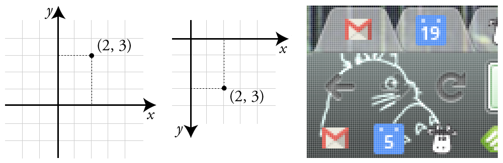
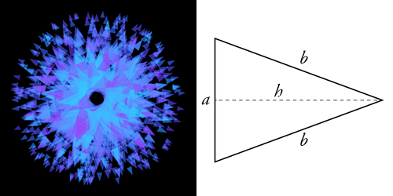
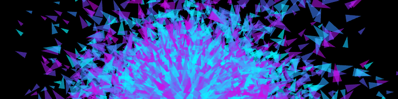
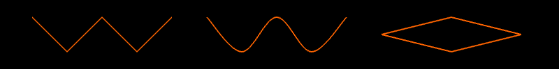
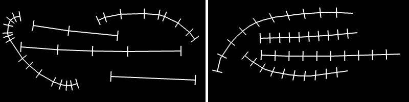
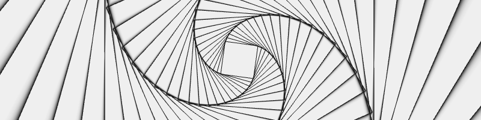

Graphics
========

*By: [Michael Hadley](http://www.mikewesthad.com/) with generous editor support from [Abraham Avnisan](http://abrahamavnisan.com/), [Brannon Dorsey](http://brannondorsey.com/) and [Christopher Baker](http://christopherbaker.net/).*

This chapter builds off of the *C++ Basics* and *Setup and Project Structure* chapters, so if you aren't familiar with basic C++ and creating openFrameworks projects, check out those chapters first.

In sections 1 and 2, we will create "paintbrushes" where the mouse is our brush and our code defines how our brush makes marks on the screen. In section 3, we will explore something called "coordinate system transformations" to create hypnotizing, spiraling rectangles. Source code for the projects is linked at the end of each section. If you feel lost at any point, don't hesitate to look at the completed code! You can check out the whole collection of code [here](https://github.com/openframeworks/ofBook/tree/master/chapters/intro_to_graphics/code) - both for standard development structure (Xcode, QtCreator, Visual Studio, etc.) and for ofSketch.

If you are following along using ofSketch, great! There are a couple things to note. Coding in ofSketch is a bit different than coding in other Xcode, Code::Blocks, etc. 1) There will be a few points where variables are added to something called a header file (`.h`). When you see those instructions, that means you should put your variables above your `setup()` function in ofSketch. 2) You'll want to use `ofSetWindowShape(int width, int height)` in `setup()` to control the size of your application. 3) Some of the applications you write will save images to your computer. You can find them in your ofSketch folder, by looking for `ofSketch/data/Projects/YOUR_PROJECT_NAME/bin/data/`.

Brushes with Basic Shapes
-------------------------

To create brushes, we need to define some basic building blocks of graphics. We can classify the 2D graphics functions into two categories: basic shapes and freeform shapes. Basic shapes are rectangles, circles, triangles and straight lines. Freeform shapes are polygons and paths. In this section, we will focus on the basic shapes.

### Basic Shapes

Before drawing any shape, we need to know how to specify locations on screen. Computer graphics use the [Cartesian coordinate system](https://en.wikipedia.org/wiki/Cartesian_coordinate_system). Remember figure 1 (left) from math class? A pair of values `(x, y)` told us how far away we were from `(0, 0)`, the origin. Computer graphics are based on this same system, but with two twists. First, `(0, 0)` is the upper leftmost pixel of the screen. Second, the y axis is flipped such that the positive y direction is located below the origin figure 1 (center).

If we apply this to the top left of my screen figure 1 (right), which happens to be my browser. We can see the pixels and identify their locations in our new coordinate system. The top left pixel is `(0, 0)`. The top left pixel of the blue calender icon (with the white "19") is `(58, 5)`.



Now that we can talk about locations, let's jump into code. Create an openFrameworks project and call it "BasicShapes" (or something more imaginative). Open the source file, `ofApp.cpp`, and navigate to the `draw()` function. Add the following:

```cpp
ofBackground(0);  // Clear the screen with a black color
ofSetColor(255);  // Set the drawing color to white

// Draw some shapes
ofDrawRectangle(50, 50, 100, 100); // Top left corner at (50, 50), 100 wide x 100 high
ofDrawCircle(250, 100, 50); // Centered at (250, 100), radius of 50
ofDrawEllipse(400, 100, 80, 100); // Centered at (400 100), 80 wide x 100 high
ofDrawTriangle(500, 150, 550, 50, 600, 150); // Three corners: (500, 150), (550, 50), (600, 150)
ofDrawLine(700, 50, 700, 150); // Line from (700, 50) to (700, 150)
```

When we run the code, we see white shapes on a black background. Success! Each time our `draw()` function executes, three things happen. First, we clear the screen by drawing a solid black background using [`ofBackground(...)`](http://openframeworks.cc/documentation/graphics/ofGraphics.html#show_ofBackground). The `0` represents a grayscale color where `0` is completely black and `255` is completely white. Second, we specify what color should be used for drawing with [`ofSetColor(...)`](http://openframeworks.cc/documentation/graphics/ofGraphics.html#show_ofSetColor). We can think of this code as telling openFrameworks to pull out a specific colored marker. When we draw, we will draw in that color until we specify that we want another color. Third, we draw our basic shapes with [`ofDrawRectangle(...)`](http://openframeworks.cc/documentation/graphics/ofGraphics.html#!show_ofDrawRectangle), [`ofDrawCircle(...)`](http://openframeworks.cc/documentation/graphics/ofGraphics.html#!show_ofDrawCircle), [`ofDrawEllipse(...)`](http://openframeworks.cc/documentation/graphics/ofGraphics.html#!show_ofDrawEllipse), [`ofDrawTriangle(...)`](http://openframeworks.cc/documentation/graphics/ofGraphics.html#!show_ofDrawTriangle) and [`ofDrawLine(...)`](http://openframeworks.cc/documentation/graphics/ofGraphics.html#!show_ofDrawLine). Check out the comments in the example to better understand how we are using the drawing functions. The functions can be used in other ways as well, so check out the openFrameworks documentation if you are curious.

[`ofFill()`](http://openframeworks.cc/documentation/graphics/ofGraphics.html#!show_ofFill) and [`ofNoFill()`](http://openframeworks.cc/documentation/graphics/ofGraphics.html#!show_ofFill) toggle between drawing filled shapes and drawing outlines. The colored marker analogy doesn't fit, but the concept still applies. `ofFill()` tells openFrameworks to draw filled shapes until told otherwise. `ofNoFill()` does the same but with outlines. So we can draw two rows of shapes on our screen (figure 2) - one filled and one outlines - if we modify our `draw()` function to look like:

```cpp
ofFill(); // If we omit this and leave ofNoFill(), all the shapes will be outlines!
// Draw some shapes (code omitted)

ofNoFill(); // If we omit this and leave ofFill(), all the shapes will be filled!
// Draw some shapes (code omitted)
```

The circle and ellipse are looking a bit jagged, so we can fix that with [`ofSetCircleResolution(...)`](http://openframeworks.cc/documentation/gl/ofGLProgrammableRenderer.html#!show_setCircleResolution). Circles and ellipses are drawn by connecting a series of points with straight lines. If we take a close look at the circle in figure 2, and we'll be able to identify the 20 tiny straight lines. That's the default resolution. Try putting `ofSetCircleResolution(50)` in the `setup()` function.

The individual lines that make up our outlines can be jagged too. We can fix that with a smoothing technique called [anti-aliasing](https://en.wikipedia.org/wiki/Spatial_anti-aliasing). We probably don't need to worry about this since anti-aliasing will be turned on by default in recent versions of openFrameworks. If it isn't, just add [`ofEnableAntiAliasing()`](http://openframeworks.cc/documentation/graphics/ofGraphics.html#show_ofEnableAntiAliasing) to `setup()`. (For future reference, you can turn it off to save computing power: [`ofDisableAntiAliasing()`](http://openframeworks.cc/documentation/graphics/ofGraphics.html#show_ofDisableAntiAliasing).)


\[[Source code for this section](https://github.com/openframeworks/ofBook/tree/master/chapters/intro_to_graphics/code/1_i_Basic_Shapes)\]

\[[ofSketch file for this section](https://github.com/openframeworks/ofBook/blob/master/chapters/intro_to_graphics/code/1_i_Basic_Shapes.sketch)\]

**Extensions**

1.	We can change the thickness of lines using [`ofSetLineWidth(...)`](http://openframeworks.cc/documentation/graphics/ofGraphics.html#show_ofSetLineWidth). The default thickness is 1. We use this function like `ofFill()` and `ofSetColor(...)` in that it changes the thickness of the "marker" we use to draw lines. Note: the range of widths supported by this feature is dependent on your graphics card, so if it's not working, it might not be your fault!
2.	Draw some rounded rectangles using [`ofDrawRectRounded(...)`](http://openframeworks.cc/documentation/graphics/ofGraphics.html#!show_ofDrawRectRounded)\.
3.	Explore the world of curved lines with [`ofDrawCurve(...)`](http://openframeworks.cc/documentation/graphics/ofGraphics.html#!show_ofDrawCurve) and [`ofDrawBezier(...)`](http://openframeworks.cc/documentation/graphics/ofGraphics.html#!show_ofDrawBezier). You can control the resolution using [`ofSetCurveResolution(...)`](http://openframeworks.cc/documentation/graphics/ofGraphics.html#!show_ofSetCurveResolution)\.

### Brushes from Basic Shapes

We survived the boring bits, but why draw one rectangle, when we can draw a million (figure 3)? That is essentially what we will be doing in this section. We will build brushes that drop a burst of many small shapes whenever we press the left mouse button. To make things more exciting, we will mix in some randomness. Start a new openFrameworks project, called "ShapeBrush."


#### Single Rectangle Brush: Using the Mouse

We are going to lay down the foundation for our brushes by making a simple one that draws a single rectangle when we hold down the mouse. To get started, we are going to need to know 1) the mouse location and 2) if the left mouse button is pressed.

For 1), we can use two openFrameworks functions that return `int` variables: [`ofGetMouseX()`](http://openframeworks.cc/documentation/events/ofEvents.html#show_ofGetMouseX) and [`ofGetMouseY()`](http://openframeworks.cc/documentation/events/ofEvents.html#show_ofGetMouseY). We will use them in `draw()`.

For 2), we can find out whether the left mouse button is pressed using [`ofGetMousePressed(...)`](http://openframeworks.cc/documentation/events/ofEvents.html#show_ofGetMousePressedd). The function asks us to pass in an `int` that represents which mouse button is we want to know about. openFrameworks provides some "public constants" for use here: `OF_MOUSE_BUTTON_LEFT`, `OF_MOUSE_BUTTON_MIDDLE` and `OF_MOUSE_BUTTON_RIGHT`. These public constants are just `int` variables that cannot be changed and can be accessed anywhere you have included openFrameworks. So `ofGetMousePressed(OF_MOUSE_BUTTON_LEFT)` will return `true` if the left button is pressed and will return `false` otherwise.

Let's add some graphics. Hop over to the `draw()` function where we can bring these new functions together:

```cpp
if (ofGetMousePressed(OF_MOUSE_BUTTON_LEFT)) {  // If the left mouse button is pressed...
    ofSetColor(255);
    ofSetRectMode(OF_RECTMODE_CENTER);
    ofDrawRectangle(ofGetMouseX(), ofGetMouseY(), 50, 50);  // Draw a 50 x 50 rect centered over the mouse
}
```

[`ofSetRectMode(...)`](http://openframeworks.cc/documentation/graphics/ofGraphics.html#show_ofSetRectMode) allows us to control how the `(x, y)` we pass into `ofDrawRectangle(...)` are used to draw. By default, they are interpreted as the upper left corner (`OF_RECTMODE_CORNER`). For our purposes, we want them to be the center (`OF_RECTMODE_CENTER`), so our rectangle is centered over the mouse.

Compile and run. A white rectangle is drawn at the mouse position when we press the left mouse button ... but it disappears immediately. By default, the screen is cleared with every `draw()` call. We can change that with [`ofSetBackgroundAuto(...)`](http://openframeworks.cc/documentation/graphics/ofGraphics.html#show_ofSetBackgroundAuto). Passing in a value of `false` turns off the automatic background clearing. Add the following lines into `setup()`:

```cpp
ofSetBackgroundAuto(false);

// We still want to draw on a black background, so we need to draw
// the background before we do anything with the brush
ofBackground(0);
```

First brush, done! We are going to make this a bit more interesting by adding 1) randomness and 2) repetition.

Randomness can make our code dark, mysterious and unpredictable. Meet [`ofRandom(...)`](http://openframeworks.cc/documentation/math/ofMath.html#!show_ofRandom). It can be used in two different ways: by passing in two values `ofRandom(float min, float max)` or by passing in a single value `ofRandom(float max)` where the min is assumed to be `0`. The function returns a random value between the min and max. We can inject some randomness into our rectangle color (figure 4) by using:

```cpp
float randomColor = ofRandom(50, 255);
ofSetColor(randomColor);  // Exclude dark grayscale values (0 - 50) that won't show on black background
```


To finish off this single rectangle brush, let's add the ability to erase by pressing the right mouse button by adding this to our `draw()` function:

```cpp
if (ofGetMousePressed(OF_MOUSE_BUTTON_RIGHT)) {  // If the right mouse button is pressed...
    ofBackground(0);  // Draw a black background over the screen
}
```

\[[Source code for this section](https://github.com/openframeworks/ofBook/tree/master/chapters/intro_to_graphics/code/1_ii_a_Single_Rectangle_Brush)\]

\[[ofSketch file for this section](https://github.com/openframeworks/ofBook/blob/master/chapters/intro_to_graphics/code/1_ii_a_Single_Rectangle_Brush.sketch)\]

#### Bursting Rectangle Brush: Creating Randomized Bursts

We now have the basics in place for a brush, but instead of drawing a single rectangle in `draw()`, let's draw a burst of randomized rectangles. We are going use a `for` loop to create multiple rectangles whose parameters are randomly chosen. What can we randomize? Grayscale color, width and height are easy candidates. We can also use a small positive or negative value to offset each rectangle from mouse position. Modify `draw()` to look like this:

```cpp
if (ofGetMousePressed(OF_MOUSE_BUTTON_LEFT)) {  // If the left mouse button is pressed...
    ofSetRectMode(OF_RECTMODE_CENTER);
    int numRects = 10;
    for (int r=0; r<numRects; r++) {
        ofSetColor(ofRandom(50, 255));
        float width = ofRandom(5, 20);
        float height = ofRandom(5, 20);
        float xOffset = ofRandom(-40, 40);
        float yOffset = ofRandom(-40, 40);
        ofDrawRectangle(ofGetMouseX()+xOffset, ofGetMouseY()+yOffset, width, height);
    }
}
```

But! Add one more thing, inside of `setup()`, before hitting run: `ofSetFrameRate(60)`. The frame rate is the speed limit of our program, frames per second (fps). `update()` and `draw()` will not run more than `60` times per second. (ofSketch users - we'll talk about `update()` later.) Note: this is a speed *limit*, not a speed *minimum* - our code can run slower than `60` fps. We set the frame rate in order to control how many rectangles will be drawn. If `10` rectangles are drawn with the mouse pressed and we know `draw()` won't be called more than `60` times per second, then we will generate a max of `600` rectangles per second.

Compile, run. We get a box-shaped spread of random rectangles (figure 5, left). Why didn't we get a circular spread (figure 5, right)? Since `xOffset` and `yOffset` could be any value between `-40` and `40`, think about what happens when `xOffset` and `yOffset` take on their most extreme values, i.e. (xOffset, yOffset) values of (-40, -40), (40, -40), (40, 40) and (-40, 40).

If we want a random point within a circle, it helps to think in terms of angles. Imagine we are at the center of a circle. If we rotate a random amount (the *polar angle*) and then move a random distance (the *polar radius*), we end up in a random location within the circle (assuming we don't walk so far that we cross the boundary of our circle). We just defined a point by a polar angle and a polar radius instead of using `(x, y)`. We have just thought about space in terms of [Polar coordinates](https://en.wikipedia.org/wiki/Polar_coordinate_system), instead of [Cartesian coordinates](https://en.wikipedia.org/wiki/Cartesian_coordinate_system).

Back to the code. When we figure out our offsets, we want to pick a random direction (polar angle) and random distance (polar distance) which we can then convert to Cartesian coordinates (see code) to use as `xOffset` and `yOffset`. Our loop inside of `draw()` will look like this:

```cpp
for (int r=0; r<numRects; r++) {
    ofSetColor(ofRandom(50, 255));
    float width = ofRandom(5, 20);
    float height = ofRandom(5, 20);
    float distance = ofRandom(35);

    // Formula for converting from polar to Cartesian coordinates:
    //  x = cos(polar angle) * (polar distance)
    //  y = sin(polar angle) * (polar distance)

    // We need our angle to be in radians if we want to use sin() or cos()
    // so we can make use of an openFrameworks function to convert from degrees
    // to radians
    float angle = ofRandom(ofDegToRad(360.0));

    float xOffset = cos(angle) * distance;
    float yOffset = sin(angle) * distance;
    ofDrawRectangle(ofGetMouseX()+xOffset, ofGetMouseY()+yOffset, width, height);
}
```


\[[Source code for this section](https://github.com/openframeworks/ofBook/tree/master/chapters/intro_to_graphics/code/1_ii_b_Bursting_Rect_Brush)\]

\[[ofSketch file for this section](https://github.com/openframeworks/ofBook/blob/master/chapters/intro_to_graphics/code/1_ii_a_Single_Rectangle_Brush.sketch)\]

#### Glowing Circle Brush: Using Transparency and Color

Unlike what we did with the rectangle brush, we are going to layer colorful, transparent circles on top of each to create a glowing haze. We will draw a giant transparent circle, then draw a slightly smaller transparent circle on top of it, then repeat, repeat, repeat. We can add transparency to `ofSetColor(...)` with a second parameter, the alpha channel (e.g.`ofSetColor(255, 50)`), with a value from `0` (completely transparent) to `255` (completely opaque).

Before we use alpha, we need to enable something called "alpha blending." Using transparency costs computing power, so [`ofEnableAlphaBlending()`](http://openframeworks.cc/documentation/graphics/ofGraphics.html#show_ofEnableAlphaBlending) and [`ofDisableAlphaBlending()`](http://openframeworks.cc/documentation/graphics/ofGraphics.html#show_ofDisableAlphaBlending) allow us to turn on and off this blending at our discretion. We need it, so enable it in `setup()`.

Comment out the rectangle brush code inside the `if` statement that checks if the left mouse button is pressed. Now we can start working on our circle brush. We will use the `angle`, `distance`, `xOffset` and `yOffset` code like before. Our `for` loop will start with a large radius and step its value to `0`. Add the following:

```cpp
int maxRadius = 100;  // Increase for a wider brush
int radiusStepSize = 5;  // Decrease for more circles (i.e. a more opaque brush)
int alpha = 3;  // Increase for a more opaque brush
int maxOffsetDistance = 100;  // Increase for a larger spread of circles
// draw smaller and smaller circles and layering (increasing) opaqueness
for (int radius=maxRadius; radius>0; radius-=radiusStepSize) {
    float angle = ofRandom(ofDegToRad(360.0));
    float distance = ofRandom(maxOffsetDistance);
    float xOffset = cos(angle) * distance;
    float yOffset = sin(angle) * distance;
    ofSetColor(255, alpha);
    ofDrawCircle(ofGetMouseX()+xOffset, ofGetMouseY()+yOffset, radius);
}
```


We end up with something like figure 6, a glowing light except without color. Tired of living in moody shades of gray? `ofSetColor(...)` can make use of the [Red Blue Green (RGB) color model](https://en.wikipedia.org/wiki/RGB_color_model) in addition to the grayscale color model. We specify the amount (`0` to `255`) of red, blue and green light respectively, e.g. `ofSetColor(255, 0, 0)` for opaque red. We can also add alpha, e.g. `ofSetColor(0, 0, 255, 10)` for transparent blue. Go ahead and modify the `ofSetColor(...)` in our circle brush to use a nice orange: `ofSetColor(255, 103, 0, alpha)`.

There's another way we can use `ofSetColor(...)`. Meet [`ofColor`](http://openframeworks.cc/documentation/types/ofColor.html), a handy class for handling colors which allows for fancy color math (among other things). Here are some examples of defining and modifying colors:

```cpp
ofColor myOrange(255, 132, 0); // Defining an opaque orange color - specified using RGB
ofColor myBlue(0, 0, 255, 50); // Defining a transparent blue color - specified using RGBA

// We can access the red, green, blue and alpha channels like this:
ofColor myGreen(0, 0, 255, 255);
cout << "Red channel:" << myGreen.r << endl;
cout << "Green channel:" << myGreen.g << endl;
cout << "Blue channel:" << myGreen.b << endl;
cout << "Alpha channel:" << myGreen.a << endl;

// We can also set the red, green, blue and alpha channels like this:
ofColor myYellow;
myYellow.r = 255;
myYellow.b = 0;
myYellow.g = 255;
myYellow.a = 255;

// We can also make use of some predefined colors provided by openFrameworks:
ofColor myAqua = ofColor::aqua;
ofColor myPurple = ofColor::plum;
// Full list of colors available at: http://openframeworks.cc/documentation/types/ofColor.html
```

If we wanted to make our brush fierier, we would draw using random colors that are in-between orange and red. `ofColor` gives us in-betweenness using something called "[linear interpolation](https://en.wikipedia.org/wiki/Linear_interpolation)" with a function called [`getLerped(...)`](http://openframeworks.cc/documentation/types/ofColor.html#show_getLerped). `getLerped(...)` is a class method of `ofColor`, which means that if we have an `ofColor` variable, we can interpolate like this: `myFirstColor.getLerped(mySecondColor, 0.3)`. (For an explanation of classes and methods, see the *OOPS!* chapter.) We pass in two arguments, an `ofColor` and a `float` value between `0.0` and `1.0`. The function returns a new `ofColor` that is between the two specified colors, and the `float` determines how close the new color is to our original color (here, `myFirstColor`). We can use this in `draw()` like this:

```cpp
ofColor myOrange(255, 132, 0, alpha);
ofColor myRed(255, 6, 0, alpha);
ofColor inBetween = myOrange.getLerped(myRed, ofRandom(1.0));
ofSetColor(inBetween);
```

\[[Source code for this section](https://github.com/openframeworks/ofBook/tree/master/chapters/intro_to_graphics/code/1_ii_c_Glowing_Circle_Brush)\]

\[[ofSketch file for this section](https://github.com/openframeworks/ofBook/blob/master/chapters/intro_to_graphics/code/1_ii_c_Glowing_Circle_Brush.sketch)\]

#### Star Line Brush: Working with a Linear Map

What about lines? We are going to create a brush that draws lines that radiate out from the mouse to create something similar to an asterisk or a twinkling star (figure 7). Comment out the circle brush and add:

```cpp
int numLines = 30;
int minRadius = 25;
int maxRadius = 125;
for (int i=0; i<numLines; i++) {
    float angle = ofRandom(ofDegToRad(360.0));
    float distance = ofRandom(minRadius, maxRadius);
    float xOffset = cos(angle) * distance;
    float yOffset = sin(angle) * distance;
    float alpha = ofMap(distance, minRadius, maxRadius, 50, 0);  // Make shorter lines more opaque
    ofSetColor(255, alpha);
    ofDrawLine(ofGetMouseX(), ofGetMouseY(), ofGetMouseX()+xOffset, ofGetMouseY()+yOffset);
}
```

What have we done with the alpha? We used [`ofMap(...)`](http://openframeworks.cc/documentation/math/ofMath.html#show_ofMap) to do a linear interpolation, similar to `getLerped(...)`. `ofMap(...)` transforms one range of values into a different range of values - like taking the "loudness" of a sound recorded on a microphone and using it to determine the color of a shape drawn on the screen. To get a "twinkle" effect, we want our shortest lines to be the most opaque and our longer lines to be the most transparent. `ofMap(...)` takes a value from one range and maps it into another range like this: `ofMap(value, inputMin, inputMax, outputMin, outputMax)`. We tell it that distance is a `value` in-between `minRadius` and `maxRadius` and that we want it mapped so that a distance value of 125 (`maxRadius`) returns an alpha value of 50 and a distance value of 25 (`minRadius`) returns an alpha value of 0.

We can also vary the line width using: `ofSetLineWidth(ofRandom(1.0, 5.0))`, but remember that if we change the line width in this brush, we will need go back and set our line width back to `1.0` in our other brushes.


\[[Source code for this section](https://github.com/openframeworks/ofBook/tree/master/chapters/intro_to_graphics/code/1_ii_d_Star_Line_Brush)\]

\[[ofSketch file for this section](https://github.com/openframeworks/ofBook/blob/master/chapters/intro_to_graphics/code/1_ii_d_Star_Line_Brush.sketch)\]

#### Fleeing Triangle Brush: Vectors and Rotations

Time for the last brush in section 1: the triangle. We'll draw a bunch of triangles that are directed outward from the mouse position (figure 8, left). `ofDrawTriangle(...)` requires us to specify the three corners of the triangle, which means that we will need to calculate the rotation of the corners to make the triangle point away from the mouse. A new class will make that math easier: [`ofVec2f`](http://openframeworks.cc/documentation/math/ofVec2f.html)\.



We've been defining points by keeping two separate variables: x and y. `ofVec2f` is a 2D vector, and for our purposes, we can just think of it as a point in 2D space. `ofVec2f` allows us to hold both x and y in a single variable (and perform handy math operations):

```cpp
ofVec2f mousePos(ofGetMouseX(), ofGetMouseY());  // Defining a new ofVec2f

// Access the x and y coordinates like this:
cout << "Mouse X: " << mousePos.x << endl;
cout << "Mouse Y: " << mousePos.y << endl;

// Or we can modify the coordinates like this:
float xOffset = 10.0;
float yOffset = 30.0;
mousePos.x += xOffset;
mousePos.y += yOffset;

// But we can do what we just did above by adding or subtracting two vectors directly
ofVec2f offset(10.0, 30.0);
mousePos += offset;
```

Let's start using it to build the triangle brush. The first step is to draw a triangle (figure 8, right) at the mouse cursor. It will become important later, but we are going to draw our triangle starting from the mouse cursor and pointing to the right. Comment out the line brush, and add:

```cpp
ofVec2f mousePos(ofGetMouseX(), ofGetMouseY());

// Define a triangle at the origin (0,0) that points to the right
ofVec2f p1(0, 25.0);
ofVec2f p2(100, 0);
ofVec2f p3(0, -25.0);

// Shift the triangle to the mouse position
p1 += mousePos;
p2 += mousePos;
p3 += mousePos;

ofSetColor(255, 50);
ofDrawTriangle(p1, p2, p3);
```

Run it and see what happens. We can add rotation with the `ofVec2f` class method [`rotate(...)`](http://openframeworks.cc/documentation/math/ofVec2f.html#show_rotate) like this: `myPoint.rotate(45.0)` where `myPoint` is rotated around the origin, `(0, 0)`, by `45.0` degrees. Back to our code, add this right before shifting the triangle to the mouse position:

```cpp
// Rotate the triangle points around the origin
float rotation = ofRandom(360); // The rotate function uses degrees!
p1.rotate(rotation);
p2.rotate(rotation);
p3.rotate(rotation);
```


Our brush looks something like figure 8 (left). If we were to move that rotation code to *after* we shifted the triangle position, the code wouldn't work very nicely because `rotate(...)` assumes we want to rotate our point around the origin. (Check out the documentation for an alternate way to use `rotate(...)` that rotates around an arbitrary point.) Last step, let's integrate our prior approach of drawing multiple shapes that are offset from the mouse:

```cpp
ofVec2f mousePos(ofGetMouseX(), ofGetMouseY());

int numTriangles = 10;
int minOffset = 5;
int maxOffset = 70;
int alpha = 150;
for (int t=0; t<numTriangles; t++) {
    float offsetDistance = ofRandom(minOffset, maxOffset);

    // Define a triangle at the origin (0,0) that points to the right (code omitted)
    // The triangle size is a bit smaller than the last brush - see the source code

    // Rotate the triangle (code omitted)

    ofVec2f triangleOffset(offsetDistance, 0.0);
    triangleOffset.rotate(rotation);

    p1 += mousePos + triangleOffset;
    p2 += mousePos + triangleOffset;
    p3 += mousePos + triangleOffset;

    ofSetColor(255, alpha);
    ofDrawTriangle(p1, p2, p3);
}
```

We are now using `ofVec2f` for our offset. We started with a vector that points rightward, the same direction our triangle starts out pointing. When we apply the rotation to them both, they stay in sync (i.e. both pointing away from the mouse). We can push them out of sync with: `triangleOffset.rotate(rotation+90)`, and we get a swirling blob of triangles. After that, we can add some color using `ofRandom(...)` and `getLerped(...)` again (figure 9) or play with fill and line width.



\[[Source code for this section](https://github.com/openframeworks/ofBook/tree/master/chapters/intro_to_graphics/code/1_ii_e_Triangle_Brush)\]

\[[ofSketch file for this section](https://github.com/openframeworks/ofBook/blob/master/chapters/intro_to_graphics/code/1_ii_e_Triangle_Brush.sketch)\]

**Extensions**

1.	Define some public variables to control brush parameters like `transparency`, `brushWidth`, `offsetDistance`, `numberOfShapes`, etc.
2.	Use the [`keyPressed(int key)`](http://openframeworks.cc/documentation/application/ofBaseApp.html#!show_keyPressed) function (in `.cpp`) to control those parameters at run time (e.g. increasing/decreasing `brushWidth` with the `+` and `-` keys). If you are using ofSketch, see the next section for how to use that function.
3.	Track the mouse position and use the distance it moves between frames to control those parameters (e.g. fast moving mouse draws a thicker brush).

#### Raster Graphics: Taking a Snapshot

Before we move on, let's save a snapshot of our canvas. We'll want to use the [`keyPressed(int key)`](http://openframeworks.cc/documentation/application/ofBaseApp.html#!show_keyPressed) function. This function is built into your application by default. Any time a key is pressed, the code you put into this function is called. The `key` variable is an integer that represents the key that was pressed.

If you are using project generator, you'll find `keyPressed(...)` in your `.cpp` file. If you are using ofSketch, you might not see the function, but it is easy to add. See the [ofSketch file](https://github.com/openframeworks/ofBook/blob/master/chapters/intro_to_graphics/code/1_ii_e_Triangle_Brush.sketch) for the last section.

In the `keyPressed(...)` function, add the following:

```cpp
if (key == 's') {
    // It's strange that we can compare the int key to a character like `s`, right?  Well, the super short
    // explanation is that characters are represented by numbers in programming.  `s` and 115 are the same
    // thing.  If you want to know more, check out the wiki for ASCII.
    glReadBuffer(GL_FRONT);  // HACK: only needed on windows, when using ofSetAutoBackground(false)
    ofSaveScreen("savedScreenshot_"+ofGetTimestampString()+".png");
}
```

[`ofSaveScreen(...)`](http://openframeworks.cc/documentation/utils/ofUtils.html#show_ofSaveScreen) grabs the current screen and saves it to a file inside of our project's `./bin/data/` folder with a filename we specify. The timestamp is used to create a unique filename, allowing us to save multiple screenshots without worrying about them overriding each other. So press the `s` key and check out your screenshot!

Brushes from Freeform Shapes
----------------------------

In the last section, we drew directly onto the screen. We were storing graphics (brush strokes) as pixels, and therefore working with [raster graphics](https://en.wikipedia.org/wiki/Raster_graphics). For this reason, it is hard to isolate, move or erase a single brush stroke. It also means we can't re-render our graphics at a different resolution. In contrast, [vector graphics](https://en.wikipedia.org/wiki/Vector_graphics) store graphics as a list of geometric objects instead of pixel values. Those objects can be modified (erased, moved, rescaled, etc.) after we "place" them on our screen.

In this section, we are going to make a kind of vector graphics by using custom ("freeform") shapes in openFrameworks. We will use structures (`ofPolyline` and `vector<ofPolyline>`) that allow us to store and draw the path that the mouse takes on the screen. Then we will play with those paths to create brushes that do more than just trace out the cursor's movement.

### Basic Polylines

Create a new project called "Polylines," and say hello to [`ofPolyline`](http://openframeworks.cc/documentation/graphics/ofPolyline.html). `ofPolyline` is a data structure that allows us to store a series of sequential points and then connect them to draw a line. Let's dive into some code. In your header file (inside "class ofApp" in "ofApp.h" to be precise), define three `ofPolylines`:

```cpp
ofPolyline straightSegmentPolyline;
ofPolyline curvedSegmentPolyline;
ofPolyline closedShapePolyline;
```

We can fill those `ofPolylines` with points in `setup()`:

```cpp
straightSegmentPolyline.addVertex(100, 100);  // Add a new point: (100, 100)
straightSegmentPolyline.addVertex(150, 150);  // Add a new point: (150, 150)
straightSegmentPolyline.addVertex(200, 100);  // etc...
straightSegmentPolyline.addVertex(250, 150);
straightSegmentPolyline.addVertex(300, 100);

curvedSegmentPolyline.curveTo(350, 100);  // These curves are Catmull-Rom splines
curvedSegmentPolyline.curveTo(350, 100);  // Necessary Duplicate for Control Point
curvedSegmentPolyline.curveTo(400, 150);
curvedSegmentPolyline.curveTo(450, 100);
curvedSegmentPolyline.curveTo(500, 150);
curvedSegmentPolyline.curveTo(550, 100);
curvedSegmentPolyline.curveTo(550, 100);  // Necessary Duplicate for Control Point

closedShapePolyline.addVertex(600, 125);
closedShapePolyline.addVertex(700, 100);
closedShapePolyline.addVertex(800, 125);
closedShapePolyline.addVertex(700, 150);
closedShapePolyline.close();  // Connect first and last vertices
```

We can now draw our polylines in the `draw()` function:

```cpp
ofBackground(0);
ofSetLineWidth(2.0);  // Line widths apply to polylines
ofSetColor(255,100,0);
straightSegmentPolyline.draw();  // This is how we draw polylines
curvedSegmentPolyline.draw();  // Nice and easy, right?
closedShapePolyline.draw();
```

We created three different types of polylines (figure 11). `straightSegmentPolyline` is composed of a series points connected with straight lines. `curvedSegmentPolyline` uses the same points but connects them with curved lines. The curves that are created are [Catmull–Rom splines](https://en.wikipedia.org/wiki/Centripetal_Catmull%E2%80%93Rom_spline), which use four points to define a curve: two define the start and end, while two control points determine the curvature. These control points are the reason why we need to add the first and last vertex twice. Lastly, `closedShapePolyline` uses straight line segments that are closed, connecting the first and last vertices.



The advantage of drawing in this way (versus raster graphics) is that the polylines are modifiable. We could easily move, add, delete, scale our vertices on the the fly.

\[[Source code for this section](https://github.com/openframeworks/ofBook/tree/master/chapters/intro_to_graphics/code/2_i_Basic_Polylines)\]

\[[ofSketch file for this section](https://github.com/openframeworks/ofBook/blob/master/chapters/intro_to_graphics/code/2_i_Basic_Polylines.sketch)\]

**Extensions**

1.	Check out [`arc(...)`](http://openframeworks.cc/documentation/graphics/ofPolyline.html#show_arc), [`arcNegative(...)`](http://openframeworks.cc/documentation/graphics/ofPolyline.html#show_arcNegative) and [`bezierTo(...)`](http://openframeworks.cc/documentation/graphics/ofPolyline.html#show_bezierTo) for other ways to draw shapes with `ofPolyline`.

### Building a Brush from Polylines

#### Polyline Pen: Tracking the Mouse

Let's use polylines to draw brush strokes. Create a new project, "PolylineBrush." When the left mouse button is held down, we will create an `ofPolyline` and continually extend it to the current mouse position. We will use a `bool` to tell us if the left mouse button is being held down. If it is being held down, we'll add the mouse position to the polyline, but instead of adding *every* mouse position, we'll add the mouse positions where the mouse has moved a distance away from the last point in our polyline.

Let's move on to the code. Create four variables in the header:

```cpp
ofPolyline currentPolyline;
bool leftMouseButtonPressed;
ofVec2f lastPoint;
float minDistance;
```

Initialize `minDistance` and `leftMouseButtonPressed` in `setup()`:

```cpp
minDistance = 10;
leftMouseButtonPressed = false;
```

Now we are going to take advantage of two new functions - [`mousePressed(int x, int y, int button)`](http://openframeworks.cc/documentation/application/ofBaseApp.html#!show_mousePressed) and [`mouseReleased(int x, int y, int button)`](http://openframeworks.cc/documentation/application/ofBaseApp.html#show_mouseReleased). These are functions that are built into your application by default. They are event handling functions, so whenever a mouse button is pressed, whatever code you put into `mousePressed(...)` is called. It's important to note that `mousePressed(...)` is only called when the mouse button is initially pressed. No matter how long we hold the mouse button down, the function is still only called once. The same goes for `mouseReleased(...)`.

The functions have a few variables `x`, `y` and `button` that allow you to know a bit more about the particular mouse event that just occurred. `x` and `y` are the screen coordinates of the cursor, and `button` is an `int` that represents the particular button on the mouse that was pressed/released. Remember the public constants like `OF_MOUSE_BUTTON_LEFT` and `OF_MOUSE_BUTTON_RIGHT`? To figure out what `button` is, we'll compare it against those constants.

Let's turn back to the code. If you are using project generator, you'll find these mouse functions in your `.cpp` file. If you are using ofSketch, you might not see these functions, but they are easy to add. See the [ofSketch file](https://github.com/openframeworks/ofBook/blob/master/chapters/intro_to_graphics/code/2_ii_a_Polyline_Pen.sketch) for this section. Inside of `mousePressed(...)`, we want to start the polyline:

```cpp
if (button == OF_MOUSE_BUTTON_LEFT) {
    leftMouseButtonPressed = true;
    currentPolyline.curveTo(x, y);  // Remember that x and y are the location of the mouse
    currentPolyline.curveTo(x, y);  // Necessary duplicate for first control point
    lastPoint.set(x, y);  // Set the x and y of a ofVec2f in a single line
}

```

Inside of `mouseReleased(...)`, we want to end the polyline:

```cpp
if (button == OF_MOUSE_BUTTON_LEFT) {
    leftMouseButtonPressed = false;
    currentPolyline.curveTo(x, y); // Necessary duplicate for last control point
    currentPolyline.clear();  // Erase the vertices, allows us to start a new brush stroke
}
```

Now let's move over to the `update()` function. For ofSketch users, this is another default function that you might not see in your sketch. It is a function that is called once per frame, and it is intended for doing non-drawing tasks. It's easy to add - see the [ofSketch file](https://github.com/openframeworks/ofBook/blob/master/chapters/intro_to_graphics/code/2_ii_a_Polyline_Pen.sketch) for this section.

Let's add points to our polyline in `update()`:

```cpp
if (leftMouseButtonPressed) {
    ofPoint mousePos(ofGetMouseX(), ofGetMouseY());
    if (lastPoint.distance(mousePos) >= minDistance) {
        // a.distance(b) calculates the Euclidean distance between point a and b.  It's
        // the length of the straight line distance between the points.
        currentPolyline.curveTo(mousePos);
        lastPoint = mousePos;
    }
}
```

Note that this only adds points when the mouse has moved a certain threshold amount (`minDistance`) away from the last point we added to the polyline. This uses the [`distance(...)`](http://openframeworks.cc/documentation/math/ofVec2f.html#show_distance) method of `ofVec2f`.

All that is left is to add code to draw the polyline in `draw()`, and we've got a basic curved polyline drawing program. But we don't have the ability to save multiple polylines, so we have something similar to an [Etch A Sketch](https://en.wikipedia.org/wiki/Etch_A_Sketch). We can only draw a single, continuous line. In order to be able to draw multiple lines that don't have to be connected to each other, we will turn to something called a `vector`. This isn't the same kind of vector that we talked about earlier in the context of `of2Vecf`. If you haven't seen vectors before, check out the [stl::vector basics tutorial](http://openframeworks.cc/ofBook/chapters/stl_vector.html) on the site.

Define `vector <ofPolyline> polylines` in the header. We will use it to save our polyline brush strokes. When we finish a stroke, we want to add the polyline to our vector. So in the if statement inside of `mouseReleased(...)`, before `currentPolyline.clear()`, add `polylines.push_back(currentPolyline)`. Then we can draw the polylines like this:

```cpp
ofBackground(0);
ofSetColor(255);  // White color for saved polylines
for (int i=0; i<polylines.size(); i++) {
    ofPolyline polyline = polylines[i];
    polyline.draw();
}
ofSetColor(255,100,0);  // Orange color for active polyline
currentPolyline.draw();
```

And we have a simple pen-like brush that tracks the mouse, and we can draw a dopey smiley face (figure 12).


\[[Source code for this section](https://github.com/openframeworks/ofBook/tree/master/chapters/intro_to_graphics/code/2_ii_a_Polyline_Pen)\]

\[[ofSketch file for this section](https://github.com/openframeworks/ofBook/blob/master/chapters/intro_to_graphics/code/2_ii_a_Polyline_Pen.sketch)\]

**Extensions**

1.	Add color!
2.	Explore [`ofBeginSaveScreenAsPDF(...)`](http://openframeworks.cc/documentation/graphics/ofGraphics.html#!show_ofBeginSaveScreenAsPDF) and [`ofEndSaveScreenAsPDF(...)`](http://openframeworks.cc/documentation/graphics/ofGraphics.html#!show_ofEndSaveScreenAsPDF) to save your work into a vector file format.
3.	Try using the `keyPressed(...)` function in your source file to add an undo feature that deletes the most recent brush stroke.
4.	Try restructuring the code to allow for a redo feature as well.

#### Polyline Brushes: Points, Normals and Tangents

Since we have the basic drawing in place, now we play with how we are rendering our polylines. We will draw points, normals and tangents. We'll talk about what normals and tangents are in a little bit. First, let's draw points (circles) at the vertices in our polylines. Inside the `for` loop in `draw()` (after `polyline.draw()`), add this:

```cpp
vector<glm::vec3> vertices = polyline.getVertices();
for (int vertexIndex=0; vertexIndex<vertices.size(); vertexIndex++) {
    glm::vec3 vertex = vertices[vertexIndex];  // glm::vec3 is like ofVec2f, but with a third dimension, z
    ofDrawCircle(vertex, 5);
}
```

[`getVertices()`](http://openframeworks.cc/documentation/graphics/ofPolyline.html#show_getVertices) returns a `vector` of `glm::vec3` objects that represent the vertices of our polyline. This is basically what an `ofPolyline` is - an ordered set of `glm::vec3` objects (with some extra math). We can loop through the indices of the vector to pull out the individual vertex locations, and use them to draw circles.

Note: in recent versions, openFrameworks has shifted away from `ofVec3f` to using a new internal math library, GLM. Read more about that [here](https://openframeworks.cc/learning/02_graphics/how_to_use_glm/). This chapter was written before that shift and still uses the legacy `ofVec3f` and `ofVec2f` in places. Some of the method names have changed in this shift, but in most places where you see `ofVec3f` or `ofVec2f`, you can instead use `glm::vec3` or `glm::vec2`. `getVertices()` is one of the places where you must use the new syntax by default.

What happens when we run it? Our white lines look thicker. That's because our polyline is jam-packed with vertices! Every time we call the `curveTo(...)` method, we create 20 extra vertices (by default). These help make a smooth-looking curve. We can adjust how many vertices are added with an optional parameter, `curveResolution`, in `curveTo(...)`. We don't need that many vertices, but instead of lowering the `curveResolution`, we can make use of [`simplify(...)`](http://openframeworks.cc/documentation/graphics/ofPolyline.html#show_simplify)\.

`simplify(...)` is a method that will remove "duplicate" points from our polyline. We pass a single argument into it: `tolerance`, a value between 0.0 and 1.0. The `tolerance` describes how dis-similar points must be in order to be considered 'unique' enough to not be deleted. The higher the `tolerance`, the more points will be removed. So right before we save our polyline by putting it into our `polylines` vector, we can simplify it. Inside of the if statement within `mouseReleased(...)` (before `polylines.push_back(currentPolyline)`), add: `currentPolyline.simplify(0.75)`. Now we should see something like figure 13 (left).


We can also sample points along the polyline using [`getPointAtPercent(...)`](http://openframeworks.cc/documentation/graphics/ofPolyline.html#show_getPointAtPercent), which takes a `float` between `0.0` and `1.0` and returns a `ofVec3f`. Inside the `draw()` function, comment out the code that draws a circle at each vertex. Below that, add:

```cpp
    for (int p=0; p<100; p+=10) {
        ofVec3f point = polyline.getPointAtPercent(p/100.0);  // Returns a point at a percentage along the polyline
        ofDrawCircle(point, 5);
    }
```

Now we have evenly spaced points (figure 13, right). (Note that there is no circle drawn at the end of the line.) Let's try creating a brush stroke where the thickness of the line changes. To do this we need to use a [normal vector](https://en.wikipedia.org/w/index.php?title=Normal_vector). Figure 14 shows normals drawn over some polylines - they point in the opposite (perpendicular) direction to the polyline. Imagine drawing a normal at every point along a polyline, like figure 15. That is one way to add "thickness" to our brush. We can comment out our circle drawing code in `draw()`, and add these lines of code instead:

```cpp
    vector<glm::vec3> vertices = polyline.getVertices();
    float normalLength = 50;
    for (int vertexIndex=0; vertexIndex<vertices.size(); vertexIndex++) {
        glm::vec3 vertex = vertices[vertexIndex];  // Get the vertex
        glm::vec3 normal = polyline.getNormalAtIndex(vertexIndex) * normalLength;  // Scale the normal
        ofDrawLine(vertex-normal/2, vertex+normal/2);  // Center the scaled normal around the vertex
    }
```

We are getting all of the vertices in our `ofPolyline`. But here, we are also using [`getNormalAtIndex`](http://openframeworks.cc/documentation/graphics/ofPolyline.html#show_getNormalAtIndex) which takes an index and returns an `glm::vec3` that represents the normal vector for the vertex at that index. We take that normal, scale it and then display it centered around the vertex. So, we have something like figure 14 (left), but we can also sample normals, using the function [`getNormalAtIndexInterpolated(...)`](http://openframeworks.cc/documentation/graphics/ofPolyline.html#show_getNormalAtIndexInterpolated). So let's comment out the code we just wrote, and try sampling our normals evenly along the polyline:



```cpp
float normalLength = 50;
for (int p=0; p<100; p+=10) {
    ofVec3f point = polyline.getPointAtPercent(p/100.0);
    float floatIndex = polyline.getIndexAtPercent(p/100.0);
    ofVec3f normal = polyline.getNormalAtIndexInterpolated(floatIndex) * normalLength;
    ofDrawLine(point-normal/2, point+normal/2);
}
```

We can get an evenly spaced point by using percents again, but `getNormalAtIndexInterpolated(...)` is asking for an index. Specifically, it is asking for a `floatIndex` which means that we can pass in 1.5 and the polyline will return a normal that lives halfway between the point at index 1 and halfway between the point at index 2. So we need to convert our percent, `p/100.0`, to a `floatIndex` using [`getIndexAtPercent(...)`](http://openframeworks.cc/documentation/graphics/ofPolyline/#!show_getIndexAtPercent). Once we've done that, we'll have something like figure 14 (right).

Now we can pump up the number of normals in our drawing. Let's change our loop increment from `p+=10` to `p+=1`, change our loop condition from `p<100` to `p<500` and change our `p/100.0` lines of code to `p/500.0`. We might also want to use a transparent white for drawing these normals, so let's add `ofSetColor(255,100)` right before our loop. We will end up being able to draw ribbon lines, like figure 15.


We've just added some thickness to our polylines. Now let's have a quick aside about tangents, the "opposite" of normals. These wonderful things are perpendicular to the normals that we just drew. So if we drew tangents along a perfectly straight line we wouldn't really see anything. The fun part comes when we draw tangents on a curved line, so let's see what that looks like. Same drill as before. Comment out the last code and add in the following:

```cpp
vector<glm::vec3> vertices = polyline.getVertices();
float tangentLength = 80;
for (int vertexIndex=0; vertexIndex<vertices.size(); vertexIndex++) {
    glm::vec3 vertex = vertices[vertexIndex];
    glm::vec3 tangent = polyline.getTangentAtIndex(vertexIndex) * tangentLength;
    ofDrawLine(vertex-tangent/2, vertex+tangent/2);
}
```

This should look very familiar except for [`getTangentAtIndex(...)`](http://openframeworks.cc/documentation/graphics/ofPolyline.html#show_getTangentAtIndex) which is the equivalent of `getNormalAtIndex(...)` but for tangents. Not much happens for straight and slightly curved lines, however, sharply curved lines reveal the tangents figure 16 (left).


I'm sure you can guess what's next... drawing a whole bunch of tangents at evenly spaced locations (figure 16, right)! It's more fun that it sounds. [`getTangentAtIndexInterpolated(...)`](http://openframeworks.cc/documentation/graphics/ofPolyline.html#show_getTangentAtIndexInterpolated) works like `getNormalAtIndexInterpolated(...)`. Same drill, comment out the last code, and add the following:

```cpp
ofSetColor(255, 50);
float tangentLength = 300;
for (int p=0; p<500; p+=1) {
    ofVec3f point = polyline.getPointAtPercent(p/500.0);
    float floatIndex = polyline.getIndexAtPercent(p/500.0);
    ofVec3f tangent = polyline.getTangentAtIndexInterpolated(floatIndex) * tangentLength;
    ofDrawLine(point-tangent/2, point+tangent/2);
}
```

\[[Source code for this section](https://github.com/openframeworks/ofBook/tree/master/chapters/intro_to_graphics/code/2_ii_b_Polyline_Brushes)\]

\[[ofSketch file for this section](https://github.com/openframeworks/ofBook/blob/master/chapters/intro_to_graphics/code/2_ii_b_Polyline_Brushes.sketch)\]

**Extensions**

1.	Try drawing shapes other than `ofDrawLine(...)` and `ofDrawCircle(...)` along your polylines. You could use your brush code from section 1.
2.	The density of tangents or normals drawn is dependent on the length of the brush stroke. Try making it independent (hint: you may need to adjust your loop and use `getPerimeter()` to calculate the length).
3.	Check out how to draw polygons using `ofPath` and try drawing a brush stroke that is a giant, closed shape.

#### Vector Graphics: Taking a Snapshot (Part 2)

Remember how we saved our drawings that we made with the basic shape brushes by doing a screen capture? Well, we can also save drawings as a PDF. A PDF stores the graphics as a series of geometric objects rather than as a series of pixel values. So, if we render out our polylines as a PDF, we can open it in a vector graphics editor (like [Inkscape](http://www.inkscape.org/en/) or Adobe Illustrator) and modify our polylines in all sorts of ways. For example, see figure 17 where I colored and blurred the polylines to create a glowing effect.

Once we have a PDF, we could also use it to blow up our polyines to create a massive, high resolution print.

To do any of this, we need to use [`ofBeginSaveScreenAsPDF(...)`](http://openframeworks.cc/documentation/graphics/ofGraphics.html#!show_ofBeginSaveScreenAsPDF) and [`ofEndSaveScreenAsPDF()`](http://openframeworks.cc/documentation/graphics/ofGraphics.html#show_ofEndSaveScreenAsPDF). When we call `ofBeginSaveScreenAsPDF(...)`, any subsequent drawing commands will output to a PDF *instead of* being drawn to the screen. `ofBeginSaveScreenAsPDF(...)` takes one required argument, a `string` that contains the desired filename for the PDF. (The PDF will be saved into `./bin/data/` unless you specify an alternate path). When we call `ofEndSaveScreenAsPDF()`, the PDF is saved and drawing commands begin outputting back to the screen.

Let's use the polyline brush code from the last section to save a PDF. The way we saved a screenshot previously was to put `ofSaveScreen()` inside of `keyPressed(...)`. We can't do that here because `ofBeginSaveScreenAsPDF(...)` and `ofEndSaveScreenAsPDF()` need to be before and after (respectively) the drawing code. So we'll make use of a `bool` variable. Add `bool isSavingPDF` to the header (.h) file, and then modify your source code (.cpp) to look like this:

```cpp
void ofApp::setup(){
    // Setup code omitted for clarity...

    isSavingPDF = false;
}

void ofApp::draw(){
    // If isSavingPDF is true (i.e. the s key has been pressed), then
    // anything in between ofBeginSaveScreenAsPDF(...) and ofEndSaveScreenAsPDF()
    // is saved to the file.
    if (isSavingPDF) {
        ofBeginSaveScreenAsPDF("savedScreenshot_"+ofGetTimestampString()+".pdf");
    }

    // Drawing code omitted for clarity...

    // Finish saving the PDF and reset the isSavingPDF flag to false
    // Ending the PDF tells openFrameworks to resume drawing to the screen.
    if (isSavingPDF) {
        ofEndSaveScreenAsPDF();
        isSavingPDF = false;
    }
}

void ofApp::keyPressed(int key){
    if (key == 's') {
        // isSavingPDF is a flag that lets us know whether or not save a PDF
        isSavingPDF = true;
    }
}

```


\[[Source code for this section](https://github.com/openframeworks/ofBook/tree/master/chapters/intro_to_graphics/code/2_ii_c_Save_Vector_Graphics)\]

\[[ofSketch file for this section](https://github.com/openframeworks/ofBook/blob/master/chapters/intro_to_graphics/code/2_ii_c_Save_Vector_Graphics.sketch)\]

Moving The World
----------------

We've been making brushes for a long time, so let's move onto something different: moving the world. By the world, I really just mean the coordinate system (though it sounds more exciting the other way).

Whenever we call a drawing function, like `ofDrawRectangle(...)` for example, we pass in an `x` and `y` location at which we want our shape to be drawn. We know (0,0) to be the upper left pixel of our window, that the positive x direction is rightward across our window and that positive y direction is downward along our window (recall figure 1). We are about to violate this established knowledge.

Imagine that we have a piece of graphing paper in front of us. How would we draw a black rectangle at (5, 10) that is 5 units wide and 2 units high? We would probably grab a black pen, move our hands to (5, 10) on our graphing paper, and start filling in boxes? Pretty normal, but we could have also have kept our pen hand stationary, moved our paper 5 units left and 10 units down and then started filling in boxes. Seems odd, right? This is actually a powerful concept. With openFrameworks, we can move our coordinate system like this using `ofTranslate(...)`, but we can *also* rotate and scale with `ofRotate(...)` and `ofScale(...)`. We will start with translating to cover our screen with stick figures, and then we will rotate and scale to create spiraling rectangles.

### Translating: Stick Family

[`ofTranslate`](http://openframeworks.cc/documentation/graphics/ofGraphics.html#show_ofTranslate) first. `ofTranslate(...)` takes an x, a y and an optional z parameter, and then shifts the coordinate system by those specified values. Why do this? Create a new project and add this to our `draw()` function of our source file (.cpp):

```cpp
// Draw the stick figure family
ofDrawCircle(30, 30, 30);
ofDrawRectangle(5, 70, 50, 100);
ofDrawCircle(95, 30, 30);
ofDrawRectangle(70, 70, 50, 100);
ofDrawCircle(45, 90, 15);
ofDrawRectangle(30, 110, 30, 60);
ofDrawCircle(80, 90, 15);
ofDrawRectangle(65, 110, 30, 60);
```

Draw a white background and color the shapes. You should end up with something like the leftmost portion of Figure 18.


What if, after figuring out where to put our shapes, we needed to draw them at a different spot on the screen, or to draw a row of copies? We *could* change all the positions manually, or we could use `ofTranslate(...)` to move our coordinate system and leave the positions alone:

```cpp
// Loop and draw a row
for (int cols=0; cols<4; cols++) {

    // Draw the stick figure family (code omitted)

    ofTranslate(150, 0);
}
```

So our original shapes are wrapped it in a loop with `ofTranslate(150, 0)`, which shifts our coordinate system to the left 150 pixels each time it executes. And we'll end up with figure 18 (second from left). Or something close to that, I randomized the colors in the figure - every family is different, right?

If we wanted to create a grid of families, we will run into problems. After the first row of families, our coordinate system will have been moved quite far to the left. If we move our coordinate system up in order to start drawing our second row, we will end up drawing off the screen in a diagonal. It would look like figure 18 (third from left).

So what we need is to reset the coordinate system using [`ofPushMatrix()`](http://openframeworks.cc/documentation/graphics/ofGraphics.html#show_ofPushMatrix) and [`ofPopMatrix()`](http://openframeworks.cc/documentation/graphics/ofGraphics.html#show_ofPopMatrix). `ofPushMatrix()` saves the current coordinate system and `ofPopMatrix()` returns us to the last saved coordinate system. These functions have the word matrix in them because openFrameworks stores all of our combined rotations, translations and scalings in a single matrix. So we can use these new functions like this:

```cpp
    for (int rows=0; rows<10; rows++) {
        ofPushMatrix(); // Save the coordinate system before we shift it horizontally

        // It is often helpful to indent any code in-between push and pop matrix for readability

        // Loop and draw a row (code omitted)

        ofPopMatrix(); // Return to the coordinate system before we shifted it horizontally
        ofTranslate(0, 200);
    }
```

And we should end up with a grid. See figure 18, right. (I used `ofScale` to jam many in one image.) Or if you hate grids, we can make a mess of a crowd using random rotations and translations, figure 19.


\[[Source code for this section](https://github.com/openframeworks/ofBook/tree/master/chapters/intro_to_graphics/code/3_i_Translating_Stick_Family)\]

\[[ofSketch file for this section](https://github.com/openframeworks/ofBook/blob/master/chapters/intro_to_graphics/code/3_i_Translating_Stick_Family.sketch)\]

### Rotating and Scaling: Spiraling Rectangles

Onto `ofScale(...)` and `ofRotate(...)`! Let's create a new project where rotating and scaling rectangles to get something like figure 20.



Before knowing about `ofRotate(...)`, we couldn't have drawn a rotated rectangle with `ofDrawRectangle(...)`. [`ofRotate(...)`](http://openframeworks.cc/documentation/graphics/ofGraphics.html#show_ofRotate) takes an angle (in degrees) and rotates our coordinate system around the current origin. Let's attempt a rotated rectangle:

```cpp
ofBackground(255);
ofPushMatrix();
    // Original rectangle in blue
    ofSetColor(0, 0, 255);
    ofDrawRectangle(500, 200, 200, 200);

    // Rotated rectangle in red
    ofRotate(45);
    ofSetColor(255, 0, 0);
    ofDrawRectangle(500, 200, 200, 200);
ofPopMatrix();
```

Hmm, not quite right (figure 21, left). `ofRotate(...)` rotates around the current origin, the top left corner of the screen. To rotate in place, we need `ofTranslate(...)` to move the origin to our rectangle *before* we rotate. Add `ofTranslate(500, 200)` before rotating (figure 21, second from left). Now we are rotating around the upper left corner of the rectangle. The easiest way to rotate the rectangle around its center is to use `ofSetRectMode(OF_RECTMODE_CENTER)` draw the center at (500, 200). Do that, and we finally get figure 21, third from left.


Push, translate, rotate, pop - no problem. Only thing left is [`ofScale(...)`](http://openframeworks.cc/documentation/graphics/ofGraphics.html#show_ofScale). It takes two arguments: the desired scaling in x and y directions (and an optional z scaling). Applying scaling to our rectangles:

```cpp
ofSetRectMode(OF_RECTMODE_CENTER);
ofBackground(255);

ofPushMatrix();
    // Original rectangle in blue
    ofSetColor(0, 0, 255);
    ofDrawRectangle(500, 200, 200, 200);

    // Scaled down rectangle in red
    ofTranslate(500, 200);
    ofScale(0.5, 0.5);  // We are only working in x and y, so let's leave the z scale at its default (1.0)
    ofSetColor(255, 0, 0);
    ofDrawRectangle(0, 0, 200, 200);
ofPopMatrix();
```

We'll run into the same issues that we ran into with rotation and centering. The solution is the same - translating before scaling and using `OF_RECTMODE_CENTER`. Example scaling shown in figure 21 (right).

Now we can make trippy rectangles. Start a new project. The idea is really simple, we are going to draw a rectangle at the center of the screen, scale, rotate, draw a rectangle, repeat and repeat. Add the following to our `draw()` function:

```cpp
ofBackground(255);

ofSetRectMode(OF_RECTMODE_CENTER);
ofSetColor(0);
ofNoFill();
ofPushMatrix();
    ofTranslate(ofGetWidth()/2, ofGetHeight()/2);  // Translate to the center of the screen
    for (int i=0; i<100; i++) {
        ofScale(1.1, 1.1);
        ofRotate(5);
        ofDrawRectangle(0, 0, 50, 50);
    }
ofPopMatrix();
```

That's it (figure 20). We can play with the scaling, rotation, size of the rectangle, etc. Three lines of code will add some life to our rectangles and cause them to coil and uncoil over time. Put these in the place of `ofRotate(5)`:

```cpp
// Noise is a topic that deserves a section in a book unto itself
// Check out Section 1.6 of "The Nature of Code" for a good explanation
// http://natureofcode.com/book/introduction/
float time = ofGetElapsedTimef();
float timeScale = 0.5;
float noise = ofSignedNoise(time * timeScale) * 20.0;
ofRotate(noise);
```

Next, we can create a visual smear ("trail effect") as it rotates if we will turn off the background automatic clearing and partially erase the screen before drawing again. To do this add a few things to `setup()`:

```cpp
ofSetBackgroundAuto(false);
ofEnableAlphaBlending(); // Remember if we are using transparency, we need to let openFrameworks know
ofBackground(255);
```

Delete `ofBackground(255)` from our `draw()` function. Then, add this to the beginning of our `draw()` function:

```cpp
float clearAlpha = 100;
ofSetColor(255, clearAlpha);
ofSetRectMode(OF_RECTMODE_CORNER);
ofFill();
ofDrawRectangle(0, 0, ofGetWidth(), ofGetHeight());  // ofBackground doesn't work with alpha, so draw a transparent rect
```

Pretty hypnotizing? If we turn up the `clearAlpha`, we will turn down the smear. If we turn down the `clearAlpha`, we will turn up the smear.

Now we've got two parameters that drastically change the visual experience of our spirals, specifically: `timeScale` of noise and `clearAlpha` of the trail effect. Instead of manually tweaking their values in the code, we can use the mouse position to independently control the values during run time. Horizontal position can adjust the `clearAlpha` while vertical position can adjust the `timeScale`. This type of exploration of parameter settings is super important (especially when making generative graphics), and using the mouse is handy if we've got one or two parameters to explore.

[`mouseMoved(int x, int y )`](http://openframeworks.cc/documentation/application/ofBaseApp.html#!show_mouseMoved) runs anytime the mouse moves (in our app). We can use this function to change our parameters. Like with `mousePressed(...)`, if you are using project generator, you'll find this with your mouse functions in your `.cpp` file. If you are using ofSketch, you might not see this function, but it's easy to add. See the [ofSketch file](https://github.com/openframeworks/ofBook/blob/master/chapters/intro_to_graphics/code/3_ii_Rotating_and_Scaling.sketch) for this section.

Before we use this function, we need to make our parameters global in their scope. Delete the code that defines `timeScale` and `clearAlpha` locally in `draw()` and add them to the header. Initialize the values in `setup()` to `100` and `0.5` respectively. Then add these to `mouseMoved(...)`:

```cpp
clearAlpha = ofMap(x, 0, ofGetWidth(), 0, 255);  // clearAlpha goes from 0 to 255 as the mouse moves from left to right
timeScale = ofMap(y, 0, ofGetHeight(), 0, 1);  // timeScale goes from 0 to 1 as the mouse moves from top to bottom
```

One last extension. We can slowly flip the background and rectangle colors, by adding this to the top of `draw()`:

```cpp
ofColor darkColor(0,0,0,255);  // Opaque black
ofColor lightColor(255,255,255,255);  // Opaque white
float time = ofGetElapsedTimef();  // Time in seconds
float percent = ofMap(cos(time/2.0), -1, 1, 0, 1);  // Create a value that oscillates between 0 to 1
ofColor bgColor = darkColor;  // Color for the transparent rectangle we use to clear the screen
bgColor.lerp(lightColor, percent);  // This modifies our color "in place", check out the documentation page
bgColor.a = clearAlpha;  // Our initial colors were opaque, but our rectangle needs to be transparent
ofColor fgColor = lightColor;  // Color for the rectangle outlines
fgColor.lerp(darkColor, percent);  // Modifies color in place
```

Now use `bgColor` for the transparent rectangle we draw on the screen and `fgColor` for the rectangle outlines to get figure 22.


\[[Source code for this section](https://github.com/openframeworks/ofBook/tree/master/chapters/intro_to_graphics/code/3_ii_Rotating_and_Scaling)\]

\[[ofSketch file for this section](https://github.com/openframeworks/ofBook/blob/master/chapters/intro_to_graphics/code/3_ii_Rotating_and_Scaling.sketch)\]

**Extensions**

1.	Pass in a third parameter, `z`, into `ofTranslate(...)` and `ofScale(...)` or rotate around the x and y axes with `ofRotate(...)`.
2.	Capture animated works using an addon called [ofxVideoRecorder](https://github.com/timscaffidi/ofxVideoRecorder). If you are using Windows, like me, that won't work for you, so try screen capture software (like fraps) or saving out a series of images using `ofSaveScreen(...)` and using them to create a GIF or movie with your preferred tools (Photoshop, [ffmpeg](https://ffmpeg.org/), [ImageMagick](http://imagemagick.org/) etc.)

Next Steps
----------

Congratulations on surviving the chapter :). You covered a lot of ground and (hopefully) made some fun things along the way - which you should share on the [forums](http://forum.openframeworks.cc/)!

If you are looking to learn more about graphics in openFrameworks, definitely continue on to *Advanced Graphics* chapter to dive into more advanced graphical features. You can also check out these three tutorials: [Basics of Generating Meshes from an Image](http://openframeworks.cc/tutorials/graphics/generativemesh.html), for a gentle introduction to meshes; [Basics of OpenGL](http://openframeworks.cc/tutorials/graphics/opengl.html), for a comprehensive look at graphics that helps explain what is happening under the hood of openFrameworks; and [Introducing Shaders](http://openframeworks.cc/tutorials/graphics/shaders.html), for a great way to start programming with your graphical processing unit (GPU).
