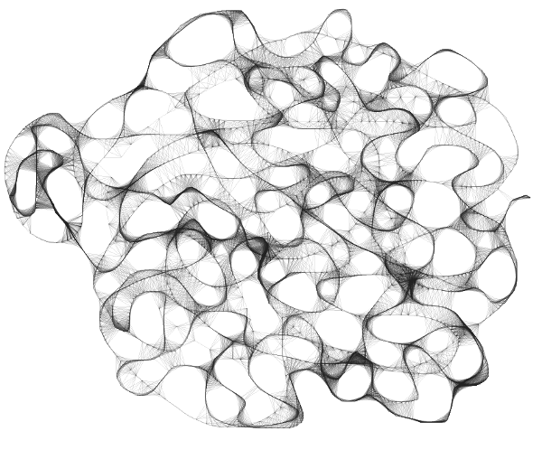

# Drawing Lines

*by [Davide Prati](http://edapx.com)

## Introducing ...

In this tutorial we will have a look on how to draw lines with openFrameworks. Most of the code in this tutorial comes from [this](https://github.com/ofZach/VAW_workshop/tree/master/drawingWorkshop) workshop held by [Zach Lieberman](http://thesystemis.com/).
Lines are probably the most primitive abstract form of drawing. They are one of the first things kids learn to draw, and one of the most instinctive way we still use to draw on a surface. But in the end, they are just a bunch of points connected together; openFramework provides a class to easily draw lines connecting point: [ofPolyline](/documentation/graphics/ofPolyline/). Let's start to see how to use it!


## Draw a line
In this example we will draw a line on the screen simply dragging the mouse
around. In order to do that, we will start creating our container of points.
Create a new app with the project generator and add this to your `App.h` file:

```cpp
ofPolyline line;
```

Now edit the method `setup`, `draw`, `mouseDragged` and `mousePressed` as
follow:

```cpp
void ofApp::setup(){
    ofBackground(0,0,0);
}

void ofApp::draw(){
    line.draw();
}

void ofApp::mouseDragged(int x, int y, int button){
    ofPoint pt;
    pt.set(x,y);
    line.addVertex(pt);
}

void ofApp::mousePressed(int x, int y, int button){
    line.clear();
}
```

The interesting things are happening in the `mouseDragged` method. When we press the left button of the mouse and we drag it around, the points with the coordinates corresponding to the mouse position are added into the instance `line` of the `ofPolyline` class. When we call `line.draw()`, ofPolyline automatically connects the dots and draws a line on the screen. When we release the mouse, `line.clear()` deletes all the points that we have insterted previously, getting ready to draw a new line.


## A bit of noise

Once that we have the points in the `ofPolyline` we can edit them in the `update` method, before drawing them. Let's move the points one pixel up or down along the x and y axis. Edit the `update` method as follow:
```cpp
for (auto &vert : line.getVertices()){
    vert.x += ofRandom(-1,1);
    vert.y += ofRandom(-1,1);
}
```
You should see something like this:


Note the `&` in the loop. If we would have ommit it, we wouldn't have been able to edit the position of the vertices. The `&` is telling to c++ that we are using a reference of the vertice contained in the `ofPolyline`, and we need a reference because we want to change the values inside the `ofPolyline`. When you simple want to read the values of the point inside the `ofPolyline`, do not use `&`. When you want to edit them, like in this case, use it.

## A web of lines

Let's try something more complex. In this example we are going to create lines with `ofDrawLine` an `ofPoint`. Create a new app with the project generator and edit the `ofApp.h` file as follow:
```cpp
#include "ofMain.h"

class Line {
public:
    ofPoint a;
    ofPoint b;
};

class ofApp : public ofBaseApp{

  public:
    // ...
    //leave everything as it is
    // ...
    vector < ofPoint > drawnPoints;
    vector < Line > lines;
};
```
In this header file we have defined a new class, the class `Line`. This class simply consist of 2 points, `a` and `b`, this 2 points define where the line begins and where the line ends. We have also defined two new [vectors](/tutorials/11_c++%20concepts/001_stl_vectors_basic/), `drawnPoints`, and `lines`. In the `App.cpp` file we are going to see why we need them:

```cpp
void ofApp::setup(){
    ofBackground(255,255,255);
}

void ofApp::draw(){
    ofEnableAlphaBlending();
    ofSetColor(30,30,30,30);

    for (auto line : lines) {
        ofDrawLine(line.a, line.b);
    }
}

void ofApp::mouseDragged(int x, int y, int button){
    for (auto point : drawnPoints){
        ofPoint mouse;
        mouse.set(x,y);
        float dist = (mouse - point).length();
        if (dist < 30){
            Line lineTemp;
            lineTemp.a = mouse;
            lineTemp.b = point;
            lines.push_back(lineTemp);
        }
    }
    drawnPoints.push_back(ofPoint(x,y));
}
```
The `draw()` method is pretty easy, we use the `Line` class that we have created in the header file to obtain the values of the point `a` and `b`. Then we use `ofDrawLine` to connect them. `ofDrawLine` simply draws a line from one point to another.
The `mouseDragged` method is a bit more complex. Let's start from the easyest part, `drawnPoints.push_back(ofPoint(x,y))`. Everytime we drag the mouse, we are saving the position of the mouse in the `drawnPoints` vector. This vector is like the history of all the movements of the mouse on the screen. Now let's have a look at the loop that starts with `for (auto point : drawnPoints)`. In this loop we are taking the current position of the mouse `ofPoint mouse`, and we are confronting it with all its previous position. If the distance between the current position and a previous position is less than 30 pixel, we create a `Line lineTemp` that connects the position of the mouse with the point in the history vector `drawnPoints` which distance is less than 30px. After that we push the `Line` in the `lines` vector, ready do be drawned on the screen.
Try to move the mouse around, you should be able to draw something like this.




## Make a smooth line in movement in a 3D space
Now that we know how to use `ofPolyline`, we can combine it togehter with `ofNode`, and draw a lines that moves smoothly on the screen. `ofNode` is a class that defines a point in a 3D space and can be chained to other nodes. If we make 2 nodes, A and B, and we define the node A as a parent of B. moving the A node will also move the node B. Let's see how `ofNode` and `ofPolyline` can play together. First, edit your `App.h` file as follow:

```cpp
ofNode baseNode;
ofNode childNode;
ofNode grandChildNode;
ofPolyline line;
ofEasyCam cam;
```
The `EasyCam` class is used to see a scene in 3D space. Dragging the mouse around will allow you to move the camera around your scene. You do not need to worry for now about how does that work, `EasyCam` is taking care of everything. Now, edit the `App.cpp` file as follow:

```cpp
void ofApp::setup(){
    ofEnableDepthTest();
    baseNode.setPosition(0, 0, 0);
    childNode.setParent(baseNode);
    childNode.setPosition(0, 0, 200);
    grandChildNode.setParent(childNode);
    grandChildNode.setPosition(0,50,0);
}

//--------------------------------------------------------------
void ofApp::update(){
    baseNode.pan(1);
    childNode.tilt(3);

    line.addVertex(grandChildNode.getGlobalPosition());
    if (line.size() > 200){
        line.getVertices().erase(
                                 line.getVertices().begin()
                                 );
    }
}

//--------------------------------------------------------------
void ofApp::draw(){
    cam.begin();
    //uncomment these 3 lines to understand how nodes are moving
    //baseNode.draw();
    //childNode.draw();
    //grandChildNode.draw();
    line.draw();
    cam.end();
}
```
You should see an image like this:


Lets' go through the code. In the `setup` method we create a chain of 3 nodes and we assign them a position. Each node is parent to the previous one using `setParent`. In the `update` method we tell to the `baseNode` to rotate 1 degree on the y axis. This will have a percussion also on the 2 other nodes. We also tell to the `childNode` to rotate 3 degree on the x axis. These 2 rotation are enough to give to the last node of the chain, the `grandChildNode`, an elegant movement around the 2 nodes. In the following lines, we are capturing the points from this movement and we are puttin them in the `ofPolyline`. We keep only 200 points in the line, erasing the old ones as soon as new points are pushed in. Try to increase this value to see how the line change.
