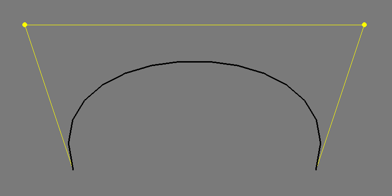

# Math: From 1D to 4D 

*by [Omer Shapira](http://omershapira.com)*


### How Artists Approach Math
Math is a curious thing in arts. Many artists reference it directly as inspiration for their work, from Leonardo Da Vinci's _Vitruvian Man_, through Escher's different views of fields of numbers, and many other highlighted, topical representations in art. It is otherwise known as a tool for bringing order into most arts: musicians religiously follow Chromatic Circles (which are just cyclic groups of order 12, $\mathbb{Z}/12\mathbb{Z}$), Architects create rhythms in harmonic series, $\frac{1}{2^n}$ or $\frac{1}{3^n}$, and product designers train their loved ones to wake them up in the middle of the night and ask them questions about The Golden Ratio, $\frac{1 + \sqrt{5}}{2}$ (Seriously guys, stop it). But just as it is important for artists to appreciate the order that Mathematics can bring, it is significantly more important to observe the chaos Mathematics contains.


Randomness, events in large scales and unpredictabilty were Mathematical concepts that were inaccessible for rapid exploration until very recently. The concept of _simulation_ – letting a thing happen, bound to some conditions, on a massive scale – is something that computers enabled humans to explore. When Benoît Mandelbrot worked for IBM, his attempt at printing the density map of a self-repeating sequence of complex numbers – something that would have taken forever for a human hand and head – resulted in a scientific measurement being reappropriated for its aesthetic value, in what we now call [Fractal Art](https://en.wikipedia.org/wiki/Fractal_art). The same conseqeunce, that people could create a drawing faster than they could think, enabled an entire family of simulation arts, like the tree-like structures generated from [L-Systems](http://en.wikipedia.org/wiki/L-system), concieved by Aristid Lindenmayer, and many, many flavors of computer-generated biomimetic artifacts. It's acceptable to call these things _Art_, because the thought that mathematicians had done this deliberately in their work would simply confuse the audience.


But just by picking up this book, any reader already knows better than to create this distinction. Math is everywhere in Art, just like Art is everywhere in Math. 
When using a brush or pen or chisel, we're taking advantage of the hard work that nature is doing, calculating physics, rendering things perfectly for us, all in real time. In the computer world, none of that is true. Things like L-Systems had to be created for us to use, because our hands can't reach into the computer. If you're doing any bit of digital art, the math is happening somewhere, whether you control it or not. This chapter will try to expose basic inner-workings of the black arts of graphics programming. I wish I could make this chapter 5 times as long and include the really neat stuff, but that would make this book too heavy to put in a rucksack.

### About this Chapter
A Math chapter for a book about graphics will always miss out on many ideas. In fact, there are entire books covering "math for graphics", mostly consisting of references to other books, focusing on a specific topic (like Linear Algebra, Multivariable Calculus, Differential Geometry, and many other words mysteriously connected to other words). This chapter must therefore be very concise about ideas. All topics here are explained in a friendly way, but please - never fear googling a thing for which you need better examples.

This chapter will be divided into _'numbers of D's'_ : we'll start from one dimension, and slowly explore the possibilities enabled by the amount of dimensions we're operating in. We'll explore concepts of _scale_ and _change_ and learn how much can be described just with these two words. Depending on how you choose to read it, this chapter contains hundreds of years of Mathematical research, or in other words, several classes of college math, so it's worth bookmarking.

**Note:** When bringing math to innocent readers, most programming books will try to explain the idea, not necessarily the exact implementation. This book is no different. This chapter contains detailed breakdowns of concepts, but if you want to find out what's going on under the hood, there's no alternative to reading the source code - in fact, since all the math here is only a few lines long - it's actually _encouraged_ to have a look at the source.

## One Dimension: Using Change

Let's start our journey by looking at the number line. It's a stretch of numbers going to infinity in both the positive and negative direction. Suppose we were ants or microbes, so that we could stand on exactly one value here, and travel to any other value by walking in that direction.
That's pretty much the definition of a _dimension_. It's an infinite collection of values that are all accessible, and any value of it can be described with one number. As you're about to see, these properties are going to enable quite a lot of options.

**[GRAPHICS: The Number Line. Reference added]**

<!-- ### Interpolation -->
### Linear Interpolation: The `ofLerp`
```cpp 
float ofLerp(float start, float stop, float amt)
```

As Randall Munroe (the author of xkcd) once put it, if you see a number larger than 7 in your page, you're not doing real math. To prove ourselves worthy, this part will only involve numbers between 0 and 1.

Those of you that have already done a little time-based or space-based work have probably noticed that you can often describe elements of your work as sitting on a line between two known points. A frame on a timeline is at a known location between 00:00:00 and the runtime of the film, a scrollbar is pointing to a known location between the beginning and the end of a page. That's exactly what `lerp` does.

With the `lerp` function, you can take any two quantities, in our case `start` and `stop`, and find any point between them, using amounts (`amt`) between 0 and 1. To be verbose: 
 $$\text{lerp}\left(a,b,t\right) = t\cdot b+\left(1-t\right)\cdot a$$ 

#### Note: What does _linear_ really mean?
Engineers, Programmers and English Speakers like to think of _linear_ as _anything you can put on a line_. Mathematicians, having to deal with all the conceptual mess the former group of people creates, define it _anything you can put on a line **that begins at (0,0)**_. There's  good reasoning behind that, which we will see in the discussion about Linear Algebra. In the meantime, think of it this way: 

> A _Linear Transform_ takes any line that has a value 0 at the point 0 and returns a line with the same property, $$f\left(x\right)=ax$$. If it returns a line value different from 0 at $x=0$, $$f\left(x\right)=ax + b$$, it's an _Affine Transform_ instead. 

At this point you probably know, but it's worth repeating: Those two transformations may either change lines into lines, or in some degenerate cases, lines to points. For example, $f\left(x\right) = x^{2}$ is totally not linear.

#### Exercise: Save NASA's Mars Lander 
In 1999, an masterpiece of engineering was making its final approach to Mars. All instruments were showing that the approach distance matched the speed, and that it's just about to get there and do some science. But instead, it did something rather rude: it crashed into the red planet. An investigation made later by NASA revealed that while designing the lander, one team worked with their test equipment set to _centimetres_, while the other had theirs set to _inches_. **By the way, this is all true.**

Help the NASA teams work together: write a function that converts centimetres to inches. For reference, $1_{\text{in}} = 2.54_{\text{cm}}$. Test your result against three different real-world values. 
Tip: Its much easier to start solving with pen and paper than it is with a keyboard.

**Think:**

1. Can we use `lerp` outside the range of 0 and 1? Why?
2. What would it take to write a function that converts inches into centimetres?

### Affine Mapping: The `ofMap`
```cpp
float ofMap(float value, float inputMin, float inputMax, float outputMin, float outputMax, bool clamp = false)
```

In the last discussion, we saw how by using `lerp`, any value between two points can be _linearly_ addressed as a value between 0 and 1. That's very convenient, and therefore the reason we build most of our arbitrary numerical ranges (`ofFloatColor`, for example) in the domain of 0 and 1. 

However, when dealing with real world problems, programmers run into domains of values that they wish to map to other ranges of values, neither of which are confined to 0 and 1. For example, someone trying to convert the temperature in Celsius to Fahrenheit won't be able to use a `lerp` by itself - the domain we care about isn't between 0 and 1. Surely, the way of doing that must involve a `lerp`, but it needs a little help.


If we want to use the `lerp` function, we're aiming to get it to the range between 0 and 1. We can do that by knocking `inputMin` off the input `value` so that it starts at 0, then dividing by the size of the domain: $$x=\frac{\text{value}-\text{inputMin}}{\text{inputMax}-\text{inputMin}}$$
Now that we've tamed the input domain to be between 0 and 1, we do the exact opposite to the output: `ofMap(value, inputMin, inputMax, outputMin, outputMax)`
$$=\frac{\text{value}-\text{inputMin}}{\text{inputMax}-\text{inputMin}}\cdot\left(\text{outputMax}-\text{outputMin}\right)+\text{outputMin}$$

Here's an example. Let's say we're given a dataset in Farenheit. Farenheit sets 0 to be the freezing point of brine and 100 to be the body temperature of a slightly ill British human (_duh?_). In order to do anything with that information, we first need to convert that to Celsius, which at least uses _The Same Damn Substance™_ for 0 and 100: Water. Now, we happen to know that water freezes at $32_{\text{f}}$ and boils at $212_{\text{f}}$, so we have the same exact objective range, now it's time to map. We'll use an array for this:

```cpp
vector<float> farenheitValues;
// we'll skip over the code that fills them up, as somebody else has done it
vector<float> celsiusValues; //Sets up an empty C++ vector, which is a dynamic array
for (int i = 0 ; i < farenheitValues.size() ; ++i){
	celsiusValues.pushBack(ofMap(32, 212, 0, 100, farenheitValues[i]));
}
```
Watch what we did here. We took a numerical range (let's call it the _domain_) of 32 to 212 and converted it to different one (we'l call this one the _range_) of 0 to 100. There are two things to note about that:

* In Mathematics, we often use the words _domain_ and _range_ as origin and target. Using those terms allows us to introduce another concept we care about: _Separation of Concern_. If we know that every input a function takes is guaranteed to be in a certain _domain_, we can engineer it so it guarantees an output in a certain _range_, and make sure it doesn't fail. In fact, this is the mathematical definition of a function:

> A _Function_ is a Mathematical object that maps _every_ value of a certain domain to a _single_ corresponding value of a certain range.


* We defined the range of 32 to 212 as two points we know on a line. The actual range of temperatures is -459.67 (the absolute zero, in Farenheits) to somewhere very, very large (known as the planck temperature) - it's not very conventient to calculate that. So instead of choosing the whoe range, we mapped a known area of it to a known area of it in the range. We are allowed to use an `ofMap()` for that, because the scale is linear. Some scales are not linear; For example, the decibel ($\text{dB}$), commonly used in sound measurement, is logarithmic, so converting between a range of $0_{\text{dB}}$ - $6_{\text{dB}}$ to $6_{\text{dB}}$-$15_{\text{dB}}$ would not convey any meaning. 

### Range Utilities
#### Clamping
You'll notice that the previous explanation is missing the `clamp` parameter. This may not matter to us if we're using the `ofMap` function in the range that we defined, but suppose we select a `value` smaller than `inputMin`: would it be ok if the result was also smaller than `outputMin`? If our program is telling an elevator which floor to go to, that might be a problem. That's why we add `true` to the tail of this function whenever we need to be careful.

Just in case, oF offers another specific clamp function: 

```cpp
float ofClamp(float value, float min, float max)
```

#### Range Checking

Two important functions we unjustly left out of this chapter:

```cpp
bool ofInRange(float t, float min, float max);
```

Tells you whether a number `t` is between `min` and `max`. 

```cpp
float ofSign(float n);
```

Returns the sign of a number, as `-1.0` or `1.0`. Simple, eh?

### Beyond Linear: Changing Change 

So far we've discussed change that is bound to a line. But in Real Life™ there's more than just straight lines: For one, we can't even describe periodic events with straight lines If we need to describe the vibration of a guitar string [footnote: this example sounds kinda old. Of course I meant "the wobble of a dubstep instrument"] or the changing speed of a billiard ball after impact, we're going to need to use higher orders of change. 

In this discussion, we're about to see how we can describe higher orders of complexity, via a cunning use of `lerp`s. You will see that some types of change can be reproduced this way (like that billiard ball) - while other types of motion, like harmonic motion, will need a separate mechanism. Keep in mind that some of the code here is conceptual, not necessarily efficient.

### Quadratic and Cubic Change Rates

Consider this function:

```cpp
float quadratic (float t){
	float a1 = ofLerp(t, 5, 8);
	float a2 = ofLerp(t, 2, 9);
	float b = ofLerp(t, a1, a2);
	return b;
	}
```

This function used a defined range and a parameter to create `a1`, then used another defined range with the _same_ parameter to create `a2`. Their result looks surprising:

**[GRAPHIC: QuadraticSpline.pdf to be processed]**

We've done something remarkable here. We used the way one parameter changes on two fixed lines to control a third, totally mobile line, and draw one point on it at each point in time between 0 and 1. In Mathspeak, it looks like this:
 
$$
\begin{aligned}
\text{lerp}&\left(t,\text{lerp}\left(t,5,8\right),\,\text{lerp}\left(t,2,9\right)\right) =\\
\text{lerp}&\left(t,8\cdot t+5\cdot\left(1-t\right),9\cdot t+2\cdot\left(1-t\right)\right)\\
= &\left(9\cdot t+2\cdot\left(1-t\right)\right)\cdot t+\left(8\cdot t+5\cdot\left(1-t\right)\right)\cdot\left(1-t\right)\\
= &\left(9t^{2}+2t-2t^{2}\right)+\left(8t+5-5t\right)-\left(8t^{2}+5t-5t^{2}\right)\\
= &4t^{2}+5
\end{aligned}
$$

Something interesting happened here. Without noticing, we introduced a second order of complexity, a _quadratic_ one. Seriously, give it a second look, draw the entire process on paper. It's remarkable.


The same manipulation can be applied for a third order:

```cpp
float cubic (float t){
	float a1 = ofLerp(t, 5, 8);
	float a2 = ofLerp(t, 2, 9);
	float a3 = ofLerp(t, 3, -11);
	float a4 = ofLerp(t, -2, 4);
	float b1 = ofLerp(t, a1, a2);
	float b2 = ofLerp(t, a3, a4);
	float c = ofLerp(t, b1, b2);
	return c;
	}
```

We'll skip the entire solution, and just reveal that the result will appear in the form of $$at^{3} + bt^{2} + ct + d$$
See the pattern here? The highest exponent is the number of successive `ofLerp`s we applied, i.e. the number of times we nested the `lerp` function in itself.

#### …And So On
The general notion in Uni level Calculus is that _you can do anything if you have enough of something_. So fittingly, there's a curious little idea in Mathematics which allows us, with enough of these nested control points, to approximate any curve segment we can imagine. In the original formulation of that idea (called a _Taylor Series_), we only reach a good approximation if the amount of degrees (successive `lerp`s we applied) is close to infinity.

In Computer Graphics, as you're about to see - 3 is close enough.

### Splines

What we've done in the previous chapter is really quite remarkable. We have built a rig of points, on top of which we built a rig for controlling these points in pairs, and we continued to do so until we ended up with one parameter, $t$, to control them all, subsequently controlling the process of drawing. In the domain we defined all of that to happen, we can clearly make this a physical metaphor: for example, a bunch of articulating sliderules connected to eachother at a certain point. However, for reasons you're about to see, Mathematicians will often shy away from the description of polynomials as a physical metaphor.

The reason is what happens to polynomials soon after they step away from their engineered control points. Outside the range of control, every polynomial will eventually go to infinity - which is a broad term, but for us designers it means that slightly off it's range, we'll need a lot more paper, or computer screen real estate, or yarn, or cockroaches ([true story](http://www.andrewcerrito.com/itpblog/itp-winter-show-nyc-food-crawl/)) in order to draw it. 

**[GRAPHICS: PolynomialToInfinity.pdf, to be processed]**

So instead of using polynomials the way they are, some mathematicians thought of a clever thing to do: use only the good range (one that's between the control points), wait for the polynomial to do something we don't like (like turn from positive to negative), **then mix it with another polynomial**. That actually works pretty well:

**[GRAPHICS: Spline.ai - Please talk to me before processing this]**

In the illustration, we've taken a few parts of the same cubic (3rd degree) polynomial, moved it around and scaled it to taste, and added all of them together at each point (let's call it 'mixing'). 

The resulting curve is seamless and easy to deal with. It also carries some sweet properties: turns out this flavor of curves promises the smallest amount of changes in direction needed to connect two adjacent points, emitting no extraneous motion. In other words, _it's smooth_.

These properties make this way of creating curves pretty popular in computer graphics, and you may find its variants under different names, like _Beziér Curves_ or Spline Curves. The code for implementing this is a little long and tedious in C++, so this chapter won't go into it - but in case you were wondering, it's just the same code for making polynomials we discussed above, only with a lot of `if` statements to check if `t` is in the correct range.


Using the curve functions in openFrameworks is pretty straightforward: For each curve segment, all we need is a beginning point, a destination point, and two points in between (called _control points_) that mark where the tangents (coming out of the beginning and end points) are pointing:
```cpp
//The beginning point
line.addVertex(ofPoint(200, 400)); 
//A sequence of two control points and a destination: 
//control 1's x and y, control 2's x and y, and the destination
line.bezierTo(100, 100, 800, 100, 700, 400); 
```
This generates this image:



This is just one example of use though. All of the different combinations are documented extensively in the _Advanced Graphics_ chapter. 


### Tweening

So far we've learned how to use a bunch of control points to create an interesting curve in space. We've used our parameter $t$ to simulate the time it takes to draw each point on the curve. We also implicitly assumed that time runs only in the period that we let it run in, in the case of our examples, between 0 and 1. But we never really tested what it looks like to run all of that in real time. 

**[GRAPHICS: Smoothstep.ai to be processed]**
	The smoothstep function, $f\left(x\right)=3x^{2} - 2x^{3}$, used to create a smooth transition between 0 and 1


Apparently, it's not that different from running it through space. By looking at the $x$ dimension of this graph as time and the $y$ dimension of this graph as a value for our creation, we can see some patterns of animation forming. The trick is simple: think of all of the values that need to change in your animation, and control them using functions. 

Tweening is not yet a standard part of the openFrameworks library. In the meantime, some nice utility functions for tweening are available in the ofxTween library.

#### Other Types of Change
This chapter provides examples of rates of change achievable by using linear change in succession. But there's so much more to rates of change that can't fit here - for example, trigonometric functions (sines and cosines) can only be approximated using polynomials, but in order to actually describe them, we need to get into a discussion about _frequency_. The topic of _change_ is so broad that there's not a single branch of mathematics that deals with it – it encompases most of those I can think of. In the Sound chapter, you'll learn a litte more about dealing with frequency. Until then, you've already acquired a toolset that allows you to do a lot.


## More Dimensions: Some Linear Algebra
Until now, we explored several ideas on how to change what's going on the number line. That's cool, but we want to know how to do graphics, and graphics has more than one dimension. Our ancient Mathematician ancestors (Just kidding, most important Mathematicians die before 30. Not kidding) also faced this problem when trying to address the space of shapes and structures, and invented some complex machinery to do so. The fancy name for this machinery is _Linear Algebra_, which is exactly what it sounds like: using algebraic operations (add and multiply, mostly), in order to control many lines. 

In this part you're going to learn many concepts in how to store and manipulate multidimensional information. You'll later be able to use that information to control realtime 3d graphics using OpenGL, and impress the opposite (or same) sex with your mastery of geometry.

### The Vector
You may have heard of vectors before when discussing directions or position, and after understanding that they can represent both, may have gotten a little confused. Here's the truth about Vectors™: 
	
> A _vector_ is just an array that stores multiple pieces of the same type of information. 

Seriously, that's all it is. Quit hiding.

This simplicity is also their great power. Just like the number 5 can be used to describe five Kilometres, the result of subtracting 12 and 7, or the number of cookies in a jar - the same works with vectors.

It's up to the user of that mathematical object to choose what it is used as. The vector $$v=\left[\begin{array}{c}5\\-3\\1\end{array}\right]$$ can represent a point in space, a direction of a moving object, a force applied to your game character, or just three numbers. And just like with numbers, algebraic operations such as addition and multiplication may be applied to vectors. 

Oh, but there's a catch. You see, everyone was taught what $a + b$ means. In order to go on with vectors, we need to define that.

### Vector Algebra
Generally speaking, when dealing with Algebra of numerical structures that aren't numbers, we need to pay close attention to the _type_ of things we're cooking together. In the case of vectors, we'll make a distinction between _per-component_ and _per-vector_ operations.

#### Scalar Multiplication
The product between a vector and a scalar is defined as: 

$$a\left[\begin{array}{c}
x\\
y\\
z
\end{array}\right]=\left[\begin{array}{c}
ax\\
ay\\
az
\end{array}\right]$$

That falls into the category of _per-vector_ operations, because the entire vector undergoes the same operation. Note that this operation is just a scaling.  

```cpp
ofVec3f a(1,2,3);
cout << ofToString( a * 2 ) << endl; 
//prints (2,4,6)
```

#### Vector Addition
Adding vectors is pretty straightforward: it's a _per-component_ operation:

$$\left[\begin{array}{c}
x_{1}\\
y_{1}\\
z_{1}
\end{array}\right]+\left[\begin{array}{c}
x_{2}\\
y_{2}\\
z_{2}
\end{array}\right]=\left[\begin{array}{c}
x_{1}+x_{2}\\
y_{1}+y_{2}\\
z_{1}+z_{2}
\end{array}\right]$$ 


```cpp
ofVec3f a(10,20,30);
ofVec3f b(4,5,6);
cout << ofToString( a + b ) << endl; 
//prints (14,25,36)
```

#### Example: `ofVec2f` as position

Vector addition serves many simple roles. In this example, we're trying to track our friend Lars as he makes his way home from a pub. Trouble is, Lars is a little drunk. He knows he lives south of the pub, so he ventures south; But since he can't walk straight, he might end up somewhere else.

```cpp
/* in ofApp.h: */
ofVec2f larsPosition;
void larsStep(ofVec2f direction);

/* in ofApp.cpp: */
void ofApp::setup(){
	larsPosition = ofVec2f( ofGetWidth() / 2., ofGetHeight() / 3. );
}

void ofApp::update(){
	if (larsPosition.y < ofGetHeight * 2. / 3.){
		//As Lars attempts to take one step south,
		//He also deviates a little to the right, 
		//or a little to the left. 
		ofVec2f nextStep(ofRandom(-1.,1.),1.); 
		larsStep(nextStep);
	}

void ofApp::larsStep(ofVec2f direction){ 
	position += direction; 
}

void ofApp::draw(){ 
	//Draw Lars any way you want. No one's judging you.
}
```

#### Note: C++ Operator Overloading

Just like we had to define the meaning of a product of a scalar quantity and a vector, programming languages - working with abstract representations of mathematical objects, also need to have definitions of such an operation built in. C++ takes special care of these cases, using a feature called _Operator Overloading_: defining the `*` operation to accept a scalar quantity and a vector as left-hand side and right-hand side arguments:

```cpp
ofVec3f operator*( float f, const ofVec3f& vec ) {
    return ofVec3f( f*vec.x, f*vec.y, f*vec.z );
}
```

The same is defined, for example, between two instances of `ofVec3f`:

```cpp
ofVec3f ofVec3f::operator+( const ofVec3f& pnt ) const {
	return ofVec3f( x+pnt.x, y+pnt.y, z+pnt.z );
}
```

naturally representing the idea of vector addition.

The basic arithmetic operations, `+`, `-`, `*`, `/`,`+=`, `-=`, `*=`, `/=`, exist for both combinations of `ofVec2f`, `ofVec3f` and `ofVec4f`s and between any vector object and a scalar quantity. Whenever an operation is postfixed with `=`, it modifies the left-hand side with the operation, _and only then_. The operations `+`,`-`,`*`,`/` will _always_ return a copy.

Some excellent examples of operator overloading done right exist in the source files for the `ofVec` types. It's encouraged to check them out.

**Warning: Overloading operators will make you go blind.** Programmers use operators without checking what they do, so bugs resulting from bad overloads take a long time to catch. If the expression `a + b` returns a reference instead of a copy, a `null` instead of a value, or modifies one of the input values – someone will use it one day, and that someone will cry for many days. Unless the operator can do one arithmetic thing and that alone, do not overload it with a different meaning. openFrameworks may or may not have a feature that tweets for you whenever you've written a silly operator overload. [No one knows](https://code.google.com/p/keytweeter/).

#### Distance Between Points

```cpp
float ofVec3f::distance( const ofVec3f& pnt) const
float ofVec3f::squareDistance( const ofVec3f& pnt ) const
float ofVec3f::length() const
float ofDist(float x1, float y1, float x2, float y2);
float ofDistSquared(float x1, float y1, float x2, float y2);
```

Let's start by a definition. You may remember the _Pythagorean Theorem_, stating what the length of a line between point $a$ and $b$ is:
$$\text{Distance}\left(\left[\begin{array}{c}
x_{a}\\
y_{a}
\end{array}\right],\left[\begin{array}{c}
x_{b}\\
y_{b}
\end{array}\right]\right)=\sqrt{\left(x_{b}-x_{a}\right)^{2}+\left(y_{b}-y_{a}\right)^{2}}$$

Here's the good news: It's the exact same definition in three dimensions! just add the $z$ term.
$$\text{Distance}\left(\left[\begin{array}{c}
x_{a}\\
y_{a}\\
z_{a}
\end{array}\right],\left[\begin{array}{c}
x_{b}\\
y_{b}\\
z_{b}
\end{array}\right]\right)=\sqrt{\left(x_{b}-x_{a}\right)^{2}+\left(y_{b}-y_{a}\right)^{2}+\left(z_{b}-z_{a}\right)^{2}}$$


Vector Length, then, can be naturally defined as the distance between the vector and the point $\left(0,0,0\right)$:
$$\text{Length}\left(\left[\begin{array}{c}
x\\
y\\
z
\end{array}\right]\right)=\sqrt{x^{2} + y^{2} + z^{2}}$$

And that's exactly what using `.length()` as a property of any `ofVec` will give you.

#### Vector Products: There's More Than One
So you're multiplying two numbers. Simple, right? Five million and seven times three equals something you know. Even if you need a calculator for the result, you still know _it's a number_ that's not the case with vectors. If we just want to resize vectors (the way we do with numbers), we multiply a vector by a scalar and it grows. But what does it mean, geometrically, to multiply by a vector?

If we were to follow the _per-component_ convention that we created, we would get an operation like this:

```cpp
cout << ofToString(ofVec3f(1,2,3) * ofVec3f(1,2,3)) << endl;
//prints (1,4,9)
```

It's also known as the _Hadamard product_. It's intuitive, but not particularly useful. One case it is useful for is if we want to scale something individually in every dimension.

In the next section we describe something more helpful.

#### The Dot Product

```cpp
float ofVec3f::dot( const ofVec3f& vec )
```

The dot product of two vectors has a definition that's not too clear at first. On one hand, the operation can be defined as $$v_{a}\bullet v_{b}=x_{a}\cdot x_{b}+y_{a}\cdot y_{b}+z_{a}\cdot z_{b}$$ which is really easy to implement (in fact, graphics cards have special circuitry for doing just that!). On the other hand, it can also bet defined as $$v_{a}\bullet v_{b}=\left\Vert v_{a}\right\Vert \cdot\left\Vert v_{b}\right\Vert \cdot\cos\theta$$ where $\theta$ is the angle between the two vectors. Soon you'll see that this is a rather lucky coincidence. In the meantime, here's how you _shoud_ remember dot products:

> A _dot product_ of $a$ and $b$ reflects how one vector projects in the other vector's direction.

Hold it. That's not the end of the story. As you can see, the $\left\Vert v_{a}\right\Vert \cdot\left\Vert v_{b}\right\Vert$ part of $\left\Vert v_{a}\right\Vert \cdot\left\Vert v_{b}\right\Vert \cdot\cos\theta$ should tell you that both vectors' lengths have equal parts in determining the final size of the thing, but in most practical cases, you'll be using dot products to determine either vector length or angles between vectors.

That's why dot products are such an amazing coincidence: If you know the lengths of $v_{a}$ and $v_{b}$, you're given $\cos\theta$ for free. If you know the plane on which $v_{a}$ and $v_{b}$ lie, one vector and the angle to the other, you get the other one for cheap, and so on. In typical use, if we were to take two vectors that each have length 1 (_normalized_ vectors, in Mathspeak), the dot product $a⋅b$ would basically a cosine of the angle between them. 
That relationship, described by $\cos\theta$, is easy to think of as a projection: Imagine shining a light from the top of one axis, and observing the shadow on another axis. How long it is, and which direction it's going, is exactly consistent with the dot product (in fact, most lighting models use dot products for just about everything).

#### Example: Finding out if a point is above or below a plane

This is a problem we'll often run into in 3D graphics: given a point $p$ and a plane, we need to figure out which side of the plane the point is on. This may be really useful if you're trying to decide what _not_ to render in a scene, in order to save processing time.

There are many equivalent ways to describe a plane. The most elegant one in this case is by using the plane's normal (the direction perpendicular to both axis of the plane) which is a vector we'll mark as $n$, and the distance from the origin, $d$ (note that because the plane can pass below the origin, this distance can be negative). This is a valid definition: a plane can be defined as all of the points in the world that form a perpendicular vector to the normal.

Now the math:

**If the point $p$ is on the plane.** We know that every line on the plane is perpendicular to (has a 90-degree angle with) the normal. Specifically, every line connecting some point on a plane to the point where we put our normal (which is the same on the plane) so if we extract the direction vector from the line and call it $v$, we can say: $$n∙v = \left\Vert n\right\Vert ⋅\left\Vert v\right\Vert ⋅\cos90^{\circ} = \left\Vert n\right\Vert ⋅\left\Vert v\right\Vert ⋅0 = 0$$.

**If the point $p$ isn't on a plane.** In that case we know that it definitely doesn't have a 90-degree angle with the plane's normal $n$, therefore the dot product $n\bullet v$ won't be zero. So all we need to know is: does it project on the normal's positive direction, or it's negative direction?
In order to do that, we first find a point on the plane. That's easy, we defined our plane such that we can follow the normal $n$ from the origin $\left(0,0,0\right)$ for a length $d$ and we'll get there. 

Therefore the point $q = d⋅n$ is most definitely on the plane.

Now, let's make up a vector from the point $p$ to that point: $v = q - p$. This equation holds because when subtracting two points, we get the difference between them, hence the direction from $p$ to $q$. Now we calculate: $$v∙n = v_{x}⋅n_{x}+v_{y}⋅n_{y}+v_{z}⋅n_{z}$$

* *If the dot product is positive*, the normal and the line to a point on the plane are both pointing in the same direction, that means that the point $p$ is _below_ the plane. 
* *If the dot product is negative*, the line from the point to the plane has to go back, therefore the point is above the plane. 

Here's the code:

```cpp
//we define a margin for numerical error
float const EPSILON = 0.00001;

// a function that returns -1 if a point is below a plane,
// 1 if it's above a plane and 0 if it's on a plane
int whichSide(ofVec3f planeNormal, float planeDistance, ofVec3f testPoint){
	ofVec3f directionToPlane = planeDistance * planeNormal - testPoint;
	float dot = directionToPlane.dot(planeNormal);
	if (abs(dot) < EPSILON){ //Check if the dot product is very near zero 
		return 0;
	} else { // else return the opposite of its sign!
	return (dot < 0 ? 1 : -1);
	}
}

```
Note that in the code we had to take care of numerical inaccuracy of the computer, and give it a margin for deciding that a vector is sometimes perpendicular to that normal. An alternative would be to ignore those cases, and chose that anything with `dot > 0` is below the plane. I like it better this way.

As you can see from the example, the dot product is magical: just from knowing the coordinates, we get an insight about the angle between vectors for free.

### The Matrix™ 

In the computer world, a program needs the two things to function: Algorithms and Data Structures (it also needs I/O, but we're talking about computation, not engineering). In the 3D Maths world it's exactly the same: we call our data structures 'vectors' and our algorithms are operations. 

At the core of the heavy machinery built to control 3d space, a matrix is just a data structure, like a vector. However, the 'algorithms' applied to this data structure (operations, in Mathland) make it an extremely powerful one. All of the _affine_ operations we care about in 3D can be described in the form of a matrix: translation, rotation, scaling, inversion, squeezing, shearing, projection and more and more. Here's a simple way to remember this:

> A _Matrix_ is a mathematical object which can store a geometric transformation of points.


**Notation Convention:** When dealing with matrices, most authors usually mark vectors with lowercase letters and matrices with uppercase letters.
 
#### Matrix Multiplication as a dot product
The easiest way to look at a matrix is to look at it as a bunch of vectors. Depending on what we care about, we can either look at the columns or rows as vectors. 

**//TODO: Draw 2x2 example**

#### Identity
Let's start from the simplest case. Just like with numbers, it is a very important property of any algebraic structure to have a _neutral_ member for each operation. For example, in Numberland, multiplication of any $x$ by 1 returns $x$, same goes for addition to 0.
In Matrixland, that identity element is a matrix with 1s along the diagonal zeroes elsewhere. For example, the identity matrix for 3 dimensions is:

$$I_{3} = \left[\begin{array}{ccc}
1 & 0 & 0\\
0 & 1 & 0\\
0 & 0 & 1
\end{array}\right]$$

So for any matrix $M$, $$MI = IM = M$$.

**Note:** You may have noticed that we're very careful right now with the order of multiplications, like when we took extra care to describe that $MI = IM$. There's a good reason for that, and you'll discover it in a few pages.

#### Scale
You might remember that when scaling a vector (i.e point in space and/or velocity and/or force and/or brightness value for a colour, etc), we may choose to scale it uniformly by scalar multiplication:

```cpp
ofVec3f v(1, 2, 3);
cout << ofToSting(v * 5) << endl; //prints (5, 10, 15)
```

or, because of a weird language design choice, most graphics applications will allow you to scale non-uniformly on a per-component basis: 

```cpp
ofVec3f v1(1, 2, 3);
ofVec3f v2(10, 100, 1000);
cout << ofToString(v1 * v2) << endl //prints (10, 200, 3000)
```

To put an end to this insanity, scaling in matrix multiplication is well-defined [footnote: "well-defined" is not just a compliment, it's a Mathematical term that essentially means that if you follow the rules, the computation will never _crash_, so to speak – it will never produce results outside the form you defined. For example, dividing by zero is undefined, therefore _division is not well defined on a domain of real numbers that contains zero_. Somebody closed that loop and defined division by zero to be exactly $\infty$, so for any range that contains infinity, _division is well defined_. You'll find the same issue in programming languages: some operations produce incompatible results. Many criticize C++ for allowing that to happen too often, but other languages (such as Haskell, Erlang and OCaml) are more strict about only using well-defined operations, so the compiler is able to catch your errors, not the end user.] in openFrameworks (also in math!). It goes like this: The matrix $S$ that scales $\left(x,y,z\right)^{T}$ to $\left(ax,by,cz\right)^{T}$ is: $$S\cdot \left[\begin{array}{c}
x\\
y\\
z
\end{array}\right]=\left[\begin{array}{ccc}
a & 0 & 0\\
0 & b & 0\\
0 & 0 & c
\end{array}\right]
\cdot \left[\begin{array}{c}
x\\
y\\
z
\end{array}\right] = 
\left[\begin{array}{c}
ax\\
by\\
cz
\end{array}\right]$$

There's logic behind this. Recall that a vector multiplied by a matrix, $M\cdot v$ is just a collection of dot products: 
$$
M\cdot v=\left[\begin{array}{c}
M_{1}\\
M_{2}\\
M_{3}
\end{array}\right]\cdot v=\left[\begin{array}{c}
\begin{array}{c}
M_{1}\cdot v\\
M_{2}\cdot v\\
M_{3}\cdot v
\end{array}\end{array}\right]
$$

So, in order to get a multiplication through that only affects $x$, we tune the vector (upper row of the matrix) $M_{1}$ to be zero anywhere but the interface with $x$: $$M_{1} = \left(a,0,0\right)$$ so the entire calculation would be:

$$
M\cdot v=\left[\begin{array}{c}
M_{1}\\
M_{2}\\
M_{3}
\end{array}\right]\cdot v=
\left[\begin{array}{ccc}
a & 0 & 0\\
M_{2,1} & M_{2,2} & M_{2,3}\\
M_{3,1} & M_{3,2} & M_{3,3}
\end{array}\right]\cdot v=\left[\begin{array}{c}
\begin{array}{c}
a\cdot v_{x} + 0\cdot v_{y} + 0\cdot v_{z}\\
M_{2,1}\cdot v_{x} + M_{2,2}\cdot v_{y} + M_{2,3}\cdot v_{z}\\
M_{3,1}\cdot v_{x} + M_{3,2}\cdot v_{y} + M_{3,3}\cdot v_{z}
\end{array}\end{array}\right]
$$
Making the $x$ component of the resulting vector be $a\cdot v_{x}$, just as promised.

Scalar multiplication of any matrix $M$ becomes really easy, then: it's essentially right multiplication by a diagonal matrix full of $a$'s: $$a\cdot M = a \cdot I \cdot M$$

#### Skew matrices

**[mh: this could use an image]** 

Odd operations like skewing are where things need to get a little less intuitive and more logical. When we think of _skewing_ we normally imagine adding to a certain dimension, suppose $x$, a proportion of a quantity from another dimension, let's say $y$. Suppose that proportion is some $0 < a \leq 1$, as if to say, 'I want to nudge it a little, the more it leaves the ground'. The matrix for doing that in 2 dimensions would look like this: 
$$S = \left[\begin{array}{cc} 
1 & a\\
0 & 1 
\end{array}\right]$$
See what we did there? We made the resulting $x$ value depend on the input $x$ value (being multiplied by 1), but also slightly depend on the input $y$, exactly how slightly being determined by the magnitude of $a$:

$$S\cdot v = \left[\begin{array}{cc} 
1 & a\\
0 & 1 
\end{array}\right]
\left[\begin{array}{c}
x\\
y\end{array}\right] = 
\left[\begin{array}{c}
1\cdot x + a\cdot y\\
0\cdot x + 1 \cdot y\end{array}\right] = 
\left[\begin{array}{c}
x + ay\\
y\end{array}\right]$$

Pretty neat, right? Try to remember this trick, as we're going to use it quite a lot when we move stuff around in the fourth dimension. I'm not even joking.

 
#### Rotation matrices
We now see that any operation in Matrixland can really be expressed in a collection of vectors. We also know that dot products of vectors express _the angle between two vectors times their magnitude_. A slightly surprising fact is that those two properties are enough to describe any rotation.

In order to comprehend this last statement, let's first explain how rotating one vector works. Let's take the vector $$v_0 = \left[\begin{array}{c}
1\\
0
\end{array}\right]$$
I picked a vector that coincides entirely with the $x$ axis. Now, suppose that we would like to rotate the vector by an angle $\theta$, starting from the origin. Using our knowledge about [the unit circle](http://en.wikipedia.org/wiki/Unit_circle), we can describe the rotated vector as $$v_{\theta}=\left[\begin{array}{c}
\cos\theta\\
\sin\theta
\end{array}\right]$$

Now we found a target for the $x$ axis to go to. Using the same rotation, let's try to find where the old $y$ axis (the vector $u_0 = \left[\begin{array}{c} 0\\1\end{array}\right]$), we only need to know the angle between them. Luckily, we all know that it's 90 degrees, or in radians: $\frac{\pi}{2}$. The new home will then have to be at angle $\theta + \frac{\pi}{2}$ from the x axis (angle 0):

$$
u_{\theta}=\left[\begin{array}{c}
\cos\left(\theta+\frac{\pi}{2}\right)\\
\sin\left(\theta+\frac{\pi}{2}\right)
\end{array}\right] = \left[\begin{array}{c}
-\sin\theta\\
\cos\theta
\end{array}\right]
$$

That last equality is due to trigonometric equalities.

#### 2D Rotation Matrices
We now have all of the information we need to build a matrix that moves the vectors

$$\left\{ \left[\begin{array}{c}
1\\
0
\end{array}\right],\left[\begin{array}{c}
0\\
1
\end{array}\right]\right\} to \left\{ \left[\begin{array}{c}
\cos\theta\\
\sin\theta
\end{array}\right],\left[\begin{array}{c}
-\sin\theta\\
\cos\theta
\end{array}\right]\right\} :$$
$$R\left(\theta\right)= \begin{bmatrix} \cos \theta & -\sin \theta \\ \sin \theta & \cos \theta \end{bmatrix}$$

Now, hold on. Check out what we did here: we placed the targets for the source vectors as _columns_ in the matrix, and then we took the resulting _rows_ of the matrix to do the rotation. Why did we do that? 

Recall that a matrix is just a stack of dot products. How did we construct these dot products?  We just aligned all of the entries that should be affecting the _resulting_ entry in one row of the matrix. That means that when considering the resulting $y$ entry, our vectors defined _the mixture of $y$ components_ from the target vectors that we would like to see in the resulting operation. This makes sense: Think of the vectors that compose the matrix as a new coordinate system, and what we're calculating is how the 'natural' coordinate system is projected onto them.

#### 3D Rotation Matrices

In _Flatland_, Edwin A. Abbott describes a land in which two-dimensional beings live obliviously and happily, until one of them encounters a three-dimensional thing. His mind is boggled – he quickly understands the implications; When he tries to explain it to the other squares living in his world, they are apalled and he is cast away as a heretic. 

Rotation in three dimensions is more complex to understand than rotations in two dimensions. There are much more cases, and in order to understand nontrivial rotations, one has to actually look at things in four dimensions. This seems to anger many people who don't normally think in 4 dimensions. After all we've been through, please stick around for this one too.

#### Euler Angles

The easiest way to think about rotations in 3D is to just think about them as a series of 2D-rotations. Let's called that _nesting a dimension_.

The trick for rotating about one axis in 3D-land works the exact same way it does in 2d land: In order to rotate around one axis, all we need to do is to use a 2d rotation matrix (think about it: a rotation about one axis doesn't depend on the others just yet), and add a neutral dimension to it. Here's what rotation matrices in 3d look like when we use one axis of rotation each time:

$$\begin{aligned}
R_{x}(\theta) &= \begin{bmatrix}
1 & 0 & 0 \\
0 & \cos \theta &  -\sin \theta \\
0 & \sin \theta  &  \cos \theta \\
\end{bmatrix}\\ 
R_{y}(\theta) &= \begin{bmatrix}
\cos \theta & 0 & \sin \theta \\
0 & 1 & 0 \\[3pt]
-\sin \theta & 0 & \cos \theta \\
\end{bmatrix} \\
R_{z}(\theta) &= \begin{bmatrix}
\cos \theta &  -\sin \theta & 0 \\
\sin \theta & \cos \theta & 0\\
0 & 0 & 1\\
\end{bmatrix}
\end{aligned}
$$

And this is indeed a useful way for rotating about one axis. Leonhard Euler, a famous Mathematician working on these types of rotations, noted early on that while good for rotating about one axis, this method (later named after him) was not trivial to state for multiaxial rotations. To understand that, it's easiest to grab a Rubik's cube and twist it about its $x$ dimension, and then about it's $y$ dimension. Now make a note of where the unique tiles have moved, revert the changes, and try it again with first $y$ and then $x$. Your results will be different!

Noting that, we know that when rotating things in more than 2 dimensions, we need to know not only the angles of the rotations, but the order in which to apply them. The rotation matrices  $R_{zx}\left(\theta\right) = R_{z}\left(\theta\right)⋅R_{x}\left(\theta\right)$ and $R_{xz}\left(\theta\right) = R_{x}\left(\theta\right)⋅R_{z}\left(\theta\right)$ are not the same. The reason for the difference will be explained in the next section. 

#### Other Methods of Rotation: _Axis-Angles_ and _Quaternions_
We can only end this one-page section with a defeating note: rotations in 3D are a big subject. Even though one matrix can only mean one thing, there are multiple ways of getting to it. Euler Angles demonstrated above are one common and easy-to-comprehend way; A slightly more general way is given by defining an arbitrary axis and rotating around it, called _Axis-Angle Rotation_.

**//TODO: Draw difference between angle-axis and normal-axis euler rotations **

Constructing the matrix for that kind of rotation is slightly hairy, which is why programmers often prefer not to use matrices for describing those rotations, but more compact Algebraic objects called _Quaternions_. Those exist in openFrameworks under `ofQuaternion`, and can mostly be used without actually investigating the underlying math.

As far as usage goes, it's important to note that Quaternions are sometimes more efficient (and actually easier to think with) than Matrices, but their Mathematical underpinnings are far beyond the scope of a basic math chapter.

	
### Matrix Algebra
This chapter introduced a different kind of math from what you were used to. But while introducing _a new thing to do things with_ we opened up a lot of unexplored dangers. Notice that we always multiplied vectors by matrices in a certain order: It's always the vector _after_ the matrix, the vector is always transposed, and any new operation applied to an existing situation always happens with a matrix to the left of our result. There's a reason for all of that: _Commutativity_.

#### _Commmumamitativiwha?_
In high school Algebra, we used to think that $a\cdot b=b\cdot a$. No reason not to think that: The amount of uranium rods that you have times the amount of specially trained monkeys that I have equals the same amount of casualties, no matter the order of multiplication. That's because quantities are _commutative_, the order in which they apply operations to each other doesn't matter. 

But, in matrixland we're not talking about things we counted - instead, we're talking about operations, and here's the deal: 

> Operations (like Rotation, Translation and Scaling) may describe different outcomes if applied at different orders.

There's a difference between scaling a square by x and then rotating it by 90 degrees and doing it the other way around:

**//TODO: Draw this**

What's more, doing it the other way around is not always defined. Matrices and vectors with unequal sizes have very special conditions in which they could be multiplied. We're not dealing with them now, so I'll let you read about it in Wikipedia, but it's important to know that whenever using matrices for manipulating a space, order of operands is really important.

#### What else is weird?
**Nothing.** We can still multiply the matrices and vectors in any order that we want to: $$M_{1}⋅M_{2}⋅v = \left(M_{1}⋅M_{2}\right)⋅v = M_{1}⋅\left(M_{2}⋅v\right)$$ as long as we don't change the order in which they appear. That property is called _Associativity_, and it's one of the defining properties of algebraic structures that describe geometric operations, structures which mathematicians call _Groups_. _Commutativity_ is an optional property for groups, it just happens to be a given when dealing with operations between numbers, which is why you've never been told that you need it. There's a lesson here: simulations take a lot of properties for granted. It's sometimes good to ask why.

Now grab a pack of ice, place it on your head for 15 minutes and go on reading the next part.


### "The Full Stack"
Now that we know how to construct its major components, let's have a look at all the math that constructs graphics in openFrameworks before sending it to the screen. For that, we'll have to – once again – increase our number of D's.

#### Translation matrices

If you recall the comment in the beginning of this chapter, mathematicians are very careful when calling things linear. In 2D, a linear operation can basically do 2 things: Rotation and Scaling (including negative scaling - "mirroring"). 
The reason for this is that these are all operations that can be done in n dimensions to any n-dimensional shape (replace n with 3 for our example).

If the entire shape lifts itself magically and moves away from the origin - it can't be done with a matrix, therefore it's not linear. This presents a problem to people who want to use matrices as an algebraic system for controlling 3d: in real life we need to move some stuff around.

#### Homogenous coordinates: Hacking 3d in 4d
This problem has caused hundreds of years of agony to the openFrameworks community, until in 1827 a hacker called Möbius pushed an update to the ofMäth SVN repo: use the matrix in 4 dimensions to control a 3 dimensional shape. Here's the shtick: a 3d operation can be described as a 4d operation which doesn't do anything to the 4th dimension. Written as a matrix, we can describe it like this:

$$ A _{4\times 4} = \left[\begin{array}{ccc|c}
a_{1,1} & a_{1,2} & a_{1,3} & 0\\
a_{2,1} & a_{2,2} & a_{2,3} & 0\\
a_{3,1} & a_{3,2} & a_{3,3} & 0\\
\hline 0 & 0 & 0 & 1
\end{array}\right]$$

Now we already know that a 1D Skew can move all lines in that axis in a certain direction without affecting the other dimensions, and that a 2D skew will do that for all things on a certain plane, so it's easy to imagine that a 3D skew will do that to 3D spaces embedded in a space with more dimension. Möbius figured that feature is useful, and he proposed on the bianual openFrämeworks meeting in Tübingen that all operations will be conducted in 4D space, and then projected back into 3D space, like this:

$$T = \left[\begin{array}{ccc|c}
1 & 0 & 0 & t_{x}\\
0 & 1 & 0 & t_{y}\\
0 & 0 & 1 & t_{z}\\
\hline 0 & 0 & 0 & 1
\end{array}\right]$$

The 3D Transform vector $t$ is placed in the 4th dimension, with it's 4th entry as 1 (because 1 is neutral to multiplication). The bottom row that is added has zeroes in the $x,y,z$ entries, in order to avoid interfering with other operations. Check out what happens when a vector is multiplied by this matrix: 

$$T\cdot v = \left[\begin{array}{ccc|c}
1 & 0 & 0 & t_{x}\\
0 & 1 & 0 & t_{y}\\
0 & 0 & 1 & t_{z}\\
\hline 0 & 0 & 0 & 1
\end{array}\right]\cdot\left[\begin{array}{c}
x\\
y\\
z\\
\hline 1
\end{array}\right]=\left[\begin{array}{c}
x+t_{x}\\
y+t_{y}\\
z+t_{z}\\
\hline 1
\end{array}\right]$$

Now all we need to do is discard the 4th dimension to get our translated point. Quite cool, innit?

Notice that because we placed a 1 at the $w$ (4th) dimension, all of the multiplication operations went through that component transparently. This trick became the standard of most computer geometry systems. Möbius actually has a lot more going in this theory: if we change that 1 into something else, we're able to simulate a projection into a camera pinhole. This chapter won't cover that fascinating part of math, but when you get to building cameras in OpenGL, keep this amazing hack in mind.

#### _SRT_ (Scale-Rotate-Translate) operations
Now we've defined the operations we like the most to describe (sort-of) real world objects moved around in space. Let's spend a few paragraphs talking about how to combine all of the operations together.

If you recall, geometric operations are _non-commutative_, which means that if we defined them in a specific order, there's no guarantee that changing the order will provide us with similar results. Therefore, when building a graphics system we must exercise systematic vigilance, so implementing human thoughts like "Turn this globe around its axis, it glows so nicely in the sunlight" without accidentally turning the sun around the same axis, resulting in a very confusing, very short year.

The way we execute that vigilance is by a predefined order for handling objects. If you grab a pen and paper it won't take too long to figure that order out:
1. Modify the **scale** (if need be, otherwise apply the _identity scale_).
2. Modify the **orientation** (if need be, otherwise apply the _identity rotation_).
3. Modify the **position** (if need be, otherwise apply the _identity translation_).

Any other order will cause weird effects, like things growing and spinning off their axes (anchor point / pivot, if animation is your jam). This may seem like common sense, but Ken Perlin notes that it was only the late 80s when that system became a standard for 3d. 

This set of operations is called _SRT_, or _Scale-Rotate-Translate_, because it can be described by the following sequence of matrices: $$T⋅R⋅S⋅v$$
Where the first operation occuring is the one most adjacent to the vector $v$.

If you recall, we can multiply all of these matrices to get one matrix representing all the entire operation:  $$M = T⋅R⋅S$$

We call this matrix $M$, because it places objects we give it in their place in the _Model_. Whenever you call `ofTranslate()`, `ofRotate()`, `ofScale()` (or equivalent) on an object, that operation is applied to the **currently active _Model_ matrix**. Whenever you execute `ofPushMatrix()`, a copy of that matrix is saved in _the matrix stack_, so that you can go back to it when necessary. And when necessary, you will then use `ofPopMatrix()`, which will cause the current matrix $M$ to be deleted and replace it with a matrix from the top of the matrix stack. That is the entire mystery about matrices. That's it. 

### Using Matrices and Quaternions in openFrameworks
While this chapter was supposed to show the underlying representation of graphics operations, it did intentionally avoid showing matrix examples in code. Now that you know how matrices look on the inside, it'll be a lot easier for you to figure out how to debug your 3d code, but most of the time using matrices in raw form won't be necessary.

While you could construct a matrix via `ofMatrix4x4`, using:

```cpp
ofMatrix4x4( const ofQuaternion& quat ) {
	makeRotationMatrix(quat);
}

ofMatrix4x4(  float a00, float a01, float a02, float a03,
              float a10, float a11, float a12, float a13,
              float a20, float a21, float a22, float a23,
              float a30, float a31, float a32, float a33);
```
You'll mostly find that what matters to you is the Algebra of the Operation, not the actual numbers, so you'll be much better off using these:

```cpp
void ofMatrix4x4::makeScaleMatrix( const ofVec3f& );
void ofMatrix4x4::makeScaleMatrix( float, float, float );

void ofMatrix4x4::makeTranslationMatrix( const ofVec3f& );
void ofMatrix4x4::makeTranslationMatrix( float, float, float );

void ofMatrix4x4::makeRotationMatrix( const ofVec3f& from, const ofVec3f& to );
void ofMatrix4x4::makeRotationMatrix( float angle, const ofVec3f& axis );
void ofMatrix4x4::makeRotationMatrix( float angle, float x, float y, float z );
void ofMatrix4x4::makeRotationMatrix( const ofQuaternion& );
void ofMatrix4x4::makeRotationMatrix( float angle1, const ofVec3f& axis1,
                 float angle2, const ofVec3f& axis2,
                 float angle3, const ofVec3f& axis3);
```

All these things do is form Operations you can later multiply your `ofVec4f` objects with.

Here's the same example for Quaternions, using the `ofQuaternion` class:

```cpp
/* Axis-Angle Rotations*/
void ofQuaternion::makeRotate(float angle, float x, float y, float z);
void ofQuaternion::makeRotate(float angle, const ofVec3f& vec);
void ofQuaternion::makeRotate(float angle1, const ofVec3f& axis1, float angle2, const ofVec3f& axis2, float angle3, const ofVec3f& axis3);

/* From-To Rotations */
void ofQuaternion::makeRotate(const ofVec3f& vec1, const ofVec3f& vec2);
```

Just like with Matrices, any of these objects create a _rotation operation_ that can later be applied to a vector:
```cpp
ofVec3f myUnrotatedVector(1,0,0);
ofQuaternion quat;
quat.makeRotate(ofVec3f(1,0,0), ofVec3f(0,1,0));
ofVec3f myRotatedVector = quat * myUnrotatedVector;
cout << ofToString(myRotatedVector) << endl;
//prints out (0,1,0)
```

#### Ok, Now What?
This chapter is just the tip of the iceberg in what math can do for graphics. 

In the 'Advanced Graphics' chapter you'll learn about two similar matrices: 
* The _View_ matrix tramsforms the result of the _Model_ matrix to simulate where our camera is supposed to be at.
* The _Projection_ matrix applies the optical properties of the camera we defined and turns the result of the _View_ matrix from a 3D space to a 2D image. The Projection matrix is built slightly different than the _Model-View_ matrix, but if you've made it this far, you won't have trouble reading about it in a special Graphics topic.

#### Also, Thanks
Learning Math is hard. Teaching Math is therefore excruciating: having so many ideas you want to put in someone else's head, and the slow and sticky nature of it all. I'd like to thank Prof. Bo'az Klartag and Prof. Ken Perlin and for giving me ideas on how to teach mathematics intuitively.
