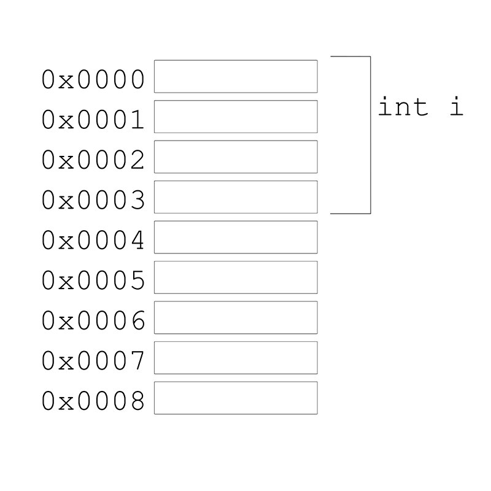
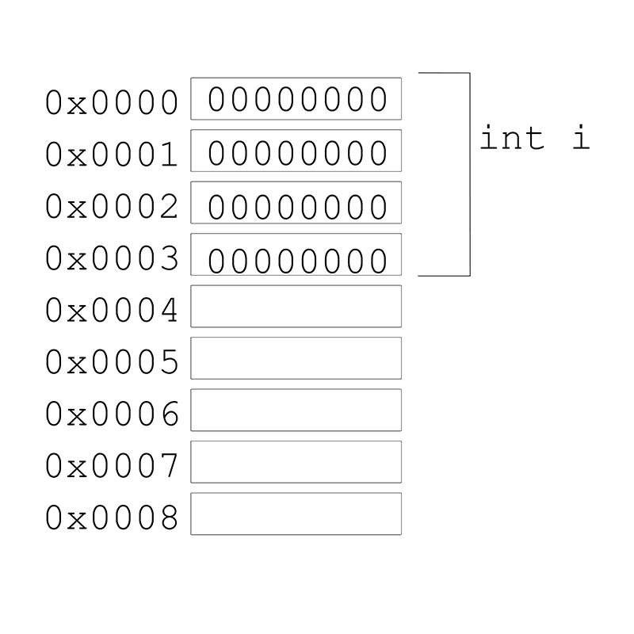
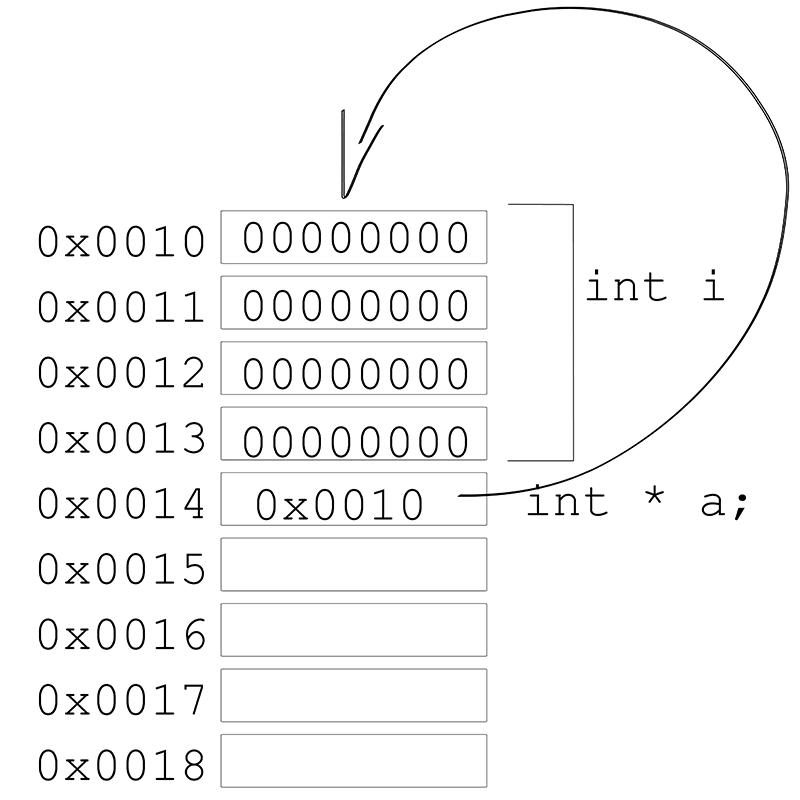
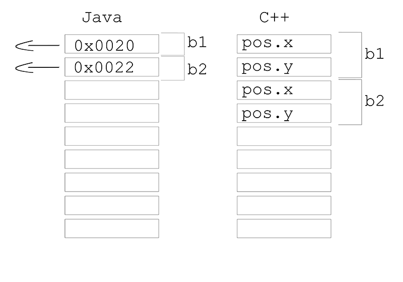
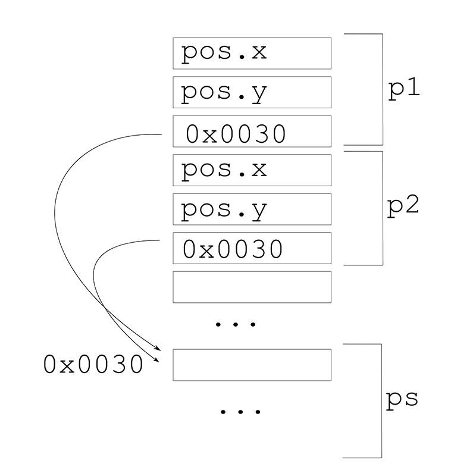
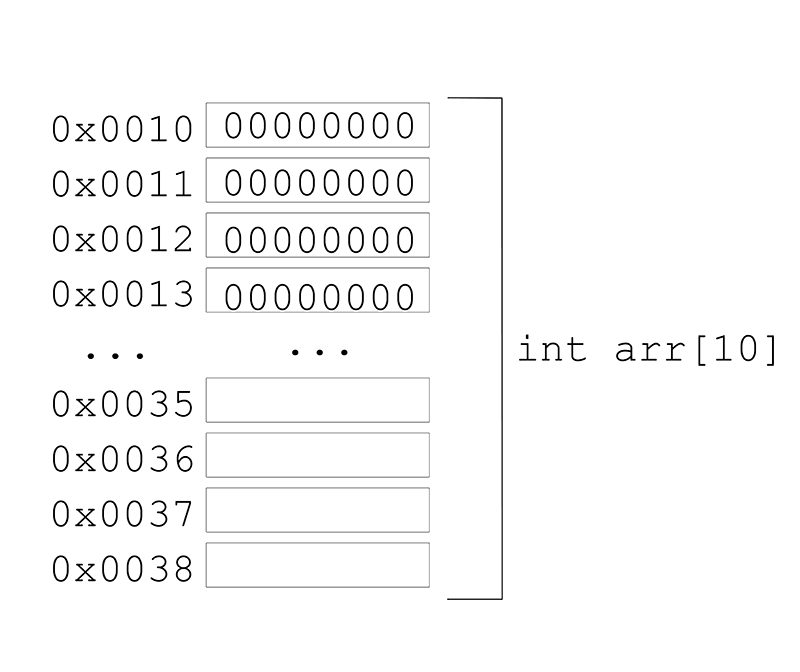
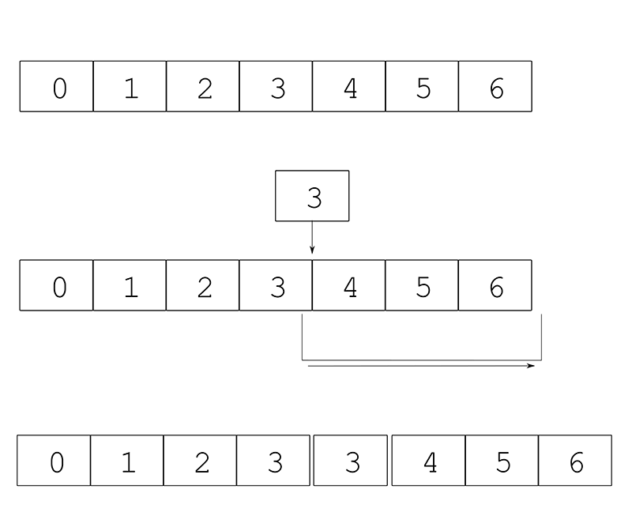
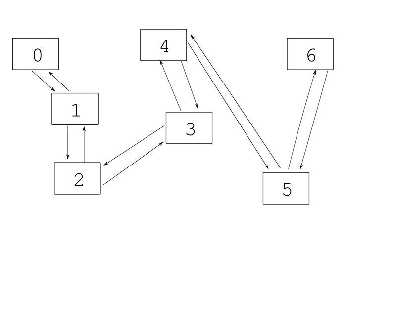

# Memory in C++

*by [Arturo Castro](http://arturocastro.net)*


Correctly using memory is one of the trickiest parts of working with c++. The main difference with other languages like Java, Python and in general any languages that are "garbage collected" is that in c++ we can explicitly reserve and free memory while in those an element called garbage collector does the work for us.

There's also an important difference, in c++ we have two different memory areas, the heap and the stack, if you are used to work with processing, Java or Python among others you'll be used to only have heap memory.

We'll see later what the main differences are, but first let's see what's memory and what happens when we create variables in our program.

## Computer memory and variables

It's helpful to understand at least at a high level how computer memory works.

A computer has different types of memory, in this section we are going to be talking about RAM (Random Access Memory) memory. The kind of memory where the computer stores the instructions for the programs that are executing at every moment and the data those programs are using.

Your computer probably has something like 4Gb of RAM, in c++ we can access most of that memory, and to access it what we do is create variables. Memory is divided in bytes, which are the minimum memory size that we can usually use in a c++ application. Each data type like char, int, float... has a different size all measured in bytes. Those sizes can be different for different platforms but the most usual is something like:

- char:  1 byte
- short: 2 bytes
- int:   4 bytes
- float  4 bytes
- double 8 bytes

Other types might have variable sizes depending on their contents like for example an array or a string.

For example when we create a variable like:

```cpp
int i;
```

What we are doing is reserving 4 bytes of those 4Gb to store an int, it doesn't really matter if we are storing ints or other types of data, the sizes will be different for an int, a char, a float, or a string but the type of memory is always the same.

Internally the computer doesn't really know about that memory area as `i` but as a memory address. A memory address is just a number that points to a specific byte in the 4Gb of memory.

When we create a variable like `int i` we are telling our program to reserve 4 bytes of memory, associate the address of the first byte of those 4 to the variable name `i` and restrict the type of data that we are going to store in those 4 bytes to only ints.



Usually memory addresses are represented in [hexadecimal](http://en.wikipedia.org/wiki/Hexadecimal). In c++ you can get the memory address of a variable by using the `&` operator, like:

```cpp
cout << &i << endl;
```

The output of that cout is the memory address of the first byte of the variable `i` we just created.

Later on, when we assign a value to that variable, what is happening is that we are storing that value in the memory area that we've just reserved by declaring the variable, so when we do:

```cpp
i = 0;
```

Our memory will look like:



The order in which the bytes that form the int are layed out in the memory depends on the architecture of our computer, you'll prpbably seen [little endian and big endian](http://en.wikipedia.org/wiki/Endianness) mentioned sometime. Those terms refer to how the bytes of a data type are ordered in memory, if the most significative bytes come first or last. Most of the time we don't really need to know about this order but most modern computer architectures use little endian.

If you've used c++ for a while you've probably had crashes in your programs because of bad memory accesses. Usually the message you'll see is something like `segmentation fault...`. What does that mean?

When you create variables in a program, even in c++, you can't really access all the memory in the computer, for security reasons. Imagine you had your bank account opened in your browser, if any program could access all the memory in the computer a malign application could just access the memory of the browser and get that information or even modify it. To avoid it the operating system assigns chunks of memory to every program. When your application starts it's assigned a `segment` of memory. Later on as you create variables if there's enough memory in that `segment` your variables will be created there. When there's no more memory available in that segment the operating system assigns the application a new one and the application starts using that. If you try to access a memory address that doesn't belong to a segment assigned to your application, the operating system just kills the application to avoid possible security risks.

How does that happen usually? Well most of the time you just don't try to access memory addresses by their number, so how is it possible that sometimes you try to access a variable and you get a segmentation fault? Most of the time this happens because you try to access a variable that doesn't exist anymore, usually because you stored a pointer to a memory area and then freed or moved that memory somewhere else. We'll talk in more detail about this later.

## Stack variables, variables in functions vs variables in objects

As we said at the beginning of the chapter there's two types of memory in c++ the stack and the heap. Let's talk first about the stack since that's the easiest type of memory to use and what you'll use more frequently in openFrameworks.

The stack is the type of memory that you use when creating variables inside a function or in the .h of your class as long as you don't use pointers and the keyword `new`.

It's called stack because it's organized like a [stack](http://en.wikipedia.org/wiki/Stack_%28abstract_data_type%29). When in our application we call a function, there's an area in memory assigned to that function **call**. That specific function **call**, and only it, during the time it lasts can create variables in that area.

Those variables stop existing when the function call ends. So for example you can't do:

```cpp
void ofApp::setup(){
    int a = 0;
}

void ofApp::update(){
    a = 5; // error a doesn't exist outside setup
}
```

Also since we are talking about function calls you can't store a value in an stack variable and expect it to be there when the function is called again.

In general we can say that variables exist in the block they've been defined, a block in c++ is defined by the `{}` inside which a variable was defined, so for example, doing this won't be valid either:

```cpp
for (int i=0;i<10;i++){
    int a = 5;
}
cout << a << endl; // error a doesn't exist outside the {} of the for
```

We can even do this:

```cpp
void ofApp::setup(){
   {
        int a = 0;
        // do something with a
   }

   {
        int a = 0;
        // do something with a
   }
}
```

which is not very common but is used sometimes to define the life of a variable inside a function, mostly when that variable is an object that holds resources and we want to only hold them for a specific duration.

The life of a variable is called `scope`.

Apart from creating variables inside functions we can also create variables in the class declaration in our .h like:

```cpp
class Ball{
public:
    void setup();

    float pos_x;
}
```

These kind of variables are called `instance variables` because every instance or object of our class will get a copy of it. The way they behave is more or less the same as the stack variables created in functions. They exist for the duration of the {} in which they were defined, in this case the {} of the object to which they belong.

These variables can be accessed from anywhere in the class so when we need to have data that is accessible from any function in an object of this class we create it like this.

The memory in the stack is limited, the exact size, depends on the architecture of our computer, the operating system and even the compiler we are using. In some systems it can even be changed during the runtime of the application, but most of the time we won't reach that limit.

Even if we create all of our variables in the stack, usually the objects that consume most memory like for example a vector or in openFrameworks something like ofPixels, will create most of the memory they use internally in the heap which is only limited by the amount of memory available in the computer so we don't need to worry about it.

We'll see in the next sections how the heap works and what are the advantages of using the heap or the stack.

## Pointers and references ##

Before talking about heap memory let's see how pointers and references work in c++, what's their syntax and what's really happening with memory when we create a pointer or a reference.

As we've seen before we can get the address of a variable by doing:

```cpp
cout << &i << endl;
```

And that will give us the memory address of the first byte used by that variable no matter its type. When we store that memory address in another variable that's what we call in c++ a pointer. The syntax is:

```cpp
int i = 0;
int * p = &i;
```

And what we get in memory is something like:



A pointer usually occupies 4 or 8 bytes (depending if we are on a 32 or 64bits application), we are representing it as 1 byte only to make things easier to understand, but as you can see it's just another variable, that instead of containing a value contains a memory address that points to a value. That's why it's called pointer.

A pointer can point to heap or stack memory.

Now, let's explain something that it's really important to take into account when programming in c++. As we've seen till now, when we declare a variable like:

```cpp
int i;
```
We get a memory layout like:


As we see there's no value in that memory area yet. In other languages like processing doing something like:

```java
int i;
println(i);
```

is illegal, the compiler will tell us that we are trying to use a variable that is not initialized. In c++ though, that's perfectly legal but the contents of that variable are undefined. Most of the times we'll get 0 because the operating system will clear the memory before assigning it to our program, again, for security reasons. But if we are reusing memory that we had already assigned, then, that memory area will contain anything, and the results of our program will be undefined.

If for example we have a variable that defines the position of something we are going to draw, failing to initialize it will lead to that object being drawn anywhere.

Most objects have default constructors that will initialize their value to, for example 0, so in the case of objects it's usually not necessary to give them a value.

What happens when we use an uninitialized pointer? Well, since a pointer contains a memory address, if the value we get in that memory area points to an address that doesn't belong to our program and we try to retrieve or modify the value stored in that address the OS will kill our application with a segmentation fault signal.

Back to pointers, we've seen that, we can create a pointer like:

```cpp
int i = 5;
int * p = &i;
```

now, if we try to use the pointer directly like;

```cpp
cout << p <<< endl;
```

what we'll get is a memory address not the value 5. So how do we access the value pointed by a pointer? Well, we can use the opposite operator to `&`: as `&` gives us the address of a variable, `*` gives us the value pointed by a memory address, so we can do:

```cpp
cout << *p << endl;
```

and we'll get the value 5 printed now. We can also do:

```cpp
int j = *p;
cout << j << endl;
```

and again will get the value 5 since we made a copy of the value pointed by p in j.

The `&`operator is called the *reference operator* since it gives us a reference to a variable, its memory address. The `*` operator is its opposite, the *dereference operator* and it gives us the value pointed by a pointer, it dereferences a reference, a memory address, so we can access its value instead of the address.

Till now, we've work with primitive values, ints really, but the behaviour will be the same for any other primitive value, like float, short, char, unsigned int...  In c++ in fact, the behaviour is also the same for objects.

If you are used to Java, for example you've probably noticed that while in Java and C++ this:

```cpp
int a = 5;
int b = a;
a = 7;
cout << "a: " << a << " b: " << b << endl;
```

will behave the same (of course changing cout for the equivalent in java). That is: `a` will end up being 7 and `b` will be 5. When we use objects the behaviour in c++ is different to that of Java. For example, let's say we have a class Ball:

```cpp
class Ball{
public:
    void setup();
    //...

    ofVec2f pos;
}
```

or the similar class in processing;

```java
class Ball{
    void setup();

    PVector pos;
}
```

if in c++ you do:

```cpp
Ball b1;
b1.pos.set(20,20);
Ball b2;
b2 = b1;
b2.pos.set(30,30);
```

b1 pos will end up being 20,20 and b2 30,30 while if you do the equivalent in java both b1 and b2 will have position 30,30:


```cpp
Ball b1 = new Ball();
b1.pos.set(20,20);
Ball b2;
b2 = b1;
b2.pos.set(30,30);
```

Notice how in the case of Java we have made new for the first ball but not for the second, that's because in Java everything that is an object is a pointer in the heap so when we do `b2 = b1`we are actually turning b2 into a reference to b1, and when we later change b2, we are also changing b1.

In c++, instead when we do `b2 = b1` we are actually copying the values of the variables of b1 into b2 so we still have 2 different variables instead of a reference. When we modify b2, b1 stays the same.

In both languages the `=` means copy the value of the right side into the variable on the left side of the `=`. The difference is that in Java an object is really a pointer to an object the contents of `b1` or `b2` are not the object itself but its memory address, while in c++ b1 actually contains the object itself.

This is more or less what memory would look like in Java and C++:



As you can see in c++ objects in memory are just all their member variables one after another. When we make an object variable equal to another, by default, c++ copies all the object to the left side of the equal operator.

Now what would happen if we have a class like:

```cpp
class Particle{
public:
    void setup();
    //...

    ofVec2f pos;
    ParticleSystem * parent;
}
```

And we do:

```cpp
Particle p1;
Particle p2;
ParticleSystem ps;

p1.pos.set(20,20);
p1.parent = &ps;
p2 = p1;
```

Well as before c++ will copy the contents of p1 on p2, the contents of p1 are an ofVec2f which consits of 2 floats x and y and then a pointer to a ParticleSystem, and that's what gets copied, the ParticleSystem itself won't get copied only the pointer to it, so p2 will end up having a copy of the position of p2 and a pointer to the same ParticleSystem but we'll have only 1 particle system.



The fact that things are copied by default and that objects can be stored in the stack as oposed to being always a pointer has certain adavantages. For example, in c++ a vector or an array of particles like the ones we've used in the last example will look like:

```cpp
vector<Particle> particles;
```

in memory all the particles will be contiguous, among other things, that makes accessing them faster than if we had pointers to a different location in memory. It also makes it easier to translate c++ vectors to openGL memory structures but that's the topic for another chapter.

Among other things we need to be aware of the fact that c++ copies things by default, when passing objects to functions as parameters. For example this:

```cpp
void moveParticle(Particle p){
    p.x += 10;
    p.y += 10;
}

...

Particle p1;
moveParticle(p1);
```

Is perfectly valid code, but won't have any effect since the function will receive a copy of the particle and modify that copy instead of the original.

We can do this:

```cpp
Particle moveParticle(Particle p){
    p.x += 10;
    p.y += 10;
    return p;
}
...

Particle p1;
p1 = moveParticle(p1);
```

So we pass a copy of our particle to the function which modifies its values and returns a modified copy which we then copy into p1 again. See how many times we've mentioned copy in the previous sentence?  The compiler will optimize some of those out and for small objects it's perfectly okay to do that but imagine we had something like this:

```cpp
vector<Particle> moveParticles(vector<Particle> ps){
    for(int i=0;i<ps.size();i++){
        ps[i].x += 10;
        ps[i].y += 10;
    }
    return ps;
}
...

vector<Particle> ps;
...
ps = moveParticles(ps);
```

If we have 1 million particles that will be awfully slow, memory is really slow compared to the cpu, so anything that involves copying memory or allocating new memory should be usually avoided. So what can we do to avoid all that copies?

Well we could use pointers right?

```cpp
void moveParticle(Particle * p){
    p->x += 10;
    p->y += 10;
}
...

Particle p1;
moveParticle(&p1);
```

Now, here's something new, notice how to refer to the variables of a pointer to an object instead of using the dot, we use the `->` operator, every time we want to access a variable in a pointer to an object instead of having to dereference it like:

```cpp
(*p).x +=10;
```

we can use the `->`

```cpp
p->x += 10;
```

So that solves our problem, using a pointer instead of passing a copy of the object, we are passing a reference to it, its memory address, so the function will actually modify the original.

The main problem with this is that the syntax is kind of weird, imagine how would look like if we passed a pointer for the second example, the one with the vector:

```cpp
vector<Particle> moveParticles(vector<Particle> ps){
    for(int i=0;i<ps.size();i++){
        ps[i].pos.x += 10;
        ps[i].pos.y += 10;
    }
    return ps;
}
...

vector<Particle> ps;
...
ps = moveParticles(ps);
```

Now, the function will look like:

```cpp
void moveParticles(vector<Particle> * ps){
```

the problem is that now we can't use the [] operator to access the elements in the vector cause ps is not a vector anymore but a pointer to a vector. What's more this

```cpp
ps[i].x += 10;
```

would actually compile but would mostly sure give as a memory access error, a segmentation fault. ps is now a pointer and when using pointers the `[]' behaves like if we had an array of vectors!

We'll explain this in more depth in the section about memory structures, but let's see how to pass a reference that doesn't have pointer syntax. In c++ is called a reference and it looks like:

```cpp
void moveParticles(vector<Particle> & ps){
    for(int i=0;i<ps.size();i++){
        ps[i].pos.x += 10;
        ps[i].pos.y += 10;
    }
}

vector<Particle> ps;
...
moveParticles(ps);
```

Now we are passing a reference to the original object but instead of having to use pointer syntax we can still use it as if it was a normal object.

> Advanced note: Some times we want to use references to avoid copies but still be sure that the function we pass our object to, won't modify its contents, in that case it's recommendable to use const like:

>
    ofVec2f averagePosition(const vector<Particle> & ps){
        ofVec2f average;
        for(int i=0;i<ps.size();i++){
            average += ps[1].pos;
        }
        return average/float(ps.size());
    }
    vector<Particle> ps;
    ...
    ofVec2f averagePos = averagePosition(ps);


> const only makes it impossible to modify the variable, even if it's a reference, and tells anyone using that function that they can pass their data into it and it won't be changed, also anyone modifying that function knows that in the future it should stay the same and the input, the particle system shouldn't be modified.

Outside of parameters, references have a couple of special characteristics.

First we can't modify the content of a reference once it's created, for example we can do:

```cpp
ofVec2f & pos = p.pos;
pos.x = 5;
```

but trying to change the reference itself like in:


```cpp
ofVec2f & pos = p.pos;
pos.x = 5;
pos = p2.pos;  // error, a reference can only be assigned on its declaration
```

Also you can return a reference but depending on what that reference it's pointing to it can be a bad idea:

```cpp
ofVec2f & averagePosition(const vector<Particle> & ps){
    ofVec2f average;
    for(int i=0;i<ps.size();i++){
        average += ps[1].pos;
    }
    average/=float(ps.size());
    return average;
}
```

Will actually compile but will probably result in a segmentation fault at some point or even just work but we'll get weird values when calling this function. The problem is that we are creating the variable `average` in the stack so when the function returns it'll be *deleted* from memory, the reference we return will be pointing to a memory area that is not reserved anymore for average and as soon as it gets overwritten we'll get invalid values or a pointer to a memory area that doesn't belong to our program anymore.

This is one of the most annoying problems in c++ it's called dangling pointers or in this case references and it's caused when we have a pointer or a reference that points to a memory area that is later freed somehow.

More modern langauges solve this with diferent strategies, for example Java won't let this happen since objects are only deleted once the last reference to them goes out of scope, it uses something called a garbage collector that from time to time goes through the memory looking for objects which have no more references pointing to them, and deletes them. This solves the problem but makes it hard to know when objects are going to get really deleted. c++ in its latest versions, and more modern languages try to solve this using new kinds of pointers that define ownership of the object, we'll talk about it in the latest section of this chapter, smart pointers.

## Variables in the heap ##

Now that we know the syntax and semantics of pointers lets see how to use the heap. The heap is an area of memory common to all of our application, any function can create variables in this space and share it with others, to use it we need a new keyword `new`:

```cpp
Particle * p1 = new Particle;
```

If you know processing or Java that looks a little bit like it, right? indeed this is exactly the same as a Java object: when we use `new` we are creating that variable in the heap instead of the stack. `new` returns  a pointer to a memory address in the heap and in c++ we explictly need to specify that the variable `p1` where we are going to store it, is a pointer by using the `*` in the declaration.

To access the variables or functions of a pointer to an object, as we've seen before, we use the `->` operator so we would do:

```cpp
Particle * p1 = new Particle;
p1->pos.set(20,20);
```

or:

```cpp
Particle * p1 = new Particle;
p1->setup();
```

A pointer as any variable can be declared without initializing it yet:

```cpp
Particle * p1;
p1->setup() // this will compile but fail when executing the application
```

We can imagine the heap as some kind of global memory as opposed to the stack being local memory. In the stack only the block that owned it could access it while things created in the heap outlive the scope in which they were created and any function can access them as long as they have a reference (a pointer) to them. For example:

```cpp
Particle * createParticle(){
    return new Particle;
}

void modifyParticle(Particle * p){
    p->x += 10;
}

...

Particle * p = createParticle();
modifyParticle(p);
```

`createParticle` is creating a new `Particle` in the heap, so even when createParticle finishes that `Particle` still exists. We can use it outside the function, pass a reference to it to other functions...

So how can we say that we don't want to use that variable anymore? we use the keyword `delete`:

```cpp
Particle * p1 = new Particle;
p1->setup();
...
delete p1;
```

This is important when using the heap, if we fail to do this we'll get with what is called a memory leak, memory that is not referenced by anyone but continues to leave in the heap, making our application use more and more memory over time till it fills all the available memory in our computer:

```cpp
void ofApp::draw(){
    Particle * p1 = new Particle;
    p1->setup();
    p1->draw();
}
```

every time we call `draw`, it'll create a new particle, once each `draw` call finishes we loose the reference *p1 to it but the memory we allocated using new is not freed when the function call ends so our program will slowly use more and more memory, you can check it using the system monitor.

As we've mentioned before the stack memory is limited so sometimes we need to use the heap, trying to create 1 million particles in the stack will probably cause a stack overflow. In general, though, most of the time in c++ we don't need to use the heap, at least not directly, classes like vector, ofPixels and other memory structures allow us to use heap memory but still have stack semantics, for example this:


```cpp
void ofApp::draw(){
    vector<Particle> particles;
    for(int i=0; i<100; i++){
        particles.push_back(Particle())
        particles.back().setup();
        particles.back().draw();
    }
}
```

is actually using heap memory since the vector is internally using that, but the vector destructor will take care of freeing that memory for us as soon as the particles variable goes out of scope, when the current call to draw finishes.

## Memory structures, arrays and vectors ##

Arrays are the most simple way in c++ to create collections of objects, as any other type in c++ they can also be created in the stack or in the heap. Arrays in the stack have a limitation though, they need to have a predifined size that needs to be specified in its declaration and can't change afterwards:

```cpp
int arr[10];
```

the same as with any other type, the previous declaration already reserves memory for 10 ints, we don't need to use new, and that memory will be uninitialized. To access them, as you might know from previous chapters you can just do:

```cpp
int arr[10];
arr[0] = 5;
int a = arr[0];
```

if we try to do:

```cpp
int arr[10];
int a = arr[5];
```

the value of a will be undefined since the memory in the array is not initialized to any value when it's created. Also if we try to do:

```cpp
int arr[10];
int a = arr[25];
```

most probably our application will crash if the memory address at arr + 25 is outside the memory that the operating system has assigned to our application.

We've just said arr + 25? what does that mean? As we've seen before a variable is just some place in memory, we can get its memory address which is the first byte that is assigned to that variable in memory. With arrays is pretty much the same, for example since we know that an int occupies 4 bytes in memory, an array of 10 ints will occupy 40 bytes and those bytes are contiguous:



Remember that memory addresses are expressed as hexadecimal so 40 == 0x0028. Now to take the address of an array, as with other variable we might want to use the `&` operator and indeed we can do it like:

```cpp
int arr[0];
int * a = &arr[0];
```

That gives us the address of the first element of the array which is indeed that of the array, but with arrays, the same variable is actually a pointer itself:

```cpp
int arr[10];
int * a = &arr[0];
cout << "a: " << a << " arr: " << arr << endl;
```

will print the same value for both a and arr. So an array is just a pointer to a memory address with the only difference that, that memory address is the beginning of reserved memory enough to allocate, in our case, 10 ints. All those ints will be one after another, so when we do `arr[5]` we are just accessing the value that is in the memory address of our array + the size of 5 ints. If our array started in `0x0010`, and ints occupy `4 bytes`, arr[5] would be `16` *(the decimal for 0x0010)* ` + 4 * 5 = 36` which in hexadecimal is `0x0024`. We can actually do this in our code:

```cpp
int arr[10];
arr[5] = 20;
cout << "&arr[5]: " << &arr[5] << "arr+5: " << arr+5 << endl;
cout << "arr[5]: " << arr[5] << "*(arr+5): " << *(arr+5) << endl;
```

now, that's really weird and most of the time you won't use it, it's called pointer arithmetic. The first cout will print the address in memory of the int at position 5 in the array in the first case using the `&` operator to get the address of `arr[5]` and in the second directly by adding 5 to the first address of `arr` doing `arr+5`. In the second cout we print the value at that memory location, using `arr[5]` or dereferencing the address `arr+5` using the `*` operator.

Note that when we add `5` to the adress of the array it's not bytes we are adding but the size in bytes of the type it contains, in this case `+5` actually means `+20` bytes, you can check it by doing:

```cpp
int arr[10];
arr[5] = 7;
cout << "arr: " << arr << "arr+5: " << arr+5 << endl;
```

and substracting the hexadecimal values in a calculator. If you try to substract them in your program like:


```cpp
int arr[10];
arr[5] = 20;
cout << "arr: " << arr << "arr+5: " << arr+5 << endl;
cout << "(arr+5) - arr: " << (arr+5) - arr << endl;
```

You will end up with `5` again because as we've said pointer arithmetic works with the type size not bytes.

The syntax of pointer arithmetics is kind of complicated, and the idea of this part wasn't really to show pointer arithmetics itself but how arrays are just a bunch of values one after another in memory, so don't worry if you haven't fully understood the syntax, it's probably something you won't need to use. It is also important to remember that an array variable acts as a pointer so when we refer to it without using the `[]` operator we end up with a memory address not with the values it contains.

The arrays we've created till now are created in the stack so be careful when using big arrays like this cause it might be problematic.

Arrays in the heap are created like anything else in the heap, by using `new`:

```cpp
int arr[] = new int[10];
```

or

```cpp
int * arr = new int[10];
```

As you can see this confirms what we've said before, an array variable is just a pointer, when we call `new int[10]` it allocates memory to store 10 integers and returns the memory address of the first byte of the first integer in the array, we can keep it in a pointer like in the second example or using `int arr[]` which declares an array of unkown size.

The same as other variables created in the heap we'll need to delete this manually so when we are done with it we need to use `delete` to deallocate that memory, in the case of arrays in the heap the syntax is slightly special:

```cpp
int arr[] = new int[10];
...
delete[] arr;
```

if you fail to use the `[]` when deleting it, it'll only deallocate the first value and you'll end up with a memory leak.

There's also some problems with the syntax of arrays, for example this:


```cpp
int arr[10];
int arrB[10];
arrB = arr;
```

will fail to compile. And this:


```cpp
int arr[] = new int[10];
int arrB[] = new int[10];
arrB = arr;
```

will actually compile but as with other variables we are not copying the values that arr points to into arrB but instead the memory address. In this case will end up with 2 pointers pointing to the same memory location, the one that we created when creating arr and lose the memory that we allocated when initializing arrB. Again we have a memory leak, the memory allocated when doing `int arrB[] = new int[10];` is not referenced by any variable anymore so we can't delete it anymore. To copy arrays there's some **c** (not c++) functions like memcpy but their syntax is kind of complex, that's why when working with c++ is recommended to use vectors.

C++ vectors are very similar to arrays, indeed their layout in memory is the same as an array, they contain a bunch of values contiguous in memory and always allocated in the heap. The main difference is that we get a nicer syntax and *stack semantics*. To allocate a vector to contain 10 ints we can do:

```cpp
vector<int> vec(10);
```

We can even give an initial value to those 10 ints in the initialization like:

```cpp
vector<int> vec(10,0);
```

And for example copying a vector into another, works as expected:

```cpp
vector<int> vec(10,0);
vector<int> vecB = vec;
```

Will create a copy of the contents of vec in vecB. Also even if the memory that the vector uses is in the heap, when a vector goes out of scope, when the block in which it was declared ends, the vector is destroyed cause the vector itself is created in the stack, so going out of scope, triggers its destructor that takes care of deleting the memory that it has created in the heap:

```cpp
void ofApp::update(){
    vector<int> vec(10);
    ...
}
```

That makes vectors easier to use than arrays since we don't need to care about deleting them, end up with dangling pointers, memory leaks... and their syntax is easier.

Vectors have some more features and using them properly might be tricky mostly if we want to optimize for performance or use them in multithreaded applications, but that's not the scope of this chapter, you can find some tutorials about vectors, this is an introductory one in the openFrameworks site: [vectors basics](http://openframeworks.cc/tutorials/c++%20concepts/001_stl_vectors_basic.html) and this one explains more advanced concepts [std::vector](http://arturocastro.net/blog/2011/10/28/stl::vector/)


## Other memory structures, lists and maps ##

Having objects in memory one after another is most of the time what we want, the access is really fast no matter if we want to access sequentially to each of them or randomly to anyone, since a vector is just an array internally, accessing let's say position 20 in it, just means that internally it just needs to get the memory address of the first position and add 20 to it. In some cases though, vectors are not the most optimal memory structure. For example, if we want to frequently add  or remove elements in the middle of the vector, and you imagine the vector as a memory strip, that means that we need to move the rest of the vector till the end one position to the right and then insert the new element in the free location. In memory there's no such thing as move, moving contiguous memory means copying it and as we've said before, copying memory is a relatively slow operation.



Sometimes, if there's not enough memory to move/copy the elements, one position to the right, the vector will need to copy the whole thing to a new memory location. If we are working with thousands of elements and doing this very frequently, like for example every frame, this can really slow things down a lot.

To solve that, there's other memory structures like for example lists. In a list, memory, is not contiguous but instead each element has a pointer to the next and previous element so inserting one element just means changing those pointers to point to the newly added element. In a list we never need to move elements around but it's main disadvantage is that not being the elements contiguous in memory it's access can be slightly slower than a vector, also that we can't use it in certain cases like for example to upload data to the graphics card which always wants contiguous memory.



Another problem of lists is that trying to access an element in the middle of the list (what is called random access) is slow since we always have to go through all the list till we arrive to the desired element. Lists are used then, when we seldom need to access randomly to a position of it and we need to add or remove elements in the middle frequently. For the specifics of the syntax of a list you can check the [c++ documentation on lists](http://www.cplusplus.com/reference/list/list/)

There's several memory structures in the c++ standard library or other c++ libraries, apart from vectors and lists we are only going to see briefly maps.

Sometimes, we don't want to access things by their position or have an ordered list of elements but instead have something like an index or dictionary of elements that we can access by some key, that's what a map is. In a map we can store pairs of (key,value) and look for a value by it's key. For example let's say we have a collection of objects which have a name, if that name is unique for all the objects, we can store them in a map to be able to look for them by their name:

```cpp
map<string, NamedObject> objectsMap;

NamedObject o1;
o1.name = "object1";
objectsMap[o1.name] = o1;
```

Later on we can look for that object using it's name like:

```cpp
objectsMap["object1"].doSomething();
```

Be careful though, if the object didn't exist before, using the `[]` operator will create a new one. If you are not sure, it's usually wise to try to find it first and only use it if it exists:

```cpp
if(objectsMap.find("object1")!=objectsMap.end()){
    objectsMap["object1"].doSomething();
}
```

You can find the complete reference on maps in the [c++ documentation for maps](http://www.cplusplus.com/reference/map/map/)


## smart pointers ##

As we've said before, traditional c pointers also called now *raw pointers* are sometimes problematic, the most frequent problems are dangling pointers: pointers that probably were once valid but now point to an invalid memory location, trying to dereference a NULL pointer, possible memory leaks if we fail to deallocate memory before loosing the reference to that memory address...

Smart pointers try to solve that by adding what we've been calling stack semantics to memory allocation, the correct term for this is RAII: [Resource Acquisition Is Initialization](http://en.wikipedia.org/wiki/Resource_Acquisition_Is_Initialization) And means that the creation of an object in the stack, allocates the resources that it'll use later. When it's destructor is called because the variable goes out of scope, the destructor of the object is triggered which takes care of deallocating all the used resources. There's some more implications to RAII but for this chapter this is what matters to us more.

Smart pointers use this technique to avoid all the problems that we've seen in raw pointers. They do this by also defining better who is the owner of some allocated memory or object. Till now we've seen how things allocated in the stack belong to the function or block that creates them we can return a copy of them (or in c++11 or later, move them) out of a function as a return value but their ownership is always clear.

With heap memory though, ownership becomes way more fuzzy, someone might create a variable in the heap like:

```cpp
int * createFive(){
    int * a = new int;
    *a = 5;
    return a;
}
```

Now, when someone calls that function, who is the owner of the `new int`? Things can get even more complicated, what if we pass a pointer to that memory to another function or even an object?


```cpp
// ofApp.h
int * a;
SomeObject object;

// ofApp.cpp
void ofApp::setup(){
    a = createFive();
    object.setNumber(a);
}
```

who is now the owner of that memory? ofApp? object? The ownership defines among other things who is responsible for deleting that memory when it's not used anymore, now both ofApp and object have a reference to it, if ofApp deletes it before object is done with it, object might try to access it and crash the application, or the other way around. In this case it seems logical that ofApp takes care of deleting it since it knows about both object and the pointer to int a, but what if we change the example to :


```cpp
// ofApp.h
SomeObject object;

// ofApp.cpp
void ofApp::setup(){
    int * a = createFive();
    object.setNumber(a);
}
```

or even:


```cpp
// ofApp.h
SomeObject object;

// ofApp.cpp
void ofApp::setup(){
    object.setNumber(createFive());
}
```


now ofApp doesn't know anymore about the allocated memory but both cases are possible so we actually need to know details of the implementation of object to know if we need to keep a reference of that variable to destroy it later or not. That, among other things breaks encapsulation, that you might now from chapter 1. We shouldn't need to know how object works internally to be able to use it. This makes the logic of our code really complicated and error prone.


Smart pointers solve this by clearly defining who owns an object and by automatically deleting the allocated memory when the owner is destroyed. Sometimes, we need to share an object among several owners. For that cases we have a special type of smart pointers called shared pointers that defined a shared ownership and free the allocated memory only when all the owners cease to use the variable.

We are only going to see this briefly, there's lots of examples in the web about how to use smart pointers and reference to their syntax, the most important is to understand how they work by defining the ownership clearly compared to raw pointers and the problems they solve.

### unique_ptr

A unique_ptr, as it's name suggests, is a pointer that defines a unique ownership for an object, we can move it around and the object or function that has it at some point is the owner of it, no more than one reference at the same time is valid and when it goes out of scope it automatically deletes any memory that we might have allocated.

To allocate memory using a unique_ptr we do:

```cpp
void ofApp::setup(){
	unique_ptr<int> a(new int);
	*a = 5;
}
```

As you can see, once it's created it's syntax is the same as a raw pointer, we can use the `*` operator to dereference it and access or modify it's value, if we are working with objects like:

```cpp
void ofApp::setup(){
	unique_ptr<Particle> p(new Particle);
	p->pos.set(20,20);
}
```

We can also use the `->` to access it's member variables and functions.

When the function goes out of scope, since unique_ptr is an object, it's destructor will get called, which internally will call `delete` on the allocated memory so we don't need to call delete on unique_ptr at all.

Now let's say we want to move a unique_ptr into a vector:

```cpp
void ofApp::setup(){
	unique_ptr<int> a(new int);
	*a = 5;

	vector<unique_ptr<int> > v;
	v.push_back(a);  // error
}
```

That will generate a long error, depending on the compiler, really hard to understand. What's going on, is that `a` is still owned by ofApp::setup so we can't put it in the vector, what we can do is move it into the vector by explicitly saying that we want to move the ownership of that unique_ptr into the vector:

```cpp
void ofApp::setup(){
	unique_ptr<int> a(new int);
	*a = 5;

	vector<unique_ptr<int> > v;
	v.push_back(move(a));
}
```

There's a problem that unique_ptr doesn't solve, we can still do:


```cpp
void ofApp::setup(){
	unique_ptr<int> a(new int);
	*a = 5;

	vector<unique_ptr<int> > v;
	v.push_back(move(a));

	cout << *a << endl;
}
```

The compiler won't fail there but if we try to execute the application it'll crash since `a` is not owned by ofApp::setup anymore, having to explicitly use `move` tries to solve that problem by making the syntax clearer. After using move, we can't use that variable anymore except through the vector. More modern langauages like [Rust](http://www.rust-lang.org/) completely solve this by making the compiler detect these kinds of uses of moved variables and producing a compiler error. This will probably be solved at some point in c++ but for now you need to be careful to not use a moved variable.


### shared_ptr

As we've seen before, sometimes having unique ownership is not enough, sometimes we need to share an object among several owners, in c++11 or later, this is solved through `shared_ptr`. The usage is pretty similar to `unique_ptr`, we create it like:

```cpp
void ofApp::setup(){
	shared_ptr<int> a(new int);
	*a = 5;

	vector<shared_ptr<int> > v;
	v.push_back(a);
}
```

The difference is that now, both the vector and ofApp::setup, have a reference to that object, and doing:


```cpp
void ofApp::setup(){
	shared_ptr<int> a(new int);
	*a = 5;

	vector<shared_ptr<int> > v;
	v.push_back(a);

	cout << *a << endl;
}
```

Is perfectly ok. The way a shared_ptr works is by keeping a count of how many references there are to it, whenever we make a copy of it, it increases that counter by one, whenever a reference is destroyed it decreases that reference by one. When the reference count arrives to 0 it frees the allocated memory. The reference counting is done atomically, which means that we can share a shared_ptr across threads without having problems with the count. That doesn't mean that we can access the contained data safely in a multithreaded application, just that the reference count won't get wrong if we pass a shared_ptr accross different threads.
