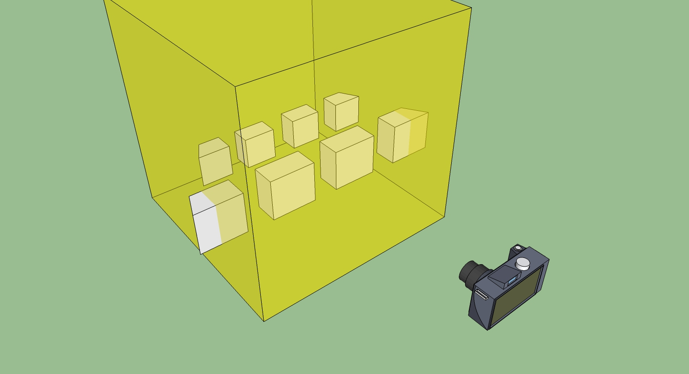
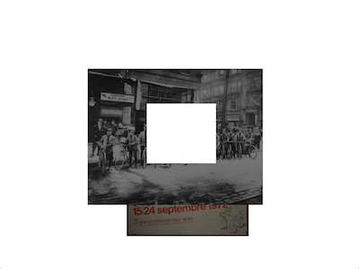
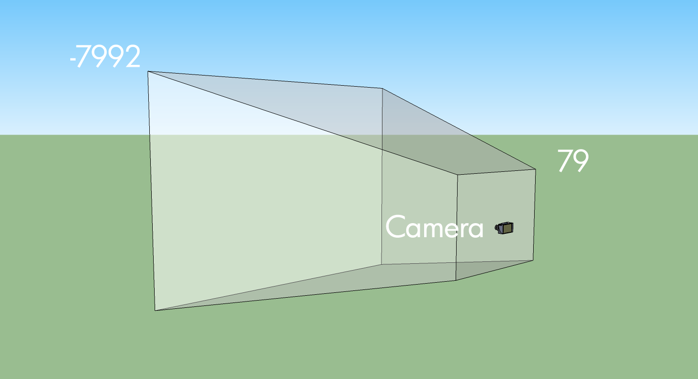

# 오픈프레임웍스를 위한 openGL 소개

*[Joshua Noble](http://twitter.com/fctry2/)에 의해 작성*


## Introducing

시작하기에 앞서, OpenGL이란 Open Graphics Language의 약자입니다만, 아무도 그렇게 부르지 않고 그냥 OpenGL이라고 부르죠, 따라서 우리도 그렇게 부르도록 합시다. 또 하나, 좀 거시적으로 얘기하자면, OpenGL은 CPU상의 프로그램이 GPU상의 프로그램에게 명령하는 방법이라고 할 수 있습니다. 대체 이게 무슨말이냐구요? 사실 컴퓨터는 몇몇의 다른 처리를 하는 장치들로 이루어져 있습니다. 중앙처리장치인 CPU 와 그래픽 처리장치인 GPU가 그들 중 하나이죠. CPU는 대부분의 OF 어플리케이션처럼 동작합니다, 프로그램이 시작되면, 시간의 경과를 체크하고, 파일 시스템에서 데이터를 불러오고, 카메라나 사운드카드에게 명령하는 등등의 작업들이죠. 하지만, CPU는 화면에 뭔가를 그리는 방법은 모릅니다. CPU가 뭔가를 화면에 그리긴 해왔었습니다만, 사람들은 이미지를 불러오고, 쉐이더를 다루고, 실제로 화면에 그리는 별도의 장치를 두는 것이 훨씬 빠르고, 효율적인 방법이라는것을 깨달았습니다. 한 장치에서 다른 장치에게 명령을 하는것은 꽤나 어렵고 이상합니다. 다행이도, OpenGL이 이것을 좀 더 쉽게 만들어줍니다. 그리고 사실 OF는 OpenGL을 통해 이런 까다로운 상당한 작업들을 다룹니다.

OpenGL의 주요 역할은 프로그래머로 하여금 점, 선, 폴리곤등을 만들고 그것을 픽셀로 변환하는 코드들을 만들도록 돕는 것입니다. 오브젝트들을 픽셀로 변환하는 것을 OpenGL의 "파이프라인" 이라고 합니다. high level의 관점에서 이 파이프라인의 원리를 이해하는것은, 어떻게 여러분이 원하는 것을, 빠르게 OF로 만들것인가를 이해하는데에 매우 중요합니다. OF는 OpenGL을 이용해 모든 그래픽을 그려내지만, 대부분의 호출은 숨겨져 있습니다. 이 부분들은 사실 디폴트로 GLFW라고 불리우는 OpenGL의 구현부를 사용합니다. 모든 그래픽과 관련한 호출들은 ofGraphics 클래스를 사용하여 일반적인 OpenGL의 메소드들을 호출합니다. 해당 클래스를 직접 에디터로 열어서 몇몇의 메소드들을 살펴보면 확인할 수 있습니다. 자, 예를들어 OF에서 선을 그려본다고 생각해봅시다. 실제로는 ofGLRenderer::drawLine()을 호출하게 될텐데, 이 메소드는 아래의 코드들을 포함하고 있습니다:

```cpp
	linePoints[0].set(x1,y1,z1);
	linePoints[1].set(x2,y2,z2);

	// use smoothness, if requested:
	if (bSmoothHinted) startSmoothing();

	glEnableClientState(GL_VERTEX_ARRAY);
	glVertexPointer(3, GL_FLOAT, sizeof(ofVec3f), &linePoints[0].x);
	glDrawArrays(GL_LINES, 0, 2);

	// use smoothness, if requested:
	if (bSmoothHinted) endSmoothing();
```

자, 코드가 상당히 어색하지만, 실제론 꽤나 직관적입니다. 
Now, what's going on in there looks pretty weird, but it's actually fairly straight forward. Don't worry too much about the calls that are going on below, just check out the notes alongside them because, while the methods and variable names are kinda tricky, the fundamental ideas are not.
So, we've got two points representing the beginning and end of our line, so we set those with the values we passed into ofDrawLine():

```cpp
	linePoints[0].set(x1,y1,z1);
	linePoints[1].set(x2,y2,z2);
```

If we're doing smoothing, let's go ahead and do it:

```cpp
		// use smoothness, if requested:
	if (bSmoothHinted) startSmoothing();
```

Alright, onto the tricky part:

```cpp
	glEnableClientState(GL_VERTEX_ARRAY); // #1
	glVertexPointer(3, GL_FLOAT, sizeof(ofVec3f), &linePoints[0].x); // #2
	glDrawArrays(GL_LINES, 0, 2); // #3
```

What we're doing is saying:

1. GPU! 이제부터 내가 배열을 보낼거야.. 이 배열에는 내가 그리고 싶은것들의 버텍스가 담겨있어.
2. 자, 이제 모든 배열이 준비가 되었어. 설명해줄께. 오브젝트는 각 점의 (x,y,z) 즉 3개의 값이 들어있어, 값은 부동소수점이야. 내가 보내는 각 오브젝트들은 Vec3f의 크기로 되어있고, 첫 번째 오브젝트의 시작 포인터를 알려줄께.
3. 자 GPU, 내가 방금 보낸 버텍스들을 가지고, 배열의 첫번째 아이템에서 시작해서 선을 그려, 두개의 버택스를 가지고 말이지.

좀 빗대서 얘기했지만 알시 쉽죠? 좀 이상해보이지만, 실제론 꽤 빠릅니다. 오픈프레임웍스의 코드는 점을 화면에 그리기 위해 버텍스 배열("glEnableClientState(GL_VERTEX_ARRAY)"라고 작성한것에 유념하세요)라 불리우는 것을 사용합니다. 요것들의 일반적인 동작이 3D 안에서 그려지는 순서까지는 아니더라도, 이해하는것이 중요합니다. 여러분이 그려내는 모든것들은 결국 뭔가의 버텍스들을 그래픽카드에 보내는 것이고, 이는 시작과 끝에서 OpenGL에게 뭔가를 말한다고 할 수 있습니다. 여기서 "무언가"는 선이 될수도 있고, 비디오에서 얻어온 텍스쳐일수도 있고, 토끼 3D모델의 점이 될 수 있습니다. 결국 공간속의 점이 다른 종류의 배열의 형태를 사용하여 전달되는 것입니다. 버텍스들에 대해 OpenGL에게 전달할 수 있는 종류들이 많지만, 확실하게 말할 수 있는것은 결국엔 버텍스를 만들어서 함께 전달해야 합니다.

좋습니다, 이게 바로 OpenGL입니다. 근데 어떻게 동작하냐고요? 아래의 그림을 한번 살펴보죠.


For those of your who've read other OpenGL tutorials you may be wondering: why do these all look the same? Answer: because there's really no other way to describe it. You start with vertices and you end up with rastered pixels. Much like other inevitable things in life, that's all there is to it.

다른 OpenGL튜토리얼을 보신분들은 아마도 의아하실겁니다: 왜 다 똑같은겨? 정답: 이거 말고는 설명할 방법이 없어요. 버텍스로 시작해서 픽셀로 끝납니다. 마치 인생에서 피할 수 없는 것들이 있는것처럼 말이죠. 


## 버텍스

버텍스는 오픈프레임웍스에서 텍스쳐를 위치시키거나, 메시를 생성하거나, 선을 그리거나, 다른 대부분의 모든 것들을 그릴 때 사용되는 3d 공간의 점을 정의합니다. 쉽게 말해, 우선 버텍스를 만들고, 그 다음에 그것들로 뭘 할건지를 결정하는 거죠. 선으로만 이루어진 사격형은 사실 공간상에 4개의 점을 만들고 그것들을 선으로 연결합니다. oFImage를 그릴때에는, 3D공간에 네 점을 정의하고, 그것들의 사이를 ofImage가 사용하고 있는 텍스쳐 데이터로 채우라고 명령합니다. 3D 구를 그린다면, 놀랍지 않게도, 구를 그리는데 필요한 모든 버텍스들을 계산해서 그것들을 배열에 정의해서 넣고, 이 배열을 그래픽카드에 업로드 합니다. sphere.draw()가 호출되면 그래서 이것들이 그려지게 되죠. OF 어플리케이션이 뭔가를 그릴떄마다, 보이지 않는 곳에서 버텍스를 만들어서 버텍스 배열을 사용해서 그래픽 카드에 업로드 됩니다. 어쩔때는 ofDrawRectangle()을 호출할떄처럼, 버텍스들은 숨겨져 있지만, ofPolyline을 만들때와 같이 가끔 다른 경우에는, 버텍스들을 직접 다루게 됩니다. 어떻게 동작하는지 좀더 자세히 살펴보도록 하죠.

```cpp
line.addVertex(x, y);
```
위와같은 명령을 했다고 해봅시다.

Underneath, that just adds that point as a new ofVec2f to the ofPolyline instance. When it comes time to draw them, we have the ofGLRenderer calling:
내부적으로는, 위 점을 새 ofVec2f의 형태로 ofPolyline의 인스턴스에 추가합니다. 이것들이 그려질 떄가 되면, ofGLRenderer를 호출합니다.

```cpp
if(!poly.getVertices().empty()) {
    // use smoothness, if requested:
    if (bSmoothHinted) startSmoothing();

    glEnableClientState(GL_VERTEX_ARRAY);
    glVertexPointer(3, GL_FLOAT, sizeof(ofVec3f), &poly.getVertices()[0].x);
    glDrawArrays(poly.isClosed()?GL_LINE_LOOP:GL_LINE_STRIP, 0, poly.size());

    // use smoothness, if requested:
    if (bSmoothHinted) endSmoothing();
  }
```

자, 실제로 벌어지는 일은 다음고 같습니다.  여러분이 OpenGL로 하여금 선을 닫히게 할건지 말건지 상관없이 우선 버텍스를 보관하고, glDrawArray() 메소드에서 a)GL_LINE_LOOP 를 사용하여 닫히게 할건지, b) GL_LINE_STRIP을 사용해서 닫히지 않게 하는지 결정합니다. 아까와 마찬가지로 이게 별로 중요치는 않지만, 선이든, 사각형이든, 심지어 mesh든 간에 전부 버텍스를 사용한다는 을 이해하는것이 중요합니다. mesh에 대해서 언급한김에, 한번 이녀석에 대해서 얘기해보도록 하죠! 더 많은 정보가 필요하시다면 [이곳](http://www.opengl.org/wiki/Vertex_Specification).을 살펴보세요.

## 메시(Meshs)

ofMesh는, ofPolyline과 같이 이것과 관련 요소들과 버텍스들로 이루어져 있습니다. 단지 mesh의 경우, 더 많은 정보들이 있죠, 이는 몇가지 흥미로운 이유가 있습니다. ofMesh는 3D공간상의 버텍스들과, 각 점들의 normal들, 각 점의 색 정보들, 각 점의 텍스쳐 좌표들로 이루어져 있습니다. 각 요소들은 벡터에 저장되어 있습니다.

버텍스들은 그래픽카드로 전달되며, 그래픽카드는 이것들의 사이를 렌더링 파이프라인이라 불리우는 처리를 통해 채워넣습니다. 렌더링 파이프라인은 간단히 말해 아래와 같은 역할을 합니다:

1. 이 모든 점들을 어떻게 연결할것인가를

2. 점들을 만든다Make some points.

3. 점만드는것을 마쳤다고 말한다.

여러분들은 아마도 이렇게 생각할 겁니다 : 만약에 8개의 버텍스가 있다면? 아하: 큐브가 되겠군! 여기엔 허점이 있습니다. OpenGL 렌더러는 전달된 버텍스들을 연결하는 특별한 방법을 사용합니다. 그리고 큐브를 만드는 가장 효적인 방법은 딱 8개의 버텍스를 사용하는 겁니다. 아마도 아래오 같은 그림을 어디선가 본 적이 있을겁니다.


일반적으로, 여러분은 여러분이 원하는 그리기모드를 사용하여 점을 연결하도록 지정해줘야 합니다. 선택한 모드에 따라 버텍스는 다른 버텍스로 연결이 되는데, 이 때문에 여러분이 원하는 모양을 만들기 위해 여러개의 버텍스가 필요할 수도 있습니다. 예를들어 큐브의 경우 예상과 달리 8개가 아니라, 18개의 버텍스가 필요합니다. 위의 GL 차트에서 버텍스의 순서를 살펴보면, 모드마다 버텍스의 순서가 조금씩 다름을 알 수 있습니다. (참고로 대체로 GL_TRIANGLE_STRIP을 사용해야 합니다) 모양을 그려낼때에는, 어떤 그리기모드를 사용하는지, 그리고 선언된 버텍스들이 어떤 순서로 사용되는지 계속 생각해야할 필요가 있습니다.


이런 복잡한 과정을 자동으로 해주는 추상적인 레이어가 있습니다. 바로 mesh입니다. 버텍스와 그리기모드를 담당하는 추상화된 녀석이지만, 그리는 순서등을 알아서 관리해주죠. 처음에는 별로 중요치 않게 보일 수 있지만, 정말 복잡한 지오메트리에 대해서 큰 이점을 제공합니다. 그럼에도 여러분은 여전히 버텍스들이 어떻게 동작하는지 생각할 수 있어야 합니다. 예를들어 정사각형을 그려본다고 해보죠. 정사각형은 네 개의 점이 있으므로, 어떻게 해야 하는지 아시겠죠?

```cpp

    ofMesh quad;

    quad.addVertex(ofVec3f(0, 0, 1));
    quad.addVertex(ofVec3f(500, 0, 1));
    quad.addVertex(ofVec3f(500, 389, 1));
    quad.addVertex(ofVec3f(0, 389, 1));

    quad.draw();

```

And then we get:


That's not right. What you need to remember is that the default setting of the mesh is to make triangles out of everything, so you need to make two triangles. What you've given OpenGL is interpreted like so:


You can use other drawing modes if you want but it's really best to stick with triangles (connected triangles to be precise) because they're so much more flexible than other modes and because they're best supported across different devices. Points and wires are also supported everywhere, quads for example, are not. Anyhow, let's draw our mesh correctly:

```cpp
    ofMesh quad;

    // first triangle
    quad.addVertex(ofVec3f(0, 0, 1));
    quad.addVertex(ofVec3f(500, 0, 1));
    quad.addVertex(ofVec3f(500, 389, 1));

    // second triangle
    quad.addVertex(ofVec3f(500, 389, 1));
    quad.addVertex(ofVec3f(0, 389, 1));
    quad.addVertex(ofVec3f(0, 0, 1));

    // first triangle
    quad.addTexCoord(ofVec2f(0, 0));
    quad.addTexCoord(ofVec2f(500, 0));
    quad.addTexCoord(ofVec2f(500, 389));

    // second triangle
    quad.addTexCoord(ofVec2f(500, 389));
    quad.addTexCoord(ofVec2f(0, 389));
    quad.addTexCoord(ofVec2f(0, 0));

    quad.draw(); // now you'll see a square
```

And now we have a mesh, albeit a really simple one. Ok, actually, that's wrong, but it's wrong on purpose. As you can see, we have exactly duplicated some of our addVertex calls above. In a tiny little square it doesn't matter if we use a few extra vertices - but when you're modelling a giant particle blob or something like that, it'll matter a lot.

That's where the index comes in. Indices are just a way of describing which sets of vertices in our vertex array go together to make triangles. The first 3 indices in the index array describe the vertices of the first triangle, the second 3 describe the second triangle, and so on. It's pretty rad and it saves you having to make and store more vertices than necessary. A more typical usage is something like the following:

```cpp
int width = 10, height = 10;
ofMesh mesh;
for (int y = 0; y < height; y++){
    for (int x = 0; x < width; x++){
        mesh.addVertex(ofPoint(x*20, y*20, 0)); // make a new vertex
        mesh.addColor(ofFloatColor(0,0, 0));  // add a color at that vertex
    }
}

// what this is basically doing is figuring out based on the way we inserted vertices
// into our vertex array above, which array indices of the vertex array go together
// to make triangles. the numbers commented show the indices added in the first run of
// this loop - notice here that we are re-using indices 1 and 10
for (int y = 0; y < height-1; y++){
    for (int x=0; x < width-1; x++){
        mesh.addIndex(x+y*width);         // 0
        mesh.addIndex((x+1)+y*width);     // 1
        mesh.addIndex(x+(y+1)*width);     // 10

        mesh.addIndex((x+1)+y*width);     // 1
        mesh.addIndex((x+1)+(y+1)*width); // 11
        mesh.addIndex(x+(y+1)*width);     // 10
    }
}
ofTranslate(20, 20);
mesh.drawWireframe();
```

As we mentioned earlier when you’re using a mesh, drawing a square actually consists of drawing two triangles and then assembling them into a single shape. You can avoid needing to add multiple vertices by using 6 indices to connect the 4 vertices. That gets more complex when you start working with 3-D. You’re going to draw an icosahedron and to do that you’ll need to know how each of the vertices are connected to all of the others and add those indices. When you create your ofMesh instance, you’re going to add all the vertices first and then add all of the indices. Each vertex will be given a color so that it can be easily differentiated, but the bulk of the tricky stuff is in creating the vertices and indices that the icosahedron will use.

This is the icosahedron.h header file:
```cpp

#pragma once
#include "ofMain.h"

const int X = 158;
const int Z = 256;

//This is the data for the vertices, which keeps the data as simple as possible:
static GLfloat vdata[12][3] = {
{-X, 0.0, Z}, {X, 0.0, Z}, {-X, 0.0, -Z}, {X, 0.0, -Z},
{0.0, Z, X}, {0.0, Z, -X}, {0.0, -Z, X}, {0.0, -Z, -X},
{Z, X, 0.0}, {-Z, X, 0.0}, {Z, -X, 0.0}, {-Z, -X, 0.0} };

//data for the indices, representing the index of the vertices
//that are to be connected into the triangle.
//You’ll notice that for 12 vertices you need 20 indices of 3 vertices each:
static GLint indices[20][3] = {
{0,4,1}, {0,9,4}, {9,5,4}, {4,5,8}, {4,8,1}, {8,10,1}, {8,3,10}, {5,3,8}, {5,2,3}, {2,7,3}, {7,10,3}, {7,6,10}, {7,11,6}, {11,0,6}, {0,1,6}, {6,1,10}, {9,0,11}, {9,11,2}, {9,2,5}, {7,2,11}
};

class icosahedron : public ofBaseApp{

public:
  float ang;
  ofMesh mesh;
  void setup();
  void update();
  void draw();
};
```

And now the cpp file:

```cpp
#include "icosahedron.h"

void icosahedron::setup()
{
  ofColor color(255, 0, 0); float hue = 254.f;

  //Here’s where we finally add all the vertices to our mesh and add a color at each vertex:
  for (int i = 0; i<12; ++i)
  {
    mesh.addVertex( ofVec3f( vdata[i][0], vdata[i][1], vdata[i][2] ));
    mesh.addColor(color);
    color.setHue( hue );
    hue -= 20.f;
  }

  for (int i = 0; i<20; ++i)
  {
    mesh.addIndex(indices[i][0]);
    mesh.addIndex(indices[i][1]);
    mesh.addIndex(indices[i][2]);
  }
}

// give it a little spin
void icosahedron::update(){
  ang+=0.1;
}

void icosahedron::draw()
{
  ofBackground(122,122,122);
  ofPushMatrix();
  ofTranslate(400, 400, 0);
  ofRotate(ang, 1.0, 1.0, 1.0);
  //Now it’s time to draw the mesh. The ofMesh has three drawing methods: drawFaces(),
  //which draws all the faces of the mesh filled; drawWireframe(), which draws lines
  //along each triangle; and drawVertices(), which draws a point at each vertex.
  //Since we want to see the colors we’re drawing, we’ll draw all the faces:
  mesh.drawFaces();
  ofPopMatrix();
}
```

The order that you add the indices is vital to creating the right object because, I know this sounds repetitive, it's really important to tell things what order they're supposed to be connected in so that they get turned from points in space into planes in space into objects. There's a reason the ofMesh has a drawWireframe() mode and that reason is that you can always just tell the OpenGL renderer "hey, I don't care about connecting these up, just show me the points". Otherwise, when you want proper faces and shades and the ability to wrap textures on things, you need to make sure that your vertices are connected correctly.

## VBOs

VBO는 그래픽카드상의 버텍스 데이터의 모든 데이터들을 저장하는 방법입니다. 아마도 Vertex Arrays, Display List, VBO가 서로 비슷하다는 말은 들어봤을겁니다만, 거기엔 우리가 잠깐 알아볼 약간의 장점들을 가지고 있습니다. 

버텍스 어레이는 CPU 쪽이라고 할 수 있는 클라이언트 측 쪽의 배열에 모든 버텍스 데이터가 담여있는 배열입니다. 이것들은 화면에 그릴 준비가 될 때 그래픽카드에 전달되죠. 이런 방식의 단점은 화면에 이미 그리고 있음에도 클라이언트측에 데이터를 저장하고 있으므로, 그래픽카드에 계속 전달을 해줘야 한다는 점입니다. 


A VBO is a way of storing all of the data of vertex data on the graphics card. You’ve perhaps heard of Vertex Arrays and Display Lists and the VBO is similar to both of these, but with a few advantages that we’ll go over very quickly. Vertex Arrays just let you store all the vertex data in an array on the client side, that is, on the CPU side and then send it to the graphics card when you’re ready to draw it. The downside of that is that you’re still storing the data on the client side and sending it over to the graphics card. So, instead of making all of our vertex data in what’s called “immediate mode”, which means between a glBegin() and glEnd() pair (which you might remember) you can just store vertex data in arrays and you can draw stuff by dereferencing the array elements with array indices. The Display List is a similar technique, using an array to store the created geometry, with the crucial difference that a Display List lives solely on the graphics card. That's a little better because we're not shipping things from one processor to another 60 times a second. This means that once you’ve created the vertex data for geometry, you can send it the graphics card and draw it simply by referencing the id of the stored data. The downside is that display lists can’t be modified. Once they’ve been sent to the card, you need to load them from the card, modify them, and then resend them to the card to see your changes applied. Since one of the conveniences of moving things to the graphics card is reducing the amount of traffic between the graphics card and the rest of your system. The VBO operates quite similarly to the Display List, with the advantage of allowing you to modify the geometry data on the graphics card without downloading all of it at once. So you make something, you store it on the graphics card, and when you're ready to upload it, you simply push the newly updated values leaving all the other ones intact and in the right place.

So, in OF we use the ofVboMesh to represent all the vertices, how they're connected, any colors to be drawn at those vertices, and texture coordinates. Because it extends ofMesh, everything you learned about ofMesh applies here too. You create some points in space, you give indices to the mesh so that it knows which points in space should be connected, colors if you want each vertex to contain a color, and finally texture coordinates for when you want to apply textures to that VBO, and you should be good to go. Creating an ofVboMesh is really easy, you can, for example, just make an ofSpherePrimitive and load it into a mesh:

```cpp
    ofSpherePrimitive sphere;
    sphere.set(100, 50);
    mesh = sphere.getMesh();
```

Adding colors is very easy:

```cpp
for( int i = 0; i < mesh.getVertices().size(); i++ )
{
    mesh.addColor(ofFloatColor( float(i)/mesh.getVertices().size(), 0, 1.0 - (float(i)/mesh.getVertices().size()) ));
}
```

There's a few new tricks to VBOs that you can leverage if you have a new enough graphics card, for instance, the ability to draw a single VBO many many times and position them in the vertex shader. This is called instancing and it's available in the ofVboMesh in the drawInstanced() method. You can see an example of this being used in the vboMeshDrawInstancedExample in examples/gl. Generally speaking, if you have something that you know you're going to keep around for a long time and that you're going to draw lots of times in lots of different places, you'll get a speed increase from using a VBO. This isn't always true, but it's true enough of the time.

Although that's nowhere close to everything about vertices and meshes, we're going to move on to another frequently misunderstood but vital part of OpenGL: matrices.

## A Basic 3D Scene

Now take a breath. Before we go further and start dig into matrices, let's set up a simple scene that you can use as reference while reading the next part of this dense tutorial. Since OF version 0.9, you need 5 things to set up a 3D scene: a window, a camera, a material, a light and an object. Let's start from the window.

Create a new project using the ProjectGenerator and edit the main.cpp file as follows.  Since OF 0.9, that is the way to set up a window that uses the programmable pipeline. If you want to read in detail what was introduced with the 0.9 version, on the blog there is a [detailed review](http://blog.openframeworks.cc/post/133400454159/openframeworks-090-opengl-45), but for now it is not necessary.

```cpp

#include "ofMain.h"
#include "ofApp.h"

//========================================================================
int main( ){
    ofGLFWWindowSettings settings;
    settings.setGLVersion(3, 2);
    settings.width = 1280;
    settings.height = 720;
    ofCreateWindow(settings);
    ofRunApp(new ofApp());
}

```

Here you have defined the dimensions of our window and which OpenGL version we want to use.

The second thing that you need is a camera and a light. Later on this tutorial you will see how to get full controll over your camera, for now let's do something really basic. Edit your App.cpp and App.h as follow

```cpp

// Add this in the App.h
ofLight light;
ofEasyCam cam;

// add these lines to the setup and to the draw method in the App.cpp
void ofApp::setup(){
    light.setup();
    light.setPosition(-100, 200,0);
    ofEnableDepthTest();
}

void ofApp::draw(){
    cam.begin();
    // here you will draw your object
    cam.end();
}

```

With this code you have accomplished two important things. It's a bit like making a movie, you have first to position the light, to turn it on, and then you have to put your camera in the right position. Now the set of our movie is ready for our first scene. If you run this code, you will see a gray screen. That is obvious, there is nothing under our camera. Let's put an actor (a simple box) under the reflectors.

```cpp

// add this to your App.h file
ofBoxPrimitive box;
ofMaterial boxMaterial;

// edit your App.cpp file and add these lines
void ofApp::setup(){
    //...
    boxMaterial.setDiffuseColor(ofFloatColor::red);
    boxMaterial.setShininess(0.02);
}

void ofApp::draw(){
    cam.begin();
        boxMaterial.begin();
          box.draw();
        boxMaterial.end();
    cam.end();
}

```

In this chunk of code you have added 2 things. The box, our main actor in this movie, and the material, that defines the color of the box and how it reacts to the light.
If you run the code you will see a red box in the middle of your screen. In the next part we will see how to move things around using the incredible properties of the ofNode class, which simplifies all the matrices operations needed in a every 3D scene.

## 매트릭스

매트릭스는 어떤 오브젝트를 이동할때 사용되는 버텍스들의 집합입니다. 이 말은 상당히 단순하게 정의했지만, 일단은 이대로 이해하세요. 이전 예제에서의 빨간 박스를 살펴보면, OF가 자동으로 박스를 화면의 중앙에 위치히겼습니다. 하지만 만약 이 박스를 약간 우측으로 이동시키고, 카메라에서 조금 멀어지게 하려면 어떻게 해야할까요?  이때에는 `move`메소드를 사용해야 합니다. 이 메소드는 매트릭스를 오브젝트에 내부적으로 적용하하여 오브겍트가 우리가 원하는 위치로 이동합니다. 이 예제에서, 좌표는 화면의 중앙(0, 0, 0)에서의 상태적인 좌표입니다. 박스의 좌표가 어떻게 변했는지 살펴보죠.

```cpp

void ofApp::setup(){
    //...
    box.move(200, 0, -200);
}

```
만약, 오브젝트의 위치가 화면의 중앙에 대해서의 상대적인 위치가 아니라, 다른 오브젝트로부터의 상대적인 위치로 정의하고 싶다면 어떻게 해야할까요? 자동차를 그려본다고 생각해봅시다. 우선 여러분은 자동차의 몸체를 그리고, 자동차의 헤드램프, 바퀴, 그리고 다른 부품들을 그릴것입니다. 만일 이런 오브젝트들의 위치를 화면의 중앙(다시말해 각 좌표축의 원점을 말함)을 기준으로 좌표로 지정한다면, 자동차의 모든 요소들이 화면의 중앙에서부터의 거리를 모두 계산해야합니다. 근데 만약에 자동차가 움직인다면? 차의 모든 부품들 하나하나를 전부 다시 계산해야 할겁니다. 생각만해도 끔직하겠죠! 이러한 문제를 해결하기 위해, 차의 요소들을 정의할 때, 좌표축의 원점을 기준으로 하는것이 아닌, 차의 몸체를 기준으로 위치를 지정하면 됩니다. 이렇게 하면, 차가 차가 뭄직이면, 차의 모든 요소들도 함께 움직입니다. 이런 과정의 내부에는, 수많은 매트릭스 연산이 있습니다. 우선 차에 적용되는 첫번째 매트릭스가 있습니다, 이 매트릭스는 화면의 중심으로부터의 상대적인 위치가 지정되어 있죠. 차를 구성하는 각 요소들 각각은, 차량의 몸체로부터의 상대적인 위치가 각각 지정되어 있습니다. 이에 관한 예제는 `examples/3d/ofNodeExample`폴더에 위치한 예제 프로젝트에서 살펴볼 수 있습니다.

자 이제, 이 박스에서 100픽셀 만큼 왼쪽에 위치한 sphere 를 추가해봅시다.

```cpp

//In your App.h file
ofSpherePrimitive sphere;

// In your App.cpp file
void ofApp::setup(){
    //...
    box.move(200, 0, -200);
    sphere.setParent(box);
    sphere.move(-100,0,0);
}

void ofApp::draw(){
    cam.begin();
        box.draw();
        sphere.draw();
    cam.end();
}

```

오픈프레임웍스는 매트릭스 연산을 아주 쉽게 해줍니다. 내부적으로는, 오브젝트가 화면에 보여지도록 하기 위해 세 종류의 매트릭스가 정의되어 있습니다. 
We'll lay them all out really quickly (not because they're not important but because OF relieves you of having to do a ton of messing with them).

*모델 매트릭스*

방금 봤던 우리의 `box`와 같은 모델은, 여러분이 ofVec3f 오브젝트로 생각할 수 있는 버텍스들의 집합으로 정의되어 있습니다만, 이것들은 화면에 그려지기 시작할 때의 중심으로부터의 상대적인 좌표인 X, Y, Z 일 뿐입니다. 이것을 "world space"의 0, 0, 0이라고 생각할 수 있습니다. 누군가가 "나는 북쪽으로 10미터 있어"라고 말한다고 생각해봅시다. 만약 여러분이 대체 어디를 기준으로 하는지 모른다면, 별로 도움이 되지 않겠죠, 하지만 어디가 기준점을 알고 있다면, 금방 이해할 수 있을것입니다. 이것이 바로 모델 매트릭스입니다. OF에서는, 이 기준이 바로 화면의 좌측 상단입니다. 하지만 이를 바라보지 않는 한 의미가 없습니다 않습니다. OpenGL에서 모델-뷰 매트릭스라고 하는게 있는데. 모델뷰 매트릭스는 모델매트릭스 * 뷰매트릭스입니다. 근데 대체 뷰 매트릭스가 뭔가요 ?

*뷰 매트릭스*

카메라는 움직이지 않습니다, 여러분이 뭔가를 바라보면, 세계가 카메라를 중심으로 움직이죠. 만약 제가 파리에 서있는데, 카메라로 에펠탑의 다른 방향을 찍고 싶다면, 그냥 제가 다른 방향으로 걸어가면 됩니다. 만약 나는 그냥 서있고, 지구 전체가 회전한다면 어떨까요? 실제 세계에서는 말도 안되는 얘기지만, OpenGL의 세계에서는 꽤나 단순하고 편리합니다.

오픈프레임웍스의 카메라, 즉 ofEasyCam의 인스턴스는 0,0,0에 위치해 있습니다. 카메라를 움직이기 이후새너느, world 전체를 이동시키면 됩니다. 이는 꽤나 쉬운데, world의 위치와 방향은 매트릭스일 뿐이기 떄문입니다. 따라서 우리의 `box`는 100, 100에 위치해 있다고 생각하지만, 카메라가 이동하게 되어 실제로는 400, 100에 위치해 있게 됩니다. 단순히 모든것을 뷰 캐트릭스의 위치와 곱하면, 쨔잔: 모든것이 계산됩니다. "world가 웁직인다"는 것은 바로 translate에 의해 매트릭스가 이동하는 것입니다. 여기서 우리가 잠깐 이해해야 할 것이 있습니다, "카메라"는 바로 매트릭스입니다. 그리고 카메라와 모든 것들간의 관계는 모델-뷰 매트릭스에 의해 그려지게 되는것입니다. 엄청 중요하죠? Not really, but you're going to run into it now and again and it's good to know what it generally means.

*프로젝션 매트릭스*

Ok, so know what the world space is and what the view space is, how does that end up on the screen? Well, another thing that the camera has, in addition to a location and a thing that it's looking at (aka View Matrix) is the space that it sees. Just like a movie screen, you've got to at some point turn everything into a 2D screen. A vertex that happens to be at 0, 0 should be rendered at the center of the screen. But! We can’t just use the x and y coordinates to figure out where something should be on screen. We also need to figure out its Z depth because something in front of something should be drawn (and the thing behind it shouldn't). For two vertices with similar x and y coordinates, the vertex with the biggest z coordinate will be more on the center of the screen than the other. This is called a perspective projection and every ofCamera has a perspective transform that it applies to the ModelView matrix that makes it represent not only how to turn a vertex from world space plus camera space but also to add in how a vertex should be shown in the projection that the camera is making. Ok, so before projection, we’ve got stuff in Camera Space:


Now here's what that projection matrix does to it.



Looks wrong, right? But when you look at through the camera, it will look right and *that* is the secret of the projection matrix: multiplying everything by it makes it all look correct. The frustum is cube and objects that are near to the camera are big and things far away are smaller.


That reminds me of a [Father Ted joke](http://www.youtube.com/watch?v=vh5kZ4uIUC0). Unlike the toy cows, the projection matrix actually makes things far away small. Lots of times in OpenGL stuff we talk about either the ModelViewMatrix or the ModelViewProjectionMatrix. Both of those are just the different matrices multiplied by one another to get "where things are" and "where things are *on the screen*". Matrices themselves are the subject of a million different tutorials and explanations which range from awesome to useless but there is one thing that I want to put in here to explain a quick way to read and understand them in OpenFrameworks and OpenGL in general. There's a trick that I've learned to understand matrices which I'm going borrowing from Steve Baker for your edification. Here's an OpenGL matrix:

```cpp
float m[16];
```

It's a 4x4 array like this:

```cpp
m[0]  m[4]  m[ 8]  m[12]
m[1]  m[5]  m[ 9]  m[13]
m[2]  m[6]  m[10]  m[14]
m[3]  m[7]  m[11]  m[15]
```

If you're not scaling, shearing, squishing, or otherwise deforming your shapes, then you're going to be using the last row, m[3], m[7], m[11] will all be 0 and and m[15] will be one, so we'll skip it for a moment. and focus on the rest. m[12],m[13] and m[14] tell you the translation, i.e. where something is, so that's easy, and the rest tell you the rotation.

So, this is the way that I always visualize this: imagine what happens to four points near to the origin after they are transformed by the matrix:


These are four vertices on a unit cube (i.e. what that's 1 x 1 x 1) that has one corner at the origin. So, what we can do is pull apart the matrix and use different elements to move that little cube around and get a better picture of what that matrix is actually representing.

Skipping the translation part (the bottom row, 3, 7, 11), then the rotation part simply describes the new location of the points on the cube. So with no rotation at all, we just have:


    (1,0,0)  --->  ( m[0], m[1], m[2] )
    (0,1,0)  --->  ( m[4], m[5], m[6] )
    (0,0,1)  --->  ( m[8], m[9], m[10])
    (0,0,0)  --->  ( 0, 0, 0 )

After that, you just add the translation onto each point so you get:

    (1,0,0)  --->  ( m[0], m[1], m[2] ) + ( m[12], m[13], m[14] )
    (0,1,0)  --->  ( m[4], m[5], m[6] ) + ( m[12], m[13], m[14] )
    (0,0,1)  --->  ( m[8], m[9], m[10]) + ( m[12], m[13], m[14] )
    (0,0,0)  --->  ( 0, 0, 0 ) + ( m[12], m[13], m[14] )

That may seem a bit abstract but just imagine little cube at the origin. Think about where the cube ends up as the matrix changes. For example, looking at this matrix:

    0.707, -0.707, 0,  0
    0.707,  0.707, 0,  0
    0    ,  0    , 1,  0
    0    ,  0    , 0,  1


When we draw that out, the X axis of our cube is now pointing somewhere between the X and Y axes, the Y axis is pointing somewhere between Y and negative X and the Z axis hasn't moved at all. The entire cube has been moved 1 units in X direction and 0 in the Y and Z:


What you'll tend to see in your ModelView matrix is a lot of rotation and translation to account for the position of your camera and of world space (that is, stuff in the rotation and translation parts of the matrix), what you'll tend to see in your projection matrix is some translation but mostly a lot of skewing (m[3], m[7], m[11]) to show how the camera deforms the world to make it look right on the screen. We're going to come back to matrices a little bit later in this article when we talk about cameras.

There's tons more to know about matrices but we've got to move on to textures!

## 텍스쳐

텍스쳐는 실제로는 GPU상의 픽셀의 블록에 불과합니다. OF어플리케이션의 예처럼 CPU측에 픽셀이 저장된다는 점에서 분명하게 다릅니다. texture 내에서의 반복은 불가능합니다. 이는 GPU에 저장되어있고, 여러분의 프로그램은 그곳에 없기 때문이죠. 대신에 ofPixels내에서 pixel들을 루프를 돌며 접근할 수는 있습니다, ofPixels는 OF 어플리케이션이 동작하는 CPU측에 저장되기 때문입니다. OF는 비트맵 데이터를 다루는 두가지 방법을 가지고 있습니다: CPU상에 저장되는 ofPixels와, GPU에 저장되는 ofTexture입니다. ofImage는 이 둘을 다 갖고 있습니다. 그렇기 떄문에 pixels을 직접 다루고, 그것을 화면에 그려낼 수 있죠.

텍스쳐는 세가지의 중요한 성격을 가지고 있습니다. 그리고 이 각각의 성격으 그것의 한계에 영향을 줍니다: 텍스쳐 타입, 텍스쳐 크기, 그리고 텍스쳐에서 이미지에 사용되는 이미지 포맷입니다. 텍스쳐 타입은 텍스쳐내의 이미지들의 정렬방법을 지정합니다. 사이즈는 텍스쳐 내 이미지의 크기를 지정합니다. 마지막으로 이미지 포맷은 이러한 이미지들이 사용하는 포맷들을 지정합니다.

여러분은 텍스쳐에 대해 잘 알지 못한 상태로 이미 사용해왔습니다, ofImage클래스에서 draw()를 호출하면 화면에 그려지는 이유는 ofImage클래스가 사실 텍스쳐를 포함하고 있기 때문입니다. 텍스쳐가 단지 비트맵처럼 보이겠지만, 실제로는 약간 다릅니다. 텍스쳐는 비트맵이 어덯게 화면에 그려질것인가를 의미한다고 생각하시면 됩니다. 비트맵은 텍스쳐에 로드되는데, 이 텍스쳐는 OpenGL에 정의된 shape에 그려질 수 있습니다. 저는 텍스쳐를 포장지라고 생각합니다: 포장지는 박스의 모양을 정의하지는 않지만, 박스를 볼때 어떻게 보여질지를 정의합니다. 지금까지 우리가 보아왔던 텍스쳐의 대부분은 아주 단순한 방법으로만 사용되었습니다, 마치 포장지의 사각형 조각을 들고 있는것처럼 말이죠.

```cpp
ofImage myImage;
// allocate space in ram, then decode the jpg, and finally load the pixels into
// the ofTexture object that the ofImage contains.
myImage.loadImage("sample.jpg");
myImage.draw(100,100);
```

ofImage 오브젝트는 loadImage() 메소드를 사용하여 파일에서 이미지를 불러오거나, grabScreen()메소드를 사용하여 화면의 이미지를 캡쳐합니다. 이와같이 데이터를 내부의 텍스쳐로 불러오는 기능이 ofImage클래스에 포함되어있습니다. draw()메소드를 호출하면, 그냥 내부에 있는 텍스쳐를 화면에 그릴 수 있습니다. 만약 화면상의 픽셀을 변경하고 싶다면, ofImage클래스를 사용하여 이미지를 캡쳐한 뒤, getpixels()메소드를 사용하여 배열로 불러옵니다. 그 다음, 배열을 변경하고, 그것을 setFromPixels()메소드를 사용하여 이미지로 반대로 로드하면 됩니다:

```cpp
ofImage theScreen; // declare variable
theScreen.grabScreen(0,0,1024,768); // grab at 0,0 a rect of 1024×768.
// similar to loadPixels();
unsigned char * screenPixels = theScreen.getPixels();
// do something here to edit pixels in screenPixels
// ...
// now load them back into theScreen
theScreen.setFromPixels(screenPixels, theScreen.width, theScreen.height, OF_IMAGE_COLOR, true);
theScreen.update();
// now you can draw them
theScreen.draw(0,0);
```

오픈프레임웍스의 텍스쳐는 ofTexture 오브젝트 내부에 존재합니다. 마치 원을 비트맵으로 채우는것처럼, 그려지는 오브젝트를 채울 수 있는 비트맵 데이터로부터 텍스쳐를 만들 수도 있습니다. 약간 방법은 다르지만, 앞선 예제에서 별다른 설명없이 이미 사용했었습니다: 만약 여러분이 비트맵이 어떻게 데이터( unsigned char 데이터 배열)로 되는지를 이해한다면, 이미 ofTexture를 기본적으로 이해했다고 보시면 됩니다.

Textures in openFrameworks are contained inside the ofTexture object. This can be used to create textures from bitmap data that can then be used to fill other drawn objects, like a bitmap fill on a circle. Though it may seem difficult, earlier examples in this chapter used it without explaining it fully; it’s really just a way of storing all the data for a bitmap. If you understand how a bitmap can also be data, that is, an array of unsigned char values, then you basically understand the ofTexture already.

텍스쳐로 데이터를 불러오는 방법은 크게 세가지가 있습니다

1) ofImage를 사용하여 불러오기 
allocate(int w, int h, int internalGlDataType)

이 방법은 OpenGL 텍스쳐를 위한 공간을 할당합니다. width(w)와 height(g)가 2의 제곱일 필요는 없지만, 텍스쳐로 불러올 데이터의 크기보다는 커야 합니다. internalGLData는 OpenGL에서 텍스쳐를 내부적으로 저장할 방법을 의미합니다. 예를들어, 그레이스케일 텍스쳐를 원한다면, GL_LUMINANCE를 사용하면 됩니다. (loadData()를 사용하여) 데이터타입과 상관없이 무엇이든 불러올 수 있습니다만, 내부적으로는 OpenGL은 그레이스케일의 ㅎ여태로 정보를 저장할 것입니다. 다른 타입으로는 GL_RGB와 GL_RGBA가 있습니다.


loadData(unsigned char * data, int w, int h, int glDataType) / loadPixels()

위 메소드는 unsigned char (data)의 배열을, 주어진 width(w)와 height(h)를 사용하여 텍스쳐로 불러옵니다. 여기에 추가로 
This method loads the array of unsigned chars (data) into the texture, with a given width (w) and height (h). You also pass in the format that the data is stored in (GL_LUMINANCE, GL_RGB, GL_RGBA). For example, to upload a 200 × 100 pixels wide RGB array into an already allocated texture, you might use the following:


```cpp
unsigned char pixels[200*100*3];
for (int i = 0; i < 200*100*3; i++){
	pixels[i] = (int)(255 * ofRandomuf());
}
myTexture.loadData(pixels, 200, 100, GL_RGB); // random-ish noise
```

Finally, we can just use:

```cpp
ofLoadImage(theTex, "path/toAnImage.png");
```

When we actually draw the texture what we're doing is, surprise, putting some vertices on the screen that say where the texture should show up and say: we're going to use this ofTexture to fill in the spaces in between our vertices. The vertices are used to define locations in space where that texture will be used. Voila, textures on the screen. The way that we actually say "this is the texture that should show up in between all the vertices that we're drawing" is by using the bind() method. Now, you don't normally need to do this. The draw() method of both the ofImage and the ofTexture object take care of all of this for you, but this tutorial is all about explaining some of the underlying OpenGL stuff and underneath, those draw() methods call bind() to start drawing the texture, ofDrawRectangle() to put some vertices in place, and unbind() when it's done. It's just like this:

```cpp
tex.bind(); // start using our texture
quad.draw(); // quad is just a rectangle, like we made in the ofMesh section
tex.unbind(); // all done with our texture
```

Every texture that's loaded onto the GPU gets an ID that can be used to identify it and this is in essence what the bind() method does: say which texture we're using when we define some vertices to be filled in. The thing that's important in this is that each vertex has not only a location in space, but a location in the texture. Let's say you have a 500x389 pixel image. Since OF uses what are called ARB texture coordinates, that means that 0,0 is the upper left corner of the image and 500,389 is the lower right corner. If you were using "normalized" coordinates then 0,0, would be the upper left and 1,1 would be the lower right. Sidenote: normalized coordinates can be toggled with "ofEnableNormalizedTexCoords()". Anyhow, you have an image and you're going to draw it onto an ofPlanePrimitive:

```cpp

// our 500x389 pixel image
bikers.loadImage("images/bikers.jpg");

// make the plane the same size:
planeHalf.set(500, 389, 2, 2);
// now set the texture coordinates to go from
// 0,0 to 250, 194, so we'll see the upper left corner
planeHalf.mapTexCoords(0, 0, 250, 194);
```

Now we'll make a plane with texture coordinates that cover the whole image.

```cpp
planeFull.set(500, 389, 2, 2);
planeFull.mapTexCoords(0, 0, 500, 389);
```

Now to draw this:

```cpp
void ofApp::draw(){
  ofSetColor(255);

    ofTranslate(250, 196);

    bikers.bind();
    planeHalf.draw();
    ofTranslate(505, 0); // 5px padding
    planeFull.draw();
    bikers.unbind();
}
```

We should see this:


Take note that anything we do moving the modelView matrix around, for example that call to ofTranslate(), doesn't affect the images texture coordinates, only their screen position. What about when we go past the end of a texture?


Eww, right? Well, we can call:

```cpp
    ofLoadImage(bikers, "images/bikers.jpg");
    bikers.setTextureWrap(GL_CLAMP_TO_BORDER, GL_CLAMP_TO_BORDER);
```

Now we get:


Since we're not using power of two textures, i.e. textures that are strange sizes, we can't use the classic GL_REPEAT, but that's fine, it's not really that useful anyways, honestly.

*Depth v Alpha*

What happens if you draw a texture at 100, 100, 100 and then another at 100, 100, 101? Good question. The answer however, is confusing, if you've got alpha blending on, then, em, it's going to look wrong.

```cpp
bikers.draw(0, 0, 101); // supposed to up front
tdf.draw(0, 0, 100); // getting drawn last
```


Enable depth test to get it to work:

```cpp
ofEnableDepthTest();
bikers.draw(0, 0, 101);
tdf.draw(0, 0, 100);
```

Ok, so let's say we made our weird TDF image and bike image PNGs with alpha channel, chopped a hole out of the middle and loaded them in.

```cpp
bikers.draw(0, 0, 0);
tdf.draw(100, 0, -50); // should be 50 pix behind bikers.
```


Well, we get the visibility, but the TDF is in from of the bikers, which it shouldn't be, let's turn on depth testing:

```cpp
ofEnableDepthTest();
bikers.draw(0, 0, 0);
tdf.draw(100, 0, -50); // should be 50 pix behind bikers.
```



That's not right either. What's happening? Turns out in OpenGL alpha and depth just don't get along. You can have which pixels selected according to their alpha values or you can have things placed according to their position in z-space. If you want to do both you need to do multiple render passes or other trickery to get it to work, which is a little out of the scope of this tutorial. Suffice to say, that it's a little bit tricky and that you might need to think carefully about how you're going to work with 3D objects and textures that have alpha enabled because it can induce some serious headaches. Alright, enough of that, this part of this tutorial has gone on long enough.

## Cameras

OpenFrameworks has two cameras: ofEasyCam and ofCamera. What's a camera you ask? Well, conceptually, it's a movie camera, and actually, it's a matrix. Yep, math strikes again. It's basically a matrix that encapsulates a few attributes, such as:

* Camera position
* Camera orientation (direction)
* Zoom (field of view)
* Maximum and minimum viewing distances (near and far planes)
* The aspect ratio of the viewport/window

And that's about it, you're just making a list of how to figure out what's in front of the camera and how to transform everything in front of the camera. You always have "a camera" because you always have a view, projection, and model matrix (remember those?) but the camera lets you keep different versions of those to use whenever you want, turning them on and off with the flick of a switch, like so:

```cpp
cam.begin();
// draw everything!
cam.end();
```

So, we always have a camera? Yep, and it has a location in space too. Just imagine this:



What's that -7992 and 79? Well, those are just a guess at a 1024x768 sized window, from the renderers setupScreenPerspective() method:

```cpp

  float viewW = currentViewport.width;
  float viewH = currentViewport.height;

  float eyeX = viewW / 2;
  float eyeY = viewH / 2;
  float halfFov = PI * fov / 360;
  float theTan = tanf(halfFov);
  float dist = eyeY / theTan;
  float aspect = (float) viewW / viewH;

  if(nearDist == 0) nearDist = dist / 10.0f;
  if(farDist == 0) farDist = dist * 10.0f;

  matrixMode(OF_MATRIX_PROJECTION);
  ofMatrix4x4 persp;
  persp.makePerspectiveMatrix(fov, aspect, nearDist, farDist);
  loadMatrix( persp );

  matrixMode(OF_MATRIX_MODELVIEW);
  ofMatrix4x4 lookAt;
  lookAt.makeLookAtViewMatrix( ofVec3f(eyeX, eyeY, dist),  ofVec3f(eyeX, eyeY, 0),  ofVec3f(0, 1, 0) );
  loadMatrix(lookAt);


```

There's a bit of math in there to say: make it so the the view of the camera is relatively proportional to the size of the window. You'll see the same thing in the camera setupPerspective() method:

```cpp
  ofRectangle orientedViewport = ofGetNativeViewport();
  float eyeX = orientedViewport.width / 2;
  float eyeY = orientedViewport.height / 2;
  float halfFov = PI * fov / 360;
  float theTan = tanf(halfFov);
  float dist = eyeY / theTan;

  if(nearDist == 0) nearDist = dist / 10.0f;
  if(farDist == 0) farDist = dist * 10.0f;

  setFov(fov); // how wide is our view?
  setNearClip(nearDist); // what's the closest thing we can see?
  setFarClip(farDist); // what's the furthest thing we can see?
  setLensOffset(lensOffset);
  setForceAspectRatio(false);  // what's our aspect ratio?

  setPosition(eyeX,eyeY,dist); // where are we?
  lookAt(ofVec3f(eyeX,eyeY,0),ofVec3f(0,1,0)); // what are we looking at?
```

We get the size of the viewport, figure out what the farthest thing we can see is, what the nearest thing we can see is, what the aspect ratio should be, and what the field of view is, and off we go. Once you get a camera set up so that it knows what it can see, it's time to position it so that you can move it around. Just like in people, there are 3 controls that dictate what a camera can see: location, orientation, and heading. You can kind of separate what a camera is looking at from what it's pointing at but you shouldn't, stick with always looking ahead, the ofEasyCam does. Because a ofCamera extends a ofNode, it's pretty easy to move it around.

```cpp
cam.setPosition(ofVec3f(0, 100, 100));
```

it's also pretty easy to set the heading:

```cpp
cam.lookAt(ofVec3f(100, 100, 100));
```

You'll notice that the signature of that method is actually

```cpp
void lookAt(const ofVec3f& lookAtPosition, ofVec3f upVector = ofVec3f(0, 1, 0));
```

That second vector is so that you know what direction is up. While for a person it's pretty hard to imagine forgetting that you're upside-down, but for a camera, it's an easy way to get things wrong. So as you're moving the camera around you're really just modifying the matrix that the ofCamera contains and when you call begin(), that matrix is uploaded to the graphics card. When you call end(), that matrix is un-multiplied from the OpenGL state card. There's more to the cameras in OF but looking at the examples in examples/gl and at the documentation for ofEasyCam. To finish up, lets check out the way that the ofEasyCam works, since that's a good place to start when using a camera.

So, as mentioned earlier, there are two camera classes in OF, ofCamera and ofEasyCam. ofCamera is really a stripped down matrix manipulation tool for advanced folks who know exactly what they need to do. ofEasyCam extends ofCamera and provides extra interactivity like setting up mouse dragging to rotate the camera which you can turn on/off with ofEasyCam::enableMouseInput() and ofEasyCam::disableMouseInput(). There's not a huge difference between the two, but ofEasyCam is probably what you're looking for if you want to quickly create a camera and get it moving around boxes, spheres, and other stuff that you're drawing.

Onto using these things: both of those classes provide a really easy method for setting a target to go to and look at:

```cpp
void setTarget(const ofVec3f& target);
void setTarget(ofNode& target);
```

These methods both let you set what a camera is looking at and since you can always count on them to allow you to track something moving through space, pretty handy. In ofCamera there are other methods for doing this and more but I'll let you discover those on your own. One last thing that's tricky to do on your own sometimes is how do you figure out what where something in space will be relative to a given camera? Like, say, where a 3D point will be on the screen? Voila, worldToScreen()!

```cpp
ofVec3f worldToScreen(ofVec3f WorldXYZ, ofRectangle viewport = ofGetCurrentViewport()) const;
```

How do you figure out where something on the screen will be relative to the world? Like, say, where the mouse is pointing in 3d space?

```cpp
ofVec3f screenToWorld(ofVec3f ScreenXYZ, ofRectangle viewport = ofGetCurrentViewport()) const;
```

How do you figure out where something on the screen will be relative to the camera?

```cpp
ofVec3f worldToCamera(ofVec3f WorldXYZ, ofRectangle viewport = ofGetCurrentViewport()) const;
```

How do you figure out where something relative to the camera will be in the world?
```cpp
ofVec3f cameraToWorld(ofVec3f CameraXYZ, ofRectangle viewport = ofGetCurrentViewport()) const;
```

As with everything else, there's a ton more to learn, but this tutorial is already pushing the bounds of acceptability, so we'll wrap it up here. A few further resources before we go though:

* [OpenGL Tutorials](http://www.opengl-tutorial.org)
* [OpenGL Tutorials (matrices)](http://www.opengl-tutorial.org/beginners-tutorials/tutorial-3-matrices/)
* [Modern OpenGL](http://tomdalling.com/blog/modern-opengl)
* [Swiftless Tutorials](http://www.swiftless.com)

Have fun, ask questions on the forum, and read our [shader tutorial](shaders.html) if you want to keep learning more.
