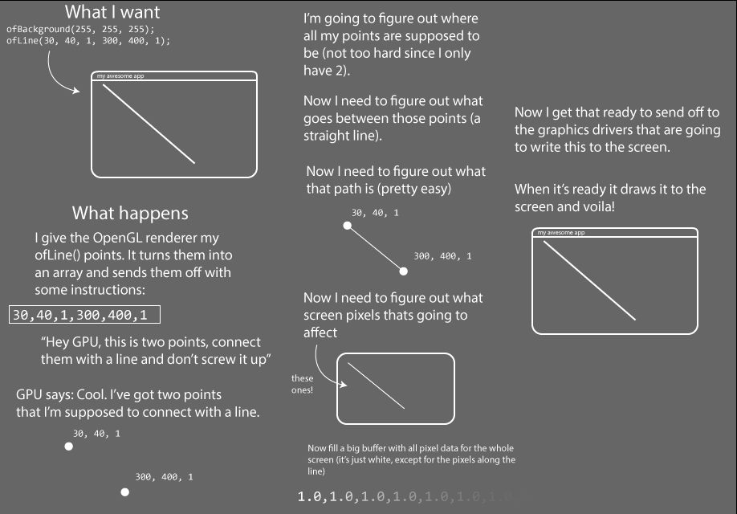
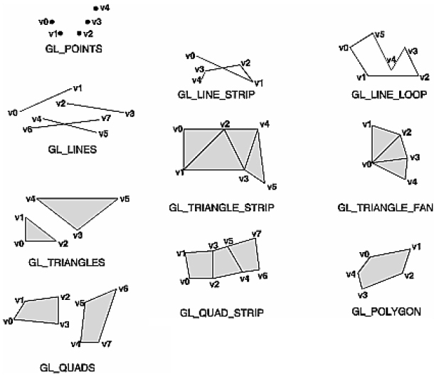
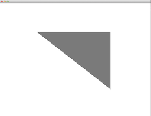
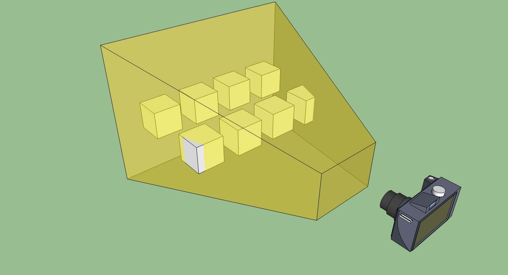
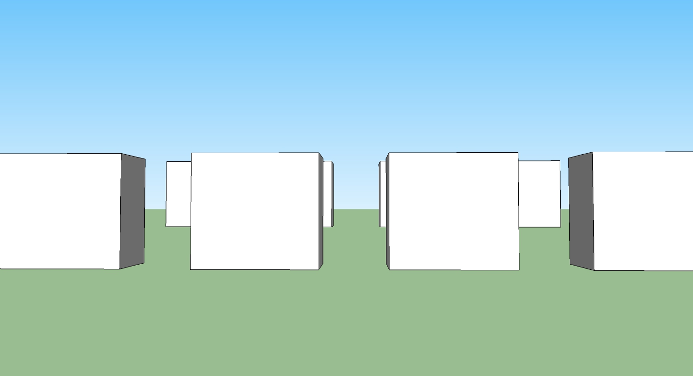
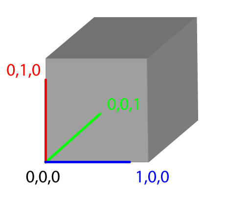
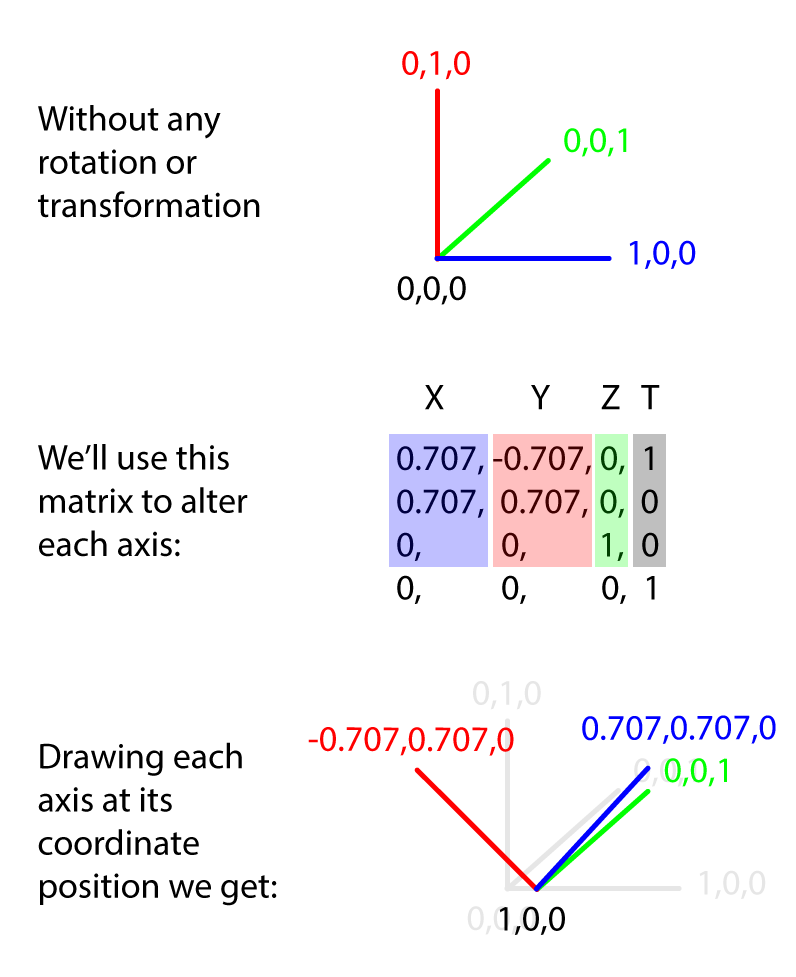
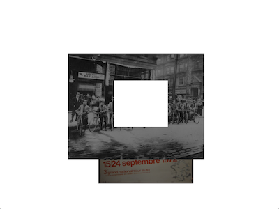
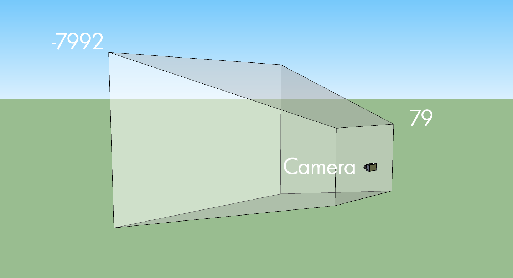

# Introducing OpenGL for OF

*by [Joshua Noble](http://twitter.com/fctry2/)*


## Introducing

First things first, OpenGL stands for Open Graphics Language but no one ever calls it that, they call it OpenGL, so we're going to do that too. Secondly, at a very high level, OpenGL is how your program on the CPU talks to the program on your GPU. What are those you ask? Well, the thing is that your computer is actually made out of a few different devices that compute, the Central Processing Unit and Graphics Processing Unit among them. The CPU is what runs most of what you think of as your OF application, starting up, keeping track of time passing, loading data from the file system, talking to cameras or the sound card, and so on. However, the CPU doesn't know how to draw stuff on the screen. CPUs used to draw things to screen (and still do on some very miniaturized devices) but people realized that it was far faster and more elegant to have another computational device that just handled loading images, handling shaders, and actually drawing stuff to the screen. The thing is that talking from one device to another is kinda hard and weird. Luckily, there's OpenGL to make it slightly easier, and OF to handle a lot of the stuff in OpenGL that sucks.

OpenGL’s main job is to help a programmer create code that creates points, lines, and polygons, and then convert those objects into pixels. The conversion of objects into pixels is called the "pipeline" of the OpenGL renderer and how that pipeline works at a high level is actually pretty important to understanding how to make OF do what you want it to and do it quickly. OF uses OpenGL for all of its graphics drawing but most of the calls are hidden. It actually uses an implementation of OpenGL called GLFW by default. All graphics calls in the ofGraphics class use calls to common OpenGL methods, which you can see if you open the class and take a look at what goes on in some of the methods. So, let's say you want to call OF line. Well, that actually calls ofGLRenderer::drawLine() which contains the following lines:

```cpp
	linePoints[0].set(x1,y1,z1);
	linePoints[1].set(x2,y2,z2);

	// use smoothness, if requested:
	if (bSmoothHinted) startSmoothing();

	glEnableClientState(GL_VERTEX_ARRAY);
	glVertexPointer(3, GL_FLOAT, sizeof(ofVec3f), &linePoints[0].x);
	glDrawArrays(GL_LINES, 0, 2);

	// use smoothness, if requested:
	if (bSmoothHinted) endSmoothing();
```

Now, what's going on in there looks pretty weird, but it's actually fairly straight forward. Don't worry too much about the calls that are going on below, just check out the notes alongside them because, while the methods and variable names are kinda tricky, the fundamental ideas are not.
So, we've got two points representing the beginning and end of our line, so we set those with the values we passed into ofDrawLine():

```cpp
	linePoints[0].set(x1,y1,z1);
	linePoints[1].set(x2,y2,z2);
```

If we're doing smoothing, let's go ahead and do it:

```cpp
		// use smoothness, if requested:
	if (bSmoothHinted) startSmoothing();
```

Alright, onto the tricky part:

```cpp
	glEnableClientState(GL_VERTEX_ARRAY); // #1
	glVertexPointer(3, GL_FLOAT, sizeof(ofVec3f), &linePoints[0].x); // #2
	glDrawArrays(GL_LINES, 0, 2); // #3
```

What we're doing is saying:

1. Hey, GPU, I'm about to send you an array and that array is the vertices of something I want you to draw.
2. Ok, GPU, you're all ready for the array, here it is. There's 3 values in each point (x,y,z), the values are each floating point numbers, each object I'm sending over is the size of an ofVec3f object, and here's a pointer to the beginning of the first one.
3. Ok GPU, now with the vertices that I just sent over, draw a line starting at the first item in the array, that's made up of two vertices.

That's kinda gnarly but comprehensible, right? The thing is though, that even though it's a bit weird, it's really fast. openFrameworks code uses something called Vertex Arrays (note the "glEnableClientState(GL_VERTEX_ARRAY)") to draw points to the screen. The particulars of how these work is not super important to understand in order to draw in 3-D, but the general idea is important to understand; pretty much everything that you're drawing revolves around passing some vertices to the graphics card so that you can tell OpenGL where something begins and ends. That "something" could be just a line, it could be a texture from a video, it could be a point in a 3D model of a bunny rabbit, but it's all going to have some points in space passed in using an array of one kind of another. There are all kinds of extra things you can tell OpenGL about your vertices but you pretty much always need to make some vertices and pass them along.

Alright, so that's what some OpenGL looks like, how does this all work? Take a look at the following diagram.



For those of your who've read other OpenGL tutorials you may be wondering: why do these all look the same? Answer: because there's really no other way to describe it. You start with vertices and you end up with rastered pixels. Much like other inevitable things in life, that's all there is to it.


## Vertices

Vertices define points in 3d space that are going to be used to place textures, create meshes, draw lines, and set the locations of almost any other drawing operation in openFrameworks. Generally speaking, you make some vertices and then later decide what you're going to do with them. Drawing a line rectangle is just making 4 points in space and connecting them with lines. Drawing an ofImage is defining 4 points in 3D space and then saying that you're going to fill the space in between them with the texture data that the ofImage uses. Drawing a 3D sphere is, unsurprisingly, just calculating where all the vertices for a sphere would need to go, defining those in an array, and then uploading that array to the graphics card so they can be drawn when sphere.draw() is called. Every time your OF application does any drawing, it's secretly creating vertices and uploading those to the graphics card using what's called a vertex array that gets uploaded to the graphics card. In some cases, like when you call ofDrawRectangle(), the vertices are hidden from you. In other cases, like when you create an ofPolyline, you're participating in generating those vertices explicitly. Let's take a closer look at how that works. You call

```cpp
line.addVertex(x, y);
```

Underneath, that just adds that point as a new ofVec2f to the ofPolyline instance. When it comes time to draw them, we have the ofGLRenderer calling:

```cpp
if(!poly.getVertices().empty()) {
    // use smoothness, if requested:
    if (bSmoothHinted) startSmoothing();

    glEnableClientState(GL_VERTEX_ARRAY);
    glVertexPointer(3, GL_FLOAT, sizeof(ofVec3f), &poly.getVertices()[0].x);
    glDrawArrays(poly.isClosed()?GL_LINE_LOOP:GL_LINE_STRIP, 0, poly.size());

    // use smoothness, if requested:
    if (bSmoothHinted) endSmoothing();
  }
```

So, really what you're doing is storing vertices and depending on whether you want OpenGL to close your application for you or not, you tell it in the glDrawArrays() method to either a) GL_LINE_LOOP close them all up or b) GL_LINE_STRIP don't close them all up. Again, like before, exactly what's going on there isn't super important, but it is good to understand that lines, rectangles, even meshes are all just vertices. Since I just mentioned meshes, lets talk about those! If you want some [more info](http://www.opengl.org/wiki/Vertex_Specification).

## Meshes

The ofMesh is, like the ofPolyline, lots of vertices with some attendant information around them. In the case of a mesh though, there's a lot more information for some interesting reasons. An ofMesh represents a set of vertices in 3D spaces, and normals at those points, colors at those points, and texture coordinates at those points. Each of these different properties is stored in a vector.
Vertices are passed to your graphics card and your graphics card fill in the spaces in between them in a processing usually called the rendering pipeline. The rendering pipeline goes more or less like this:

1. Say how you're going to connect all the points.

2. Make some points.

3. Say that you're done making points.

You may be thinking: I'll just make eight vertices and voila: a cube. Not so quick. There's a hitch and that hitch is that the OpenGL renderer has different ways of connecting the vertices that you pass to it and none are as efficient as to only need eight vertices to create a cube. You've probably seen a version of the following image somewhere before.



Generally you have to create your points to fit the drawing mode that you've selected. A vertex gets connected to another vertex in the order that the mode does its winding and this means that you might need multiple vertices in a given location to create the shape you want. The cube, for example, requires eighteen vertices, not the eight that you would expect. If you note the order of vertices in the GL chart above you'll see that all of them use their vertices slightly differently (in particular you should make note of the GL_TRIANGLE_STRIP above). Drawing a shape requires that you keep track of which drawing mode is being used and which order your vertices are declared in.

If you're thinking: it would be nice if there were an abstraction layer for this you're thinking right. Enter the mesh, which is really just an abstraction of the vertex and drawing mode that we started with but which has the added bonus of managing the draw order for you. That may seem insignificant at first, but it provides some real benefits when working with complex geometry. You still do need to be able to think about how your vertices work. For instance, let's say we want to draw a square. Well, a square is 4 points, so we've got it figured out, right?

```cpp

    ofMesh quad;

    quad.addVertex(ofVec3f(0, 0, 1));
    quad.addVertex(ofVec3f(500, 0, 1));
    quad.addVertex(ofVec3f(500, 389, 1));
    quad.addVertex(ofVec3f(0, 389, 1));

    quad.draw();

```

And then we get:



That's not right. What you need to remember is that the default setting of the mesh is to make triangles out of everything, so you need to make two triangles. What you've given OpenGL is interpreted like so:


You can use other drawing modes if you want but it's really best to stick with triangles (connected triangles to be precise) because they're so much more flexible than other modes and because they're best supported across different devices. Points and wires are also supported everywhere, quads for example, are not. Anyhow, let's draw our mesh correctly:

```cpp
    ofMesh quad;

    // first triangle
    quad.addVertex(ofVec3f(0, 0, 1));
    quad.addVertex(ofVec3f(500, 0, 1));
    quad.addVertex(ofVec3f(500, 389, 1));

    // second triangle
    quad.addVertex(ofVec3f(500, 389, 1));
    quad.addVertex(ofVec3f(0, 389, 1));
    quad.addVertex(ofVec3f(0, 0, 1));

    // first triangle
    quad.addTexCoord(ofVec2f(0, 0));
    quad.addTexCoord(ofVec2f(500, 0));
    quad.addTexCoord(ofVec2f(500, 389));

    // second triangle
    quad.addTexCoord(ofVec2f(500, 389));
    quad.addTexCoord(ofVec2f(0, 389));
    quad.addTexCoord(ofVec2f(0, 0));

    quad.draw(); // now you'll see a square
```

And now we have a mesh, albeit a really simple one. Ok, actually, that's wrong, but it's wrong on purpose. As you can see, we have exactly duplicated some of our addVertex calls above. In a tiny little square it doesn't matter if we use a few extra vertices - but when you're modelling a giant particle blob or something like that, it'll matter a lot.

That's where the index comes in. Indices are just a way of describing which sets of vertices in our vertex array go together to make triangles. The first 3 indices in the index array describe the vertices of the first triangle, the second 3 describe the second triangle, and so on. It's pretty rad and it saves you having to make and store more vertices than necessary. A more typical usage is something like the following:

```cpp
int width = 10, height = 10;
ofMesh mesh;
for (int y = 0; y < height; y++){
    for (int x = 0; x < width; x++){
        mesh.addVertex(ofPoint(x*20, y*20, 0)); // make a new vertex
        mesh.addColor(ofFloatColor(0,0, 0));  // add a color at that vertex
    }
}

// what this is basically doing is figuring out based on the way we inserted vertices
// into our vertex array above, which array indices of the vertex array go together
// to make triangles. the numbers commented show the indices added in the first run of
// this loop - notice here that we are re-using indices 1 and 10
for (int y = 0; y < height-1; y++){
    for (int x=0; x < width-1; x++){
        mesh.addIndex(x+y*width);         // 0
        mesh.addIndex((x+1)+y*width);     // 1
        mesh.addIndex(x+(y+1)*width);     // 10

        mesh.addIndex((x+1)+y*width);     // 1
        mesh.addIndex((x+1)+(y+1)*width); // 11
        mesh.addIndex(x+(y+1)*width);     // 10
    }
}
ofTranslate(20, 20);
mesh.drawWireframe();
```

As we mentioned earlier when you’re using a mesh, drawing a square actually consists of drawing two triangles and then assembling them into a single shape. You can avoid needing to add multiple vertices by using 6 indices to connect the 4 vertices. That gets more complex when you start working with 3-D. You’re going to draw an icosahedron and to do that you’ll need to know how each of the vertices are connected to all of the others and add those indices. When you create your ofMesh instance, you’re going to add all the vertices first and then add all of the indices. Each vertex will be given a color so that it can be easily differentiated, but the bulk of the tricky stuff is in creating the vertices and indices that the icosahedron will use.

This is the icosahedron.h header file:
```cpp

#pragma once
#include "ofMain.h"

const int X = 158;
const int Z = 256;

//This is the data for the vertices, which keeps the data as simple as possible:
static GLfloat vdata[12][3] = {
{-X, 0.0, Z}, {X, 0.0, Z}, {-X, 0.0, -Z}, {X, 0.0, -Z},
{0.0, Z, X}, {0.0, Z, -X}, {0.0, -Z, X}, {0.0, -Z, -X},
{Z, X, 0.0}, {-Z, X, 0.0}, {Z, -X, 0.0}, {-Z, -X, 0.0} };

//data for the indices, representing the index of the vertices
//that are to be connected into the triangle.
//You’ll notice that for 12 vertices you need 20 indices of 3 vertices each:
static GLint indices[20][3] = {
{0,4,1}, {0,9,4}, {9,5,4}, {4,5,8}, {4,8,1}, {8,10,1}, {8,3,10}, {5,3,8}, {5,2,3}, {2,7,3}, {7,10,3}, {7,6,10}, {7,11,6}, {11,0,6}, {0,1,6}, {6,1,10}, {9,0,11}, {9,11,2}, {9,2,5}, {7,2,11}
};

class icosahedron : public ofBaseApp{

public:
  float ang;
  ofMesh mesh;
  void setup();
  void update();
  void draw();
};
```

And now the cpp file:

```cpp
#include "icosahedron.h"

void icosahedron::setup()
{
  ofColor color(255, 0, 0); float hue = 254.f;

  //Here’s where we finally add all the vertices to our mesh and add a color at each vertex:
  for (int i = 0; i<12; ++i)
  {
    mesh.addVertex( ofVec3f( vdata[i][0], vdata[i][1], vdata[i][2] ));
    mesh.addColor(color);
    color.setHue( hue );
    hue -= 20.f;
  }

  for (int i = 0; i<20; ++i)
  {
    mesh.addIndex(indices[i][0]);
    mesh.addIndex(indices[i][1]);
    mesh.addIndex(indices[i][2]);
  }
}

// give it a little spin
void icosahedron::update(){
  ang+=0.1;
}

void icosahedron::draw()
{
  ofBackground(122,122,122);
  ofPushMatrix();
  ofTranslate(400, 400, 0);
  ofRotate(ang, 1.0, 1.0, 1.0);
  //Now it’s time to draw the mesh. The ofMesh has three drawing methods: drawFaces(),
  //which draws all the faces of the mesh filled; drawWireframe(), which draws lines
  //along each triangle; and drawVertices(), which draws a point at each vertex.
  //Since we want to see the colors we’re drawing, we’ll draw all the faces:
  mesh.drawFaces();
  ofPopMatrix();
}
```

The order that you add the indices is vital to creating the right object because, I know this sounds repetitive, it's really important to tell things what order they're supposed to be connected in so that they get turned from points in space into planes in space into objects. There's a reason the ofMesh has a drawWireframe() mode and that reason is that you can always just tell the OpenGL renderer "hey, I don't care about connecting these up, just show me the points". Otherwise, when you want proper faces and shades and the ability to wrap textures on things, you need to make sure that your vertices are connected correctly.

## VBOs

A VBO is a way of storing all of the data of vertex data on the graphics card. You’ve perhaps heard of Vertex Arrays and Display Lists and the VBO is similar to both of these, but with a few advantages that we’ll go over very quickly. Vertex Arrays just let you store all the vertex data in an array on the client side, that is, on the CPU side and then send it to the graphics card when you’re ready to draw it. The downside of that is that you’re still storing the data on the client side and sending it over to the graphics card. So, instead of making all of our vertex data in what’s called “immediate mode”, which means between a glBegin() and glEnd() pair (which you might remember) you can just store vertex data in arrays and you can draw stuff by dereferencing the array elements with array indices. The Display List is a similar technique, using an array to store the created geometry, with the crucial difference that a Display List lives solely on the graphics card. That's a little better because we're not shipping things from one processor to another 60 times a second. This means that once you’ve created the vertex data for geometry, you can send it the graphics card and draw it simply by referencing the id of the stored data. The downside is that display lists can’t be modified. Once they’ve been sent to the card, you need to load them from the card, modify them, and then resend them to the card to see your changes applied. Since one of the conveniences of moving things to the graphics card is reducing the amount of traffic between the graphics card and the rest of your system. The VBO operates quite similarly to the Display List, with the advantage of allowing you to modify the geometry data on the graphics card without downloading all of it at once. So you make something, you store it on the graphics card, and when you're ready to upload it, you simply push the newly updated values leaving all the other ones intact and in the right place.

So, in OF we use the ofVboMesh to represent all the vertices, how they're connected, any colors to be drawn at those vertices, and texture coordinates. Because it extends ofMesh, everything you learned about ofMesh applies here too. You create some points in space, you give indices to the mesh so that it knows which points in space should be connected, colors if you want each vertex to contain a color, and finally texture coordinates for when you want to apply textures to that VBO, and you should be good to go. Creating an ofVboMesh is really easy, you can, for example, just make an ofSpherePrimitive and load it into a mesh:

```cpp
    ofSpherePrimitive sphere;
    sphere.set(100, 50);
    mesh = sphere.getMesh();
```

Adding colors is very easy:

```cpp
for( int i = 0; i < mesh.getVertices().size(); i++ )
{
    mesh.addColor(ofFloatColor( float(i)/mesh.getVertices().size(), 0, 1.0 - (float(i)/mesh.getVertices().size()) ));
}
```

There's a few new tricks to VBOs that you can leverage if you have a new enough graphics card, for instance, the ability to draw a single VBO many many times and position them in the vertex shader. This is called instancing and it's available in the ofVboMesh in the drawInstanced() method. You can see an example of this being used in the vboMeshDrawInstancedExample in examples/gl. Generally speaking, if you have something that you know you're going to keep around for a long time and that you're going to draw lots of times in lots of different places, you'll get a speed increase from using a VBO. This isn't always true, but it's true enough most of the time.

Although that's nowhere close to everything about vertices and meshes, we're going to move on to another frequently misunderstood but vital part of OpenGL: matrices.

## A Basic 3D Scene

Now take a breath. Before we go further and start dig into matrices, let's set up a simple scene that you can use as reference while reading the next part of this dense tutorial. Since OF version 0.9, you need 5 things to set up a 3D scene: a window, a camera, a material, a light and an object. Let's start from the window.

Create a new project using the ProjectGenerator and edit the main.cpp file as follows.  Since OF 0.9, that is the way to set up a window that uses the programmable pipeline. If you want to read in detail what was introduced with the 0.9 version, on the blog there is a [detailed review](http://blog.openframeworks.cc/post/133400454159/openframeworks-090-opengl-45), but for now it is not necessary.

```cpp

#include "ofMain.h"
#include "ofApp.h"

//========================================================================
int main( ){
    ofGLFWWindowSettings settings;
    settings.setGLVersion(3, 2);
    settings.width = 1280;
    settings.height = 720;
    ofCreateWindow(settings);
    ofRunApp(new ofApp());
}

```

Here you have defined the dimensions of our window and which OpenGL version we want to use.

The second thing that you need is a camera and a light. Later on this tutorial you will see how to get full controll over your camera, for now let's do something really basic. Edit your App.cpp and App.h as follow

```cpp

// Add this in the App.h
ofLight light;
ofEasyCam cam;

// add these lines to the setup and to the draw method in the App.cpp
void ofApp::setup(){
    light.setup();
    light.setPosition(-100, 200,0);
    ofEnableDepthTest();
}

void ofApp::draw(){
    cam.begin();
    // here you will draw your object
    cam.end();
}

```

With this code you have accomplished two important things. It's a bit like making a movie, you have first to position the light, to turn it on, and then you have to put your camera in the right position. Now the set of our movie is ready for our first scene. If you run this code, you will see a gray screen. That is obvious, there is nothing under our camera. Let's put an actor (a simple box) under the reflectors.

```cpp

// add this to your App.h file
ofBoxPrimitive box;
ofMaterial boxMaterial;

// edit your App.cpp file and add these lines
void ofApp::setup(){
    //...
    boxMaterial.setDiffuseColor(ofFloatColor::red);
    boxMaterial.setShininess(0.02);
}

void ofApp::draw(){
    cam.begin();
        boxMaterial.begin();
          box.draw();
        boxMaterial.end();
    cam.end();
}

```

In this chunk of code you have added 2 things. The box, our main actor in this movie, and the material, that defines the color of the box and how it reacts to the light.
If you run the code you will see a red box in the middle of your screen. In the next part we will see how to move things around using the incredible properties of the ofNode class, which simplifies all the matrices operations needed in a every 3D scene.

## Matrices

Matrices are collections of vertices that are used to move things around. This is a very simplified definition, but for now take it as it is. In the previous example with the red box, OF automatically put the box in the center of the screen. But what if we want to position our box a bit on the right and a bit away from the camera? We have to use the `move` method. A method that internally applies a Matrix to our object and moves the object at the position that we want. The coordinates, in this example, are relative to the middle of the screen, in this case 0,0,0. But let's see how the position of our box changes.

```cpp

void ofApp::setup(){
    //...
    box.move(200, 0, -200);
}

```

What if we want to define the position of an object not relative to the center of the screen, but relative to the position of another object? Think about drawing a car. You draw the body of the car, and then you draw the headlamp of the car, the wheels, and all the other parts that compose a car. If you define the position of all these object relative to the center of the screen (that in this case is the origin of the axes) you have to calculate the distance of every element from the center. But what if the car moves? you will have to recalculate all the positions of all the objects relative to the center, for each single element of the car. That would be terrible! To solve this problem, you have to define the position of each element composing the car not to be relative to the origin of the axis, but to be relative to the body of the car. In this way, moving the car will move all the parts that compose the car. What is happening under the hood, is a bunch of matrix operations. There is a first matrix that it is applied to the car, and that defines the position of the car relative to the center of the screen, and then there are other matrices, each for every element composing the car, that define the position of each element relative to the body of the car. You can find this example in the examples folder, under `examples/3d/ofNodeExample`.

Let's add a sphere positioned 100 pixels left from the our box

```cpp

//In your App.h file
ofSpherePrimitive sphere;

// In your App.cpp file
void ofApp::setup(){
    //...
    box.move(200, 0, -200);
    sphere.setParent(box);
    sphere.move(-100,0,0);
}

void ofApp::draw(){
    cam.begin();
        box.draw();
        sphere.draw();
    cam.end();
}

```

openFrameworks allows us to do matrix operations in an easy way. Under the hood, there are these 3 matrices that are defining how we see our object on the screen.
We'll lay them all out really quickly (not because they're not important but because OF relieves you of having to do a ton of messing with them).

*The Model matrix*

A model, like our `box`, is defined by a set of vertices, which you can think of as ofVec3f objects, but are really just X,Y,Z coordinates of these vertices which are defined relative to the center point where the drawing started. You can think of this as the 0,0,0 of your "world space". Imagine someone saying "I'm 10 meters north". If you don't know where they started from, that's not super helpful, but if you did know where they started from, it's pretty handy. That's what the Model matrix is. For OF, this is the upper left hand corner of your window. Really these aren't super meaningful without a view onto them, which is why usually in OpenGL we're talking about the ModelView matrix. That's just the Model matrix times the View matrix, and that begs the question: what's the view matrix?

*The View matrix*

Little known fact: cameras don't move, when you want to look at something new, the world moves around the camera. If I'm standing in Paris and I want to take a picture of a different side of the Eiffel Tower, I just walk around to the other side. Imagine if instead I just made the entire earth spin around so I could see a different side of the Eiffel tower. Totally not practical in real life but really simple and handy in OpenGL.

So initially your openFrameworks camera, an ofEasyCam instance let's say, is just at 0,0,0. To move the camera, you move the whole world, which is fairly easy because the location and orientation of our world is just matrices. So our `box` that thinks it's at 100,100, might actually be at 400,100 because of where our camera is located and it never needs to change its actual values. We just multiply everything by the location of the view matrix and voila: it's in the right place. That means this whole "moving the whole world" is really just moving a matrix over by doing a translate. We're going to dig into what that looks like in a second, right now we just want to get to the bottom of what the "camera" is: it's a matrix. And the relationship between a camera and where everything is getting drawn is called the ModelViewMatrix. Super important? Not really, but you're going to run into it now and again and it's good to know what it generally means.

*The Projection matrix*

Ok, so know what the world space is and what the view space is, how does that end up on the screen? Well, another thing that the camera has, in addition to a location and a thing that it's looking at (aka View Matrix) is the space that it sees. Just like a movie screen, you've got to at some point turn everything into a 2D screen. A vertex that happens to be at 0, 0 should be rendered at the center of the screen. But! We can’t just use the x and y coordinates to figure out where something should be on screen. We also need to figure out its Z depth because something in front of something should be drawn (and the thing behind it shouldn't). For two vertices with similar x and y coordinates, the vertex with the biggest z coordinate will be more on the center of the screen than the other. This is called a perspective projection and every ofCamera has a perspective transform that it applies to the ModelView matrix that makes it represent not only how to turn a vertex from world space plus camera space but also to add in how a vertex should be shown in the projection that the camera is making. Ok, so before projection, we’ve got stuff in Camera Space:



Now here's what that projection matrix does to it.


Looks wrong, right? But when you look at through the camera, it will look right and *that* is the secret of the projection matrix: multiplying everything by it makes it all look correct. The frustum is cube and objects that are near to the camera are big and things far away are smaller.



That reminds me of a [Father Ted joke](http://www.youtube.com/watch?v=vh5kZ4uIUC0). Unlike the toy cows, the projection matrix actually makes things far away small. Lots of times in OpenGL stuff we talk about either the ModelViewMatrix or the ModelViewProjectionMatrix. Both of those are just the different matrices multiplied by one another to get "where things are" and "where things are *on the screen*". Matrices themselves are the subject of a million different tutorials and explanations which range from awesome to useless but there is one thing that I want to put in here to explain a quick way to read and understand them in OpenFrameworks and OpenGL in general. There's a trick that I've learned to understand matrices which I'm going borrowing from Steve Baker for your edification. Here's an OpenGL matrix:

```cpp
float m[16];
```

It's a 4x4 array like this:

```cpp
m[0]  m[4]  m[ 8]  m[12]
m[1]  m[5]  m[ 9]  m[13]
m[2]  m[6]  m[10]  m[14]
m[3]  m[7]  m[11]  m[15]
```

If you're not scaling, shearing, squishing, or otherwise deforming your shapes, then you're going to be using the last row, m[3], m[7], m[11] will all be 0 and and m[15] will be one, so we'll skip it for a moment. and focus on the rest. m[12],m[13] and m[14] tell you the translation, i.e. where something is, so that's easy, and the rest tell you the rotation.

So, this is the way that I always visualize this: imagine what happens to four points near to the origin after they are transformed by the matrix:



These are four vertices on a unit cube (i.e. what that's 1 x 1 x 1) that has one corner at the origin. So, what we can do is pull apart the matrix and use different elements to move that little cube around and get a better picture of what that matrix is actually representing.

Skipping the translation part (the bottom row, 3, 7, 11), then the rotation part simply describes the new location of the points on the cube. So with no rotation at all, we just have:


    (1,0,0)  --->  ( m[0], m[1], m[2] )
    (0,1,0)  --->  ( m[4], m[5], m[6] )
    (0,0,1)  --->  ( m[8], m[9], m[10])
    (0,0,0)  --->  ( 0, 0, 0 )

After that, you just add the translation onto each point so you get:

    (1,0,0)  --->  ( m[0], m[1], m[2] ) + ( m[12], m[13], m[14] )
    (0,1,0)  --->  ( m[4], m[5], m[6] ) + ( m[12], m[13], m[14] )
    (0,0,1)  --->  ( m[8], m[9], m[10]) + ( m[12], m[13], m[14] )
    (0,0,0)  --->  ( 0, 0, 0 ) + ( m[12], m[13], m[14] )

That may seem a bit abstract but just imagine little cube at the origin. Think about where the cube ends up as the matrix changes. For example, looking at this matrix:

    0.707, -0.707, 0,  0
    0.707,  0.707, 0,  0
    0    ,  0    , 1,  0
    0    ,  0    , 0,  1


When we draw that out, the X axis of our cube is now pointing somewhere between the X and Y axes, the Y axis is pointing somewhere between Y and negative X and the Z axis hasn't moved at all. The entire cube has been moved 1 units in X direction and 0 in the Y and Z:



What you'll tend to see in your ModelView matrix is a lot of rotation and translation to account for the position of your camera and of world space (that is, stuff in the rotation and translation parts of the matrix), what you'll tend to see in your projection matrix is some translation but mostly a lot of skewing (m[3], m[7], m[11]) to show how the camera deforms the world to make it look right on the screen. We're going to come back to matrices a little bit later in this article when we talk about cameras.

There's tons more to know about matrices but we've got to move on to textures!

## Textures

So, really, a texture is a block of pixels on your GPU. That's different and importantly different, than a block of pixels stored on your CPU (i.e. in your OF application). You can't loop over the pixels in a texture because it's stored on the GPU, which is not where your program runs but you can loop over the pixels in an ofPixels object because those are stored on the CPU, which is where your OF application runs. OF has two ways of talking about bitmap data: ofPixels, stored on your CPU and ofTexture, stored on your GPU. An ofImage has both of these, which is why you can mess with the pixels and draw it to the screen.

There are three important characteristics of a texture, each of the defining part of those constraints: the texture type, texture size, and the image format used for images in the texture. The texture type defines the arrangement of images within the texture. The size defines the size of the images in the texture. And the image format defines the format that all of these images share.

You’ve already used textures without knowing it because the ofImage class actually contains a texture that is drawn to the screen when you call the draw() method. Though it might seem that a texture is just a bitmap, it’s actually a little different. Textures are how bitmaps get drawn to the screen; the bitmap is loaded into a texture that then can be used to draw into a shape defined in OpenGL. I’ve always thought of textures as being like wrapping paper: they don’t define the shape of the box, but they do define what you see when you look at the box. Most of the textures that we’ve looked at so far are used in a very simple way only, sort of like just holding up a square piece of wrapping paper.

```cpp
ofImage myImage;
// allocate space in ram, then decode the jpg, and finally load the pixels into
// the ofTexture object that the ofImage contains.
myImage.loadImage("sample.jpg");
myImage.draw(100,100);
```

The ofImage object loads images from files using loadImage() and images from the screen using the grabScreen() method. Both of these load data into the internal texture that the ofImage class contains. When you call the draw() method of the ofImage class, you’re simply drawing the texture to the screen. If you wanted to change the pixels on the screen, you would also use an ofImage class to capture the image and then load the data into an array using the getPixels() method. After that, you could manipulate the array and then load it back into the image using setFromPixels():

```cpp
ofImage theScreen; // declare variable
theScreen.grabScreen(0,0,1024,768); // grab at 0,0 a rect of 1024×768.
// similar to loadPixels();
unsigned char * screenPixels = theScreen.getPixels();
// do something here to edit pixels in screenPixels
// ...
// now load them back into theScreen
theScreen.setFromPixels(screenPixels, theScreen.width, theScreen.height, OF_IMAGE_COLOR, true);
theScreen.update();
// now you can draw them
theScreen.draw(0,0);
```

Textures in openFrameworks are contained inside the ofTexture object. This can be used to create textures from bitmap data that can then be used to fill other drawn objects, like a bitmap fill on a circle. Though it may seem difficult, earlier examples in this chapter used it without explaining it fully; it’s really just a way of storing all the data for a bitmap. If you understand how a bitmap can also be data, that is, an array of unsigned char values, then you basically understand the ofTexture already.

There are three basic ways to get data into a texture:

1) load the data in using ofImage

allocate(int w, int h, int internalGlDataType)

This method allocates space for the OpenGL texture. The width (w) and height (h) do not necessarily need to be powers of two, but they do need to be large enough to contain the data you will upload to the texture. The internal datatype describes how OpenGL will store this texture internally. For example, if you want a grayscale texture, you can use GL_LUMINANCE. You can upload whatever type of data you want (using loadData()), but internally, OpenGL will store the information as grayscale. Other types include GL_RGB and GL_RGBA.

loadData(unsigned char * data, int w, int h, int glDataType) / loadPixels()

This method loads the array of unsigned chars (data) into the texture, with a given width (w) and height (h). You also pass in the format that the data is stored in (GL_LUMINANCE, GL_RGB, GL_RGBA). For example, to upload a 200 × 100 pixels wide RGB array into an already allocated texture, you might use the following:


```cpp
unsigned char pixels[200*100*3];
for (int i = 0; i < 200*100*3; i++){
	pixels[i] = (int)(255 * ofRandomuf());
}
myTexture.loadData(pixels, 200, 100, GL_RGB); // random-ish noise
```

Finally, we can just use:

```cpp
ofLoadImage(theTex, "path/toAnImage.png");
```

When we actually draw the texture what we're doing is, surprise, putting some vertices on the screen that say where the texture should show up and say: we're going to use this ofTexture to fill in the spaces in between our vertices. The vertices are used to define locations in space where that texture will be used. Voila, textures on the screen. The way that we actually say "this is the texture that should show up in between all the vertices that we're drawing" is by using the bind() method. Now, you don't normally need to do this. The draw() method of both the ofImage and the ofTexture object take care of all of this for you, but this tutorial is all about explaining some of the underlying OpenGL stuff and underneath, those draw() methods call bind() to start drawing the texture, ofDrawRectangle() to put some vertices in place, and unbind() when it's done. It's just like this:

```cpp
tex.bind(); // start using our texture
quad.draw(); // quad is just a rectangle, like we made in the ofMesh section
tex.unbind(); // all done with our texture
```

Every texture that's loaded onto the GPU gets an ID that can be used to identify it and this is in essence what the bind() method does: say which texture we're using when we define some vertices to be filled in. The thing that's important in this is that each vertex has not only a location in space, but a location in the texture. Let's say you have a 500x389 pixel image. Since OF uses what are called ARB texture coordinates, that means that 0,0 is the upper left corner of the image and 500,389 is the lower right corner. If you were using "normalized" coordinates then 0,0, would be the upper left and 1,1 would be the lower right. Sidenote: normalized coordinates can be toggled with "ofEnableNormalizedTexCoords()". Anyhow, you have an image and you're going to draw it onto an ofPlanePrimitive:

```cpp

// our 500x389 pixel image
bikers.loadImage("images/bikers.jpg");

// make the plane the same size:
planeHalf.set(500, 389, 2, 2);
// now set the texture coordinates to go from
// 0,0 to 250, 194, so we'll see the upper left corner
planeHalf.mapTexCoords(0, 0, 250, 194);
```

Now we'll make a plane with texture coordinates that cover the whole image.

```cpp
planeFull.set(500, 389, 2, 2);
planeFull.mapTexCoords(0, 0, 500, 389);
```

Now to draw this:

```cpp
void ofApp::draw(){
  ofSetColor(255);

    ofTranslate(250, 196);

    bikers.bind();
    planeHalf.draw();
    ofTranslate(505, 0); // 5px padding
    planeFull.draw();
    bikers.unbind();
}
```

We should see this:


Take note that anything we do moving the modelView matrix around, for example that call to ofTranslate(), doesn't affect the images texture coordinates, only their screen position. What about when we go past the end of a texture?


Eww, right? Well, we can call:

```cpp
    ofLoadImage(bikers, "images/bikers.jpg");
    bikers.setTextureWrap(GL_CLAMP_TO_BORDER, GL_CLAMP_TO_BORDER);
```

Now we get:


Since we're not using power of two textures, i.e. textures that are strange sizes, we can't use the classic GL_REPEAT, but that's fine, it's not really that useful anyways, honestly.

*Depth v Alpha*

What happens if you draw a texture at 100, 100, 100 and then another at 100, 100, 101? Good question. The answer however, is confusing, if you've got alpha blending on, then, em, it's going to look wrong.

```cpp
bikers.draw(0, 0, 101); // supposed to up front
tdf.draw(0, 0, 100); // getting drawn last
```


Enable depth test to get it to work:

```cpp
ofEnableDepthTest();
bikers.draw(0, 0, 101);
tdf.draw(0, 0, 100);
```

Ok, so let's say we made our weird TDF image and bike image PNGs with alpha channel, chopped a hole out of the middle and loaded them in.

```cpp
bikers.draw(0, 0, 0);
tdf.draw(100, 0, -50); // should be 50 pix behind bikers.
```


Well, we get the visibility, but the TDF is in from of the bikers, which it shouldn't be, let's turn on depth testing:

```cpp
ofEnableDepthTest();
bikers.draw(0, 0, 0);
tdf.draw(100, 0, -50); // should be 50 pix behind bikers.
```



That's not right either. What's happening? Turns out in OpenGL alpha and depth just don't get along. You can have which pixels selected according to their alpha values or you can have things placed according to their position in z-space. If you want to do both you need to do multiple render passes or other trickery to get it to work, which is a little out of the scope of this tutorial. Suffice to say, that it's a little bit tricky and that you might need to think carefully about how you're going to work with 3D objects and textures that have alpha enabled because it can induce some serious headaches. Alright, enough of that, this part of this tutorial has gone on long enough.

## Cameras

OpenFrameworks has two cameras: ofEasyCam and ofCamera. What's a camera you ask? Well, conceptually, it's a movie camera, and actually, it's a matrix. Yep, math strikes again. It's basically a matrix that encapsulates a few attributes, such as:

* Camera position
* Camera orientation (direction)
* Zoom (field of view)
* Maximum and minimum viewing distances (near and far planes)
* The aspect ratio of the viewport/window

And that's about it, you're just making a list of how to figure out what's in front of the camera and how to transform everything in front of the camera. You always have "a camera" because you always have a view, projection, and model matrix (remember those?) but the camera lets you keep different versions of those to use whenever you want, turning them on and off with the flick of a switch, like so:

```cpp
cam.begin();
// draw everything!
cam.end();
```

So, we always have a camera? Yep, and it has a location in space too. Just imagine this:



What's that -7992 and 79? Well, those are just a guess at a 1024x768 sized window, from the renderers setupScreenPerspective() method:

```cpp

  float viewW = currentViewport.width;
  float viewH = currentViewport.height;

  float eyeX = viewW / 2;
  float eyeY = viewH / 2;
  float halfFov = PI * fov / 360;
  float theTan = tanf(halfFov);
  float dist = eyeY / theTan;
  float aspect = (float) viewW / viewH;

  if(nearDist == 0) nearDist = dist / 10.0f;
  if(farDist == 0) farDist = dist * 10.0f;

  matrixMode(OF_MATRIX_PROJECTION);
  ofMatrix4x4 persp;
  persp.makePerspectiveMatrix(fov, aspect, nearDist, farDist);
  loadMatrix( persp );

  matrixMode(OF_MATRIX_MODELVIEW);
  ofMatrix4x4 lookAt;
  lookAt.makeLookAtViewMatrix( ofVec3f(eyeX, eyeY, dist),  ofVec3f(eyeX, eyeY, 0),  ofVec3f(0, 1, 0) );
  loadMatrix(lookAt);


```

There's a bit of math in there to say: make it so the the view of the camera is relatively proportional to the size of the window. You'll see the same thing in the camera setupPerspective() method:

```cpp
  ofRectangle orientedViewport = ofGetNativeViewport();
  float eyeX = orientedViewport.width / 2;
  float eyeY = orientedViewport.height / 2;
  float halfFov = PI * fov / 360;
  float theTan = tanf(halfFov);
  float dist = eyeY / theTan;

  if(nearDist == 0) nearDist = dist / 10.0f;
  if(farDist == 0) farDist = dist * 10.0f;

  setFov(fov); // how wide is our view?
  setNearClip(nearDist); // what's the closest thing we can see?
  setFarClip(farDist); // what's the furthest thing we can see?
  setLensOffset(lensOffset);
  setForceAspectRatio(false);  // what's our aspect ratio?

  setPosition(eyeX,eyeY,dist); // where are we?
  lookAt(ofVec3f(eyeX,eyeY,0),ofVec3f(0,1,0)); // what are we looking at?
```

We get the size of the viewport, figure out what the farthest thing we can see is, what the nearest thing we can see is, what the aspect ratio should be, and what the field of view is, and off we go. Once you get a camera set up so that it knows what it can see, it's time to position it so that you can move it around. Just like in people, there are 3 controls that dictate what a camera can see: location, orientation, and heading. You can kind of separate what a camera is looking at from what it's pointing at but you shouldn't, stick with always looking ahead, the ofEasyCam does. Because a ofCamera extends a ofNode, it's pretty easy to move it around.

```cpp
cam.setPosition(ofVec3f(0, 100, 100));
```

it's also pretty easy to set the heading:

```cpp
cam.lookAt(ofVec3f(100, 100, 100));
```

You'll notice that the signature of that method is actually

```cpp
void lookAt(const ofVec3f& lookAtPosition, ofVec3f upVector = ofVec3f(0, 1, 0));
```

That second vector is so that you know what direction is up. While for a person it's pretty hard to imagine forgetting that you're upside-down, but for a camera, it's an easy way to get things wrong. So as you're moving the camera around you're really just modifying the matrix that the ofCamera contains and when you call begin(), that matrix is uploaded to the graphics card. When you call end(), that matrix is un-multiplied from the OpenGL state card. There's more to the cameras in OF but looking at the examples in examples/gl and at the documentation for ofEasyCam. To finish up, lets check out the way that the ofEasyCam works, since that's a good place to start when using a camera.

So, as mentioned earlier, there are two camera classes in OF, ofCamera and ofEasyCam. ofCamera is really a stripped down matrix manipulation tool for advanced folks who know exactly what they need to do. ofEasyCam extends ofCamera and provides extra interactivity like setting up mouse dragging to rotate the camera which you can turn on/off with ofEasyCam::enableMouseInput() and ofEasyCam::disableMouseInput(). There's not a huge difference between the two, but ofEasyCam is probably what you're looking for if you want to quickly create a camera and get it moving around boxes, spheres, and other stuff that you're drawing.

Onto using these things: both of those classes provide a really easy method for setting a target to go to and look at:

```cpp
void setTarget(const ofVec3f& target);
void setTarget(ofNode& target);
```

These methods both let you set what a camera is looking at and since you can always count on them to allow you to track something moving through space, pretty handy. In ofCamera there are other methods for doing this and more but I'll let you discover those on your own. One last thing that's tricky to do on your own sometimes is how do you figure out what where something in space will be relative to a given camera? Like, say, where a 3D point will be on the screen? Voila, worldToScreen()!

```cpp
ofVec3f worldToScreen(ofVec3f WorldXYZ, ofRectangle viewport = ofGetCurrentViewport()) const;
```

How do you figure out where something on the screen will be relative to the world? Like, say, where the mouse is pointing in 3d space?

```cpp
ofVec3f screenToWorld(ofVec3f ScreenXYZ, ofRectangle viewport = ofGetCurrentViewport()) const;
```

How do you figure out where something on the screen will be relative to the camera?

```cpp
ofVec3f worldToCamera(ofVec3f WorldXYZ, ofRectangle viewport = ofGetCurrentViewport()) const;
```

How do you figure out where something relative to the camera will be in the world?
```cpp
ofVec3f cameraToWorld(ofVec3f CameraXYZ, ofRectangle viewport = ofGetCurrentViewport()) const;
```

As with everything else, there's a ton more to learn, but this tutorial is already pushing the bounds of acceptability, so we'll wrap it up here. A few further resources before we go though:

* [OpenGL Tutorials](http://www.opengl-tutorial.org)
* [OpenGL Tutorials (matrices)](http://www.opengl-tutorial.org/beginners-tutorials/tutorial-3-matrices/)
* [Modern OpenGL](http://tomdalling.com/blog/modern-opengl)
* [Swiftless Tutorials](http://www.swiftless.com)

Have fun, ask questions on the forum, and read our [shader tutorial](shaders.html) if you want to keep learning more.
