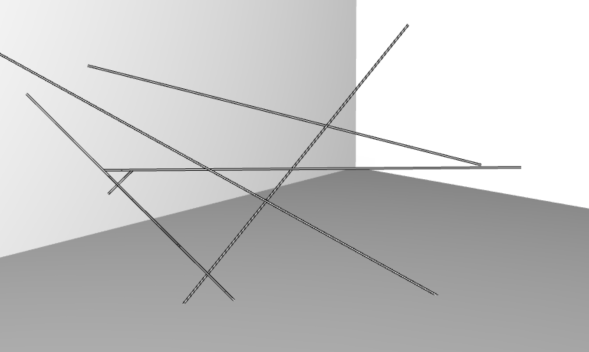

#Line Segments Space

*by [Mimi Son and  Elliot Woods (Kimchi and Chips)](http://www.kimchiandchips.com/)*


##Foreward
*Line Segments Space* is an artwork created by studio [Kimchi and Chips](http://kimchiandchips.com) (Mimi Son, Elliot Woods), and is the third installation within a series of works titled 'Digital Emulsion', preceded by Lit Tree (2011) and Assembly (2012). The principal technician for this project is me, Elliot, the voice of this chapter.

This chapter will discuss some of the technical details of the project to varying levels of detail. Before continuing, I hope that you will first take a little time to view the work in a non-technical context and watch the video on our website at [http://kimchiandchips.com/#LSS](http://kimchiandchips.com/#LSS).

The work contains a number of technical solutions, the principal one being an implementation of the Digital Emulsion technique. Others include a custom CAD application created in oF, generative 'brushes' for volumetric content created in HLSL shaders, optical layout of the room and equipment simulated in VVVV, sound control and spatialisation performed in Ableton, and calibration routines involving a network of computers running oF (osx and iOS) and VVVV. This chapter touches on a few of these challenges on the oF side.

##Artist statement

An architectural web of nylon threads span a gallery space, creating a shape without specific start or end. It is a set of thin positive elements segmenting the volumes of negative space between. Dynamic digital forms are articulated into physical volume by the material of this thread, and the semi-material of the light. These digital forms inhabit the interconnected boundaries of space, moulding visual mass,

The artists reference Picasso’s light painting experiments, and Reticuláreas of Gego who’s work offers a contemplation of the material and immaterial, time and space, origin and encounter and art and technology.

Kimchi and Chips create technology which paints into different dimensions, bringing new canvases and expanding the ways by which artists can articulate form. These technologies become a corpus of code, offered without restriction on the internet. Their code  is adopted by other artists and corporations, spreading values and ideas implicit with the artists’ work into shared cultural idea space. *Line Segments Space* lives both as a dynamic gallery object, and as an encapsulation of the techniques as new computer code and tools on the internet.

##Digital Emulsion

Digital Emulsion (sometimes called Projection Scanning) is a technique which combines 3D scanning with projection mapping in order to create new canvases for visual expression. *Line Segments Space* employs Digital Emulsion to aim pixel-beams of light from projectors onto individual threads, whilst also determining the 3D geometry of the web using those same pixel-beams.

The technique combines the use of a video projector and a camera (e.g. DSLR or machine vision camera) to augment a physical object. The steps for this are generally:

1. Calibrate the camera and projector (e.g. using OpenCV)
2. Perform a Structured Light scan of a scene (e.g. using [ofxGraycode](https://github.com/elliotwoods/ofxGraycode))
3. Triangulate the 3D location of every projector pixel in the scene (e.g. using [ofxTriangulate](https://github.com/elliotwoods/ofxTriangulate))
4. Render a graphical response to the scene using the triangulation data
5. Project this response back onto the scene using the structured light data to perform a pixel-precise mapping between the projector and the scene.

*Note : To get started with this technique, you might want to check out [Rulr](http://rulr.xyz) or it's [source code](https://github.com/elliotwoods/ofxDigitalEmulsion).*

###Structured Light
Structured Light refers to a set of techniques which couple projectors with sensors to take visual and spatial readings of the physical world.

A very simple structured light technique is to project a thin white line onto a scene and to take a photo of it. Within the photo, we can see that the line kinks and bends within the cameras image as it passes over 3D features. Using some trigonometry we could perhaps calculate something about the 3D shape of the object based on the displacement of this line.


*DAVID Laser Scanner*

If we took many images (e.g. a video) whilst moving the line across the whole scene, then we could recover a lot of 3D information about the scene, and make a mesh (e.g. ofMesh) by watching how that projected line deforms when it hits the 3D scene.

Generally for Digital Emulsion, we use a structured light technique called Graycode Structured Light. If you're interested in learning more, I suggest checking out either [ofxGraycode](http://github.com/elliotwoods/ofxGraycode) or [David laser scanner](http://www.david-3d.com/) (a free to download standalone scanning app which employs structured light).

The specific advantage of using Graycode (rather than 3-phase) structured light for Digital Emulsion projects, is that Graycode is best at locating __projector pixels__ whilst 3-phase is best at locating __camera pixels__ (note that generally cameras have more pixels than projectors, so this gives better resolution for 3D scanning, but is less useful than knowing the location of the projector pixels for this case).

Following the Graycode scan, we can now consider that our projector's pixels are sensing the scene but are still also controllable as visible pixels, that they in fact sensor-pixels which have given us feedback about the scene we are projecting onto.

##Technical solution

###Constraints

The first presentation of *Line Segments Space* was at Seoul Art Space Gumcheon between September and October 2013, the exhibition had the following constraints:

* 1 week installation time
* 4 week run time
* Temporary room built by gallery

###System overview


==dear graphics designers : please redraw==

#### Software frameworks

Generally I split processes into 2 categories:

__Offline (i.e. non-realtime)__ :
* The task can be performed away from the installation hardware.
* Some offline tasks may require intense computing time
* Often these tasks require more concentration
* Edits are made and the results are viewed asynchronously (like a chef tasting the soup)

An example of an offline process would be processing the scan data.

__Online (i.e. realtime)__ :
* The task is performed with the installation hardware
* Other people are likely to be involved in the process
* It's best if software edits can be made quickly and freely
* Edits are made whilst continuously observing the output (like a pilot manoeuvring a plane)

An example of an online process might be the final runtime of the installation.

My personal preference is often to use openFrameworks for developing offline tasks, and to use another toolkit called [VVVV](http://vvvv.org/) for developing online processes.

##Design time applications

During the early development stages of the project, we create applications which facilitate the process of sketching our ideas. This helps us to communicate together where our ideas are going, and to understand what challenges we might face.

The 'design time applications' for Line Segments Space were:
* A bespoke CAD app for designing the physical web of strings
* A really simple Digital Emulsion pipeline for use with physical prototypes in the studio (scan, process, export to after effects).

### addLinesToRoom

Let's talk about the CAD app a little more by discussing some of its features and how they are implemented. The full source of this app is available on [GitHub](https://github.com/elliotwoods/Installation.LineSegmentsSpace) and you can download an OSX version [here](https://drive.google.com/open?id=0B_S1z3_AWMRSZC1oTUt2b2FMeEk&authuser=0). This app was written on a long flight, then tweaked as and when it was used to add further features.

#### Laying down lines
 ofxGrabCam has a feature which can give you the 3D position under the mouse cursor. We use this feature to 'pick' where the user is trying to draw lines in the scene, and to 'snap' to existing lines.

#### Shadows
Editing a 3D scene through a computer monitor is often confusing, especially when we're editing thin lines. We can't naturally see the depth in the scene without constantly moving the camera. Ideally we could see the scene from 2 views simultanaously, enabling us to judge depth.

One simple way of seeing the scene from 2 'views' is to draw shadows into the scene, enabling us to judge depth in the scene much more easily.




There are a number of standard ways to render shadows in computer graphics, but I chose a super-naive method due to the very simple nature of the scene. Essentially every line is drawn twice, once as a normal 3D line, then again but with the y value clamped to the floor of the room, and the colour set to a dark grey colour.

```cpp
//---------
void Thread::draw(float edgeThickness, ofColor center, ofColor border) const {
	const ofVec3f start = this->s;
	const ofVec3f end = this->s + this->t;
	
	ofPushStyle();
	
	ofSetLineWidth(edgeThickness);
	ofSetColor(border);
	ofLine(start, end);
	
	ofSetLineWidth(1.0f);
	ofSetColor(center.r, center.g, center.b);
	ofLine(start, end);
	
	ofPopStyle();
}

//---------
void Thread::drawShadow(float floorHeight) const {
	ofVec3f start = this->s;
	ofVec3f end = this->t + start;
	
	//clamp the y value to the floor y value, so that the line sticks to the floor
	start.y = floorHeight;
	end.y = floorHeight;
	
	ofPushStyle();
	
	ofSetColor(20, 20, 20, 100);
	ofLine(start, end);
	ofPopStyle();
}
```

#### Shift to zoom
Often it's necessary in an application to perform an action more accurately than can be easily done with the normal mouse/trackpad and screen. In these scenarios, I generally add a "hold [SHIFT] to zoom" mode, which performs an appropriate action to assist the task at hand.

In this case, the [SHIFT] key:

* Makes all the lines draw wider (easier to land your cursor on)
* Render a zoomed view in the corner of the screen.
