# Choreographies for Humans and Stars 

Permanent interactive outdoor installation developed by [Daily tous les jours](http://dailytouslesjours.com/) for Montreal's planetarium (2014).

Chapter by [Eva Schindling](http://evsc.net) (with help from [Pierre Thirion](http://www.21h42.fr))


## Project Overview

[Choreographies for Humans and Stars](http://www.dailytouslesjours.com/project/choregraphies-pour-des-humains-et-des-etoiles/) is a permanent interactive outdoor installation hosted at Montreal's Rio Tinto Alcan Planetarium. The interactive projection on the building's facade invites passers-by to a series of collective dance performances inspired by the different mechanics of planets and stars.

Seven stones anchored into the ground delimit the dance area in front of the projection. A series of instructions on the screen guide participants through a set of choreographies that combine dance and astronomy. The participants use their bodies to understand celestial dynamics like eclipses, forces of attraction and combustion. A camera system tracks the movements across the dance stage and controls the images and animations on the projection. The original image material has been produced through workshops with local kids.


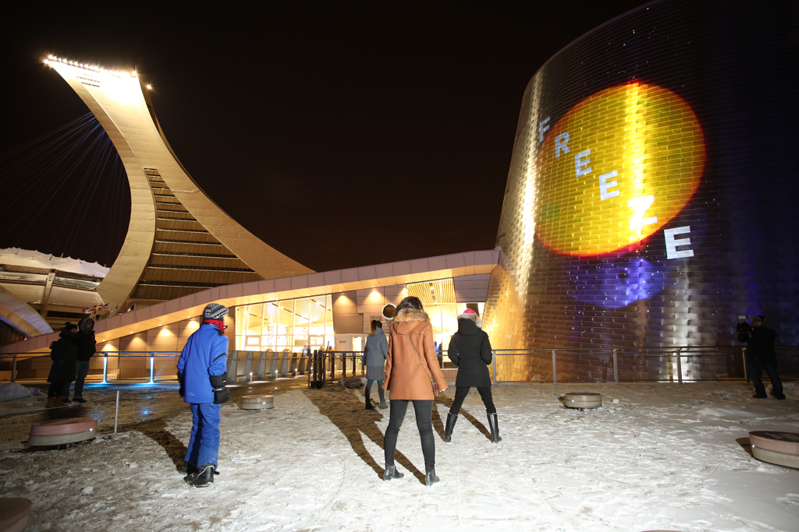


This chapter documents the various stages of *Choreographies for Humans and Stars* in chronological order. It talks about project logistics, prototyping processes and technological choices, before diving into some OF implementation details towards the end.

### Call, Competition and Commission
The project started out as an official call by the [Public Art Bureau of the City of Montreal](http://ville.montreal.qc.ca/artpublic), which is in charge of commissioning and maintaning permanent artworks around the city. For the opening of the new planetarium they wanted to commission Montreal's very first interactive and permanent artwork.

The official brief asked for an interactive digital installation utilizing the building facade for projection and simultaneously offering an intervention on the plaza in front of the venue's entrance. The artist needed to ensure that the work lasts a minimum of 3 years in the public space, operating year-round. Sound was excluded, and the work should produce no light pollution. The budget for realizing the project was set at $262.000 CAD (before taxes).

The selection process took ~9 months and included three phases:

 1. Request for qualifications (RFQ): jury select 6 artists based on portfolio
 2. Request for proposals (RFP): jury select 3 finalists based on preliminary artistic concept
 3. Final concept: jury selects winner based on complete project proposal (photo montage, video simulation, detailed budget, technical details, production calendar, supplier and collaborator list)

After passing all phases we were officially commissioned by the Public Art Bureau in June 2012.

### Timeline
From first brainstorms to final hand-over the mammoth project took an impressive 28 months to complete. That's 10 months longer than the official brief planned for. When you work with that many players (the city, the planetarium, collaborators..) your first and second attempt at a project timeline is bound to fail. A lot of the delay was due to elongated contract negotations with the city, as neither we nor they had negotiated the maintenance of permanent digital artworks before (not your typical bronze statue).

Our more pragmatic goal was to get it all done by November 2013, with the main intention of avoiding all the snow and coldness that comes along with Montreal's winter season. Naturally we slipped right past that goal, and had our big opening amidst lots of snow mid January, with temperatures ranging between -15 to -25.

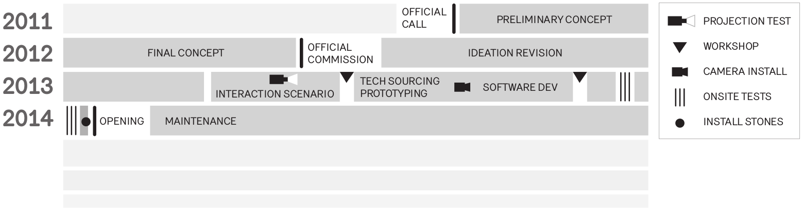

### Everyone involved

Credit lists quickly grow long. The internal DTLJ team includes Mouna and Melissa being the main artists with the vision, Eva handling software, Pierre being heavily involved with visual identity and video production, Michael handling the LEDs in the outdoor furniture. The list of external collaborators include a producer (Nicolas), a choreographer (Dana), a technical director (Frederick), a software engineer (Emmanuel), a film animator (Patrick), an industrial design studio ([Dikini](http://www.studiodikini.com/)), a graphic designer (Studio Atelier), a concrete workshop ([M3Beton](http://m3beton.ca/)), engineers, a camera man, ...


## Ideation and Prototyping

*Choreographies for Humans and Stars* is inspired by space as the great unknown. We felt that our role could be to bring a physical experience that would help the planetarium visitors to not only understand but also feel what space is about. One of our early inspirations was the opening scene of the Béla Tarr's movie "*Werckmeister Harmonies*", where a party ends in dancing a solar system waltz with the Earth and the Moon turning around an eclipsing Sun.

Very early in the process we started collaborating with a choreographer and together we explored how participants could use their bodies in ways that mimic celestial dynamics. In a choreography-driven narrative each scene would represent a recognizable space phenomena, instigating a journey from spinning like revolving planets, to lining up to cause an eclipse.

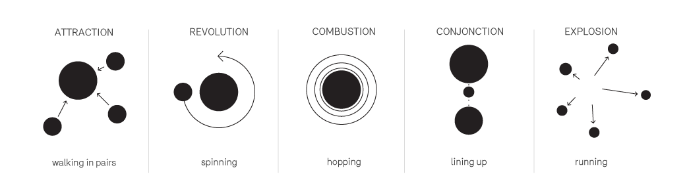

The individual choreographies would be communicated with text instructions and should allow participants to dance within a group, yet maintain enough freedom to indulge in personal interpretations.

### Challenges in the Interaction design
Once the overall structure and narrative had been decided on we moved into the iterative process of prototyping, testing and finetuning the interaction design. We went from paper drawings to full scale prototypes and had several test sessions with users of all ages.

One of the main challenges of the project was to find a balance between providing interesting reactive visuals while also giving people the freedom to perform choreographies without having their eyes constantly stuck on the screen. Being unable to use sound, all interaction feedback needed to be visual. But in order to encourage true freedom of movement, the colorful images of explosions and shooting stars needed to be tuned down in their *reactiveness* to provide more of a backdrop instead of the main attraction of the piece.

Similar challenging was the task to communicate the instructions to the participants. While some actions could be phrased as one-worders - *"FREEZE!"* - others were more elaborate and cryptic - *"Walk with someone, keep the same distance between you (No hands!)"*. Creating the piece for a bilingual audience also highlighted the possible interpretive differences between English and French instructions. Having test sessions with uninitiated users was important to adjust the exact wording of instructions, and also to refine the timing of the individual scenes. (The factor that eventually ended up influencing the timing the most, was January's outside temperature).


### Outlining the dance zone

The projection being intangible, it was important to give the project a physical presence on the ground. Some sort of tangible intervention that would serve as interface for people to interact, and further represent the project during daylight hours.

At the beginning we imagined a series of stones and platforms arranged to form celestial pathways and encouraged hopping from stone to stone. Yet this would have introduced too many physical obstacles (tripping over, slipping) and severely limited the free movements and interactions in the space. Over the course of prototyping the importance of the physical presence shifted from being an interface to providing a delimiting perimeter around the active dance zone. After going through many design proposals (a stage, a ring, a ballet pole!) we landed on 7 inch-high concrete stones positioned in a circular formation. A single white LED on each stone enhanced their presence. Installing the underground cabling for those 7 LEDs proved a big challenge and required the $10k rental of a ground-unfreezing device.

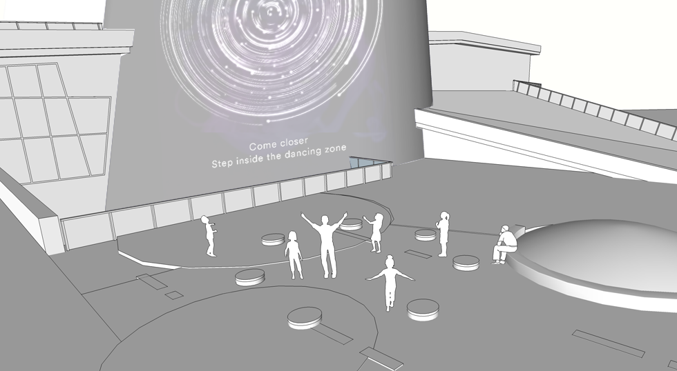


### Producing video content
Since the project would be permanently installed, we involved locals in the making of these images, aiming to create a sense of ownership within the community that will be living next to the project for many years to come. The image and video content was created using simple analog animation techniques in a series of [workshops](http://www.dailytouslesjours.com/to-community-and-beyond) with local kids aged 7 to 12.


## Finding the Technical Solutions

The technical challenges of creating a public artwork definitely multiply when the project is meant to be permanent. Suddenly you can't just hide cables under cable-trays or choose the perfect location for your camera. Your limits are set by year-round weather conditions, architectural building codes and the intended path of the snowplow.

#### Put the Projector with the animals
The projection surface on the planetarium is 20 meter high and covered with shiny tiles. The shininess of these tiles was first worrisome, but an early projection test settled any doubts of projection quality. To cover a large area of the building surface, we required a high-lumen projector ([Barco HDX-W20](http://www.barco.com/en/Products-Solutions/Projectors/Large-venue-projectors/20000-lumens-WUXGA-3-chip-DLP-projector-with-light-on-demand-option.aspx "Barco HDX-W20")) which naturally ate almost half the budget. To save further costs - and for weather-protection and easy-access reasons - the projector was placed in the neighbouring building: the Montreal biodome. We had to build a wooden platform for the projector and cut a glass replacement window out of the slightly tinted facade of the biodome. A simple $15 heater now ensures that that window is kept clear of ice and condensation.  Additionally we negotiated with the landscape architects the trimming of any trees that were likely to grow into our projection cone over the next 3 years.

Working inside the biodome turned out to be quite entertaining: my access route to our equipment led directly by the penguin compound, and work sessions were accompanied by a constant backdrop of bird chirping.

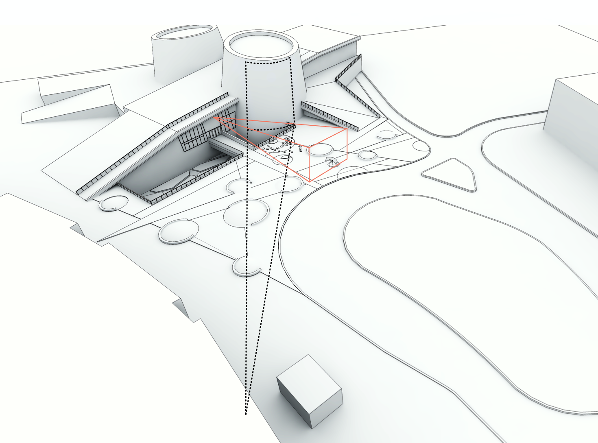

#### Camera style and placement
In an ideal camera tracking scenario you have a controlled indoor environment that provides a clean top-down camera view and lets you create the lighting and background design of your choice. Our site at the planetarium is outdoors and therefore subject to all possible weather conditions. The foreground-background contrast can invert based on if snow covers the dark pavement or not. The general lighting conditions are poor, but the area can temporarily get lit up by the headlights of passing cars.

When first brainstorming technical solutions Kinects were quickly excluded due to a distance of at least 20 meters between dance stage and any possible camera location. More viable options included thermal imaging cameras (\$\$ and low-res), laser range finders (\$\$ and limited to one dimension), stereoscopic 3d cameras (too dark environment, also too large distance), and cameras placed at 2 different angles to allow for dynamic mapping of two perspectives into one (double the fun/noise).

Finally we settled on going with one single camera [(Basler Scout scA1600-28gm)](http://www.baslerweb.com/products/scout.html?model=130 "camera on baslerweb.com"), with a high sensitivity lens [(Fuji HF12.5SA-1)](https://www.fujifilmusa.com/products/optical_devices/machine-vision/2-3-5/hf125sa-1/ "lens on fujifilmusa.com") for low-light situations and a tracking solution that could convert the 2d information into 3 dimensions. Strict architectural codes prohibited us from placing the camera on top or along the surface of the planetarium. After long negotiations we were limited to placing the camera at a quite low angle slightly to the left of the projection site. Surveillance style, we packed the camera into an ugly weatherproof housing, together with a power supply, a heater and a fan system.


#### Network setup and negotiations
After calculating our camera's bandwidth requirements (resolution 800x600px * framerate 28fps * color depth 8bit * raw compression = 13 MB/sec) we discovered that the local network wouldn't allow us to send the camera data directly to the projector site. We had to place one computer (Intel Core i5 3570K 3.40G/6M/S1155 with 8GB ram, Ubuntu 12.04 LTS) in close proximity to the camera and another computer (Intel Core i7 3770K 3.40G/8M/S1155 with 16GB ram and an Asus GTX680 graphics card, Ubuntu 12.04 LTS) next to the projector. The two sites were only a 3-4 minute footwalk apart, but required keycards and the occasional security guard to open locked doors. In hindsight we would have preferred to stick to the original plan of installing our own fiber optics link to place all computer equipment in the same location.

The network being part of the city network, was heavily controlled, subject to 15min timeout internet access. A couple of request forms later we had a LAN connection between our two computers. VPN access for remote maintenance and remote updates took about 2-3 months, and we are still in negotiation to get SSH access. (Cities protect their networks).

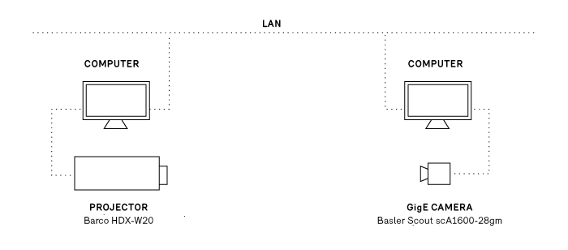

### Choice of tracking software
For the tracking software we found a collaborator in Emmanuel Durand, part of the research lab at [Society for Arts and Technologies](http://www.sat.qc.ca/ "Society for Arts and Technologies"). Emmanuel had developed [blobserver](https://github.com/paperManu/blobserver "blobserver on github") - a opencv based software to implement various realtime detection algorithms - and was looking for first test projects. For the project he further developed and adapted blobserver to our needs. Blobserver is designed to take in multiple camera or video sources, detect entities and then report its findings via OSC. Live configuration of blobserver can be done through OSC as well, which allows for easy integration with any OSC-friendly software.


#### Method of Tracking
To track participants in our dance zone we used blobserver's HOG detector ([histogram of oriented gradients](http://en.wikipedia.org/wiki/Histogram_of_oriented_gradients "Histogram of Oriented Gradients on wikipedia")) which learns from a database of human shapes to detect human outlines. The HOG detection is processing optimized by limiting its areas of interest to areas with recent movements, detected by background subtraction.

First tracking tests were done based on publicly available databases of human shapes [link?], but to get better results we created our own image database. We trained the system on images taken with our camera on site, providing the specific camera angle and the same specific background. Future project updates will include further training of the tracking model by including images showing people and environment in their summer-attire.


#### Tracking challenges
The tracking algorithm performs great when dealing with ideal-case scenarios: maximum 3 people, moving at a distance from each other, their silhouettes standing out with high contrast from the background. But naturally, in a public setting without any sort of supervision you can't control how the audience uses your artwork. As soon as too many people enter the dance zone at once, the system can get confused by overlapping shapes. Similarly, small children, or clothes in the same brightness as the background can cause the detection algorithm to sporadically fail. Configuring the system to forgive those mistakes and let it pretend it still detects those participants, also widens the door for unintentional noise (fake positives).  

That balance between detection precision and detection forgiveness and the fact that we deal with a fuzzy system in an uncontrolled environment, took a while to settle in (Side note: this is our first camera tracking project). During early on-site tests we'd settle on tracking settings that performed well, only to come back the next day to a different weather scenario and discover that the same settings didn't apply anymore.

After learning this the hard way, we understood to lower our expectations and also figured out ways to make use of the limitations of the system. Certain instructions ask participants to change into untypical shapes (*"Hop from one spot to the other"*, *"Drop to the ground"*). Instead of training the system on the shapes of people hopping or lying on the ground, we'd use the fact that the detection system lost them, in order to trigger visual reactions.

Similarly we'd detect people spinning - "*Take someone's hand, spin and lean out as far as possible*" - by counting how many times the system loses and re-detects their shapes. As we'd only look for one specific choreography in each scene, we were free to interpret the incoming tracking results as needed.


### Choice of visualization software
This project provided the perfect excuse to jump back into openFrameworks. Previous company projects relying on computation mostly lived in the realm of music (max/MSP) or the web (python, node.js). On the rare occasion that visuals were involved, a too short timeline asked for a quick solution (processing). And in general we fall victim to the mistake of over-polluting the never ending prototype and simply turning it into production software.

*Choreographies for Humans and Stars* with its demands of high-res video animations provided a decent time frame allowing for proper project development and gave me all the right reasons to return to openFrameworks. Helpful at this stage was that most prototyping of content and interaction happened with non-interactive videos produced with video editing software. Any truly interactive prototype had to wait for all the pieces (camera placement on site, trained tracking software) to come together.  

OpenFrameworks was chosen as the programming environments because of C++'s fast processing speed, it's addons, the open-source nature of many similar projects dealing with video and animation content, and mostly its avid and rarely not-helpful community forum. A main reason was also openFrameworks cross-platform ability, as i am personally on a Windows 7 laptop, while the office is reigned over by Macs, and the decision had been made to give it a try with Linux computers for the installation. So being able to jump between the different operating systems while still developing the same software was naturally a plus.


### Additional software used
 - [processing](http://processing.org/ "processing") ... for creating OSC communication dummies
 - [switcher](https://code.sat.qc.ca/redmine/projects/switcher "switcher at code.sat.qc.ca") ... to stream video files to shared memory
 - [libshmdata](https://github.com/sat-metalab/libshmdata "libshmdata on github") ... to share video via shared memory
 - Photoshop, Final Cut Pro ... to produce and edit image / video content


## Developing the Visualization Software

### Development setup
The openFrameworks linux install is build for codeblocks, yet as i have come to like the code editor [Sublime Text](http://www.sublimetext.com/ "Sublime Text") for its lightweightness and simplicity, i chose to program in Sublime and then compile (`$ make`) and run the program (`$ ./bin/appName`) from the terminal (or [terminator](http://gnometerminator.blogspot.ca/p/introduction.html)). On my win7 laptop i code with Sublime, but compile and run the software from within Codeblocks. Besides its purpose of providing a history of the code, i use github mainly to push code between development and production computers. Alongside Sublime and a bunch of terminal windows, my typical programming setup includes a browser with tabs open on the openFrameworks forum, the openFrameworks documentation page, and github (to search specific function uses).

### Quick summary of what the app does
The application navigates the projection through a sequence of 6 scenes that have different visuals and choreography instructions. When participants follow the instructions (and hop, or line-up, or run around ..) the application receives their position data, analyses it for each scene's interaction requirements, and then controls video elements on the projection. In some scenes the participant's location is directly mapped to a video element location, in other scenes participant movements simply cause videos to appear/disappear on screen.

The addons used for the application:

 - **ofEvents** ... for controlling the animation
 - **ofxOsc** ... for communication between computers
 - **ofxOpenCv** ... only for running a perspective transformation
 - **ofxGui** ... to build a GUI

### Sequential structure
The transition from one scene and segment to the next is either time-dependent (elapsed time comparison with `ofGetUnixTime()`) or based on the participants successful execution of instructions (did they all freeze?). Yet even if no interaction goal is achieved, a set maximum timer will still cause the transition to the next scene.

While the system usually goes through all scenes sequentially, the scene requiring at least 2 participants will be skipped if not enough people are detected in the dance zone. Additionally the system will fall into an idle mode, if no participants have been detected during the last 30 seconds. After the idle mode it restarts the sequence with scene 1.

### Incoming tracking data
The tracking software *blobserver* on the camera computer acts as OSC server and is configured to send tracking data to the IP address of the projection computer. Similarly the openFrameworks app registers itself as OSC client on the OSC server and is able to tune the tracking parameters according to specific scene requirements.

To be able to test and simulate the two-way OSC communication i created several processing dummies, which turned out to be very useful for occasions without the full technical setup. (1: dummy to print out received message. 2: dummy to send tracking parameters. 3: dummy to simulate incoming tracking data).

#### Dealing with split message blocks and framerate differences

The OSC messages sent by the tracking software take this format:

```
/blobserver/startFrame      389 1
/blobserver/hog             128 140 287 0.4 1.2 77 4 1    
/blobserver/hog             135 418 103 2.2 2.8 20 0 0
/blobserver/hog             136 356 72 0.3 0.2 18 0 0
/blobserver/endFrame
```

Each message with the address line `/blobserver/hog`  signifies the tracking data for one recognized shape, and communicates blob id, position, velocity, age, etc. Bounded by the `/blobserver/startFrame` and `/blobserver/endFrame` messages, an arbitrary amount of tracking messages (= current number of *people* recognized) can be received at any time. The frequency of those message blocks depends on the framerate of *blobserver*.

As it can't be guaranteed that *blobserver* and openFrameworks always run on the same framerate, it could happen that multiple tracking updates arrive before the openFrameworks baseApp calls `update()` again. It was therefore necessary to *store away* new incoming data and only trigger the actual processing of that data after all incoming messages have been parsed.

Similarly it could happen that half of the tracking messages are received before, and the other half after the baseApp's `update()` loop. To avoid this splitting of data to cause glitches (system thinks a specific blob-id disappeared, while it just hasn't been updated yet), it was necessary to hold off all processing of data, before at least one `/blobserver/endFrame` has been received during each openFrameworks frame.

#### Storing and updating tracking data
The received tracking data is stored in a map of `Blob` objects `std::map<int,Blob> blobs`. Maps give all the flexibility of vectors (loop, iterator, etc.) but also allow for easy access of entities via their id.

If new tracking data arrives, the system first checks if the blob-id already exists in the map or if it needs to be created. Then it updates the instance with the new data.

```cpp
while (receiver.hasWaitingMessages()) {

    // ...
    if(m.getAddress() == "/blobserver/hog") {

        // parse incoming message arguments
        int blobid = m.getArgAsInt32(0);
        int posx = m.getArgAsInt32(1);
        int posy = m.getArgAsInt32(2);

        // first look if object with that ID already exists
        std::map<int,Blob>::iterator iter = blobs.find(blobid);
        if( iter == blobs.end() ) {
            // didn't exist yet, therefore we create it
            blobs[blobid].id = blobid;
            //....
            ofAddListener( blobs[blobid].onLost, this, &planeApp::blobOnLost );
        }

        // now update the blob (old or new)
        Blob* b = &blobs.find(blobid)->second;
        b->setRawPosition(posx, posy);
        b->setVelocity(velx, vely);
        b->age = age;
        //....

    }

}
```

After the new tracking information has been filed away into the blobs map, the blobs map is cleaned of all non-updated members.

#### Perspective transformation
The blob location data received from the tracking software is based on the angled view of the slightly off-center mounted camera. To be able to better tell the participants' position within the dance stage and their distance to each other, it was necessary to map that skewed 3d location data into a cleaner top-down perspective. Additional rotation of the now 2dimensional data enabled it to easily tell if participants aligned themselves along the axis facing the projection. The skewing and rotating of the data is achieved via `cv::perspectiveTransform`.

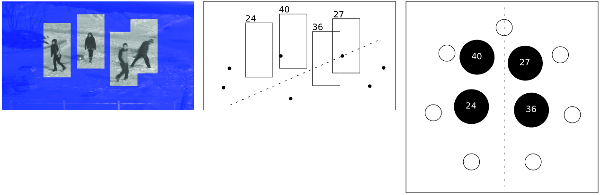

### Implementing video content
All our visual raw material exists in the form of videos (and some images). Besides written instructions that are drawn, everything on the projection is direct video display without any effects.

#### The quest for the right codec
When we first received the computer hardware i did a series of performance tests with video files of different codecs to determine how we would prepare our video content. The mistake i made was that i primarily focused on video playback. And once the setup would play multiple video instances at HD resolution, 30fps, in every codec (H.264, photoJPEG, quicktimePNG, animation, raw) while still providing a framerate of 60FPS, i was convinced the top-notch CPU and GPU would be able to handle it all.

What i didn't consider was the load on the processor that comes from loading, decoding, starting, releasing and deleting of multiple video objects within short time spans. This insight finally dawned close to the project's opening date, when more and more photoJPEG and quicktimePNG (alpha) video files were added to the project and the framerate suddenly started to dwindle. Luckily for us, that drop in performance was not clearly visible to the *unknowing* eye, as the project's overall handmade look'n'feel (due to the material's origin from analog stop-motion techniques) allowed for more tolerance regarding the framerate.

Another round of video performance tests (post opening) led to the conclusion that we'd re-encode all videos with the animation codec at the lowest framerate the video content allowed (5, 10, 15fps). Even though the video files were larger in size, the less strong compression factor minimized the processor's decoding time.

Still, we encountered a few platform and player-dependent idiosyncrasies. an unsolved mystery is still why gstreamer doesn't like certain custom resolutions and displays a green line underneath those video (our fix: find a new resolution).

#### Dynamic video elements
While the background videos appear on schedule and are preloaded by the system, most foreground videos appear dynamically based on participant actions. To be able to handle them easily all dynamic video elements are stored in a vector of shared pointers `std::vector< ofPtr<mediaElement> > fgMedia`. The whole vector of pointers can then be updated and drawn, no matter how few or many videos of shootings stars or planets are currently being displayed. By using `ofPtr` one doesn't need to worry about properly releasing dynamically allocated memory.  

Example: Everytime a user stands still long enough during scene 1, a video element displaying a blinking star gets added to the vector:

```cpp
// add new STAR video
fgMedia.push_back(ofPtr<mediaElement>( new videoElement("video/stars/STAR_01.mov")));

// set position of video, and press play
( *fgMedia[fgMedia.size()-1] ).setPosition( blobMapToScreen( blobs[blobID].position ) );
( *fgMedia[fgMedia.size()-1] ).playVideo();

// link blob to video, to be able to control it later
blobs[blobID].mediaLink = fgMedia[fgMedia.size()-1];
```

#### Preloading versus dynamic loading
In general all video sources that are used in a controlled way (as in: used only as one instance) are preloaded at startup of the software. For video sources that are called up dynamically in possibly multiple instances at once, a combination of two approaches were used:

 1. Load the video content when needed ... freezes whole app momentarily while loading file, unless the video loading is executed within a thread
 2. Preload a large enough vector of multiple instances of the video, then cycle through them with a pointer ... allows for faster access/display, yet slows down the application if used for too big or too many video files

### Event-driven animation
The control of video elements by the blobs (detected participants) is implemented with `ofEvent()` calls. Events are an good way of giving objects a way of controlling elements in the baseApp without having to query each objects possible states from the baseApp's update() loop, or without having to give objects a pointer to the whole baseApp.

Blob objects have multiple events they can trigger actions in the baseApp:

 - **onEnterStage** ... enter dance zone, used to make videos appear
 - **onLeaveStage** ... leave dance zone, used to make videos disappear
 - **updatePosition** ... called on every frame, to update position-mapped video elements
 - **onLost** ... not detected anymore (but still alive!), used for Hop! Run! Drop! video triggers
 - **onFreeze** ... stopped moving, used to make videos appear or force transitions (all freeze!)
 - **unFreeze** ... started moving again, used to make videos disappear
 - **overFreeze** ... hasn't moved for x seconds, used to make constellations appear
 - **onSteady** ... at same distance to neighbor for x seconds, used to create star bridges between neighbors
 - **onBreakSteady** ... broke steady distance with neighbor, let star bridge disappear
 - **prepareToDie** ... make sure to disconnect all connected videos
 - ...

`ofEvent` instances are defined in the blob object header:

```cpp
class Blob {

    ofEvent<int> onLost;            
    ofEvent<int> onFreeze;     
    ofEvent<int> unFreeze;

}
```

When a new blob object is created in the baseApp, `ofAddListener()` connects the object's events to functions within the baseApp.

```cpp
// create new blob
blobs[blobid].id = blobid;

ofAddListener( blobs[blobid].onLost, this, &planeApp::blobOnLost );
ofAddListener( blobs[blobid].onFreeze, this, &planeApp::blobOnFreeze );
ofAddListener( blobs[blobid].unFreeze, this, &planeApp::blobUnFreeze );
// ...
```

When a blob then updates and analyses its position, velocity etc. it can trigger those events with `ofNotifyEvent()`.

```cpp
void Blob::evalVelocity(float freezeMaxVel, float freezeMinTime) {

    if ( this->vel < freezeMaxVel ) {
        if ( !frozen ) {
            frozen = true;
            ofNotifyEvent(onFreeze,this->id,this);
        }
    } else {
        if ( frozen ) {
            frozen = false;
            ofNotifyEvent(unFreeze,this->id,this);
        }
    }

}
```

The `ofNotifyEvent()` call then triggers the connected function in the baseApp:

```cpp
void planeApp::blobOnFreeze(int & blobID) {

    if (scene==STARS && blobs[blobID].onStage) {
        // add new STAR video
        fgMedia.push_back(ofPtr<mediaElement>( new videoElement("video/stars/STAR_01.mov")));
        // ...
    }

}
```


### Debug screen and finetuning interaction
For testing and tuning purposes the application is run on 2 screens: the projection and the debug screen (by using `window.setMultiDisplayFullscreen(true)`). The debug screen shows a visualization of the tracking data, the states of the blobs relevant for the current scene, two GUI panels for finetuning parameters, and a smaller preview of the projection view.

When doing live testruns on site it is important to have all interaction parameters easily accessible via a GUI. Thresholds like: what velocity defines "standing still", or how exact does the alignment need to be to activate the eclipse - are easier to tune if comparison runs don't need to get interrupted by software compilation time.  

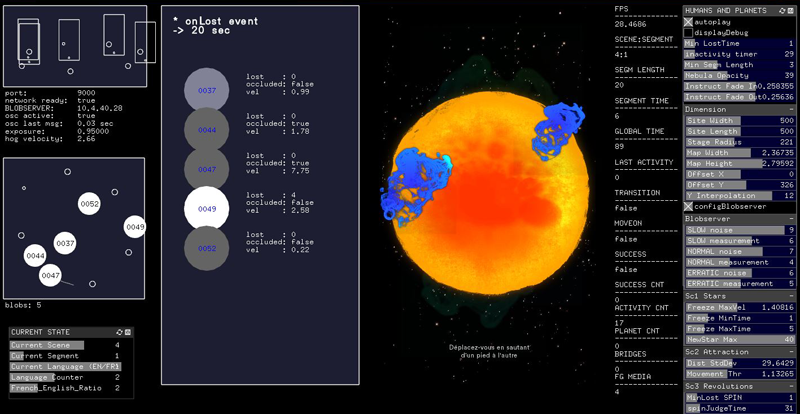


## Fail-safes and dirty fixes
The nights before the opening were naturally used for heavy test sessions that led to some restructuring, some video updates and lots of parameters finetunings. Late night coding over remote desktop while dressing up every 5 minutes to run outside into the cold to test the changes with camera vision and projection - not the best of scenarios. Combined with the natural occurrence of bugs, suddenly the software didn't seem as stable and fast as just a few days ago. A mysterious segmentation fault error kept appearing (not often enough to be easily traceable), but other pressing issues didn't allow for proper investigations into the error's roots.

The opening day had me glued next to the projection computer, ready to hit a button or change a parameter, in case of unexpected crashes or lagging framerates. The next day - before the project went live on its daily schedule of 5pm to midnight - turned into an exercise of setting priorities. Instead of going into debug mode and investigating errors, the main goal was to to keep the app going seamlessly during showtime.


### First: Keep your App alive
The one good thing about segmentation faults is that they kill your application very fast. The software crashes and in the next frame you are left with your desktop background (which should be black). The perfect fail-safe solution for this is something like [daemontools]( http://cr.yp.to/daemontools.html) (linux), which is a background process that monitors your application and restarts it within a second in case it crashes. After setting up supervision with daemontools, the application could crash, but all people would see is a few seconds of black (depending on how long the preloading of video files takes on startup).

### Second: Framerate cheats
The second concern was the prevent or hide the drops in framerate that would be caused by too many dynamic videos being active at the same time.

- Erratic framerate variations can be hidden by updating animations with a FPS-dependent value `ofGetLastFrameTime()`
- If the application's memory usage grows over time it probably has hidden memory leaks. To counter a steady drop in framerate it's not a bad idea to regularly terminate the app voluntarily. We found a natural and seamless opportunity to restart our application at the end of each 6-scene sequence.
- By putting realistic limits on the number of your processed objects (blobs, video elements), you can avoid major framerate drops when mysterious glitches suddenly report the simultaneous detection of 100 blobs.

### Always: Investigate
In order to understand and fix what's going wrong in your application, it's necessary to find ways of monitoring what's going on under the hood.

- I use `ofLogToFile()` to make each run save out its stack trace to a timestamp-named log file. Being able to go back and search for similar interaction sequences in history, allows me to compare if a certain hack solved a problem.
- When implementing memory-related changes (threaded objects, preloading of multiple videos, etc.) it is good to execute extreme use cases while having an eye on the application's CPU and RAM stats (`$ top`). This allows for a systematic comparison and early spotting of potential bottlenecks.

### Finally: Optimize
Once an installation has been open to the public for a few days, it hopefully has revealed all its weak points. After the stress of finding quick fixes to hide those weaknesses - and a few days of healthy mental detachment from the project - it was time to tackle and optimize the software with a clear mind.

- By replacing all video files that can easily also be drawn with opengl, your application will perform better.
- What to implement with threads?


## Results and Reception

At the point of writing this chapter *Choreographies for Humans and Stars* has been on show for 2-3 winter months. The projection on the shiny building looks very stunning and the snow landscape gives the site a beautiful lunar feeling. The project seems successful in addressing different kinds of audiences and manages to engage kids, teens and parents alike.

While for most people the choreography instructions seem easy to follow, we've also observed  several people mistaking the 7 concrete stones as interactive trigger elements. The confusion might be due to the delicate LEDs in the stones looking like sensors, or the descriptive text relief sculpted on top of the stones.

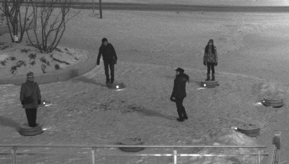

The reception from the audience is very good even though the usage count is not very high yet. Besides at events like Montreal's Nuit Blanche - luring with fires and hot beverages - the winter season with its low temperatures currently prohibits people from hanging out and letting the site become a destination in itself.

For objective analysis of usage and interaction behaviours we are gathering data with a simple logging system. It will be interesting to observe the usage over time and analyse the difference between seasons and succeeding years. Besides looking at number, we are also curious to see how people (the planetarium staff, visitors and passersby) will live with the piece over time.


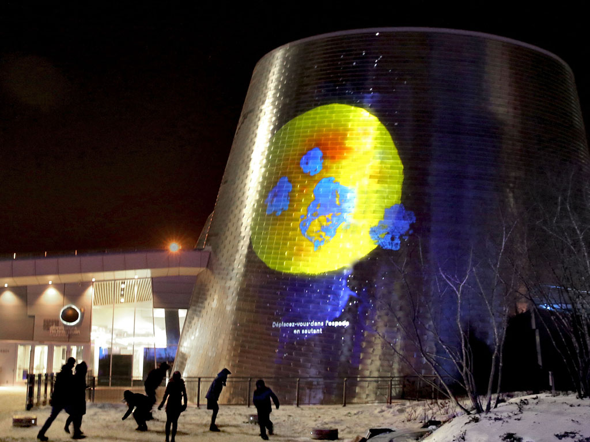


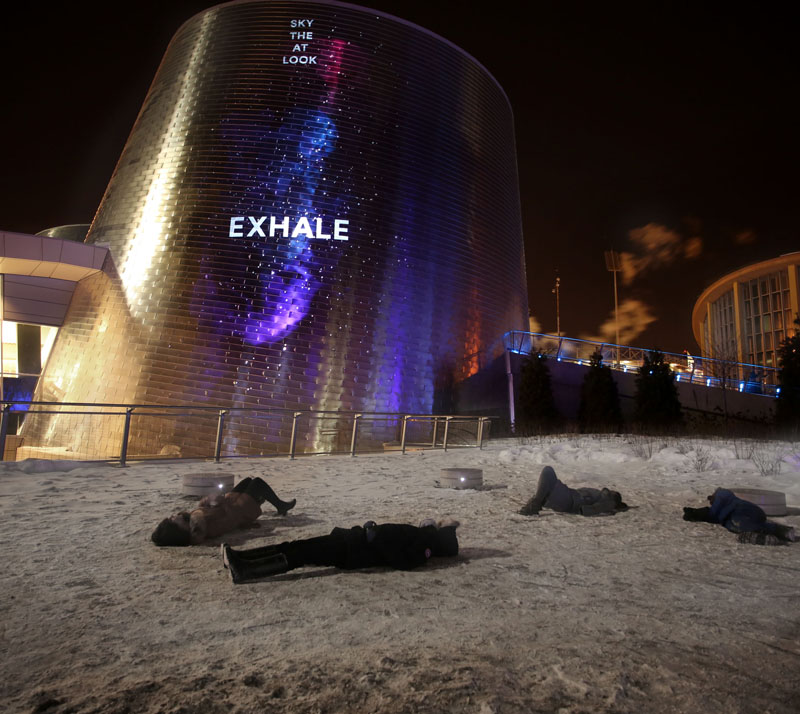

