# Anthropocene

## Project Overview

**Anthropocene**

_Adjective_

_Relating to or denoting the current geological age, viewed as the period during which human activity has been been the dominant influence on climate and the environment._

Anthropocene, an body reactive interactive video installation for Greenpeace as part of their field at Glastonbury 2013.

To see the finished project as part of a wider event please see the YouTube link below:

http://youtu.be/LwokmKqT0og?t=1m12s

Or an exceprt from inside the dome here:

https://vimeo.com/97113402

All source code can be found here:

https://github.com/HellicarAndLewis/Anthropocene

## The Project

### Initial Brief from Client

On 9th April 2013 we were approached by Paul Earnshaw of Greenpeace about an installation as part of Greenpeace's Field at Glastonbury 2013, a large music festival in the South West of England. Another interaction design studio had previously been in place to create a five day experience due to go live for the public duration of the festival on the 25th of June, but a scheduling conflict had emerged that had meant that they had to reluctantly withdraw.

Paul already had a budget and a unique space picked out for the installation, a large geodesic dome:

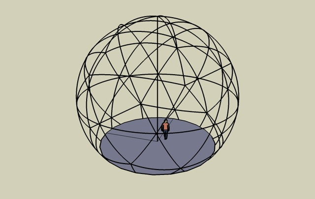

### Our response

We initially sought out a projector hire firm, who responded with a quote and a plan for a projection setup that met our requirements for maximum visual impact on a budget:

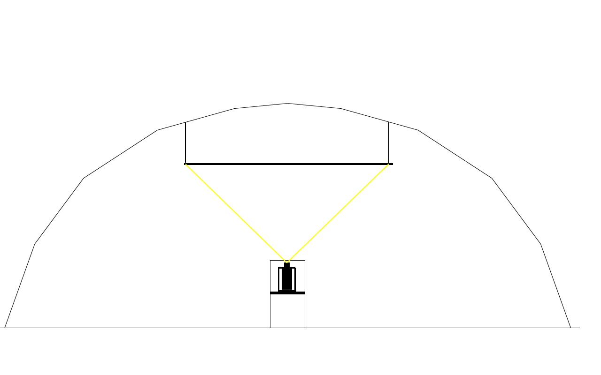

After some studio thinking, by 16th April we responded with the following document:


>We would like this installation to be a relaxing and immersive space. An oasis where the viewer can relax on bean bags looking up at a screen.
>
>We will use a mix of existing Greenpeace footage and a generative sound-scape to build a beautiful abstraction of the Arctic.
>
>We would like to project onto the ceiling of the space, using either a rectangular, square or circular projection surface. We will experiment with different projection >shapes and see what fits best aesthetically as well as meeting the budget.
>
>We would like to explore the following ideas within the imagery, sound and feeling of the space.
>
>1: The space as a timepiece - trying to have a cycle of sunset, night and dawn - each lasting around five minutes and having a single interaction between the floor and >ceiling that is explored graphically and interactively.
>
>2: Kaleidoscopes, shattering or delaying or time stretching footage. Breaking it up into blocks of time. Arranging in grids, or having different delays in different parts. >The possibility of peoples movement being mirrored into the video playback in interesting ways, playing with time.
>
>3: Making an oasis away from the rest of the festival that would last around 15 minutes, but raise some points about how the cycle of seasons of the Arctic are being >affected.
>
>4: Generative audio - a four channel speaker system that adds depth and texture the visuals.


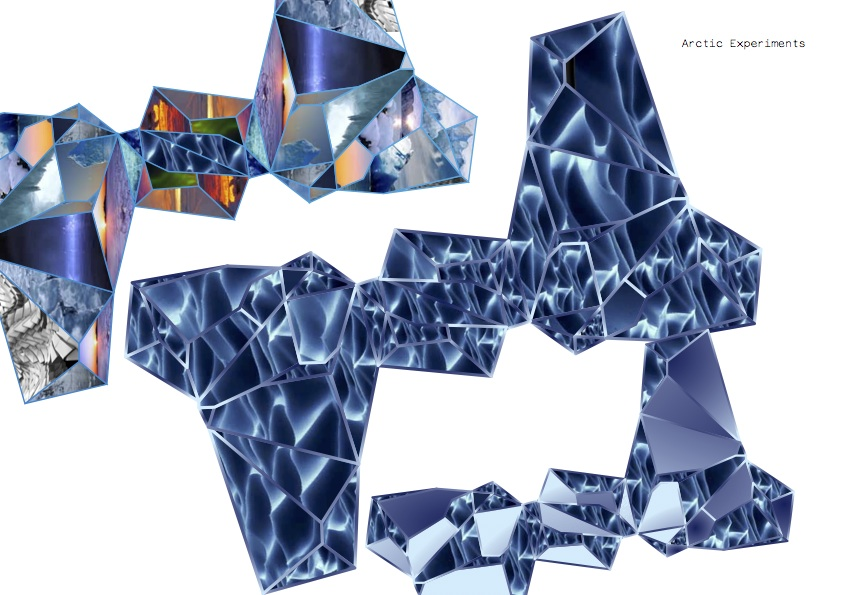


On April 30th, we recieved an email from Paul:

"..we would love you to implement your proposal in our main feature of the dome at Glastonbury Festival this year..."

We had the project! Now it was time to get real about the budget, and see if we could get some interesting musical collaborators...

During May, we concentrated on discovering what film footage was available, and finalising the production design and kit list. My business partner Pete Hellicar spent many hours working on the edit of the film, aiming to complete it while other negotiations continued.

### Audio negotiations

On May 10th, Pete reached out to our friends at Warp Records to see if any of their artists would be interested in donating their music to the project, and by the nick of project time we had permission from several artists to use their sounds.

### Supplier change, Final Budget Negotiations and Interaction Plan

By the end of May, we had changed hardware suppliers to ones already working with Greenpeace on their field, and had found replacement kit for our production. After experimenting with a circular projection screen, we'd arrived at a traditional projector set-up within the dome - a large rectangular projection screen about halfway up the dome wall with seating arranged in front of it. We'd also reached a final budget, and I was ready to start coding.

Pete and I had arrived at a final interactive concept after some discussions with Paul, who stated that a "show time" of about 15 minutes was desirable - enough time to get a detailed message across, but not so long as to bore a casual visitor. Pete took his film edit to 15 minutes and had it approved by the Greenpeace team for pacing and content. We decided to use the Microsoft Kinect to allow the openFrameworks application to distort or effect the film footage in real time - based on viewers movements in front of the projection screen. To make the dome a bit more comfortable Paul arranged the donation of several jumbo size bean bags - meaning that visitors could lie comfortably and wave their hands in the air to interact with the film - we angled the Kinect to hopefully pick up unintended user interaction first, surprising users and gently guiding them to stand in front of the bean bags and use their whole bodies to interact. We knew we had to strike a balance between a pre-scripted show and a completely spontaneous one - so we decided on developing several visual looks which could be placed onto a time line for easy repetition, editing and playback. The aim was to get to a system with the reliability of a static linear film and the responsivity of a live "VJ" system - albeit one that used the viewers silhouette rather than pre-rendered matts to affect the edited Greenpeace film.

At the beginning of June 2014 we received the following image from Paul:

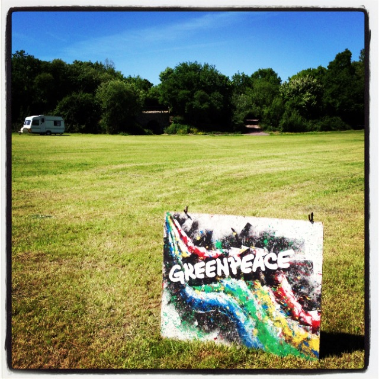

The site awaited us.

### Interactive Background to Delay Maps, and the possibility of generating a Delay Map from the Kinect Depth Image

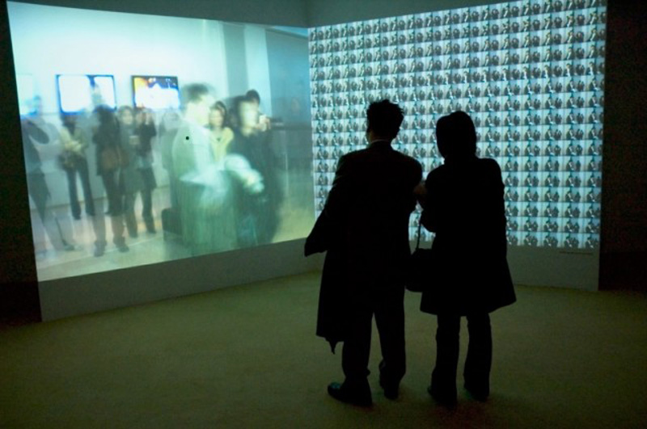

We are the time. We are the famous. Created at Fabrica.

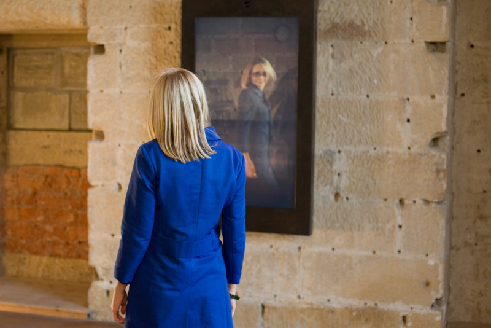

Hereafter by United Visual Artists.


Feedback by Hellicar&Lewis.

Pete started the project by doing some sketches in Photoshop of how two dimensional angular shapes could "shatter" video footage - I realised that we could make similar effects in real time by using a delay map. This brought me back to previous projects around varying video delay across a whole image - starting with ["We are the time. We are the famous"](http://www.benettongroup.com/40years-press/fabrica_yeux_ouverts.html) at [Fabrica](http://fabrica.it/), continuing with [Hereafter](http://uva.co.uk/work/hereafter) at [UnitedVisualArtists](http://uva.co.uk/) and finally [Feedback](http://www.hellicarandlewis.com/the-roundhouse/) at [Hellicar&Lewis](http://hellicarandlewis.com). Many people have been interested in this area for some time, [Golan Levin](http://www.flong.com/) has compiled a [list of related works](http://www.flong.com/texts/lists/slit_scan/).

A delay map is simply grey-scale image that is used in combination with a digital video file to decide how much the video file should be delayed on a per-pixel basis. In this projects case a white pixel in a certain position in the delay map meant that there would be zero delay on the corresponding pixel of the video file currently being played back. Conversely, a black pixel in the delay map image would mean the maximum frame delay on the corresponding pixel of the video file. I.e. a completely white delay map image would combine with a video file to play back with zero delay, whilst a black image would give a uniform maximum delay - a linear horizontal grey-scale gradient would give a gradated delay from 0 on the white side to maximum on the black side - with all divisions smoothly displayed in between.

Delay maps are a great way of allowing an art director to quickly "paint" several grey-scale images in Photoshop or some similar image editing program and see the effects of that map on any video file - abstracting away the technical details of the underlying video delay code. This approach of using imagery to control underlying code is a particularly effective technique - making new tools for Art Directors to interface with code using visual techniques rather than syntax and text heavy traditional software engineering techniques.

The breakthrough after this initial thinking was to try to think of what other grey-scale maps I had seen - the live depth image of the Kinect! This would allow peoples 3D silhouettes to create per pixel delay maps that would change in real-time as they moved in front of the 3D sensors of the Microsoft device. The addition of James Georges [ofxSlitScan](https://github.com/obviousjim/ofxSlitScan) made swapping in and out static grey scale maps very simple, all I had to do was combine the depth map with his existing code on a frame by frame basis.

### Actual Timeline

Here are the folder names of all the folders in my GreenpeaceArcticGlastonbury2013 folder.

* 2013_04_11_PlansAndContentFromGreenpeace
* 2013_04_16_ProjectorQuotes
* 2013_04_30_PeteQuoteAndIdeas
* 2013_05_08_GlastoOverviewPlan
* 2013_05_14_PetePlanAndTechList
* 2013_05_20_GuestList
* 2013_05_28_CrewDetailsFromPete
* 2013_05_29_addons
* 2013_05_29_addonsAfterPragmatism
* 2013_05_29_ofxGUIFromDevelopGitHubBranch
* 2013_05_31_AddMaps
* 2013_06_02_BaficInvoice
* 2013_06_03_PeteEffectsFromSomantics
* 2013_06_04_HomeHigherResForPete
* 2013_06_06_CallToActionScript
* 2013_06_12_CrewForFieldReadup
* 2013_06_12_Font
* 2013_06_12_GreenpeaceLogos
* 2013_06_12_MoreCrewBriefing
* 2013_06_13_HuntResult
* 2013_06_13_MoreDurationBits
* 2013_06_13_obviousJimAudioReactiveRing
* 2013_06_16_ofxTimelineVideo
* 2013_06_19_Singleton
* 2013_06_19_VoiceOverOutro
* 2013_06_20_CateringMenu
* 2013_06_20_NewAddonsToTry
* 2013_06_24_CodeForArtFromJeffTimesten
* 2013_06_24_DeadFlock
* 2013_06_24_newFilmAndAudio
* 2013_06_24_ofxAddonsOFXContourUtil
* 2013_07_31_Final50Invoice
* 2013_08_18_ThankYouFromGreenpeace

## Development
### Development Hardware and Software setup

MacBook Pro
* 15-inch, Mid 2009
* Processor: 3.06 GHz Intel Core 2 Duo
* Memory: 4 GB 1067 MHz DDR3
* Graphics: NVIDIA GeForce 9600M GT 512 MB

* XCode for Development
* Chrome for Web Browsing
* Sublime Text for logging

### Explanation and Discussion of Development in Detail

#### ofxKinect, as a possible input to ofxSlitScan

One of the benefits of using a platform like openFrameworks is that when people do release extras or "addons" they inevitably interface with the core - interesting results can be found by thinking about how addons can interface with each other using the core as a bridge.

In ofxKinect and ofxSlitScan's case, both addons used the same type of data:

```cpp
unsigned char* getDepthPixels();       ///< grayscale values //from ofxKinect.h
```
and
```cpp
void setDelayMap(unsigned char* map, ofImageType type); //from ofxSlitScan.h
```
So connecting them was simple:
```cpp
slitScan.setDelayMap(depthPixels); //from ofApp::update() in ofApp.cpp
```
This kind of separation demonstrates encapsulation or the information hiding qualities of software - the utility of not having to know the specifics of the implementation of the functionality described, merely the inputs required and outputs produced.

http://en.wikipedia.org/wiki/Encapsulation_(object-oriented_programming)
http://en.wikipedia.org/wiki/Information_hiding

#### ofxSlitScan, using PNG's and moving to generating realtime delay maps, making a Aurora

Starting is often the hardest thing to do with programming. To combat this, I try to do the stupidest, most obvious thing first and then build from there. In this project, I started by prototyping various looks using static PNGs - feeding new data into the examples provided with ofxSlitScan. The provided an easy sketching ability - combined with a paint program to quickly produce many input variations.

The next place to experiment was making the input real-time and interactive - using the blobs from a sliced section of the live Kinect depth image from ofxKinect. Drawing these simple blobs as an image allowed them to be inputted into ofxSlitscan on a frame by frame basis - producing a time warping effect over the playback of the film that Pete Hellicar edited for the project. As so often happens, when the input to the interaction becomes real-time it was far more engaging, which is exactly what we wanted users to do - see SLITSCANKINECTDEPTHGREY mode below for more details on the precise implementation, and in the other cases that follow.

What else could be done with the depth information applied to the delay map of the slit scan? Experiments with effecting the blobs outline yielded the SPIKYBLOBSLITSCAN mode. Using the input from the Kinect as an input to a paint simulator was something that I had worked on with Marek Bereza in the Somantics project - it made sense to try it as an input to a slitscan, as can be seen in the PAINT mode. This Paint mode made something that very much resembled the appearance of a human aurora when mixed with the beautiful Borealis footage that Pete Hellicar had sourced with the help of Greenpeace. SPARKLE mode was another example of a successful port from Somantics to Anthropocene.

Another good strategy for finding new interesting things is to feed the output of a system back into its input - this is demonstrated well by the visual feedback effects produced by using video frames as the delay maps back into their own history - implemented in SELFSLITSCAN mode.

#### ofxBox2d, making ice, previous projects with Todd Vanderlin

I had previously worked with Todd Vanderlin on the Feedback project, where we had experimented with using Box2D (via Todd's ofxBox2D) as a way of "shattering" live video. Feedback used a screen orientated in portrait mode that encouraged the repeating of familiar existing behaviour - moving the experience from a tech demo to a playful joyous one. Having earlier experimented with ice like static PNG's I knew that using real-time triangles from ofxBox2D would work well - this time I had the advantage via the Kinect of a slice of 3D space as input, something that Todd had to work much harder to simulate using only 2D live camera input in Feedback. This aspect of constantly improving novel hardware inputs means that previous work can often be revisited and explored.

#### ofxTimeline, understanding how cuing works

To combine the film and the various real-time effects, it was essential to develop a cuing system to allow different effects to combine with different scenes in a reliably repeatable way. I began by experimenting with Duration, but after emailing the author of the addon (see development notes above), it become apparent that ofxTimeline would be a much better fit for the project - a subset of Durations code base.

After dealing with Quicktime performance issues (see below), the main challenge was cuing the effects. The structure of how ofxTimeline passes messages meant that the signal to switch scenes would only be sent when the play-head passed over the cue - clicking to a point after a cue meant that the signal to switch scenes would not be despatched. Deadlines of other functionality meant that this couldn't be fixed in time for show time - meaning that show operators would have to be careful when shuffling playback during the show proper.

#### ofxGui, running the Latest branch from Github, multiple input methods and GUI addons

I knew that I wanted to augment ofxTimelines interface with controls for the setup of the Kinect and other custom requirements for the project. Watching the GitHub development branch revealed the release of an official core GUI addon - something I wanted to experiment with, which meant that I had to switch from an official static release of OF to the live development branch via Github. The project ended up with multiple interfaces - two graphical ones (ofxTimeline and ofxKinect control mainly) and a keyboard based one (consisting mainly of single boolean switches together with playback and editing shortcuts). With further development, a unified GUI would be desirable, but development pressures meant it wasn't a priority.

#### ofxOpticalFlowFarneback, making a polar bear

During development and testing, I realised a furry look could serve well for making people feel like they were polar bears. I had seen "spikey" outline looks before - all achieved by drawing normals along the circumference of a blob. I'd also experimented with optical flow in previous projects and started thinking about how the two could be combined - I looked for optical flow addons on [ofxaddons.com](http://ofxaddons.com) and discovered a flurry of recent activity since I'd last checked. Development tends to flow like this - periods of fallow followed by simultaneous parallel development from several quarters.

* [ofxCvOpticalFlowLK by James George](https://github.com/Flightphase/ofxCvOpticalFlowLK)
* [ofxOpticalFlowFarneback by Tim Scaffidi](https://github.com/timscaffidi/ofxOpticalFlowFarneback)
* [ofxOpticalFlowLK by Lukasz Karluk](https://github.com/julapy/ofxOpticalFlowLK)

Tim Scaffidi's version immediately stood out to Pete, so I developed two simple colourings for Aurora and Polar Bear modes, merely tweaking Tim's excellent demo code.

### XML Issues around the Naming of Scenes

Mid development, I found that saving the XML wasn't functioning as expected - it turned out to be the fault of non alpha numeric characters in scene names. I learnt the hard way that it's always good to avoid punctuation and spaces altogether and use [CamelCase](http://en.wikipedia.org/wiki/CamelCase).

### Video Performance, using the HighPerformanceExample

Right from the beginning of the project, it was obvious that video decoding would be significant portion of processing time per frame. Others in the openFrameworks community had been investigating performance in recent years, with James George contributing an [OSX only High Performance video example](https://github.com/openframeworks/openFrameworks/commit/4e02db8d82c520bef6c09d58b37076a84fe37571). This used native Quicktime playback features, enabling far higher performance on compatible hardware. While this undoubted enabled the film playback to function smoothly, it did make the code less platform independent - one of the inevitable compromises that happens during development.

### Counting the items in an Enum

I knew that I would have to switch between different visual looks as the film was played back by the program. C++ provides the ENUM keyword to allow the coder to define a data set of named elements, but I needed a way to count the number of modes programmatically. [Stack Overflow](http://stackoverflow.com/questions/2102582/how-can-i-count-the-items-in-an-enum) provided the solution.

```cpp
enum GreenpeaceModes {BLANK, GUI, VIDEO, VIDEOCIRCLES, KINECTPOINTCLOUD, SLITSCANBASIC, SLITSCANKINECTDEPTHGREY, SPARKLE, VERTICALMIRROR, HORIZONTALMIRROR, KALEIDOSCOPE, COLOURFUR, DEPTH, SHATTER, SELFSLITSCAN, SPIKYBLOBSLITSCAN, MIRRORKALEIDOSCOPE, PARTICLES, WHITEFUR, PAINT, GreenpeaceModes_MAX = PAINT}; //best to use ALL CAPS for enumerated types and constants so you can tell them from ClassNames and variableNames. Use camelCase for variableNames - http://en.wikipedia.org/wiki/CamelCase

/* http://stackoverflow.com/questions/2102582/how-can-i-count-the-items-in-an-enum
 For C++, there are various type-safe enum techniques available, and some of those (such as the proposed-but-never-submitted Boost.Enum) include support for getting the size of a enum.

 The simplest approach, which works in C as well as C++, is to adopt a convention of declaring a ...MAX value for each of your enum types:

 enum Folders { FA, FB, FC, Folders_MAX = FC };
 ContainerClass *m_containers[Folders_MAX + 1];
 ....
 m_containers[FA] = ...; // etc.
 Edit: Regarding { FA, FB, FC, Folders_MAX = FC} versus {FA, FB, FC, Folders_MAX]: I prefer setting the ...MAX value to the last legal value of the enum for a few reasons:

 The constant's name is technically more accurate (since Folders_MAX gives the maximum possible enum value).
 Personally, I feel like Folders_MAX = FC stands out from other entries out a bit more (making it a bit harder to accidentally add enum values without updating the max value, a problem Martin York referenced).
 GCC includes helpful warnings like "enumeration value not included in switch" for code such as the following. Letting Folders_MAX == FC + 1 breaks those warnings, since you end up with a bunch of ...MAX enumeration values that should never be included in switch.
 switch (folder)
 {
 case FA: ...;
 case FB: ...;
 // Oops, forgot FC!
 }
*/
```
I used the Stack Overflow tip in the `void ofApp::keyPressed (int key)` method.

```cpp
case 'a': //used to be key left, but it interferes with ofxtimeline
{
    currentMode = (GreenpeaceModes)((int)currentMode - 1);
    if(currentMode < 0){
        currentMode = GreenpeaceModes_MAX;//see .h file for stackoverflow justification
    }
    break;
}
case 's': //used to be key right, but it interferes with ofxtimeline
{
    currentMode = (GreenpeaceModes)((int)currentMode + 1);
    if(currentMode > GreenpeaceModes_MAX){
        currentMode = (GreenpeaceModes)0;//see .h file for stackoverflow justification
    }
}
```

While I could have gone down the [polymorphic](http://en.wikipedia.org/wiki/Polymorphism_(computer_science)) custom class route, I felt that the ENUM apporach provided good performance (through compiler optimisation of common C++ coding paradigms), speed of development (lower file overhead) and clarity of code.

### Sequencing


Kieran and Pete completed the main sequencing on-site.

## Show time

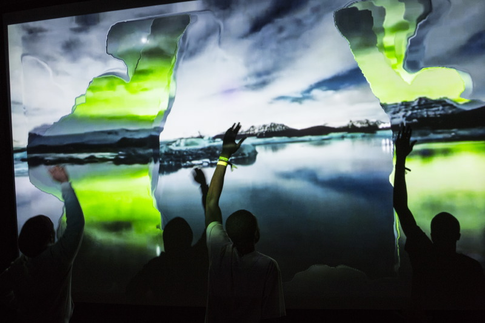

## Post Event

The biggest PR boost to the project while it was live was a [review](http://www.glastonburyfestivals.co.uk/news/greenpeace-at-glastonbury-2013) from Timeout:

"A highlight of the Greenpeace field was undoubtedly the Arctic Dome, voted by Time Out as the second best non-musical thing to do at the Festival and previewed by NME. It offered people the opportunity to disappear through a crack in the ice and take a magical 15-minute trip to the North Pole, where ice towered and the Northern Lights danced."

### Testimony from Show Operators

Kieran and Bafic were the people who ran the show for the general public, below is their testimony, with Kieran starting:

*Did you have a routine before show time?*

Before the first show of the day we’d double check the connection between the laptop and the Kinect and test with the skeleton tracking that everything was working correctly. Before show time we’d dim the lights, make sure the sound was turned on, switch to the point cloud setting so people could see themselves as they walked in and then we’d turn the beanbags upright so as to ’set the scene’. Then, as people started to walk in we’d raise the lights as though they were walking on stage. And then before we pressed play we’d dim the lights to black.

*Any problems during shows? Crashes? Funny stories?*

A couple of times the connection between the Kinect and the laptop failed due to the cable being under tension so we just had to let the show run to the end before we could fix it. The main problem we had was the projector overheating and displaying a lamp warning which involved having to find the technician to sort it. At one point the projector overheated so badly that we had to leave it switched off for 40 minutes before we could run the show again.

Off the top of my head I can’t think of anything I’d like to change about it, the GUI had quite a steep learning curve so it took a while to remember all the keys to press to hide each part of the interface but once we’d mastered that everything was fine. I guess the only thing that would be good but most likely ultimately un-achieveable would be full automation in the sense that the station wouldn’t have to be manned at all times.

Following is Bafic's post show report:

*Did you have a routine before show time?*

Before every show we would go through different ways to layout the bean bags. It's started off as just a small idea but as we kept on doing it we noticed that it would affect how people acted with the film. Some were semi circles some were bean bags set up in rows like cinema seats sometimes we pushed all bean bags to the back and told people they had to stand up and use their full body to  interact with the film.

When seated in rows people mostly used their arms (a few people were moving the legs in air sitting down) but never was it a full body movement until we moved bean bags to the back . Some excited people would stand up and run to in front of the Kinect and interact with it that way, after they had finished they would sit down and someone else would follow due to the sheer curiosity of seeing what the previous person had done. It was interesting because everyone was so curious as to what would happen. I was sitting their amazed because their were a few loops/back and forths happening.

1. You had the back and forth between the one person who would stand up interact with the Kinect and then that would show up on the projection.
2. They would sit down and the next back and forth would be the next person to stand up start off with maybe replicating the previous persons techniques and movement AND Then coming up with the own ideas and movement.
3. then their was us who was watching and getting excited and seeing what they were doing and changing effects depending on what the user was doing and what we felt like could be interesting then obviously what we put on screen would effect how the person would dance/move/use their body. The whole thing was like a 3x over Möbius strip of events and occurrences that kept affecting the previous element and also the next element at the same time!

*Any problems during shows? Crashes? Funny stories?*

I can't think of any crashes or problems that happened. Their was a time when someone came in with a puppet on a long stick and they waved it at the Kinect and that would egg on the rest of the audience because this funny puppet would appear on screen. The whole experience was really amazing and interesting.

### Open Source discussions with Client

Greenpeace were happy for us to Open Source, as we do with all our projects. Greenpeace does not have a GitHub of it's own, but we were able to suggest that that should be part of their future strategy. The problem was the film that formed the backdrop for the interaction - while musicians were happy to license music for a live only experience, getting those rights in perpetuity has been challenging. Negotiations continue.

### Re-running remotely in Australia and New Zealand

The project has been re-exhibited twice in the Southern Hemisphere - in Australia and New Zealand. Getting the code up and running wasn't a problem - but training someone to use the two layers of mouse GUI and on layer of Keyboard GUI was  a challenge, especially over a painfully slow Skype connection.

### Future development

Paul Valery said 'Poems are never finished - just abandoned'. This is sadly true for all artistic endeavours. Below are three areas for future development.

#### Social interaction

The [Hello Wall](http://www.hellicarandlewis.com/the-hello-wall/) and [Hello Cube](http://www.hellicarandlewis.com/tate-modern/) projects showed how making feedback loops between users and installations via social networks is not only fun, but helps spread awareness of the installation beyond the physical bounds of the project. Imagine allowing users to post comments to the projection as it happening via Twitter and receiving bespoke screen grabs showing evidence of their interaction in return - or even choosing which of the interactive effects is active at a certain time. The meta data of these interactions could be used to come up with the most enaging timeline, or to deliver messages to users in the days, weeks and months following the installation - particularly useful for an organisation such as Greenpeace that relies on public support to lobby Governments and Corporations.

#### Broadcast

Pete and I discussed how we could transform the installation into one that broadcast itself to a wider audience when we were in the planning stage. Unfortunately, securing a reliable Internet connection at the Glastonbury Music festival proved impossible. Post and Previous Hellicar&Lewis projects for [Nike](http://www.hellicarandlewis.com/nikefeeltv/) and [Coca-Cola](http://www.hellicarandlewis.com/coke/) show how broadcasting an installation with the addition of social network interaction can dramatically increase engagement. We hope to be able to make such a socially activated broadcast interaction with Greenpeace in the near future - imagine several locations around the world witnessing the same film simultaneously with body movement from each location feeding back into the others - live video portals of depth maps crossing continents and time zones to produce a truly global event.

#### Raspberry Pi

With the advent of a [Raspberry Pi](http://www.openframeworks.cc/setup/raspberrypi/) port of openFrameworks, a port of the project to the platform would allow for the deployment of the project to events that have even smaller budgets than this iteration. This would also entail a port of the Kinect code to 2D computer vision, but I'm confident this would be a spur for other interactions and visual effects.

### Conclusion

All in all, for a low budget project, using openFrameworks was the differentiator that enabled me to collaborate with the rest of the team at Hellicar&Lewis to make the installation come to life. The key factors were being able to draw upon so many external addons, previous projects and the community as a whole.

## Team and Credits

* Pete Hellicar and Joel Gethin Lewis
* Commissioned by Paul Earnshaw of Greenpeace
* Produced by Sarah Toplis
* Assisted by [Bafic](http://www.bafic.co.uk/) and [Kieran Startup](http://www.kieranstartup.co.uk/)

Project uses addons and other code Contributions from:

* [Marek Bereza aka Mazbox](http://www.mazbox.com/) as part of Cariad Interactive
* [ofxKinect](https://github.com/ofTheo/ofxKinect) by [Theo Watson](http://www.theowatson.com/)
* [ofxSlitScan](https://github.com/obviousjim/ofxSlitScan) by [James George](http://jamesgeorge.org/)
* [ofxBox2d](https://github.com/vanderlin/ofxBox2d) by [Todd Vanderlin](http://vanderlin.cc/)
* [ofxTimeline](https://github.com/YCAMInterlab/ofxTimeline) by [James George](http://jamesgeorge.org/)
* [ofxOpticalFlowFarneback](https://github.com/timscaffidi/ofxOpticalFlowFarneback) by [Tim Scaffidi](http://timothyscaffidi.com/)

Thanks to:
* All our families and friends.
* The Greenpeace Family
* Microsoft for being Open
* [Theo Watson](http://www.theowatson.com/)
* The entire openFrameworks community
* [Marshmallow Laser Feast](http://marshmallowlaserfeast.com/)
* [Tim Scaffidi](http://timothyscaffidi.com/)
* [James George](http://jamesgeorge.org/)
* [YCAM InterLab](http://interlab.ycam.jp/en)

## Hardware selection

* 1 x 3D Camera - Microsoft XBox360 Kinect
* 1 x Playback and Interaction Computer - MacBook Pro Retina
* 1 x 10K projector
* 1 x Projection Screen
* Sound - 4 x D&B T-10 Top + Amp 2 x Subs


## Appendix 1: Code structure, main loop

The structure of setup(), update() and draw() methods is common to openFrameworks code - with the addition of two large switch statements for switching between modes at runtime.

```cpp
//--------------------------------------------------------------
void ofApp::update() {
    //kinect
    kinect.update();
    // there is a new frame and we are connected
    if(kinect.isFrameNew()) {
        // load grayscale depth image from the kinect source
        depthPreCrop.setFromPixels(kinect.getDepthPixels(), kinect.width, kinect.height);

        if(mirror){
            depthPreCrop.mirror(false, true);
        }

        maskGrayImage();
        depthPreCrop.flagImageChanged();

        // save original depth, and do some preprocessing
        depthOrig = depthPreCrop; //copy cropped image into orig
        depthProcessed = depthOrig; //copy orig into processed
        colorImageRGB = kinect.getPixels(); //getting colour pixels

        if(invert) depthProcessed.invert();
        if(mirror) {
            colorImageRGB.mirror(false, true);
            //greyIRSingleChannel.mirror(false, true);
        }

        depthOrig.flagImageChanged();
        depthProcessed.flagImageChanged();
        colorImageRGB.flagImageChanged();

        if(preBlur) cvSmooth(depthProcessed.getCvImage(), depthProcessed.getCvImage(), CV_BLUR , preBlur*2+1);
        if(topThreshold) cvThreshold(depthProcessed.getCvImage(), depthProcessed.getCvImage(), topThreshold * 255, 255, CV_THRESH_TRUNC);
        if(bottomThreshold) cvThreshold(depthProcessed.getCvImage(), depthProcessed.getCvImage(), bottomThreshold * 255, 255, CV_THRESH_TOZERO);
        if(dilateBeforeErode) {
            if(dilateAmount) cvDilate(depthProcessed.getCvImage(), depthProcessed.getCvImage(), 0, dilateAmount);
            if(erodeAmount) cvErode(depthProcessed.getCvImage(), depthProcessed.getCvImage(), 0, erodeAmount);
        } else {
            if(erodeAmount) cvErode(depthProcessed.getCvImage(), depthProcessed.getCvImage(), 0, erodeAmount);
            if(dilateAmount) cvDilate(depthProcessed.getCvImage(), depthProcessed.getCvImage(), 0, dilateAmount);
        }
        depthProcessed.flagImageChanged();

        // find contours
        depthContours.findContours(depthProcessed,
                                   minBlobSize * minBlobSize * depthProcessed.getWidth() * depthProcessed.getHeight(),
                                   maxBlobSize * maxBlobSize * depthProcessed.getWidth() * depthProcessed.getHeight(),
                                   maxNumBlobs, findHoles, useApproximation);
        //now do the diff bits for the PAINT mode
        ofxCvGrayscaleImage thresholdedDepthImageForPaint;
        thresholdedDepthImageForPaint.setFromPixels(depthProcessed.getPixelsRef());
        thresholdedDepthImageForPaint.resize(paintCanvas.getWidth(), paintCanvas.getHeight());
        thresholdedDepthImageForPaint.flagImageChanged();
        // loop through pixels
        //  - add new colour pixels into canvas
        unsigned char *canvasPixels = paintCanvas.getPixels();
        unsigned char *diffPixels = thresholdedDepthImageForPaint.getPixels();

        int r = 255;

        for(int i = 0; i < paintCanvas.width*paintCanvas.height; i++) {
            if(diffPixels[i]) {
                //paint in the new colour if
                canvasPixels[i*3] = r;
                canvasPixels[i*3+1] = r;
                canvasPixels[i*3+2] = r;
            }else{
                int greyScale = (int)(canvasPixels[i*3]*0.9f);
                canvasPixels[i*3] = greyScale;
                canvasPixels[i*3+1] = greyScale;
                canvasPixels[i*3+2] = greyScale;
            }
        }
        paintCanvas.blur();
        paintCanvas.flagImageChanged();
        paintCanvasAsOfImage.setFromPixels(paintCanvas.getPixelsRef());
        paintCanvasAsOfImage.update();
        flowSolver.setPyramidScale(pyramidScale);
        flowSolver.setPyramidLevels(pyramidLevels);
        flowSolver.setWindowSize(windowSize);
        flowSolver.setExpansionArea(expansionAreaDoubleMe*2);
        flowSolver.setExpansionSigma(expansionSigma);
        flowSolver.setFlowFeedback(flowFeedback);
        flowSolver.setGaussianFiltering(gaussianFiltering);
        flowSolver.update(depthProcessed);
    }


    //Dirty filthy hack
    if(currentMode != SLITSCANBASIC){
        prevSlitScan = -1;
    }
    switch(currentMode){
```
see below for mode by mode update details

```cpp
        default:
            break;
    }
}
```

```cpp
void ofApp::draw() {
	ofBackground(0, 0, 0);
	ofSetColor(255, 255, 255);

    switch (currentMode) {
```
see below for descriptions of various modes drawing
```cpp
    }

    if( bShowNonTimelineGUI ){
        nonTimelineGUI.draw();
    }


	if( timeline.getIsShowing() ){
        ofSetColor(255, 255, 255);

        //timeline
        timeline.draw();

        string modeString;
        modeString = "Mode is ";

        switch (currentMode) {
            case BLANK: //blank mode
                modeString += "BLANK";
                break;
```
edited for sanity.
```cpp
        }

        ofSetColor(ofColor::red);
        ofDrawBitmapString(modeString,20,100);
	}
}
```

## Appendix 2: Modes, with screen grabs and code explanation

#### BLANK


Blank mode simply displayed a blank screen. A useful default for measuring idle performance.

Mode update:

```cpp
        case BLANK: //image drawing mode
            break;

```

#### GUI

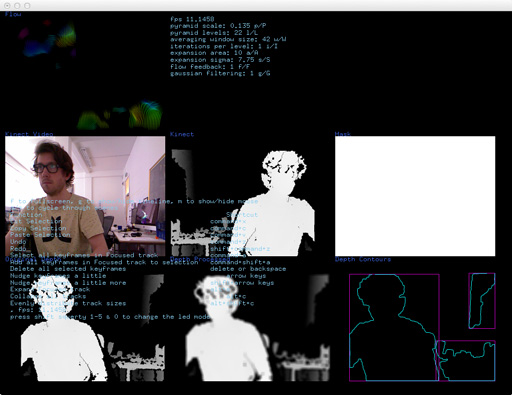

GUI displayed several program variables and image previews of various stages of Kinect image and blob outline processing.

Mode update:

```cpp
        case GUI: //GUI MODE
            break;

```

Mode draw:

```cpp
        case GUI: //image drawing mode
        {
            ofFill();
            ofSetColor(0);
            ofRect(0,0,ofGetWidth(),ofGetHeight()); //draw a black rectangle

            int imageOffSet = 10;
            int imageWidth = 320;
            int imageHeight = 240;
            int imageX = imageOffSet;

            // draw everything
            ofSetColor(ofColor::white);
            ofEnableAlphaBlending();
            flowSolver.drawColored(imageWidth, imageHeight, 10, 3);
            ofDisableAlphaBlending();
            ofSetColor(ofColor::royalBlue);
            ofDrawBitmapString("Flow", imageX, imageOffSet);
            ofSetColor(ofColor::white);
            colorImageRGB.draw(imageX, imageHeight+imageOffSet, imageWidth, imageHeight);
            //greyIRSingleChannel.draw(imageX, imageHeight+imageOffSet, imageWidth, imageHeight);
            ofSetColor(ofColor::royalBlue);
            ofDrawBitmapString("Kinect Video", imageX, imageHeight+imageOffSet);
            imageX += imageOffSet+imageWidth;
            ofSetColor(ofColor::white);
            kinect.drawDepth(imageX, imageHeight+imageOffSet, imageWidth, imageHeight);
            ofSetColor(ofColor::royalBlue);
            ofDrawBitmapString("Kinect", imageX, imageHeight+imageOffSet);
            imageX += imageOffSet+imageWidth;
            ofSetColor(ofColor::white);
            maskImage.draw(imageX,imageHeight+imageOffSet, imageWidth, imageHeight);
            ofSetColor(ofColor::royalBlue);
            ofDrawBitmapString("Mask", imageX, imageHeight+imageOffSet);
            imageX = imageOffSet;
            ofSetColor(ofColor::white);
            depthOrig.draw(imageX,imageHeight+imageOffSet+imageHeight+imageOffSet, imageWidth, imageHeight);
            ofSetColor(ofColor::royalBlue);
            ofDrawBitmapString("Original Depth", imageX, imageHeight+imageOffSet+imageHeight+imageOffSet);
            imageX += imageOffSet+imageWidth;
            ofSetColor(ofColor::white);
            depthProcessed.draw(imageX,imageHeight+imageOffSet+imageHeight+imageOffSet, imageWidth, imageHeight);
            ofSetColor(ofColor::royalBlue);
            ofDrawBitmapString("Depth Processed", imageX, imageHeight+imageOffSet+imageHeight+imageOffSet);
            imageX += imageOffSet+imageWidth;
            ofSetColor(ofColor::white);
            depthContours.draw(imageX, imageHeight+imageOffSet+imageHeight+imageOffSet, imageWidth, imageHeight);
            ofSetColor(ofColor::royalBlue);
            ofDrawBitmapString("Depth Contours", imageX, imageHeight+imageOffSet+imageHeight+imageOffSet);
            ofSetColor(ofColor::skyBlue);
            // draw instructions
            stringstream reportStream;
            reportStream
            << "f to fullscreen, g to show/hide timeline, m to show/hide mouse" << endl
            << "a/s to cycle through scenes" << endl
            << "Function	                                      Shortcut" << endl
            << "Cut Selection	                                  command+x" << endl
            << "Copy Selection	                                  command+c" << endl
            << "Paste Selection	                                  command+v" << endl
            << "Undo	                                          command+z" << endl
            << "Redo	                                          shift+command+z" << endl
            << "Select all keyframes in Focused track	          command+a" << endl
            << "Add all keyframes in Focused track to selection   command+shift+a" << endl
            << "Delete all selected keyframes	                  delete or backspace" << endl
            << "Nudge keyframes a little	                      arrow keys" << endl
            << "Nudge keyframes a little more	                  shift+arrow keys" << endl
            << "Expand Focused track	                          alt+e" << endl
            << "Collapse all tracks	                              alt+c" << endl
            << "Evenly distribute track sizes	                  alt+shift+c" << endl
            << ", fps: " << ofGetFrameRate() << endl
            << "press shift squerty 1-5 & 0 to change the led mode" << endl;
            ofDrawBitmapString(reportStream.str(),20,ofGetHeight()/2.f);

            stringstream m;
            m << "fps " << ofGetFrameRate() << endl
            << "pyramid scale: " << flowSolver.getPyramidScale() << " p/P" << endl
            << "pyramid levels: " << flowSolver.getPyramidLevels() << " l/L" << endl
            << "averaging window size: " << flowSolver.getWindowSize() << " w/W" << endl
            << "iterations per level: " << flowSolver.getIterationsPerLevel() << " i/I" << endl
            << "expansion area: " << flowSolver.getExpansionArea() << " a/A" << endl
            << "expansion sigma: " << flowSolver.getExpansionSigma() << " s/S" << endl
            << "flow feedback: " << flowSolver.getFlowFeedback() << " f/F" << endl
            << "gaussian filtering: " << flowSolver.getGaussianFiltering() << " g/G";

            ofDrawBitmapString(m.str(), 20+320, 20);
        }
            break;
```
#### VIDEO


Video mode displayed the current frame of the unprocessed video file.

Mode update:

```cpp
        case VIDEO:
            break;
```

Mode draw:

```cpp
        case VIDEO: //the film
            ofFill();
            ofSetColor(255);
            timeline.getVideoPlayer("video")->draw(0, 0, ofGetWidth(),ofGetHeight());
            break;
```
#### VIDEOCIRCLES

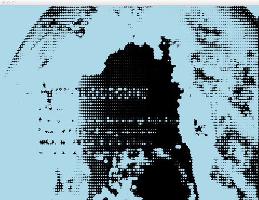

VideoCircles was a direct cut and paste from the `examples/video/osxHighPerformanceVideoPlayerExample`. This code was useful during initial development to discover the performance hit for individual pixel array access. A lot of my early development during projects is based around finding what the limits of various prospective coding functionality is - getting to a happy mix of performance and functionality.

Mode update:

```cpp
        case VIDEOCIRCLES: //the film as circles
            break;
```

Mode draw:

```cpp
        case VIDEOCIRCLES: //the film as circles
            {
                ofFill();
                ofSetColor(0);
                ofRect(0,0,ofGetWidth(),ofGetHeight()); //draw a black rectangle
                if (timeline.getVideoPlayer("video")->isLoaded()) {
                    unsigned char * pixels = timeline.getVideoPlayer("video")->getPixels();
                    ofPixelsRef pixelsRef = timeline.getVideoPlayer("video")->getPixelsRef();

                    // let's move through the "RGB(A)" char array
                    // using the red pixel to control the size of a circle.
                    //ofSetColor(timeline.getColor("colour"));
                    ofSetColor(ofColor::lightBlue);

                    float circleSpacing = 10.f;

                    float widthRatio = ofGetWidth()/timeline.getVideoPlayer("video")->getWidth();
                    float heightRatio = ofGetHeight()/timeline.getVideoPlayer("video")->getHeight();

                    for(int i = 0; i < timeline.getVideoPlayer("video")->getWidth(); i+= 8){
                        for(int j = 0; j < timeline.getVideoPlayer("video")->getHeight(); j+= 8){
                            ofColor pixelColor = timeline.getVideoPlayer("video")->getPixelsRef().getColor(i, j);
                            int b = pixelColor.b;
                            float val = 1 - ((float)b / 255.0f); //more blue in the arctic!
                            ofDrawCircle(i*widthRatio, j*heightRatio, circleSpacing * val);
                        }
                    }
                }
            }
            break;

```
#### KINECTPOINTCLOUD

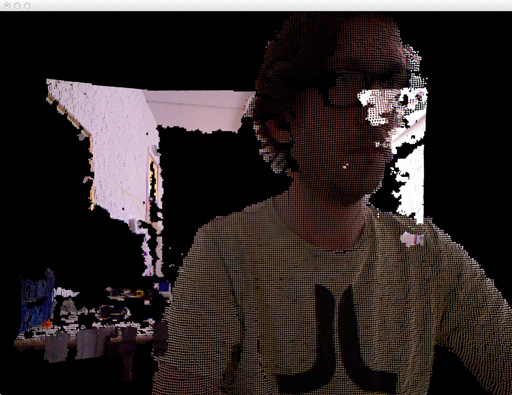

Another cut and paste from addon example code, this time from the now core `ofxKinect`.

Mode update:

```cpp
        case KINECTPOINTCLOUD: //draw the kinect camera depth cloud
            break;

```

Mode draw:

```cpp
        case KINECTPOINTCLOUD: //draw the kinect camera depth cloud
            easyCam.begin();
            drawPointCloud();
            easyCam.end();
            break;
```
#### SLITSCANBASIC


The most basic of the slitscan modes on this project - a direct port of example functionality in ofxSlitscan - but with the possibility of changing the slitscan PNG source file on the ofxTimeline GUI.

Mode update:

```cpp
        case SLITSCANBASIC: //slit scan the movie on the grey from the kinect depth grey
        {
            //check slit scan...
            int theCurrentSlitScan = timeline.getValue("slitscan");
            if(prevSlitScan != theCurrentSlitScan){
                slitScanSliderSlid(); //only update when you have to...
                prevSlitScan = theCurrentSlitScan;
            }

            if(timeline.getVideoPlayer("video")->isFrameNew()){
                slitScan.addImage(timeline.getVideoPlayer("video")->getPixelsRef());
            }
        }
            break;

```

Mode draw:

```cpp
        case SLITSCANBASIC: //slit scan the movie on depth png
            slitScan.getOutputImage().draw(0, 0, ofGetWidth(), ofGetHeight());

            //white fur
            ofEnableAlphaBlending();
            flowSolver.drawGrey(ofGetWidth(),ofGetHeight(), 10, 3);
            ofDisableAlphaBlending();

            break;
```
#### SLITSCANKINECTDEPTHGREY

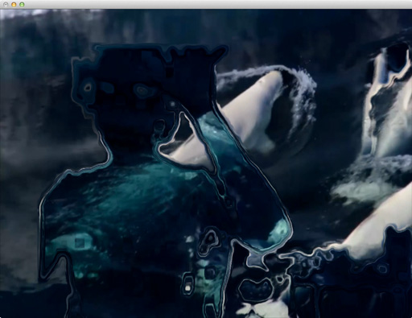

The most basic of novel slitscan modes developed for this project - feeding the Kinect depth image into ofxSlitscan on a per frame basis - once I realised this would still result in interactive frame rates I knew the project would succeed.

Mode update:

```cpp
        case SLITSCANKINECTDEPTHGREY: //slit scan the movie on the grey from the kinect depth grey
        {
            if(timeline.getVideoPlayer("video")->isFrameNew()){
                //kinect slitscan
                //depthPixels.setFromPixels(kinect.getDepthPixelsRef());
                depthPixels.setFromPixels(depthProcessed.getPixelsRef());
                depthPixels.resize(timeline.getVideoPlayer("video")->getWidth(), timeline.getVideoPlayer("video")->getHeight());
                //            slitScanDepthGrey.setDelayMap(depthPixels);
                //            slitScanDepthGrey.addImage(timeline.getVideoPlayer("video")->getPixelsRef());
                slitScan.setDelayMap(depthPixels);
                slitScan.addImage(timeline.getVideoPlayer("video")->getPixelsRef());
            }
        }
            break;

```

Mode draw:

```cpp
        case SLITSCANKINECTDEPTHGREY: //slit scan the movie on the grey from the kinect depth grey
            slitScan.getOutputImage().draw(0, 0, ofGetWidth(), ofGetHeight());
            //slitScanDepthGrey.getOutputImage().draw(0, 0, ofGetWidth(), ofGetHeight());
            break;

```
#### SPARKLE


An experiment with using previously developed Somantics functionality into ofxTimeline.

Mode update:

```cpp
        case SPARKLE: //sparkles on the slitscan
        {
            //update the sparkles come what may...
            someSparkles.update(&depthContours);
            someSparkles.draw(ofColor::white);
            //someSparkles.draw(timeline.getColor("colour"));

            ofImage distortionMap;
            distortionMap.allocate(someSparkles.theFBO.getWidth(), someSparkles.theFBO.getHeight(), OF_IMAGE_COLOR);

            someSparkles.theFBO.readToPixels(distortionMap.getPixelsRef());

            distortionMap.resize(timeline.getVideoPlayer("video")->getWidth(), timeline.getVideoPlayer("video")->getHeight());
            slitScan.setDelayMap(distortionMap);

            if(timeline.getVideoPlayer("video")->isFrameNew()){
                slitScan.addImage(timeline.getVideoPlayer("video")->getPixelsRef());
            }
        }
            break;

```

Mode draw:

```cpp
        case SPARKLE:
            //do some sparkles - used the slit scan to hold it....
            slitScan.getOutputImage().draw(0, 0, ofGetWidth(), ofGetHeight());
            //ofSetColor(255,255,255);
            //someSparkles.theFBO.draw(0, 0, ofGetWidth(), ofGetHeight());
            break;
```
#### VERTICALMIRROR

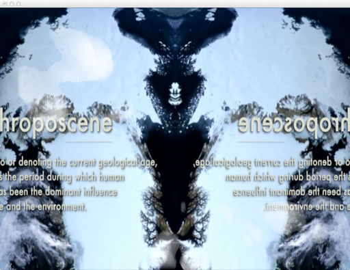

A vertical mirror on the video playback - again ported directly from Somantics.

Mode update:

```cpp
        case VERTICALMIRROR: //vertical mirror
        {
            if(timeline.getVideoPlayer("video")->isFrameNew()){
                verticalMirrorImage.setFromPixels(timeline.getVideoPlayer("video")->getPixels(), verticalMirrorImage.getWidth(), verticalMirrorImage.getHeight());

                verticalMirrorImage.updateTexture();
            }
        }
            break;
```

Mode draw:

```cpp
        case VERTICALMIRROR:
        {
            bool usingNormTexCoords = ofGetUsingNormalizedTexCoords();

            if(!usingNormTexCoords) {
                ofEnableNormalizedTexCoords();
            }

            verticalMirrorImage.getTextureReference().bind();

            ofMesh mesh;
            mesh.clear();
            mesh.addVertex(ofVec3f(0, 0));
            mesh.addVertex(ofVec3f(0, ofGetHeight()));
            mesh.addVertex(ofVec3f(ofGetWidth()/2, 0));
            mesh.addVertex(ofVec3f(ofGetWidth()/2, ofGetHeight()));
            mesh.addVertex(ofVec3f(ofGetWidth(), 0));
            mesh.addVertex(ofVec3f(ofGetWidth(), ofGetHeight()));


            mesh.addTexCoord(ofVec2f(0.25, 0.0));
            mesh.addTexCoord(ofVec2f(0.25, 1.0));
            mesh.addTexCoord(ofVec2f(0.75, 0.0));
            mesh.addTexCoord(ofVec2f(0.75, 1.0));
            mesh.addTexCoord(ofVec2f(0.25, 0.0));
            mesh.addTexCoord(ofVec2f(0.25, 1.0));

            mesh.setMode(OF_PRIMITIVE_TRIANGLE_STRIP);
            ofSetColor(ofColor::white);
            mesh.draw();

            verticalMirrorImage.getTextureReference().unbind();

            // pop normalized tex coords
            if(!usingNormTexCoords) {
                ofDisableNormalizedTexCoords();
            }

            //white fur
            ofEnableAlphaBlending();
            flowSolver.drawGrey(ofGetWidth(),ofGetHeight(), 10, 3);
            ofDisableAlphaBlending();
        }
            break;
```
#### HORIZONTALMIRROR

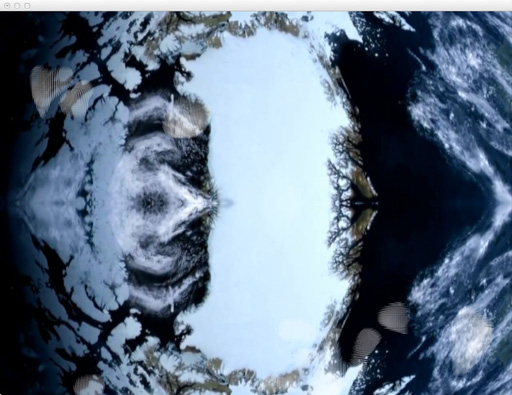

A horizontal mirror on the video playback - again ported directly from Somantics.

Mode update:

```cpp
        case HORIZONTALMIRROR: //HORIZONTALMIRROR mirror
        {
            if(timeline.getVideoPlayer("video")->isFrameNew()){
                horizontalMirrorImage.setFromPixels(timeline.getVideoPlayer("video")->getPixels(), horizontalMirrorImage.getWidth(), horizontalMirrorImage.getHeight());

                horizontalMirrorImage.updateTexture();
            }
        }
            break;
```

Mode draw:

```cpp
        case HORIZONTALMIRROR:
        {
            bool usingNormTexCoords = ofGetUsingNormalizedTexCoords();

            if(!usingNormTexCoords) {
                ofEnableNormalizedTexCoords();
            }

            horizontalMirrorImage.getTextureReference().bind();

            ofMesh mesh;
            mesh.clear();
            mesh.addVertex(ofVec3f(ofGetWidth(), 0));
            mesh.addVertex(ofVec3f(0, 0));
            mesh.addVertex(ofVec3f(ofGetWidth(), ofGetHeight()/2));
            mesh.addVertex(ofVec3f(0, ofGetHeight()/2));
            mesh.addVertex(ofVec3f(ofGetWidth(), ofGetHeight()));
            mesh.addVertex(ofVec3f(0,ofGetHeight()));

            mesh.addTexCoord(ofVec2f(1.0, 0.25));
            mesh.addTexCoord(ofVec2f(0.0, 0.25));
            mesh.addTexCoord(ofVec2f(1.0, 0.75));
            mesh.addTexCoord(ofVec2f(0.0, 0.75));
            mesh.addTexCoord(ofVec2f(1.0, 0.25));
            mesh.addTexCoord(ofVec2f(0.0, 0.25));

            mesh.setMode(OF_PRIMITIVE_TRIANGLE_STRIP);
            ofSetColor(ofColor::white);
            mesh.draw();

            horizontalMirrorImage.getTextureReference().unbind();

            // pop normalized tex coords
            if(!usingNormTexCoords) {
                ofDisableNormalizedTexCoords();
            }

            //white fur
            ofEnableAlphaBlending();
            flowSolver.drawGrey(ofGetWidth(),ofGetHeight(), 10, 3);
            ofDisableAlphaBlending();
        }
            break;
```
#### KALEIDOSCOPE

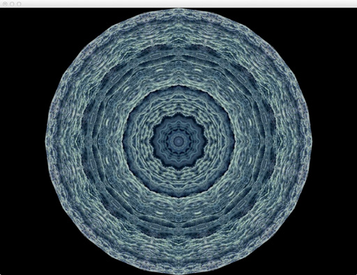

A Kaleidoscope mirror on the video playback - again ported directly from Somantics, using [Marek Bereza's](http://mazbox.com/) logic.

Mode update:

```cpp
        case KALEIDOSCOPE: //kaleidsocope
        {
            if(timeline.getVideoPlayer("video")->isFrameNew()){
                kaleidoscopeMirrorImage.setFromPixels(timeline.getVideoPlayer("video")->getPixels(), kaleidoscopeMirrorImage.getWidth(), kaleidoscopeMirrorImage.getHeight());

                kaleidoscopeMirrorImage.updateTexture();
            }
        }
            break;
```

Mode draw:

```cpp
        case KALEIDOSCOPE:
        {
            bool usingNormTexCoords = ofGetUsingNormalizedTexCoords();

            if(!usingNormTexCoords) {
                ofEnableNormalizedTexCoords();
            }

            kaleidoscopeMirrorImage.getTextureReference().bind();

            int star = ((int)timeline.getValue("star")*2);//8; //get star from the timeline gui, but multiply by 2 to get to always even
            float offset = timeline.getValue("offset");//0.5f; // get offset from the timeline gui
            float angle = 360.f/star; //8 sides to start


			ofMesh mesh;

			ofVec3f vec(0,0,0);
			mesh.addVertex(vec);
			vec.x += ofGetHeight()/2;

			for(int i = 0; i < star; i++) {
				mesh.addVertex(vec);
				vec.rotate(angle, ofVec3f(0,0,1));
			}

			// close the loop
			mesh.addVertex(vec);


			// now work out the texcoords
			/*
			 __________________
			 |   \        /   |
			 |    \      /    |
			 |     \    /     |
			 |      \  /      |
			 |       \/       |
			 +----------------+

			 A v shape out of the centre of the camera texture
			 */


			float realOffset = 0.5;
			// normalized distance from the centre (half the width of the above 'V')
			float dist = ABS((float)kaleidoscopeMirrorImage.getHeight()*tan(ofDegToRad(angle)*0.5))/(float)kaleidoscopeMirrorImage.getHeight();


			// the realOffset is where the (normalized) middle of the 'V' is on the x-axis
			realOffset = ofMap(offset, 0, 1, dist, 1-dist);


			// this is the point at the bottom of the triangle - our centre for the triangle fan
			mesh.addTexCoord(ofVec2f(realOffset, 1));


			ofVec2f ta(realOffset-dist, 0);
			ofVec2f tb(realOffset+dist, 0);
			for(int i = 0; i <= star; i++) {
				if(i%2==0) {
					mesh.addTexCoord(ta);
				} else {
					mesh.addTexCoord(tb);
				}
			}


			glPushMatrix();
			glTranslatef(ofGetWidth()/2, ofGetHeight()/2, 0);
			mesh.setMode(OF_PRIMITIVE_TRIANGLE_FAN);
			mesh.draw();
			glPopMatrix();

            kaleidoscopeMirrorImage.getTextureReference().unbind();

            // pop normalized tex coords
            if(!usingNormTexCoords) {
                ofDisableNormalizedTexCoords();
            }

            //white fur
            ofEnableAlphaBlending();
            flowSolver.drawGrey(ofGetWidth(),ofGetHeight(), 10, 3);
            ofDisableAlphaBlending();
        }
            break;

```
#### COLOURFUR

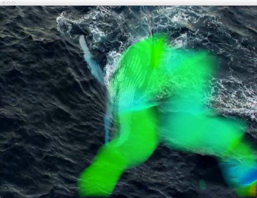

A direct port of [Tim Scaffidi's ofxOpticalFlowFarneback](https://github.com/timscaffidi/ofxOpticalFlowFarneback) demo code.

Mode update:

```cpp
        case COLOURFUR: //COLOURFUR
        {
        }
            break;
```

Mode draw:

```cpp

        case COLOURFUR:
        {
            ofSetColor(ofColor::white);
            timeline.getVideoPlayer("video")->draw(0, 0, ofGetWidth(),ofGetHeight());
            ofEnableAlphaBlending();
            flowSolver.drawColored(ofGetWidth(),ofGetHeight(), 10, 3);
            ofDisableAlphaBlending();
        }
            break;
```
#### DEPTH


A simple mode to display the depth image directly - useful for debugging when onsite.

Mode update:

```cpp
        case DEPTH: //DEPTH
        {
        }
```

Mode draw:

```cpp
        case DEPTH:
        {
            depthProcessed.draw(0,0,ofGetWidth(), ofGetHeight());
        }
            break;
```
#### SHATTER


A direct port of [Todd Vanderlin's](http://vanderlin.cc/projects/feedback/) code that he wrote for the Feedback project, but using it as live delay map input to the Slitscan.

Mode update:

```cpp
        case SHATTER:
        {
            //update the shatter
            theShatter.update(&depthContours);
            theShatter.draw(ofColor::white);

            ofImage distortionMap;
            distortionMap.allocate(theShatter.theFBO.getWidth(), theShatter.theFBO.getHeight(), OF_IMAGE_COLOR);

            theShatter.theFBO.readToPixels(distortionMap.getPixelsRef());

            distortionMap.resize(timeline.getVideoPlayer("video")->getWidth(), timeline.getVideoPlayer("video")->getHeight());
            slitScan.setDelayMap(distortionMap);

            if(timeline.getVideoPlayer("video")->isFrameNew()){
                slitScan.addImage(timeline.getVideoPlayer("video")->getPixelsRef());
            }
        }
            break;


```

Mode draw:

```cpp
        case SHATTER:
        {
            //do some shattering - used the slit scan to hold it....
            slitScan.getOutputImage().draw(0, 0, ofGetWidth(), ofGetHeight());
            //ofSetColor(255,255,255);
            //theShatter.theFBO.draw(0, 0, ofGetWidth(), ofGetHeight());
        }
            break;
```
#### SELFSLITSCAN

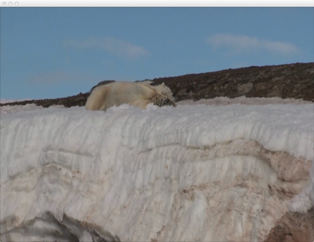

Feeding the greyscale image of the current film frame back into the SlitScan delay map made for some interesting feedback effects.

Mode update:

```cpp
        case SELFSLITSCAN:
        {
            if(timeline.getVideoPlayer("video")->isFrameNew()){
                //self slitscan
//                ofImage selfSlitScanDelayMap;
//                selfSlitScanDelayMap.allocate(timeline.getVideoPlayer("video")->getWidth(), timeline.getVideoPlayer("video")->getHeight(), OF_IMAGE_COLOR);
//                selfSlitScanDelayMap.setFromPixels(timeline.getVideoPlayer("video")->getPixelsRef());

                slitScan.setDelayMap(timeline.getVideoPlayer("video")->getPixelsRef());
                slitScan.addImage(timeline.getVideoPlayer("video")->getPixelsRef());
            }
        }
            break;
```

Mode draw:

```cpp
        case SELFSLITSCAN:
        {
            //do some SELFSLITSCAN - used the slit scan to hold it....
            ofSetColor(255,255,255);
            slitScan.getOutputImage().draw(0, 0, ofGetWidth(), ofGetHeight());
        }
            break;
```
#### SPIKYBLOBSLITSCAN


Feeding the Spiked blob outline back into the SlitScan delay map.

Mode update:

```cpp
        case SPIKYBLOBSLITSCAN:
        {
            //SPIKYBLOBSLITSCAN
            //update the spikes come what may...
            theSpikey.update(&depthContours);
            theSpikey.draw(ofColor::white);

            ofImage distortionMap;
            distortionMap.allocate(theSpikey.theFBO.getWidth(), theSpikey.theFBO.getHeight(), OF_IMAGE_COLOR);

            theSpikey.theFBO.readToPixels(distortionMap.getPixelsRef());

            distortionMap.resize(timeline.getVideoPlayer("video")->getWidth(), timeline.getVideoPlayer("video")->getHeight());
            slitScan.setDelayMap(distortionMap);

            if(timeline.getVideoPlayer("video")->isFrameNew()){
                slitScan.addImage(timeline.getVideoPlayer("video")->getPixelsRef());
            }
        }
```

Mode draw:

```cpp
        case SPIKYBLOBSLITSCAN:
        {
            //do some SPIKYBLOBSLITSCAN - used the slit scan to hold it....
            ofSetColor(255,255,255);
            slitScan.getOutputImage().draw(0, 0, ofGetWidth(), ofGetHeight());
            //theSpikey.theFBO.draw(0,0,ofGetWidth(), ofGetHeight());
        }
            break;
```
#### MIRRORKALEIDOSCOPE


Combining Mirror and Kaleidoscope modes.

Mode update:

```cpp
        case MIRRORKALEIDOSCOPE: //MIRRORKALEIDOSCOPE mirror
        {
            if(timeline.getVideoPlayer("video")->isFrameNew()){
                verticalMirrorImage.setFromPixels(timeline.getVideoPlayer("video")->getPixels(), verticalMirrorImage.getWidth(), verticalMirrorImage.getHeight());

                verticalMirrorImage.updateTexture();

                kaleidoscopeMirrorImage.setFromPixels(timeline.getVideoPlayer("video")->getPixels(), kaleidoscopeMirrorImage.getWidth(), kaleidoscopeMirrorImage.getHeight());

                kaleidoscopeMirrorImage.updateTexture();
            }
        }
            break;

```

Mode draw:

```cpp
        case MIRRORKALEIDOSCOPE:
        {
            bool usingNormTexCoords = ofGetUsingNormalizedTexCoords();

            if(!usingNormTexCoords) {
                ofEnableNormalizedTexCoords();
            }

            verticalMirrorImage.getTextureReference().bind();

            ofMesh mirrorMesh;
            mirrorMesh.clear();
            mirrorMesh.addVertex(ofVec3f(0, 0));
            mirrorMesh.addVertex(ofVec3f(0, ofGetHeight()));
            mirrorMesh.addVertex(ofVec3f(ofGetWidth()/2, 0));
            mirrorMesh.addVertex(ofVec3f(ofGetWidth()/2, ofGetHeight()));
            mirrorMesh.addVertex(ofVec3f(ofGetWidth(), 0));
            mirrorMesh.addVertex(ofVec3f(ofGetWidth(), ofGetHeight()));


            mirrorMesh.addTexCoord(ofVec2f(0.25, 0.0));
            mirrorMesh.addTexCoord(ofVec2f(0.25, 1.0));
            mirrorMesh.addTexCoord(ofVec2f(0.75, 0.0));
            mirrorMesh.addTexCoord(ofVec2f(0.75, 1.0));
            mirrorMesh.addTexCoord(ofVec2f(0.25, 0.0));
            mirrorMesh.addTexCoord(ofVec2f(0.25, 1.0));

            mirrorMesh.setMode(OF_PRIMITIVE_TRIANGLE_STRIP);
            ofSetColor(ofColor::white);
            mirrorMesh.draw();

            verticalMirrorImage.getTextureReference().unbind();

            kaleidoscopeMirrorImage.getTextureReference().bind();

            int star = ((int)timeline.getValue("star")*2);//8; //get star from the timeline gui, but multiply by 2 to get to always even
            float offset = timeline.getValue("offset");//0.5f; // get offset from the timeline gui
            float angle = 360.f/star; //8 sides to start

			ofMesh mesh;

			ofVec3f vec(0,0,0);
			mesh.addVertex(vec);
			vec.x += ofGetHeight()/2;

			for(int i = 0; i < star; i++) {
				mesh.addVertex(vec);
				vec.rotate(angle, ofVec3f(0,0,1));
			}

			// close the loop
			mesh.addVertex(vec);

			// now work out the texcoords
			/*
			 __________________
			 |   \        /   |
			 |    \      /    |
			 |     \    /     |
			 |      \  /      |
			 |       \/       |
			 +----------------+

			 A v shape out of the centre of the camera texture
			 */

			float realOffset = 0.5;
			// normalized distance from the centre (half the width of the above 'V')
			float dist = ABS((float)kaleidoscopeMirrorImage.getHeight()*tan(ofDegToRad(angle)*0.5))/(float)kaleidoscopeMirrorImage.getHeight();

			// the realOffset is where the (normalized) middle of the 'V' is on the x-axis
			realOffset = ofMap(offset, 0, 1, dist, 1-dist);

			// this is the point at the bottom of the triangle - our centre for the triangle fan
			mesh.addTexCoord(ofVec2f(realOffset, 1));

			ofVec2f ta(realOffset-dist, 0);
			ofVec2f tb(realOffset+dist, 0);
			for(int i = 0; i <= star; i++) {
				if(i%2==0) {
					mesh.addTexCoord(ta);
				} else {
					mesh.addTexCoord(tb);
				}
			}

			glPushMatrix();
			glTranslatef(ofGetWidth()/2, ofGetHeight()/2, 0);
			mesh.setMode(OF_PRIMITIVE_TRIANGLE_FAN);
			mesh.draw();
			glPopMatrix();

            kaleidoscopeMirrorImage.getTextureReference().unbind();

            // pop normalized tex coords
            if(!usingNormTexCoords) {
                ofDisableNormalizedTexCoords();
            }

            //white fur
            ofEnableAlphaBlending();
            flowSolver.drawGrey(ofGetWidth(),ofGetHeight(), 10, 3);
            ofDisableAlphaBlending();
        }
            break;
```
#### PARTICLES


Using Somantics particle functionality as a SlitScan delay map.

Mode update:

```cpp
        case PARTICLES:
        {
            //PARTICLES
            theParticles.update(&depthContours);
            theParticles.draw(ofColor::white);
            ofImage distortionMap;
            distortionMap.allocate(theParticles.theFBO.getWidth(), theParticles.theFBO.getHeight(), OF_IMAGE_COLOR);
            theParticles.theFBO.readToPixels(distortionMap.getPixelsRef());
            distortionMap.resize(timeline.getVideoPlayer("video")->getWidth(), timeline.getVideoPlayer("video")->getHeight());
            slitScan.setDelayMap(distortionMap);
            if(timeline.getVideoPlayer("video")->isFrameNew()){
                slitScan.addImage(timeline.getVideoPlayer("video")->getPixelsRef());
            }
        }
            break;
```

Mode draw:

```cpp
        case PARTICLES:
        {
            //do some PARTICLES - used the slit scan to hold it....
            ofSetColor(255,255,255);
            slitScan.getOutputImage().draw(0, 0, ofGetWidth(), ofGetHeight());
            //theParticles.theFBO.draw(0,0,ofGetWidth(), ofGetHeight());
        }
            break;
```
#### WHITEFUR

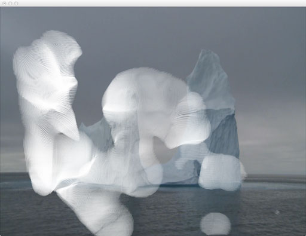

Turning the ofxOpticalFlowFarneback demo code, but making the graphical output monochrome.

Mode update:

```cpp
        case WHITEFUR: //WHITEFUR, nowt
        {
        }
            break;
```

Mode draw:

```cpp
        case WHITEFUR:
        {
            ofSetColor(ofColor::white);
            timeline.getVideoPlayer("video")->draw(0, 0, ofGetWidth(),ofGetHeight());
            ofEnableAlphaBlending();
            flowSolver.drawGrey(ofGetWidth(),ofGetHeight(), 10, 3);
            ofDisableAlphaBlending();
        }
            break;
```
#### PAINT


Porting the Paint mode from Somantics as a delay map.

Mode update:

```cpp
        case PAINT: //body painting diff
        {
            slitScan.setDelayMap(paintCanvasAsOfImage);
            if(timeline.getVideoPlayer("video")->isFrameNew()){
                slitScan.addImage(timeline.getVideoPlayer("video")->getPixelsRef());
            }
        }
            break;
```

Mode draw:

```cpp
        case PAINT:
        {
            //do some paint - used the slit scan to hold it....
            slitScan.getOutputImage().draw(0, 0, ofGetWidth(), ofGetHeight());
        }
            break;
```

## Appendix 3: Edited development notes

#### 29th May 2013

oF/of_v0.7.4_osx_release/apps/ofxKinect-demos

Also downloaded ofxKinect. Get gui working first, with ofxKinect, then start on:

* https://github.com/toruurakawa/ofxFakeMotionBlur
* Don't use, use jamezilla https://github.com/kylemcdonald/ofxBlur
* https://github.com/jamezilla/ofxBlurShader
* https://github.com/kylemcdonald/ofxCameraFilter
* https://github.com/vanderlin/ofxBox2d
* https://github.com/NickHardeman/ofxBullet
* https://github.com/fishkingsin/ofxPBOVideoPlayer
* https://github.com/arturoc/ofxPlaymodes
* Don't use, in core now https://github.com/Flightphase/ofxQTKitVideoPlayer
* https://github.com/after12am/ofxTLGlitch
* https://github.com/bakercp/ofxVideoBuffer
* https://github.com/bakercp/ofxVideoUtils
* https://github.com/obviousjim/ofxSlitScan

Doing gui - having to make the projectGenerator to make the projects, generating the examples now.... Recopy over examples after! Did it, just copying in the empty example xcode project, all in here now:

oF/of_v0.7.4_osx_release/examples/gui

Email of notes on development:

On 29 May 2013, at 20:44, Joel Gethin Lewis wrote:

* All ofFloatColor or ofFloatImages
* HSB blob shifts as a mode - crazy colours, also try whole image on slow change using ofmath demos
* Blobs cracking off
* Just blackness on blob
* Slit scan obvs
* ofxbox2d? Kinect demos? Look at memos
* Look at ofxaddons for time ones
* Use ofGui official one
* Have different GUI panes per constructor for ofxScenes (make that)

Think in addon way - indeed that every scene might have addons inside it. That's the way the should be. Addons inside scenes. Scenes are subclasses of ofxScene. Draw it out. Start with slitscan as first scene. Just get that working then use that as basis for ofxScene. Pragmatic! Will need central image creator as input for each scene. Kinect in this case. Don't worry about that for now.

ofparameter is missing! Looking at old OF folder from other project: openFrameworks-develop/apps/devApps/projectGenerator, looking in there in the oF project to try to find what is going on...

openFrameworks-develop/libs/openFrameworks/types contains:

* ofBaseTypes.cpp
* ofBaseTypes.h
* ofColor.cpp
* ofColor.h
* ofParameter.cpp
* ofParameter.h
* ofParameterGroup.cpp
* ofParameterGroup.h
* ofPoint.cpp
* ofPoint.h
* ofRectangle.cpp
* ofRectangle.h
* ofTypes.h

looking for ofpanel

openFrameworks-develop/addons/ofxGui/src

is where it is...opening:

oF/of_v0.7.4_osx_release/examples/gui/guiExample

again, just trying to add it in, in the addon... Nooo thats bad.. should use the develop version... space is low...now working here:

oF/openFrameworks-develop/apps/devApps/projectGenerator

trying to build that and run it, had to select the root oF folder, it was defaulting to a weird one, so selected:

oF/openFrameworks-develop

seems to be working, leaving it for a bit...

error ofFile::copyFromTo source file/folder doesn't exist: oF/openFrameworks-develop/scripts/osx/template/emptyExample.xcodeproj/xcshareddata/WorkspaceSettings.xcsettings

is the error....it's correct:

oF/openFrameworks-develop/scripts/osx/template/emptyExample.xcodeproj/xcshareddata

doesn't have it

openFrameworks-develop/apps/devApps/projectGenerator/bin/data/xcode/template/emptyExample.xcodeproj/xcshareddata

copied that in, and another file inside

openFrameworks-develop/apps/devApps/projectGenerator/bin/data/xcode/template/emptyExample.xcodeproj/xcshareddata/xcschemes

xcschememanagement.plist

as well...so trying to generate again...seems to be working now......won't paste in the log! (-; trying this now...

oF/openFrameworks-develop/examples/gui/guiExample

nice!

oF/openFrameworks-develop/examples/gui/guiFromParametersExample

next - not that interesting...

oscParametersReceiver
oscParametersSender

together... Neat demo! synchronised gui controls....both crash on exit

sender:

```cpp

void ofApp::setup(){
	parameters.setName("parameters");
	parameters.add(size.set("size",10,1,100));
	parameters.add(number.set("number",10,1,100));
	parameters.add(check.set("check",false));
	parameters.add(color.set("color",ofColor(127),ofColor(0,0),ofColor(255)));
	gui.setup(parameters);
	// by now needs to pass the gui parameter groups since the panel internally creates it's own group
	sync.setup((ofParameterGroup&)gui.getParameter(),6667,"localhost",6666);
	ofSetVerticalSync(true);
}

void ofApp::update(){
	sync.update();
}

```

receiver:

```cpp

void ofApp::setup(){
	parameters.setName("parameters");
	parameters.add(size.set("size",10,0,100));
	parameters.add(number.set("number",10,0,100));
	parameters.add(check.set("check",false));
	parameters.add(color.set("color",ofColor(127),ofColor(0,0),ofColor(255)));
	gui.setup(parameters);
	// by now needs to pass the gui parameter groups since the panel internally creates it's own group
	sync.setup((ofParameterGroup&)gui.getParameter(),6666,"localhost",6667);
	ofSetVerticalSync(true);
}

void ofApp::update(){
	sync.update();
}

void ofApp::draw(){
	gui.draw();
	ofSetColor(color);
	for(int i=0;i<number;i++){
		ofDrawCircle(ofGetWidth()*.5-size*((number-1)*0.5-i), ofGetHeight()*.5, size);
	}
}

```

subtle difference in port lines in sync setups...

oF/openFrameworks-develop/examples/gui/parameterEdgeCasesExample

doesn't work...

oF/openFrameworks-develop/examples/gui/parameterGroupExample

Is very intersting - two renderers running at once! Only thing missing is multiple parameters, and images being drawn? could always do that with bools, and the images being displayed on top, sliders and the like could work with that too... Moving big greenpeace video into:

oF/openFrameworks-develop/examples/video/osxHighPerformanceVideoPlayerExample/bin/data/movies

to save space, rather than copying!

oF/openFrameworks-develop/examples/video/osxHighPerformanceVideoPlayerExample

Trying this now...builds with standard movie file in demo, fingers.mov. Now trying, Greenpeace.m4v - works great! audio back too...and pixel access! MOVED video file out of the folder for safety..

copied in this:

oF/openFrameworks-develop/apps/ofxKinect-demos

trying normal ofxKinect first...

oF/openFrameworks-develop/addons/ofxKinect
oF/openFrameworks-develop/addons/ofxKinect/example

trying that... works fine, with motor and everything...so making a mega mix up of:

ofxKinect, ofxGUI and ofHighPerformanceVideo demo

oF/openFrameworks-develop/apps/HAndLGreenpeace/001fromofxKinectExampleAndofxGUI/bin/data/movies

copied that in, changed name to:

oF/openFrameworks-develop/apps/HAndLGreenpeace/001fromofxKinectExampleAndofxGUIAndHighPerformanceVideo

oF/openFrameworks-develop/examples/video/osxHighPerformanceVideoPlayerExample
oF/openFrameworks-develop/examples/gui/guiExample

copying over gui data...that works with gui.. now lets try with high performance video...all works! nice debug screen! saved it out to making of....

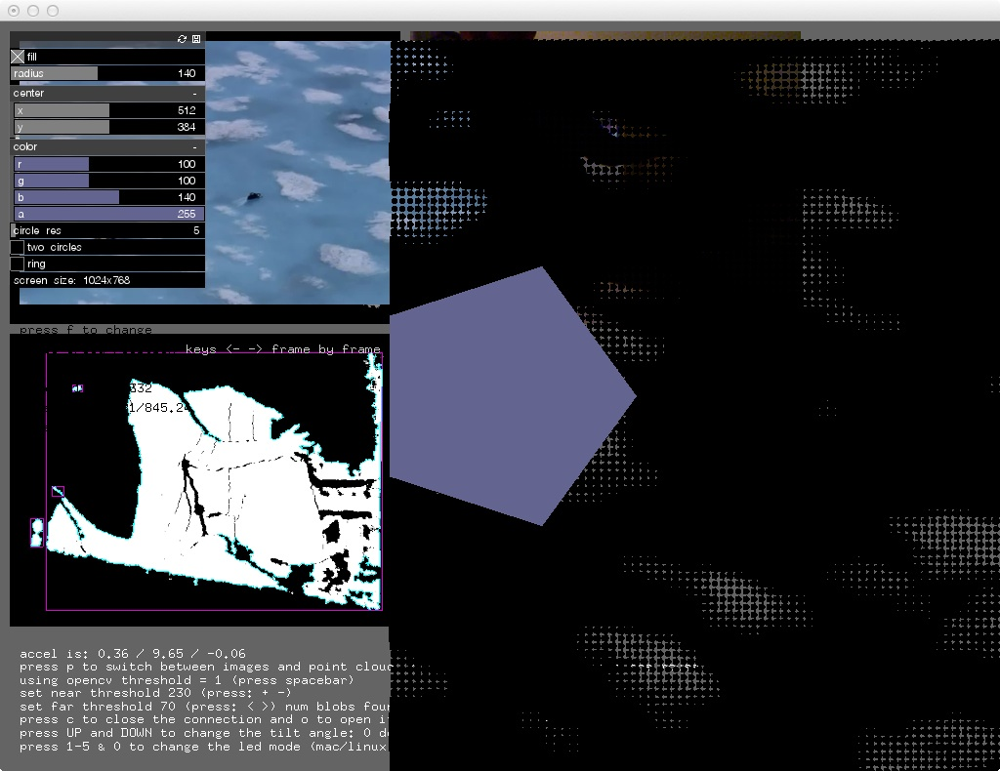

#### 30th May 2013

Doing modes, tidying up gui, need to do more on gui tidy up and keys. Made:

oF/openFrameworks-develop/apps/HAndLGreenpeace/002FirstModesAndSlitScan

Builds (-; Pixel drawing is messed up, checking the original high perf demo. Recoded nicely with bits that made sense and were easier to understand...now slitsan! fixed a few gui bugs...

oF/openFrameworks-develop/addons/ofxSlitScan

Made that... Image is PNG RGB for slitscan delay map, so kinect depth map is good for that... right? (-; lucky birthday boy! works great...did grab..


#### 31st May 2013

Showed Pete, performance better on his laptop, no optimisation yet, tried out some maps with bafic...

#### 6th June 2013

First lets do GUI that corresponds to big maps, so we can switch between them... Duplicating multicoloured magic into the folder, so got all that lovely code to work with.. After lunch lets look at mirror Somantics code... Too complicated for now, need some time to sit down and make it work... For now on the Virgin SA flight, lets try some of the addons!

ofxBlur By Kyle McDonald
had to add accelerate, qtkit and corevideo frameworks to make it work..

ofxBlurShader
This is a very lightly refactored version of Kyle McDonald's ofBlur example (https://github.com/kylemcdonald/SubdivisionOfRoam/tree/master/GaussianBlur). It hasbeen updated to OF 007.
Didn't build!

ofxBox2d
trying every example:

* oF/openFrameworks-develop/addons/ofxBox2d/ComplexPolgonExample - useful for making shatter like effects - how do I texture them?
* oF/openFrameworks-develop/addons/ofxBox2d/ContactListenerExample - useful for tiggering audio samples on ofxBox2D interactions
* oF/openFrameworks-develop/addons/ofxBox2d/CustomDataExample - useful for storing data withing objects, nothing particularly useful there for us at the moment..
* oF/openFrameworks-develop/addons/ofxBox2d/ForcesExample - bunch of forces on mouse action
* oF/openFrameworks-develop/addons/ofxBox2d/JointExample -long chain of pieces
* oF/openFrameworks-develop/addons/ofxBox2d/ofxBox2dExample - line that you can draw and lots of various shapes
* oF/openFrameworks-develop/addons/ofxBox2d/PolygonExample - more line drawing...
* oF/openFrameworks-develop/addons/ofxBox2d/SimpleExample - simple!

ofxBullet

* oF/openFrameworks-develop/addons/ofxBullet/SimpleExample - is simple, several different basic shapes...
* oF/openFrameworks-develop/addons/ofxBullet/CustomShapesExample - needs ofxAssimpMeshHelper - that is in the assimp model loader addon... cool - very fast simulation and * loading of custom shapes - perhaps pete could make custom 3D shapes?
* oF/openFrameworks-develop/addons/ofxBullet/EventsExample - smashing of objects into each other, mouse animation of objects within cube
* oF/openFrameworks-develop/addons/ofxBullet/JointsExample - has long chain of shapes, similar to ofxbox2d example...

ofxCameraFilter

* oF/openFrameworks-develop/addons/ofxCameraFilter/example-graphics - simple camera effects on some rotating shapes, aberation and the like...
* oF/openFrameworks-develop/addons/ofxCameraFilter/example-live - does the same but live, and with an interesting use of an ofMesh

ofxFakeMotionBlur

* oF/openFrameworks-develop/addons/ofxFakeMotionBlur/example - no work

ofxPBOVideoPlayer

* oF/openFrameworks-develop/addons/ofxPBOVideoPlayer/example - seems speedy

ofxPlaymodes

* oF/openFrameworks-develop/addons/ofxPlaymodes/example-pmAV - needs more addons, come back to this..

ofxTLGlitch

* trying oF/openFrameworks-develop/addons/ofxVideoBuffer/example-multi-tap - had to add empty example, couldn't get building....

DONE addon off....

#### 12th June 2013

Greenpeace logos look nice as slit scans! saved all graphics and fonts into:

2013_06_12_Font
2013_06_12_GreenpeaceLogos

Pete gave me new audio and the film for working with duration

#### 13th June 2013

Duration demo is up from James George too:

* Posted demo code from Duration.cc demo github.com/obviousjim/Dur… cc @JGL

got that, put it here:

2013_06_13_obviousJimAudioReactiveRing

and copied into:

OF/openFrameworks-develop/apps/jamesGeorgeDurationDemo/DurationAudioReactiveRing-master

made:

Duration_004_OSX
Duration_004_OSX.zip
durationData

too.. The readme sez:

```

Duration: Timeline for Creative Code Demonstration

Code used in the demo of Duration:
http://vimeo.com/59654979

Requires ofxRange and ofxDuration
https://github.com/YCAMInterlab/ofxDuration
https://github.com/Flightphase/ofxRange

Download Duration
http://www.duration.cc/ // https://github.com/YCAMInterlab/Duration

Supported by YCAM InterLab Guest Research Project 2012

```

Getting those.. put in here:

2013_06_13_MoreDurationBits

ofxRange-master.zip
ofxDuration-master.zip

trying this first

OF/openFrameworks-develop/addons/ofxDuration/example-simpleReceiver

totally did it, totally worked - have to show Pete Hellicar it tomorrow, and disuss which controls he wants...made a new track:

Duration/durationData/FirstTry

audio all loaded in fine (-; need to test with film sync, see if that works OK.. try to set the movie time on each frame? will it fuck everything? Basically should make a new version of the app:

OF/openFrameworks-develop/apps/HAndLGreenpeace/003WithOFXDuration

Added:

GUI
SimpleReceiverPort.txt

to data folder too...need to compare with: OF/openFrameworks-develop/addons/ofxDuration/example-simpleReceiver and duplicate the functionality - start with scene control and colour....

MORNING TIME

OF/openFrameworks-develop/addons/ofxDuration/example-simpleReceiver

opening that and taking the functionality over...

```cpp

ofxDurationTrack sceneTrack = duration.getTrack("/scene");
string currentScene = sceneTrack.flag;

if(currentScene == "VIDEO"){
    currentMode = VIDEO;
}

if(currentScene == "SLITSCANBASIC"){
    currentMode = SLITSCANBASIC;
}

```

totally works!

#### 16th June 2013

Lets try the video syncing over osc.. Didn't seem to work with:

```cpp
float remoteTime = sceneTrack.lastUpdatedTime;
cout << "Remote time is:" << remoteTime << endl
float totalLengthOfVideo = greenpeaceVideo.getDuration();
float percentToSeekTo = remoteTime/totalLengthOfVideo;
greenpeaceVideo.setPosition(percentToSeekTo);
```

Hmmm. Sent this to james and got a response:

On 16 Jun 2013, at 19:00, James George wrote: yea it's impossible to call setPosition on a video every frame and have it playback smoothly. Quicktime needs to control its own time. Try this: play the video back normally in openframeworks and then update Duration every frame based on it's position:

```
https://github.com/YCAMInterlab/Duration#controlling-duration-through-osc

Specifically make sure Duration has its incoming OSC port set and from OF send it a /duration/seektosecond. Get the seconds from the video player.getPosition()*player.getDuration() then create an outgoing OSC message directed at Duration:

Seek	/duration/seektosecond	Second (Float)	 Sets playhead position to the specified second
Sending the /seektosecond message will then trigger an update to come back from Duration to your app and update all the other params.
```

On Sun, Jun 16, 2013 at 1:49 PM, Joel Gethin Lewis wrote: Hey James, I've been trying to get a Duration app to be able to sync the video playback on an OF app - I used your example and have started trying to sync to the time from a track:

```cpp
ofxDurationTrack sceneTrack = duration.getTrack("/scene");
string currentScene = sceneTrack.flag;
float remoteTime = sceneTrack.lastUpdatedTime;
cout << "Remote time is:" << remoteTime << endl;
float totalLengthOfVideo = greenpeaceVideo.getDuration();
cout << "totalLengthOfVideo time is:" << totalLengthOfVideo << endl;
float percentToSeekTo = remoteTime/totalLengthOfVideo;
cout << "percentToSeekTo time is:" << percentToSeekTo << endl;
greenpeaceVideo.setPosition(percentToSeekTo);
```

But it results in stuttering, playback - do you have any tips? How often are the control packets sent? Should I be getting the remote time in a better way? Cheers, Joel

looking at:

https://github.com/YCAMInterlab/Duration#controlling-duration-through-osc

/duration/seektosecond

Is what we want...so need to setup osc, trying to get that working with a simple sender, having problems gaining control from the OF app. Sent this:

On 16 Jun 2013, at 20:48, Joel Gethin Lewis wrote: Hey James, Thanks! It kind of works, but not really. I have my app jumping around it's video when I press t:

```cpp
case 't':
{
   float newseekposition = (float)mouseX/(float)ofGetWidth();
   ofClamp(newseekposition, 0.f, 1.f); //safety
   greenpeaceVideo.setPosition(newseekposition);
   cout << "New seek position is: " << newseekposition << endl;
}
```

If the Duration app is set to paused, it updates fine, the playhead moving around when I press T in my app- but I don't get the messages back from Duration! If it isn't paused (the duration app), I get the messages, but I can't move the Duration playhead around with the above messages! Catch 22? What should I do? I want to get the messages back, have it be playing on both ends and be able to seek. At the moment, I can have seeking in my app and Duration, but without messages back. Or messages back, without seeking.

Sending the /seektosecond message will then trigger an update to come back from Duration to your app and update all the other params.

Doesn't seem to be happening? Two little Duration suggestions:

1) Shouldn't ofxDuration have a send to DurationApp method? That would be useful, no? Auto osc.
2) Can I mute the audio of the Duration app in its GUI?

Any thoughts gratefully recieved. Ideally, I'd like either side to be Master if it sends messages to the other. Make sense? My app the true master, but seeking to Quicktime if it gets an occasional timeline change from the Duration app - but how to do that only some of the time? Cheers, Joel

Made new osc send:

On 16 Jun 2013, at 20:51, Joel Gethin Lewis wrote: This is my send, in my update:

```cpp
//update duration based on the position of the quicktime player
float videoTimeToSend = greenpeaceVideo.getPosition()*greenpeaceVideo.getDuration();
ofxOscMessage m;
m.setAddress("/duration/seektosecond");
m.addFloatArg(videoTimeToSend);
senderToDuration.sendMessage(m);
```

Got this reply back, and replied:

On 16 Jun 2013, at 21:07, Joel Gethin Lewis wrote: Hey James, I'll take a look. BUT! Looking at this video:

https://vimeo.com/59653952

It looks like I might be better off doing everything in a single OF app. What do you think? Do you think my massive video file (785,526,769 bytes (785.5 MB on disk)) will kill your thumbnail maker? Lets see...Cheers, Joel

On 16 Jun 2013, at 20:53, James George wrote:

Huh! Duration should definitely update when you move the playhead even if it's not playing... Definitely a bug. Must be a bug in the way seektosecond works. This may be a rabbit hole, but try downloading the source from the Duration website (its the entire OF bundle) and see if you can give it a look. it's probalby a simple change to make sure that handleOscOut() works even when it's not playing.

Watched that video above, did this:

jglmacbookprocore2:addons joel$ git clone https://github.com/YCAMInterlab/ofxTimeline.git

Trying:

OF/openFrameworks-develop/addons/ofxTimeline/example-videoRenderer

Worked...tried:

OF/openFrameworks-develop/apps/tryingBigVideoIntoOfxTimeline/example-allTracks

Totally worked! OK - so need to get audio file and video files separately... autosaves...... apple z for undo even works!

#### 17th June 2013

On 17 Jun 2013, at 00:12, James George wrote: the video player posted on the oF list is really nice, but it doesn't support the getCurrentFrame() command which may cause some issues. give it a shot!
On Sun, Jun 16, 2013 at 5:02 PM, Joel Gethin Lewis wrote: IT TOTALLY ROCKS! It totally works with the thumbnailer. Great work. I am going to code it up as a pure OF app, with maybe a little OSC Remote. Did you see the discussion about the new OSX high performance video player? How gnarly is the hookup to the ofVideoPlayer? I just glanced at the code and it didn't seem too bad.. AMAZING. Cheers, Joel
On Sun, 16 Jun 2013, at 21:26, James George wrote: that's me in the video btw ;)
On Sun, Jun 16, 2013 at 4:26 PM, James George wrote: no it'll be fine, the thumbnails generator is really light, it pulls only as it needs. you can also disable it.

Need to decide on the different modes - and do a mirror mode and a proper sparkles mode with direction.. First off, make a new version, with everything in it and timeline and duration stripped out...RIGHT! made this:

OF/openFrameworks-develop/apps/HAndLGreenpeace/004BuiltInOfxTimeLine

All working nice for demo, need to re-add GUI elements for showing and hiding etc... did it on mouse hide... works great with the slitscan control on too...So next, it's really time to do effects...mirror first.. add an x variable for the point....

#### 18th June 2013

doing sparkles first: copied over:

/Users/joel/Documents/Projects/HellicarAndLewis/greenpeaceArcticGlastonbury2013/OF/openFrameworks-develop/apps/HAndLGreenpeace/004BuiltInOfxTimeLine/bin/data/particles

* blob.png
* glitter.png
* sparkle.png
* star.png

as the images for the particles

https://github.com/HellicarAndLewis/MulticolouredMagic/blob/master/Somantics/src/somantics/Sparkles/Sparkles.cpp

Do this with the depth image as input to the blob tracker - or the IR image?

Get all three modes working first, then have a think about how to get them working as MODES - make a mode object? Look at somantics for how to have scenes. Maybe call it a mode? Construct with a pointer to the test app for easier data steal. Have a vector of things. Just making sparkles for now, made a sparkle cloud, duplicated the spartkcles logic from marekes sparkles from somantics - the one that spawns along the edges of the blobs... great way of doing it! Going to need an FBO to draw the Sparkles into, so looking at:

/Users/joel/Documents/Projects/HellicarAndLewis/greenpeaceArcticGlastonbury2013/OF/openFrameworks-develop/examples/gl/fboTrailsExample

Lets make it first, then do a InstallationMode object, based on what Sparkles actually needed. tightly coupling into ofApp at the moment with a passed pointer, but whatever works for now...Compilation problems, forward declaration because of pointers to ofApp...

http://stephanschulz.ca/downloads/singleton.zip

had a look, from :

http://forum.openframeworks.cc/index.php/topic,12466.msg54372.html#msg54372

the first one i found was about singletons which allows you to have global variables that can be accessed by all classes; i.e. all .cpp files. Bollocks to singletons... bad for test app, decoupled...trying to get the FBO to play nicely with the slitscan and the sparkles

FBO->SLITSCAN is working:

RGB fbo!
```cpp
ofImage distortionMap;
distortionMap.allocate(someSparkles.theFBO.getWidth(), someSparkles.theFBO.getHeight(), OF_IMAGE_COLOR);
someSparkles.theFBO.readToPixels(distortionMap.getPixelsRef());
distortionMap.resize(timeline.getVideoPlayer("video")->getWidth(), timeline.getVideoPlayer("video")->getHeight());
slitScan.setDelayMap(distortionMap);
```

setup:
```cpp
theFBO.allocate(aWidth, aHeight, GL_RGB);
```

draw:
```cpp
theFBO.begin();
ofSetColor(ofColor::black);
ofRect(0,0,theFBO.getWidth(), theFBO.getHeight());
ofSetColor(ofColor::white);
float circleX = theFBO.getWidth()/2.f;
float circleY = theFBO.getHeight()/2.f;
float circleRadius = min(circleX, circleY);
ofDrawCircle(circleX,circleY, circleRadius);
theFBO.end();
```

So the bug is currently with how the cloud of sparkles is being drawn - is the contour finder being read properly? I'm trying to draw at:581814,23197.4, at size:13.0935 is where things were trying to draw! co-ordinates must be in pixels inside the contour tracker! dumb......sorted it with:

```cpp
void Sparkles::update(ofxCvContourFinder* aContourFinder){
	float cloudWidth = theFBO.getWidth();
	float cloudHeight = theFBO.getHeight();

	float contourWidth = aContourFinder->getWidth();
	float contourHeight = aContourFinder->getHeight();

	float widthRatio = cloudWidth/contourWidth;
	float heightRatio = cloudHeight/contourHeight;

	// now just stick some particles on the contour and emit them randomly
	for(int i = 0; i < aContourFinder->nBlobs; i++) {
	    int step = 10;//contourFinder.blobs[i].pts.size()/10;
	    for(int j = 0; j < aContourFinder->blobs[i].pts.size(); j+=step) {
	        cloud.spawn(
	                (aContourFinder->blobs[i].pts[j].x)*widthRatio,
	                (aContourFinder->blobs[i].pts[j].y)*heightRatio,
	                ofRandom(-5, 5), ofRandom(-5, 5));
	    }
	}
}
```

OK that works

SECOND:

On 17 Jun 2013, at 19:01, Joel Gethin Lewis wrote: This is the mirror: https://github.com/HellicarAndLewis/MulticolouredMagic/blob/master/Somantics/src/somantics/Mirror/Mirror.cpp
Just do a vertical scene and a horizontal scene for now - kaledscope later...DONE... just the vertical one for now...

THIRD:

Paint as a slitscan input. Lets do paint! it's fun... - it is fun! It looks nice....DONE
Quick optimisation - why are both slitscans done separately? Changed it, all seems fine.
BUG: when switching to slitscan basic from sparkles, you don't get any update of the slitscan image, but it works initially...dirty hack to make work - change prevslitscan to -1 if it's not slitscan basic mode...

OK next! sleep...

#### 20th June 2013

FOURTH:

Use the blobs from the depth image - make a bunch of triangles in box2d as greyscale image that floats up and ADD that to slitscan...dropped in box2d, all working ok:
OF/openFrameworks-develop/apps/HAndLGreenpeace/006AddingOFXBox2D
bit slow, need to look at optimising...

#### 21st June 2013

grabbing some addons:

* https://github.com/maxillacult/ofxPostGlitch
* https://github.com/outsidecontext/ofxPSLevels
* https://github.com/neilmendoza/ofxPostProcessing - http://www.neilmendoza.com/ofxpostprocessing/
* https://github.com/julapy/ofxOpticalFlowLK
* https://github.com/timscaffidi/ofxOpticalFlowFarneback
* https://github.com/Flightphase/ofxCvOpticalFlowLK

doing a quick look at them before supper.... lazy! look at in the morning....the next evening! ok addons first....

doing this:

ofxCvOpticalFlowLK - no readme, no draw, moving on - could use the draw image into an FBO easily

ofxOpticalFlowFarneback - OF/openFrameworks-develop/apps/bunchOfAddonsTrying/ofxOpticalFlowFarneback
looks beautiful! definitely develop this one post stripped down version.... easy conversion to greyscale for the coloured one

ofxOpticalFlowLK - OF/openFrameworks-develop/apps/bunchOfAddonsTrying/ofxOpticalFlowLK
similar look to ofxOpticalFlowFarneback but not as pretty, use the other...

ofxPostGlitch - OF/openFrameworks-develop/apps/bunchOfAddonsTrying/ofxPostGlitch
lots of fun effects and already in an FBO! just do these effects on either the live video OR the depth image, but put into the slitscan

ofxPostProcessing
3D demo, with
```cpp
post.createPass<FxaaPass>()->setEnabled(false);
post.createPass<BloomPass>()->setEnabled(false);
post.createPass<DofPass>()->setEnabled(false);
post.createPass<KaleidoscopePass>()->setEnabled(false);
post.createPass<NoiseWarpPass>()->setEnabled(false);
post.createPass<PixelatePass>()->setEnabled(false);
post.createPass<EdgePass>()->setEnabled(false);
```
nice, but all in 3D - doing a quick hack to draw the video grabber in the scene. No, couldn't get it working, need to draw it to a texture and draw in space, no thank you...

ofxPSLevels

```cpp
s += "\nbrightness (b/B) : " + ofToString(levels.brightness);
s += "\ncontrast (c/C) : " + ofToString(levels.contrast);
s += "\nsaturation (s/S) : " + ofToString(levels.saturation);
s += "\ngamma (g/G) : " + ofToString(levels.gamma);
```

nice to have this as a post effect for everything.

OK, lets get on with the other direction mirror AND the kaleidoscope..... should be relatively straight forward, just drop in for now. get rid of box2d?

taking out ofxbox2d - that;s better, but why is just video playback so slow? Having a look now... optimised the video only draw section...Still not fast, do it through the fucking still scan with the image that does nothing....taking out colour.....made a few more slitscans...

* ALLBLACK.png
* ALLWHITE.png
* NOHelvetica.png
* Rewind.png
* YesGillSans.png

left in bangs..turned on snapping...they look ok, can work on these...working on horizontal mirror, made notes, did it not quite right...

This is wrong:

```cpp
case SLIGHTLY BUGGERED RERVERSED VERTICAL MIRROR:
{
    ofxCvColorImage mirrorImage;
    mirrorImage.allocate(timeline.getVideoPlayer("video")->getWidth(), timeline.getVideoPlayer("video")->getHeight());
    mirrorImage.setFromPixels(timeline.getVideoPlayer("video")->getPixels(), mirrorImage.getWidth(), mirrorImage.getHeight());
    mirrorImage.updateTexture();
    bool usingNormTexCoords = ofGetUsingNormalizedTexCoords();

    if(!usingNormTexCoords) {
        ofEnableNormalizedTexCoords();
    }

    mirrorImage.getTextureReference().bind();

    ofMesh mesh;
    mesh.clear();
    mesh.addVertex(ofVec3f(0, 0));
    mesh.addVertex(ofVec3f(0, ofGetHeight()));
    mesh.addVertex(ofVec3f(ofGetWidth()/2, 0));
    mesh.addVertex(ofVec3f(ofGetWidth()/2, ofGetHeight()));
    mesh.addVertex(ofVec3f(ofGetWidth(), 0));
    mesh.addVertex(ofVec3f(ofGetWidth(), ofGetHeight()));
    mesh.addTexCoord(ofVec2f(0, 0.25));
    mesh.addTexCoord(ofVec2f(0, 0.75));
    mesh.addTexCoord(ofVec2f(1.0, 0.25));
    mesh.addTexCoord(ofVec2f(1.0, 0.75));
    mesh.addTexCoord(ofVec2f(0, 0.25));
    mesh.addTexCoord(ofVec2f(0, 0.75));
    mesh.setMode(OF_PRIMITIVE_TRIANGLE_STRIP);
    ofSetColor(ofColor::white);
    mesh.draw();

    mirrorImage.getTextureReference().unbind();

    // pop normalized tex coords
    if(!usingNormTexCoords) {
        ofDisableNormalizedTexCoords();
    }
    break;
}
```

This is right

```cpp
case HORIZONTALMIRROR:
{
    ofxCvColorImage mirrorImage;

    mirrorImage.allocate(timeline.getVideoPlayer("video")->getWidth(), timeline.getVideoPlayer("video")->getHeight());
    mirrorImage.setFromPixels(timeline.getVideoPlayer("video")->getPixels(), mirrorImage.getWidth(), mirrorImage.getHeight());
    mirrorImage.updateTexture();

    bool usingNormTexCoords = ofGetUsingNormalizedTexCoords();
    if(!usingNormTexCoords) {
        ofEnableNormalizedTexCoords();
    }

    mirrorImage.getTextureReference().bind();

    ofMesh mesh;
    mesh.clear();
    mesh.addVertex(ofVec3f(ofGetWidth(), 0));
    mesh.addVertex(ofVec3f(0, 0));
    mesh.addVertex(ofVec3f(ofGetWidth(), ofGetHeight()/2));
    mesh.addVertex(ofVec3f(0, ofGetHeight()/2));
    mesh.addVertex(ofVec3f(ofGetWidth(), ofGetHeight()));
    mesh.addVertex(ofVec3f(0,ofGetHeight()));
    mesh.addTexCoord(ofVec2f(1.0, 0.25));
    mesh.addTexCoord(ofVec2f(0.0, 0.25));
    mesh.addTexCoord(ofVec2f(1.0, 0.75));
    mesh.addTexCoord(ofVec2f(0.0, 0.75));
    mesh.addTexCoord(ofVec2f(1.0, 0.25));
    mesh.addTexCoord(ofVec2f(0.0, 0.25));
    mesh.setMode(OF_PRIMITIVE_TRIANGLE_STRIP);
    ofSetColor(ofColor::white);
    mesh.draw();

    mirrorImage.getTextureReference().unbind();

    // pop normalized tex coords
    if(!usingNormTexCoords) {
        ofDisableNormalizedTexCoords();
    }
}
```

Getting a bit better...fixing the controls - some of the keys were clashing. Red lines on the screen indicate track in a and out below the main timeline.

```
Keys for Duration/ofxTimeline:

Note on OS X the COMMAND key is used, on Linux and Windows the CTRL key is used

Function	Shortcut
Cut Selection	command+x
Copy Selection	command+c
Paste Selection	command+v
Undo	command+z
Redo	shift+command+z
Select all keyframes in Focused track	command+a
Add all keyframes in Focused track to selection	command+shift+a
Delete all selected keyframes	delete or backspace
Nudge keyframes a little	arrow keys
Nudge keyframes a little more	shift+arrow keys
Expand Focused track	alt+e
Collapse all tracks	alt+c
Evenly distribute track sizes	alt+shift+c
```

Sped things up by taking off vertical sync and smoothing too, 30fps. Did kaleidoscope, little bugs I think...turned the update into a proper switch statement, really improved performance! All good, enough for tonight....

#### 23rd June 2013

OK first thing to do is to take over all the Kinect stuff from:

cariad/reactickles/oF/openFrameworks-develop/apps/zHarp/006withMemoLogic

So taking that over now....Making it all in:

OF/openFrameworks-develop/apps/HAndLGreenpeace/008NewKinectAndPsychBear

Taking over the code, adding the display to the blank scene.... Trying to get the saving working....got it working - it was the bad characters! : and &. That's working, now neatening up the gui screen, adding a blank screen and taking out pointless Kinect modes. OK thats nice, now lets get the psych fur working...All in and the gui in too!

OF/openFrameworks-develop/apps/HAndLGreenpeace/009ShatterExperiment

trying shatter...trying to make it work but there seems to be a conflict when I try to include box2d. Hmmm

all i had to do was change shatter.h to :

```cpp
include "ofMain.h"
include "ofxOpenCv.h"
include "ofxBox2D.h"
```

from:
```cpp
include "ofMain.h"
include "ofxBox2D.h"
include "ofxOpenCv.h"
```

Via OF Forum post: http://forum.openframeworks.cc/index.php?topic=7165.0 :

paulf london Posts: 22
Re: Weird codeblocks 007 build errors
Reply #5 on: April 05, 2012, 02:12:39 PM
in ofApp.h having #include "ofxOpenCv.h" at the top of my include list solved the issue for me

Crazy... OK. got that working, but way too slow...

```cpp
float timeSinceLastShatter = ofGetElapsedTimef() - timeOfLastShatter;

if(timeSinceLastShatter > 10.f){ //every 2 seconds make some more....
    float shatterWidth = theFBO.getWidth();
    float shatterHeight = theFBO.getHeight();
    float contourWidth = aContourFinder->getWidth();
    float contourHeight = aContourFinder->getHeight();
    float widthRatio = shatterWidth/contourWidth;
    float heightRatio = shatterHeight/contourHeight;

    // now just stick some particles on the contour and emit them randomly
    for(int i = 0; i < aContourFinder->nBlobs; i++) {
        int step = 20;

        shape.clear();

        for(int j = 0; j < aContourFinder->blobs[i].pts.size(); j+=step) {
            shape.addVertex((aContourFinder->blobs[i].pts[j].x)*widthRatio,
                            (aContourFinder->blobs[i].pts[j].y)*heightRatio);
        }

        // This is the manual way to triangulate the shape
        // you can then add many little triangles
        // first simplify the shape
        shape.simplify();
        // save the outline of the shape
        ofPolyline outline = shape;
        // resample shape
        ofPolyline resampled = shape.getResampledBySpacing(256); //dude
        //ofPolyline resampled = shape.getResampledBySpacing(100);
        // triangulate the shape, return am array of triangles
        vector <TriangleShape> tris = triangulatePolygonWithOutline(resampled, outline);
        // add some random points inside
        addRandomPointsInside(shape, 255);

        // now loop through all the tri's and make a box2d triangle
        for (int i=0; i<tris.size(); i++) {
            ofxBox2dPolygon p;
            p.addTriangle(tris[i].a, tris[i].b, tris[i].c);
            p.setPhysics(1.0, 0.3, 0.3);
            p.setAsEdge(false);
            if(p.isGoodShape()) {
                p.create(box2d.getWorld());
                triangles.push_back(p);
            }
        }

        // done with shape clear it now
        shape.clear();
    }

    timeSinceLastShatter = ofGetElapsedTimef();
}
```

Let's just spray triangles out from the top of the blobs...like sparkles but with triangles....triangles lame, circles work! Had it running on pete's laptop all lovely...

#### 24th June 2013

OK, things to try this morning before lunch:

DONE 1. feed in current frame as greyscale for the slitscan
DONE 2. try a slitscan mode where I make a spikey slitscan mode - like in divide by zero, going to need OF/openFrameworks-develop/addons/ofxContourUtil from julapy
make the triangles shaded? make an ofMesh of it?
DONE 3. try the full video, or the mirror vertical/horizontal for the background of the kaleidescope
DONE - flock it .4. try a flock attracted to blobs....

OF/openFrameworks-develop/apps/HAndLGreenpeace/010WithSpikyBlobsFlockAndSelfSlitScan

Made that. starting with 1. SELFSLITSCAN - super easy:
```cpp
if(timeline.getVideoPlayer("video")->isFrameNew()){
    slitScan.setDelayMap(timeline.getVideoPlayer("video")->getPixelsRef());
    slitScan.addImage(timeline.getVideoPlayer("video")->getPixelsRef());
```

Next on to spikey mode! Was going to use:

ofxContourUtil-master

From julapy, but it's all in:

```cpp
void ofPolyline::simplify(float tol){
```
In core, so lets have a go with that...also have:

```cpp
ofPolyline ofPolyline::getSmoothed(int smoothingSize, float smoothingShape)
```

This is the logic from Divide by Zero:

```cpp
// contour simplification/manipulation

int numberOfBlobs = videoContourFinder.blobs.size();

if(numberOfBlobs > 0){
		//if we have at least one blob
	curve.resize(numberOfBlobs);
	curveSmooth.resize(numberOfBlobs);
	curveSimplify.resize(numberOfBlobs);
	curveCvSimplify.resize(numberOfBlobs);
	float mx = gui.getValueF("AURA_SIMPLIFICATION");
	float scale1	= mx;
	float scale2	= mx * 140;
	float scale3	= mx * 0.1;
	bool noneSmooth = gui.getValueB("AURA_IS_SMOOTH");
	bool simplifyCV = gui.getValueB("AURA_IS_CV");
	float auraScale = gui.getValueF("AURA_SCALE");
	bool scaleFromStage = gui.getValueB("AURA_SCALE_FROM_STAGE");

	for(int i = 0; i< numberOfBlobs; i++){
		curve[i] = videoContourFinder.blobs[i];
		ofPoint centreOfStage = ofPoint(camWidth/2.f, camHeight);

		if(scaleFromStage){
			curve[i].scaleBlob(centreOfStage, auraScale); //scale from the base of stage
		}else {
			curve[i].scaleBlob(curve[i].centroid, auraScale); //else do it from the centroid
		}

		if(noneSmooth){ //smooth it
			cu.smooth( curve[i].pts, curveSmooth[i].pts, scale1 );
		}else{
				//do nothing.
		}

		if(simplifyCV){
				//cv simplify it
			simplifyDP_openCV( curve[i].pts, curveCvSimplify[i].pts, scale3 );
		}else{
				//just simplify it
			cu.simplify( curve[i].pts, curveSimplify[i].pts, scale2 );
		}
	}
}
```

So lets have a look at the demo here:

/Users/joel/Documents/Projects/HellicarAndLewis/greenpeaceArcticGlastonbury2013/OF/openFrameworks-develop/examples/graphics/polylineBlobsExample

Very useful demo....used all the code from demo and ofPolyline in general. Looks nice, ended up doing a simplify down to 10 points.... Let's move onto changing the background for the kaleidoscope...did it with the vertical mirror as the background, pretty.. Downloaded:

https://github.com/jefftimesten/CodeForArt
https://github.com/jefftimesten/CodeForArt/tree/master/Chapter004-physics/012-flock/src

Is what i used for Whiteheat anyhow... jefftimesten = jeff crouse. Lets use it again...flock it, too slow too lame no fun... lets do it with particles instead...Looks ok. Going to crack on with the movie....changed name to:

OF/openFrameworks-develop/apps/HAndLGreenpeace/010WithSpikyBlobsParticlesAndSelfSlitScan

Doing the audio now and new film in:

2013_06_24_newFilmAndAudio

Copied in and took over to Pete's computer so he could have a play....he is sequencing...

#### 25th June 2013

Shower! was lovely. Long drop too.

TODO today:
lets do white fur first...looks great...copying over to pete...

DONE 1) kaledscope is always, (2n)+1 : 3,5,7,9,11,13,15,17,19 19 as the limit... which is up to 9
DONE 2) add WHITE FUR to: VERTICALMIRROR, HORIZONTALMIRROR, KALEIDOSCOPE, MIRRORKALEIDOSCOPE, SLITSCANBASIC

copied in the new slitscans:

* 00_ALLBLACK.png
* 01_ALLWHITE.png
* 01_random_grid.png
* down_to_up.png
* left_to_right.png
* right_to_left.png
* soft_noise.png
* Triangle_001.png
* Triangle_002.png
* Triangle_003.png
* Triangle_004.png
* Triangle_005.png
* up_to_down.png

look amazing!

First, kaleidoscope - want always even! timeline.addCurves("star", ofRange(2, 12)); - so just double it...
Second, adding white fur.....to VERTICALMIRROR, HORIZONTALMIRROR, KALEIDOSCOPE, MIRRORKALEIDOSCOPE, SLITSCANBASIC

#### 26th June 2013

Just changed the fur to not have any alpha (white fur that is) also added non-ofxTimeline GUI to everything...
