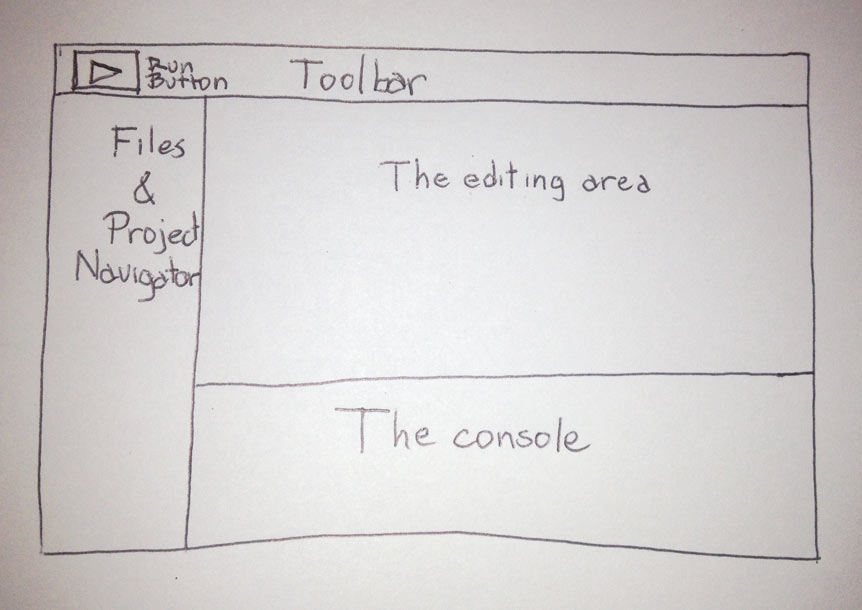
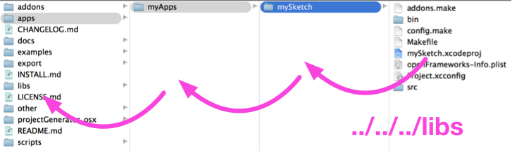

#OF structure

*by [Roy Macdonald](http://github.com/roymacdonald/)*

Let's get into openFrameworks (I'll refer to it as OF from now on). The philosophy chapter talks about OF in very abstract and conceptual manner, which is really useful for understanding the design of the OF environment.  Now, let's take a look at what the OF download looks like.

I have found that it is very useful to explain OF by making analogies to cooking. Coding and cooking have a lot of things in common, and most people are familiar with the act of cooking. In this chapter, I'll be drawing connections between processes and terminology in cooking and openFrameworks.

##First things first##
You need to download the OF version and the IDE (Integrated Development Environment) that suits your platform. The IDE is a piece of software that will let you write, compile, run and debug the code you write. It is "integrated" because it uses other pieces of software to do each of the mentioned tasks. You can run your code without using the IDE, but the IDE will make your programming life much easier.

Go to [www.openframeworks.cc/downloads](www.openframeworks.cc/downloads "Download openFrameworks!") and download the version that you need. By the side of each available version you will find a link to the where to download the needed IDE and how to install it. 

##Welcome to your new kitchen

###IDE:

As said before, the *Integrated Development Environment*, IDE, is the application you will be using to build your openFrameworks projects. It will let you write code, compile (bake it), test it and debug it (find out what is giving you problems, if there is any, and fix it).
There are several different IDEs, at least one for each platform you might be utilizing.

The IDE is your new kitchen, where you'll find all the tools to cook incredible stuff. Yet there are a lot of different kitchen brands, just like IDEs. All do the same but things might be laid out and named in a slightly different way. If you know how to use one, you can use any other. For clarification, I will go through each IDE and show where you will find the most used commands, controls and settings. Only read for the IDE you are going to use.    

All IDEs have a similar interface:

- Toolbar and Run Button: In the tool bar you'll find several useful buttons, such as open, save, save all, et cetera. The "run" button is very important. Usually it is labeled with a triangle pointing to the right, like the "play" button. When you press it, it will compile your code and if it went with no problem it will automatically run your code. Hence this is a frequently used button.
- File selector and project navigator area: Here you will see your project and the files associated with it. Usually it is displayed like a hierarchically ordered list of files. Here you'll find all the OF library files, as well as the files that are particular to your project.
- Editing area: When you open a file in the project navigation area, usually by double clicking it, it should open in the editing area. This looks just like any regular text-editing software, and behaves quite much the same.
- Console: This is where your app, when running, outputs messages. These messages are really useful for debugging, You can print text messages to the console using the `cout` comand  or `ofLog(...)` function.

####Apple Xcode

Xcode is Apple's IDE. Used both for iOS apps and desktop apps.
Even though there are other IDEs for MacOSX, Xcode is a a pretty mature one with lots of nice and useful features, especially for dealing with iOS apps.

Use the latest version of Xcode and read the setup guide. 

####Microsoft Visual Studio 2012 Express

This is Microsoft's IDE, it is aimed for Windows development. It's a commercial product, but there's a free version you can download called "Express". 

#### Code::Blocks

Code::Blocks is a free IDE. It runs on several platforms, but OF supports it for windows and linux. It is quite "light" in terms of downloading and we use it in workshops over VS, which can be a bit intimidating for beginners.  For windows, follow the setup instructions (including step "e") carefully.  For linux, there are scripts that help install dependencies and the codeblocks IDE. 

###Running examples

Find the OF version that you downloaded and decompress it. From now on we will refer to this folder as the OF root folder. You can place the OF root folder anywhere you like.   One thing to stress is that OF is designed to be self contained -- everything you need will stay in one folder and this folder can even be moved around on your drive if need be.  If you download another version of openframeworks, it should stay in it's own folder and don't try to merge them. 

Open it. Inside of it you will find several folders which we will describe below in more detail.  For now, navigate to the examples folder and let's try to compile examples/graphics/graphicsExample.   If you are on OSX, click on the graphicsExample.xcodeproj.  If you are using visual studio, choose the "sln" file.   On code::blocks, choose the "workspace" file.

*As a quick side note, about workspace files, the reason we ask you to open those rather then the project file is that they contain a sub-project to build the OF library also.   If you have any doubts, please read the readme for your given platform.*

Now your IDE should open and load this example. It should look like the IDE screenshots above. Locate the "Run" button or menu option and click on it. The example should compile (which might take a while, since the first time you compile you are comiling the OF library also).  You'll see alot of files being compiled the first time -- don't worry, this will just happen once, when the OF library needs to be rebuilt.  Feel free to get a cup of coffee or stretch.   Long compile times are great moments to take a screen break. 

If everything went well, a new window will pop up and display the example you just compiled. If this happened, congrats! You just have installed and compiled openFrameworks successfully and you are ready to go on. If this didn't happen, the first rule is, don't panic! check the notes below for each IDE and be sure to read the release notes that come with OF. 

- Xcode: make sure that the popdown menu just at the right of the run button has selected the item with the name of your example and not the one named "openFrameworks." There might be more than one item with the name of the example you are trying to run. Select anyone as long as it is not the one named "openFrameworks". This popdown menu selects the target you want to compile. If "openFrameworks" is selected you will just compile the openFrameworks core and not the example code. When you select the other items xcode will compile both the OF core and the code for your example and when done it will run the example. 
- VS: make sure you've opened the .sln file.  Visual studio express doesn't have a triangle button by default (I think it looks like a gear for debugging).  Locate the [run without debugging option](http://social.msdn.microsoft.com/Forums/vstudio/en-US/7b2182f9-0e46-4e6f-a8db-3ab5af39f14b/start-without-debugging-option-missing-from-debug-menu?forum=vsdebug), which you can add to the menu bar if you want to customize the IDE. 
- CB: make sure you've opened the .workspace file.   If you are opening up other projects, be sure to close the current workspace first, as CB doesn't handle multiple projects open very well.   
- With all IDEs, the play button will compile and run the project, but sometime you might need to hit the button twice if the window doesn't launch.

If the graphics example works, spend some time going through the other OF examples and running them.  Usually it's good practice to close the current project / workspace completely before you open another one.  Once the OF library is compiled It should be fun! 

If you have trouble, please keep track of what errors you have, what platform you are on, and start with using the [OF forum](http://forum.openframeworks.cc/).  There's years of experience there, and really helpful folks who can help answer questions.  First, try searching for a specific error and if you don't see it, post a question in the forum.  When you are beginning it can be quite frustrating, but the community is very good at helping each other out. 

Once done continue reading.

###OF folder structure###

Inside the OF root folder you will find several other folders, at least, the following:

####Addons####
The "addons" folder will contain the included "core" addons. Addons are extra pieces of code that extend OF's functionalities, allowing you to do almost anything with OF. Addons are usually written by third parties that have shared these. The "core" addons, the ones already included in your OF download, are addons that are used so frequently that it has been decided to include them as part of the official OF download. These are coded and maintained by OF's core developers.     
Check the examples/addons folder in your OF root folder where you will find at least one example about how to use each of these addons.
You can also go to [ofxAddons](http://ofxaddons.com/ "ofxaddons, a collection of OF addons") where you'll find a huge collection of additional addons from the community. 

####Apps####
This is the folder where you put your project files as you make new projects. Your current OF download contains the folder named "myApps" inside of "apps", and this is where the project generator will default to when you make a new project.  One important thing to note is that the project is positioned relatively to the libs folder, ie, if you were to look inside the project file you'd see relative folder paths, ie `../../../libs`.  This image is showing how ../../../libs might work visually: 

A key thing to note is that your project files always have to live at this heigh away from the root.  If you alter their heigh, they won't find the other pieces they need to compile.  This is a very common mistake for beginners, especially as you start to find example projects and bring them in OF to test, etc.   Please make sure you understand that projects are always setup relative to the root level.  This is what makes the whole OF folder be able to be anywhere on your hard drive -- it's all a self contained package.   This is probably the #1 issue beginners have, so it's worth emphasizing. 

####Examples

This is a folder with examples, sorted out by topic. There are a big bunch of examples that cover almost all of OF's aspects. Each example is made with the idea of keeping it simple and focused to the particular aspect it tries to address, thus making it easily understandable and a good starting point when you want to do something similar in your project.

####libs

These are the libs that openframeworks uses to compile your project.  They include things like freeType for typography support, freeImage for image loading, glfw for windowing, etc. Also the code for openframeworks is in libs, as well as the project files that help compile OF.  If you need to look at the source code, here's where to look. 

####other
Here you'll find an Arduino sketch for using with the serial example located at examples/communication/. This is handy to check that your serial communication with Arduino is set up correctly and working.

####projectGenerator

OF now ships with a simple project generator which is really useful for making new projects.  One of the larger challenges has always been making a new project and this tool takes a template (located in the scripts folder) and modifies it, chaning the name to a new name that you choose and even allowing you to add addons. It allows you to place the project anywhere you want, and while we've structured all the examples to be a certain distance away from the root, you can set the position using this tool (ie, if you put the project deeper, it will change the `../../../libs` to `../../../../libs`, for examples).  It's designed to make it easy / trivial to start sketching in code, without worrying too much about making a new project.  In the past we've always recommend that you copy an old project and rename it, but this is a more civilized approach to making projects. Check the readme file where the usage of this app is described. 

###The OF Pantry:###

Your default new kitchen will only have tools for coding, but the OF kitchen comes with a super nice pantry, filled up with really nice, cool and useful stuff. 

Imagine that you want to cook something but your kitchen has no pantry or if it has it is completely empty. In such conditions, cooking anything would be quite difficult, as you'll have to go out and buy the things you need and you probably won't find everything in one outing. This is not a nice scenario, especially if you want to get creative and make awesome things. 

So, what happens when you have your pantry filled with OF's components? You will be able to cook whatever you want because some really good ingredients are already there. Additionally, there are some really nice tools in there. This will let you complete recipes in a short amount of time, leaving you more time to get creative and try out new and more delicious recipes.

####What is inside the OF pantry####

Here you will find a lot of different things, from ingredients to tools, all ordered according to use.  This is a breakdown of how openframeworks code is organized (as well as the examples) and should give you a sense of what OF contains: 

- **3D**
    - Tools for drawing basic 3D polygonal objects, such as spheres, cubes, pyramids, etc.
    - `ofCamera`, `ofEasyCam` 3d cameras for navigating and viewing your 3D scene, either interactively or not.
    - `ofNode` a 3D point in space, which is the base type for any 3d object, allowing it to be moved, rotated, scaled, nested and drawn.
    - `ofMesh` A primitive for batching points in 3D space that allows you to draw them in several different ways such as points, lines, lines strips, triangles, triangles strips, and attach textures (images) to these. All of this is done very efficiently using your computer's GPU. 
    - functions to help load and save 3D objects.
- **app**
    - Tools for setting and getting properties of your app such as window size, position, different drawing modes, framerate, et cetera.
    - different windowing systems, such as `ofAppNoWindow` which sets up openframeworks in a windowless context for example.
- **communication**
    - `ofSerial` which provides simple serial port communication
    - `ofArduino` which allows openframeworks to communicate via Firmata
- **events**
    - this is code for the OF event manager, allowing you to tap into app events if you need or even creating your own events. 
- **gl** 
    - OpenGL is the library for using the computer's GPU, this folder contains gl specific functionality such as VBOs (Vertex Buffer Object), FBOs (Frame Buffer Object), Renderers, Lights, Materials, Shaders, Textures, and several other GL utilities.
    - OF implements different rendering pipelines, Fixed and Programable rendering pipelines as well as OpenGL ES (used on less powerful devices such as smartphones and the Raspberry Pi) -- most of this code is found in the gl folder. 
- **graphics**
    - There are a lot of capabilities here, such as loading and saving images of almost any kind, implementing several different methods for drawing in 2D, and exhibiting colors and styles. Most of the drawing tools rely on OpenGL so these are usually very fast. Graphics also allows you to render as PDF, and it features typography with several kinds of rendering options and utilities.
    - There are useful objects like ofImage, a class for loading, saving and drawing images
    - `ofTrueTypeFont` is a library for loading and drawing true type fonts
- **math**
    - in ofMath you'll find things like vectors (ie `ofVec2f`, `ofVec3f`) , matrices (ie `ofMatrix3x3`, `ofMatrix4x4`), qaternions and some really useful math help functions like `ofRandom` and `ofNoise`.
- **sound**
    - openframeworks has both low level sound, `ofSoundStream`, for direct access to the sound card, as well as higher level code `osSoundPlayer` for playing samples and sound effects. 
- **base types**
    - A lot of different base types used extensively within OF.  For folks that want to understand the archtecture of OF, this is a useful place where you'll find base types for common elements. 
- **utils**
    -  Utilities for file input and output, logging, threading, system dialogs (open, save, alert), URL file loader, reading and saving XML files (super useful for storing and reading your app's settings)
    - `ofDirectory` which can help iterate through a directory
- **video**
    - Video Grabber and player, with behind-the-scenes implementations for all the supported platforms.
    - `ofVideoGrabber` helps with grabbing from a webcam or attached camera
    - `ofVideoPlayer` helps with playing video files

####Addons

As mentioned before, addons extend OF core functionalities, and in each OF distribution there are several included addons, usually referred to as "core addons":

- **ofx3DModelLoader**
Used for loading 3D models into your OF project. It only works with .3ds files.
- **ofxAssimpModelLoader**
Also loads 3D models into your OF project, but it is done using the [assimp](http://assimp.sourceforge.net/) library, which supports a wide variety of 3D file formats, even animated 3D objects.
- **ofxGui**
This is the default GUI (Graphical User Interface) for OF. It lets you add sliders and buttons so you can easily modify parameters while your project is running. It relies heavilly on ofParameters and ofParameterGroup. It allows you to save and load the values for the parameters that you've adjusted.
- **ofxKinect**
Recently added as a core addon. As you probably infer, it's for using a Microsoft XBox Kinect 3D sensor with your OF project. This addon relies on [libfreenect](http://openkinect.org/wiki/Main_Page), so you can only access the depth and rgb images that the kinect reads and adjust some of its parameters, like tilt and light. It includes some handy functions that allow you to convert Kinect's data between several different kinds. Please note that ofxKinect doesn't perform skeleton tracking. For such thing you need to use ofxOpenNI. 
- **ofxNetwork**
Lets you deal with network protocols such as UDP and TCP. You can use it to communicate with other computers over the network. Check out network chapter for more information. 
- **ofxOpenCv**
This is OF's implementation of the best and most used Computer Vision code library, openCV. Computer Vision is a complete world by itself, and being able to use openCV right out-of-the-box is a super important and useful OF feature.
- **ofxOsc**
OSC (Open Sound Control) implementation for OF. OSC easily comunicates with other devices or applications within the same network. OSC is used to send messages and parameters from one app to another one.  Several chapters in this book discuss OSC. 
- **ofxSvg**
Loads and displays SGV files. These are vector graphics files, usually exported from vector drawing programs such as Adobe Illustrator.
- **ofxThreadedImageLoader**
Loads images on a different thread, so your main thread (the one that draws to your screen) doesn't get stuck while loading images. Really useful when loading online images.
- **ofxVectorGraphics**
Used to write out EPS vector graphics files. It the same drawing syntax as OF's regular drawing syntax, so it is really easy to use. Check chapter **[add correct chapter numbre]** for more info about OF's drawing capabilities. 
- **ofxXmlSettings**
This is OF's simple XML implementation used mostly for loading and saving settings. 

That's what's in the pantry.  what do you want to cook?

](images/pantry.jpg).

