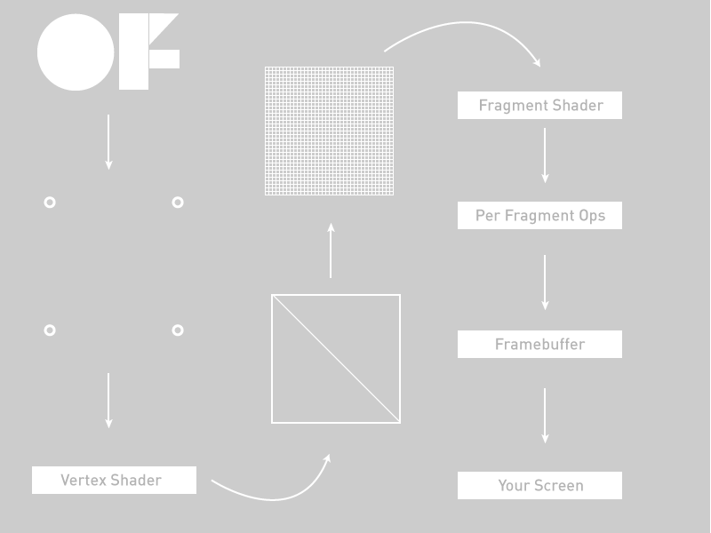

# Introducing Shaders

*by Lucasz Karluk, Joshua Noble, Jordi Puig*

## introducing

This tutorial comes in two parts: first, this thing, the HTML file and second, nine OF projects that progress along with this tutorial. You can find them in the example folder of your OF download, under `examples/shader` or [on github](https://github.com/openframeworks/openFrameworks/tree/master/examples/shader). As you read along with this, you should check the code downloads as well because a lot of the code isn't here, but rather is there. You'll notice that all of those project folders have the source code and a data folder that contains 3 different kinds of shaders: GL2, GL3, and GLES2. What these are and how they're different from one another will be described below.

You've probably heard somewhere about "shaders", those mystical things that let you render beautiful things at blazing speed. Shaders are not actually mystical but they are a little tricky to get started with at first because they're working with a different part of the computer than you're usually working within your openFrameworks application: you're working on the Graphics Processing Unit (as opposed to the Central Processing Unit that you're usually working on in OF). To really get the hang of working with shaders, we need to get you a little background on what the GPU is first. So, without further ado, let's go:

### The graphics pipeline

The triangle is the root of making 3d or even 2d scenes. We spend a lot of time trying to hide this or make them fancier, flashing, sparklier, etc, but the truth is: pretty much everything is a triangle. The OpenGL pipeline is pretty oriented towards the following work path: your OF app fills OpenGL-managed memory buffers with arrays of points in 3d space (we're going to call these "vertices") and these "vertices" are projected into screen space, put together into triangles, and finally turned into pixel-sized fragments in a process called "rasterization". Finally, every fragment (read: pixel) is assigned a color value and drawn to the framebuffer so that you can actually see it. When we're talking about shaders, the whole "figuring out where vertices go in screen space" is a Vertex Shader and the whole "assign a color value to each pixel" is a Fragment Shader. The flow looks more or less like this (excuse the over-simplification)



Walking from the upper left to the lower right we have:

* 1) Our OF application passing some vertex positions and texture coordinates to the graphics card
* 2) Our Vertex Shader.
* 3) Primitive Assembly setup of primitives, e.g. triangles, lines, and points
* 4) Rasterization: interpolation of data (colors, texture coordinates, other varying values) for all pixels
* 5) Our Fragment Shader
* 6) Per-pixel ops like discarding pixels for alpha, depth, and other reasons that would cause a pixel to not be drawn
* 7) Off to the framebuffer
* 8) Onto your screen

Let's get more specific.

### Vertices

Rendering an ofMesh start out as some vertex buffers on the CPU side that get filled with arrays of vertex attributes like colors or positions or texture coordinates. These attributes are used as the inputs into the vertex shader, this is what you're working within your vertex shader. When you call draw() on an ofMesh the indexes control how the vertices get assembled into triangles later on.

### The vertex shader

The GPU begins by reading each selected vertex out of the vertex array and running it through the vertex shader, a program that takes a set of vertex attributes as inputs and outputs a new set of attributes, referred to as varying values, that get fed to the rasterizer. At a minimum, the vertex shader calculates the projected position of the vertex in screen space. The vertex shader can also generate other varying outputs, such as a color or texture coordinates, for the rasterizer to blend across the surface of the triangles connecting the vertex.

### The fragment shader
The generated fragments then pass through another program called the fragment shader. The fragment shader receives the varying values output by the vertex shader and interpolated by the rasterizer as inputs. It outputs color and depth values that then get drawn into the framebuffer. Common fragment shader operations include texture mapping and lighting. Since the fragment shader runs independently for every pixel drawn, it can perform the most sophisticated special effects; however, it is also the most performance-sensitive part of the graphics pipeline.

### GLSL

Now that we've kinda glossed over the vertex and fragment shaders, you might be asking: "yes, those sound great, but how do I use them?" Answer: Graphics Language Shading Language or GLSL (double points for double "Language", right?). GLSL is a high-level programming language that’s similar to C/C++ for several parts of the graphics card. With GLSL, you can code short programs, called shaders, which are executed on the GPU. A shading language is a special programming language adapted to easily map to shader programming. It doesn't look tremendously different from what you see in the OF math classes: float, vec4, mat4, and so on. Because of the various target markets of 3-D graphics, different shading languages have been developed, but we're only focusing on GLSL in this tutorial. GLSL shaders themselves are a set of strings that are passed to the graphics card drivers for compilation from within an application using the OpenGL API’s entry points. Shaders can be created on the fly from within an application or read in as text files, but they must be sent to the driver in the form of a text string.

In OF we load our shaders into ofShader objects and I'm going to drive-by lay out the most important elements of that object:

*load()* - load a shader from two (or three) files: a .vert file and a .frag file.

*begin()* - start using your shader to alter all the drawing that your application is doing

*end()* - stop using your shader to alter all the drawing that your application is doing

You can load shader programs into your ofShader object using *shader.load()* or just use strings from your application with *shader.setupShaderFromSource()*, the passing body of your shader in a string as a second parameter using STRINGIFY macro and linking it with *shader.linkProgram()*. Either way is a-ok.

Before we go get into trouble, there's something that I want to explain that might not make sense right at first but is fairly important to acknowledge and is not so important to deeply grok at first: our examples use OpenGL3 mostly and to use OpenGL3 in OF you need to alter your main.cpp file. The main files in the tutorial download all look like this:

```cpp
#include "ofMain.h"
#include "ofApp.h"

int main( ){
    ofGLFWWindowSettings settings;
    settings.setGLVersion(3, 2); //we define the OpenGL version we want to use
    settings.setSize(1024, 768);
    ofCreateWindow(settings);
    // this kicks off the running of my app
    ofRunApp(new ofApp());
}

```

Did you catch that? There's a new setting object that lets you define the OpenGL version and the dimension of the window.

Now, what OpenGL3 is and how it's going to change the way that you think about code and graphics on your computer isn't a topic for this tutorial, but if you want to look up some tutorials on that [please do so](http://www.youtube.com/watch?v=XMgfddy7S7Q). We're working on an OpenGL tutorial but for the moment we're going to stick with shaders. The OpenGL3 shader which confusingly uses GLSL 1.5, has the following at the top:

```cpp
#version 150
```

The OpenGL2 version of a shader (confusing, GLSL 1.2), does not have a defined above it (though you can use one "#version 120"). Most graphics cards support OpenGL3 but some do not. You can always run the glInfoExample in examples/gl to see what your computer supports if you run into trouble or are just curious. Finally, we have OpenGL ES 2, which is what is supported on Android, iOS, and which you might be familiar with from WebGL. It doesn't have a declaration at the top, but you'll notice something in most GLES shaders:

```cpp
precision highp float;
```

The differences between the shaders aren't major but they exist, however it's more important to know that they exist than to have a line by line description of what's different between the three. In this tutorial all the shader examples are in the same folder so you'll see increasingly little code in the tutorials as we go on because we don't want to waste too much space repeating stuff and you'll be such a pro by the end of this that you won't need all that code repeated anyways.

## Your first shader!

Let's take a look at a very simple example to help you get going with it. First, we'll look at the OF side of things:

In the ofApp.h file add this line
```cpp
ofShader shader;
```
Then in opApp.cpp, add
```cpp

void ofApp::setup(){
  # Depending on the OpenGL version that your hardware supports, you have to load the right shader.
  # As the OpenGL version that we have set is 3.2, we will load the shaders for OpenGL 3
  shader.load("shadersGL3/shader");
}

void ofApp::draw(){
    ofSetColor(255);
    shader.begin();
    ofDrawRectangle(0, 0, ofGetWidth(), ofGetHeight());
    shader.end();
}

```

Two big things to note: take a look at *setup()* and see that thing that says: *shader.load("shadersGL3/shader")*? That's where we're actually loading the shaders in. OF lets us take a little shortcut in loading a shader where we just tell OF what folder we're loading the shaders out of and what both files are named and we're off to the races. Those files are actually called shader.vert (that's the vertex shader) and shader.frag (that's the fragment shader) so they're both going to be loaded with that single call. If you have files that are named separately you can always just use this:

```cpp
shader.load("myCrazyVertFile.vert", "myCrazyFragFile.frag");
```

It's up to you, go with your heart. Our version of it above is a little messy because we're loading one of three different renderers depending on whether you're on an iPhone, an old-school computer or a new school computer. Even though we have shaders for all three cases, we're going to be explaining the OpenGL3 example mostly because it's probably the easiest to understand at first.

Next, note how the *draw()* method contains *shader.begin()* and *shader.end()*? That's how we tell our renderer that we want to have all the vertices and textures and fragments go through our shader rather than just being passed directly to the framebuffer. That's about all there is in our application.

Alright, onto the shaders themselves. In our tutorial examples, these live in the data folder of your application, along with images, fonts, and other data that you might want to load into your application. You can also have a shader just as a string in your application but we thought it might be nicer to see them in a separate folder so you can work with them outside of your OF app.

Here's the vertex shader, the first one that will be called in each *draw()* of our application.

```cpp

// vertex shader

#version 150

uniform mat4 modelViewProjectionMatrix;
in vec4 position;

void main(){
    gl_Position = modelViewProjectionMatrix * position;
}

```

Next is the fragment shader which is called to determine the colors for each pixel in our application.

```cpp

// fragment shader

#version 150

out vec4 outputColor;

void main()
{
    // gl_FragCoord contains the window relative coordinate for the fragment.
    // we use gl_FragCoord.x position to control the red color value.
    // we use gl_FragCoord.y position to control the green color value.
    // please note that all r, g, b, a values are between 0 and 1.

    float windowWidth = 1024.0;
    float windowHeight = 768.0;

    float r = gl_FragCoord.x / windowWidth;
    float g = gl_FragCoord.y / windowHeight;
    float b = 1.0;
    float a = 1.0;
    outputColor = vec4(r, g, b, a);
}

```

That should look like the following when you run it:


Let's break some of the things in there down a little bit. At the top of the fragment and vertex shaders, you can see a lot of "uniforms". A uniform is a value passed to each shader from your program that sets some additional values that you use at each stage of your shading. Uniform variables act as constants, at least for the duration of your OF applications *draw()* method. You're OF application feeds these variables to the graphics pipeline so that they're accessible in both stages of shading. Any shader can access any uniform variable as long as it declares the variable like we do in both shaders in our example. Note though that these variables are read-only in the shaders. If you want to update the value of a uniform, you can do it in your OF application by calling:

```cpp
shader.setUniform1f("myUniform", 1.f);
```

That's how you set a uniform like this:

```cpp
uniform float myUniform;
```

You can set several different kinds of uniforms, vec3, vec4, mat4, even structs. There's one uniform in the *ofShader* that's already setup for you: *modelViewProjectionMatrix*.

### The vertex shader

*modelViewProjectionMatrix* - This is actually a value passed in from OF. You can tell that because it's got a "uniform" in front of it. This means that it's passed in for each vertex with exactly the same value.

Next up in our vertex shader is a different kind of variable: *in vec4 position*. This is called an attribute and every vertex has a different one. That's helpful when you want to have lots of vertices that aren't all in the same place. Each one has its own position means that you can access the location of each vertex within the shader and use it in a calculation or even modify it in place. There are several different kinds of attributes for different kinds of objects in OF: position, color, or texture coordinates, all of which are handy for making complex geometry and shading them.

*position* - This is also a value passed in from OF but you'll notice that it has an "in" at the front of it, which means that the value passed in is different for each vertex because each vertex has a slightly different position. These are called attributes and they're all set up when the ofMesh is created and each value is set when they're being drawn.

*gl_Position* - This is what comes out of the vertex shader. It's a variable with a fixed role: pass the position of the vertex to the triangle assembly. "Triangle assembly" is when the GPU connects vertices to form triangles. It does this by taking the vertices in the order specified by the element array and grouping them into sets of three that then either create triangle strips or triangle fans.

### The fragment shader

*gl_FragCoord* - This is the location of the fragment in screen space. This is how you know where each pixel is on your screen. In our application we're  using it to figure out what color to put for the pixel:

```cpp
float r = gl_FragCoord.x / windowWidth;
float g = gl_FragCoord.y / windowHeight;
float b = 1.0;
float a = 1.0;
outputColor = vec4(r, g, b, a);
```

The *gl_FragCoord* can also be replaced with an "out" vec2 passed from the vertex shader (confusing, I know). Finally, there's the "out" variable for the fragment shader

```cpp
out vec4 outputColor;
```

Anything marked "out" goes the next stage in the shading pipeline. For the fragment shader that next stage is to put a pixel into the framebuffer, so you need to one and only one "out" from a fragment shader. A vertex shader can have multiple "out" variables that are just passed to the fragment shader, while a fragment shader is just figuring out what color should be sent on for each pixel based on all the values passed from the vertex shader.

outputColor - the color, described in RGBA, that we want this pixel to be colored.

And that's your first shader. For fun, try commenting out the calls to *shader.begin()* and *shader.end()* in the ofApp.cpp *draw()* to see what happens when there are no shaders in them. Pretty boring right? Good thing we've shaders to keep us entertained. Next, let's move some vertices around.


## Adding Uniforms

This is going to be a little more fun: we're gonna move stuff around in our shaders. First, the ofApp.cpp. We're just making a plane so we have some nice vertices to play with. The ofPlanePrimitive is perfect for "just some vertices to play with" so let's use that:

```cpp

#include "ofApp.h"

void ofApp::setup(){

    float planeScale = 0.75;
    int planeWidth = ofGetWidth() * planeScale;
    int planeHeight = ofGetHeight() * planeScale;
    int planeGridSize = 20;
    int planeColumns = planeWidth / planeGridSize;
    int planeRows = planeHeight / planeGridSize;

    plane.set(planeWidth, planeHeight, planeColumns, planeRows, OF_PRIMITIVE_TRIANGLES);
}

```

Next up, we're going to make a mouse-reactive color and set the front color of our application using that color. GLSL will have access to the color that is set in our ofColor application through the globalColor variable. This isn't actually a GLSL special object, this is created and updated by OF, just like the modelViewMatrix mat4 that we can use to determine how our 3D world should be laid out.

```cpp

void ofApp::draw(){

    float percentX = mouseX / (float)ofGetWidth();
    percentX = ofClamp(percentX, 0, 1);

    // the mouse/touch X position changes the color of the plane.
    // please have a look inside the frag shader,
    // we are using the globalColor value that OF passes into the shader everytime you call ofSetColor().
    ofColor colorLeft = ofColor::magenta;
    ofColor colorRight = ofColor::cyan;
    ofColor colorMix = colorLeft.getLerped(colorRight, percentX);
    ofSetColor(colorMix);

    shader.begin(); // start shading!

    // a lot of the time you have to pass in variables into the shader.
    // in this case we need to pass it the elapsed time for the sine wave animation.
    shader.setUniform1f("time", ofGetElapsedTimef());

    // translate plane into center screen.
    float tx = ofGetWidth() / 2;
    float ty = ofGetHeight() / 2;
    ofTranslate(tx, ty);

    // the mouse/touch Y position changes the rotation of the plane.
    float percentY = mouseY / (float)ofGetHeight();
    float rotation = ofMap(percentY, 0, 1, -60, 60, true) + 60;
    ofRotate(rotation, 1, 0, 0);

    plane.drawWireframe();

    shader.end(); // end shading!
}
```

Make note of the *ofSetColor(colorMix)* call in there. That's actually going to set the color that we *can* use in our fragment shader. We could also set the "out vec4 color" to any old thing we want, but in this case, we're not going to, because we've got too much fun stuff going on in the vertex shader.

Now, because we have one call to the vertex shader for each vertex, we can play with the location of the vertices before we pass them on to the fragment shader. The *gl_Position* is what comes out of the vertex shader, so anything we set that to will be the location of the vertex. In this case, we'll just use a little *sin()* wave action to manipulate it, making a nice wave out of our plane:

```cpp

#version 150

// these are for the programmable pipeline system
uniform mat4 modelViewProjectionMatrix;
in vec4 position;

// the time value is passed into the shader by the OF app.
uniform float time;


void main()
{
    // the sine wave travels along the x-axis (across the screen),
    // so we use the x coordinate of each vertex for the calculation,
    // but we displace all the vertex along the y axis (up the screen)/
    float displacementHeight = 100.0;
    float displacementY = sin(time + (position.x / 100.0)) * displacementHeight;

    vec4 modifiedPosition = modelViewProjectionMatrix * position;
    modifiedPosition.y += displacementY;
    gl_Position = modifiedPosition;
}
```

As you hopefully recall from the last little section, we have one call to the fragment shader per pixel, which means we can play with it as well. That's what we did in the last example, though, to keep things simple in this example we're just using a global color set in a uniform. The thing about that is that we're setting it in the OF application so that each *draw()* has a slightly different color based on the mouse position.

```cpp

#version 150
uniform vec4 globalColor;
out vec4 outputColor;

void main()
{
    outputColor = globalColor;
}
```

As with the previous example, try commenting out the calls to *shader.begin()* and *shader.end()* to see what it looks like without the shader running. Pretty big difference, eh? Let's get a little more vertex-y :)


## Adding some interactivity

This is going to let us use the mouse position in our shader to manipulate vertices. We'll pass it in via, you guessed it, a uniform! Since the mouse position is actually two values (x,y) we'll pass it in using *shader.setUniform2f()*. On the shader side, that means we'll have a "uniform vec2 mousePos" that we can store. The mouse position can be a uniform because it's not changing per vertex, just per draw. We are going to manipulate the value of each vertex based on that mouse position though. First the ofApp draw() method. Look at all those calls to "setUniform()"!

```cpp

void ofApp::draw(){

    shader.begin();

    // center screen.
    float cx = ofGetWidth() / 2.0;
    float cy = ofGetHeight() / 2.0;

    // the plane is being positioned in the middle of the screen,
    // so we have to apply the same offset to the mouse coordinates before passing into the shader.
    float mx = mouseX - cx;
    float my = mouseY - cy;

    // we can pass in a single value into the shader by using the setUniform1 function.
    // if you want to pass in a float value, use setUniform1f.
    // if you want to pass in a integer value, use setUniform1i.
    shader.setUniform1f("mouseRange", 150); // SET A UNIFORM

    // we can pass in two values into the shader at the same time by using the setUniform2 function.
    // inside the shader these two values are set inside a vec2 object.
    shader.setUniform2f("mousePos", mx, my);  // SET A UNIFORM

    // color changes from magenta to blue when moving the mouse from left to right.
    float percentX = mouseX / (float)ofGetWidth();
    percentX = ofClamp(percentX, 0, 1);
    ofFloatColor colorLeft = ofColor::magenta;
    ofFloatColor colorRight = ofColor::blue;
    ofFloatColor colorMix = colorLeft.getLerped(colorRight, percentX);

    // create a float array with the color values.
    float mouseColor[4] = {colorMix.r, colorMix.g, colorMix.b, colorMix.a};

    // we can pass in four values into the shader at the same time as a float array.
    // we do this by passing a pointer reference to the first element in the array.
    // inside the shader these four values are set inside a vec4 object.
    shader.setUniform4fv("mouseColor", &mouseColor[0]);  // SET A UNIFORM

    ofTranslate(cx, cy);

    plane.drawWireframe();

    shader.end();
}

```

That's *3* different kinds of uniforms! A single floating point value (uniform float), a 2 float vector (uniform vec2), and a vector of 4 floating point values (uniform vec4).

Now onto the shaders themselves, starting with the vertex shader

```cpp
#version 150

// these are from the programmable pipeline system, no need to do anything, sweet!
uniform mat4 modelViewProjectionMatrix;
in vec4 position;

uniform float mouseRange;
uniform vec2 mousePos;
uniform vec4 mouseColor;

void main()
{
    // copy position so we can work with it.
    vec4 pos = position;

    // direction vector from mouse position to vertex position.
    vec2 dir = pos.xy - mousePos;

    // distance between the mouse position and vertex position.
    float dist =  distance(pos.xy, mousePos);

    // check vertex is within mouse range.
    if(dist > 0.0 && dist < mouseRange) {

        // normalise distance between 0 and 1.
        float distNorm = dist / mouseRange;

        // flip it so the closer we are the greater the repulsion.
        distNorm = 1.0 - distNorm;

        // make the direction vector magnitude fade out the further it gets from mouse position.
        dir *= distNorm;

        // add the direction vector to the vertex position.
        pos.x += dir.x;
        pos.y += dir.y;
    }

    // finally set the pos to be that actual position rendered
    gl_Position = modelViewProjectionMatrix * pos;
}

```

Did you catch that? *gl_Position* is modified by the location of the mouse *relative* to its own position. Nifty! Now let's just use that mouse-color that we passed in from the *ofShader* object.

```cpp

// fragment shader

#version 150

out vec4 outputColor;
uniform vec4 mouseColor;

void main()
{
    outputColor = mouseColor;
}
```

Now you know how to pass a few different values into a shader and use them to dynamically do some pretty stuff with the vertices. Let's talk about textures next.


## Adding Textures

Let's talk about textures: you know textures as what you see on the screen when you draw your ofImage or a frame from your *ofVideo* player. Lots of times in shading, for example, in a vertex array, the data is fed to the vertex shader one element at a time and there's no way for the vertex shader to access other elements. A texture, on the other hand, makes its entire contents available to any vertex or fragment shader. Those shaders sample the texture at one (or a hundred) different texture coordinates. This makes it really powerful for passing data into your shader, first, because uploading a texture is (comparatively) really fast and two, because you can access any point in them.

There's one nice little feature wrapped into the OF application: *mapTexCoordsFromTexture()*. This lets you just pass a texture reference to the plane and auto-calculate where each part of the texture should go. This is nice because it saves you need to loop through each vertex and assign the texture coordinate. Of course, when you want to start doing tricky things yourself you'll want to do this yourself so you have more control over it, but for a simple ofPlanePrimitive, this is pretty sweet.

The other thing to note is that we're binding the texture in the *draw()* method before we call *shader.begin()*. This actually happens automatically when you call *ofImage::draw()* but since we're not doing that, we need to make sure that the image is available on the graphics card. The thing about ofTexture and textures in general is that since you can have a lot of them on the graphics card of your computer, it's nice to be able to say which ones you're going to use in your program. The way that you do that is by "binding" the images, really just making sure that the memory that holds your texture is available to your shader. You can bind quite a few textures but for starters, we'll just do one.

```cpp

// OF

#include "ofApp.h"

void ofApp::setup() {
    // setup
    plane.mapTexCoordsFromTexture(img.getTextureReference());
}

void ofApp::draw() {

    // bind our texture. in our shader this will now be tex0 by default
    // so we can just go ahead and access it there.
    img.getTextureReference().bind();

    // start our shader, in our OpenGL3 shader this will automatically set
    // up a lot of matrices that we want for figuring out the texture matrix
    // and the modelView matrix
    shader.begin();

    // get mouse position relative to center of screen
    float mousePosition = ofMap(mouseX, 0, ofGetWidth(), plane.getWidth(), -plane.getWidth(), true);

    shader.setUniform1f("mouseX", mousePosition);

    ofPushMatrix();
    ofTranslate(ofGetWidth()/2, ofGetHeight()/2);
    plane.draw();
    ofPopMatrix();

    shader.end();
    img.getTextureReference().unbind();

}

```

Alright, onto the vertex shader. Nothing too special *except* that little bit that says: *out vec2 varyingtexcoord*. That's where we're setting up what we're going to pass to our fragment shader so that the fragment shading program knows which bit of the texture to put at its pixel. You may be wondering: wait, I've got 100 vertices but 1024x768 pixels, how does passing 100 positions from 100 vertices help me manage 1024x768 pixels? Well, hopefully, you were wondering that because it's a truly excellent question. The answer is interpolation! Let's look at a really simple rectangle with a texture:

Each value is interpolated between the vertices. Going from 0,0 to 0,1024 your card just goes ahead and divides the 512 pixels of the image amongst them evenly, meaning that each texture pixel goes on two screen pixels. As you can imagine that kind of looks like crap sometimes, luckily there's lots of ways to manage that, unluckily for you, we're not going to talk about that here.


```cpp

#version 150

// these are for the programmable pipeline system and are passed in
// by default from OpenFrameworks
uniform mat4 modelViewMatrix;
uniform mat4 projectionMatrix;
uniform mat4 textureMatrix;
uniform mat4 modelViewProjectionMatrix;

in vec4 position;
in vec4 color;
in vec4 normal;
in vec2 texcoord;
// this is the end of the default functionality

// this is something we're creating for this shader
out vec2 varyingtexcoord;

// this is coming from our C++ code
uniform float mouseX;

void main()
{
    // here we move the texture coordinates
    varyingtexcoord = vec2(texcoord.x + mouseX, texcoord.y);

    // send the vertices to the fragment shader
    gl_Position = modelViewProjectionMatrix * position;
}


```

The fragment shader simply looks up the location in texture using the vec2 that's passed into it. The texture itself is represented by the sampler2DRect construct. This is the source of a lot of confusion when people get started using shaders in OF because there are two kinds of samplers: *sampler2DRect* and *sampler2D*. The difference between these two lies in the kind of texture data that you're actually uploading. If your texture is a power of two sizes where the height and width are both power of two values like 256 or 512 of 1024 or 2048, then you can use a sampler2D to represent your texture data. As OF, however, we want to assume that you can use any image size because sometimes images are weird shapes and sizes like 4x1837 or 381x293 and that should be ok to work with. And it is and it works out fine in your shader as long as you use sampler2DRect. The way to get points in that data is the *texture()* method that takes the *sampler2DRect* that you're drawing the data from and the texture coordinate of the particular pixel that you want.

You'll notice that the *sampler2DRect* is called "tex0" and that we didn't actually set that uniform in our OF app. Why is that? The secret is in the *setUniformTexture()* method, which calls *bind()* for you. Also, drawing an image, as we do with *image.draw(0, 0)*, binds the texture as well and since it isn't given a uniform name, it appears as *tex0*. Confusing? Perhaps, but it's common enough to see that I wanted to call it to your attention. To be explicit, there are three ways of getting a texture into your shader:

1) You can bind a texture and access it as *tex0* if it's the only one bound without a uniform name.
2) You can call *setUniformTexture()* and pass a uniform name and the texture itself
3) You can call *image.draw()* and access the image as tex0 if it's the only one bound without a uniform name.

It's good to know all these because they're there and you'll see them out in the wild.

```cpp

// fragment shader
#version 150

// this is how we receive the texture
uniform sampler2DRect tex0;
in vec2 varyingtexcoord;
out vec4 outputColor;

void main()
{
    outputColor = texture(tex0, varyingtexcoord);
}


```


So, that's one texture, but we can do some much better tricks when we have two textures.


## Alpha Masking

Using multiple textures in a shader isn't hard at all, you just need to make sure that you're passing them into the shader using the *setUniformTexture()* method. As in the previous example, we're relying on the default *tex0* but we've added another texture that we're passing in via the *setUniformTexture()* method.

```cpp
void ofApp::draw(){

    // draw a white rectangle for background.
    ofDrawRectangle(0, 0, image.getWidth(), image.getHeight());

    shader.begin();
    shader.setUniformTexture("imageMask", imageMask.getTextureReference(), 1);

    image.draw(0, 0);

    shader.end();
}
```

The vertex shader for this example is unremarkable, so we're actually going to omit it, but you can, of course, find all three examples in the examples/bin/data folder. The fragment shader though has a little bit of new stuff in it, conceptually speaking. Think of your texture as data and think of each value in that texture as a data point. The "in" of your data is going to be a color and the "out" of your data is also going to be a color but everything in between is pure data manipulation and what that "in" color can represent can be everything from the height of generated landscape geometry to the location of a sprite. In this case, we're using the alpha value of our two different textures to figure out where our mask begins and ends. One texture has a mask with alpha values ranging from 0 to 1 and the other simply has color values with full alpha (e.g. alpha = 1). Multiplying the two alpha values together gets us a masking effect because, well, that's how multiplication works. We build a vec4 out of the color of the main image and the alpha out of the mask image:

```cpp

#version 150

uniform sampler2DRect tex0;
uniform sampler2DRect imageMask;

in vec2 texCoordVarying;

out vec4 outputColor;

void main()
{
    vec4 texel0 = texture(tex0, texCoordVarying);
    vec4 texel1 = texture(imageMask, texCoordVarying);
    // first three values are the rgb, fourth is the alpha
    outputColor = vec4(texel0.rgb, texel0.a * texel1.a);
}

```

Voila, you're well on your way to recreating Photoshop. Speaking of which, let's move on to some more serious composition strategies in shaders, in particular, using the OpenFrameworks implementation of Frame Buffer Objects, the *ofFbo*.


## Multiple Textures

First: what is an FBO? At its core it’s a container for textures and an optional depth buffer. Kind of like, well, an OpenGL framebuffer, which is what you're normally rendering to. One way to think of it, conceptually correct but technically a bit loose, is that it's another renderer that you can write to. You can draw textures to it, draw 3D or 2D objects to it, render the view of cameras inside of it, all with one key difference: it's just an object. You can have multiple of them, draw all kinds of things inside of them, and then get all the textures out of them to play within a shader or just draw them directly to the screen. They are, for most purposes, little render buffers and as such, they're excellent for doing multiple shaders passes. So, we're going to set up two *ofFbo* objects and use them to mask textures using different channels, i.e. RGB elements of the textures. You'll see how this works once you run the application. Those textures are, to make it more interesting, coming from an ofCamera and an ofVideoPlayer, that's actually not a big deal to set up. We'll set up the camera and movie first in the setup() method *and* we'll set up both of the FBO objects that we're going to use:


```cpp

int camWidth = 320;
int camHeight = 240;

camera.setVerbose(false);
camera.initGrabber(camWidth, camHeight);

movie.loadMovie("movie.mov");
movie.play();

image.loadImage("img.jpg");
imageMask.loadImage("mask.jpg");

// say how big you want each FBO to be
fbo.allocate(camWidth, camHeight);
maskFbo.allocate(camWidth, camHeight);

```

Calling ofFbo::begin() sets the FBO as the render buffer that everything will be rendered to. Conversely, calling *ofFbo::end()* unsets the FBO as the render buffer that everything will be rendered to.

```cpp

     //------------------------------------------- draw to fbo.
    fbo.begin();
    ofClear(255, 255, 255, 255);

    shader.begin();
    shader.setUniformTexture("redTex", camera.getTextureReference(), 1);
    shader.setUniformTexture("greenTex", image, 2);
    shader.setUniformTexture("blueTex", movie.getTextureReference(), 3);
    shader.setUniformTexture("imageMask", imageMask.getTextureReference(), 4);

    imageMask.draw(0, 0);

    shader.end();
    fbo.end();

```

Now we've just drawn the image mask, camera texture, color texture, and movie texture to the ofFbo, which means that none of them will show up until the second FBO object is drawn. So, continuing down the *draw()* method, we're drawing the camera, the image, the movie, the mask FBO and the final rendered FBO.

```cpp

    ofSetColor(255);
    camera.draw(5,5,320,240);
    ofSetColor(ofColor::red);
    ofDrawBitmapString("RED", 5+30, 5+30);

    ofSetColor(255);
    greenOF.draw(320+10,5,320,240);
    ofSetColor(ofColor::green);
    ofDrawBitmapString("GREEN", 320+10+30,5+30);

    ofSetColor(255);
    movie.draw(320*2+15,5,320,240);
    ofSetColor(ofColor::blue);
    ofDrawBitmapString("BLUE", 320*2+5+30,5+30);

    ofSetColor(255);
    imageMask.draw(320+10,240+10,320,240);
    ofDrawBitmapString("RGB MASK", 320+10+30,240+10+30);

    fbo.draw(320+10,240*2+15,320,240);
    ofDrawBitmapString("Final FBO", 320+10+30,240*2+15+30);
}

```

So that's getting 4 textures into the shader and then rendering that shader into the FBO to be drawn later. This is a very powerful technique for doing multiple renders passes, rendering complex scenes to a texture, what's called "ping-ponging textures", and a range of other techniques for trickery and beautification. Let's look at the fragment shader. Unsurprisingly it has 4 *sampler2DRect* uniforms declared in it and each of those is queried for its color and then individual channels of those images are used to generate the color for the final output pixel.

```cpp

#version 150

uniform sampler2DRect redTex;
uniform sampler2DRect greenTex;
uniform sampler2DRect blueTex;
uniform sampler2DRect imageMask;

in vec2 texCoordVarying;

out vec4 outputColor;

void main()
{
    vec4 rTxt = texture(redTex, texCoordVarying);
    vec4 gTxt = texture(greenTex, texCoordVarying);
    vec4 bTxt = texture(blueTex, texCoordVarying);
    vec4 mask = texture(imageMask, texCoordVarying);

    outputColor = vec4(rTxt.r, gTxt.g, bTxt.b, mask.r);
}

```

In the next example, we'll create a pair of ofFbos and make a drawing application out of them.


## ofFbo

Setup is very similar to the previous example: make two ofFbo objects, allocate them, and then ensure that they're cleared of any junk data that might be living on the graphics card in the memory space that this FBO was just given. This is an important little lesson: graphics cards often don't clear out their memory for you before handing it to you, which means that the junk will show up unless you empty it. This is particularly true in FBO objects.

```cpp

    backgroundImage.loadImage("A.jpg");
    foregroundImage.loadImage("B.jpg");
    brushImage.loadImage("brush.png");

    int width = backgroundImage.getWidth();
    int height = backgroundImage.getHeight();

    maskFbo.allocate(width, height);
    fbo.allocate(width, height);

    // Clear the FBO's
    // otherwise it will bring some junk with it from the memory
    maskFbo.begin();
    ofClear(0,0,0,255);
    maskFbo.end();

    fbo.begin();
    ofClear(0,0,0,255);
    fbo.end();

```

The *draw()* method is really just passing data into these two FBO objects:

```cpp

// this is our alpha mask which we draw into.
if(bBrushDown) {
    maskFbo.begin();

    int brushImageSize = 50;
    int brushImageX = mouseX - brushImageSize * 0.5;
    int brushImageY = mouseY - brushImageSize * 0.5;
    brushImage.draw(brushImageX, brushImageY, brushImageSize, brushImageSize);

    maskFbo.end();
}

```

Catch that? Just drawing a brush image into the maskFbo as the users drag it around. Next, as in the previous example, the masking FBO is passed right into the shader and then creating a mask of the previous image.

```cpp

// HERE the shader-masking happens
fbo.begin();
// Cleaning everthing with alpha mask on 0 in order to make it transparent by default
ofClear(0, 0, 0, 0);

shader.begin();
// here is where the fbo is passed to the shader
shader.setUniformTexture("maskTex", maskFbo.getTextureReference(), 1 );

backgroundImage.draw(0, 0);

shader.end();
fbo.end();

// FIRST draw the background image
foregroundImage.draw(0,0);

// THEN draw the masked fbo on top
fbo.draw(0,0);

//----------------------------------------------------------
ofDrawBitmapString("Drag the Mouse to draw", 15,15);
ofDrawBitmapString("Press spacebar to clear", 15, 30);

```

In the fragment shader, all we really need to do is look up any value of the mask texture to determine whether or not we're going to be using it. It doesn't matter that our mask is actually an FBO because it has texture data and that's good enough for our shader. There's one more little trick to call out in this tutorial and that is how the *outputColor* variable is actually being set with a vec3 and a float. This is totally legal in GLSL. In fact, a float and a *vec3*, two *vec2*s, one row of a *mat4*, anything or combination of things that have 4 values can be used to set a vec4. The same goes for anything/s with 3 values and a *vec3* and so on and so forth. It makes GLSL code very elegant, though it is a bit strange to get used to at first.

```cpp
// fragment
#version 150

// these are our textures
uniform sampler2DRect tex0;
uniform sampler2DRect maskTex;

// this comes from the vertex shader
in vec2 texCoordVarying;

// this is the output of the fragment shader
out vec4 outputColor;

void main()
{
    // get rgb from tex0
    vec3 src = texture(tex0, texCoordVarying).rgb;

    // get alpha from mask
    float mask = texture(maskTex, texCoordVarying).r;

    //mix the rgb from tex0 with the alpha of the mask
    outputColor = vec4(src , mask);
}
```

The idea of passing an FBO as data is interesting, but it's more interesting if we just go ahead and actually pass a texture as pure data, which is, unsurprisingly, what we're going to do next.


## Textures as Data (e.g. Displacement)

In this application, we're going to generate some noise data and store it in a texture to then use it as a displacement value to move vertices in our vertex shader. The noise is just generated using ofNoise() and then saved in an ofPixels object, then uploaded to the graphics card in a texture.

```cpp
void ofApp::update(){
    float noiseScale = ofMap(mouseX, 0, ofGetWidth(), 0, 0.1);
    float noiseVel = ofGetElapsedTimef();

    ofPixels & pixels = img.getPixels();
    int w = img.getWidth();
    int h = img.getHeight();
    for(int y=0; y<h; y++) {
        for(int x=0; x<w; x++) {
            int i = y * w + x;
            float noiseVelue = ofNoise(x * noiseScale, y * noiseScale, noiseVel);
            pixels[i] = 255 * noiseVelue;
        }
    }
    img.update();
}
```

The shader itself doesn't need much special and we just add a little bit of rotation to make the view a bit more dynamic. Otherwise though, nothing tricky.

```cpp

// bind our texture. in our shader this will now be tex0 by default
// so we can just go ahead and access it there.
img.getTextureReference().bind();

shader.begin();

ofPushMatrix();

// translate plane into center screen.
float tx = ofGetWidth() / 2;
float ty = ofGetHeight() / 2;
ofTranslate(tx, ty);

// the mouse/touch Y position changes the rotation of the plane.
float percentY = mouseY / (float)ofGetHeight();
float rotation = ofMap(percentY, 0, 1, -60, 60, true) + 60;
ofRotate(rotation, 1, 0, 0);

plane.drawWireframe();

ofPopMatrix();

shader.end();

ofSetColor(ofColor::white);
img.draw(0, 0);

```


Unlike the last few instances, all the interesting stuff in this example is happening in the vertex shader since as you might have guessed from the name of the example, displacement is primarily a geometry based action rather than a pixel-shading based one. As I've mentioned elsewhere, the handy thing about texture data is that it's available everywhere all at the same time, even in the vertex shader. The *gl_Position* variable is modified using the *r* value of the texture at the texture coordinate passed in from the ofPlanePrimitive and that's really all the trickery there is.

```cpp
#version 150

// these are from the programmable pipeline system
uniform mat4 modelViewProjectionMatrix;
in vec4 position;
in vec2 texcoord;

// this is how we receive the texture
uniform sampler2DRect tex0;

out vec2 texCoordVarying;

void main()
{
    // get the position of the vertex relative to the modelViewProjectionMatrix
    vec4 modifiedPosition = modelViewProjectionMatrix * position;

    // we need to scale up the values we get from the texture
    float scale = 100;

    // here we get the red channel value from the texture
    // to use it as vertical displacement
    float displacementY = texture(tex0, texcoord).r;

    // use the displacement we created from the texture data
    // to modify the vertex position
    modifiedPosition.y += displacementY * scale;

    // this is the resulting vertex position
    gl_Position = modifiedPosition;

    // pass the texture coordinates to the fragment shader
    texCoordVarying = texcoord;
}

```

Finally, we'll look at creating a blur effect using two shaders and two FBOs.

<a name="blurring"></a>

## Blurring

Blurring is one of the best ways to start thinking about multi-pass shading, that is, using multiple shaders in a single application to do multiple passes. Because GLSL (and GPU computing in general for that matter) is so heavily optimized towards doing specific types of operations on discrete blocks of memory, sometimes it makes more sense and gets you the better performance to do multiple shading passes rather than put branching logic in your shaders. Blurring is one such operation where, though there are complex techniques for doing it in a single pass, is easier to break into two passes: an X pass and a Y pass. Making two shaders is pretty simple: declare two ofShader objects and then load two shaders into them.

```cpp

shaderBlurX.load("shadersGL3/shaderBlurX");
shaderBlurY.load("shadersGL3/shaderBlurY");

```

In the draw() we're going to create two *ofFbo*s to draw into, run our *shaderBlurX* program on the first, draw it into the second, and then run our shaderBlurY program on the second. This is called "ping-ponging" and it's a very powerful way to create complex effects in multiple stages that is, particularly when you're using FBO objects, comparatively very fast and very effective.

```cpp

void ofApp::draw(){

    float blur = ofMap(mouseX, 0, ofGetWidth(), 0, 10, true);

    //----------------------------------------------------------
    fboBlurOnePass.begin();

    shaderBlurX.begin();
    shaderBlurX.setUniform1f("blurAmnt", blur);

    image.draw(0, 0);

    shaderBlurX.end();

    fboBlurOnePass.end();

    //----------------------------------------------------------
    fboBlurTwoPass.begin();

    shaderBlurY.begin();
    shaderBlurY.setUniform1f("blurAmnt", blur);

    fboBlurOnePass.draw(0, 0);

    shaderBlurY.end();

    fboBlurTwoPass.end();

    //----------------------------------------------------------
    ofSetColor(ofColor::white);
    fboBlurTwoPass.draw(0, 0);
}

```

This is a pretty canonical blur fragment shader, you'll see it or something very similar to it in lots of different sources. Really you're just creating an image kernel and looking at different texels around the texture to figure out what an averaged or blurred approximation of each pixel would look like. This is another one of the places where having access to the entire texture at a given time is very helpful and lets us create complex effects very quickly by doing image processing on the graphics card. You'll notice that this is just the X pass. The Y pass looks almost identical, but with Y values in the *vec2* rather than X values. Why two passes? Let's look at the math: the computational cost for the multi-stage blur shader is 18 (9 + 9) texture look-up operations. The computational cost for the shader if it's all blurred in one pass is 9*9 or 81 texture look-up operations. You can see how it'd save some time to do two passes, no?

```cpp

#version 150

uniform sampler2DRect tex0;
uniform float blurAmnt;
in vec2 texCoordVarying;
out vec4 outputColor;

void main()
{
    vec4 color;

    color += 1.0 * texture(tex0, texCoordVarying + vec2(blurAmnt * -4.0, 0.0));
    color += 2.0 * texture(tex0, texCoordVarying + vec2(blurAmnt * -3.0, 0.0));
    color += 3.0 * texture(tex0, texCoordVarying + vec2(blurAmnt * -2.0, 0.0));
    color += 4.0 * texture(tex0, texCoordVarying + vec2(blurAmnt * -1.0, 0.0));

    color += 5.0 * texture(tex0, texCoordVarying + vec2(blurAmnt, 0));

    color += 4.0 * texture(tex0, texCoordVarying + vec2(blurAmnt * 1.0, 0.0));
    color += 3.0 * texture(tex0, texCoordVarying + vec2(blurAmnt * 2.0, 0.0));
    color += 2.0 * texture(tex0, texCoordVarying + vec2(blurAmnt * 3.0, 0.0));
    color += 1.0 * texture(tex0, texCoordVarying + vec2(blurAmnt * 4.0, 0.0));

    color /= 25.0;

    outputColor = color;
}

```


## The End, Congrats!


If you've made it all the way to end of this, thanks and congratulations to you. A few further resources for you, if you're interested:

* [A trip through the graphics pipeline](http://fgiesen.wordpress.com/2011/07/09/a-trip-through-the-graphics-pipeline-2011-index/)
* [Graphics Shaders Theory and Practice](http://www.amazon.com/Graphics-Shaders-Theory-Practice-Edition/dp/1568814348)
* [OpenGL 4.0 Shading Language Cookbook](http://www.amazon.com/OpenGL-4-0-Shading-Language-Cookbook/dp/1849514763)


Check out the rest of the examples, particularly the GL ones, ask questions and share your work on the forum, and above all have fun.

