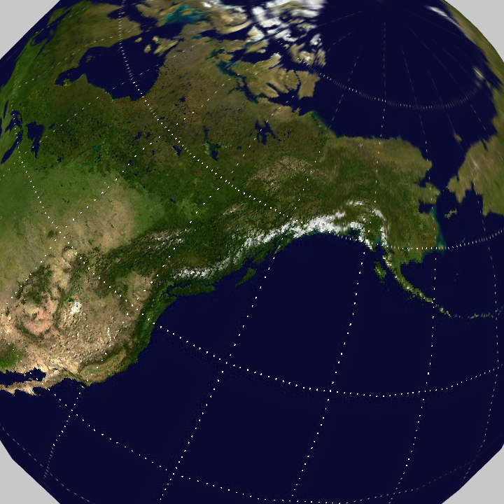
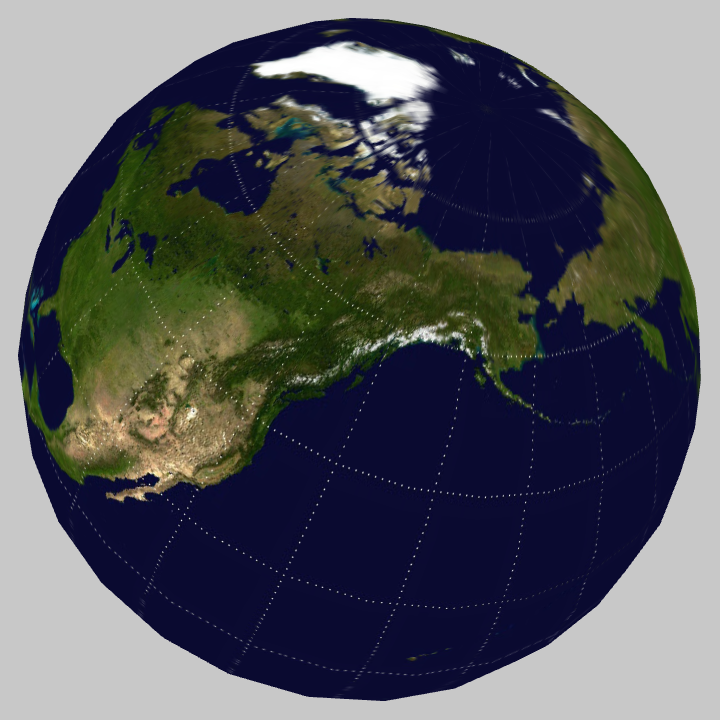
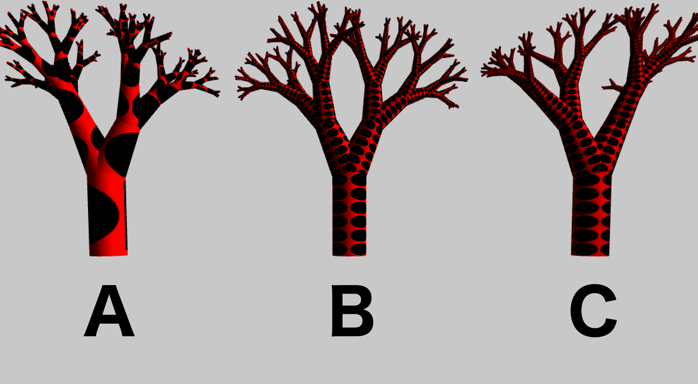

# Using textures on a 3d primitive

*By: [ Davide Prati](http://www.davideprati.com/) and [Hubris](http://hubris.xyz)*

## Intro

In this chapter we will build the planet Earth from scratch. With a sphere and a texture is much more easier than what its sound. We will work with the `ofTexture` class, and after this chapter you will be able to apply any kind of texture to a 3d primitive. And you will be ready to dig further using shaders and textures [together](/ofBook/chapters/shaders.html#addingtextures).

## Basics: Adding a textures to a sphere

To add a texture to a sphere we need to save the image that we want to apply in the `bin/data` folder. Let's assume that we have saved this [image](http://paulbourke.net/geometry/transformationprojection/earth.jpg) and we want to apply it to a sphere. In order to do this, you need to setup a basic 3D scene, with a sphere and a texture object. Your app.h file should look like this:

```cpp
#pragma once

#include "ofMain.h"

class ofApp : public ofBaseApp{

    public:
        void setup();
        void update();
        void draw();

        void keyPressed(int key);
        void keyReleased(int key);
        void mouseMoved(int x, int y );
        void mouseDragged(int x, int y, int button);
        void mousePressed(int x, int y, int button);
        void mouseReleased(int x, int y, int button);
        void mouseEntered(int x, int y);
        void mouseExited(int x, int y);
        void windowResized(int w, int h);
        void dragEvent(ofDragInfo dragInfo);
        void gotMessage(ofMessage msg);

        ofSpherePrimitive sphere;
        ofLight light;
        ofTexture mTex;
        ofEasyCam cam;
};
```

And your App.cpp file like this:

```cpp
#include "ofApp.h"

//--------------------------------------------------------------
void ofApp::setup(){
    ofDisableAlphaBlending();
    ofEnableDepthTest();
    light.enable();
    light.setPosition(ofVec3f(100,100,200));
    light.lookAt(ofVec3f(0,0,0));
}

//--------------------------------------------------------------
void ofApp::update(){

}

//--------------------------------------------------------------
void ofApp::draw(){
    cam.begin();
    sphere.draw();
    cam.end();
}
```

If you run the App, you will see a sphere without any texture. To add the texture, the `ofTexture` object has to load in memory the `earth.jpg` file.
In the setup method, add these lines:

```cpp
ofDisableArbTex();
ofLoadImage(mTex,"earth.jpg");
```

The call to `ofDisableArbText()` is there for backward compatibility reasons, if you want to know more about these reasons, read this thread on the [forum](https://forum.openframeworks.cc/t/what-does-ofdisablearbtex-do/26377).

The second step is to tell to openFrameworks to apply this texture whenever we want to draw a sphere. Change the `draw()` method as follow:

```cpp
    cam.begin();
    mTex.bind();
    sphere.draw();
    mTex.unbind();
    cam.end();
```

And voila', the Earth is done.


## Mipmaps

A mipmap is something clever, it makes possible that our sphere looks good from far away and also looks good when we look at it really close. Basically, a mipmap is an image that contains our image at different resolutions, from an high resolution version of the image to a lower resolution version. When we look at the planet earth from far away, the lower resolution version of that image will be used to render the sphere, when we look at the sphere closer, the higher resolution image will be use instead. This solution avoid antialiasing effects and increase speed. The wikipedia page about [Mipmaps](https://en.wikipedia.org/wiki/Mipmap) is really interesting, have a look if you want to know more.

This means that we have to resize our planet earth image at different resolutions and to decide which one to render depending on the case? no, openFrameworks comes in our help with a simple method, `generateMipmap()` that will do all this work for us. Change the setup method as follow:

```cpp
ofDisableArbTex();
ofLoadImage(mTex,"earth.jpg");
mTex.generateMipmap();
```

Alternatively, you can call `enableMipmap` before loading the texture:

```cpp
ofDisableArbTex();
mtex.enableMipmap();
ofLoadImage(mTex,"earth.jpg");
```

Now, there are different ways on which these images with different resolutions are used internally by openGL. By default, in openFrameworks, these images are linearly interpolated using `GL_LINEAR`. To change the default behaviour, there is a method called `setTextureMinMagFilter()`.

If we add this line after `mTex.generateMipmap()`

```cpp
ofTexture.setTextureMinMagFilter(GL_LINEAR_MIPMAP_LINEAR, GL_NEAREST)
```

 The image will change as follow:




As you can see, we get the perks of the mipmap, but because we set the magnitude to `GL_NEAREST`, on where the texture is closer, we'll get that pixelated look.

If we change the code as follow

```cpp
ofTexture.setTextureMinMagFilter(GL_LINEAR_MIPMAP_LINEAR, GL_LINEAR)
```

we obtain an image like the following one:




## Texture repetition

Sometimes you need to repeat a texture all over a mesh. To repeat the texture of the planet Earth around a sphere is weird, but to repeat the texture of a bark over a tree makes sense. Let's see how to do this and how the texture repetition and the mipmaps change the aspect of the meshes. For the sake of clarity, I will skip the code to load the mesh of a tree and to load the texture, and I've also used as texture an image containing a black ball on a red background, to make the artifacts more visible.

The new method that we see in the following code is `setTextureWrap()`. It takes two argument, the first one defines if the texture should repeat on the x, the second one if the texture should repeat y.

Let's observe this image containing the same three with different texture's usage.



The example A is created with the following code:

```cpp
// assuming that in App.h you have
// ofTexture bark
ofLoadImage(bark, "bark.png");
```
No texture repetition nor minMag filter is set

The example's B code looks like:

```cpp
ofLoadImage(bark2, "bark.jpg");
bark2.setTextureWrap(GL_REPEAT, GL_REPEAT);
bark2.setTextureMinMagFilter(GL_NEAREST, GL_NEAREST);
```
As you can see, the texture is repeated correctly, without scaling it, but the final part of the tree looks really pixelated.
Let's fix this in the example's C code

```cpp
ofLoadImage(bark3,"bark.jpg");
bark3.setTextureWrap(GL_REPEAT, GL_REPEAT);
bark3.generateMipmap();
bark3.setTextureMinMagFilter(GL_LINEAR_MIPMAP_LINEAR, GL_NEAREST);
```

Of course this tree looks more like a leopard than a tree, try out different texture to obtain a more realistic effect.


