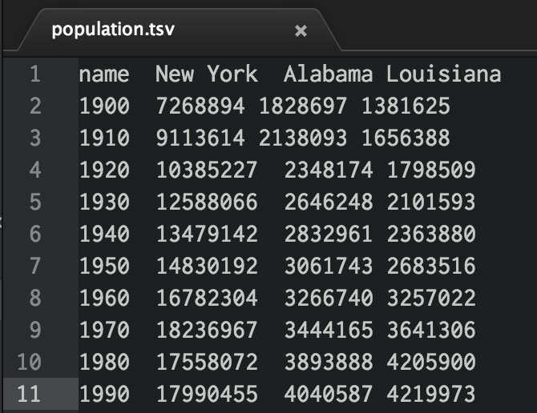

# Information Visualization

*by [Tega Brain](http://www.tegabrain.com/)*


This chapter gives a brief overview of working with data in openFrameworks and introduces some basic information visualization techniques. It describes steps in the data visualization process, common file formats and useful functions for converting data. It is structured around an example of a time based plot.

## Intro

### What is data? What is information?
Computation has driven a huge increase in our capacity to collect, sort and store recorded observations and yet our ability to understand them remains limited by our sensory and cognitive capacities.

Data are symbols or numerical interpretations that represent the properties of objects and environments (Ackoff, 1989). Information is produced from analyzing the context and descriptive qualities of data, it relates to why the data was collected. Although these terms are often used interchangeably, in the field of information science data is generally thought of as a raw material from which information is produced through analytical processes. Data visualization is a way of interpreting and presenting data and can potentially reveal patterns that might otherwise remain invisible.

### Steps of visualizing data
Ben Fry is a data artist and the author of Visualizing Data (2008), a well-known text outlining data visualization approaches for the Processing programming environment. In this excellent reference text, Fry describes seven stages for visualizing data and these provide a useful structure for approaching data-driven projects. These steps are:

*Acquire:  Obtain the data.
Data is commonly made available in files downloadable from online sources such as weather services, newspapers, census records and from social media platforms. However there are also times when you may need to compile and format data from hardware or sensors. Real-time data is often available via an Application Programming Interface (API), which is an interface and a set of rules that define the process of how other applications can communicate with it. Every API is designed differently and therefore can be communicated with in different ways. This chapter presents two examples of visualising a static dataset imported into OF from external files, and an example that reads data from the New York Times API.

*Parse: Provide some structure for the data’s meaning, and order it into categories.
Once you have obtained your data, before you load it into openFrameworks it is important to parse the data. Parsing means checking the file’s format. Is the dataset tagged correctly? Check that each line of your data is broken up consistently across columns. This can be done in a number of ways such as, printing your file out in the terminal or opening your file in a text editor or spreadsheet program and checking for inconsistencies or gaps.

*Filter: Remove all but the data of interest.
Your dataset is likely to contain extra information not relevant to your visualization. For example in the tab separated (.tsv) file shown in figure 1, the file has columns like station ID and latitude and longitude that are not relevant to the first visualization example. As the data is from only one location, location information can be removed so that they do not interfere with the your visualization process.

*Mine: Apply methods from statistics or data mining to discern patterns in your data and place the data in mathematical context.
As Fry (2008) outlines, the mining stage of visualizing data involves applying statistical methods and math to your dataset to analyze patterns within it. This might be as simple as identifying the minimum and maximum values so that you know the range of variation in its values. Depending on your data, you may wish to calculate an average or a median value.

*Represent: Choose a basic visual model, such as a bar graph, list, or tree.

*Refine: Improve the basic representation to make it clearer and more visually engaging.

*Interact: Add methods for manipulating the data or controlling what features are visible.

## Working with data files in openFrameworks

### Common data file structures: tsv, csv, xml, json
Data is available and stored in specific file types that have particular structures and syntax. The following file types are some of the most common forms of structuring data.

*CSV: Comma separated values (csv) files are files where entries in the lines of the file are separated by commas. These can be directly imported into OF by using the ofxCsv add-on. This add-on allows for the reading and writing of CSV file.

*TSV: Tab separated value files are text files where entries in the lines of the file are separated by tabs. These can be directly imported into OF.

*XML: XML files are written in EXtensible Markup Language. XML files are composed of tags that define a data hierarchy for the values within them. A tag has a name, attributes and values within it. If tags are nested, the enclosing tags are called parent tags and the nested tags are the children. The tags next to one another are siblings.

```html
<parentTagName>
    <childtagName attributeName="attributeValue">TagValue</childtagName>
    <siblingTag />
</parentName>
```


Reading an XML file in OF requires the use of an OF addon called ofxXmlSettings.

*JSON: JSON stands for ‘javascript object notation’. This is a human readable file that is built on two structures, a collection of name/value pairs which can be realized in OF as a struct and an ordered list of values, realized as a vector. JSON files also are parsed using an OF addon called ofxJSON, see example 2.XX for how to implement this.


### Example - Visualizing Time Series Plot

**Step 1 Acquire:** This section works through an example of a data visualization of US population data downloaded from the United States Census service here: http://www.nber.org/data/census-decennial-population.html

**Step 2 Parse and Filter:** Open this file in a spreadsheet program and inspect its contents. You will see that there is population data for all the regions of the USA from 1900-1990. This example visualizes the total population data and data from New York, Louisiana and Alabama so we must construct the data file with only the data from those particular states. You will want to copy and past the selected data into a new spreadsheet so that you are working with a file structure that looks like Figure 1. If you are working in Excel to parse the data, this program has a useful way of transposing the table. Copy a row from the original spreadsheet, and then paste it into your new file by selecting the "Paste Special" option in the Edit menu and selecting "Transpose" before hitting ok. You can delete the data labelled 'fips' in this file.



Check the data for any gaps or strange characters.

Ensure that you do not have any extra labelling or text at the top and bottom of the data columns. Your final file should only have labels in the header. The header is the row of data labels in the first row.

**Step 3 Mine:** Check each variable for minimum and maximum values so that you know the approximate range of variation. Check for any strange outlying values.

Save your file as a tsv file. If you are using Excel, you can save as a 'tab delimited text' file and then rename the file with the .tsv extension in the finder, or simply resave it with this extension in a text editor.

Loading Your file into an oF Project.

First, generate a new project remembering to include the add-ons if your data is in csv or json format. Then save the parsed population data file to the ‘bin’ folder of your OF project.

Once your project file is set up, we will now work through writing the code.

Organising your data.

First, we will need several structures to keep our data organised and allow easy access to it.

*Vectors? Explain here – or has this happened elsewhere?

Vectors are an important data structure for storing lists of data in OF. Here we define a vector of structs, where each struct is a list of variables, and each list of variables holds the values from each line of our data file.

Structs are useful way for declaring lists of related variables with one name and stored in one block of memory. In this case, each struct contains data points from each column of our data file. Each variable of a struct can then be accessed by a single pointer.
The following defines a struct called popData that contains five variables. Like all declarations, structs are declared in the h file of your program. This struct is then wrapped in a vector called dataPoints.

IN THE MAIN.CPP FILE:
We will add fAppGlutWindow.h to the main.cpp file. This makes the default window manager based on glut. This class provides all the functionality to create a window, change/query it's size and position.
Our file will look like this:

```cpp

#include "ofMain.h"
#include "ofApp.h"
#include "ofAppGlutWindow.h"


int main( ){

    ofAppGlutWindow window;
	ofSetupOpenGL(&window, 1024,768, OF_WINDOW);			// <-------- setup the GL context

	// this kicks off the running of my app
	// can be OF_WINDOW or OF_FULLSCREEN
	// pass in width and height too:
	ofRunApp( new ofApp());

}

```


IN THE H FILE:
We define a struct called popData which will hold the values from each line of our file.
```cpp
typedef struct {

	int year;
	float ny;
	float lou;
	float ala;

} popData;
```

We will then declare a vector that contains a list of structs, one for each line of our data file.

```cpp
class ofApp : public ofBaseApp{
	public:
vector < popData > dataPoints;
};
```

Explain typedef ???

We will also need to declare some variables to contain minimum and maximum values from our dataset.

```cpp
int minYear;
    int maxYear;
    float maxValue;

    ofRectangle dimensions;
```

In summary, our H FILE will look like this:
```cpp
#pragma once

#include "ofMain.h"


typedef struct {

    int year;
    float ny;
    float lou;
    float ala;

} popData;


class ofApp : public ofBaseApp{

public:
    void setup();
    void update();
    void draw();

    void keyPressed  (int key);
    void keyReleased(int key);
    void mouseMoved(int x, int y );
    void mouseDragged(int x, int y, int button);
    void mousePressed(int x, int y, int button);
    void mouseReleased(int x, int y, int button);
    void windowResized(int w, int h);
    void dragEvent(ofDragInfo dragInfo);
    void gotMessage(ofMessage msg);


    vector < popData > dataPoints;

    int minYear;
    int maxYear;
    float maxValue;

    ofRectangle dimensions;


};
```


IN THE OFAPP FILE:

We will now load the data file into OF using the ofBuffer class.

#### ofBuffer Class
ofBuffer will read the data into a buffer, which is temporary storage for it, as we write code to restructure and process it.
ofBuffer is what is known as a convenience class, and provides easy methods for reading from and writing to files. A convenience class simply means that this is a class that doesn’t do anything by itself but wraps or allows access to the functionality of a group of other classes.

#### Buffer Functions
`ofBufferFromFile()` is a function that allows you to load your data file.
```cpp
ofBuffer file = ofBufferFromFile("population.tsv");
cout << file.getText();
```
This loads the population.tsv file into a variable called ‘file’.
Then we have printed out the contents of the variable ‘file’ using `getText()` which allows us to check the file has loaded correctly.


`getFirstLine()` Returns all text up to the first new line which ends at the first carriage return.

```cpp
 string nameLine = file.getFirstLine();
```

We have used `getFirstLine()` to copy the first line of the file containing the labels into a string called ‘nameLine’.


`getNextLine()` returns the next row of the data file as marked by `\n` or `\r` (new line characters).
`isLastLine()` returns the last line of the file.

These functions can be combined to run through each line of data in the buffer and we can nest this function in a conditional function that checks we are not at the last line of our file, here the `while()` loop is used. When the last line of the file is reached, our program will leave the buffer and this loop.

```cpp
	while (!file.isLastLine()){
        	string line = file.getNextLine();
        	vector < string > split = ofSplitString(line, "\t");
        	popData data;
        	data.year = ofToInt(split[0]);
        	data.ny = ofToFloat(split[1]);
        	data.lou = ofToFloat(split[2]);
        	data.ala = ofToFloat(split[3]);
        	dataPoints.push_back(data);
    	}

```

This block of code has arranged our data into a vector called dataPoints which contains a struct popData.

Using this structure, any data points can now be accessed by referring to the vector, the variable name and the index number.

For example dataPoints[0].year; returns the first entry of the year list and dataPoints[0].ny; returns the first entry of the ny list.

Now we have loaded the data from our file into a structure that allows us to access it and manipulate it easily from the rest of our program. Putting this all together in the ofApp::setup() is shown below. The last five lines of this code sets up the dimensions and color of the graph.

```cpp
void ofApp::setup(){


    ofBuffer file = ofBufferFromFile("population.tsv");
    cout << file.getText();

    // grab the first line, which is just labels.
    string nameLine = file.getFirstLine();

    while (!file.isLastLine()){
        string line = file.getNextLine();
        vector < string > split = ofSplitString(line, "\t");
        popData data;
        data.year = ofToInt(split[0]);
        data.ny = ofToFloat(split[1]);
        data.lou = ofToFloat(split[2]);
        data.ala = ofToFloat(split[3]);
        dataPoints.push_back(data);
    }


    // let's find the min and max years, and the max value for the data.
    // years are easy, we know it's the first and last year of the array.

    minYear = dataPoints[0].year;
    maxYear = dataPoints[dataPoints.size()-1].year;

    // search linearly through the data to find the max value;

    maxValue = 0;
    for (int i = 0; i < dataPoints.size(); i++){
        if (dataPoints[i].ny > maxValue){
            maxValue = dataPoints[i].ny;
        }
        if (dataPoints[i].lou > maxValue){
            maxValue = dataPoints[i].lou;
        }
        if (dataPoints[i].ala > maxValue){
            maxValue = dataPoints[i].ala;
        }
    }

    // let's round up to the next "10" on the max value
    maxValue = ceil(maxValue / 10) * 10;


    dimensions.x = 150;
    dimensions.y = 150;
    dimensions.width = 700;
    dimensions.height = 400;


    ofBackground(180,180,180);

}

```

**Step 4 Represent.**

The `draw()` part of the code incorporates a for loop that maps the full range of values across the first variable pop to the dimensions of the graph. This is a way to make our graph responsive. If we were to now load in different data, it would be remapped according to how many data points it contains.


```cpp
    void ofApp::draw(){

    ofSetColor(255,255,255);
    ofRect(dimensions.x, dimensions.y, dimensions.width, dimensions.height);

    ofSetColor(90,90,90);
    for (int i = 0; i < dataPoints.size(); i++){

        float x = dimensions.x + ofMap( dataPoints[i].year, minYear, maxYear, 0,dimensions.width);
        float y = dimensions.y + ofMap( dataPoints[i].ny, 0, maxValue, dimensions.height, 0);

        ofDrawCircle(x,y, 2);
    }

}
```

Now you have a very basic working graph, the next steps are to add labels and interactivity.

**Step 5 Refine.**
We need to declare a font in ofApp.h file:
```cpp
    ofTrueTypeFont font;
    ofTrueTypeFont labelFont;
```

and then in the testApp.cpp file `setup()` we load the font.  Also remember to copy the font file to the bin folder of your application, here our font file is called "bfont.ttf".

```cpp
	font.loadFont("bfont.ttf", 20);
	labelFont.loadFont("bFont.ttf", 10);
```

We add x axis labels using the following block of code:

```cpp

    for (int i = 0; i < dataPoints.size(); i++){

        if (dataPoints[i].year % 10 == 0){
            float x = dimensions.x + ofMap( dataPoints[i].year, minYear, maxYear, 0,dimensions.width);
            float y = dimensions.y + dimensions.height;
            ofSetColor(90,90,90);
            labelFont.drawString(ofToString( dataPoints[i].year), x, y + 20);
            ofSetColor(220,220,220);
            ofLine(x, y, x,  dimensions.y);
        }
    }

```

So what does this mean? First we are iterating though each line of the dataPoints vector using a for loop. For each value of i, we access a line of the vector. As we do this we check:

```cpp
if (dataPoints[i].year % 10 == 0){
```
This if statement with a modulo asks if the year is divided by 10, is there a remainder? In other words, it is a conditional that will only be true for every 10 year interval (no remainder). Within this conditional, we are then calculating an x value that is mapped from the start of our graph area to the end (0 to dimensions.width). This evenly spaces our x values. The y value is calculating the top of the graph (dimensions.y + dimensions.height).

We then print the labels to the screen with:
```cpp
labelFont.drawString(ofToString( dataPoints[i].year), x, y + 20);
```

So this selects the font (labelFont.) writes to the screen (drawString) converts the data to a string variable type (ofToString) and then takes the year from each line of the vector (dataPoints[i].year) and positions it at the x and (y+20) calculated.

Lastly we draw some grid lines at each x value from the top of the graph (y) to the bottom of the graph (dimensions.height).


We add y axis labels using this code:
```cpp
for (int i = 0; i <= (int)maxValue; i++){
        if (i % 1000000 == 0){
            float x = dimensions.x;
            float y = dimensions.y + ofMap(i, 0, maxValue, dimensions.height, 0);

            ofSetColor(90,90,90);
            labelFont.drawString(ofToString( i ), x - 70, y + 5);
            ofLine(x,y, x-5,y);
        }
    }

```
Here we have a for loop generating values for i that range from 0 to maxValue. Similarly, the if statement will only generate ticks and labels for every 1000000 of these values. What interval is chosen for this statement will depend on the range of the data. As we are dealing with population data, we will choose to have a label at intervals of 1 million. This time y values are mapped from 0 to the height of the graph so they are spread evenly, then text and a line are drawn using the same functions as on the x axis.

**Step 6 Interact.**

Finally we can add interactivity by creating clickable tabs that will switch between the different datasets in our file. This section turns our code into a state machine, where we define a variable called ‘which’ which is toggled between the values 0,1 and 2. The value of ‘which’, dictates what dataset will be displayed.

In ofApp.h, declare which:
```cpp
int which;
```

Then insert this block of code to the mousePressed part of the openFrameworks template. These conditionals define regions around the title labels and turns them into buttons. When the button is clicked, ‘which’ changes state to the value shown.


```cpp
void ofApp::mousePressed(int x, int y, int button){


ofRectangle rect = font.getStringBoundingBox("NewYork", dimensions.x, dimensions.y-15);
    if (rect.inside(ofPoint(x,y))){
        which = 0;
    }

    rect = font.getStringBoundingBox("Louisiana", dimensions.x + 160, dimensions.y-15);
    if (rect.inside(ofPoint(x,y))){
        which = 1;
    }

    rect = font.getStringBoundingBox("Alabama", dimensions.x + 320, dimensions.y-15);
    if (rect.inside(ofPoint(x,y))){
        which = 2;
    }
```


Finally we must return to void ofApp::draw() and make some changes. In the for loop where we draw the data points we change from this:
```cpp
    for (int i = 0; i < dataPoints.size(); i++){

        float x = dimensions.x + ofMap( dataPoints[i].year, minYear, maxYear, 0,dimensions.width);
        float y = dimensions.y + ofMap( dataPoints[i].ny, 0, maxValue, dimensions.height, 0);

        ofDrawCircle(x,y, 2);
    }

```
to this:
```cpp
    for (int i = 0; i < dataPoints.size(); i++){

        float value;
        if (which == 0) value = dataPoints[i].ny;
        if (which == 1) value = dataPoints[i].lou;
        if (which == 2) value = dataPoints[i].ala;

        float x = dimensions.x + ofMap( dataPoints[i].year, minYear, maxYear, 0,dimensions.width);
        float y = dimensions.y + ofMap( value, 0, maxValue, dimensions.height, 0);


        ofDrawCircle(x,y, 2);
    }

```

We have created a new float ‘value’ to hold each data point. Depending on the value of ‘which’, value is assigned data from one of the three data sets in the tsv file.

Finally, the last step is to draw the titles to the screen, which is done by adding the last block of code underneath the for loop we just changed.

```cpp

	if (which == 0) ofSetColor(180,90,90);
    	else ofSetColor(90,90,90);
    	font.drawString("New York", dimensions.x, dimensions.y-15);

    	if (which == 1) ofSetColor(180,90,90);
    	else ofSetColor(90,90,90);
    	font.drawString("Alabama", dimensions.x + 160, dimensions.y-15);

    	if (which == 2) ofSetColor(180,90,90);
    	else ofSetColor(90,90,90);
    	font.drawString("Louisana", dimensions.x + 320, dimensions.y-15);

```


## More Useful functions for working with data

### Conversion functions (ofSplitString, ofToString, ofToInt)
Conversion functions enable the manipulation of each line of data in the buffer. They allow each line to be split and for parts of it to be placed into string or integer variables.
```cpp
ofSplitString(line, "\t" );
```
This function splits a string at a specified character. It has two arguments, the first is the name of the string to be split and the second is the character at which it is to be split. (\t indicates split at a tab)
```cpp
string ofToString(integer, value);
```
ofToString object takes a number and turns it into a string representation of that number. The first argument is the integer to be transformed and the second indicates to how many decimals places you want to use. If you do not specify the second value, then the default value used is 7.
```cpp
ofToInt(const string &intString);
ofToInt(string);
```
Similar to the previous, this object converts string or a string representation into an actual integer variable.
```cpp
ofToFloat(const string &intString);
ofToFloat(string);
```
This object converts another variable type into an a float variable.


## Working with APIs
### What are APIs?
An API is an Application Programming Interface. This means it is a software to software interface allowing one piece of software to interact automatically with application. It takes the form of a set of instructions for how a program can be designed to interface with the online service. Every API is different with some being very well documented while others are not.

You can write programs in openFrameworks so that data an be pulled from an API automatically and used in your sketch. For example if we want to be able to pull data from the New York Times API we would inspect the instructions for doing so here: http://developer.nytimes.com/docs.


## Further resources
JSON validation tools like: http://jsonlint.com/

## References
Fry, B. (2008). *Visualizing Data,* O’Reilly Media.  
Ackoff, R. L. (1989). *From Data to Wisdom. Journal of Applied Systems Analysis,* 16, 3–9.
