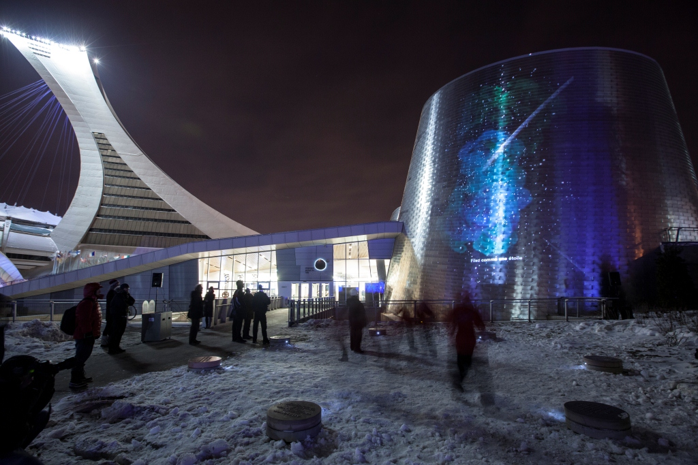
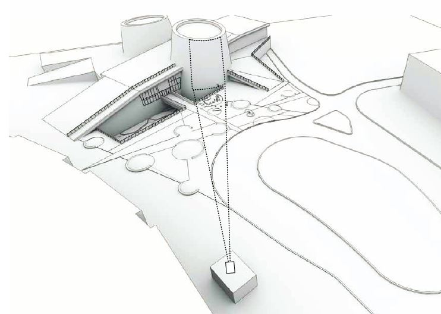
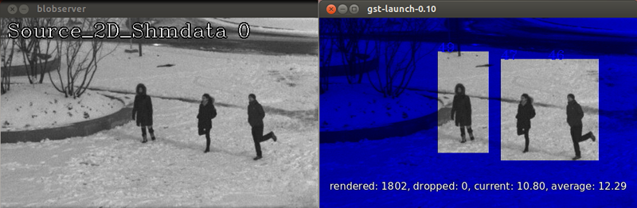

# Case Study: Choreographies for Humans and Stars 

Permanent interactive outdoor installation developed by [Daily tous les jours](http://dailytouslesjours.com/ "Daily tous les jours") for Montreal's planetarium (2014). 

Chapter by Eva Schindling, Pierre Thirion

## Project Overview 

*Choreographies for Humans and Stars* is a 3 year / permanent outdoor installation hosted at Montreal's Rio Tinto Alcan Planetarium. The interactive projection on the building's facade invites passers-by to a series of impromptu performances inspired by the different mechanics of planets and stars. Exploring both dance and astronomy, participants use their bodies to understand celestial dynamics like eclipses, forces of attraction and combustion. Tracked by a camera system, the movements across the dance stage directly control the projected animations. 

### Call, Competition and Commission
The project started out as an official call by the [Public Art Bureau of the City of Montreal](http://ville.montreal.qc.ca/artpublic), who is in charge of commissioning and maintening permanent artworks around the city. For the opening of the new planetarium they wanted to commission Montreal's very first interactive and permanent artwork.

The official brief asked for an interactive digital installation utilizing the building facade for projection and simultaneously offering an intervention on the plaza in front of the venue's entrance. Sound excluded. The artist needed to ensure that the work outlasts a minimum of 3 years in the public space, come summer come winter. No light pollution. The budget for realizing the project was set at $262.000 CAD (before taxes).

The selection process took ~9 months and included three phases:

 1. Request for qualifications (RFQ): jury select 6 artists based on portfolio
 2. Request for Proposals (RFP): jury select 3 finalists based on preliminary artistic concept
 3. Final concept: jury selects winner based on complete project proposal (photo montage, video simulation, detailed budget, technical details, production calendar, supplier and collaborator list)

After passing all phases we were officially commissioned by the Public Art Bureau in June 2012.

### Timeline, wished-for and realistic
From first brainstorms to final hand-over the mammoth project took impressive 28 months to complete. That's 10 months longer than the official brief planned for. When you work with that many players (the city, the planetarium, collaborators..) your first and second attempt at a project timeline is bound to fail. Our more pragmatic goal was to get it all done by November 2013, with the main intention to avoid all the snow and coldness that comes along with Montreal's winter season. Naturally we slipped right past that goal, and had our big opening midst lots of snow mid January, with temperatures ranging between -15 to -25. 

- 2011 Sept: official call
- 2011: preliminary concept
- 2012: final concept
- 2012 June: official commission
- 2012 Fall: ideation (revision)
- 2013 May : interaction scenario
- 2013 June : prototype
- 2013 July: content animation workshop 1
- 2013 July-Aug: tech sourcing and purchase
- 2013 Aug: start software
- 2013 Sept: camera installation, calibration
- 2013 Dec: content animation workshop 2
- 2014 Dec/Jan: on site tests and finetuning, install furniture
- 2014 Jan 23rd: opening
- 2014 Feb: maintenance

### Everyone involved

Credit lists quickly grow long. The internal DTLJ team includes Mouna and Melissa being the main artists with the vision, Eva handling software, Pierre being heavily involved with visual identity and video production, Michael handling the LEDs in the outdoor furniture. The list of external collaborators include a producer (Nicolas), a choreographer (Dana), a technical director (Frédérick), a software engineer (Emmanuel), a film animator (Patrick), an industrial design studio (Dikini), a graphic designer (Studio Atelier), a concrete workshop (M3Beton), engineers, a camera man, ... 

## Ideation, Narrative and Content

Where did the ideas come from? And how many ideation stages did we go through? ...

### Ideation process
[Space, and what is happening in it, feels really abstract for the tiny humans we are. When thinking about it, one can easily feel overwhelmed by its complexity. 

Even helped by an ever increasing amount of impressive technology, the most advanced scientists still can only guess what is happening above our heads. Dark matter, black holes, infinity...those are notions it is hard to wrap our heads around. Partly because it is not something we can feel, touch or smell.]

Space is a great unknown, and that is what inspired us. Being invited by a planetarium – a place where you will find all the latest and accurate data you need to know about space – we felt that our role could be to bring a physical experience that would help visitors to not only understand but also feel what space is about.

The ideation process started with the idea of connecting people to the infinitely big.

One of our early inspiration was the opening scene of the Belà Tarr's movie "*Werckmeister Harmonies*", in which a couple guys end a party by dancing a solar system waltz where the Earth and the Moon are turning around an eclipsing Sun.

### Content
Solar system, proximity because we wanted people to keep a certain connection with the content.
Started wrapping our heads around the content, around all the specificities of the planets...
Felt that it would be more inspiring to open it up a little bit, and think about the relationships between them. Opportunities to create connections between people.
Celestial mechanics. 
As described by Wikipedia: Celestial mechanics is the branch of astronomy that deals with the motions of celestial objects.

### Choreographer
Working with a choreographer. Using their bodies, participants come to understand celestial dynamics together. 

### The narrative
The sequential structure.
Defining the scenes: stars, attraction, revolution, combustion...
Diagram?
Choreography-driven narrative

### Interaction design
Interaction scenarios, testing sessions. ...

Iterative process
Intervention on the ground. Need to define a physical space as the interface for people to interact.
From paper to full scale prototyping.
Challenges: 
- Communicate the instructions
- Allow for freedom of movement: have people move inside the space without having their eyes always stucked on the screen
- No sound feedback

Test sessions with users of all ages. 
Basic openFrameworks prototype to load videos and display the matching instructions
These test sessions allowed us to:
- adjust the writing
- refine timings of the scenes

### Producing video content
Following the spirit of the ABCs of astronomy and dance, the video content was created using simple analog animation techniques.

Since the project will be permanently installed, we involved locals in the making of these images, aiming to create a sense of ownership within the community that will be living next to the project for many years to come.

We did so through animation workshops with kids aged 7 to 12 from the neighborhood. We invited Patrick Péris, a film director with a strong background in animation, to create a framework for these workshops. After a few days spent exploring techniques for each ones of the scenes, he came up with a list of interesting set ups to trigger the kids' creativity.

 - **Shooting stars**: stop-motion animation 
 - **Starry skies**: backliit black foam core in which the kids pierce their constellations
 - **Eclipse**: draw your own planet with watercolor
 - **Revolution**: light painting stop-motion animation
 - **Sun**: liquids filmed in micro video

Every session lasted for 3 hours, with a total number of 80 kids.
Then post-production
Lots of time spent selecting content

### The dance stage

While camera and projector stay intangible, it was important to give the project a physical presence. The main purpose was to define the active tracking zone for the participants, but also to present a  version of the project during the daylight hours, while the projection was off. After going through many design proposals (a stage, a ring, a ballet pole!) we landed on 7 planet-like concrete steles positioned in a circle formation. A single white LED on each stele enhanced their presence. Installing the underground cabling for those 7 LEDs proved a big challenge and required the $10k rental of a ground-unfreezing device. (most expensive LEDs ever!) The delicate LEDs also caused the most confusion, as participants mistook them to be the secret sensors triggering the interaction.

## Finding the Technical Solutions

### The site and its challenges
Outdoor installation, all weather conditions, run after sunset, every night for at least the next 3 years. 

#### Put the Projector with the animals
The projection surface being a 20 meter high building covered with shiny tiles, we needed a high-lumen projector, which naturally ate almost half the budget. To save further costs, and for protection and easy-access reasons the projector was placed in the neighbouring building - the Montreal biodome - which has a large glass facade facing the planetarium. A glass replacement window needed to be cut out of the slightly tinted facade of the biodome. A simple $15 heater makes sure our window is kept clear of ice and condensation. Additionally we negotiated with the landscape architects of the site to be able to trim any trees that were likely to grow into our projection cone during the next 3 years.

Distance between projector and projection surface: 87m. 

Projection size: 13.5m times 19m.  

#### Camera style and placement
In an ideal camera tracking scenario you have a controlled indoor environment that gives you a clean top-down camera view and lets you create the lighting and background design of your choice. Our site at the planetarium is outdoors and therefore subject to all possible weather conditions. The scene can change from dark (cement floor) to white (snow), and often gets temporarily lit up by the flashlights of a driving-by car. 

There's the obvious fact that it's rather dark at night, and that our camera system needed to live through -40 degrees in the winter. The distance between any possible camera location and the dance stage being around 20 meters, made it impossible to consider a Kinect solution. When first brainstorming technical solutions for tracking, our list included thermal imaging cameras (\$\$ and low-res), laser range finders (\$\$ and limited to one dimension), stereoscopic 3d cameras (), and cameras placed at 2 different angles to allow for dynamic mapping of two perspectives into one (double the fun). 

Finally we settled on going with one single camera, with high sensitivity that would make use of the few surrounding lights, and a tracking solution that could convert the 2d information into 3 dimensions.

Strict architecture codes prohibited us from being able to place the camera on top or somewhere along the surface of the planetarium building. After long negotiations we were limited to placing our camera at a quite low angle slightly to the left of the projection site. > more overlapping > need to rotate perspective

#### Network negotiations
After calculating our camera's bandwidth requirements (resolution 800x600px * framerate 28fps * color depth 8bit * compression raw = xxx bit/sec) we discovered that the local network wouldn't allow us to send the camera data directly to the projector site. We had to place one computer in close proximity to the camera, and another computer next to the projector. 

The network being part of the city network, was heavily controlled, subject to 15min timeout internet access. A couple of request forms later we had a LAN connection between our two computers. VPN access for remote maintenance and remote updates took about 2-3 months, and we are still in negotiation to get SSH access. (Cities protect their networks).

### Hardware Choices

#### Camera and lens
We picked Basler's [Scout scA1600-28gm](http://www.baslerweb.com/products/scout.html?model=130 "camera on baslerweb.com") camera for it's high sensitivity. Going black&white eliminates any color focused tracking, but gives you even more sensitivity for low-light situations. High-res camera, gigabit ethernet. lens [Fuji HF12.5SA-1](https://www.fujifilmusa.com/products/optical_devices/machine-vision/2-3-5/hf125sa-1/ "lens on fujifilmusa.com") ... Surveillance style, we packed the camera into an ugly weatherproof housing (#HEB26D0A000B), together with a power supply, a heater and a fan system.

#### Computer hardware and OS
Computer #1: Intel Core i5 3570K 3.40G/6M/S1155 with 8GB ram
Computer #2: Intel Core i7 3770K 3.40G/8M/S1155 with 16GB ram and an Asus GTX680 graphics card. 
Both computer run Ubuntu 12.04 LTS 

#### Projector
Projector model: Barco HDX-W20, resolution of 1920*1200px (16:10) used in horizontal view. 

### System
**[include diagram]**

### Choice of tracking software
For the tracking software we found a collaborator in Emmanuel Durand, part of the research lab at [Society for Arts and Technologies](http://www.sat.qc.ca/ "Society for Arts and Technologies"). Emmanuel had developed [blobserver](https://github.com/paperManu/blobserver "blobserver on github") - a opencv based software to implement various realtime detection algorithms - and was looking for first test projects. For the project he further developed and adapted blobserver to our needs. Blobserver is designed to take in multiple camera or video sources, detect entities and then report its findings via OSC. Further configuration and communication of blobserver can be done through OSC as well, which allows for easy integration into any OSC-friendly software. 

#### Method of Tracking
To track participants on our performance stage we used blobserver's HOG detector - [histogram of oriented gradients](http://en.wikipedia.org/wiki/Histogram_of_oriented_gradients "Histogram of Oriented Gradients on wikipedia") - which learns from a database of human shapes to detect human outlines. The HOG detection is processing optimized by limiting its areas of interest to areas with recent movements, detected by background subtraction. 

First tracking tests were done based on publicly available databases of human shapes [link?], but to get better results for our environment (camera view at slight top-down angle, specific background, ..) we had to create our own database, and compute our own model:

1. collect images from site
2. crop images to human shapes with blobcrop
3. produce model with blobtrainer
4. run blobserver with model

#### Tracking challenges
finetuning of tracking (challenges: weather, perspective, kids, overlapping)

reducing our expectations (tracking gestures, people rotating, specific movements) to a minimum (presence and location), making use of system limitations (onLost events)

Even though the camera could output 1628 x 1236px we went with a binning value of 2 and therefore a resolution of 800 x 600px. To achieve better sensitivity. 

### Choice of visualization software
This project provided the perfect excuse to jump back into openFrameworks. Previous company projects relying on computation have mostly lived in the realm of music (max/MSP) or the web (python, node.js). On the rare occasion that visuals were involved, a short timeline demanded a quick solution (processing). We also fall victim to the general mistake of overpolluting the neverending prototype and simply turning it into production software. 

This project, with its demands of high-res video animations, provided a decent time frame allowing for proper project development and gave me all the right reasons to go back to openFrameworks (its been a while). Helpful at this stage was as well that most prototyping of content and interaction happened with non-interactive videos produced with video editing software. Any truly interactive prototype had to wait for all the pieces (camera placement on site, tracking success, etc.) to come together.  

OpenFrameworks was chosen as the programming environments because of C++'s fast processing speed, it's addons, the range of projects out there that deal with video and animation content and present their code out there on github, and mostly its avid and rarely not-helpful community forum. A main reason was also openFrameworks cross-platform ability, as i am personally on a Windows 7 laptop, while the office is reigned by Macs, and the decision had been made to give it a try with Linux computers for the installation. So being able to jump between the different operating systems while still developing the same software, naturally a plus. 

### Additional software used
 - [processing](http://processing.org/ "processing") ... for creating communication dummies
 - [switcher](https://code.sat.qc.ca/redmine/projects/switcher "switcher at code.sat.qc.ca") ... to access the GigE camera via shared memory
 - [libshmdata](https://github.com/sat-metalab/libshmdata "libshmdata on github") ... to share video via shared memory
 - oscdump, ..
 - Photoshop, Final Cut Pro? ... image/video content production

## Developing the Visualization Software

#### Development setup
The openFrameworks linux install (# ) is build for codeblocks, yet as i have come to like the code editor Sublime for its lightweightness and simplicity, i chose to program in Sublime and then compile by simply running the `make` command inside the terminal. (Also useful: Run software from terminal with `/bin/emptyExample` command). On my laptop (win7) i code with Sublime, but compile and run the software from within Codeblocks. 

Besides its purpose of providing a history of the code, i used github here mainly to push code between computers. And to search my own code history, as i still rarely dare to roll back and forth within the git repository itself. 

My usual programming setup includes an open browser with tabs open on the openFrameworks forum, the openFrameworks documentation page, and github (to search specific function uses). 

#### Externals used

 - **ofEvents** ... for controlling the animation
 - **ofxOsc** ... for communication btw. computers
 - **ofxOpenCv** ... for running a perspective transformation
 - **ofxGui** ... to build a GUI

### Quick summary of what the app does
The application navigates the projection through a sequence of 6 tableaus that have different themes and interaction instructions. When participants follow the instructions (and hop, or line-up, or run around, or stand still ..) the application receives their position data, analyses it for each scene's interaction requirements, and then controls video elements on the projection. In some scenes the participants movements are directly mapped to a video element movements, in other scenes participant movements simply cause videos to appear/disappear on screen.

### Sequential structure
The transition from one scene and segment to the next is either time-dependent or based on the participants successful execution of instructions. Yet even if no interaction goal is achieved, a maximum timer will still cause the transition to the next scene. 

#### Transitions based on time or interaction goals
At the beginning of each segment a time reference is taken, and a global success variable is reset to false.

    segmentStart = ofGetUnixTime();
    success = false;
    
A timing counter is then advanced at every step (use system time and not frames) and checked against the current segment's maximum time limit. Reaching the time limit or a positive flag on the success value both can cause the transition to the next segment.

    segmentClock = ofGetUnixTime() - segmentStart;

    if (autoplay && !transition) {
    
        // TRANSITION based on TIME
        if ( segmentClock >= scenes[scene].duration[segment] ) {
            endSegment(); 
        }
           
        // TRANSITION based on SUCCESS 
        if (success) {
            endSegment();
        }
        
    }

While the system usually goes through all scenes sequentially, one scene can be skipped if not enough participants are detected in the interaction zone. Additionally the system can fall into an idle mode, if no participants has been detected at all during the last 30 seconds. After the idle mode it resumes with scene 1. 

### Incoming tracking data
The tracking software *blobserver* on the camera computer acts as OSC server and is configured to send tracking data to the IP address of the projection computer. Similarly the openFrameworks app registers itself as OSC client on the OSC server and is able to tune the tracking parameters according to specific scene requirements. 

**[reference network/OSC chapter]**

To be able to test and simulate the two-way OSC communication i created several processing dummies, which turned out to be very useful for software tests without the full setup. (1: dummy to print out received message, or oscdump. 2: dummy to send tracking parameters. 3: dummy to simulate incoming tracking data)

#### Dealing with split message blocks and framerate differences

The OSC messages send by the tracking software take this format:

    /blobserver/startFrame      389 1
    /blobserver/hog             1028 4 8 0.4 1.2 77 0 0
    /blobserver/hog             1028 4 8 0.4 1.2 77 0 0
    /blobserver/hog             1028 4 8 0.4 1.2 77 0 0
    // iiiffiii > id x y vx vy age lost occluded
    /blobserver/endFrame

Each message with the address line `/blobserver/hog`  signifies the tracking data for one recognized shape, and communicates blob id, position, velocity, age, etc. Bounded by the `/blobserver/startFrame` and `/blobserver/endFrame` messages, an arbitrary amount of tracking messages (= current number of *people* recognized) can be received at any time. The frequency of those message blocks depends on the framerate of *blobserver*. 

As it can't be guaranteed that *blobserver* and openFrameworks always run on the same framerate, it could happen that multiple tracking updates arrive before openFrameworks calls `update()` again. It was therefore necessary to *store away* new incoming data and only trigger the actual processing of that data after all incoming messages have been parsed. 

Similarly it could happen that half of the tracking messages are received before, and the other half after the `update()` loop. To avoid this splitting of data to cause glitches (system thinks a specific blob-id disappeared, but just hasn't been updated yet), it was necessary to hold off all processing of data, before at least one `/blobserver/endFrame` has been received during each openFrameworks frame. 

#### Storing and updating tracking data
The received tracking data is stored in a map of `Blob` objects `std::map<int,Blob> blobs`. Maps gives all the flexibility of vectors (loop, iterator, etc.) but also allow for easy access of entities via their id. **[see chapter ref maps/vectors]**  

If new tracking data arrives, the system first checks if the blob already exists in the map or if it needs to be created. Then it updates the instance with the new data. 

    while (receiver.hasWaitingMessages()) {
    
        // ...
        if(m.getAddress() == "/blobserver/hog") {
        
            // parse incoming message arguments
            int blobid = m.getArgAsInt32(0);
			int posx = m.getArgAsInt32(1);
			int posy = m.getArgAsInt32(2);
        
            // first look if object with that ID already exists
            std::map<int,Blob>::iterator iter = blobs.find(blobid);
            if( iter == blobs.end() ) {
                // didn't exist yet, therefore we create it
                blobs[blobid].id = blobid;
                //....
                ofAddListener( blobs[blobid].onLost, this, &planeApp::blobOnLost );
            }
            
            // now update the blob (old or new)
            Blob* b = &blobs.find(blobid)->second;
            b->setRawPosition(posx, posy);
            b->setVelocity(velx, vely);
            b->age = age;
            //....
        
        }
    
    }

After the new tracking information has been filed away into the blobs map, the blobs map is cleaned of all non-updated members. 

#### Perspective transformation
For better analysis of the individual blobs x|y position (alignment, position within stage, distance btw blobs, etc.), we transformed their position information into an top-down perspective that is aligned with the projection. This skewing and rotating of the data is achieved via `cv::perspectiveTransform`. 

**[maybe graphic showing camera view with detection, and top down view in GUI]**

### Implementing video content
All our visual raw material exists in the form of videos (and some images) that originated in analog animation workshops. Besides written instructions that are drawn, everything on the projection is direct video display (no effects). 

#### The quest for the right codec
When we first received the computer hardware, i did a series of performance tests with video files of different codecs to determine how we would prepare our video content. The mistake i made was that i primarily focused on video playback. And once the setup would play multiple video instances at HD resolution, 30fps, in every codec (H.264, photoJPEG, quicktimePNG, animation, raw) while still providing a framerate of 60FPS, i was convinced the top-notch CPU and GPU would be able to handle it all. 

What i didn't consider was the load on the processor that comes from loading, decoding, starting, releasing and deleting of multiple video files within short time spans. This insight finally dawned close to the project's opening date, when more and more photoJPEG and quicktimePNG (alpha) video files were added to the project and the framerate suddenly started to drop. 

Another round of video performance tests (post opening) at that point led to the conclusion that we'd re-encode all videos with the animation codec, and the lowest framerate the video content allowed (5, 10, 15fps). Even though the video files were larger in size, the less strong compression factor minimized the processor's decoding time. LESSON learned.

Still, we encountered a few platform and player-dependent idiosyncrasies. Unsolved mystery: gstreamer doesn't like certain custom resolutions and displays a green line underneath the video (our fix: find a new resolution). 

#### Dynamic video elements
While the background videos appear on schedule and are preloaded by the system, most foreground videos appear dynamically based on participant actions. To be able to handle them easily all dynamic video elements are stored in a vector of shared pointers `std::vector< ofPtr<mediaElement> > fgMedia`. The whole vector of pointers can then be updated and drawn, no matter how few or many videos of shootings stars or planets are currently visible. By using `ofPtr` one doesn't need to worry about properly releasing dynamically allocated memory.  **[ref pointers / shared pointers?]** 

Example: Everytime a user stands still long enough during scene 1, a video element displaying a blinking star gets added to the vector:

    // add new STAR video
    fgMedia.push_back(ofPtr<mediaElement>( new videoElement("video/stars/STAR_01.mov")));
    
    // set position of video, and press play
    ( *fgMedia[fgMedia.size()-1] ).setPosition( blobMapToScreen( blobs[blobID].position ) );
    ( *fgMedia[fgMedia.size()-1] ).playVideo();
    
    // link blob to video, to be able to control it later
    blobs[blobID].mediaLink = fgMedia[fgMedia.size()-1];

**[i am sure there's someone to reference about video]**

#### Preloading versus dynamic loading
In general all video sources that are used in a controlled way (used only as one instance) are preloaded at startup of the software. For video sources that are called up dynamically in possibly multiple instances at once, i use two approaches:

 1. Load the video content when needed, with a threaded video player [possible delay, hickups]
 2. Preload a large enough vector of multiple instances of the video, then cycle through them with a pointer [allows for fast access/display, yet slows down app if used for big video files]

(verdict still out, more testing ahead, also open to helpful insights)

### Event-driven animation
The control of video elements by the blobs (detected participants) is implemented with `ofEvent()` calls. **[reference chapter with events]** Events are an good way of giving objects a way of controlling elements in the baseApp without having to query each objects possible states from the baseApp's update() loop, or without having to give objects a pointer to the whole baseApp. 

Blob objects have multiple events they can trigger to cause actions in the baseApp:

 - **onEnterStage** ... enter stage diameter, used to make videos appear
 - **onLeaveStage** ... leave stage diameter, used to make videos disappear
 - **updatePosition** ... called on every frame, to update position-mapped video elements
 - **onLost** ... not detected anymore (but still alive!), used for Hop! Run! video triggers
 - **onFreeze** ... stopped moving, used to make videos appear or force transitions (all freeze!)
 - **unFreeze** ... started moving again, used to make videos disappear
 - **overFreeze** ... hasn't moved for x seconds
 - **onSteady** ... at same distance to neighbor for x seconds, used to create video bridge
 - **onBreakSteady** ... broke steady distance with neighbor, 
 - **prepareToDie** ... make sure to disconnect all connected videos
 - ... 

**[all the following event-code can probably be skipped]**

`ofEvent` instances are defined in the blob object header:

    class Blob {
        
        ofEvent<int> onLost;            
        ofEvent<int> onFreeze;     
        ofEvent<int> unFreeze; 
        
    }

When a new blob object is created in the baseApp, `ofAddListener()` connect the object's event calls to functions in the baseApp with . 

    // create new blob
    blobs[blobid].id = blobid;

    ofAddListener( blobs[blobid].onLost, this, &planeApp::blobOnLost );
    ofAddListener( blobs[blobid].onFreeze, this, &planeApp::blobOnFreeze );
    ofAddListener( blobs[blobid].unFreeze, this, &planeApp::blobUnFreeze );
    // ... 

When a blob then updates and analyses its position, velocity etc. it can trigger those events with `ofNotifyEvent()`.

    void Blob::evalVelocity(float freezeMaxVel, float freezeMinTime) {
    
        if ( this->vel < freezeMaxVel ) {
            if ( !frozen ) {
                frozen = true;
                ofNotifyEvent(onFreeze,this->id,this);
            }
        } else {
            if ( frozen ) {
                frozen = false;
                ofNotifyEvent(unFreeze,this->id,this);
            }
        }
        
    }

The `ofNotifyEvent()` then triggers the connected function in the baseApp:

    void planeApp::blobOnFreeze(int & blobID) {
    
        if (scene==STARS && blobs[blobID].onStage) {
            // add new STAR video
            fgMedia.push_back(ofPtr<mediaElement>( new videoElement("video/stars/STAR_01.mov")));
            // ...
        }
        
    }

### Debug screen and fineunting interaction
For testing and tuning purposes i run the application on 2 screens with `window.setMultiDisplayFullscreen(true)`, the projection and the debug screen. The debug screen shows a visualization of the tracking data, the scene-relevant states of the blobs, two GUI panels for finetuning parameters, and preview of the projection view. 

To be able to finetune all the parameters that define the interaction (what velocity threshold defines "standing still", how exact does the alignment need to be to activate the eclipse effect, etc.) while testing it on site, it's important to have all variables accessible via a GUI. 

## Fail-safes and dirty fixes 
The nights before the opening were naturally used for heavy test sessions that led to some restructuring, some video updates and lots of parameters finetunings. Late night coding over remote desktop while dressing up every 5 minutes to run outside into the cold to test the changes with camera vision and projection - not the best of scenarios. Combined with the natural occurrence of bugs, suddenly the software didn't seem as stable and fast as a few days ago. A mysterious segmentation fault error kept appearing (not often enough to be obvious), but other pressing issues didn't allow for proper tracing of the error's roots. 

The opening day had me glued next to the projection computer, ready to hit a button or change a parameter, in case of unexpected crashes or lagging framerates. The next day - before the project went live on its daily schedule of 5pm to midnight - turned into an exercise of setting priorities. Instead of going into debug mode and investigating errors, the main goal was to to keep the app going seamlessly during showtime.

### first: keep your app alive
The one good thing about segmentation faults is that they kill your app very fast. The app crashes and in the next frame you are left with your desktop background (which should be black). The perfect fail-safe solution for this is something like [daemontools]( http://cr.yp.to/daemontools.html) (linux), which is a background process that monitors your app and restarts it within a second in case it crashes. 

launchd, lingon, ...

After setting up supervision with deamontools, the app could crash, but all people would see is a few seconds of black (depending on how long the preloading of videos takes on startup). 

### second: framerate cheats
The second concern was the drops in framerate that would come too much videoplayer actions. 
- variables FPS: update animation with fps-dependent value, ofGetLastFrameTime() 
- memory leaks, dropping FPS: regularly terminate app, seamless transitions
- put limits on your number of objects (blobs, video elements)

### always: investigate
- ofLogToFile with dynamic date
- monitor process times for operations to find the bottleneck
- try + catch: not everything throws exceptions!

### finally: optimize
- replace video with opengl-animation
- what to implement with threads?
