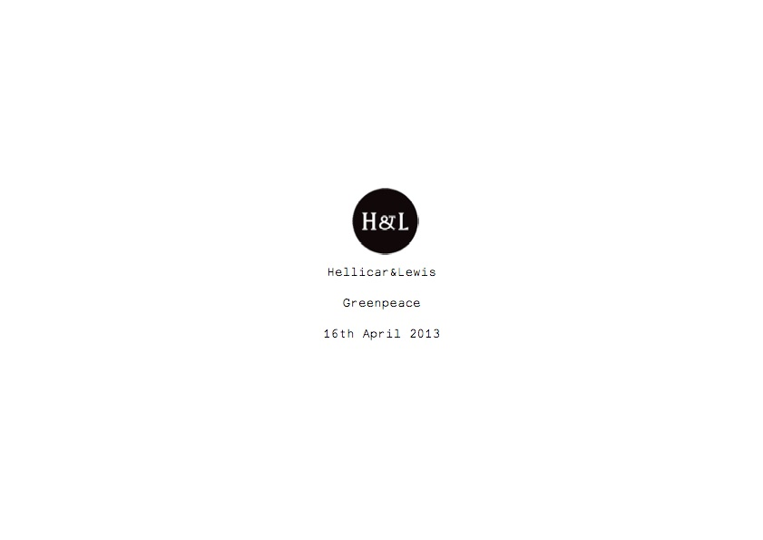
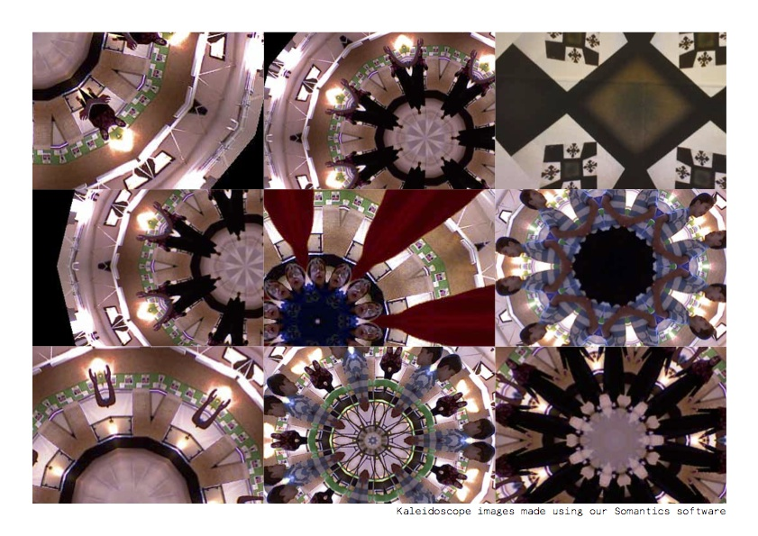
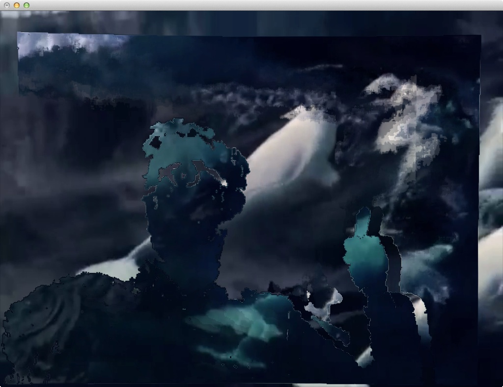
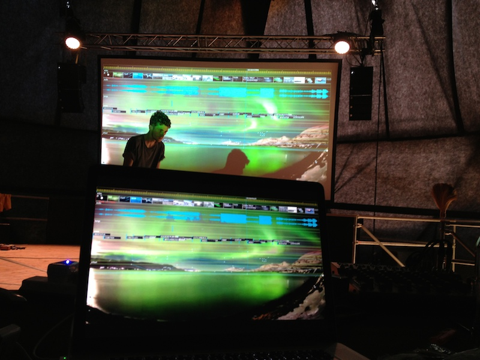

# Anthropocene, an interactive film installation for Greenpeace as part of their field at Glastonbury 2013

## Project Overview

Anthropocene ˈanTHrəpəˌsēn
Adjective
Relating to or denoting the current geological age, viewed as the period during which human activity has been been the dominant influence on climate and the environment.

First of all, you should watch this video, to see the finished project, as part of a wider video all about the Greenpeace Field at Glastonbury 2013.

http://youtu.be/LwokmKqT0og?t=1m12s

## Team and Credits

* Pete Hellicar
* Joel Gethin Lewis
* Paul Earnshaw
* Sarah Toplis
* Bafic
* Kieran Startup

Project uses addons and other code Contributions from:

* Marek Bereza aka Mazbox as part of Cariad Interactive
* **[insert github creators of various addons below]**
* ofxKinect
* ofxSlitScan
* ofxBox2d
* ofxTimeline
* ofxGui
* ofxOpticalFlowFarneback

Thanks to:
* All our families and friends.
* The Greenpeace Family
* Microsoft for being Open
* Theo Watson
* The entire openFrameworks community
* Marshmallow Laser Feast
* Tim Scaffidi
* James George
* YCAM

## Hardware selection

* 1 x 3D Camera - Microsoft XBox360 Kinect
* 1 x Playback and Interaction Computer - MacBook Pro Retina
* 1 x 10K projector
* 1 x Projection Screen
* Sound - 4 x D&B T-10 Top + Amp 2 x Subs

## The Project

### Initial Brief from Client

On 9th April 2013 we were approached by Paul Earnshaw of Greenpeace about a potential installation as part of Greenpeace's Field at Glastonbury 2013, a large music festival in the south west of England. Another studio had previously been in place to create a five day experience due to go live for the public duration of the festival on the 25th of June, but a scheduling conflict had emerged that had meant that they had to reluctantly withdraw.

Paul already had a budget and a unique space picked out for the installation, a large geodesic dome:

### Our response

We initially sought out a projector hire firm, who responded with a quote and a plan for a projection setup that met our requirements for maximum visual impact on a budget:

After some studio thinking, by 16th April we responded with the following document:

We would like this installation to be a relaxing and immersive space. An oasis where the viewer can relax on bean bags looking up at a screen.

We will use a mix of existing Greenpeace footage and a generative soundscape to build a beautiful abstraction of the Arctic.

We would like to project onto the ceiling of the space, using either a rectangular, square or circular projection surface. We will experiment with different projection shapes and see what fits best aesthetically as well as meeting the budget.

We would like to explore the following ideas within the imagery, sound and feeling of the space.

1: The space as a timepiece - trying to have a cycle of sunset, night and dawn - each lasting around five minutes and having a single interaction between the floor and ceiling that is explored graphically and interactively.

2: Kaleidoscopes, shattering or delaying or time stretching footage. Breaking it up into blocks of time. Arranging in grids, or having different delays in different parts. The possibility of peoples movement being mirrored into the video playback in interesting ways, playing with time.

3: Making an oasis away from the rest of the festival that would last around 15 minutes, but raise some points about how the cycle of seasons of the Arctic are being affected.

4: Generative audio - a four channel speaker system that adds depth and texture the visuals.

On April 30th, we recieved an email from Paul:

"..we would love you to implement your proposal in our main feature of the dome at Glastonbury Festival this year..."

We had the project! Now it was time to get real about the budget, and see if we could get some interesting musical collaborators...

During May, we concentrated on discovering what film footage was available, and finalising the production design and kit list. Pete spent many hours working on the edit of the film, aiming to complete it while other negotiations continued.

### Audio negotiations

On May 10th, Pete Hellicar reached out to our friends at Warp, to see if any of their artists would be interested in donating their music to the project, and by the nick of project time we had permission from several artists to use their sounds.

### Supplier change and final budget negotiations and beginning to write the software

By the end of May, we had changed suppliers to ones already working with Greenpeace on their field, and had found replacement kit for our production. We'd also reached a final budget, and I was ready to start coding. Please see below for more details of the actual coding.

At the beginning of June 2014 we received the following image from Paul:

The site awaited us.

### Interactive Background to Delay Maps, and the question of generating the delay map from the Kinect

**[Add visual experimentation from pete inspiring the idea of blobs as delay maps, and thinking about delay maps: First at Fabrica, Then at UVA, Then feedback, With James George writing the addon much easier, Golan list of time works]**

The breakthrough after this initial thinking was to try to think of what other greyscale maps I had seen - from the depth maps of the Kinect.

### Actual Timeline

Here are the folder names of all the folders in my greenpeaceArcticGlastonbury2013 folder.

* 2013_04_11_PlansAndContentFromGreenpeace
* 2013_04_16_ProjectorQuotes
* 2013_04_30_PeteQuoteAndIdeas
* 2013_05_08_GlastoOverviewPlan
* 2013_05_14_PetePlanAndTechList
* 2013_05_20_GuestList
* 2013_05_28_CrewDetailsFromPete
* 2013_05_29_addons
* 2013_05_29_addonsAfterPragmatism
* 2013_05_29_ofxGUIFromDevelopGitHubBranch
* 2013_05_31_AddMaps
* 2013_06_02_BaficInvoice
* 2013_06_03_PeteEffectsFromSomantics
* 2013_06_04_HomeHigherResForPete
* 2013_06_06_CallToActionScript
* 2013_06_12_CrewForFieldReadup
* 2013_06_12_Font
* 2013_06_12_GreenpeaceLogos
* 2013_06_12_MoreCrewBriefing
* 2013_06_13_HuntResult
* 2013_06_13_MoreDurationBits
* 2013_06_13_obviousJimAudioReactiveRing
* 2013_06_16_ofxTimelineVideo
* 2013_06_19_Singleton
* 2013_06_19_VoiceOverOutro
* 2013_06_20_CateringMenu
* 2013_06_20_NewAddonsToTry
* 2013_06_24_CodeForArtFromJeffTimesten
* 2013_06_24_DeadFlock
* 2013_06_24_newFilmAndAudio
* 2013_06_24_ofxAddonsOFXContourUtil
* 2013_07_31_Final50Invoice
* 2013_08_18_ThankYouFromGreenpeace

## Development
### Development Hardware and Software setup

MacBook Pro
15-inch, Mid 2009
Processor  3.06 GHz Intel Core 2 Duo
Memory  4 GB 1067 MHz DDR3
Graphics  NVIDIA GeForce 9600M GT 512 MB

XCode for Development
Chrome for Web Browsing
Sublime Text for logging

### Edited development notes

#### 29th May 2013

oF/of_v0.7.4_osx_release/apps/ofxKinect-demos

Also downloaded ofxKinect. Get gui working first, with ofxKinect, then start on:

* https://github.com/toruurakawa/ofxFakeMotionBlur
* Don't use, use jamezilla https://github.com/kylemcdonald/ofxBlur
* https://github.com/jamezilla/ofxBlurShader
* https://github.com/kylemcdonald/ofxCameraFilter
* https://github.com/vanderlin/ofxBox2d
* https://github.com/NickHardeman/ofxBullet
* https://github.com/fishkingsin/ofxPBOVideoPlayer
* https://github.com/arturoc/ofxPlaymodes
* Don't use, in core now https://github.com/Flightphase/ofxQTKitVideoPlayer
* https://github.com/after12am/ofxTLGlitch
* https://github.com/bakercp/ofxVideoBuffer
* https://github.com/bakercp/ofxVideoUtils
* https://github.com/obviousjim/ofxSlitScan

Doing gui - having to make the projectGenerator to make the projects, generating the examples now.... Recopy over examples after! Did it, just copying in the empty example xcode project, all in here now:

oF/of_v0.7.4_osx_release/examples/gui

Email of notes on development:

On 29 May 2013, at 20:44, Joel Gethin Lewis wrote:

* All ofFloatColor or ofFloatImages
* HSB blob shifts as a mode - crazy colours, also try whole image on slow change using ofmath demos
* Blobs cracking off
* Just blackness on blob
* Slit scan obvs
* ofxbox2d? Kinect demos? Look at memos
* Look at ofxaddons for time ones
* Use ofGui official one
* Have different GUI panes per constructor for ofxScenes (make that)

Think in addon way - indeed that every scene might have addons inside it. That's the way the should be. Addons inside scenes. Scenes are subclasses of ofxScene. Draw it out. Start with slitscan as first scene. Just get that working then use that as basis for ofxScene. Pragmatic! Will need central image creator as input for each scene. Kinect in this case. Don't worry about that for now.

ofparameter is missing! Looking at old OF folder from other project: openFrameworks-develop/apps/devApps/projectGenerator, looking in there in the oF project to try to find what is going on...

openFrameworks-develop/libs/openFrameworks/types contains:

* ofBaseTypes.cpp
* ofBaseTypes.h
* ofColor.cpp
* ofColor.h
* ofParameter.cpp
* ofParameter.h
* ofParameterGroup.cpp
* ofParameterGroup.h
* ofPoint.cpp
* ofPoint.h
* ofRectangle.cpp
* ofRectangle.h
* ofTypes.h

looking for ofpanel

openFrameworks-develop/addons/ofxGui/src

is where it is...opening:

oF/of_v0.7.4_osx_release/examples/gui/guiExample

again, just trying to add it in, in the addon... Nooo thats bad.. should use the develop version... space is low...now working here:

oF/openFrameworks-develop/apps/devApps/projectGenerator

trying to build that and run it, had to select the root oF folder, it was defaulting to a weird one, so selected:

oF/openFrameworks-develop

seems to be working, leaving it for a bit...

error ofFile::copyFromTo source file/folder doesn't exist: oF/openFrameworks-develop/scripts/osx/template/emptyExample.xcodeproj/xcshareddata/WorkspaceSettings.xcsettings

is the error....it's correct:

oF/openFrameworks-develop/scripts/osx/template/emptyExample.xcodeproj/xcshareddata

doesn't have it

openFrameworks-develop/apps/devApps/projectGenerator/bin/data/xcode/template/emptyExample.xcodeproj/xcshareddata

copied that in, and another file inside 

openFrameworks-develop/apps/devApps/projectGenerator/bin/data/xcode/template/emptyExample.xcodeproj/xcshareddata/xcschemes

xcschememanagement.plist

as well...so trying to generate again...seems to be working now......won't paste in the log! (-; trying this now...

oF/openFrameworks-develop/examples/gui/guiExample

nice!

oF/openFrameworks-develop/examples/gui/guiFromParametersExample

next - not that interesting...

oscParametersReceiver
oscParametersSender

together... Neat demo! synchronised gui controls....both crash on exit

sender:

void testApp::setup(){
	parameters.setName("parameters");
	parameters.add(size.set("size",10,1,100));
	parameters.add(number.set("number",10,1,100));
	parameters.add(check.set("check",false));
	parameters.add(color.set("color",ofColor(127),ofColor(0,0),ofColor(255)));
	gui.setup(parameters);
	// by now needs to pass the gui parameter groups since the panel internally creates it's own group
	sync.setup((ofParameterGroup&)gui.getParameter(),6667,"localhost",6666);
	ofSetVerticalSync(true);
}

void testApp::update(){
	sync.update();
}

receiver:

void testApp::setup(){
	parameters.setName("parameters");
	parameters.add(size.set("size",10,0,100));
	parameters.add(number.set("number",10,0,100));
	parameters.add(check.set("check",false));
	parameters.add(color.set("color",ofColor(127),ofColor(0,0),ofColor(255)));
	gui.setup(parameters);
	// by now needs to pass the gui parameter groups since the panel internally creates it's own group
	sync.setup((ofParameterGroup&)gui.getParameter(),6666,"localhost",6667);
	ofSetVerticalSync(true);
}

void testApp::update(){
	sync.update();
}

void testApp::draw(){
	gui.draw();
	ofSetColor(color);
	for(int i=0;i<number;i++){
		ofCircle(ofGetWidth()*.5-size*((number-1)*0.5-i), ofGetHeight()*.5, size);
	}
}

subtle difference in port lines in sync setups...

oF/openFrameworks-develop/examples/gui/parameterEdgeCasesExample

doesn't work...

oF/openFrameworks-develop/examples/gui/parameterGroupExample

Is very intersting - two renderers running at once! Only thing missing is multiple parameters, and images being drawn? could always do that with bools, and the images being displayed on top, sliders and the like could work with that too... Moving big greenpeace video into:

oF/openFrameworks-develop/examples/video/osxHighPerformanceVideoPlayerExample/bin/data/movies

to save space, rather than copying!

oF/openFrameworks-develop/examples/video/osxHighPerformanceVideoPlayerExample

Trying this now...builds with standard movie file in demo, fingers.mov. Now trying, Greenpeace.m4v - works great! audio back too...and pixel access! MOVED video file out of the folder for safety..

copied in this:

oF/openFrameworks-develop/apps/ofxKinect-demos

trying normal ofxKinect first...

oF/openFrameworks-develop/addons/ofxKinect
oF/openFrameworks-develop/addons/ofxKinect/example

trying that... works fine, with motor and everything...so making a mega mix up of:

ofxKinect, ofxGUI and ofHighPerformanceVideo demo

oF/openFrameworks-develop/apps/HAndLGreenpeace/001fromofxKinectExampleAndofxGUI/bin/data/movies

copied that in, changed name to:

oF/openFrameworks-develop/apps/HAndLGreenpeace/001fromofxKinectExampleAndofxGUIAndHighPerformanceVideo

oF/openFrameworks-develop/examples/video/osxHighPerformanceVideoPlayerExample
oF/openFrameworks-develop/examples/gui/guiExample

copying over gui data...that works with gui.. now lets try with high performance video...all works! nice debug screen! saved it out to making of....

#### 30th May 2013

Doing modes, tidying up gui, need to do more on gui tidy up and keys. Made:

oF/openFrameworks-develop/apps/HAndLGreenpeace/002FirstModesAndSlitScan

Builds (-; Pixel drawing is messed up, checking the original high perf demo. Recoded nicely with bits that made sense and were easier to understand...now slitsan! fixed a few gui bugs...

oF/openFrameworks-develop/addons/ofxSlitScan

Made that... Image is PNG RGB for slitscan delay map, so kinect depth map is good for that... right? (-; lucky birthday boy! works great...did grab..

#### 31st May 2013

Showed Pete, performance better on his laptop, no optimisation yet, tried out some maps with bafic...

#### 6th June 2013

First lets do GUI that corresponds to big maps, so we can switch between them... Duplicating multicoloured magic into the folder, so got all that lovely code to work with.. After lunch lets look at mirror Somantics code... Too complicated for now, need some time to sit down and make it work... For now on the Virgin SA flight, lets try some of the addons!

ofxBlur By Kyle McDonald
had to add accelerate, qtkit and corevideo frameworks to make it work..

ofxBlurShader
This is a very lightly refactored version of Kyle McDonald's ofBlur example (https://github.com/kylemcdonald/SubdivisionOfRoam/tree/master/GaussianBlur). It hasbeen updated to OF 007.
Didn't build!

ofxBox2d
trying every example: 

* oF/openFrameworks-develop/addons/ofxBox2d/ComplexPolgonExample - useful for making shatter like effects - how do I texture them?
* oF/openFrameworks-develop/addons/ofxBox2d/ContactListenerExample - useful for tiggering audio samples on ofxBox2D interactions
* oF/openFrameworks-develop/addons/ofxBox2d/CustomDataExample - useful for storing data withing objects, nothing particularly useful there for us at the moment..
* oF/openFrameworks-develop/addons/ofxBox2d/ForcesExample - bunch of forces on mouse action
* oF/openFrameworks-develop/addons/ofxBox2d/JointExample -long chain of pieces
* oF/openFrameworks-develop/addons/ofxBox2d/ofxBox2dExample - line that you can draw and lots of various shapes
* oF/openFrameworks-develop/addons/ofxBox2d/PolygonExample - more line drawing...
* oF/openFrameworks-develop/addons/ofxBox2d/SimpleExample - simple!

ofxBullet

* oF/openFrameworks-develop/addons/ofxBullet/SimpleExample - is simple, several different basic shapes...
* oF/openFrameworks-develop/addons/ofxBullet/CustomShapesExample - needs ofxAssimpMeshHelper - that is in the assimp model loader addon... cool - very fast simulation and * loading of custom shapes - perhaps pete could make custom 3D shapes?
* oF/openFrameworks-develop/addons/ofxBullet/EventsExample - smashing of objects into each other, mouse animation of objects within cube
* oF/openFrameworks-develop/addons/ofxBullet/JointsExample - has long chain of shapes, similar to ofxbox2d example...

ofxCameraFilter

* oF/openFrameworks-develop/addons/ofxCameraFilter/example-graphics - simple camera effects on some rotating shapes, aberation and the like...
* oF/openFrameworks-develop/addons/ofxCameraFilter/example-live - does the same but live, and with an interesting use of an ofMesh

ofxFakeMotionBlur

* oF/openFrameworks-develop/addons/ofxFakeMotionBlur/example - no work

ofxPBOVideoPlayer

* oF/openFrameworks-develop/addons/ofxPBOVideoPlayer/example - seems speedy

ofxPlaymodes

* oF/openFrameworks-develop/addons/ofxPlaymodes/example-pmAV - needs more addons, come back to this..

ofxTLGlitch

* trying oF/openFrameworks-develop/addons/ofxVideoBuffer/example-multi-tap - had to add empty example, couldn't get building....

DONE addon off....

#### 12th June 2013

Greenpeace logos look nice as slit scans! saved all graphics and fonts into:

2013_06_12_Font
2013_06_12_GreenpeaceLogos

Pete gave me new audio and the film for working with duration

#### 13th June 2013

Duration demo is up from James George too:

* Posted demo code from Duration.cc demo github.com/obviousjim/Dur… cc @JGL

got that, put it here:

2013_06_13_obviousJimAudioReactiveRing

and copied into:

OF/openFrameworks-develop/apps/jamesGeorgeDurationDemo/DurationAudioReactiveRing-master

made:

Duration_004_OSX
Duration_004_OSX.zip
durationData

too.. The readme sez:

Duration: Timeline for Creative Code Demonstration

Code used in the demo of Duration:
http://vimeo.com/59654979

Requires ofxRange and ofxDuration
https://github.com/YCAMInterlab/ofxDuration
https://github.com/Flightphase/ofxRange

Download Duration
http://www.duration.cc/ // https://github.com/YCAMInterlab/Duration

Supported by YCAM InterLab Guest Research Project 2012

Getting those.. put in here:

2013_06_13_MoreDurationBits

ofxRange-master.zip
ofxDuration-master.zip

trying this first

OF/openFrameworks-develop/addons/ofxDuration/example-simpleReceiver

totally did it, totally worked - have to show Pete Hellicar it tomorrow, and disuss which controls he wants...made a new track:

Duration/durationData/FirstTry

audio all loaded in fine (-; need to test with film sync, see if that works OK.. try to set the movie time on each frame? will it fuck everything? Basically should make a new version of the app:

OF/openFrameworks-develop/apps/HAndLGreenpeace/003WithOFXDuration

Added:

GUI
SimpleReceiverPort.txt

to data folder too...need to compare with: OF/openFrameworks-develop/addons/ofxDuration/example-simpleReceiver and duplicate the functionality - start with scene control and colour....

MORNING TIME

OF/openFrameworks-develop/addons/ofxDuration/example-simpleReceiver

opening that and taking the functionality over...

ofxDurationTrack sceneTrack = duration.getTrack("/scene");
string currentScene = sceneTrack.flag;

if(currentScene == "VIDEO"){
    currentMode = VIDEO;
}

if(currentScene == "SLITSCANBASIC"){
    currentMode = SLITSCANBASIC;
}

totally works!

#### 16th June 2013

Lets try the video syncing over osc.. Didn't seem to work with:

    float remoteTime = sceneTrack.lastUpdatedTime;
    cout << "Remote time is:" << remoteTime << endl
    float totalLengthOfVideo = greenpeaceVideo.getDuration();
    float percentToSeekTo = remoteTime/totalLengthOfVideo;
    greenpeaceVideo.setPosition(percentToSeekTo);

Hmmm. Sent this to james and got a response:

On 16 Jun 2013, at 19:00, James George wrote: yea it's impossible to call setPosition on a video every frame and have it playback smoothly. Quicktime needs to control its own time. Try this: play the video back normally in openframeworks and then update Duration every frame based on it's position:

https://github.com/YCAMInterlab/Duration#controlling-duration-through-osc

Specifically make sure Duration has its incoming OSC port set and from OF send it a /duration/seektosecond. Get the seconds from the video player.getPosition()*player.getDuration() then create an outgoing OSC message directed at Duration:

Seek	/duration/seektosecond	Second (Float)	 Sets playhead position to the specified second
Sending the /seektosecond message will then trigger an update to come back from Duration to your app and update all the other params.

On Sun, Jun 16, 2013 at 1:49 PM, Joel Gethin Lewis wrote: Hey James, I've been trying to get a Duration app to be able to sync the video playback on an OF app - I used your example and have started trying to sync to the time from a track:

ofxDurationTrack sceneTrack = duration.getTrack("/scene");
string currentScene = sceneTrack.flag;
float remoteTime = sceneTrack.lastUpdatedTime;
cout << "Remote time is:" << remoteTime << endl;
float totalLengthOfVideo = greenpeaceVideo.getDuration();
cout << "totalLengthOfVideo time is:" << totalLengthOfVideo << endl;
float percentToSeekTo = remoteTime/totalLengthOfVideo;
cout << "percentToSeekTo time is:" << percentToSeekTo << endl;
greenpeaceVideo.setPosition(percentToSeekTo);

But it results in stuttering, playback - do you have any tips? How often are the control packets sent? Should I be getting the remote time in a better way? Cheers, Joel

looking at:

https://github.com/YCAMInterlab/Duration#controlling-duration-through-osc

/duration/seektosecond

Is what we want...so need to setup osc, trying to get that working with a simple sender, having problems gaining control from the OF app. Sent this:

On 16 Jun 2013, at 20:48, Joel Gethin Lewis wrote: Hey James, Thanks! It kind of works, but not really. I have my app jumping around it's video when I press t:

case 't':
{
   float newseekposition = (float)mouseX/(float)ofGetWidth();
   ofClamp(newseekposition, 0.f, 1.f); //safety
   greenpeaceVideo.setPosition(newseekposition);
   cout << "New seek position is: " << newseekposition << endl;
}

If the Duration app is set to paused, it updates fine, the playhead moving around when I press T in my app- but I don't get the messages back from Duration! If it isn't paused (the duration app), I get the messages, but I can't move the Duration playhead around with the above messages! Catch 22? What should I do? I want to get the messages back, have it be playing on both ends and be able to seek. At the moment, I can have seeking in my app and Duration, but without messages back. Or messages back, without seeking.

Sending the /seektosecond message will then trigger an update to come back from Duration to your app and update all the other params.

Doesn't seem to be happening? Two little Duration suggestions:

1) Shouldn't ofxDuration have a send to DurationApp method? That would be useful, no? Auto osc.
2) Can I mute the audio of the Duration app in its GUI?

Any thoughts gratefully recieved. Ideally, I'd like either side to be Master if it sends messages to the other. Make sense? My app the true master, but seeking to Quicktime if it gets an occasional timeline change from the Duration app - but how to do that only some of the time? Cheers, Joel

Made new osc send:

On 16 Jun 2013, at 20:51, Joel Gethin Lewis wrote: This is my send, in my update:

//update duration based on the position of the quicktime player
float videoTimeToSend = greenpeaceVideo.getPosition()*greenpeaceVideo.getDuration();
ofxOscMessage m;
m.setAddress("/duration/seektosecond");
m.addFloatArg(videoTimeToSend);
senderToDuration.sendMessage(m);

Got this reply back, and replied:

On 16 Jun 2013, at 21:07, Joel Gethin Lewis wrote: Hey James, I'll take a look. BUT! Looking at this video:

https://vimeo.com/59653952

It looks like I might be better off doing everything in a single OF app. What do you think? Do you think my massive video file (785,526,769 bytes (785.5 MB on disk)) will kill your thumbnail maker? Lets see...Cheers, Joel

On 16 Jun 2013, at 20:53, James George wrote:

Huh! Duration should definitely update when you move the playhead even if it's not playing... Definitely a bug. Must be a bug in the way seektosecond works. This may be a rabbit hole, but try downloading the source from the Duration website (its the entire OF bundle) and see if you can give it a look. it's probalby a simple change to make sure that handleOscOut() works even when it's not playing.

Watched that video above, did this:

jglmacbookprocore2:addons joel$ git clone https://github.com/YCAMInterlab/ofxTimeline.git

Trying:

OF/openFrameworks-develop/addons/ofxTimeline/example-videoRenderer

Worked...tried:

OF/openFrameworks-develop/apps/tryingBigVideoIntoOfxTimeline/example-allTracks

Totally worked! OK - so need to get audio file and video files separately... autosaves...... apple z for undo even works!

#### 17th June 2013

On 17 Jun 2013, at 00:12, James George wrote: the video player posted on the oF list is really nice, but it doesn't support the getCurrentFrame() command which may cause some issues. give it a shot!
On Sun, Jun 16, 2013 at 5:02 PM, Joel Gethin Lewis wrote: IT TOTALLY ROCKS! It totally works with the thumbnailer. Great work. I am going to code it up as a pure OF app, with maybe a little OSC Remote. Did you see the discussion about the new OSX high performance video player? How gnarly is the hookup to the ofVideoPlayer? I just glanced at the code and it didn't seem too bad.. AMAZING. Cheers, Joel
On Sun, 16 Jun 2013, at 21:26, James George wrote: that's me in the video btw ;)
On Sun, Jun 16, 2013 at 4:26 PM, James George wrote: no it'll be fine, the thumbnails generator is really light, it pulls only as it needs. you can also disable it.

Need to decide on the different modes - and do a mirror mode and a proper sparkles mode with direction.. First off, make a new version, with everything in it and timeline and duration stripped out...RIGHT! made this:

OF/openFrameworks-develop/apps/HAndLGreenpeace/004BuiltInOfxTimeLine

All working nice for demo, need to re-add GUI elements for showing and hiding etc... did it on mouse hide... works great with the slitscan control on too...So next, it's really time to do effects...mirror first.. add an x variable for the point....

#### 18th June 2013

doing sparkles first: copied over:

/Users/joel/Documents/Projects/HellicarAndLewis/greenpeaceArcticGlastonbury2013/OF/openFrameworks-develop/apps/HAndLGreenpeace/004BuiltInOfxTimeLine/bin/data/particles

* blob.png
* glitter.png
* sparkle.png
* star.png

as the images for the particles

https://github.com/HellicarAndLewis/MulticolouredMagic/blob/master/Somantics/src/somantics/Sparkles/Sparkles.cpp

Do this with the depth image as input to the blob tracker - or the IR image? 

Get all three modes working first, then have a think about how to get them working as MODES - make a mode object? Look at somantics for how to have scenes. Maybe call it a mode? Construct with a pointer to the test app for easier data steal. Have a vector of things. Just making sparkles for now, made a sparkle cloud, duplicated the spartkcles logic from marekes sparkles from somantics - the one that spawns along the edges of the blobs... great way of doing it! Going to need an FBO to draw the Sparkles into, so looking at:

/Users/joel/Documents/Projects/HellicarAndLewis/greenpeaceArcticGlastonbury2013/OF/openFrameworks-develop/examples/gl/fboTrailsExample

Lets make it first, then do a InstallationMode object, based on what Sparkles actually needed. tightly coupling into testApp at the moment with a passed pointer, but whatever works for now...Compilation problems, forward declaration because of pointers to testApp...

http://stephanschulz.ca/downloads/singleton.zip

had a look, from :

http://forum.openframeworks.cc/index.php/topic,12466.msg54372.html#msg54372

the first one i found was about singletons which allows you to have global variables that can be accessed by all classes; i.e. all .cpp files. Bollocks to singletons... bad for test app, decoupled...trying to get the FBO to play nicely with the slitscan and the sparkles

FBO->SLITSCAN is working:

RGB fbo!

ofImage distortionMap;
distortionMap.allocate(someSparkles.theFBO.getWidth(), someSparkles.theFBO.getHeight(), OF_IMAGE_COLOR);
someSparkles.theFBO.readToPixels(distortionMap.getPixelsRef());
distortionMap.resize(timeline.getVideoPlayer("video")->getWidth(), timeline.getVideoPlayer("video")->getHeight());
slitScan.setDelayMap(distortionMap);

setup:
theFBO.allocate(aWidth, aHeight, GL_RGB);

draw:
theFBO.begin();
ofSetColor(ofColor::black);
ofRect(0,0,theFBO.getWidth(), theFBO.getHeight());
ofSetColor(ofColor::white);
float circleX = theFBO.getWidth()/2.f;
float circleY = theFBO.getHeight()/2.f;
float circleRadius = min(circleX, circleY);
ofCircle(circleX,circleY, circleRadius);
theFBO.end();

So the bug is currently with how the cloud of sparkles is being drawn - is the contour finder being read properly? I'm trying to draw at:581814,23197.4, at size:13.0935 is where things were trying to draw! co-ordinates must be in pixels inside the contour tracker! dumb......sorted it with:

void Sparkles::update(ofxCvContourFinder* aContourFinder){
	float cloudWidth = theFBO.getWidth();
	float cloudHeight = theFBO.getHeight();

	float contourWidth = aContourFinder->getWidth();
	float contourHeight = aContourFinder->getHeight();

	float widthRatio = cloudWidth/contourWidth;
	float heightRatio = cloudHeight/contourHeight;

	// now just stick some particles on the contour and emit them randomly
	for(int i = 0; i < aContourFinder->nBlobs; i++) {
	    int step = 10;//contourFinder.blobs[i].pts.size()/10;
	    for(int j = 0; j < aContourFinder->blobs[i].pts.size(); j+=step) {
	        cloud.spawn(
	                (aContourFinder->blobs[i].pts[j].x)*widthRatio,
	                (aContourFinder->blobs[i].pts[j].y)*heightRatio,
	                ofRandom(-5, 5), ofRandom(-5, 5));
	    }
	}
}

OK that works

SECOND:

On 17 Jun 2013, at 19:01, Joel Gethin Lewis wrote: This is the mirror: https://github.com/HellicarAndLewis/MulticolouredMagic/blob/master/Somantics/src/somantics/Mirror/Mirror.cpp
Just do a vertical scene and a horizontal scene for now - kaledscope later...DONE... just the vertical one for now...

THIRD:

Paint as a slitscan input. Lets do paint! it's fun... - it is fun! It looks nice....DONE
Quick optimisation - why are both slitscans done separately? Changed it, all seems fine.
BUG: when switching to slitscan basic from sparkles, you don't get any update of the slitscan image, but it works initially...dirty hack to make work - change prevslitscan to -1 if it's not slitscan basic mode...

OK next! sleep...

#### 20th June 2013

FOURTH:

Use the blobs from the depth image - make a bunch of triangles in box2d as greyscale image that floats up and ADD that to slitscan...dropped in box2d, all working ok:
OF/openFrameworks-develop/apps/HAndLGreenpeace/006AddingOFXBox2D
bit slow, need to look at optimising...

#### 21st June 2013

grabbing some addons:

* https://github.com/maxillacult/ofxPostGlitch
* https://github.com/outsidecontext/ofxPSLevels
* https://github.com/neilmendoza/ofxPostProcessing - http://www.neilmendoza.com/ofxpostprocessing/
* https://github.com/julapy/ofxOpticalFlowLK
* https://github.com/timscaffidi/ofxOpticalFlowFarneback
* https://github.com/Flightphase/ofxCvOpticalFlowLK

doing a quick look at them before supper.... lazy! look at in the morning....the next evening! ok addons first....

doing this:

ofxCvOpticalFlowLK - no readme, no draw, moving on - could use the draw image into an FBO easily

ofxOpticalFlowFarneback - OF/openFrameworks-develop/apps/bunchOfAddonsTrying/ofxOpticalFlowFarneback
looks beautiful! definitely develop this one post stripped down version.... easy conversion to greyscale for the coloured one

ofxOpticalFlowLK - OF/openFrameworks-develop/apps/bunchOfAddonsTrying/ofxOpticalFlowLK
similar look to ofxOpticalFlowFarneback but not as pretty, use the other...

ofxPostGlitch - OF/openFrameworks-develop/apps/bunchOfAddonsTrying/ofxPostGlitch
lots of fun effects and already in an FBO! just do these effects on either the live video OR the depth image, but put into the slitscan

ofxPostProcessing
3D demo, with 
    post.createPass<FxaaPass>()->setEnabled(false);
    post.createPass<BloomPass>()->setEnabled(false);
    post.createPass<DofPass>()->setEnabled(false);
    post.createPass<KaleidoscopePass>()->setEnabled(false);
    post.createPass<NoiseWarpPass>()->setEnabled(false);
    post.createPass<PixelatePass>()->setEnabled(false);
    post.createPass<EdgePass>()->setEnabled(false);
nice, but all in 3D - doing a quick hack to draw the video grabber in the scene. No, couldn't get it working, need to draw it to a texture and draw in space, no thank you...

ofxPSLevels

s += "\nbrightness (b/B) : " + ofToString(levels.brightness);
s += "\ncontrast (c/C) : " + ofToString(levels.contrast);
s += "\nsaturation (s/S) : " + ofToString(levels.saturation);
s += "\ngamma (g/G) : " + ofToString(levels.gamma);

nice to have this as a post effect for everything.

OK, lets get on with the other direction mirror AND the kaleidoscope..... should be relatively straight forward, just drop in for now. get rid of box2d?

taking out ofxbox2d - that;s better, but why is just video playback so slow? Having a look now... optimised the video only draw section...Still not fast, do it through the fucking still scan with the image that does nothing....taking out colour.....made a few more slitscans...

* ALLBLACK.png
* ALLWHITE.png
* NOHelvetica.png
* Rewind.png
* YesGillSans.png

left in bangs..turned on snapping...they look ok, can work on these...working on horizontal mirror, made notes, did it not quite right...

This is wrong:

case SLIGHTLY BUGGERED RERVERSED VERTICAL MIRROR:
{
    ofxCvColorImage mirrorImage;
    mirrorImage.allocate(timeline.getVideoPlayer("video")->getWidth(), timeline.getVideoPlayer("video")->getHeight());
    mirrorImage.setFromPixels(timeline.getVideoPlayer("video")->getPixels(), mirrorImage.getWidth(), mirrorImage.getHeight());
    mirrorImage.updateTexture();
    bool usingNormTexCoords = ofGetUsingNormalizedTexCoords();
    
    if(!usingNormTexCoords) {
        ofEnableNormalizedTexCoords();
    }
    
    mirrorImage.getTextureReference().bind();
    
    ofMesh mesh;
    mesh.clear();
    mesh.addVertex(ofVec3f(0, 0));
    mesh.addVertex(ofVec3f(0, ofGetHeight()));
    mesh.addVertex(ofVec3f(ofGetWidth()/2, 0));
    mesh.addVertex(ofVec3f(ofGetWidth()/2, ofGetHeight()));
    mesh.addVertex(ofVec3f(ofGetWidth(), 0));
    mesh.addVertex(ofVec3f(ofGetWidth(), ofGetHeight()));
    mesh.addTexCoord(ofVec2f(0, 0.25));
    mesh.addTexCoord(ofVec2f(0, 0.75));
    mesh.addTexCoord(ofVec2f(1.0, 0.25));
    mesh.addTexCoord(ofVec2f(1.0, 0.75));
    mesh.addTexCoord(ofVec2f(0, 0.25));
    mesh.addTexCoord(ofVec2f(0, 0.75));
    mesh.setMode(OF_PRIMITIVE_TRIANGLE_STRIP);
    ofSetColor(ofColor::white);
    mesh.draw();
    
    mirrorImage.getTextureReference().unbind();

    // pop normalized tex coords
    if(!usingNormTexCoords) {
        ofDisableNormalizedTexCoords();
    }
    break;
}

This is right

case HORIZONTALMIRROR:
{
    ofxCvColorImage mirrorImage;
    
    mirrorImage.allocate(timeline.getVideoPlayer("video")->getWidth(), timeline.getVideoPlayer("video")->getHeight());
    mirrorImage.setFromPixels(timeline.getVideoPlayer("video")->getPixels(), mirrorImage.getWidth(), mirrorImage.getHeight());
    mirrorImage.updateTexture();
    
    bool usingNormTexCoords = ofGetUsingNormalizedTexCoords();
    if(!usingNormTexCoords) {
        ofEnableNormalizedTexCoords();
    }
    
    mirrorImage.getTextureReference().bind();
    
    ofMesh mesh;
    mesh.clear();
    mesh.addVertex(ofVec3f(ofGetWidth(), 0));
    mesh.addVertex(ofVec3f(0, 0));
    mesh.addVertex(ofVec3f(ofGetWidth(), ofGetHeight()/2));
    mesh.addVertex(ofVec3f(0, ofGetHeight()/2));
    mesh.addVertex(ofVec3f(ofGetWidth(), ofGetHeight()));
    mesh.addVertex(ofVec3f(0,ofGetHeight()));
    mesh.addTexCoord(ofVec2f(1.0, 0.25));
    mesh.addTexCoord(ofVec2f(0.0, 0.25));
    mesh.addTexCoord(ofVec2f(1.0, 0.75));
    mesh.addTexCoord(ofVec2f(0.0, 0.75));
    mesh.addTexCoord(ofVec2f(1.0, 0.25));
    mesh.addTexCoord(ofVec2f(0.0, 0.25));
    mesh.setMode(OF_PRIMITIVE_TRIANGLE_STRIP);
    ofSetColor(ofColor::white);
    mesh.draw();
    
    mirrorImage.getTextureReference().unbind();
    
    // pop normalized tex coords
    if(!usingNormTexCoords) {
        ofDisableNormalizedTexCoords();
    }
}

Getting a bit better...fixing the controls - some of the keys were clashing. Red lines on the screen indicate track in a and out below the main timeline. 

Keys for Duration/ofxTimeline:

Note on OS X the COMMAND key is used, on Linux and Windows the CTRL key is used

Function	Shortcut
Cut Selection	command+x
Copy Selection	command+c
Paste Selection	command+v
Undo	command+z
Redo	shift+command+z
Select all keyframes in Focused track	command+a
Add all keyframes in Focused track to selection	command+shift+a
Delete all selected keyframes	delete or backspace
Nudge keyframes a little	arrow keys
Nudge keyframes a little more	shift+arrow keys
Expand Focused track	alt+e
Collapse all tracks	alt+c
Evenly distribute track sizes	alt+shift+c

Sped things up by taking off vertical sync and smoothing too, 30fps. Did kaleidoscope, little bugs I think...turned the update into a proper switch statement, really improved performance! All good, enough for tonight....

#### 23rd June 2013

OK first thing to do is to take over all the Kinect stuff from:

cariad/reactickles/oF/openFrameworks-develop/apps/zHarp/006withMemoLogic

So taking that over now....Making it all in:

OF/openFrameworks-develop/apps/HAndLGreenpeace/008NewKinectAndPsychBear

Taking over the code, adding the display to the blank scene.... Trying to get the saving working....got it working - it was the bad characters! : and &. That's working, now neatening up the gui screen, adding a blank screen and taking out pointless Kinect modes. OK thats nice, now lets get the psych fur working...All in and the gui in too!

OF/openFrameworks-develop/apps/HAndLGreenpeace/009ShatterExperiment

trying shatter...trying to make it work but there seems to be a conflict when I try to include box2d. Hmmm

all i had to do was change shatter.h to :

include "ofMain.h"
include "ofxOpenCv.h"
include "ofxBox2D.h"

from:

include "ofMain.h"
include "ofxBox2D.h"
include "ofxOpenCv.h"

Via OF Forum post: http://forum.openframeworks.cc/index.php?topic=7165.0 :

paulf london Posts: 22
Re: Weird codeblocks 007 build errors
Reply #5 on: April 05, 2012, 02:12:39 PM
in testApp.h having #include "ofxOpenCv.h" at the top of my include list solved the issue for me

Crazy... OK. got that working, but way too slow...

float timeSinceLastShatter = ofGetElapsedTimef() - timeOfLastShatter;

if(timeSinceLastShatter > 10.f){ //every 2 seconds make some more....
    float shatterWidth = theFBO.getWidth();
    float shatterHeight = theFBO.getHeight();
    float contourWidth = aContourFinder->getWidth();
    float contourHeight = aContourFinder->getHeight();
    float widthRatio = shatterWidth/contourWidth;
    float heightRatio = shatterHeight/contourHeight;
    
    // now just stick some particles on the contour and emit them randomly
    for(int i = 0; i < aContourFinder->nBlobs; i++) {
        int step = 20;
        
        shape.clear();
        
        for(int j = 0; j < aContourFinder->blobs[i].pts.size(); j+=step) {
            shape.addVertex((aContourFinder->blobs[i].pts[j].x)*widthRatio,
                            (aContourFinder->blobs[i].pts[j].y)*heightRatio);
        }
        
        // This is the manual way to triangulate the shape
        // you can then add many little triangles
        // first simplify the shape
        shape.simplify();
        // save the outline of the shape
        ofPolyline outline = shape;
        // resample shape
        ofPolyline resampled = shape.getResampledBySpacing(256); //dude
        //ofPolyline resampled = shape.getResampledBySpacing(100);
        // triangulate the shape, return am array of triangles
        vector <TriangleShape> tris = triangulatePolygonWithOutline(resampled, outline);
        // add some random points inside
        addRandomPointsInside(shape, 255);

        // now loop through all the tri's and make a box2d triangle
        for (int i=0; i<tris.size(); i++) {
            ofxBox2dPolygon p;
            p.addTriangle(tris[i].a, tris[i].b, tris[i].c);
            p.setPhysics(1.0, 0.3, 0.3);
            p.setAsEdge(false);
            if(p.isGoodShape()) {
                p.create(box2d.getWorld());
                triangles.push_back(p);
            }
        }
        
        // done with shape clear it now
        shape.clear();
    }
    
    timeSinceLastShatter = ofGetElapsedTimef();
}

Let's just spray triangles out from the top of the blobs...like sparkles but with triangles....triangles lame, circles work! Had it running on pete's laptop all lovely...

#### 24th June 2013

OK, things to try this morning before lunch:

DONE 1. feed in current frame as greyscale for the slitscan
DONE 2. try a slitscan mode where I make a spikey slitscan mode - like in divide by zero, going to need OF/openFrameworks-develop/addons/ofxContourUtil from julapy
make the triangles shaded? make an ofMesh of it?
DONE 3. try the full video, or the mirror vertical/horizontal for the background of the kaleidescope
DONE - flock it .4. try a flock attracted to blobs....

OF/openFrameworks-develop/apps/HAndLGreenpeace/010WithSpikyBlobsFlockAndSelfSlitScan

Made that. starting with 1. SELFSLITSCAN - super easy:

if(timeline.getVideoPlayer("video")->isFrameNew()){
    slitScan.setDelayMap(timeline.getVideoPlayer("video")->getPixelsRef());
    slitScan.addImage(timeline.getVideoPlayer("video")->getPixelsRef());

Next on to spikey mode! Was going to use:

ofxContourUtil-master

From julapy, but it's all in:

void ofPolyline::simplify(float tol){

In core, so lets have a go with that...also have:

ofPolyline ofPolyline::getSmoothed(int smoothingSize, float smoothingShape)

This is the logic from Divide by Zero:

// contour simplification/manipulation

int numberOfBlobs = videoContourFinder.blobs.size();

if(numberOfBlobs > 0){
		//if we have at least one blob
	curve.resize(numberOfBlobs);
	curveSmooth.resize(numberOfBlobs);
	curveSimplify.resize(numberOfBlobs);
	curveCvSimplify.resize(numberOfBlobs);
	float mx = gui.getValueF("AURA_SIMPLIFICATION");
	float scale1	= mx;
	float scale2	= mx * 140;
	float scale3	= mx * 0.1;
	bool noneSmooth = gui.getValueB("AURA_IS_SMOOTH");
	bool simplifyCV = gui.getValueB("AURA_IS_CV");
	float auraScale = gui.getValueF("AURA_SCALE");
	bool scaleFromStage = gui.getValueB("AURA_SCALE_FROM_STAGE");
	
	for(int i = 0; i< numberOfBlobs; i++){
		curve[i] = videoContourFinder.blobs[i];
		ofPoint centreOfStage = ofPoint(camWidth/2.f, camHeight);
		
		if(scaleFromStage){
			curve[i].scaleBlob(centreOfStage, auraScale); //scale from the base of stage
		}else {
			curve[i].scaleBlob(curve[i].centroid, auraScale); //else do it from the centroid
		}
		
		if(noneSmooth){ //smooth it
			cu.smooth( curve[i].pts, curveSmooth[i].pts, scale1 );
		}else{
				//do nothing.
		}
		
		if(simplifyCV){
				//cv simplify it
			simplifyDP_openCV( curve[i].pts, curveCvSimplify[i].pts, scale3 );
		}else{
				//just simplify it
			cu.simplify( curve[i].pts, curveSimplify[i].pts, scale2 );
		}
	}
}

So lets have a look at the demo here:

/Users/joel/Documents/Projects/HellicarAndLewis/greenpeaceArcticGlastonbury2013/OF/openFrameworks-develop/examples/graphics/polylineBlobsExample

Very useful demo....used all the code from demo and ofPolyline in general. Looks nice, ended up doing a simplify down to 10 points.... Let's move onto changing the background for the kaleidoscope...did it with the vertical mirror as the background, pretty.. Downloaded:

https://github.com/jefftimesten/CodeForArt
https://github.com/jefftimesten/CodeForArt/tree/master/Chapter004-physics/012-flock/src

Is what i used for Whiteheat anyhow... jefftimesten = jeff crouse. Lets use it again...flock it, too slow too lame no fun... lets do it with particles instead...Looks ok. Going to crack on with the movie....changed name to:

OF/openFrameworks-develop/apps/HAndLGreenpeace/010WithSpikyBlobsParticlesAndSelfSlitScan

Doing the audio now and new film in:

2013_06_24_newFilmAndAudio

Copied in and took over to Pete's computer so he could have a play....he is sequencing...

#### 25th June 2013

Shower! was lovely. Long drop too.

TODO today:
lets do white fur first...looks great...copying over to pete...

DONE 1) kaledscope is always, (2n)+1 : 3,5,7,9,11,13,15,17,19 19 as the limit... which is up to 9
DONE 2) add WHITE FUR to: VERTICALMIRROR, HORIZONTALMIRROR, KALEIDOSCOPE, MIRRORKALEIDOSCOPE, SLITSCANBASIC

copied in the new slitscans:

* 00_ALLBLACK.png
* 01_ALLWHITE.png
* 01_random_grid.png
* down_to_up.png
* left_to_right.png
* right_to_left.png
* soft_noise.png
* Triangle_001.png
* Triangle_002.png
* Triangle_003.png
* Triangle_004.png
* Triangle_005.png
* up_to_down.png

look amazing!

First, kaleidoscope - want always even! timeline.addCurves("star", ofRange(2, 12)); - so just double it...
Second, adding white fur.....to VERTICALMIRROR, HORIZONTALMIRROR, KALEIDOSCOPE, MIRRORKALEIDOSCOPE, SLITSCANBASIC

#### 26th June 2013

Just changed the fur to not have any alpha (white fur that is) also added non-ofxTimeline GUI to everything...

### Explanation and Discussion of Development in Detail

#### ofxKinect, as a possible input to ofxSlitScan

One of the benefits of using a platform like openFrameworks is that when people do release extras or "addons" they inevitably interface with the core - interesting results can be found by thinking about how addons can interface with each other using the core as a bridge.

In ofxKinect and ofxSlitScan's case, both addons used the same type of data:

unsigned char* getDepthPixels();       ///< grayscale values //from ofxKinect.h

and

void setDelayMap(unsigned char* map, ofImageType type); //from ofxSlitScan.h

So connecting them was simple:

slitScan.setDelayMap(depthPixels); //from testApp::update() in testApp.cpp

This kind of separation demonstrates encapsulation or the information hiding qualities of software - the utility of not having to know the specifics of the implementation of the functionality described, merely the inputs required and outputs produced.

http://en.wikipedia.org/wiki/Encapsulation_(object-oriented_programming)
http://en.wikipedia.org/wiki/Information_hiding

#### ofxSlitScan, using PNG's and moving to generating realtime maps, making a Aurora

Starting is often the hardest thing to do with programming. To combat this, I try to do the stupidest, most obvious thing first and then build from there. In this project, I started by protoyping various looks using static PNGs - feeding new data into the examples provided with ofxSlitScan. The provided an easy sketching ability - combined with a paint program to quickly produce many input variations.

The next place to experiment was making the input realtime and interactive - using the blobs from a sliced section of the live Kinect depth image from ofxKinect. Drawing these simple blobs as an image allowed them to be inputted into ofxSlitscan on a frame by frame basis - producing a time warping effect over the playback of the film that Pete Hellicar edited for the project. As so often happens, when the input to the interaction becomes realtime it was far more engaging, which is exactly what we wanted users to do - see SLITSCANKINECTDEPTHGREY mode below for more details on the precise implementation, and in the other cases that follow.

What else could be done with the depth information applied to the delay map of the slit scan? Experiments with effecting the blobs outline yielded the SPIKYBLOBSLITSCAN mode while using the input from the Kinect as an input to a paint simulator was something that I had worked on with Marek Bereza in the Somantics project - it made sense to try it as an input to a slitscan, as can be seen in the PAINT mode. This Paint mode made something that very much resembled the appearance of a human aurora when mixed with the beautiful Borealis footage that Pete Hellicar had sourced with the help of Greenpeace.

Another good strategy for finding new interesting things is to feed the output of a system back into its input - this is demonstrated well by the visual feedback effects produced by using video frames as the delaymaps back into their own history - implemented in SELFSLITSCAN mode.

#### ofxBox2d, making ice, previous projects with Todd Vanderlin

I had previously worked with Todd Vanderlin on the Feedback

**[Inspired by previous work with todd on feedback - fracturing time using 2d opencv strategies to get blobs, now had the luxury of the kinect]**

#### ofxTimeline, understanding how cuing works

**[Starting with duration, problems with cuing, quicktime access discussed below and using ofxtimeline in the end]**

#### ofxGui, running the Latest branch from Github, multiple input methods and GUI addons

**[Wanting to get access to the latest features mid development, github, ending up with multiple guis]**

#### ofxOpticalFlowFarneback, making a polar bear

**[Serendipity of seeing the addon come up, looking at different versions, fitting perfectly with the film, transforming to different forms of polar bear and coloured aurora]**

### Naming

**[No bad characters?]**

### Changing scenes

**[Having to pass the playhead over the cue]**

### Video Performance, using the HighPerformanceExample

**[Wanting to get access to the latest features mid development, github, ending up with multiple guis]**

### Counting the items in an Enum

**[c++ searching strategy, link to article]**

### Sequencing

Kieran and Pete completed the main sequencing onsite.

## Show time

### Code structure, main loop

**[Add code]**

### Modes, with screen grabs and code explanation

**[Add screenshots below]**

#### BLANK
#### GUI
#### VIDEO
#### VIDEOCIRCLES
#### KINECTPOINTCLOUD
#### SLITSCANBASIC
#### SLITSCANKINECTDEPTHGREY
#### SPARKLE
#### VERTICALMIRROR
#### HORIZONTALMIRROR
#### KALEIDOSCOPE
#### COLOURFUR
#### DEPTH
#### SHATTER
#### SELFSLITSCAN
#### SPIKYBLOBSLITSCAN
#### MIRRORKALEIDOSCOPE
#### PARTICLES
#### WHITEFUR
#### PAINT

### Running procedure

**[Testimony from kieran and bafic]**

### Live issues

**[Testimony from kieran and bafic]**

## Post Event

**[PR]**

### Open Source discussions with Client

**[Contacting open source people within Greenpeace, decision to delay release because of film issues]**

### Re-running remotely in Australia and New Zealand

**[Challenges of getting old code running again]**

### Conclusion, future development

**[Wanting to get access to the latest features mid development, github, ending up with multiple guis]**

#### Broadcast

**[Broadcast this interaction]**

#### Social interaction

**[Hello Cube style interaction]**

#### Raspberry pi

**[Cheap, available portable robust platform]**
